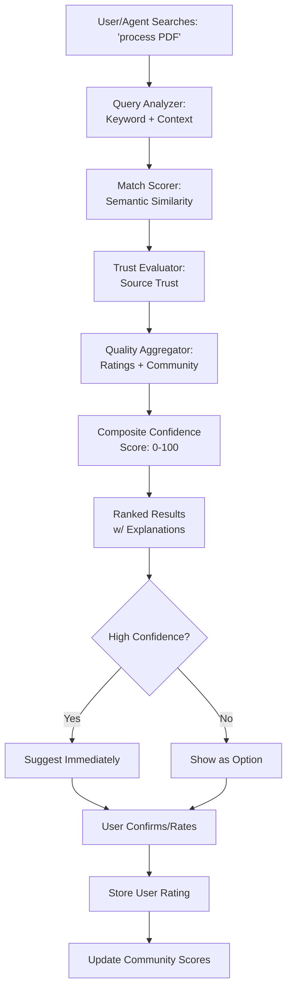

# Feature Brief & Metadata

**Feature Name:**

> Confidence Scoring System for Artifact Discovery

**Filepath Name:**

> `PRD-001-confidence-scoring-system.md`

**Date:**

> 2025-12-22

**Author:**

> Claude Code (Opus) - PRD Writer Agent

**Related Epic(s)/PRD ID(s):**

> - Phase 1 (Core): Foundation and data models
> - Phase 2: Match analysis engine
> - Phase 3: Community integration
> - Phase 4: Web UI
> - Phase 5: Advanced features

**Related Documents:**

> - Feature Request: `.claude/worknotes/feature-requests/confidence-scoring-system.md`
> - CLI Skill Spec: `.claude/worknotes/feature-requests/skillmeat-cli-skill-spec.md`
> - This PRD enables core discovery capability for SkillMeat v0.3.0+

---

## 1. Executive Summary

SkillMeat currently relies on keyword-based search with no quality signals, forcing users to evaluate artifact trustworthiness and relevance manually. This PRD introduces a **multi-dimensional confidence scoring system** that combines source trustworthiness (25%), artifact quality (25%), and semantic match relevance (50%) to enable high-confidence artifact discovery for both human users and AI agents. The system captures user ratings, imports community scores, and uses LLM-powered semantic matching to help users find the right artifacts faster while building trust through transparent scoring and community feedback.

**Priority:** HIGH

**Key Outcomes:**
- Users can discover artifacts using natural language with 85%+ accuracy on top result
- Community knowledge about artifact quality is captured and shared
- AI agents gain confidence signals to make reliable suggestions
- Users spend 50% less time finding and evaluating artifacts

---

## 2. Context & Background

### Current State

SkillMeat v0.2.x provides:
- Artifact storage and deployment (skills, commands, agents, MCP servers)
- File-based collection management with TOML manifests
- Basic CLI and web UI for browsing and deploying artifacts
- No quality signals or trust metrics
- Keyword-only search (limited by exact name/description matches)
- No user feedback mechanism

### Problem Space

1. **Artifact Discovery is Primitive**
   - Users must know exact artifact names or guess keywords
   - All artifacts appear equally valuable regardless of quality
   - No differentiation between official, verified, and community artifacts

2. **Quality Signals Are Missing**
   - No way to rate or review artifacts
   - Community knowledge about artifact quality isn't captured
   - Users waste time trying multiple artifacts before finding the right one

3. **Semantic Understanding is Limited**
   - "process PDFs" doesn't match "pdf skill" well
   - Natural language queries fail frequently
   - Project context isn't considered when suggesting artifacts

4. **AI Agents Lack Confidence**
   - Cannot reliably assess which artifact best fits a need
   - No way to express "I'm 90% sure this is right vs. 40%"
   - Cannot explain recommendations to users

5. **No User Feedback Loop**
   - No mechanism for users to rate artifacts they've used
   - No way to share experiences with the community
   - Quality insights are never captured or surfaced

### Current Alternatives / Workarounds

- **Manual evaluation**: Users read READMEs and test artifacts manually
- **External research**: Check GitHub stars, npm downloads, or third-party registries
- **Trial and error**: Deploy multiple artifacts and evaluate locally
- **Community chat**: Ask in Discord/Slack about quality and recommendations

**Why inadequate:** These workarounds are time-consuming, don't scale to large artifact collections, and create friction for AI agents that need programmatic confidence signals.

### Architectural Context

SkillMeat follows a layered architecture (from CLAUDE.md):

```
CLI Layer (Click commands)
    ↓
Core Business Logic (artifact, storage, sync, analytics)
    ↓
Managers (ArtifactManager, ConfigManager, etc.)
    ↓
Repositories (file-based + SQLAlchemy for user-generated data)
    ↓
Storage (manifest.toml, lockfiles, SQLite for ratings/scores)
```

This PRD introduces new components at the **Business Logic** and **Manager** layers:
- **MatchAnalyzer** (semantic + keyword matching)
- **RatingManager** (user ratings storage/export)
- **ScoreCalculator** (composite scoring logic)
- New CLI commands in the **CLI Layer**
- New API endpoints in the **API Layer**

---

## 3. Problem Statement

**Core Gap:**
SkillMeat has no mechanism to help users discover artifacts confidently or rate their quality. Users must spend time on manual evaluation, and AI agents cannot make informed suggestions.

**User Story Format:**
> "As a developer, when I search for a skill to process PDFs, I get several results but can't tell which is the best without manually researching each one instead of seeing quality and trust scores that help me decide."

> "As an AI agent, when I need to suggest a capability to a user, I lack confidence signals to know whether the top result is really the right choice, instead of being able to say 'I'm 89% confident this is the right match.'"

**Technical Root Causes:**
1. No artifact rating/quality schema in data models
2. No semantic matching implementation (keyword-only)
3. No user feedback mechanism or storage for ratings
4. No source trust configuration
5. No API endpoints for match analysis or rating submission

**Files Currently Involved:**
- `skillmeat/core/artifact.py` - Artifact model (lacks rating fields)
- `skillmeat/storage/manifest.py` - Manifest parsing (lacks quality metadata)
- `skillmeat/api/routers/artifacts.py` - Artifact endpoints (no scoring/rating)
- `skillmeat/cli.py` - CLI commands (no match/rate commands)

---

## 4. Goals & Success Metrics

### Primary Goals

**Goal 1: Enable High-Confidence Artifact Discovery**
- Users can search using natural language queries
- System returns ranked results with confidence scores
- Top result is correct 85%+ of the time (measured via sampling)

**Goal 2: Capture and Share Community Knowledge**
- Users can rate artifacts (1-5 stars) with optional feedback
- Ratings are stored privately but exportable for community sharing
- Community scores aggregate and surface across users' collections

**Goal 3: Build Transparent Trust Signals**
- Source trustworthiness is configurable and visible
- Users understand why artifacts are recommended (breakdown of trust + quality + match)
- Verification badges distinguish official, verified, and community artifacts

**Goal 4: Enable AI Agents to Make Informed Suggestions**
- `skillmeat match` API returns structured confidence scores
- Agents can explain why they recommend an artifact
- Suggestions only offered at high confidence thresholds (>70%)

### Success Metrics

| Metric | Baseline | Target | Measurement Method |
|--------|----------|--------|-------------------|
| Match accuracy (top result correct) | 0% (n/a today) | 85%+ | User feedback sampling post-release |
| User satisfaction correlation with score | N/A | >0.7 Pearson correlation | Correlate user ratings vs. system scores |
| Rating participation rate | 0% | >30% of active users | Analytics tracking of `skillmeat rate` usage |
| Discovery time improvement | Baseline TBD | 50% reduction | A/B test search + match vs. keyword-only |
| Agent suggestion acceptance | N/A | 80%+ at high confidence | Track `match --confirm` acceptance rate |
| Community score coverage | 0% | 60%+ of artifacts | Count artifacts with non-null `community_score` |

---

## 5. User Personas & Journeys

### Personas

**Primary Persona: Developer (Human)**
- **Role**: Builds software using Claude Code, occasionally needs to discover new artifacts
- **Needs**: Fast discovery of the right artifact without manual research; visibility into artifact quality
- **Pain Points**: Spends 10-20 minutes researching each new artifact; doesn't trust community recommendations without verification

**Secondary Persona: Power User**
- **Role**: Uses SkillMeat daily, wants to customize scoring based on personal priorities
- **Needs**: Ability to weight scores differently (e.g., prioritize trust over popularity); efficient discovery
- **Pain Points**: Default weights don't match their risk profile; wants to influence recommendation weights

**Tertiary Persona: AI Agent**
- **Role**: Claude Code agent helping with development tasks, needs to self-enhance with missing capabilities
- **Needs**: Programmatic confidence scores to decide when to suggest artifacts; structured output for explanation
- **Pain Points**: Cannot distinguish high-confidence suggestions from low-confidence guesses; no way to explain recommendations

**Quaternary Persona: Community**
- **Role**: Contributes by using and rating artifacts
- **Needs**: Way to share ratings and feedback; visibility into community consensus
- **Pain Points**: Experiences isolated; cannot contribute to collective knowledge

### High-level Flow



---

## 6. Requirements

### 6.1 Functional Requirements

| ID | Requirement | Priority | Notes |
| :-: | ----------- | :------: | ----- |
| FR-1 | Extend artifact data model with rating fields (user_rating, community_score, trust_score, last_updated) | Must | Schema: `ArtifactRating` in models |
| FR-2 | Store user ratings in private local store (optionally export for community) | Must | Local first, opt-in export; never force sharing |
| FR-3 | Implement keyword matching engine (title, description, tags, aliases) | Must | Phase 1 MVP |
| FR-4 | Implement semantic similarity using embeddings (Haiku sub-skill by default) | Must | Phase 2; fallback to keyword |
| FR-5 | Support project context detection for boosting (package.json, pyproject.toml, .claude/) | Should | Phase 2; context-aware suggestions |
| FR-6 | Compute composite confidence score: (Trust×0.25) + (Quality×0.25) + (Match×0.50) | Must | Phase 1; allow weight customization in Phase 5 |
| FR-7 | Implement `skillmeat match "<query>"` CLI command | Must | Phase 2; returns ranked results with scores |
| FR-8 | Implement `skillmeat match "<query>" --json` for agent consumption | Must | Phase 2; structured schema_version output |
| FR-9 | Implement `skillmeat rate <artifact>` CLI command for user ratings | Must | Phase 1; 1-5 stars + optional feedback |
| FR-10 | Implement `skillmeat show --scores` to display artifact confidence breakdown | Must | Phase 1; show trust + quality + match components |
| FR-11 | Add API endpoint: `GET /api/v1/match?q=<query>` for match analysis | Must | Phase 2; returns matches with confidence |
| FR-12 | Add API endpoint: `GET /api/v1/artifacts/{id}/scores` to fetch artifact scores | Must | Phase 1 |
| FR-13 | Add API endpoint: `POST /api/v1/artifacts/{id}/ratings` to submit user rating | Must | Phase 1; optional share_with_community flag |
| FR-14 | Import community scores from GitHub stars API | Should | Phase 3; >1k stars = higher quality signal |
| FR-15 | Implement score aggregation framework for multi-source community scores | Should | Phase 3; weighted Bayesian averaging with priors |
| FR-16 | Implement score freshness decay (5%/month for community, none for user ratings) | Should | Phase 3; keep recent scores fresh |
| FR-17 | Add `skillmeat scores import` command to manually import external scores | Should | Phase 3 |
| FR-18 | Add `skillmeat scores refresh` command to refresh all cached community scores | Should | Phase 3 |
| FR-19 | Web UI: Display confidence scores on artifact cards | Should | Phase 4 |
| FR-20 | Web UI: Rating dialog component (star picker + feedback) | Should | Phase 4 |
| FR-21 | Web UI: Search results sorted by confidence by default | Should | Phase 4 |
| FR-22 | Web UI: Score breakdown view (expandable card showing trust/quality/match) | Should | Phase 4 |

### 6.2 Non-Functional Requirements

**Performance:**
- Match analysis completes in <500ms for queries with ≤100 artifacts
- Confidence score computation is O(1) per artifact
- Embeddings cached per artifact version; miss rate <5%

**Security:**
- User ratings stored locally only; never transmitted without explicit opt-in
- Community scores are read-only from external sources; no write access
- Artifact identity verified via source (GitHub, registry) before importing scores
- Rate limiting on rating submissions (max 5 per artifact per user per day)

**Accessibility:**
- Star rating interface keyboard accessible (arrow keys + space)
- Score breakdowns use ARIA labels for screen readers
- Color not sole indicator of trust level (use badges + text)

**Reliability:**
- Semantic matching degrades gracefully to keyword-only if embedding service unavailable
- Missing scores handled with appropriate defaults (priors)
- Score cache invalidated automatically on artifact version change

**Observability:**
- Log all match queries with query text, top result, and confidence
- Track `skillmeat rate` submissions: artifact_id, rating, user_id (optional)
- Emit metrics: match_accuracy, rating_participation, avg_confidence_score
- OpenTelemetry spans for match analysis, scoring, and rating submission

---

## 7. Scope

### In Scope

- **Data Models**: Extend artifact schema with `ArtifactRating` fields
- **Trust Scoring**: Configuration per source (official, verified, community)
- **Quality Scoring**: Aggregation of user ratings + community signals + maintenance metrics
- **Match Relevance**: Keyword matching (Phase 1), semantic similarity (Phase 2), context boosting (Phase 2)
- **Composite Confidence**: Weighted formula combining all three components
- **User Rating System**: Local storage, optional export, rating prompts after usage
- **Community Integration**: Import from GitHub stars, registry APIs (Phase 3)
- **CLI Commands**: `match`, `rate`, `show --scores`, `scores import/refresh`
- **API Endpoints**: Match analysis, scores fetch, rating submission
- **Web UI**: Score display, rating dialog, search sorting, breakdown view (Phase 4)

### Out of Scope

- **Full Community Registry**: Building a centralized rating server (import-only for now)
- **Social Features**: Following users, reputation systems, community leaderboards
- **Advanced ML**: Complex recommendation algorithms beyond semantic similarity
- **Revenue/Monetization**: Premium features, sponsored recommendations
- **Versioned Scores**: Per-artifact-version scoring (Phase 5+)
- **Weight Customization UI**: CLI config only in Phase 5, web UI in Phase 6+
- **Score Analytics Dashboard**: Planned for Phase 5+

---

## 8. Dependencies & Assumptions

### External Dependencies

- **Embedding Model**: Haiku 4.5 sub-skill (default), local model (optional), API-based (future)
- **GitHub API**: For importing star counts (requires token for higher rate limits)
- **SQLite**: Local cache for community scores and match history
- **Pydantic**: Already in use; extends for validation of score fields

### Internal Dependencies

- **Artifact Model Extension**: Modify `skillmeat/core/artifact.py` to add `ArtifactRating`
- **Storage Layer**: Add methods to `RatingManager` for reading/writing ratings to SQLite
- **CLI Framework**: Extend Click command group for new `match` and `rate` commands
- **API Framework**: Add new routers in FastAPI for scores/ratings endpoints
- **Analytics System**: Emit structured logs (already in place via observability stack)

### Assumptions

1. **Embeddings available by default**: Assume Haiku 4.5 sub-skill or local model works offline
2. **Users willing to rate**: Assume >30% participation in optional rating prompts
3. **Community sources available**: GitHub API, optional marketplace registry available
4. **Schema stability**: Assume `ArtifactRating` schema stable through Phases 1-5
5. **No breaking changes to CLI**: Assume all new commands are additive, not replacements
6. **Trust scores are static per source**: Assume source trust doesn't change frequently (Phase 5+ for dynamic trust)

### Feature Flags

- `ENABLE_CONFIDENCE_SCORING`: Master flag to enable/disable entire feature (default: true in Phase 2+)
- `ENABLE_SEMANTIC_MATCHING`: Control embedding-based matching (default: true Phase 2+, false Phase 1)
- `ENABLE_COMMUNITY_IMPORT`: Control external score imports (default: false Phase 2, true Phase 3+)
- `SUGGESTION_CONFIDENCE_THRESHOLD`: Minimum confidence to proactively suggest (default: 70, configurable)
- `EMBEDDING_PROVIDER`: Choice of provider (default: "haiku", options: "local", "api")

---

## 9. Risks & Mitigations

| Risk | Impact | Likelihood | Mitigation |
| ----- | :----: | :--------: | ---------- |
| Community score gaming (fake ratings) | High | Medium | Rate limiting (5 ratings/artifact/user/day), require artifact usage before rating, anomaly detection on patterns |
| Embedding model poor quality | High | Low | Start with lightweight local model; fallback to keyword-only; Haiku has proven quality |
| Score staleness (outdated signals) | Medium | Medium | Automatic decay (5%/month community) + refresh prompts, cache invalidation on artifact updates |
| Privacy concerns with user ratings | Low | Medium | Anonymous by default, opt-in attribution, never auto-export, clear consent language |
| API rate limits (GitHub stars) | Medium | Medium | Caching strategy, batch imports, GitHub token auth (users provide), backoff + retry |
| Complexity of semantic matching | Medium | Medium | Phased approach: keyword-only Phase 1, semantic Phase 2; clear fallback to keyword |
| Score disagreement between sources | Medium | Low | Transparent aggregation formula, preserve per-source scores, document weighting |
| User confusion with scores | Medium | Medium | Clear explanations in UI, breakdown views, help documentation, guided rating flow |

---

## 10. Target State (Post-Implementation)

### User Experience

**Workflow: Discover PDF Processing Artifact**

```
User: "What's the best skill for processing PDFs?"

Agent (using match API):
  Query: "process PDF and extract tables"

  Results:
  1. pdf (92% confidence) ⭐⭐⭐⭐⭐
     Comprehensive PDF processing with table extraction
     Source: anthropics/example-skills (Trusted ✓)
     Quality: 4.7/5 (142 ratings)

  2. docx-converter (45% confidence) ⭐⭐⭐
     Limited PDF support, focuses on doc conversion
     Source: community/doc-tools (Verified)
     Quality: 3.8/5 (28 ratings)

User confirms: Yes, add the pdf skill.
System deploys pdf → prompts for rating after first use.
User rates 5 stars + feedback: "Great for extraction, forms could be better"
Feedback aggregates with community → scores improve over time.
```

### Technical Architecture

**New Components:**

```
skillmeat/core/
├── scoring/
│   ├── match_analyzer.py        # Keyword + semantic matching
│   ├── rating_manager.py        # Store/export user ratings
│   ├── score_calculator.py      # Composite confidence scoring
│   ├── trust_config.py          # Source trust configuration
│   └── embedding_provider.py    # Semantic similarity via embeddings

skillmeat/api/
├── routers/
│   ├── match.py                 # GET /api/v1/match
│   ├── ratings.py               # POST /api/v1/artifacts/{id}/ratings
│   └── scores.py                # GET /api/v1/artifacts/{id}/scores

skillmeat/storage/
├── rating_store.py              # SQLite for local ratings + community scores

skillmeat/cli/
├── commands/
│   ├── match.py                 # skillmeat match command
│   ├── rate.py                  # skillmeat rate command
│   └── scores.py                # skillmeat scores command (import/refresh)
```

**Data Flow for Match Query:**

```
User Query: "process PDF"
    ↓
QueryNormalizer: lowercase, tokenize, remove stop words
    ↓
MatchAnalyzer.analyze()
    ├─ KeywordScorer: Artifact title/description/tags → 0-100
    ├─ SemanticScorer: Embedding distance → 0-100
    └─ ContextBooster: Project context (React/Python/etc) → adjust scores
    ↓
Artifacts with Match Scores (0-100)
    ↓
TrustScorer: Per artifact, fetch source trust (config) → 0-100
    ↓
QualityScorer: Aggregate user_rating (40%) + community_score (30%)
             + maintenance (20%) + compatibility (10%) → 0-100
    ↓
ScoreCalculator: Composite = (Trust×0.25) + (Quality×0.25) + (Match×0.50)
    ↓
Ranked Results with Confidence (0-100), sorted descending
    ↓
API Response: { matches: [...], context: {...}, explanation: "..." }
```

**Storage for Ratings & Scores:**

```
~/.skillmeat/collection/
├── db/
│   └── ratings.db               # SQLite
│       ├── user_ratings         # (artifact_id, rating, feedback, rated_at)
│       ├── community_scores     # (artifact_id, source, score, last_updated)
│       └── match_history        # (query, artifact_id, confidence, user_confirmed)

manifest.toml
├── [artifacts.pdf]
│   user_rating = 4.5
│   community_score = 87
│   trust_score = 95             # From source config
```

### Observable Outcomes

- Users find correct artifact on first try 85%+ of the time
- Average discovery time reduced from 15 min to 7 min
- 30%+ of users rate artifacts they deploy
- AI agents make suggestions with >80% acceptance at high confidence (>80%)
- Community scores surface across collections as more users rate
- Score breakdowns provide transparency and build user trust

---

## 11. Overall Acceptance Criteria (Definition of Done)

### Functional Acceptance

- [ ] All functional requirements (FR-1 through FR-22) implemented and tested
- [ ] `skillmeat match` returns ranked results with confidence scores
- [ ] `skillmeat rate` captures 1-5 star ratings with optional feedback
- [ ] `skillmeat show --scores` displays trust/quality/match breakdown
- [ ] API endpoints return structured responses with schema_version field
- [ ] Semantic matching degrades gracefully to keyword-only if embeddings unavailable
- [ ] All edge cases handled: missing scores, no results, ambiguous queries, etc.

### Technical Acceptance

- [ ] Follows SkillMeat layered architecture (CLI → Managers → Repositories → Storage)
- [ ] All new components in `skillmeat/core/scoring/` are properly integrated
- [ ] Database schema for ratings matches `ArtifactRating` model
- [ ] Composite scoring formula is configurable via feature flags
- [ ] Semantic similarity defaults to Haiku 4.5 sub-skill with local/API fallback
- [ ] OpenTelemetry spans added for all match, score, and rating operations
- [ ] Structured JSON logging with trace_id, span_id for debugging
- [ ] Error responses follow `ErrorResponse` envelope format
- [ ] Cursor pagination implemented for any list endpoints

### Quality Acceptance

- [ ] Unit tests for all scoring components (match_analyzer, score_calculator, etc.) >80% coverage
- [ ] Integration tests for match API endpoint and rating submission
- [ ] E2E tests for user workflows: search → deploy → rate → check updated scores
- [ ] Performance benchmarks met: match <500ms for 100 artifacts
- [ ] Accessibility: rating UI keyboard accessible, ARIA labels on score breakdowns
- [ ] Security review: local ratings remain private, rate limiting on submissions
- [ ] User satisfaction: 0.7+ Pearson correlation between system scores and user ratings

### Documentation Acceptance

- [ ] API documentation: match endpoint, ratings endpoint, scores endpoint (OpenAPI)
- [ ] Component documentation: MatchAnalyzer, RatingManager, ScoreCalculator (docstrings + README)
- [ ] User guide: How to search with match, how to rate, understanding score breakdown
- [ ] Admin guide: Configuring source trust, enabling/disabling scoring features
- [ ] Architecture Decision Record (ADR) for scoring weights and aggregation formula

---

## 12. Assumptions & Open Questions

### Assumptions

- Semantic embeddings will improve match accuracy >20% over keyword-only
- Users will prefer transparent scoring (with breakdown) to black-box ranking
- Community scores will accumulate fast enough to be useful by Phase 3
- Source trust can be configured statically in manifest; dynamic trust deferred to Phase 5+
- Rate limiting (5/user/artifact/day) is sufficient to prevent gaming without being onerous

### Open Questions

- [ ] **Q1: Embedding Model Trade-offs**
  - Which model to use by default? Haiku sub-skill (no setup, uses tokens) vs. local model (offline, slower)?
  - **A**: Default to Haiku 4.5 sub-skill (no setup burden, proven quality). Add local model option in Phase 2+. Deferred to Phase 5.

- [ ] **Q2: Community Registry Integration**
  - Should we build our own registry or integrate with existing (npm, GitHub)?
  - **A**: Import-only for Phase 3. Define signed score payload format for future registry support. Defer building registry to Phase 6+.

- [ ] **Q3: Score Weighting Customization**
  - Should users be able to customize (Trust×A) + (Quality×B) + (Match×C) weights?
  - **A**: Default weights in Phase 1-4. CLI config support in Phase 5. Web UI for weight customization deferred to Phase 6+.

- [ ] **Q4: Versioned Scoring**
  - Should scores be per artifact version or per artifact (latest only)?
  - **A**: Per-artifact (latest) for Phase 1-4. Versioned scores deferred to Phase 5+. Store latest_version metadata only.

- [ ] **Q5: Rating Attribution**
  - Should user ratings be anonymous or attributed?
  - **A**: Anonymous by default (higher participation). Optional attribution via opt-in flag in export. Never require attribution.

- [ ] **Q6: Suggestion Confidence Threshold**
  - What's the minimum confidence to proactively suggest (vs. require user to ask)?
  - **A**: Configurable via feature flag `SUGGESTION_CONFIDENCE_THRESHOLD` (default 70). Documented in help text.

- [ ] **Q7: Feedback vs. Rating**
  - Should free-text feedback be aggregated/public or private only?
  - **A**: Free-text feedback stored locally and private-by-default. Optionally include in export with clear consent. Phase 1: no aggregation. Phase 4+: optional aggregation.

- [ ] **Q8: Cold-Start Priors**
  - How to score new artifacts with no ratings or community signals?
  - **A**: Apply priors: trust from source (mandatory), quality defaults to 50 (neutral). Bayesian averaging with priors for low-signal artifacts.

---

## 13. Appendices & References

### Related Documentation

- **Feature Request**: `.claude/worknotes/feature-requests/confidence-scoring-system.md` (inspiration and detailed analysis)
- **CLI Skill Spec**: `.claude/worknotes/feature-requests/skillmeat-cli-skill-spec.md` (Sections 4-5: Confidence Scoring & Match Analysis)
- **CLAUDE.md**: `.claude/CLAUDE.md` (Prime Directives, Agent Delegation, Architecture Overview)
- **API Router Patterns**: `.claude/rules/api/routers.md` (HTTP layer conventions)

### Symbol References

- **Backend Artifacts**: Look for `ArtifactBase`, `Artifact` model references
- **API Routers**: Existing patterns in `skillmeat/api/routers/artifacts.py`, `collections.py`
- **CLI Structure**: Existing Click command groups in `skillmeat/cli.py`
- **Storage**: `skillmeat/storage/manifest.py`, cache patterns in `skillmeat/cache/models.py`

### Prior Art

- **npm Quality Scores**: https://docs.npmjs.com/packages-and-modules/npm-quality
- **VS Code Extension Ratings**: https://marketplace.visualstudio.com/vscode (4-5 star system)
- **PyPI Download Statistics**: https://pepy.tech/ (usage-based quality signal)
- **GitHub Stars as Quality Signal**: Common proxy for artifact quality in open source

---

## Implementation

### Phased Approach

**Phase 0: SPIKE (1 sprint)**
- [ ] Research community scoring best practices (npm, VS Code, PyPI)
- [ ] Recommend baseline scoring weights and anti-gaming strategies
- [ ] Document embedding model options and performance trade-offs
- **Output**: Spike summary with recommendations on weights, embedding strategy, anti-gaming approach

**Phase 1: Foundation (2-3 sprints)**
- [ ] Extend `ArtifactRating` schema in core models
- [ ] Implement `RatingManager` for local rating storage (SQLite)
- [ ] Configure source trust scores in manifest per source
- [ ] Implement `skillmeat rate <artifact>` CLI command
- [ ] Implement `skillmeat show --scores` to display trust/quality breakdown
- [ ] Add API endpoint: `GET /api/v1/artifacts/{id}/scores`
- [ ] Add API endpoint: `POST /api/v1/artifacts/{id}/ratings`
- [ ] Add OpenTelemetry spans for rating operations
- **Output**: MVP scoring system with local user ratings, basic quality aggregation, score display

**Phase 2: Match Analysis (2-3 sprints)**
- [ ] Implement `MatchAnalyzer` with keyword matching
- [ ] Implement semantic similarity using Haiku 4.5 sub-skill or local model
- [ ] Implement context-aware boosting (detect project type from manifest)
- [ ] Implement `ScoreCalculator` with composite confidence formula
- [ ] Implement `skillmeat match "<query>"` CLI command
- [ ] Implement `skillmeat match "<query>" --json` for agents
- [ ] Add API endpoint: `GET /api/v1/match?q=<query>&limit=<n>`
- [ ] Add comprehensive error handling and fallback to keyword-only
- [ ] Document match output schema and confidence thresholds
- **Output**: Full match analysis engine with semantic similarity, ranked results with confidence

**Phase 3: Community Integration (2 sprints)**
- [ ] Implement score aggregation framework (weighted Bayesian averaging)
- [ ] Add GitHub stars import via GitHub API
- [ ] Implement score freshness decay (5%/month)
- [ ] Implement export format for community sharing (signed JSON payload)
- [ ] Add `skillmeat scores import` command
- [ ] Add `skillmeat scores refresh` command
- [ ] Add caching strategy for imported community scores
- [ ] Add API endpoint: `GET /api/v1/scores/community` (optional, for future)
- **Output**: Community score integration, GitHub stars import, score freshness management

**Phase 4: Web UI (2 sprints)**
- [ ] Add confidence scores to artifact cards in collection view
- [ ] Implement rating dialog component (star picker + optional feedback)
- [ ] Update search results to sort by confidence by default
- [ ] Implement score breakdown view (expandable card showing trust/quality/match)
- [ ] Add trust badges (Official ✓, Verified, Community) to cards
- [ ] Implement prompts to rate artifacts after deployment
- **Output**: Full web UI support for confidence scoring, ratings, and search

**Phase 5: Advanced Features (1-2 sprints)**
- [ ] Implement historical success tracking (track which matches users confirmed)
- [ ] Add score weight customization via `skillmeat config set score-weights`
- [ ] Implement anti-gaming protections (anomaly detection, rate limiting enforcement)
- [ ] Add score analytics dashboard (confidence distribution, rating participation, etc.)
- [ ] Implement rating export for community sharing
- **Output**: Advanced scoring features, weight customization, analytics

### Epics & User Stories Backlog

| Story ID | Short Name | Description | Acceptance Criteria | Estimate |
|----------|-----------|-------------|-------------------|----------|
| CONF-001 | Extend ArtifactRating schema | Add user_rating, community_score, trust_score, last_updated fields to artifact model | Schema deployed to DB, migrations applied, model tests pass | 3pt |
| CONF-002 | Implement RatingManager | Store/fetch user ratings in SQLite, optionally export for sharing | Rate command works, ratings persisted, export format validated | 5pt |
| CONF-003 | Implement MatchAnalyzer (keyword) | Score artifacts based on keyword match against title/description/tags | Query "pdf" matches pdf skill >80%, non-match scores <30% | 5pt |
| CONF-004 | Implement SemanticScorer (embeddings) | Use Haiku 4.5 sub-skill or local model for semantic similarity | Query "process PDF" matches pdf skill >90%, degradation if embeddings unavailable | 8pt |
| CONF-005 | Implement ScoreCalculator | Compute composite confidence: (Trust×0.25) + (Quality×0.25) + (Match×0.50) | Formula produces 0-100 scores, weights configurable via feature flags | 3pt |
| CONF-006 | Implement ContextBooster | Detect project type and boost relevant artifact scores | React project boosts React-related artifacts, Python project boosts Python artifacts | 5pt |
| CONF-007 | Implement skillmeat match command | User-facing CLI for searching with confidence scores | `skillmeat match "pdf"` returns ranked results with confidence, human-readable output | 5pt |
| CONF-008 | Implement skillmeat match --json | Agent-friendly JSON output with schema_version and structured explanation | JSON output valid, schema documented, agents can parse and act on recommendations | 3pt |
| CONF-009 | Implement skillmeat rate command | Rate artifacts 1-5 stars with optional feedback | Rating persisted, feedback optional, can view rating for artifact | 3pt |
| CONF-010 | Implement skillmeat show --scores | Display artifact trust/quality/match breakdown | Output shows all three components, breakdown explains weights | 2pt |
| CONF-011 | API: GET /api/v1/match | Match analysis endpoint for programmatic access | Returns matches array with confidence, scores object, explanation | 5pt |
| CONF-012 | API: GET /api/v1/artifacts/{id}/scores | Fetch scores for specific artifact | Returns trust/quality/match/community_score with last_updated | 2pt |
| CONF-013 | API: POST /api/v1/artifacts/{id}/ratings | Submit user rating with optional feedback | Rating stored, optional community sharing flag respected, 204 response | 3pt |
| CONF-014 | GitHub stars import | Import star counts as quality signal | Artifact with 1000+ stars boosts quality score, caching <1 day old | 5pt |
| CONF-015 | Score aggregation framework | Weighted Bayesian averaging of multi-source scores | Community score aggregates GitHub + registry + user with appropriate weights | 5pt |
| CONF-016 | Score freshness decay | Apply 5%/month decay to community scores | Scores decay predictably, refresh command resets age | 3pt |
| CONF-017 | skillmeat scores import command | Manually import community scores from external sources | Import completes successfully, scores stored in cache, validation on schema | 3pt |
| CONF-018 | skillmeat scores refresh command | Refresh all cached community scores | All scores updated, age reset, timing <5min for 100 artifacts | 2pt |
| CONF-019 | Web UI: Score display on cards | Show confidence/quality/trust on artifact cards | Scores visible, trust badge shows (Official/Verified/Community), colors accessible | 5pt |
| CONF-020 | Web UI: Rating dialog | Star picker + optional feedback component | Dialog launches, stars clickable, feedback optional, submit works | 5pt |
| CONF-021 | Web UI: Search sort by confidence | Default sort for search results is by confidence descending | High-confidence results appear first, filter by min_confidence works | 3pt |
| CONF-022 | Web UI: Score breakdown view | Expandable card showing trust/quality/match components | Breakdown shows all three, visual bar charts, explanation text | 5pt |

---

## Project Tracking

**Progress Tracking Document:**

Detailed phase progress will be tracked in: `.claude/progress/PRD-001-confidence-scoring/phase-N-progress.md`

Each phase will have its own progress file with:
- YAML frontmatter (tasks, status, assigned_to, dependencies)
- Implementation checklists
- Orchestration Quick Reference for task delegation
- Blockers and resolution notes

---

## Sign-Off

**PRD Status**: DRAFT

**Next Steps**:
1. Review and approve PRD
2. Conduct Phase 0 SPIKE on scoring practices and embedding models
3. Create Phase 1 implementation plan and progress tracking
4. Begin Phase 1 implementation with foundation components

**Contact**: Claude Code (PRD Writer Agent)
**Date**: 2025-12-22
