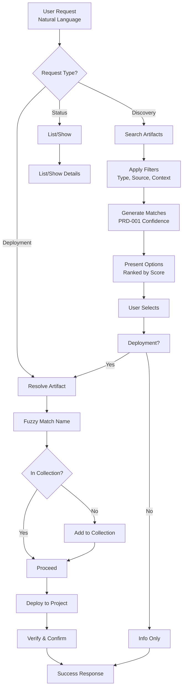

# Feature Brief & Metadata

**Feature Name:**
> SkillMeat CLI Skill - Natural Language Artifact Management Interface

**Filepath Name:**
> `PRD-002-skillmeat-cli-skill`

**Date:**
> 2025-12-22

**Author:**
> Opus 4.5 (Anthropic)

**Related Epic(s)/PRD ID(s):**
> - PRD-001: Confidence Scoring System (dependency)
> - SPIKE: SkillMeat CLI Skill Specification (source)

**Related Documents:**
> - `.claude/worknotes/feature-requests/skillmeat-cli-skill-spec.md`
> - `.claude/skills/planning/templates/prd-template.md`
> - `skillmeat/CLAUDE.md` (architecture reference)
> - `.claude/rules/api/routers.md` (API patterns)
> - `.claude/rules/web/api-client.md` (frontend patterns)

---

## 1. Executive Summary

The SkillMeat CLI Skill transforms how users and AI agents interact with Claude Code artifact management. It provides a natural language interface to the 86+ SkillMeat CLI commands, enabling conversational artifact discovery, one-step deployment, and intelligent capability recommendations—reducing command memorization burden and enabling self-enhancement workflows for AI agents.

**Priority:** HIGH

**Key Outcomes:**
- Users discover and deploy artifacts via natural language in <10 seconds (vs. 2-5 minutes with direct CLI)
- AI agents can autonomously identify capability gaps and suggest relevant artifacts with >85% accuracy
- Agents can enhance their own environments with explicit user permission (no auto-deploy)
- Integration with PRD-001 confidence scoring enables context-aware matching and trust-based recommendations

---

## 2. Context & Background

### Current State

SkillMeat CLI provides comprehensive artifact management:
- 86+ commands across 13 groups (search, add, deploy, remove, sync, bundle, etc.)
- Full manifest/lock file management
- Deployment to per-project and user-scoped collections
- Version control and pinning support
- GitHub and local artifact sources

However, the CLI requires users to remember:
- Exact command syntax (e.g., `skillmeat add skill anthropics/skills/pdf@latest`)
- Parameter flags and their meanings
- Project context and scope handling
- Artifact naming and source conventions

### Problem Space

**For Human Users:**
- Casual users must memorize syntax or repeatedly reference help documentation
- Onboarding barrier: Users ask "What's available?" but must run `skillmeat search --type skill` repeatedly
- Error recovery: When commands fail, users may not understand why (ambiguous names, missing fields)
- Discovery friction: Finding the right artifact requires multiple searches with different queries

**For AI Agents:**
- Cannot easily discover artifacts needed for tasks (no semantic search interface)
- Cannot proactively recommend capabilities during SDLC (no context-aware matching)
- Must implement artifact discovery inline, duplicating logic across agents
- Self-enhancement (asking agents to "set yourself up for React") impossible without direct CLI invocation

### Current Alternatives / Workarounds

1. **Direct CLI invocation**: Agents execute `skillmeat` commands directly; requires shell access, error handling complex
2. **Manual browsing**: Users visit SkillMeat registry or artifact READMEs; slow and error-prone
3. **Hardcoded recommendations**: Agents suggest fixed artifact lists; not context-aware, maintenance burden
4. **Collection templates**: Pre-built collections for common tasks; requires explicit selection, not dynamic

### Architectural Context

SkillMeat follows a layered architecture:
- **CLI Layer** (`skillmeat/cli.py`): Click commands for all operations
- **Core Layer** (`skillmeat/core/`): Business logic (artifact, deployment, sync, analytics)
- **API Layer** (`skillmeat/api/`): FastAPI backend with schemas, managers, repositories
- **Web Layer** (`skillmeat/web/`): Next.js UI for collection management
- **Sources** (`skillmeat/sources/`): GitHub, local, marketplace artifact resolvers

This PRD introduces a **Skill Layer** that wraps core workflows in a natural language-accessible interface for human users and AI agents.

---

## 3. Problem Statement

Users and agents struggle to leverage SkillMeat's full capability due to CLI friction. Natural language interaction would:
1. **Reduce discovery time**: "What skills work with PDFs?" instead of `skillmeat search pdf --json`
2. **Enable context-aware matching**: System understands "I'm building a React app" and suggests React-specific artifacts
3. **Support agent self-enhancement**: Agents can ask permission to add artifacts without direct CLI calls
4. **Integrate with development workflow**: Suggestion capability fits naturally into agent task assistance

**User Story Format:**
> "As a human developer, when I ask 'What's the best way to process PDFs?' I receive relevant artifact suggestions ranked by quality and compatibility instead of having to run CLI commands and parse JSON output."

> "As an AI agent working on a feature, when I identify a missing capability (e.g., 'I need to validate YAML'), I can search the artifact registry, explain my findings to the user, and deploy with explicit permission instead of failing silently."

---

## 4. Goals & Success Metrics

### Primary Goals

**Goal 1: Eliminate Command Memorization**
- Users discover and execute common workflows through conversational interface
- <10 second discovery time for common requests
- Zero need to reference CLI help documentation for discovery/deployment workflows

**Goal 2: Enable AI Agent Capability Discovery**
- Agents can identify relevant artifacts for development tasks
- Match accuracy >85% (top result solves user's stated need)
- Confidence scores inform suggestion thresholds (no suggestions below 70%)

**Goal 3: Support AI Agent Self-Enhancement**
- Agents can autonomously search for and propose artifacts
- Explicit user permission required (never auto-deploy)
- Clear communication of what will be deployed before confirmation

**Goal 4: Integrate with PRD-001 Confidence Scoring**
- Match API provides composite scores from trust, quality, and relevance dimensions
- Context-aware matching boosts relevant artifacts based on project type
- User ratings contribute to quality scores (participatory feedback loop)

### Success Metrics

| Metric | Baseline | Target | Measurement Method |
|--------|----------|--------|-------------------|
| Command discovery time (NL vs CLI) | 2-5 min CLI | <10 sec NL | User task completion time |
| Deployment success rate | N/A (new) | >95% | Successful deployments / attempts |
| Error message clarity | N/A (new) | 80% self-resolve | User satisfaction survey |
| Capability gap detection accuracy | N/A (new) | >85% | Top result solves stated need |
| Suggestion acceptance rate | N/A (new) | >85% | Accepted suggestions / total |
| False positive rate | N/A (new) | <10% | Irrelevant suggestions / total |
| Match relevance (confidence correlation) | N/A (new) | >70% correlation | Pearson correlation: score vs user satisfaction |
| Community score coverage | N/A (new) | >60% artifacts | Artifacts with ratings / total |

---

## 5. User Personas & Journeys

### Persona 1: Human Developer (Casual)

**Role:** Occasional Claude Code user who doesn't use SkillMeat frequently

**Needs:**
- Quick discovery of artifacts for specific problems
- Clear descriptions and compatibility information
- One-step deployment without syntax memorization

**Pain Points:**
- Doesn't remember CLI command syntax
- Uncertainty about which artifact to use
- Long time to discover vs solving the actual problem

**Example Journey:**
```
User: "I need to work with PDFs. What options are available?"
→ Skill finds pdf, xlsx, and docx skills
→ Presents top match (pdf) with description and quality rating
→ User confirms: "Yes, add that to my project"
→ Artifact deployed; user receives confirmation with usage examples
```

### Persona 2: Human Developer (Power User)

**Role:** Frequent SkillMeat user, wants speed and automation

**Needs:**
- Quick access to common operations via aliases (claudectl)
- JSON output for scripting and integration
- Smart defaults (infer type, project, collection)

**Pain Points:**
- CLI verbosity even for common operations
- Repeating flags for same defaults
- Limited discoverability of community artifacts

**Example Journey:**
```
User: claudectl add react-testing
→ Skill infers type=skill, source=anthropics
→ Resolves fuzzy match to react-testing-library
→ Adds to collection and deploys to current project
→ Returns JSON with deployment details
```

### Persona 3: AI Agent (Development Assistant)

**Role:** Claude Code agent assisting with development tasks

**Needs:**
- Discover artifacts that solve identified problems
- Understand artifact compatibility and quality
- Present recommendations to user with context

**Pain Points:**
- No built-in artifact discovery mechanism
- Forced to implement matching logic in task code
- Cannot recommend without breaking task focus

**Example Journey:**
```
Agent analyzing code: "This service needs database migrations"
→ Skill search: "database migration tool"
→ Returns: alembic skill (92% confidence, anthropics/official)
→ Agent: "I found a skill that would help—alembic. Would you like me to add it?"
→ User approves
→ Agent deploys and integrates into task
```

### Persona 4: AI Agent (Self-Enhancement)

**Role:** Agent asked to expand its own capabilities

**Needs:**
- Autonomously discover relevant artifact bundles
- Communicate deployment plan clearly to user
- Confirm before making changes

**Pain Points:**
- Cannot set itself up for specific domains (React, Python, etc.)
- Users must manually manage agent environments
- No way to create reproducible capability snapshots

**Example Journey:**
```
User: "Set yourself up for React development"
→ Agent analyzes project (.claude/, package.json)
→ Searches: "React", "React testing", "React documentation"
→ Plans deployment: [react-expert skill, jest-runner, storybook-expert]
→ Shows user: "I found 3 skills that would help. Here's what I'll deploy..."
→ User confirms
→ Agent deploys and verifies; offers next steps
```

### High-level Flow



---

## 6. Requirements

### 6.1 Functional Requirements

| ID | Requirement | Priority | Notes |
| :-: | ----------- | :------: | ----- |
| FR-1 | Skill accepts natural language requests for artifact discovery | Must | Examples: "What's available for PDFs?", "Best React testing skill?" |
| FR-2 | Skill resolves artifact queries to specific artifacts with >85% accuracy | Must | Depends on PRD-001 confidence scoring |
| FR-3 | Skill supports fuzzy artifact name matching (e.g., "pdf" → "ms-office:pdf") | Must | Confidence threshold gates auto-resolution |
| FR-4 | Skill presents search results ranked by confidence score from PRD-001 | Must | Shows trust, quality, match scores and explanations |
| FR-5 | Skill can deploy artifacts to current project with user confirmation | Must | "Add skill X to this project" workflow |
| FR-6 | Skill can add artifacts to user collection | Must | Pre-deployment collection management |
| FR-7 | Skill supports `claudectl` alias with smart defaults | Should | Phase 2; Option A (shell alias recommended) |
| FR-8 | Skill analyzes project context (package.json, pyproject.toml, .claude/) | Should | Phase 2; Enables context-aware recommendations |
| FR-9 | Skill can create and manage artifact bundles | Should | Phase 3; For sharing capability snapshots |
| FR-10 | Skill provides deployment plan (what will be created/modified) | Must | Security: show before executing |
| FR-11 | Skill can list deployed artifacts in current project | Must | "What's deployed here?" workflow |
| FR-12 | Skill shows artifact quality ratings and community scores | Must | Display metric from PRD-001 |
| FR-13 | Skill supports user rating artifacts (1-5 stars) | Should | Phase 2; Enables quality score improvement |
| FR-14 | Skill respects AI agent constraints (no auto-deploy, explicit permission) | Must | Security critical |
| FR-15 | Skill can undeploy or remove artifacts with confirmation | Should | Phase 2; Collection management |
| FR-16 | Skill integrates with existing agents for recommendations | Should | Phase 3; Works with codebase-explorer, ui-engineer, etc. |

### 6.2 Non-Functional Requirements

**Performance:**
- Artifact search returns results in <2 seconds (JSON query + filtering)
- Confidence scoring computes in <1 second per artifact
- Deployment operations complete in <30 seconds
- Fuzzy matching resolves ambiguity in <500ms

**Security:**
- Never deploy without explicit user confirmation
- Warn on unsigned bundles or unknown sources
- Validate artifact sources against manifest allowlist
- Log all deployments with user/agent context
- Respect AI agent constraint: no auto-deployment

**Reliability:**
- Graceful fallback if confidence API unavailable (keyword-only matching)
- Handle network failures during artifact fetch
- Retry logic for transient errors
- Clear error messages for unresolvable requests

**Observability:**
- OpenTelemetry spans for search, deploy, and artifact resolution
- Structured JSON logs with trace_id, request_id, user_id/agent_id
- Metrics: search latency, match confidence distribution, deployment success rate
- Error tracking with artifact context

**Accessibility:**
- All text responses screen-reader compatible
- ASCII-compatible output (no Unicode box-drawing)
- Clear hierarchical presentation of results
- Consistent terminology and formatting

---

## 7. Scope

### In Scope

- **Phase 1 (MVP):**
  - SKILL.md definition with discovery and deployment workflows
  - Natural language query parsing and intent classification
  - Artifact search with confidence scoring (via PRD-001)
  - Deployment workflow with plan presentation and confirmation
  - Basic project context analysis (detect project type from files)
  - Command quick reference documentation
  - Human user support (conversational requests)

- **Phase 2:**
  - AI agent integration (capability gap detection)
  - Project context analysis (package.json, pyproject.toml, .claude/)
  - User artifact rating system (1-5 stars)
  - Skill-based artifact recommendations
  - `claudectl` alias wrapper script (Option A)

- **Phase 3:**
  - Bundle management (create, import, export)
  - Collection templates with curated artifacts
  - Self-enhancement workflow for agents
  - Integration with existing agents

### Out of Scope

- **PRD-003 (claudectl Advanced):** Advanced shell alias features (tab completion, shell integration)
- **PRD-001 Implementation:** Confidence scoring engine itself (separate PRD)
- **Marketplace Features:** Claude marketplace integration (future phase)
- **Web UI:** Skill is CLI-focused; web UI has separate implementation
- **Version Management:** Advanced semver resolution (defer to existing `skillmeat` CLI)
- **Private Repository Support:** Assume public GitHub sources (auth via token if configured)

---

## 8. Dependencies & Assumptions

### External Dependencies

- **PRD-001 (Confidence Scoring System):** REQUIRED
  - Provides match API: `skillmeat match "<query>" --json`
  - Returns composite confidence scores (trust, quality, match)
  - Enables context-aware artifact ranking
  - Status: In progress; skill depends on final API contract

- **SkillMeat CLI:** REQUIRED
  - CLI version 0.3.0+ with `search`, `add`, `deploy`, `list` commands
  - Must support `--json` output for machine parsing
  - Must be installed in user environment

- **Claude Code Runtime:** REQUIRED
  - Skill execution engine with file access and shell capability
  - Environment variables: `$PWD`, `$HOME`, project detection
  - API access for confidence scoring (if implemented as external service)

### Internal Dependencies

- **skillmeat/sources/:** Artifact source resolution (GitHub, local, marketplace)
- **skillmeat/core/manifest:** Manifest parsing and validation
- **skillmeat/core/deployment:** Deployment logic (atomic moves, verification)
- **skillmeat/api/schemas:** Request/response models for confidence scoring

### Assumptions

- **PRD-001 is implemented and available:** Skill assumes match API returns structured confidence scores
- **SkillMeat CLI is installed and functional:** User environment has `skillmeat` command available
- **Project context is available:** Skill can detect project type via `package.json`, `pyproject.toml`, `.claude/` directory
- **Users have write access to project:** Deployment assumes ability to modify `.claude/` directory
- **No authentication required initially:** GitHub token optional; public repos work without it
- **Agents have explicit permission:** AI agents cannot deploy without user confirmation
- **Artifact sources are trusted:** Assume official `anthropics/*` sources; warn on community sources
- **Skill context is fresh:** Assume skill has access to latest manifest and artifact metadata

### Feature Flags

- **SKILLMEAT_MATCH_API_ENABLED:** Toggle confidence scoring (fallback to keyword matching)
- **SKILLMEAT_AGENT_SUGGESTIONS_ENABLED:** Enable/disable proactive recommendations for agents
- **SKILLMEAT_CLAUDECTL_ENABLED:** Enable claudectl alias (Phase 2)
- **SKILLMEAT_AUTO_RATE_ENABLED:** Prompt users for ratings after deployment (Phase 2)

---

## 9. Risks & Mitigations

| Risk | Impact | Likelihood | Mitigation |
| ----- | :----: | :--------: | ---------- |
| PRD-001 (confidence scoring) not ready in time | HIGH | MED | Implement fallback keyword-only matching; schedule blocker review at sprint planning |
| Artifact name ambiguity causes user confusion | MED | HIGH | Set confidence threshold (>70%) before auto-resolving; present alternatives if ambiguous |
| Agents auto-deploy without permission | CRITICAL | LOW | Design explicit confirmation flow; unit test all agent paths; code review security scenarios |
| Poor artifact match quality (false positives) | HIGH | MED | Start with high confidence threshold (>80%); gather user feedback; iterate scoring weights |
| Search performance degrades with large registries | MED | MED | Cache embeddings per artifact version; implement TTL-based invalidation; profile match API |
| Users deploy incompatible artifacts | MED | LOW | Show compatibility warnings; check Claude Code version constraints; test in CI |
| Community scores become outdated | LOW | HIGH | Implement weekly sync from external sources; set score decay and refresh triggers |
| Skill context diverges from user's .claude/ directory | MED | LOW | Refresh context before deployment; warn if .claude/ modified during execution |

---

## 10. Target State (Post-Implementation)

### User Experience

**Discovery Workflow:**
```
User: "What skills help with React?"
Skill: "I found 3 React-related skills:
  1. react-expert (94% match) - Full React development
  2. react-testing-library (88% match) - Component testing
  3. nextjs-accelerator (82% match) - Next.js framework
  Would you like details on any of these?"
```

**Deployment Workflow:**
```
User: "Add the pdf skill to my project"
Skill: "Found pdf skill (anthropics/skills/pdf). Deploy to current project?
  Files to create: .claude/skills/pdf/
  Estimated size: 2.3 MB
  [Confirm / Cancel]"
[User confirms]
Skill: "Successfully deployed pdf skill. You can now use it in your Claude Code sessions."
```

**Agent Capability Assistance:**
```
Agent (during task): "I notice this task would benefit from the 'alembic' migration skill.
  Should I add it to your project?"
User: "Yes, please"
Agent: "Deploying alembic skill... Done. I can now help with database migrations."
```

### Technical Architecture

**Skill Structure:**
- SKILL.md: Core skill definition with workflows
- workflows/: Modular workflow implementations (discovery, deployment, management, self-enhancement)
- references/: Command guides and artifact catalogs
- scripts/: Project analysis and utility functions
- templates/: Manifest templates for bundles

**Integration Points:**
```
Skill (Natural Language)
├── skillmeat CLI (command execution)
├── PRD-001 Confidence API (matching)
├── Existing agents (recommendations)
└── Project context (.claude/, package.json, etc.)
```

**Data Flow:**
```
User Request → Intent Classification → Search Query → Confidence Scoring → Rank Results → Present + Confirm → Execute
```

### Observable Outcomes

- Users complete artifact discovery in <10 seconds vs. 2-5 minutes with CLI
- AI agents proactively suggest relevant artifacts (>85% accuracy)
- Community participation in artifact ratings improves scoring quality
- Deployment success rate >95%
- Error message clarity enables 80% of users to self-resolve issues

---

## 11. Overall Acceptance Criteria (Definition of Done)

### Functional Acceptance

- [ ] Skill SKILL.md implements discovery, deployment, management, and self-enhancement workflows
- [ ] Natural language queries resolve to artifacts with >85% accuracy (top result)
- [ ] Confidence scoring integration returns trust, quality, and match components
- [ ] Deployment plan is shown before execution (preview with files to create/modify)
- [ ] User confirmation required for all mutations (add, deploy, remove)
- [ ] Project context (package.json, pyproject.toml, .claude/) is analyzed and used for boosting
- [ ] Fuzzy name matching handles common abbreviations (pdf, xlsx, react, etc.)
- [ ] Error handling covers network failures, ambiguous requests, unresolvable artifacts
- [ ] Skill provides clear next steps after deployment (usage examples, related artifacts)

### Technical Acceptance

- [ ] Follows skill structure: SKILL.md + workflows/ + references/ + scripts/
- [ ] SKILL.md frontmatter includes name, description, trigger conditions
- [ ] All workflows reference concrete `skillmeat` CLI commands with examples
- [ ] Integration with PRD-001 match API verified (or fallback documented)
- [ ] Project context analysis parses package.json, pyproject.toml, .claude/manifest.toml
- [ ] Deployment plan uses atomic operations (temporary directory, validate, move)
- [ ] AI agent paths never auto-deploy (explicit confirmation required)
- [ ] OpenTelemetry spans cover search, match, deploy operations
- [ ] Structured JSON logging with trace_id, request_id, user_id/agent_id

### Quality Acceptance

- [ ] Workflow documentation is clear and actionable (no ambiguous instructions)
- [ ] Quick reference guides cover 80/20 commands
- [ ] Error messages are specific and suggest resolution steps
- [ ] Example commands work end-to-end in test project
- [ ] Human user testing: <10 sec discovery time for common queries
- [ ] Agent testing: >85% accuracy on capability matching scenarios
- [ ] Security review: No auto-deploy, proper confirmation flows, source validation

### Documentation Acceptance

- [ ] SKILL.md explains trigger conditions and workflow steps
- [ ] Workflow files include inline examples for each step
- [ ] Command quick reference maps NL intent → CLI command
- [ ] Artifact catalog describes popular skills, commands, agents
- [ ] Project analysis script documented with context signals
- [ ] Integration guide for existing agents (how to use match API)

---

## 12. Assumptions & Open Questions

### Assumptions

- PRD-001 confidence scoring API is completed and available as `skillmeat match`
- SkillMeat CLI 0.3.0+ supports `--json` output for all relevant commands
- Project context detection works via standard files (package.json, pyproject.toml)
- Agents have permission to read project structure and write to .claude/
- Community ratings will improve over time as users provide feedback
- Skill execution environment has network access (for GitHub artifact sources)
- Shell alias (claudectl) implementation uses bash/zsh wrapper, not separate entry point

### Open Questions

- [ ] **Q1**: What's the minimum confidence threshold for suggesting artifacts?
  - **A**: Start with 70% (conservative); make configurable via `skillmeat config set suggestion-threshold`

- [ ] **Q2**: Should agents proactively suggest or only respond when asked?
  - **A**: Phase 1 (conversational only); Phase 2 (proactive with confirmation); never auto-deploy

- [ ] **Q3**: How should fuzzy name matching handle ambiguity (e.g., "pdf" could match pdf, pdfplumber, pdf-extract)?
  - **A**: Show top 3 matches ranked by confidence; require selection if confidence is similar

- [ ] **Q4**: Should collection be user-scoped (global) or project-scoped (local)?
  - **A**: Default to project-scoped (.claude/); allow `--collection user` for user scope

- [ ] **Q5**: Will rating data be synced with central registry for community scoring?
  - **A**: Phase 3+; Phase 1 keeps ratings local only; opt-in export in Phase 2

- [ ] **Q6**: How often should community scores be refreshed?
  - **A**: Weekly sync from external sources; per-source cache TTL; user can force `skillmeat scores refresh`

- [ ] **Q7**: Should the skill handle version pinning (e.g., pdf@1.2.0)?
  - **A**: Phase 1 uses `@latest`; Phase 2 adds version selection for power users

- [ ] **Q8**: What happens if `skillmeat` CLI is not installed?
  - **A**: Fail with clear error: "SkillMeat CLI not found. Install with: pip install skillmeat"

---

## 13. Appendices & References

### Related Documentation

- **Source Spec:** `.claude/worknotes/feature-requests/skillmeat-cli-skill-spec.md`
- **Architecture:** `skillmeat/CLAUDE.md` (prime directives, design patterns)
- **API Patterns:** `.claude/rules/api/routers.md` (HTTP layer design)
- **Web Patterns:** `.claude/rules/web/api-client.md`, `.claude/rules/web/hooks.md`
- **Debugging Rules:** `.claude/rules/debugging.md` (symbol-first investigation)

### Related PRDs

- **PRD-001:** Confidence Scoring System (dependency; provides match API)
- **PRD-003:** claudectl Alias (future; builds on Skill Phase 1-2)

### Symbol References

**Backend Symbols (from ai/symbols-backend.json):**
- `SkillMeat.search()` - Artifact search function
- `SkillMeat.deploy()` - Deployment function
- `ArtifactManager` - Core artifact business logic
- `DeploymentManager` - Deployment orchestration

**Frontend/Skill Symbols (relevant for implementation):**
- SKILL.md structure (name, description, triggers)
- Workflow markdown format (step-by-step instructions)
- Integration pattern with existing agents

### Prior Art & Research

- **SkillMeat CLI Specification (v0.2.0):** `.claude/worknotes/feature-requests/skillmeat-cli-skill-spec.md`
- **Confidence Scoring Research:** PRD-001 (related, in progress)
- **Human-AI Collaboration:** Agent constraint design inspired by AI safety best practices
- **Natural Language Interfaces:** Conversational command mapping patterns from CLI tool design

---

## Implementation

### Phased Approach

**Phase 1: Core Skill (MVP) — 2 weeks**
- Duration: 2 weeks (Dec 23 - Jan 5)
- Deliverables:
  - [ ] SKILL.md with discovery and deployment workflows
  - [ ] Command quick reference (condensed guide)
  - [ ] Basic project analysis (detect project type)
  - [ ] Artifact search with confidence scoring (via PRD-001)
  - [ ] Deployment workflow with plan + confirmation
  - [ ] Test on human user scenarios

**Phase 2: AI Agent Integration & Power User Features — 2 weeks**
- Duration: 2 weeks (Jan 6 - Jan 19)
- Deliverables:
  - [ ] Capability gap detection for agents
  - [ ] Project context analysis (package.json, pyproject.toml, .claude/)
  - [ ] User artifact rating system (1-5 stars)
  - [ ] `claudectl` wrapper script (Phase 2)
  - [ ] Integration tests with existing agents
  - [ ] Test on agent self-enhancement scenarios

**Phase 3: Advanced Features — 2 weeks**
- Duration: 2 weeks (Jan 20 - Feb 2)
- Deliverables:
  - [ ] Bundle management (create, import, export)
  - [ ] Collection templates
  - [ ] Self-enhancement workflow refinement
  - [ ] Integration with codebase-explorer, ui-engineer-enhanced
  - [ ] End-to-end testing

### Epics & User Stories Backlog

| Story ID | Short Name | Description | Acceptance Criteria | Estimate |
|----------|-----------|-------------|-------------------|----------|
| SMC-001 | Discovery Workflow | Implement artifact search with NL query parsing | Resolves queries to artifacts >85% accuracy; <2s latency | 3 pts |
| SMC-002 | Deployment Workflow | Add artifact to project with plan preview | Shows files to create; requires confirmation; >95% success | 3 pts |
| SMC-003 | Quick Reference | Create condensed command guide | Covers discovery, deploy, list, status, sync; <1 page | 2 pts |
| SMC-004 | Project Analysis | Detect project type from context files | Parses package.json, pyproject.toml, .claude/; uses for boosting | 3 pts |
| SMC-005 | Agent Integration | Enable agents to use skill for capability discovery | Capability gap detection; recommendations with >70% confidence | 5 pts |
| SMC-006 | User Ratings | Implement 1-5 star feedback system | Rate after deployment; store in manifest; use for quality score | 3 pts |
| SMC-007 | claudectl Alias | Wrapper script for power users | Option A (shell alias); smart defaults; JSON output | 2 pts |
| SMC-008 | Bundle Management | Create and export artifact bundles | Create from deployed; sign; export; import with verification | 5 pts |
| SMC-009 | Agent Self-Enhancement | Workflow for agents to expand capabilities | Search → Plan → Confirm → Deploy; shows user changes | 5 pts |
| SMC-010 | Collection Templates | Curated artifact collections | React template, Python template, etc.; selectable during init | 3 pts |

---

## Progress Tracking

**Phase 1 Progress:** See `.claude/progress/prd-002-skillmeat-cli-skill/phase-1-progress.md`

**Phase 2 Progress:** See `.claude/progress/prd-002-skillmeat-cli-skill/phase-2-progress.md`

**Phase 3 Progress:** See `.claude/progress/prd-002-skillmeat-cli-skill/phase-3-progress.md`

---

## Sign-Off

**PRD Status:** Draft (Ready for feedback)

**Next Steps:**
1. Review with SkillMeat team for feasibility assessment
2. Confirm PRD-001 API contract for confidence scoring
3. Identify Phase 1 task owner(s)
4. Schedule kickoff meeting for Phase 1 (Dec 23)

**Reviewer:** [TBD]

**Approval Date:** [TBD]
