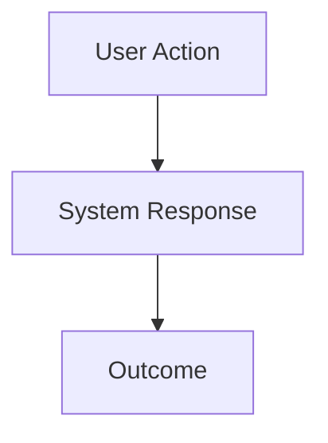

# Feature Brief & Metadata

**Feature Name:**

> [Feature Name Here]

**Filepath Name:**

> `[feature-name-v1]` (kebab-case)

**Date:**

> YYYY-MM-DD

**Author:**

> [Author Name/Agent]

**Related Epic(s)/PRD ID(s):**

> [Epic ID or related PRD references]

**Related Documents:**

> - [Architecture Decision Record (if applicable)]
> - [Related PRDs or guides]
> - [Symbol references]

---

## 1. Executive Summary

A concise paragraph (2-3 sentences) explaining what this feature delivers and why it matters. Provide just enough context to orient the reader.

**Priority:** [CRITICAL | HIGH | MEDIUM | LOW]

**Key Outcomes:**
- Outcome 1: [What users will be able to do]
- Outcome 2: [What problem is solved]
- Outcome 3: [What metric improves]

---

## 2. Context & Background

### Current State

[Describe the current state of the system]

### Problem Space

Describe the problem that motivates this feature. What pain points do users experience? What gaps exist in the current system?

### Current Alternatives / Workarounds

Explain what exists today and why it is insufficient. What workarounds do users employ? Why are they inadequate?

### Market / Competitive Notes (Optional)

Include relevant market trends or competitor features if applicable.

### Architectural Context

[Reference MeatyPrompts layered architecture]
- **Routers** - HTTP + validation, return DTOs
- **Services** - Business logic, return DTOs only
- **Repositories** - All DB I/O, RLS enforcement, cursor pagination
- **ErrorResponse** - Envelope for all failures
- **Cursor Pagination** - `{ items, pageInfo }` format

---

## 3. Problem Statement

State the core gap or pain point in plain language.

**User Story Format:**
> "As a [user type], when I [action], I [problem] instead of [desired outcome]."

**Technical Root Cause (if known):**
- [Root cause 1]
- [Root cause 2]
- [Files involved]

---

## 4. Goals & Success Metrics

### Primary Goals

**Goal 1: [Goal Name]**
- Description of goal
- Measurable success criteria

**Goal 2: [Goal Name]**
- Description of goal
- Measurable success criteria

**Goal 3: [Goal Name]**
- Description of goal
- Measurable success criteria

### Success Metrics

| Metric | Baseline | Target | Measurement Method |
|--------|----------|--------|-------------------|
| [Metric 1] | [Current value] | [Target value] | [How to measure] |
| [Metric 2] | [Current value] | [Target value] | [How to measure] |

---

## 5. User Personas & Journeys

### Personas

**Primary Persona: [Name]**
- Role: [User role]
- Needs: [What they need from this feature]
- Pain Points: [Current frustrations]

**Secondary Persona: [Name]**
- Role: [User role]
- Needs: [What they need from this feature]
- Pain Points: [Current frustrations]

### High-level Flow

[Optional: Include a Mermaid diagram to show the user journey or system flow]

---

## 6. Requirements

### 6.1 Functional Requirements

| ID | Requirement | Priority | Notes |
| :-: | ----------- | :------: | ----- |
| FR-1 | [Requirement description] | Must | [Additional context] |
| FR-2 | [Requirement description] | Should | [Additional context] |
| FR-3 | [Requirement description] | Could | [Additional context] |

### 6.2 Non-Functional Requirements

**Performance:**
- [Performance requirement 1]
- [Performance requirement 2]

**Security:**
- [Security requirement 1]
- [Security requirement 2]

**Accessibility:**
- [Accessibility requirement 1]
- [Accessibility requirement 2]

**Reliability:**
- [Reliability requirement 1]
- [Reliability requirement 2]

**Observability:**
- OpenTelemetry spans for all operations
- Structured JSON logs with trace_id, span_id, user_id
- Error tracking and monitoring

---

## 7. Scope

### In Scope

- [Component/feature 1 in scope]
- [Component/feature 2 in scope]
- [Component/feature 3 in scope]

### Out of Scope

- [Deliberately excluded area 1]
- [Deliberately excluded area 2]
- [Future considerations]

---

## 8. Dependencies & Assumptions

### External Dependencies

- **Library/Service 1**: [Description and version]
- **Library/Service 2**: [Description and version]

### Internal Dependencies

- **Feature/System 1**: [Description and status]
- **Feature/System 2**: [Description and status]

### Assumptions

- [Assumption 1]
- [Assumption 2]
- [Assumption 3]

### Feature Flags

- [Feature flag name]: [Description]

---

## 9. Risks & Mitigations

| Risk | Impact | Likelihood | Mitigation |
| ----- | :----: | :--------: | ---------- |
| [Risk description] | High/Med/Low | High/Med/Low | [Mitigation strategy] |
| [Risk description] | High/Med/Low | High/Med/Low | [Mitigation strategy] |

---

## 10. Target State (Post-Implementation)

Describe how the system will behave after the feature is delivered.

**User Experience:**
- [How users interact with the feature]
- [What workflows are enabled]

**Technical Architecture:**
- [How components interact]
- [Data flow and storage]
- [Integration points]

**Observable Outcomes:**
- [What metrics change]
- [What behaviors are enabled]
- [What problems are solved]

---

## 11. Overall Acceptance Criteria (Definition of Done)

### Functional Acceptance

- [ ] All functional requirements (FR-1 through FR-N) implemented
- [ ] User workflows complete end-to-end
- [ ] All edge cases handled

### Technical Acceptance

- [ ] Follows MeatyPrompts layered architecture
- [ ] All APIs return DTOs (no ORM models)
- [ ] Cursor pagination for all lists
- [ ] ErrorResponse envelope for all errors
- [ ] OpenTelemetry spans for all operations
- [ ] Structured logging with trace_id, span_id, user_id

### Quality Acceptance

- [ ] Unit tests achieve >80% coverage
- [ ] Integration tests cover all API endpoints
- [ ] E2E tests cover critical user journeys
- [ ] Performance benchmarks met
- [ ] Accessibility WCAG 2.1 AA compliance
- [ ] Security review passed

### Documentation Acceptance

- [ ] API documentation complete
- [ ] Component documentation complete
- [ ] User guides created
- [ ] ADRs updated for architectural decisions

---

## 12. Assumptions & Open Questions

### Assumptions

- [Assumption 1 made during planning]
- [Assumption 2 made during planning]

### Open Questions

- [ ] **Q1**: [Question text]
  - **A**: [Answer or "TBD"]
- [ ] **Q2**: [Question text]
  - **A**: [Answer or "TBD"]

---

## 13. Appendices & References

### Related Documentation

- **ADRs**: [Links to Architecture Decision Records]
- **Design Specifications**: [Links to design docs]
- **Technical Audits**: [Links to audit reports]
- **Flow Diagrams**: [Links to flow documentation]

### Symbol References

- **API Symbols**: [Relevant symbols from ai/symbols-api.json]
- **UI Symbols**: [Relevant symbols from ai/symbols-ui.json]

### Prior Art

- [Link to similar implementations]
- [Link to research or SPIKE documents]

---

## Implementation

### Phased Approach

**Phase 1: [Phase Name]**
- Duration: [X days]
- Tasks:
  - [ ] Task 1: [Description]
  - [ ] Task 2: [Description]

**Phase 2: [Phase Name]**
- Duration: [X days]
- Tasks:
  - [ ] Task 1: [Description]
  - [ ] Task 2: [Description]

**Phase 3: [Phase Name]**
- Duration: [X days]
- Tasks:
  - [ ] Task 1: [Description]
  - [ ] Task 2: [Description]

### Epics & User Stories Backlog

| Story ID | Short Name | Description | Acceptance Criteria | Estimate |
|----------|-----------|-------------|-------------------|----------|
| [ID-001] | [Name] | [Description] | [Criteria] | [Points] |
| [ID-002] | [Name] | [Description] | [Criteria] | [Points] |

---

**Progress Tracking:**

See progress tracking: `.claude/progress/[feature-name]/all-phases-progress.md`

---

Use this template as a starting point for every new feature PRD. Tailor the sections to suit the project while retaining the overall structure and ensuring MeatyPrompts architecture compliance.
