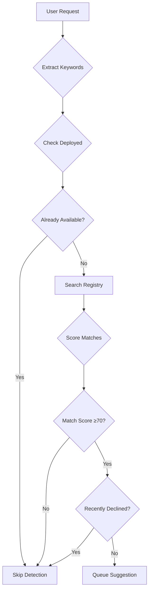

# Capability Gap Detection Workflow

Automatic detection of opportunities to enhance capabilities with additional artifacts.

---

## Overview

**Purpose**: Proactively identify when a task would benefit from deploying additional artifacts, without disrupting user workflow.

**Key Principles**:
- **Silent detection**: Analyze in background, suggest at natural breakpoints
- **Relevance threshold**: Only suggest high-confidence matches (≥70 score)
- **Non-intrusive**: One suggestion at a time, skip if recently declined
- **Context-aware**: Consider what's already deployed and user's current task

---

## Detection Triggers

### 1. Task Analysis Triggers

**User Request Patterns**:
```
"help me with <capability>"
"how do I <action>"
"need to work with <format/tool>"
"struggling with <task>"
"automate <process>"
```

**Examples**:
- "help me process PDF files" → Search: pdf document
- "how do I test React components" → Search: react testing
- "need to work with PostgreSQL" → Search: database postgresql
- "struggling with API documentation" → Search: api openapi
- "automate browser screenshots" → Search: browser automation

### 2. Error Pattern Triggers

**Common Error Signatures**:
```bash
# Missing tool/command
bash: pdftotext: command not found
→ Search: pdf text extraction

# Missing library
ImportError: No module named 'playwright'
→ Search: browser automation

# File format not supported
Error: Cannot parse .docx file
→ Search: document word docx

# Tool not installed
Error: psql: not found
→ Search: postgresql database
```

### 3. Frustration Indicators

**Language Patterns**:
- "this is tedious"
- "doing this manually"
- "repetitive task"
- "keep having to"
- "wish there was a way to"

**Action**: Search for automation/tooling related to current task domain

### 4. Task Complexity Signals

**Indicators**:
- Multiple manual steps described
- Copy-paste workflows mentioned
- "I usually do X, then Y, then Z"
- Mention of external tools/services

**Action**: Search for workflow automation or integration artifacts

---

## Detection Flow

### Phase 1: Silent Analysis



### Phase 2: Context Evaluation

**Before Suggesting**:
1. **Timing**: Wait for natural breakpoint
   - Task completion
   - Pause in conversation
   - Error encountered
   - User asks for next steps

2. **Relevance**: Verify match quality
   - Artifact description aligns with task
   - Not redundant with deployed artifacts
   - User's skill level matches artifact complexity

3. **User State**: Check interaction history
   - Not overloaded with suggestions (max 1 per session)
   - Previously accepted/declined similar artifacts
   - Current task priority (don't interrupt critical work)

### Phase 3: Suggestion Delivery

**Template**:
```
I noticed you're working with <capability>.

The <artifact-name> artifact could help with <specific-benefit>:
- <key-feature-1>
- <key-feature-2>
- <key-feature-3>

Would you like me to deploy it? (This will add it to your project's .claude/ directory)
```

**Example**:
```
I noticed you're working with PDF files.

The pdf-processing skill could help with extracting and analyzing PDF content:
- Extract text from PDFs
- Convert between PDF and other formats
- Merge, split, and manipulate PDF documents

Would you like me to deploy it?
```

---

## Keyword → Artifact Mapping

### Document Processing

| User Keywords | Search Query | Common Matches |
|--------------|--------------|----------------|
| pdf, portable document | `pdf document` | pdf-processing, document-converter |
| docx, word, doc | `word document docx` | ms-office-suite, document-converter |
| excel, spreadsheet, xlsx | `excel spreadsheet` | csv-analyzer, data-processing |
| powerpoint, ppt, presentation | `powerpoint presentation` | ms-office-suite |
| markdown, md | `markdown documentation` | documentation-generator |

### Web Development

| User Keywords | Search Query | Common Matches |
|--------------|--------------|----------------|
| react, component, jsx | `react frontend component` | frontend-design, react-testing |
| vue, vuejs | `vue frontend` | frontend-design |
| angular, ng | `angular frontend` | frontend-design |
| api, rest, endpoint | `api rest openapi` | openapi-expert, api-testing |
| graphql, gql | `graphql api` | api-design |
| nextjs, next.js | `nextjs react` | frontend-design, ssr |

### Testing & Quality

| User Keywords | Search Query | Common Matches |
|--------------|--------------|----------------|
| test, testing, spec | `testing test automation` | webapp-testing, test-framework |
| playwright, selenium | `browser testing automation` | webapp-testing, e2e-testing |
| jest, vitest, mocha | `javascript testing` | test-framework |
| pytest, unittest | `python testing` | test-framework |
| cypress | `cypress e2e testing` | webapp-testing |

### Database & Data

| User Keywords | Search Query | Common Matches |
|--------------|--------------|----------------|
| postgresql, postgres, psql | `postgresql database` | postgresql-psql, database-admin |
| mysql, mariadb | `mysql database` | database-admin |
| mongodb, mongo | `mongodb nosql` | database-admin |
| redis, cache | `redis caching` | cache-management |
| sql, query | `sql database query` | database-admin |
| csv, data analysis | `csv data analysis` | csv-analyzer, data-processing |

### DevOps & Infrastructure

| User Keywords | Search Query | Common Matches |
|--------------|--------------|----------------|
| docker, container | `docker container` | docker-expert, devops |
| kubernetes, k8s | `kubernetes orchestration` | k8s-admin, devops |
| terraform, iac | `terraform infrastructure` | infrastructure-as-code |
| ansible, automation | `ansible automation` | config-management |
| ci/cd, pipeline | `ci cd pipeline` | github-actions, gitlab-ci |

### Browser & Automation

| User Keywords | Search Query | Common Matches |
|--------------|--------------|----------------|
| browser, chrome, firefox | `browser automation` | chrome-devtools, browser-automation |
| screenshot, capture | `screenshot browser` | browser-automation |
| scraping, scrape | `web scraping` | web-scraper |
| automation, automate | `automation workflow` | workflow-automation |

### AI & ML

| User Keywords | Search Query | Common Matches |
|--------------|--------------|----------------|
| llm, language model | `llm ai language-model` | llm-expert, prompt-engineering |
| prompt, prompting | `prompt engineering` | prompt-engineering |
| embeddings, vector | `embeddings vector` | vector-search, ml-toolkit |
| classification, nlp | `nlp classification` | ml-toolkit |

---

## Implementation Pattern

### Silent Search Function

```bash
#!/bin/bash

# silent_search_artifacts <keywords>
# Returns: JSON array of matching artifacts (score ≥70)
silent_search_artifacts() {
    local keywords="$1"

    # Execute search silently
    local result
    result=$(skillmeat search "$keywords" --json 2>/dev/null || echo "[]")

    # Filter by score threshold
    echo "$result" | jq -r '
        .[]
        | select(.score >= 70)
        | {name, description, score, source}
    '
}

# check_deployed <artifact_name>
# Returns: 0 if deployed, 1 if not
check_deployed() {
    local artifact_name="$1"
    skillmeat list --json 2>/dev/null | jq -e --arg name "$artifact_name" '
        .[] | select(.name == $name and .deployed == true)
    ' >/dev/null
}

# Example usage
# keywords=$(extract_keywords_from_task "$user_request")
# matches=$(silent_search_artifacts "$keywords")
# for artifact in $(echo "$matches" | jq -r '.name'); do
#     if ! check_deployed "$artifact"; then
#         queue_suggestion "$artifact"
#     fi
# done
```

### Keyword Extraction

```bash
# extract_keywords_from_task <user_message>
# Returns: Space-separated keywords for search
extract_keywords_from_task() {
    local message="$1"
    local keywords=""

    # Document formats
    echo "$message" | grep -iE 'pdf|portable.document' && keywords+="pdf document "
    echo "$message" | grep -iE 'docx?|word' && keywords+="word document "
    echo "$message" | grep -iE 'xlsx?|excel|spreadsheet' && keywords+="excel spreadsheet "
    echo "$message" | grep -iE 'pptx?|powerpoint' && keywords+="powerpoint presentation "

    # Web development
    echo "$message" | grep -iE 'react|jsx|component' && keywords+="react frontend "
    echo "$message" | grep -iE 'api|rest|endpoint' && keywords+="api rest "
    echo "$message" | grep -iE 'graphql|gql' && keywords+="graphql "

    # Testing
    echo "$message" | grep -iE 'test|testing|spec' && keywords+="testing automation "
    echo "$message" | grep -iE 'playwright|selenium|cypress' && keywords+="browser testing "

    # Database
    echo "$message" | grep -iE 'postgres|postgresql|psql' && keywords+="postgresql database "
    echo "$message" | grep -iE 'mysql|mariadb' && keywords+="mysql database "
    echo "$message" | grep -iE 'mongodb|mongo' && keywords+="mongodb nosql "

    # DevOps
    echo "$message" | grep -iE 'docker|container' && keywords+="docker container "
    echo "$message" | grep -iE 'kubernetes|k8s' && keywords+="kubernetes "

    # Browser automation
    echo "$message" | grep -iE 'browser|chrome|firefox' && keywords+="browser automation "
    echo "$message" | grep -iE 'screenshot|capture' && keywords+="screenshot "

    # AI/ML
    echo "$message" | grep -iE 'llm|language.model' && keywords+="llm ai "
    echo "$message" | grep -iE 'prompt|prompting' && keywords+="prompt engineering "

    # Return cleaned keywords
    echo "$keywords" | xargs
}
```

### Error Pattern Detection

```bash
# detect_error_gap <error_message>
# Returns: Search keywords if pattern matches, empty otherwise
detect_error_gap() {
    local error="$1"

    # Missing commands
    if echo "$error" | grep -q "command not found"; then
        local cmd=$(echo "$error" | sed -n 's/.*bash: \(.*\): command not found.*/\1/p')
        case "$cmd" in
            pdftotext|pdftk|gs) echo "pdf processing" ;;
            psql|pg_dump) echo "postgresql database" ;;
            mysql|mysqldump) echo "mysql database" ;;
            docker) echo "docker container" ;;
            kubectl) echo "kubernetes" ;;
            *) echo "" ;;
        esac
    fi

    # Missing Python modules
    if echo "$error" | grep -q "No module named"; then
        local module=$(echo "$error" | sed -n "s/.*No module named '\(.*\)'.*/\1/p")
        case "$module" in
            playwright|selenium) echo "browser automation testing" ;;
            psycopg2|sqlalchemy) echo "database python" ;;
            pandas|numpy) echo "data analysis python" ;;
            pytest) echo "python testing" ;;
            *) echo "" ;;
        esac
    fi

    # File format errors
    if echo "$error" | grep -qE "Cannot parse|unsupported format"; then
        echo "$error" | grep -iq "pdf" && echo "pdf processing"
        echo "$error" | grep -iq "docx" && echo "word document"
        echo "$error" | grep -iq "xlsx" && echo "excel spreadsheet"
    fi
}
```

---

## Suggestion Rules

### When to Suggest

✅ **Good Times**:
- User completes a task and asks "what next?"
- User encounters an error related to missing capability
- User describes manual workflow that could be automated
- Natural pause in conversation (user is thinking)
- User explicitly asks for tool recommendations

✅ **Example**:
```
User: "I need to extract text from these PDF files. Let me open them manually..."

[Agent detects: PDF capability gap]
[Agent searches silently: "pdf document extraction"]
[Agent finds: pdf-processing skill, score=85]
[Agent checks: not deployed]
[Agent waits for natural breakpoint...]

User: "Okay, I've extracted the text from the first one."

Agent: "I noticed you're working with PDF files. The pdf-processing skill
could help automate text extraction:
- Extract text from multiple PDFs at once
- Convert PDFs to other formats
- Merge and split PDF documents

Would you like me to deploy it?"
```

### When NOT to Suggest

❌ **Bad Times**:
- User is in the middle of explaining a complex problem
- User just declined a different artifact suggestion
- More than 1 suggestion already made this session
- User is debugging a critical issue
- Task is nearly complete

❌ **Example**:
```
User: "The production server is down and users are reporting errors.
I need to check the logs and—"

[Agent detects: logging/monitoring gap]
[Agent: SKIP - critical issue in progress]
[Agent: Note for later, don't interrupt now]
```

### Frequency Limits

**Per Session**:
- Maximum 1 proactive suggestion
- Exception: User asks "what tools are available?"

**Per Artifact**:
- Don't re-suggest if declined in last 7 days
- Track in session memory: `declined_artifacts: [name, timestamp]`

**Cooldown**:
- After accepting suggestion: 5 minutes before next detection
- After declining suggestion: Rest of session (no more proactive suggestions)

---

## Quality Scoring

### Match Score Calculation

Artifacts returned from search have a score (0-100). Apply additional filters:

```javascript
// Pseudo-code for score adjustment
function adjustScore(artifact, context) {
    let score = artifact.base_score;

    // Boost if exact keyword match in name
    if (artifact.name.toLowerCase().includes(context.primary_keyword)) {
        score += 10;
    }

    // Boost if recently updated (active maintenance)
    const daysSinceUpdate = (Date.now() - artifact.updated_at) / (1000 * 60 * 60 * 24);
    if (daysSinceUpdate < 30) {
        score += 5;
    } else if (daysSinceUpdate > 365) {
        score -= 10;
    }

    // Penalize if similar artifact already deployed
    if (context.deployed_artifacts.some(a => a.category === artifact.category)) {
        score -= 15;
    }

    // Penalize if complex artifact for simple task
    if (artifact.complexity === 'advanced' && context.task_complexity === 'simple') {
        score -= 10;
    }

    return Math.max(0, Math.min(100, score));
}
```

### Relevance Filters

**Minimum Thresholds**:
- Base search score: ≥70
- After adjustment: ≥65
- Description keyword overlap: ≥2 matching terms

**Exclusion Rules**:
- Already deployed in current project
- User explicitly declined in last 7 days
- Category conflict (e.g., two PDF processors)

---

## Integration Points

### Task Execution Lifecycle

```
┌─────────────────────────────────────────────┐
│ 1. BEFORE TASK                              │
│    - Extract keywords from request          │
│    - Silent search for gaps                 │
│    - Queue suggestions if found             │
└─────────────────────────────────────────────┘
                    ↓
┌─────────────────────────────────────────────┐
│ 2. DURING TASK                              │
│    - Monitor errors for capability gaps     │
│    - Track frustration indicators           │
│    - Note manual workflows                  │
└─────────────────────────────────────────────┘
                    ↓
┌─────────────────────────────────────────────┐
│ 3. AFTER TASK                               │
│    - Deliver queued suggestion (if any)     │
│    - Wait for user decision                 │
│    - Track acceptance/decline               │
└─────────────────────────────────────────────┘
```

### SKILL.md Integration

Gap detection should be invoked automatically by the main skill workflow:

```markdown
## Step 3: Execute Task

Before executing the task:

1. **Check for capability gaps**:
   ```bash
   source ./workflows/gap-detection.md
   keywords=$(extract_keywords_from_task "$user_request")
   if [ -n "$keywords" ]; then
       matches=$(silent_search_artifacts "$keywords")
       # Queue suggestion if high-confidence match found
   fi
   ```

2. **Execute task** (normal workflow)

3. **Deliver suggestion** (if queued and appropriate timing)
```

---

## Examples

### Example 1: PDF Processing

**User Request**: "I need to extract tables from these 50 PDF reports"

**Detection Flow**:
1. **Extract keywords**: `pdf document table extraction`
2. **Search**: `skillmeat search "pdf document" --json`
3. **Results**: `pdf-processing` (score=85), `document-converter` (score=72)
4. **Check deployed**: Neither deployed
5. **Pick top match**: `pdf-processing` (higher score)
6. **Queue suggestion**: Wait for breakpoint

**Suggestion Delivery** (after user starts manual process):
```
I noticed you're working with PDF tables.

The pdf-processing skill could help automate this:
- Extract tables from PDFs to CSV/Excel
- Batch process multiple PDFs at once
- Merge and split PDF documents

Would you like me to deploy it? It could save time on these 50 reports.
```

### Example 2: API Testing

**User Request**: "How do I test this REST API endpoint?"

**Detection Flow**:
1. **Extract keywords**: `api rest testing`
2. **Search**: `skillmeat search "api rest testing" --json`
3. **Results**: `openapi-expert` (score=88), `api-testing-suite` (score=75)
4. **Check deployed**: None
5. **Queue suggestion**: `openapi-expert`

**Suggestion Delivery** (after user describes API):
```
I noticed you're testing REST APIs.

The openapi-expert skill could help:
- Generate test cases from OpenAPI specs
- Validate API responses against schemas
- Auto-generate API documentation

Would you like me to deploy it?
```

### Example 3: Error-Triggered

**Error Message**: `bash: psql: command not found`

**Detection Flow**:
1. **Detect error pattern**: Missing `psql` command
2. **Extract keywords**: `postgresql database`
3. **Search**: `skillmeat search "postgresql database" --json`
4. **Results**: `postgresql-psql` (score=92)
5. **Check deployed**: Not deployed
6. **Queue suggestion**: Immediate (error context)

**Suggestion Delivery** (immediately after error):
```
It looks like PostgreSQL tools aren't available.

The postgresql-psql skill includes:
- psql command-line client
- Database schema exploration helpers
- Query optimization tools

Would you like me to deploy it?
```

---

## Testing Gap Detection

### Manual Testing Checklist

- [ ] **Keyword extraction**: Try various phrasings for same capability
- [ ] **Search accuracy**: Verify search returns relevant artifacts
- [ ] **Score threshold**: Confirm only ≥70 scores trigger suggestions
- [ ] **Deployed check**: Ensure already-deployed artifacts are skipped
- [ ] **Timing**: Suggestions appear at natural breakpoints only
- [ ] **Frequency limit**: Only 1 suggestion per session
- [ ] **Decline tracking**: Declined artifacts not re-suggested
- [ ] **Error patterns**: Error messages trigger appropriate searches

### Test Cases

```bash
# Test 1: PDF keyword extraction
test_pdf_extraction() {
    local message="I need to process PDF files"
    local keywords=$(extract_keywords_from_task "$message")
    [[ "$keywords" == *"pdf"* ]] || fail "PDF not detected"
}

# Test 2: Search threshold
test_search_threshold() {
    local results=$(silent_search_artifacts "pdf document")
    local min_score=$(echo "$results" | jq -r 'min_by(.score).score')
    [[ $min_score -ge 70 ]] || fail "Score below threshold"
}

# Test 3: Deployed check
test_deployed_skip() {
    local artifact="pdf-processing"
    skillmeat deploy "$artifact"  # Deploy it
    local should_suggest=$(should_suggest_artifact "$artifact")
    [[ "$should_suggest" == "false" ]] || fail "Suggested deployed artifact"
}

# Test 4: Error pattern
test_error_detection() {
    local error="bash: psql: command not found"
    local keywords=$(detect_error_gap "$error")
    [[ "$keywords" == *"postgresql"* ]] || fail "PostgreSQL error not detected"
}
```

---

## Metrics & Monitoring

### Track Suggestion Performance

**Metrics to Collect**:
- Suggestion acceptance rate (%)
- False positive rate (irrelevant suggestions)
- Time-to-deploy after suggestion
- User satisfaction signals (explicit feedback)

**Session Log Format**:
```json
{
  "timestamp": "2025-12-24T10:30:00Z",
  "trigger": "keyword_match",
  "keywords": "pdf document",
  "search_results": 3,
  "top_match": "pdf-processing",
  "score": 85,
  "suggested": true,
  "user_response": "accepted",
  "deployed": true
}
```

### Quality Indicators

**Good Signs** (keep doing this):
- Acceptance rate >50%
- User says "perfect!" or "exactly what I needed"
- User immediately uses deployed artifact

**Bad Signs** (adjust strategy):
- Acceptance rate <20%
- User says "no thanks" repeatedly
- User deploys but never uses artifact

---

## Future Enhancements

### Advanced Detection

1. **Collaborative Filtering**: "Users who deployed X also deployed Y"
2. **Context History**: Learn user preferences over time
3. **Project Analysis**: Scan codebase for common patterns (e.g., `import pdf2text` → suggest pdf-processing)
4. **Semantic Search**: Use embeddings for better keyword matching

### Smarter Suggestions

1. **Multi-Artifact Bundles**: "For API testing, consider deploying openapi-expert + api-testing-suite"
2. **Prerequisite Detection**: "pdf-processing requires poppler-utils; install first?"
3. **Alternative Options**: "Found 3 PDF tools; here's a comparison..."

### User Feedback Loop

1. **Explicit Feedback**: "Was this suggestion helpful? (yes/no/improve)"
2. **Implicit Signals**: Track artifact usage after deployment
3. **Adaptive Scoring**: Adjust future suggestions based on user preferences

---

## Reference

- **Search API**: `skillmeat search <query> [--json]` returns ranked matches
- **Deployment Check**: `skillmeat list --json | jq '.[] | select(.deployed == true)'`
- **Keyword Mapping**: See "Keyword → Artifact Mapping" section above
- **Suggestion Template**: See "Phase 3: Suggestion Delivery" section above
