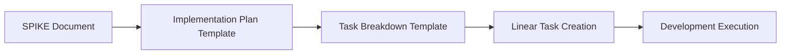

# MeatyPrompts PM Templates

This directory contains standardized templates for Product Management activities in MeatyPrompts. These templates ensure consistency, quality, and proper integration with our AI-first development workflow.

## Template Overview

### 1. Feature Request Template
**File**: `feature-request-template.md`
**Purpose**: Capture new feature ideas and requests from users, stakeholders, or internal teams
**Usage**: Initial feature capture and validation

**Key Sections:**
- Problem statement and business context
- User impact assessment
- Initial technical assessment
- Success metrics definition
- Stakeholder sign-off

### 2. SPIKE Document Template
**File**: `spike-document-template.md`
**Purpose**: Comprehensive technical research and feasibility analysis
**Usage**: Deep technical investigation before PRD creation

**Key Sections:**
- Technical analysis across MP architecture layers
- Alternative approaches evaluation
- Implementation design with phased approach
- Risk assessment and mitigation
- Expert consultation summary

### 3. Implementation Plan Template
**File**: `implementation-plan-template.md`
**Purpose**: Detailed implementation planning with Linear-compatible task breakdown
**Usage**: Translation of SPIKE/PRD into actionable development plan

**Key Sections:**
- Phase-by-phase implementation strategy
- Task breakdown with estimates and dependencies
- Resource requirements and team assignments
- Risk mitigation strategies
- Success metrics and quality gates

### 4. Task Breakdown Template
**File**: `task-breakdown-template.md`
**Purpose**: Detailed task decomposition following MP architecture patterns
**Usage**: Creating Linear epics, stories, and tasks

**Key Sections:**
- MP architecture layer breakdown
- Story point estimation guidelines
- Skill-based task assignment
- Quality gates and acceptance criteria
- Linear integration format

## Template Usage Workflow

### 1. Feature Request → Research

### 2. Research → Technical Analysis

### 3. Technical Analysis → Implementation

## Integration with MeatyPrompts Workflow

### AI Agent Integration
These templates are designed to work seamlessly with MeatyPrompts AI agents:

- **lead-pm agent**: Orchestrates template usage across SDLC
- **spike-writer agent**: Uses SPIKE template for technical research
- **implementation-planner agent**: Uses implementation and task templates
- **prd-writer agent**: References templates for consistency

### External Tool Integration
Templates include integration points for:

- **Linear**: Task creation with proper formatting and relationships
- **Trello**: Ideation board management and research tracking
- **GitHub Issues**: Bug reports and small enhancement management
- **Documentation**: Links to PRDs, ADRs, and technical documentation

### Quality Standards
All templates enforce MeatyPrompts quality standards:

- **Architecture Compliance**: Adherence to layered architecture patterns
- **Testing Requirements**: >80% coverage and comprehensive testing
- **Accessibility**: WCAG 2.1 AA compliance
- **Observability**: OpenTelemetry instrumentation
- **Documentation**: Complete API and component documentation

## Template Customization

### Project-Specific Adaptations
Templates can be customized for specific project needs:

1. **Copy template** to project directory
2. **Modify sections** as needed for project context
3. **Update references** to project-specific tools and processes
4. **Maintain core structure** for consistency

### Template Versioning
- Templates include version numbers for tracking changes
- Updates should be documented with change rationale
- Backward compatibility should be maintained when possible

## Best Practices

### Template Selection
- **Feature Request**: For all new feature ideas and requests
- **SPIKE Document**: For Medium/Large/XL complexity features
- **Implementation Plan**: For all features moving to development
- **Task Breakdown**: For detailed Linear task creation

### Quality Assurance
- **Review templates** with stakeholders before starting work
- **Fill out completely** - don't skip sections
- **Link related documents** for traceability
- **Update templates** based on project learnings

### Collaboration
- **Share templates** early with relevant stakeholders
- **Review together** to ensure alignment
- **Version control** all completed templates
- **Reference in related documents** for traceability

## Support and Feedback

### Getting Help
- **Documentation**: Refer to individual template instructions
- **AI Agents**: Use lead-pm agent for guidance on template usage
- **Team Reviews**: Discuss template effectiveness in retrospectives

### Continuous Improvement
- **Feedback**: Provide feedback on template effectiveness
- **Updates**: Suggest improvements based on usage experience
- **Best Practices**: Share successful template usage patterns
- **Training**: Help team members learn effective template usage

## Related Documentation

### MeatyPrompts Processes
- [SDLC Workflow](../../docs/processes/sdlc-workflow.md)
- [Architecture Patterns](../../docs/architecture/)
- [Development Standards](../../CLAUDE.md)

### AI Agent Documentation
- [Lead PM Agent](../agents/pm/lead-pm.md)
- [SPIKE Writer Agent](../agents/pm/spike-writer.md)
- [Implementation Planner Agent](../agents/pm/implementation-planner.md)
- [PRD Writer Agent](../agents/pm/prd-writer.md)

### Integration Commands
- [Linear Task Creation](../commands/integrations/linear-create-task.md)
- [Trello Card Creation](../commands/integrations/trello-add-card.md)
- [GitHub Issue Creation](../commands/integrations/github-create-issue.md)

---

**PM Templates Version**: 1.0
**Last Updated**: [Current Date]
**Maintained By**: MeatyPrompts Product Management Team
