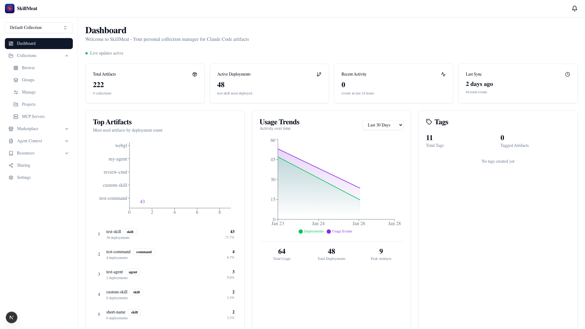
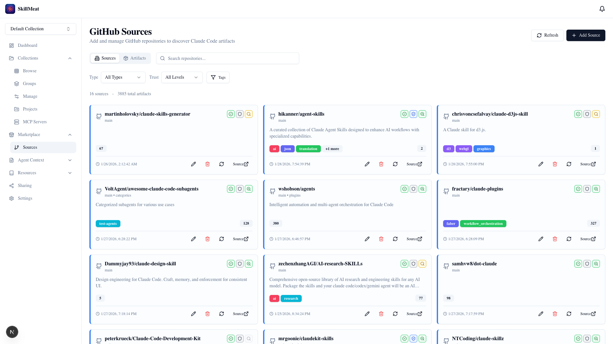
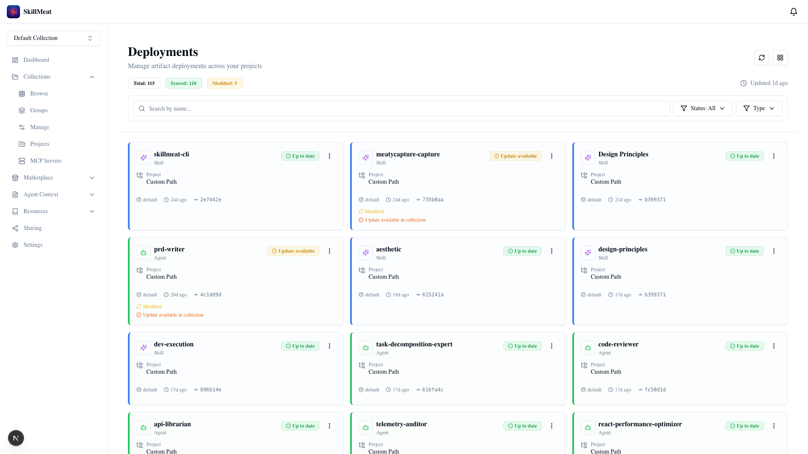
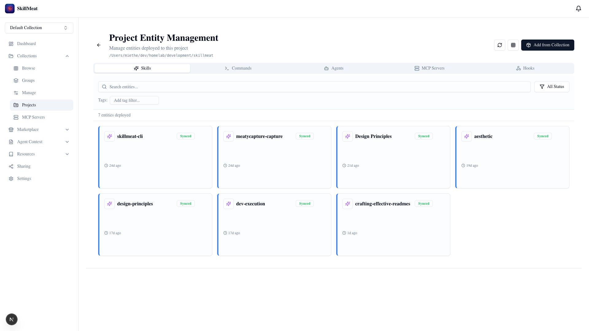
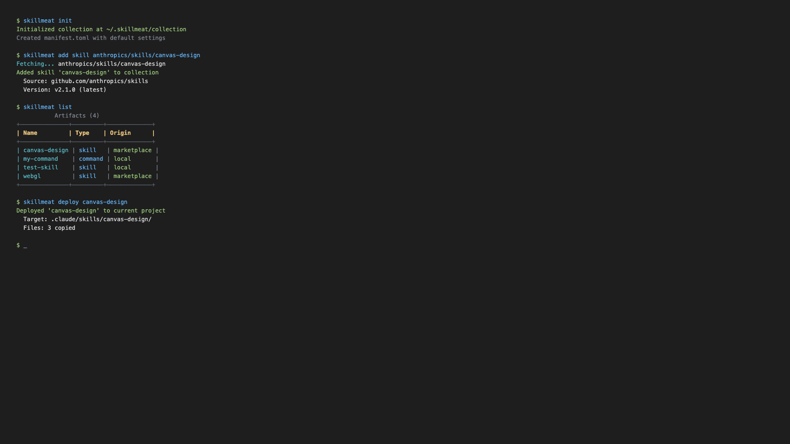

<!-- AUTO-GENERATED: Do not edit directly. See .github/readme/ -->
<!-- GENERATED: 2026-02-28T03:27:01.125Z -->
<!-- VERSION: 0.3.0-beta -->

<!-- BEGIN:hero -->
# SkillMeat

Personal collection manager for Claude Code artifacts

[](https://github.com/yourusername/skillmeat/releases)
[](LICENSE)
[](https://github.com/yourusername/skillmeat/actions)
[](https://www.python.org/downloads/)

Organize, deploy, and sync your Claude Code skills, commands, agents, hooks, and MCP servers across projects with a powerful CLI and web interface.
<!-- END:hero -->

<!-- BEGIN:value-prop -->
### The missing management layer for Claude Code.

**SkillMeat** is a professional-grade collection manager designed to bridge the gap between building Claude Code artifacts and actually using them at scale. It transforms scattered `.claude` files into a version-controlled, searchable, and shareable library.

---

## 💡 Why SkillMeat?

As you build more complex agentic workflows with Claude Code, managing your **Skills, Commands, Agents, and MCP Servers** becomes a bottleneck.

* **The Problem:** Artifacts are often trapped within individual projects. If you improve a "Code Review" skill in one repo, your other ten projects are now running an outdated version. Sharing these tools with a team usually involves brittle copy-pasting.
* **The Solution:** SkillMeat provides a **centralized source of truth**. You manage your artifacts in a global collection and "deploy" them to projects and deployment profiles (`claude_code`, `codex`, `gemini`, `cursor`). When you update the global version, SkillMeat handles the sync, drift detection, and versioning across every project on your machine.

## 🎯 Who is it for?

* **Individual Power Users:** Developers who have a growing library of custom Claude skills and need to keep them in sync across dozens of local repositories.
* **Team Leads & Architects:** Teams looking to standardize their agentic SDLC by sharing "Golden Path" skills, rules, and MCP configurations.
* **Artifact Creators:** Developers building tools for the Claude community who need a structured way to package, sign, and publish their work.

---

## 🚀 Key Capabilities

* **📦 Three-Tier Architecture:** Manage artifacts at the Source (GitHub/Local), Collection (Your Library), and Project (Deployment) levels.
* **🔄 Intelligent Sync:** Bidirectional synchronization with built-in drift detection. See exactly how your project-specific customizations differ from your global library.
* **🛡️ Safety-First Versioning:** Automatic snapshots before any destructive operation. If a new skill version breaks your workflow, roll back with a single command.
* **🌐 Dual Interface:** Use the high-performance **CLI** for your terminal workflows or the **Next.js Web UI** for visual discovery and analytics.
* **🧩 MCP Orchestration:** Centralized management for Model Context Protocol servers—deploy, health-check, and configure environment variables from one place.

---

### Comparison of artifact management with standard Claude Code:

| Feature | Standard Claude Code | With SkillMeat |
| --- | --- | --- |
| **Storage** | Scattered in `.claude/` dirs | Centralized Library (`~/.skillmeat`) |
| **Updates** | Manual copy-paste | Automated Sync & Merge |
| **Versioning** | None | Snapshots & Rollbacks |
| **Sharing** | Manual file transfer | Signed `.skillmeat-pack` Bundles |
| **Visibility** | Terminal only | Full Web Dashboard & Analytics |
<!-- END:value-prop -->

<!-- BEGIN:screenshots -->
## Screenshots

<table>
<tr>
<td align="center" width="50%">

<br>
<em>Full dashboard with sidebar, stats cards, trends chart, top artifacts widget. Light mode.</em>
</td>
<td align="center" width="50%">

<br>
<em>Grid view with 9+ cards, toolbar visible, mix of artifact types, some tags shown</em>
</td>
</tr>
<tr>
<td align="center" width="50%">

<br>
<em>Source cards with repo names, artifact counts, scan status. Filter bar visible.</em>
</td>
<td align="center" width="50%">

<br>
<em>Summary cards, deployment list with mixed statuses (synced, modified, outdated)</em>
</td>
</tr>
<tr>
<td align="center" width="50%">

<br>
<em>Diff viewer with red/green highlighting, sync buttons visible, modal context</em>
</td>
<td align="center" width="50%">

<br>
<em>Show init, add, deploy, list commands with Rich formatted output</em>
</td>
</tr>
<tr>
</tr>
</table>

<!-- END:screenshots -->

<!-- BEGIN:quickstart -->
## Quick Start

Get started with SkillMeat in minutes.

### Installation

```bash
# Using pip
pip install skillmeat

# Using uv (recommended)
uv tool install skillmeat
```

### Basic Workflow

```bash
# Initialize your collection
skillmeat init

# Add a skill from GitHub
skillmeat add skill anthropics/skills/canvas-design

# Deploy to your project
skillmeat deploy canvas --scope user

# List your artifacts
skillmeat list
```

### Multi-Platform Deployments

```bash
# Scaffold all profile roots for a project
skillmeat init --project-path /path/to/project --all-profiles

# Deploy to one profile
skillmeat deploy canvas --project /path/to/project --profile codex

# Deploy to all profiles
skillmeat deploy canvas --project /path/to/project --all-profiles
```

### Web Interface

```bash
# Start the web UI with development servers
skillmeat web dev

# Open http://localhost:3000 to access the dashboard
```

For complete documentation, see the [Quickstart Guide](docs/user/quickstart.md) and [Multi-Platform Deployment Upgrade Guide](docs/migration/multi-platform-deployment-upgrade.md).
<!-- END:quickstart -->

<!-- BEGIN:features -->
## Features

> **125+ CLI commands** | **175+ API endpoints** | **28 web pages**

### Collection Management

_Organize artifacts in named collections_

| Feature | Description |
|---------|-------------|
| **Multi-Collection Support** | Organize by context (`skillmeat collection create`) |
| Multiple View Modes | Grid/List/Grouped views |
| Tag-Based Filtering | Filter by tags |
| Infinite Scroll | Progressive loading |

### Deployment &amp; Projects

_Deploy anywhere, track everything_

| Feature | Description |
|---------|-------------|
| **One-Command Deploy** | Deploy in seconds (`skillmeat deploy`) |
| Deployment Tracking | Track all deployments (`skillmeat status`) |
| Multi-Platform Profiles | Profile-aware deploy (`skillmeat deploy --profile codex`) |
| Project Management | Manage projects |
| Update Alerts | Update notifications |

### Deployment Sets

_Group and batch-deploy artifact bundles_

| Feature | Description |
|---------|-------------|
| **Named Deployment Sets** | Composable deployment bundles |
| Nested Composition | Sets within sets |
| **Batch Deploy** | One-click set deployment |
| Set Detail Modal | Rich modal-based management |
| Minified Member Cards | Compact member preview |

### Intelligence &amp; Sync

_Smart sync with conflict resolution_

| Feature | Description |
|---------|-------------|
| **Drift Detection** | Detect changes (`skillmeat sync check`) |
| Bidirectional Sync | Two-way sync (`skillmeat sync pull`) |
| Diff Preview | Preview changes (`skillmeat sync preview`) |
| Merge Strategies | Flexible merge |
| Automatic Rollback | Safe updates |

### Marketplace &amp; Discovery

_Discover and share artifacts_

| Feature | Description |
|---------|-------------|
| **GitHub Sources** | Import from GitHub |
| Semantic Tree Navigation | Browse folder structure |
| Cross-Source Search | Search everywhere |
| Trust &amp; Quality Scores | Quality indicators |
| Bundle Publishing | Share with team (`skillmeat marketplace-publish`) |

### Analytics &amp; Insights

_Track usage, identify patterns_

| Feature | Description |
|---------|-------------|
| Usage Tracking | Track usage (`skillmeat analytics usage`) |
| Top Artifacts | Most used (`skillmeat analytics top`) |
| Cleanup Suggestions | Cleanup help (`skillmeat analytics cleanup`) |
| Trend Analysis | Usage trends (`skillmeat analytics trends`) |

### Search &amp; Discovery

_Find anything instantly_

| Feature | Description |
|---------|-------------|
| Smart Search | Search everything (`skillmeat search`) |
| Duplicate Detection | Find duplicates (`skillmeat find-duplicates`) |
| Ripgrep Integration | Fast search |

### Similar Artifacts Detection

_Intelligent similarity scoring with caching and optional embeddings_

| Feature | Description |
|---------|-------------|
| **Multi-Dimensional Scoring** | Intelligent scoring (`skillmeat similar`) |
| **Pre-Computed Cache** | Sub-200ms cached results |
| Optional Semantic Embeddings | Optional embeddings |
| Collection Consolidation | Merge duplicates (`skillmeat consolidate`) |
| Configurable Scoring | Tunable detection (`skillmeat similar --min-score`) |

### Versioning &amp; Safety

_Snapshots and rollback_

| Feature | Description |
|---------|-------------|
| Collection Snapshots | Backup collection (`skillmeat snapshot`) |
| Rollback Support | Easy restore (`skillmeat rollback`) |
| Version History | View history (`skillmeat history`) |

### MCP Server Management

_Model Context Protocol servers_

| Feature | Description |
|---------|-------------|
| MCP Installation | Install MCP servers (`skillmeat mcp add`) |
| MCP Deploy | Deploy servers (`skillmeat mcp deploy`) |
| Health Monitoring | Monitor health (`skillmeat mcp health`) |

### Context Entities

_Project configuration artifacts_

| Feature | Description |
|---------|-------------|
| Context Entity Management | Manage project config (`skillmeat context`) |
| Context Deploy | Deploy config (`skillmeat context deploy`) |
| **Memory Inbox** | Review project memory |
| Context Modules | Reusable context modules |
| Context Pack Preview | Budgeted context packs |

### Team Collaboration

_Share and collaborate_

| Feature | Description |
|---------|-------------|
| Bundle Creation | Create bundles (`skillmeat bundle create`) |
| Vault Connectors | Team storage (`skillmeat vault`) |
| Cryptographic Signing | Secure sharing (`skillmeat sign`) |

### Composite Artifacts

_Multi-artifact packages with smart import_

| Feature | Description |
|---------|-------------|
| **Plugin Import** | One-click plugin import (`skillmeat add`) |
| Composite Detection | Auto-detect plugins |
| Hash-Based Deduplication | Smart dedup |
| Relationship Browsing | Navigate relationships |
| Plugin Deployment | Deploy plugins (`skillmeat deploy`) |
| Composite Bundle Export | Export as bundle (`skillmeat export`) |

### Workflow Orchestration Engine

_Design, validate, and execute multi-step agentic workflows_

| Feature | Description |
|---------|-------------|
| **Workflow Builder** | Visual workflow design (`skillmeat workflow create`) |
| Workflow Validation | Schema &amp; cycle validation (`skillmeat workflow validate`) |
| Execution Planning | Smart execution planning (`skillmeat workflow plan`) |
| **Workflow Execution** | Execute with tracking (`skillmeat workflow run`) |
| Execution Dashboard | Real-time monitoring |
| **Workflow Library** | Saved workflows browser |
| Workflow Versioning | Version history &amp; rollback (`skillmeat workflow show`) |
| Workflow Export | Export as YAML/JSON (`skillmeat workflow export`) |

### Three-Way Interface

_CLI + Web UI + API_

| Feature | Description |
|---------|-------------|
| **Powerful CLI** | Full CLI (`skillmeat --help`) |
| **Visual Web UI** | Web interface (`skillmeat web dev`) |
| REST API | REST API |


---

### Artifact Types

SkillMeat manages multiple artifact types for Claude Code:

| Type | Description |
|------|-------------|
| **Skill** | Specialized capabilities for Claude |
| **Command** | Custom slash commands |
| **Agent** | Autonomous task executors |
| **MCP Server** | Model Context Protocol servers |
| **Hook** | Event-triggered automations |
| **Plugin** | Multi-artifact packages bundling skills, commands, and agents |
<!-- END:features -->

<!-- BEGIN:cli-reference -->
## CLI Reference

SkillMeat provides **125+ commands** across **24 command groups**.

### Quick Reference

| Category | Commands |
|----------|----------|
| **Collection Management** | &#x60;skillmeat collection create&#x60; |
| **Deployment &amp; Projects** | &#x60;skillmeat deploy&#x60;, &#x60;skillmeat status&#x60;, &#x60;skillmeat deploy --profile codex&#x60; |
| **Intelligence &amp; Sync** | &#x60;skillmeat sync check&#x60;, &#x60;skillmeat sync pull&#x60;, &#x60;skillmeat sync preview&#x60; |
| **Marketplace &amp; Discovery** | &#x60;skillmeat marketplace-publish&#x60; |
| **Analytics &amp; Insights** | &#x60;skillmeat analytics usage&#x60;, &#x60;skillmeat analytics top&#x60;, &#x60;skillmeat analytics cleanup&#x60;, &#x60;skillmeat analytics trends&#x60; |
| **Search &amp; Discovery** | &#x60;skillmeat search&#x60;, &#x60;skillmeat find-duplicates&#x60; |
| **Similar Artifacts Detection** | &#x60;skillmeat similar&#x60;, &#x60;skillmeat consolidate&#x60;, &#x60;skillmeat similar --min-score&#x60; |
| **Versioning &amp; Safety** | &#x60;skillmeat snapshot&#x60;, &#x60;skillmeat rollback&#x60;, &#x60;skillmeat history&#x60; |
| **MCP Server Management** | &#x60;skillmeat mcp add&#x60;, &#x60;skillmeat mcp deploy&#x60;, &#x60;skillmeat mcp health&#x60; |
| **Context Entities** | &#x60;skillmeat context&#x60;, &#x60;skillmeat context deploy&#x60; |
| **Team Collaboration** | &#x60;skillmeat bundle create&#x60;, &#x60;skillmeat vault&#x60;, &#x60;skillmeat sign&#x60; |
| **Composite Artifacts** | &#x60;skillmeat add&#x60;, &#x60;skillmeat deploy&#x60;, &#x60;skillmeat export&#x60; |
| **Workflow Orchestration Engine** | &#x60;skillmeat workflow create&#x60;, &#x60;skillmeat workflow validate&#x60;, &#x60;skillmeat workflow plan&#x60;, &#x60;skillmeat workflow run&#x60;, &#x60;skillmeat workflow show&#x60;, &#x60;skillmeat workflow export&#x60; |
| **Three-Way Interface** | &#x60;skillmeat --help&#x60;, &#x60;skillmeat web dev&#x60; |

### Core Commands

```bash
# Collection Management
skillmeat init                    # Initialize collection or project
skillmeat add <source>            # Add artifact from GitHub/local
skillmeat list                    # List all artifacts
skillmeat search <query>          # Search artifacts

# Deployment
skillmeat deploy <artifact>       # Deploy artifact to project
skillmeat status                  # Show deployment status
skillmeat undeploy <artifact>     # Remove deployment

# Sync & Updates
skillmeat sync check              # Check for drift/updates
skillmeat sync pull               # Pull changes from projects
skillmeat sync push               # Push updates to projects

# Web Interface
skillmeat web dev                 # Start development servers
skillmeat web build               # Build for production
skillmeat web start               # Start production servers
```

### Command Groups

<details>
<summary><strong>Collection Management</strong> - Organize artifacts in named collections</summary>

| Command | Description |
|---------|-------------|
| `skillmeat collection create` | Organize by context |

</details>
<details>
<summary><strong>Deployment &amp; Projects</strong> - Deploy anywhere, track everything</summary>

| Command | Description |
|---------|-------------|
| `skillmeat deploy` | Deploy in seconds |
| `skillmeat status` | Track all deployments |
| `skillmeat deploy --profile codex` | Profile-aware deploy |

</details>
<details>
<summary><strong>Intelligence &amp; Sync</strong> - Smart sync with conflict resolution</summary>

| Command | Description |
|---------|-------------|
| `skillmeat sync check` | Detect changes |
| `skillmeat sync pull` | Two-way sync |
| `skillmeat sync preview` | Preview changes |

</details>
<details>
<summary><strong>Marketplace &amp; Discovery</strong> - Discover and share artifacts</summary>

| Command | Description |
|---------|-------------|
| `skillmeat marketplace-publish` | Share with team |

</details>
<details>
<summary><strong>Analytics &amp; Insights</strong> - Track usage, identify patterns</summary>

| Command | Description |
|---------|-------------|
| `skillmeat analytics usage` | Track usage |
| `skillmeat analytics top` | Most used |
| `skillmeat analytics cleanup` | Cleanup help |
| `skillmeat analytics trends` | Usage trends |

</details>
<details>
<summary><strong>Search &amp; Discovery</strong> - Find anything instantly</summary>

| Command | Description |
|---------|-------------|
| `skillmeat search` | Search everything |
| `skillmeat find-duplicates` | Find duplicates |

</details>
<details>
<summary><strong>Similar Artifacts Detection</strong> - Intelligent similarity scoring with caching and optional embeddings</summary>

| Command | Description |
|---------|-------------|
| `skillmeat similar` | Intelligent scoring |
| `skillmeat consolidate` | Merge duplicates |
| `skillmeat similar --min-score` | Tunable detection |

</details>
<details>
<summary><strong>Versioning &amp; Safety</strong> - Snapshots and rollback</summary>

| Command | Description |
|---------|-------------|
| `skillmeat snapshot` | Backup collection |
| `skillmeat rollback` | Easy restore |
| `skillmeat history` | View history |

</details>
<details>
<summary><strong>MCP Server Management</strong> - Model Context Protocol servers</summary>

| Command | Description |
|---------|-------------|
| `skillmeat mcp add` | Install MCP servers |
| `skillmeat mcp deploy` | Deploy servers |
| `skillmeat mcp health` | Monitor health |

</details>
<details>
<summary><strong>Context Entities</strong> - Project configuration artifacts</summary>

| Command | Description |
|---------|-------------|
| `skillmeat context` | Manage project config |
| `skillmeat context deploy` | Deploy config |

</details>
<details>
<summary><strong>Team Collaboration</strong> - Share and collaborate</summary>

| Command | Description |
|---------|-------------|
| `skillmeat bundle create` | Create bundles |
| `skillmeat vault` | Team storage |
| `skillmeat sign` | Secure sharing |

</details>
<details>
<summary><strong>Composite Artifacts</strong> - Multi-artifact packages with smart import</summary>

| Command | Description |
|---------|-------------|
| `skillmeat add` | One-click plugin import |
| `skillmeat deploy` | Deploy plugins |
| `skillmeat export` | Export as bundle |

</details>
<details>
<summary><strong>Workflow Orchestration Engine</strong> - Design, validate, and execute multi-step agentic workflows</summary>

| Command | Description |
|---------|-------------|
| `skillmeat workflow create` | Visual workflow design |
| `skillmeat workflow validate` | Schema &amp; cycle validation |
| `skillmeat workflow plan` | Smart execution planning |
| `skillmeat workflow run` | Execute with tracking |
| `skillmeat workflow show` | Version history &amp; rollback |
| `skillmeat workflow export` | Export as YAML/JSON |

</details>
<details>
<summary><strong>Three-Way Interface</strong> - CLI + Web UI + API</summary>

| Command | Description |
|---------|-------------|
| `skillmeat --help` | Full CLI |
| `skillmeat web dev` | Web interface |

</details>

---

For complete command documentation, run:

```bash
skillmeat --help
skillmeat <command> --help
```
<!-- END:cli-reference -->

<!-- BEGIN:documentation -->
## Documentation

Comprehensive guides and references to help you get the most out of SkillMeat.

### User Guides

- [Quickstart Guide](docs/user/quickstart.md) - Installation, setup, and first steps
- [Multi-Platform Upgrade Guide](docs/migration/multi-platform-deployment-upgrade.md) - Upgrade legacy projects and adopt deployment profiles
- [Memory & Context Guide](docs/user/guides/memory-context-system.md) - Memory Inbox, modules, and context pack workflows
- [Memory Inbox Guide](docs/user/guides/memory-inbox.md) - Triage, lifecycle, and keyboard-first memory review
- [Context Modules Guide](docs/user/guides/context-modules.md) - Selector-driven modules and pack generation
- [CLI Commands](docs/user/cli/commands.md) - Complete command documentation
- [Web Commands](docs/user/cli/web-commands.md) - Web interface CLI usage
- [Examples](docs/user/examples.md) - Common workflows and use cases
- [Beta Program](docs/user/beta/README.md) - Beta testing information

### Development

- [API Development](skillmeat/api/CLAUDE.md) - Backend development guide
- [Web Development](skillmeat/web/CLAUDE.md) - Frontend development guide
- [Memory Context Developer Guide](docs/developer/guides/memory-context-system.md) - Architecture, APIs, and extension points
- [Contributing Guide](CONTRIBUTING.md) - Development setup, coding standards, and guidelines

### Advanced Topics

<!-- Planned documentation - Coming soon:
- API Reference - REST API endpoints and schemas
- Testing Guide - Testing strategies and patterns
- Sync & Conflict Resolution - Bidirectional sync workflows
- Marketplace Publishing - Share your artifacts
- MCP Integration - Model Context Protocol servers
- Security & Vault - Credential management
-->
<!-- END:documentation -->

<!-- BEGIN:contributing -->
## Contributing

Contributions are welcome! SkillMeat is built with Python, FastAPI, Next.js, and React.

### Development Setup

```bash
# Clone the repository
git clone https://github.com/yourusername/skillmeat.git
cd skillmeat

# Install in development mode
pip install -e ".[dev]"

# Run tests
pytest -v --cov=skillmeat

# Start development servers
skillmeat web dev
```

### Code Quality

```bash
# Format code (required)
black skillmeat

# Type checking
mypy skillmeat --ignore-missing-imports

# Lint
flake8 skillmeat --select=E9,F63,F7,F82
```

### Contribution Guidelines

- Follow existing code patterns and conventions
- Add tests for new features
- Update documentation for user-facing changes
- Run code quality checks before submitting
- Write clear commit messages

For detailed guidelines, see [CONTRIBUTING.md](CONTRIBUTING.md).

### Reporting Issues

Found a bug or have a feature request? Open an issue on [GitHub Issues](https://github.com/yourusername/skillmeat/issues).
<!-- END:contributing -->

<!-- BEGIN:footer -->
## License

SkillMeat is released under the [MIT License](LICENSE).

## Support

- [Documentation](docs/) - Comprehensive guides and references
- [GitHub Issues](https://github.com/yourusername/skillmeat/issues) - Bug reports and feature requests
- [Discussions](https://github.com/yourusername/skillmeat/discussions) - Community Q&A and ideas

## Credits

Built with:

- [Python 3.9+](https://www.python.org/) - Core CLI and backend
- [FastAPI](https://fastapi.tiangolo.com/) - REST API framework
- [Next.js 15](https://nextjs.org/) - React framework
- [Radix UI](https://www.radix-ui.com/) - Accessible component primitives
- [shadcn/ui](https://ui.shadcn.com/) - Beautiful component library
- [TanStack Query](https://tanstack.com/query) - Data fetching and caching
- [Rich](https://rich.readthedocs.io/) - Terminal formatting

Developed with support from the Claude Code community.
<!-- END:footer -->
