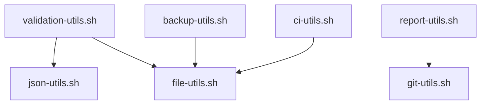

# Shared Utility Scripts

This directory contains shared utility scripts that provide common functionality for Claude Code artifact commands. These scripts promote code reuse, consistency, and maintainability across the MeatyPrompts command ecosystem.

## Overview

The utility scripts are designed to:
- **Eliminate code duplication** across artifact commands
- **Provide consistent interfaces** for common operations
- **Enable gradual migration** from inline command code
- **Maintain command independence** through graceful fallbacks
- **Support multiple output formats** for different use cases

## Available Scripts

| Script | Functions | Size | Purpose |
|--------|-----------|------|---------|
| [git-utils.sh](#git-utilssh) | 15+ | 9.6KB | Git operations, branch management, change detection |
| [report-utils.sh](#report-utilssh) | 20+ | 16KB | Structured reporting with multiple output formats |
| [validation-utils.sh](#validation-utilssh) | 25+ | 15KB | Schema validation, project structure validation |
| [file-utils.sh](#file-utilssh) | 20+ | 13KB | File discovery, filtering, size analysis |
| [json-utils.sh](#json-utilssh) | 15+ | 11KB | JSON validation, formatting, manipulation |
| [backup-utils.sh](#backup-utilssh) | 25+ | 17KB | Backup/restore operations with manifests |
| [ci-utils.sh](#ci-utilssh) | 30+ | 18KB | CI/CD workflow generation (GitHub Actions, Docker) |

## Usage Patterns

### Basic Script Sourcing
```bash
#!/bin/bash

# Source required utilities at the top of your command
source .claude/scripts/git-utils.sh
source .claude/scripts/report-utils.sh
source .claude/scripts/validation-utils.sh

# Your command logic here
init_report "My Command"
add_report_section "Status" "Starting operations..." "info"
```

### Defensive Sourcing with Fallbacks
```bash
# Attempt to source utilities with fallback
if source .claude/scripts/git-utils.sh 2>/dev/null; then
    echo "Using shared git utilities"
else
    echo "Warning: Shared utilities not available, using fallback"
    # Define minimal fallback functions
    get_changed_files() { git diff --name-only HEAD~1..HEAD; }
fi
```

### Function Availability Check
```bash
# Check if specific functions are available
if type get_git_status_report >/dev/null 2>&1; then
    get_git_status_report "text"
else
    # Fallback implementation
    git status --porcelain
fi
```

## Script Documentation

### git-utils.sh

**Purpose**: Comprehensive Git operations for artifact commands

**Key Functions**:

#### Change Detection & Analysis
```bash
get_changed_files([base_branch])
# Returns: List of files changed since branch point
# Usage: changed_files=$(get_changed_files "main")

get_git_status_report([format])
# Returns: Formatted Git status report (text/json/html)
# Usage: get_git_status_report "json"

detect_change_scope([commit_count])
# Returns: Change scope classification (major/minor/patch)
# Usage: scope=$(detect_change_scope 10)

get_recent_commits([count] [format])
# Returns: Recent commit history with formatting
# Usage: get_recent_commits 5 "oneline"
```

#### Branch Management
```bash
get_main_branch()
# Returns: Main branch name (main/master/develop)
# Usage: main_branch=$(get_main_branch)

branch_exists([branch_name])
# Returns: 0 if branch exists, 1 otherwise
# Usage: if branch_exists "feature/new"; then...

create_backup_branch([suffix])
# Creates: Backup branch with timestamp
# Usage: backup_branch=$(create_backup_branch "pre-update")

ensure_clean_state()
# Validates: Working directory is clean
# Usage: ensure_clean_state || exit 1
```

#### Repository Information
```bash
get_repo_root()
# Returns: Absolute path to repository root
# Usage: repo_root=$(get_repo_root)

check_git_repo()
# Validates: Current directory is in Git repository
# Usage: check_git_repo || { echo "Not a git repo"; exit 1; }
```

**Dependencies**: None (core Git operations)

### report-utils.sh

**Purpose**: Structured reporting with multiple output formats

**Global Variables**:
```bash
REPORT_START_TIME    # Timestamp when report started
REPORT_TITLE         # Current report title
REPORT_SECTIONS=()   # Array of report sections
```

**Key Functions**:

#### Report Management
```bash
init_report([title])
# Initializes: New report with title and timestamp
# Usage: init_report "Validation Report"

add_report_section([section_name] [content] [type])
# Adds: Section with content and type (info/warning/error/success)
# Usage: add_report_section "Validation" "Checking files..." "info"

generate_report([format] [output_file])
# Generates: Final report in specified format
# Usage: generate_report "html" "report.html"
```

#### Status Messages
```bash
add_success([message])
# Adds: Success message with green formatting
# Usage: add_success "All tests passed"

add_error([message])
# Adds: Error message with red formatting
# Usage: add_error "Missing required file"

add_warning([message])
# Adds: Warning message with yellow formatting
# Usage: add_warning "Deprecated function used"
```

#### Formatting
```bash
create_table([headers...])
# Creates: Formatted table structure
# Usage: create_table "Name" "Status" "Notes"

append_progress([current] [total] [message])
# Updates: Progress indicator
# Usage: append_progress 5 10 "Processing files"
```

**Output Formats**:
- **text**: Plain text with color codes
- **json**: Structured JSON for programmatic use
- **html**: HTML report with styling
- **markdown**: Markdown format for documentation

**Dependencies**: None (bash built-ins and ANSI colors)

### validation-utils.sh

**Purpose**: Comprehensive validation for project structure and files

**Key Functions**:

#### Project File Validation
```bash
validate_package_json([file_path] [strict])
# Validates: package.json structure and required fields
# Returns: 0 if valid, 1 with detailed error messages
# Usage: validate_package_json "package.json" true

validate_pyproject_toml([file_path] [strict])
# Validates: Python project configuration
# Returns: 0 if valid, 1 with error details
# Usage: validate_pyproject_toml "pyproject.toml"

validate_required_files([file_list...])
# Validates: Required project files exist
# Usage: validate_required_files "package.json" "tsconfig.json"
```

#### Structure Validation
```bash
validate_directory_structure([config_file])
# Validates: Project directory structure against expected layout
# Usage: validate_directory_structure ".structure.yaml"

validate_file_permissions([path] [expected_mode])
# Validates: File permissions match expected values
# Usage: validate_file_permissions "script.sh" "755"

check_dependencies([package_manager])
# Validates: Dependency consistency and security
# Usage: check_dependencies "npm"
```

#### Content Validation
```bash
validate_json_schema([json_file] [schema_file])
# Validates: JSON file against JSON schema
# Usage: validate_json_schema "config.json" "schema.json"

validate_yaml_syntax([yaml_file])
# Validates: YAML file syntax and structure
# Usage: validate_yaml_syntax "workflow.yml"
```

**Dependencies**: json-utils.sh, file-utils.sh

### file-utils.sh

**Purpose**: File system operations and analysis

**Key Functions**:

#### File Discovery
```bash
find_files_by_pattern([pattern] [path] [max_depth])
# Finds: Files matching pattern with optional depth limit
# Usage: find_files_by_pattern "*.ts" "src" 3

find_large_files([size_threshold] [path])
# Finds: Files exceeding size threshold
# Usage: find_large_files "10MB" "."

get_file_info([file_path])
# Returns: Comprehensive file information (size, permissions, dates)
# Usage: get_file_info "package.json"
```

#### Directory Operations
```bash
create_directory_tree([structure_spec])
# Creates: Directory structure from specification
# Usage: create_directory_tree "src/{components,hooks,utils}"

analyze_directory_structure([path] [max_depth])
# Analyzes: Directory structure and generates tree
# Usage: analyze_directory_structure "." 3

get_directory_size([path] [unit])
# Returns: Directory size in specified unit
# Usage: get_directory_size "node_modules" "MB"
```

#### File Content Operations
```bash
extract_file_metadata([file_path])
# Extracts: Metadata from file headers/frontmatter
# Usage: extract_file_metadata "README.md"

filter_files_by_content([pattern] [files...])
# Filters: Files containing specific content patterns
# Usage: filter_files_by_content "TODO" "src/*.ts"
```

**Dependencies**: None (uses standard Unix tools)

### json-utils.sh

**Purpose**: JSON processing and validation

**Key Functions**:

#### JSON Validation
```bash
validate_json_file([file_path] [strict])
# Validates: JSON file syntax and structure
# Returns: 0 if valid, detailed error messages if invalid
# Usage: validate_json_file "config.json" true

validate_json_string([json_string])
# Validates: JSON string syntax
# Usage: validate_json_string "$json_data"
```

#### JSON Manipulation
```bash
json_extract([file_path] [jq_query] [input_type])
# Extracts: Data using jq queries
# Usage: json_extract "package.json" ".name" "file"

json_merge([file1] [file2] [output_file])
# Merges: Multiple JSON files
# Usage: json_merge "base.json" "override.json" "merged.json"

json_format([input_file] [output_file] [style])
# Formats: JSON with specified style (compact/pretty)
# Usage: json_format "input.json" "output.json" "pretty"
```

#### JSON Generation
```bash
create_json_object([key_value_pairs...])
# Creates: JSON object from key-value pairs
# Usage: create_json_object "name" "value" "version" "1.0"

array_to_json([array_items...])
# Converts: Bash array to JSON array
# Usage: array_to_json "item1" "item2" "item3"
```

**Dependencies**: jq (JSON processor)

### backup-utils.sh

**Purpose**: Backup and restore operations with manifest tracking

**Key Functions**:

#### Backup Operations
```bash
create_backup_set([name] [paths...])
# Creates: Complete backup set with manifest
# Returns: Backup ID for restoration
# Usage: backup_id=$(create_backup_set "pre-update" "src" "docs")

create_incremental_backup([base_backup_id] [name])
# Creates: Incremental backup based on previous backup
# Usage: create_incremental_backup "$base_id" "daily-increment"

backup_path([source_path] [backup_name])
# Backs up: Single path with metadata
# Usage: backup_path "config.json" "config-backup"
```

#### Restore Operations
```bash
restore_backup_set([backup_id])
# Restores: Complete backup set to original locations
# Usage: restore_backup_set "$backup_id"

restore_path([backup_path] [target_path])
# Restores: Single file or directory
# Usage: restore_path "$backup/config.json" "config.json"
```

#### Backup Management
```bash
list_backups([filter])
# Lists: Available backups with metadata
# Usage: list_backups "config*"

cleanup_old_backups([retention_days])
# Cleans: Backups older than specified days
# Usage: cleanup_old_backups 30

create_backup_manifest([backup_id] [metadata...])
# Creates: Manifest file with backup metadata
# Usage: create_backup_manifest "$id" "user:$USER" "reason:pre-update"
```

**Dependencies**: None (uses tar and standard tools)

### ci-utils.sh

**Purpose**: CI/CD workflow generation and management

**Key Functions**:

#### GitHub Actions
```bash
generate_github_workflow([name] [triggers...])
# Generates: GitHub Actions workflow file
# Usage: generate_github_workflow "test" "push" "pull_request"

add_nodejs_setup([workflow_file] [node_version])
# Adds: Node.js setup steps to workflow
# Usage: add_nodejs_setup ".github/workflows/test.yml" "18"

add_python_setup([workflow_file] [python_version])
# Adds: Python setup steps to workflow
# Usage: add_python_setup ".github/workflows/api.yml" "3.11"
```

#### Docker Integration
```bash
generate_dockerfile([app_type] [base_image])
# Generates: Dockerfile for application type
# Usage: generate_dockerfile "nodejs" "node:18-alpine"

generate_docker_compose([services...])
# Generates: Docker Compose configuration
# Usage: generate_docker_compose "web" "api" "db"
```

#### Deployment
```bash
add_deployment_steps([workflow_file] [environment])
# Adds: Deployment steps to CI workflow
# Usage: add_deployment_steps "deploy.yml" "production"

add_security_scanning([workflow_file])
# Adds: Security scanning steps
# Usage: add_security_scanning "security.yml"
```

**Dependencies**: None (generates configuration files)

## Script Dependencies



## Best Practices

### Script Development
1. **Use consistent error handling** with proper exit codes
2. **Provide fallback behavior** when dependencies are missing
3. **Include usage examples** in function comments
4. **Follow naming conventions** (verb_noun pattern)
5. **Make functions idempotent** where possible

### Function Design
```bash
# Good function design
function_name() {
    local param1="${1:-default_value}"
    local param2="${2}"

    # Validate required parameters
    [[ -z "$param2" ]] && {
        echo "Error: param2 is required" >&2
        return 1
    }

    # Function logic here
    echo "Result: $result"
    return 0
}
```

### Error Handling
```bash
# Consistent error reporting
error_exit() {
    echo "Error: $1" >&2
    exit "${2:-1}"
}

# Use in functions
some_function() {
    local result
    result=$(some_command) || {
        error_exit "Failed to execute command" 2
    }
    echo "$result"
}
```

### Extending Scripts

To add new functions to existing scripts:

1. **Follow existing patterns** in the script
2. **Add comprehensive comments** with usage examples
3. **Include input validation** and error handling
4. **Update this documentation** with new functions
5. **Test with existing commands** to ensure compatibility

## Migration Guide

### Converting Inline Functions

**Before** (inline in command):
```bash
# In command file
validate_json() {
    local file="$1"
    if ! jq empty "$file" 2>/dev/null; then
        echo "Invalid JSON: $file"
        return 1
    fi
}
```

**After** (using shared utility):
```bash
# In command file
source .claude/scripts/json-utils.sh

# Use shared function
if ! validate_json_file "$file"; then
    echo "Validation failed"
    exit 1
fi
```

### Benefits of Migration
- **Reduced code duplication** across commands
- **Consistent error handling** and output formatting
- **Easier testing** of individual functions
- **Better maintainability** with single source of truth
- **Enhanced functionality** through shared improvements

## Testing Utilities

Each utility script can be tested independently:

```bash
# Test git-utils functions
bash -c "source .claude/scripts/git-utils.sh && get_main_branch"

# Test validation functions
bash -c "source .claude/scripts/validation-utils.sh && validate_package_json package.json"

# Test with fallback when utilities missing
bash -c "source .claude/scripts/nonexistent.sh 2>/dev/null || echo 'Fallback mode'"
```

## Future Enhancements

### Planned Additions
1. **artifact-utils.sh** - AI artifact management functions
2. **architecture-utils.sh** - Architecture validation functions
3. **contract-utils.sh** - API contract management functions

### Enhancement Ideas
- **Performance monitoring** functions for commands
- **Parallel processing** utilities for batch operations
- **Advanced Git operations** (conflict resolution, merge strategies)
- **Cloud deployment** utilities (AWS, GCP, Azure)
- **Database migration** helpers

## Contributing

When contributing to utility scripts:

1. **Follow existing conventions** and patterns
2. **Add comprehensive tests** for new functions
3. **Update documentation** with examples
4. **Ensure backward compatibility** with existing commands
5. **Consider performance implications** for large repositories

The utility scripts are the foundation of the MeatyPrompts artifact system - they enable powerful, maintainable, and consistent automation across the entire development workflow.
