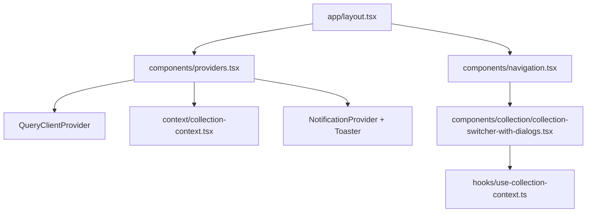
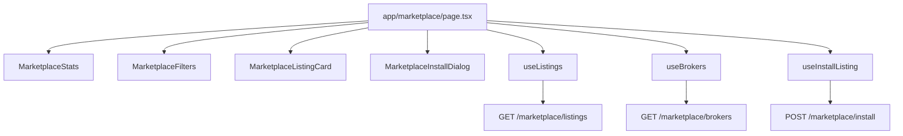
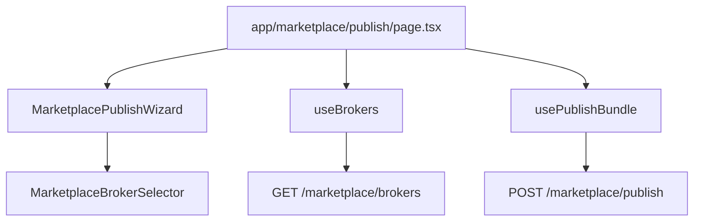

# Web App Map (Collections Focus)

Scope: This map inventories all web routes, then deep-dives on `/collection`, `/manage`, `/projects`, and `/projects/[id]` plus the shared collection/entity lifecycle used by related pages. Other pages are listed but not yet decomposed.

Sources: `skillmeat/web/app`, `skillmeat/web/components`, `skillmeat/web/hooks`, `skillmeat/web/lib/api`.

## Route inventory (all pages)

- `/` -> `skillmeat/web/app/page.tsx`
- `/collection` -> `skillmeat/web/app/collection/page.tsx`
- `/manage` -> `skillmeat/web/app/manage/page.tsx`
- `/projects` -> `skillmeat/web/app/projects/page.tsx`
- `/projects/[id]` -> `skillmeat/web/app/projects/[id]/page.tsx`
- `/projects/[id]/manage` -> `skillmeat/web/app/projects/[id]/manage/page.tsx`
- `/projects/[id]/settings` -> `skillmeat/web/app/projects/[id]/settings/page.tsx`
- `/templates` -> `skillmeat/web/app/templates/page.tsx`
- `/deployments` -> `skillmeat/web/app/deployments/page.tsx`
- `/marketplace` -> `skillmeat/web/app/marketplace/page.tsx`
- `/marketplace/publish` -> `skillmeat/web/app/marketplace/publish/page.tsx`
- `/marketplace/[listing_id]` -> `skillmeat/web/app/marketplace/[listing_id]/page.tsx`
- `/marketplace/sources` -> `skillmeat/web/app/marketplace/sources/page.tsx`
- `/marketplace/sources/[id]` -> `skillmeat/web/app/marketplace/sources/[id]/page.tsx`
- `/mcp` -> `skillmeat/web/app/mcp/page.tsx`
- `/mcp/[name]` -> `skillmeat/web/app/mcp/[name]/page.tsx`
- `/context-entities` -> `skillmeat/web/app/context-entities/page.tsx`
- `/sharing` -> `skillmeat/web/app/sharing/page.tsx`
- `/settings` -> `skillmeat/web/app/settings/page.tsx`

## Global layout and providers (apply to all pages)

- Shell: `skillmeat/web/app/layout.tsx`
- Providers: `skillmeat/web/components/providers.tsx`
  - `QueryClientProvider` (TanStack Query)
  - `CollectionProvider` (collection selection + collection/group data)
  - `NotificationProvider` + `Toaster`
- Navigation: `skillmeat/web/components/navigation.tsx`
  - Uses `CollectionSwitcherWithDialogs` which reads/writes `CollectionProvider` state

Mermaid overview:



## Collections page: `/collection`

Entry: `skillmeat/web/app/collection/page.tsx`

### Component tree (page level)

- `CollectionPage` (wraps `EntityLifecycleProvider` mode=collection)
  - `CollectionPageContent`
    - `CollectionHeader`
    - `CollectionToolbar`
      - `TagFilterPopover` and `TagFilterBar`
    - `ArtifactGrid` or `ArtifactList` (view mode)
    - `UnifiedEntityModal`
    - `EditCollectionDialog`
    - `CreateCollectionDialog`
    - `ParameterEditorModal`
    - `ArtifactDeletionDialog`

### Page-local functions and state

- Functions in `skillmeat/web/app/collection/page.tsx`
  - `enrichArtifactSummary`: merges lightweight collection artifacts with full artifact data
  - `artifactToEntity`: converts `Artifact` to `Entity` for modal
  - Event handlers: `handleEditFromDropdown`, `handleDeleteFromDropdown`, `handleSaveParameters`, `handleArtifactClick`, `handleRefresh`, `handleTagsChange`, `handleSortChange`, `handleCollectionClick`
- Local state
  - View: `viewMode`, filters, search query, sort
  - UI: selected entity, modals, refresh state
  - URL-driven tags via `useSearchParams`

### Hooks used (page and child components)

- Page (`skillmeat/web/app/collection/page.tsx`)
  - `useCollectionContext` (selected collection + collections/groups)
  - `useCollectionArtifacts` (collection-specific list)
  - `useArtifacts` (all artifacts list)
  - `useEditArtifactParameters` (parameter save)
  - `useToast`, `useSearchParams`, `useRouter`
- Collection context provider (`skillmeat/web/context/collection-context.tsx`)
  - `useCollections`, `useCollection`, `useGroups`
- Tag UI (`skillmeat/web/components/ui/tag-filter-popover.tsx`)
  - `useTags`
- Collection dialogs
  - `EditCollectionDialog`: `useUpdateCollection`, `useDeleteCollection`, `useCollectionContext`
  - `CreateCollectionDialog`: `useCreateCollection`, `useCollectionContext`
- Entity modal and sub-tabs
  - `UnifiedEntityModal`: `useEntityLifecycle`, `useDeploymentList`, `useEditArtifactParameters`, `usePendingContextChanges`, internal `useQuery`
  - `ModalCollectionsTab`: `useRemoveArtifactFromCollection`, `useCollectionContext`
  - `MoveCopyDialog`: `useAddArtifactToCollection`, `useRemoveArtifactFromCollection`
  - `SyncStatusTab`: `useQuery` + `apiRequest` for diff/upstream/sync/deploy
- Deletion flow
  - `ArtifactDeletionDialog`: `useArtifactDeletion`, `useDeploymentList`

### API calls (collections page + shared modals)

All `apiRequest` calls resolve to `${NEXT_PUBLIC_API_URL}/api/${NEXT_PUBLIC_API_VERSION}` via `skillmeat/web/lib/api.ts`.

Collections and groups
- `GET /user-collections` (list) from `useCollections`
- `GET /user-collections/{id}` (detail) from `useCollection`
- `GET /user-collections/{id}/artifacts` (collection contents) from `useCollectionArtifacts`
- `POST /user-collections` (create) from `useCreateCollection`
- `PUT /user-collections/{id}` (update) from `useUpdateCollection`
- `DELETE /user-collections/{id}` (delete) from `useDeleteCollection`
- `POST /user-collections/{id}/artifacts` (add artifact) from `useAddArtifactToCollection`
- `DELETE /user-collections/{id}/artifacts/{artifactId}` (remove artifact) from `useRemoveArtifactFromCollection`
- `GET /groups?collection_id={id}` (groups list) from `useGroups`
- `PUT /collections/{id}/groups/reorder` (group ordering) from `useReorderGroups`

Artifacts and parameters
- `GET /artifacts?limit=...` (list) from `useArtifacts`
- `GET /artifacts/{id}` (detail) from `useArtifact`
- `PUT /artifacts/{id}` (update) from `useUpdateArtifact`
- `DELETE /artifacts/{id}` (delete) from `useDeleteArtifact` and `useArtifactDeletion`
- `PUT /artifacts/{id}/parameters` (edit parameters) from `useEditArtifactParameters`

Tags
- `GET /tags` (list) from `useTags` via `TagFilterPopover` and `ParameterEditorModal`

Deployments
- `GET /deploy` (list deployments) from `useDeploymentList`
- `POST /deploy/undeploy` (undeploy artifact) from `useArtifactDeletion`

UnifiedEntityModal (files, diff, sync)
- `GET /artifacts/{id}/files` (list files)
- `GET /artifacts/{id}/files/{path}` (read file)
- `PUT /artifacts/{id}/files/{path}` (save file)
- `POST /artifacts/{id}/files/{path}` (create file)
- `DELETE /artifacts/{id}/files/{path}` (delete file)
- `GET /artifacts/{id}/diff?project_path=...` (collection vs project diff)
- `GET /artifacts/{id}/upstream-diff` (source vs collection diff)
- `POST /artifacts/{id}/sync` (sync/rollback)
- `POST /artifacts/{id}/deploy` (deploy from collection to project)

Context sync (used by UnifiedEntityModal for context entities)
- `GET /context-sync/status?project_path=...` from `useContextSyncStatus`
- `POST /context-sync/pull` from `usePullContextChanges`
- `POST /context-sync/push` from `usePushContextChanges`
- `POST /context-sync/resolve` from `useResolveContextConflict`

Sync dialog (optional from SyncStatusTab)
- `POST /api/v1/artifacts/{id}/sync` from `useSync` (note: relative endpoint)

### Visual map (page -> components -> hooks -> APIs)

```mermaid
flowchart TB
  CollectionPage[app/collection/page.tsx] --> CollectionHeader
  CollectionPage --> CollectionToolbar
  CollectionPage --> ArtifactGrid
  CollectionPage --> ArtifactList
  CollectionPage --> UnifiedEntityModal
  CollectionPage --> EditCollectionDialog
  CollectionPage --> CreateCollectionDialog
  CollectionPage --> ParameterEditorModal
  CollectionPage --> ArtifactDeletionDialog

  CollectionToolbar --> TagFilterPopover
  TagFilterPopover --> useTags

  CollectionPage --> useCollectionContext
  useCollectionContext --> CollectionProvider[context/collection-context.tsx]
  CollectionProvider --> useCollections
  CollectionProvider --> useCollection
  CollectionProvider --> useGroups

  CollectionPage --> useCollectionArtifacts
  CollectionPage --> useArtifacts
  CollectionPage --> useEditArtifactParameters

  EditCollectionDialog --> useUpdateCollection
  EditCollectionDialog --> useDeleteCollection
  CreateCollectionDialog --> useCreateCollection

  ArtifactDeletionDialog --> useArtifactDeletion
  ArtifactDeletionDialog --> useDeploymentList

  UnifiedEntityModal --> useEntityLifecycle
  UnifiedEntityModal --> useDeploymentList
  UnifiedEntityModal --> usePendingContextChanges
  UnifiedEntityModal --> ModalCollectionsTab
  ModalCollectionsTab --> MoveCopyDialog
  MoveCopyDialog --> useAddArtifactToCollection
  MoveCopyDialog --> useRemoveArtifactFromCollection

  useCollections --> API_UserCollections[GET /user-collections]
  useCollection --> API_Collection[GET /user-collections/{id}]
  useCollectionArtifacts --> API_CollectionArtifacts[GET /user-collections/{id}/artifacts]
  useArtifacts --> API_Artifacts[GET /artifacts]
  useEditArtifactParameters --> API_Params[PUT /artifacts/{id}/parameters]
  useTags --> API_Tags[GET /tags]
  useUpdateCollection --> API_UpdateCollection[PUT /user-collections/{id}]
  useDeleteCollection --> API_DeleteCollection[DELETE /user-collections/{id}]
  useCreateCollection --> API_CreateCollection[POST /user-collections]
  useArtifactDeletion --> API_DeleteArtifact[DELETE /artifacts/{id}]
  useDeploymentList --> API_Deployments[GET /deploy]
```

## Manage page: `/manage`

Entry: `skillmeat/web/app/manage/page.tsx`

### Component tree (page level)

- `ManagePage` (wraps `EntityLifecycleProvider` mode=collection)
  - `ManagePageContent`
    - `EntityTabs`
      - `EntityFilters`
      - `EntityList` (grid or list view)
    - `AddEntityDialog` -> `EntityForm` (create)
    - Inline edit modal -> `EntityForm` (edit)
    - `UnifiedEntityModal`

### Hooks used (page and child components)

- Page (`skillmeat/web/app/manage/page.tsx`)
  - `useEntityLifecycle` (entities, filters, delete)
  - `useSearchParams` (tab selection)
- Entity form (`skillmeat/web/components/entity/entity-form.tsx`)
  - `useEntityLifecycle` (create/update)
  - `useGitHubMetadata`
  - `useTags`, `useArtifactTags`, `useAddTagToArtifact`, `useRemoveTagFromArtifact`, `useCreateTag`
- Entity list (`skillmeat/web/components/entity/entity-list.tsx`)
  - `useEntityLifecycle` (selection + loading state)

### API calls (manage page + entity form)

- `GET /artifacts?limit=...&artifact_type=...` (list) from `useEntityLifecycle`
- `POST /artifacts` (create) from `useEntityLifecycle`
- `PUT /artifacts/{id}` (update) from `useEntityLifecycle`
- `DELETE /artifacts/{id}` (delete) from `useEntityLifecycle`
- `POST /artifacts/{id}/deploy` (deploy) from `useEntityLifecycle`
- `POST /artifacts/{id}/sync` (sync) from `useEntityLifecycle`
- `GET /artifacts/metadata/github?source=...` from `useGitHubMetadata`
- `GET /tags` from `useTags`
- `POST /tags` from `useCreateTag`
- `GET /artifacts/{id}/tags` from `useArtifactTags`
- `POST /artifacts/{id}/tags/{tagId}` from `useAddTagToArtifact`
- `DELETE /artifacts/{id}/tags/{tagId}` from `useRemoveTagFromArtifact`
- `UnifiedEntityModal` uses the same file/diff/sync endpoints listed in the `/collection` section

### Visual map (page -> components -> hooks -> APIs)

```mermaid
flowchart TB
  ManagePage[app/manage/page.tsx] --> EntityLifecycleProvider
  EntityLifecycleProvider --> ManageContent[ManagePageContent]
  ManageContent --> EntityTabs
  EntityTabs --> EntityFilters
  EntityTabs --> EntityList
  ManageContent --> AddEntityDialog
  AddEntityDialog --> EntityForm
  ManageContent --> UnifiedEntityModal

  EntityForm --> useEntityLifecycle
  EntityForm --> useGitHubMetadata
  EntityForm --> useTags
  EntityForm --> useArtifactTags
  EntityForm --> useAddTagToArtifact
  EntityForm --> useRemoveTagFromArtifact
  EntityForm --> useCreateTag

  useEntityLifecycle --> API_Artifacts[GET/POST/PUT/DELETE /artifacts]
  useEntityLifecycle --> API_SyncDeploy[POST /artifacts/{id}/deploy + /sync]
  useGitHubMetadata --> API_GitHub[GET /artifacts/metadata/github]
  useTags --> API_Tags[GET /tags]
  useCreateTag --> API_CreateTag[POST /tags]
  useArtifactTags --> API_ArtifactTags[GET /artifacts/{id}/tags]
  useAddTagToArtifact --> API_AddTag[POST /artifacts/{id}/tags/{tagId}]
  useRemoveTagFromArtifact --> API_RemoveTag[DELETE /artifacts/{id}/tags/{tagId}]
```

## Projects list page: `/projects`

Entry: `skillmeat/web/app/projects/page.tsx`

### Component tree (page level)

- `ProjectsPage`
  - `ProjectsToolbar` -> `CacheFreshnessIndicator`
  - `ProjectsList`
    - `ProjectActions` -> `EditProjectDialog`, `DeleteProjectDialog`
  - Project summary `Dialog`
  - `CreateProjectDialog`
  - `UpdateAvailableModal`

### Hooks used (page and child components)

- Page (`skillmeat/web/app/projects/page.tsx`)
  - `useProjectCache`
  - `useOutdatedArtifacts`
  - `useRouter`
- Toolbar (`skillmeat/web/components/ProjectsToolbar.tsx`)
  - `useCacheRefresh`
- Projects list (`skillmeat/web/components/ProjectsList.tsx`)
  - `useOutdatedArtifacts`
- Project dialogs (`skillmeat/web/app/projects/components/*.tsx`)
  - `useCreateProject`, `useUpdateProject`, `useDeleteProject`

### API calls

- `GET /projects` (list) from `useProjectCache`
- `GET /projects?refresh=true` (force refresh) from `useProjectCache.forceRefresh`
- `POST /projects/cache/refresh` from `useCacheRefresh`
- `GET /cache/stale-artifacts` from `useOutdatedArtifacts`
- `POST /projects` from `useCreateProject`
- `PUT /projects/{id}` from `useUpdateProject`
- `DELETE /projects/{id}?delete_files=...` from `useDeleteProject`

### Visual map (page -> components -> hooks -> APIs)

```mermaid
flowchart TB
  ProjectsPage[app/projects/page.tsx] --> ProjectsToolbar
  ProjectsPage --> ProjectsList
  ProjectsPage --> CreateProjectDialog
  ProjectsPage --> UpdateAvailableModal
  ProjectsList --> ProjectActions
  ProjectActions --> EditProjectDialog
  ProjectActions --> DeleteProjectDialog

  ProjectsPage --> useProjectCache
  ProjectsPage --> useOutdatedArtifacts
  ProjectsToolbar --> useCacheRefresh
  CreateProjectDialog --> useCreateProject
  EditProjectDialog --> useUpdateProject
  DeleteProjectDialog --> useDeleteProject

  useProjectCache --> API_Projects[GET /projects]
  useProjectCache --> API_ProjectsRefresh[GET /projects?refresh=true]
  useCacheRefresh --> API_CacheRefresh[POST /projects/cache/refresh]
  useOutdatedArtifacts --> API_StaleArtifacts[GET /cache/stale-artifacts]
  useCreateProject --> API_CreateProject[POST /projects]
  useUpdateProject --> API_UpdateProject[PUT /projects/{id}]
  useDeleteProject --> API_DeleteProject[DELETE /projects/{id}]
```

## Project detail page: `/projects/[id]`

Entry: `skillmeat/web/app/projects/[id]/page.tsx`

### Component tree (page level)

- `ProjectDetailPage` (Suspense)
  - `ProjectDetailPageContent`
    - `EntityLifecycleProvider` (mode=project)
      - `DiscoveryBanner`
      - `Tabs`
        - `Deployed` tab: stats + deployed artifacts list
        - `Discovery` tab: `DiscoveryTab`
      - `UnifiedEntityModal`
      - `BulkImportModal`

### Hooks used (page and child components)

- Page (`skillmeat/web/app/projects/[id]/page.tsx`)
  - `useProject` (project details)
  - `useArtifacts` (collection list for matching)
  - `useProjectDiscovery` (scan + bulk import)
  - `useSearchParams`, `useRouter`, `usePathname`
  - `useToast`
- Discovery UI
  - `DiscoveryTab` (UI-only; uses analytics)
  - `BulkImportModal` (uses analytics + toast notification)
- Entity modal
  - `UnifiedEntityModal` uses the same file/diff/sync endpoints listed in the `/collection` section

### API calls

- `GET /projects/{id}` from `useProject`
- `GET /artifacts?limit=...` from `useArtifacts`
- `POST /artifacts/discover/project/{encodedPath}` from `useProjectDiscovery`
- `POST /artifacts/discover/import?project_id=...` from `useProjectDiscovery`
- `UnifiedEntityModal` uses the same file/diff/sync endpoints listed in the `/collection` section

### Visual map (page -> components -> hooks -> APIs)

```mermaid
flowchart TB
  ProjectDetail[app/projects/[id]/page.tsx] --> ProjectDetailContent
  ProjectDetailContent --> EntityLifecycleProviderProject[EntityLifecycleProvider mode=project]
  EntityLifecycleProviderProject --> DiscoveryBanner
  EntityLifecycleProviderProject --> Tabs
  Tabs --> DeployedTab[Deployed tab]
  Tabs --> DiscoveryTab
  EntityLifecycleProviderProject --> UnifiedEntityModal
  EntityLifecycleProviderProject --> BulkImportModal

  ProjectDetailContent --> useProject
  ProjectDetailContent --> useArtifacts
  ProjectDetailContent --> useProjectDiscovery

  useProject --> API_ProjectDetail[GET /projects/{id}]
  useArtifacts --> API_ArtifactsList[GET /artifacts]
  useProjectDiscovery --> API_ProjectDiscover[POST /artifacts/discover/project/{path}]
  useProjectDiscovery --> API_ProjectImport[POST /artifacts/discover/import]
```

## Project manage page: `/projects/[id]/manage`

Entry: `skillmeat/web/app/projects/[id]/manage/page.tsx`

### Component tree (page level)

- `ProjectManagePage`
  - `EntityLifecycleProvider` (mode=project)
    - `ProjectManagePageContent`
      - `EntityTabs`
        - `EntityFilters`
        - `EntityList` (grid or list view)
      - `UnifiedEntityModal`
      - `DeployFromCollectionDialog`
      - `PullToCollectionDialog`
      - Inline edit modal -> `EntityForm` (edit)

### Hooks used (page and child components)

- Page (`skillmeat/web/app/projects/[id]/manage/page.tsx`)
  - `useProject` (fetch project path)
  - `useEntityLifecycle` (entities, filters, delete)
  - `useSearchParams`, `useRouter`
- Entity form (`skillmeat/web/components/entity/entity-form.tsx`)
  - `useEntityLifecycle` (update)
  - `useTags`, `useArtifactTags`, `useAddTagToArtifact`, `useRemoveTagFromArtifact`, `useCreateTag`
- `DeployFromCollectionDialog`
  - Direct `apiRequest` for collection entities + deploy
- `PullToCollectionDialog`
  - Direct `apiRequest` for diff + sync

### API calls

- `GET /projects/{id}` from `useProject` (resolve project path)
- `GET /projects/{id}` from `useEntityLifecycle` (project entity list)
- `GET /artifacts?artifact_type=...` from `DeployFromCollectionDialog` (collection entities)
- `POST /artifacts/{id}/deploy` from `DeployFromCollectionDialog`
- `GET /artifacts/{id}/diff?project_path=...` from `PullToCollectionDialog`
- `POST /artifacts/{id}/sync` from `PullToCollectionDialog`
- `UnifiedEntityModal` uses the same file/diff/sync endpoints listed in the `/collection` section

### Visual map (page -> components -> hooks -> APIs)

```mermaid
flowchart TB
  ProjectManage[app/projects/[id]/manage/page.tsx] --> EntityLifecycleProviderProject
  EntityLifecycleProviderProject --> ProjectManageContent
  ProjectManageContent --> EntityTabs
  ProjectManageContent --> EntityList
  ProjectManageContent --> UnifiedEntityModal
  ProjectManageContent --> DeployFromCollectionDialog
  ProjectManageContent --> PullToCollectionDialog
  ProjectManageContent --> EntityForm

  ProjectManage --> useProject
  ProjectManageContent --> useEntityLifecycle
  DeployFromCollectionDialog --> API_ArtifactsList[GET /artifacts]
  DeployFromCollectionDialog --> API_Deploy[POST /artifacts/{id}/deploy]
  PullToCollectionDialog --> API_Diff[GET /artifacts/{id}/diff]
  PullToCollectionDialog --> API_Sync[POST /artifacts/{id}/sync]
```

## Project settings page: `/projects/[id]/settings`

Entry: `skillmeat/web/app/projects/[id]/settings/page.tsx`

### Component tree (page level)

- `ProjectSettingsPage`
  - Project header + read-only path/id
  - Edit form (name/description)
  - Statistics card
  - Danger zone -> `DeleteProjectDialog`

### Hooks used (page and child components)

- Page
  - `useProject` (fetch details)
  - `useUpdateProject` (save)
  - `useRouter`, `useToast`
- `DeleteProjectDialog`
  - `useDeleteProject`

### API calls

- `GET /projects/{id}` from `useProject`
- `PUT /projects/{id}` from `useUpdateProject`
- `DELETE /projects/{id}?delete_files=...` from `useDeleteProject`

### Visual map (page -> components -> hooks -> APIs)

```mermaid
flowchart TB
  ProjectSettings[app/projects/[id]/settings/page.tsx] --> useProject
  ProjectSettings --> useUpdateProject
  ProjectSettings --> DeleteProjectDialog
  DeleteProjectDialog --> useDeleteProject

  useProject --> API_ProjectDetail[GET /projects/{id}]
  useUpdateProject --> API_UpdateProject[PUT /projects/{id}]
  useDeleteProject --> API_DeleteProject[DELETE /projects/{id}]
```

## Marketplace pages: `/marketplace` and sub-pages

Scope: Marketplace listings, listing detail, publishing, GitHub sources, and source catalogs.

Shared sources: `skillmeat/web/app/marketplace`, `skillmeat/web/components/marketplace`, `skillmeat/web/hooks/useMarketplace*`, `skillmeat/web/lib/api/marketplace.ts`, `skillmeat/web/lib/api/catalog.ts`.

---

## Marketplace listings page: `/marketplace`

Entry: `skillmeat/web/app/marketplace/page.tsx`

### Component tree (page level)

- `MarketplacePage`
  - `MarketplaceStats`
  - `MarketplaceFilters`
  - `MarketplaceListingCard` (listings grid)
  - `MarketplaceInstallDialog`

### Page-local functions and state

- `filters`, `selectedListing`, `isInstallDialogOpen`
- `handleListingClick` -> route to `/marketplace/[listing_id]`
- `handleInstallConfirm` -> install listing with strategy
- `handleLoadMore` -> fetch next page

### Hooks used

- `useListings` (infinite listings)
- `useBrokers` (broker list for filters)
- `useInstallListing` (install flow)
- `useRouter`

### API calls

- `GET /marketplace/listings?broker=&query=&tags=&license=&publisher=&cursor=&limit=...` from `useListings`
- `GET /marketplace/brokers` from `useBrokers`
- `POST /marketplace/install` from `useInstallListing`

### Visual map (page -> components -> hooks -> APIs)



---

## Listing detail page: `/marketplace/[listing_id]`

Entry: `skillmeat/web/app/marketplace/[listing_id]/page.tsx`

### Component tree (page level)

- `ListingDetailPage`
  - `MarketplaceListingDetail`
  - `MarketplaceInstallDialog`

### Hooks used

- `useListing` (listing detail)
- `useInstallListing` (install flow)
- `useRouter`

### API calls

- `GET /marketplace/listings/{listing_id}` from `useListing`
- `POST /marketplace/install` from `useInstallListing`

### Visual map (page -> components -> hooks -> APIs)

```mermaid
flowchart TB
  ListingDetail[app/marketplace/[listing_id]/page.tsx] --> MarketplaceListingDetail
  ListingDetail --> MarketplaceInstallDialog
  ListingDetail --> useListing
  ListingDetail --> useInstallListing

  useListing --> API_ListingDetail[GET /marketplace/listings/{listing_id}]
  useInstallListing --> API_Install[POST /marketplace/install]
```

---

## Publish page: `/marketplace/publish`

Entry: `skillmeat/web/app/marketplace/publish/page.tsx`

### Component tree (page level)

- `PublishPage`
  - `MarketplacePublishWizard`
    - `MarketplaceBrokerSelector`

### Hooks used

- `useBrokers` (broker list)
- `usePublishBundle` (publish flow)
- `useRouter`

### API calls

- `GET /marketplace/brokers` from `useBrokers`
- `POST /marketplace/publish` from `usePublishBundle`

### Visual map (page -> components -> hooks -> APIs)



---

## Sources page: `/marketplace/sources`

Entry: `skillmeat/web/app/marketplace/sources/page.tsx`

### Component tree (page level)

- `MarketplaceSourcesPage`
  - `SourceCard` (listings grid)
  - `AddSourceModal`
  - `EditSourceModal`
  - `DeleteSourceDialog`

### Page-local functions and state

- `searchQuery`, modal open states, `selectedSource`, `rescanningSourceId`
- `handleRescan` -> rescan source via direct `apiRequest`
- `handleEdit`, `handleDelete`

### Hooks used

- `useSources` (list sources)
- `useMutation` (rescan API via `apiRequest`)
- `useToast`
- Modals:
  - `AddSourceModal` -> `useCreateSource`, `useInferUrl`
  - `EditSourceModal` -> `useUpdateSource`, `useRescanSource`
  - `DeleteSourceDialog` -> `useDeleteSource`

### API calls

- `GET /marketplace/sources?cursor=&limit=...` from `useSources`
- `POST /marketplace/sources` from `useCreateSource`
- `PATCH /marketplace/sources/{id}` from `useUpdateSource`
- `DELETE /marketplace/sources/{id}` from `useDeleteSource`
- `POST /marketplace/sources/{id}/rescan` from `useRescanSource` and page-local `apiRequest`
- `POST /marketplace/sources/infer-url` from `useInferUrl`

### Visual map (page -> components -> hooks -> APIs)

```mermaid
flowchart TB
  SourcesPage[app/marketplace/sources/page.tsx] --> SourceCard
  SourcesPage --> AddSourceModal
  SourcesPage --> EditSourceModal
  SourcesPage --> DeleteSourceDialog

  SourcesPage --> useSources
  SourcesPage --> RescanMutation[apiRequest rescan]
  AddSourceModal --> useCreateSource
  AddSourceModal --> useInferUrl
  EditSourceModal --> useUpdateSource
  EditSourceModal --> useRescanSource
  DeleteSourceDialog --> useDeleteSource

  useSources --> API_SourcesList[GET /marketplace/sources]
  useCreateSource --> API_SourcesCreate[POST /marketplace/sources]
  useUpdateSource --> API_SourcesUpdate[PATCH /marketplace/sources/{id}]
  useDeleteSource --> API_SourcesDelete[DELETE /marketplace/sources/{id}]
  useRescanSource --> API_SourcesRescan[POST /marketplace/sources/{id}/rescan]
  RescanMutation --> API_SourcesRescan
  useInferUrl --> API_SourcesInfer[POST /marketplace/sources/infer-url]
```

---

## Source detail page: `/marketplace/sources/[id]`

Entry: `skillmeat/web/app/marketplace/sources/[id]/page.tsx`

### Component tree (page level)

- `SourceDetailPage`
  - `SourceToolbar` (`useViewMode`, filters, search, sort, confidence range)
  - `CatalogList` or `CatalogCard` (grid)
  - `ExcludedArtifactsList`
  - `CatalogEntryModal` (details, file browser, path tags, rename)
  - `DirectoryMapModal` (manual directory mappings)
  - `BulkTagDialogWithHook`
  - `EditSourceModal`, `DeleteSourceDialog`

### Page-local functions and state

- URL-driven filters (`type`, `status`, `minConfidence`, `maxConfidence`, `includeBelowThreshold`, `sort`, `page`, `limit`)
- `searchQuery`, `selectedEntries`, `viewMode`, pagination state
- `handleImportSelected`, `handleImportSingle` (import)
- `handleRescan` (scan and dedup results)
- `handleOpenDirectoryMap` (fetch GitHub repo tree)
- `handleConfirmMappings`, `handleConfirmAndRescan` (update `manual_map`)

### Hooks used

- `useSource` (source detail)
- `useSourceCatalog` (catalog entries with filters)
- `useRescanSource` (rescan)
- `useImportArtifacts` (import to collection)
- `useUpdateSource` (manual map / settings update)
- `useExcludeCatalogEntry` / `useRestoreCatalogEntry` (exclude/restore entries)
- `useUpdateCatalogEntryName` (rename entry)
- `useCatalogFileTree` / `useCatalogFileContent` (file browser in modal)
- `usePathTags` / `useUpdatePathTagStatus` (path tag review)
- `useBulkTagApply` (bulk tag apply via path tags)
- `useSearchTags` (tag autocomplete for bulk tagging)
- `useViewMode`, `useToast`, `useQueryClient`

### API calls

Source + catalog
- `GET /marketplace/sources/{id}` from `useSource`
- `GET /marketplace/sources/{id}/artifacts?cursor=&limit=&artifact_type=&status=&min_confidence=&max_confidence=&include_below_threshold=&sort_by=&sort_order=...` from `useSourceCatalog`
- `POST /marketplace/sources/{id}/rescan` from `useRescanSource`
- `POST /marketplace/sources/{id}/import` from `useImportArtifacts`
- `PATCH /marketplace/sources/{id}` from `useUpdateSource` (manual map + settings)

Catalog entry updates
- `PATCH /marketplace/sources/{id}/artifacts/{entryId}` from `useUpdateCatalogEntryName`
- `PATCH /marketplace/sources/{id}/artifacts/{entryId}/exclude` from `useExcludeCatalogEntry` + `useRestoreCatalogEntry`

Catalog entry files (modal)
- `GET /marketplace/sources/{id}/artifacts/{artifactPath}/files` from `useCatalogFileTree`
- `GET /marketplace/sources/{id}/artifacts/{artifactPath}/files/{filePath}` from `useCatalogFileContent`

Path tags (modal + bulk tagging)
- `GET /marketplace/sources/{id}/catalog/{entryId}/path-tags` from `usePathTags`
- `PATCH /marketplace/sources/{id}/catalog/{entryId}/path-tags` from `useUpdatePathTagStatus`

Tags autocomplete (bulk tagging)
- `GET /tags/search?q=...` from `useSearchTags`

External (directory mapping)
- `GET https://api.github.com/repos/{owner}/{repo}/git/trees/{ref}?recursive=1` from `handleOpenDirectoryMap`

### Visual map (page -> components -> hooks -> APIs)

```mermaid
flowchart TB
  SourceDetail[app/marketplace/sources/[id]/page.tsx] --> SourceToolbar
  SourceDetail --> CatalogList
  SourceDetail --> CatalogEntryModal
  SourceDetail --> ExcludedArtifactsList
  SourceDetail --> DirectoryMapModal
  SourceDetail --> BulkTagDialog

  SourceDetail --> useSource
  SourceDetail --> useSourceCatalog
  SourceDetail --> useRescanSource
  SourceDetail --> useImportArtifacts
  SourceDetail --> useUpdateSource

  CatalogEntryModal --> useCatalogFileTree
  CatalogEntryModal --> useCatalogFileContent
  CatalogEntryModal --> useUpdateCatalogEntryName
  CatalogEntryModal --> PathTagReview
  PathTagReview --> usePathTags
  PathTagReview --> useUpdatePathTagStatus

  CatalogList --> useExcludeCatalogEntry
  ExcludedArtifactsList --> useRestoreCatalogEntry
  BulkTagDialog --> useBulkTagApply
  BulkTagDialog --> useSearchTags

  useSource --> API_Source[GET /marketplace/sources/{id}]
  useSourceCatalog --> API_Catalog[GET /marketplace/sources/{id}/artifacts]
  useRescanSource --> API_Rescan[POST /marketplace/sources/{id}/rescan]
  useImportArtifacts --> API_Import[POST /marketplace/sources/{id}/import]
  useUpdateSource --> API_UpdateSource[PATCH /marketplace/sources/{id}]
  useUpdateCatalogEntryName --> API_RenameEntry[PATCH /marketplace/sources/{id}/artifacts/{entryId}]
  useExcludeCatalogEntry --> API_ExcludeEntry[PATCH /marketplace/sources/{id}/artifacts/{entryId}/exclude]
  useRestoreCatalogEntry --> API_RestoreEntry[PATCH /marketplace/sources/{id}/artifacts/{entryId}/exclude]
  useCatalogFileTree --> API_FileTree[GET /marketplace/sources/{id}/artifacts/{artifactPath}/files]
  useCatalogFileContent --> API_FileContent[GET /marketplace/sources/{id}/artifacts/{artifactPath}/files/{filePath}]
  usePathTags --> API_PathTags[GET /marketplace/sources/{id}/catalog/{entryId}/path-tags]
  useUpdatePathTagStatus --> API_UpdatePathTags[PATCH /marketplace/sources/{id}/catalog/{entryId}/path-tags]
  useSearchTags --> API_TagSearch[GET /tags/search]
```


## Shared core pages (same collection/entity lifecycle)

These pages use the same `EntityLifecycleProvider` + `UnifiedEntityModal` stack and therefore share the same API surface for diff, sync, deploy, file editing, and deployments.

- `/manage` -> `skillmeat/web/app/manage/page.tsx` (detailed above)
  - Uses `EntityLifecycleProvider` (collection mode)
  - Uses `UnifiedEntityModal`
- `/projects/[id]` -> `skillmeat/web/app/projects/[id]/page.tsx` (detailed above)
  - Uses `EntityLifecycleProvider` (project mode)
  - Uses `UnifiedEntityModal`
- `/projects/[id]/manage` -> `skillmeat/web/app/projects/[id]/manage/page.tsx` (detailed above)
  - Uses `EntityLifecycleProvider` (project mode)
  - Uses `UnifiedEntityModal`

Related global component using collection context
- Navigation: `skillmeat/web/components/navigation.tsx`
  - `CollectionSwitcherWithDialogs` -> `CollectionSwitcher` -> `useCollectionContext`
  - Shares collection selection state with `/collection`

## Gaps / follow-ups (not yet mapped)

- Remaining routes listed above need the same level of component, hook, and API call mapping.
- Backend router cross-links (for API endpoint ownership) are not yet embedded in this doc.
