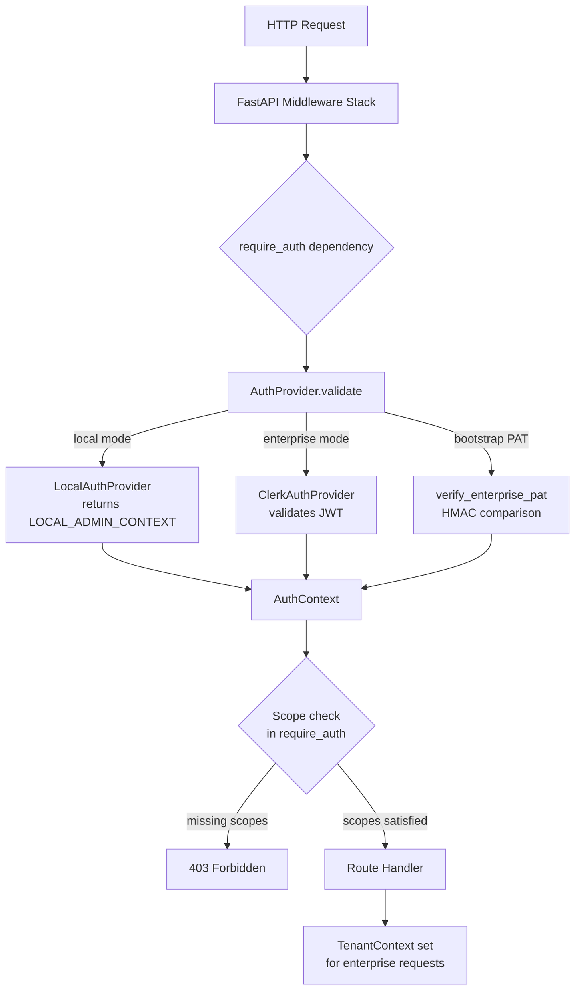
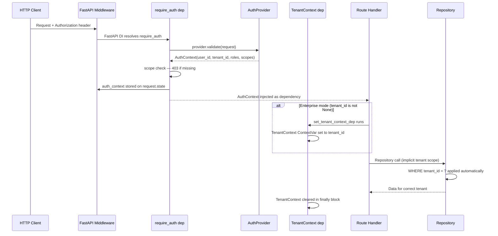
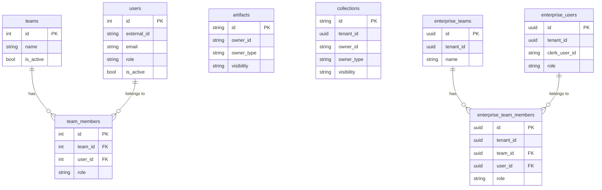

# Security & RBAC Model

This guide covers SkillMeat's authentication and authorization architecture,
role and scope definitions, tenant data isolation, and the security guarantees
provided in each deployment mode.

---

## Security Architecture Overview

SkillMeat uses a **pluggable auth provider** pattern. The API layer delegates
every authentication decision to a single registered `AuthProvider` instance.
The provider validates an incoming request and returns an immutable `AuthContext`
describing the authenticated principal's identity, roles, and permitted scopes.



**Key files:**

| File | Purpose |
|------|---------|
| `skillmeat/api/auth/provider.py` | `AuthProvider` ABC |
| `skillmeat/api/schemas/auth.py` | `AuthContext`, `Role`, `Scope` enums |
| `skillmeat/cache/auth_types.py` | Storage-layer enums (`UserRole`, `OwnerType`, `Visibility`) |
| `skillmeat/api/dependencies.py` | `require_auth` dependency factory, `set_auth_provider` |
| `skillmeat/api/middleware/auth.py` | Legacy bearer-token middleware (local mode) |
| `skillmeat/api/middleware/enterprise_auth.py` | Enterprise PAT bootstrap auth |
| `skillmeat/api/middleware/tenant_context.py` | `TenantContext` propagation dependency |

---

## Auth Providers

### LocalAuthProvider (local mode)

In local (single-user) mode there is no authentication requirement. The provider
returns `LOCAL_ADMIN_CONTEXT` for every request — a pre-built `AuthContext`
carrying:

- `user_id = 00000000-0000-4000-a000-000000000002` (stable sentinel)
- `tenant_id = None`
- `roles = ["system_admin"]`
- `scopes = [all defined Scope values]`

This means **every API call in local mode has full administrative access**. See
[Zero-Auth Mode](#zero-auth-mode-local) for security implications.

### ClerkAuthProvider (enterprise mode, future)

The enterprise provider validates a Clerk JWT from the `Authorization: Bearer`
header, extracts the user's `clerk_user_id`, and looks up their roles and scopes
in the `enterprise_users` table. `tenant_id` is extracted from the JWT claims
and propagated to `AuthContext.tenant_id` for downstream tenant scoping.

> **Current Status:** The Clerk JWT integration is planned for PRD 3. The current
> enterprise bootstrap uses PAT authentication (see below).

### Enterprise PAT (bootstrap, current)

`verify_enterprise_pat` in `skillmeat/api/middleware/enterprise_auth.py` provides
bootstrap access before Clerk is wired. It performs a constant-time HMAC
comparison of the bearer token against the `ENTERPRISE_PAT_SECRET` environment
variable.

On success it synthesises an `AuthContext` with:

- `user_id = 00000000-0000-4000-a000-000000000003` (enterprise service account)
- `tenant_id = None` (not yet wired; deferred to PRD 3)
- `roles = ["system_admin"]`
- `scopes = [all defined Scope values]`

This is a **shared static secret** — not per-user. It is suitable only for
service-to-service bootstrap calls and initial enterprise setup. Rotate
`ENTERPRISE_PAT_SECRET` if it is ever exposed.

---

## Role Model

Roles are defined in `skillmeat/api/schemas/auth.py` (`Role` enum) and mirrored
in `skillmeat/cache/auth_types.py` (`UserRole` enum) for storage.

| Role | Scope | Description |
|------|-------|-------------|
| `system_admin` | Tenant-wide | Full administrative access. Carries `admin:*` wildcard scope, bypassing all individual scope checks. |
| `team_admin` | Team-scoped | Administrative access within a specific team. Granted artifact and collection read/write scopes but not `admin:*`. |
| `team_member` | Team-scoped | Standard collaborative access. Read access to artifacts, collections, and deployments. |
| `viewer` | Tenant-wide | Read-only. Default role for newly created users. Only `artifact:read` scope by convention. |

**Privilege hierarchy:** `system_admin > team_admin > team_member > viewer`

Roles are stored as strings in the database (both `users.role` and
`team_members.role` columns). System-wide roles live on the user row; team-level
roles live on the `team_members` / `enterprise_team_members` junction row.

### Role helper methods on AuthContext

```python
ctx.has_role(Role.team_admin)     # True/False — exact role check
ctx.is_admin()                    # True when system_admin role is held
```

---

## Scope Model

Scopes use `resource:action` naming and gate individual API operations
independently of role assignments. The `Scope` enum is defined in
`skillmeat/api/schemas/auth.py`.

| Scope | String value | Grants |
|-------|-------------|--------|
| `artifact_read` | `artifact:read` | Read artifact metadata and content |
| `artifact_write` | `artifact:write` | Create, update, delete artifacts |
| `collection_read` | `collection:read` | Read collection metadata and membership |
| `collection_write` | `collection:write` | Create, update, delete collections |
| `deployment_read` | `deployment:read` | Read deployment records and status |
| `deployment_write` | `deployment:write` | Create and remove deployments |
| `admin_wildcard` | `admin:*` | Wildcard — satisfies any scope check |

### How scope enforcement works

The `require_auth` dependency factory accepts an optional `scopes` list:

```python
@router.post("/artifacts")
async def create_artifact(
    auth: AuthContext = Depends(require_auth(scopes=["artifact:write"])),
):
    ...
```

After the provider validates the token, `require_auth` computes the missing
scopes and raises `HTTP 403` if any are absent:

```python
missing = [s for s in required_scopes if not auth_context.has_scope(s)]
if missing:
    raise HTTPException(403, detail=f"Missing required scopes: {missing}")
```

The `admin:*` wildcard short-circuits this check — a context holding
`admin_wildcard` satisfies every scope, including custom future scopes not yet in
the enum.

### Typical scope sets by role

| Role | Typical scopes |
|------|---------------|
| `system_admin` | `admin:*` only (wildcard covers everything) |
| `team_admin` | `artifact:read`, `artifact:write`, `collection:read`, `collection:write` |
| `team_member` | `artifact:read`, `collection:read`, `deployment:read` |
| `viewer` | `artifact:read` |

### Scope helper methods on AuthContext

```python
ctx.has_scope(Scope.artifact_write)              # exact or wildcard match
ctx.has_scope("artifact:write")                  # string form also accepted
ctx.has_any_scope(Scope.artifact_read, Scope.artifact_write)  # OR match
```

`AuthContext` is a frozen dataclass — it cannot be mutated after construction.

---

## Tenant Isolation Model

### Isolation strategy by edition

| Edition | Isolation unit | Mechanism |
|---------|---------------|-----------|
| Local (SQLite) | `owner_id` string on each row | Application-layer WHERE filter |
| Enterprise (PostgreSQL) | `tenant_id` UUID on each row | Application-layer WHERE filter + planned RLS |

### Local mode: ownership fields

Migration `ent_003_auth_local` adds three columns to the four
core entity tables (`artifacts`, `collections`, `projects`, `groups`):

| Column | Type | Default | Meaning |
|--------|------|---------|---------|
| `owner_id` | String | NULL | String reference to `users.id` (int as string) or team name |
| `owner_type` | String | `"user"` | Discriminator: `"user"` or `"team"` |
| `visibility` | String | `"private"` | Access level: `"private"`, `"team"`, or `"public"` |

Visibility semantics:

- **private** — only the owner can see the resource
- **team** — all members of the owning team can see the resource
- **public** — any authenticated user (within the local instance) can see the resource

In local mode, `LOCAL_ADMIN_USER_ID` (`00000000-0000-4000-a000-000000000002`)
can see all data regardless of `owner_id` — equivalent to a superuser.

### Enterprise mode: tenant_id isolation

Migration `ent_002_tenant_isolation` adds `tenant_id UUID NOT NULL` to
the `collections` table (and the enterprise-specific tables created in
`ent_004_auth_enterprise`).

**Invariant:** Every enterprise repository method MUST include a
`tenant_id` predicate. Omitting the filter is a security defect:

```python
# Correct
session.query(EnterpriseArtifact).filter(
    EnterpriseArtifact.tenant_id == tenant_id,
    EnterpriseArtifact.id == artifact_id,
).one_or_none()

# PROHIBITED — cross-tenant data leak
session.query(EnterpriseArtifact).filter(
    EnterpriseArtifact.id == artifact_id,
).one_or_none()
```

The default tenant UUID is `00000000-0000-4000-a000-000000000001` (`DEFAULT_TENANT_ID`),
overridable via `SKILLMEAT_DEFAULT_TENANT_ID` for isolated test environments.

Enterprise tables and their tenant columns:

| Table | tenant_id column | Notes |
|-------|-----------------|-------|
| `collections` | `tenant_id UUID NOT NULL` | Added by migration ent_002 |
| `enterprise_users` | `tenant_id UUID NOT NULL` | Created by migration 004 |
| `enterprise_teams` | `tenant_id UUID NOT NULL` | Created by migration 004 |
| `enterprise_team_members` | `tenant_id UUID NOT NULL` | Denormalized for query performance |
| `enterprise_artifacts` | `tenant_id UUID NOT NULL` | Via enterprise schema |
| `enterprise_collections` | `tenant_id UUID NOT NULL` | Via enterprise schema |

B-tree indexes on `tenant_id` are created for all enterprise tables to accelerate
per-tenant query filters.

---

## AuthContext Data Flow



### TenantContext propagation (enterprise)

`set_tenant_context_dep` in `skillmeat/api/middleware/tenant_context.py` is a
generator FastAPI dependency. It:

1. Reads `auth_context.tenant_id` (injected by `require_auth`)
2. Sets a `ContextVar` (`TenantContext`) for the duration of the request
3. Clears the `ContextVar` in a `finally` block — preventing context leakage
   across reused async tasks

When `tenant_id is None` (local or bootstrap mode), the dependency is a no-op
and enterprise repositories fall back to `DEFAULT_TENANT_ID`.

Apply `TenantContextDep` at the router level for enterprise-protected routers:

```python
router = APIRouter(
    prefix="/api/v1/enterprise",
    dependencies=[Depends(set_tenant_context_dep)],
)
```

---

## Zero-Auth Mode (Local)

When `SKILLMEAT_EDITION=local` (the default), the auth middleware is disabled:

- `is_auth_enabled()` returns `False`
- `verify_token` returns `"dev-token"` without validation
- `AuthMiddleware.dispatch` calls `call_next` directly without checking headers
- `require_auth` returns `LOCAL_ADMIN_CONTEXT` for every request

**Security guarantees in local mode:**

| Property | Guarantee |
|----------|-----------|
| Authentication | None — all requests are implicitly admin |
| Authorization | None — all scope checks pass |
| Tenant isolation | Single-tenant by design; owner_id available but not enforced |
| Data confidentiality | Filesystem-level; OS user permissions only |

**Local mode is appropriate for:**
- Single-developer installations on a personal machine
- CI/CD test environments
- Development/staging without network exposure

**Local mode is NOT appropriate for:**
- Any multi-user deployment
- Any network-exposed endpoint
- Any environment with untrusted clients

---

## Enterprise Mode (JWT + Clerk)

### Current state (bootstrap PAT)

Enterprise deployments currently use a static PAT (`ENTERPRISE_PAT_SECRET`). All
requests carrying this token receive the enterprise service-account context with
full `system_admin` access. `tenant_id` is `None` at this phase.

Configure with:

```bash
export ENTERPRISE_PAT_SECRET="<strong-random-secret>"
```

Apply the dependency to enterprise routers:

```python
from skillmeat.api.middleware.enterprise_auth import EnterprisePATDep

@router.get("/resource")
def get_resource(auth: EnterprisePATDep):
    ...
```

If `ENTERPRISE_PAT_SECRET` is not set the server rejects all requests with
`HTTP 403` (fail-closed). This prevents accidental unauthenticated access when
the secret is not provisioned.

### Planned Clerk JWT flow (PRD 3)

When Clerk JWT integration lands:

1. The `ClerkAuthProvider` validates the bearer JWT against Clerk's JWKS endpoint
2. `clerk_user_id` is extracted and looked up in `enterprise_users`
3. `tenant_id` is populated from the user's tenant association
4. `TenantContext` is set per-request via `set_tenant_context_dep`
5. All repository queries are automatically scoped to the correct tenant

The `enterprise_users` table links Clerk identities:

```
enterprise_users.clerk_user_id  →  Clerk JWT "sub" claim
enterprise_users.tenant_id      →  Clerk organization / tenant ID
enterprise_users.role           →  UserRole enum value (viewer default)
```

Unique constraints prevent a single `clerk_user_id` or email from belonging to
multiple tenants (`uq_enterprise_users_tenant_clerk`, `uq_enterprise_users_tenant_email`).

---

## Sentinel UUIDs

Three sentinel UUIDs are used for system accounts and defaults:

| UUID | Constant | Purpose |
|------|----------|---------|
| `00000000-0000-4000-a000-000000000001` | `DEFAULT_TENANT_ID` | Default tenant for local/bootstrap mode |
| `00000000-0000-4000-a000-000000000002` | `LOCAL_ADMIN_USER_ID` | Local mode admin user (sees all data) |
| `00000000-0000-4000-a000-000000000003` | `ENTERPRISE_SERVICE_USER_ID` | Enterprise PAT service account |

These are distinct so that audit logs can differentiate local admin actions from
enterprise service calls.

---

## Threat Model

### What is protected

| Threat | Mitigation |
|--------|-----------|
| Cross-tenant data access (enterprise) | Mandatory `tenant_id` WHERE filter on every enterprise repository method; planned PostgreSQL RLS as second layer |
| Token timing attacks (enterprise PAT) | `hmac.compare_digest` constant-time comparison in `verify_enterprise_pat` |
| Scope escalation | `AuthContext` is a frozen dataclass; cannot be mutated after construction by route handlers |
| Missing `ENTERPRISE_PAT_SECRET` config | Server rejects all requests with 403 (fail-closed) |
| Invalid/expired tokens | 401 raised by provider before scope checks; authentication failure is separate from authorization failure (401 vs 403) |
| Context leakage between requests | `TenantContext` ContextVar cleared in `finally` block after every request |

### What is NOT in scope (current)

| Gap | Notes |
|-----|-------|
| Local mode network exposure | Local mode has no authentication; do not expose port 8080 on an untrusted network |
| Per-row RLS (database layer) | Application-layer filtering only in Phase 1-2; PostgreSQL RLS deferred to Phase 3+ |
| Rate limiting per user/token | Current rate limiting is IP-based only (`middleware/rate_limit.py`) |
| PAT rotation / expiry | Static `ENTERPRISE_PAT_SECRET` has no built-in rotation; rotate manually if exposed |
| Audit log immutability | Audit columns (`created_by`, `updated_at`) are set by the application, not by the database |
| Multi-factor authentication | Delegated entirely to Clerk (enterprise mode only, future) |
| Secret scanning | `ENTERPRISE_PAT_SECRET` must be kept out of version control; no automated scanning enforced |

### PostgreSQL RLS migration path

When volume justifies the overhead, RLS can be added without schema changes:

```sql
ALTER TABLE enterprise_artifacts ENABLE ROW LEVEL SECURITY;
CREATE POLICY tenant_isolation ON enterprise_artifacts
    FOR ALL TO skillmeat_app_role
    USING (tenant_id = current_setting('app.current_tenant_id')::uuid);
```

The FastAPI middleware layer would set the session variable before each query:

```python
await session.execute(
    text("SET LOCAL app.current_tenant_id = :tid"),
    {"tid": str(ctx.tenant_id)}
)
```

**Prerequisites before enabling RLS:**
1. `skillmeat_app_role` PostgreSQL role created and assigned to the connection pool
2. Middleware issuing `SET LOCAL app.current_tenant_id` per transaction
3. Test suite updated to run as `skillmeat_app_role` (not superuser — RLS is bypassed for superusers)
4. Performance profiling of `SET LOCAL` overhead at tenant scale

---

## Database Schema Summary



---

## References

- `skillmeat/api/schemas/auth.py` — `AuthContext`, `Role`, `Scope` (source of truth)
- `skillmeat/cache/auth_types.py` — `UserRole`, `OwnerType`, `Visibility` enums
- `skillmeat/api/auth/provider.py` — `AuthProvider` ABC
- `skillmeat/api/dependencies.py` — `require_auth`, `set_auth_provider`
- `skillmeat/api/middleware/enterprise_auth.py` — PAT bootstrap auth
- `skillmeat/api/middleware/tenant_context.py` — `TenantContext` propagation
- `skillmeat/cache/migrations/versions/ent_002_tenant_isolation.py`
- `skillmeat/cache/migrations/versions/ent_003_auth_local.py`
- `skillmeat/cache/migrations/versions/ent_004_auth_enterprise.py`
- `.claude/context/key-context/tenant-scoping-strategy.md` — tenant scoping design decisions
- `skillmeat/api/tests/test_rbac_scopes.py` — scope enforcement tests
- `skillmeat/cache/tests/test_tenant_isolation.py` — tenant isolation tests
