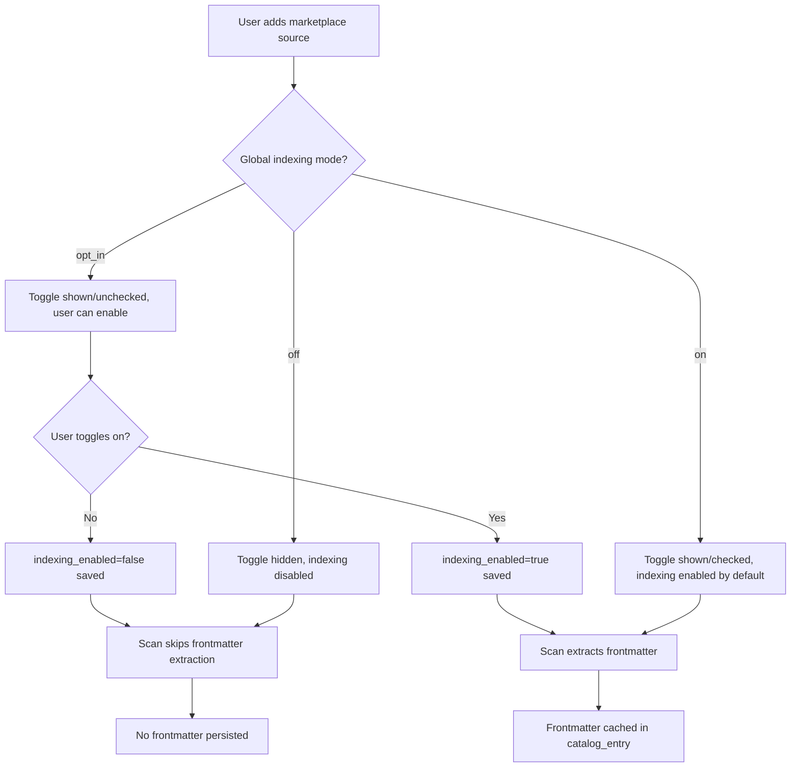

# Feature Brief & Metadata

**Feature Name:**

> Configurable Frontmatter Caching for Cross-Source Artifact Search

**Filepath Name:**

> `configurable-frontmatter-caching-v1`

**Date:**

> 2026-01-20

**Author:**

> Claude Sonnet 4.5

**Related Epic(s)/PRD ID(s):**

> SPIKE-2026-01-20-cross-source-artifact-search

**Related Documents:**

> - SPIKE: `docs/project_plans/SPIKEs/cross-source-artifact-search-spike.md`
> - Symbol references: `skillmeat/config.py`, `skillmeat/cache/models.py`, `skillmeat/web/components/marketplace/add-source-modal.tsx`

---

## 1. Executive Summary

This feature enables users to control whether frontmatter metadata is extracted and cached during marketplace source scanning, providing configurable opt-in/opt-out behavior for the cross-source artifact search capability. Users can choose between three global modes (off/on/opt_in) and override behavior per-source, balancing storage costs (~850 bytes/artifact) against search capabilities.

**Priority:** MEDIUM

**Key Outcomes:**
- Users can disable frontmatter caching globally to minimize storage usage
- Users can enable selective caching for specific high-value repositories
- Cross-source artifact search implementation (SPIKE phases 1-3) can conditionally extract frontmatter based on user preferences
- Storage-conscious users maintain control while power users unlock full search capabilities

---

## 2. Context & Background

### Current State

The existing marketplace source scanning system detects artifacts from GitHub repositories and stores catalog entries in SQLite. Frontmatter from SKILL.md files is currently parsed during detection for confidence scoring but **not persisted** for search indexing.

**Relevant Components**:
- `skillmeat/cache/models.py:MarketplaceCatalogEntry` - Catalog entry model
- `skillmeat/cache/models.py:MarketplaceSource` - Source model with existing boolean flags
- `skillmeat/config.py:ConfigManager` - TOML-based configuration with dot notation support
- `skillmeat/web/components/marketplace/add-source-modal.tsx` - Source import wizard

### Problem Space

The SPIKE document "Cross-Source Artifact Search" recommends extracting and persisting frontmatter during scan to enable search indexing. This introduces a storage cost of ~850 bytes per artifact (~42MB per 1000 sources with 50 artifacts average).

**User pain points**:
1. **Storage-conscious users**: May not want to cache frontmatter if they have many large sources
2. **Search power users**: Need frontmatter indexing to enable cross-source artifact search
3. **Selective enablement**: Users want to index high-value official repos but skip experimental/large repos

### Current Alternatives / Workarounds

**No current alternative exists** - frontmatter caching is not yet implemented. Once implemented without configuration:
- Users cannot opt-out of storage overhead
- Users cannot selectively enable for specific sources
- Storage costs scale linearly with artifact count without user control

### Architectural Context

Follows SkillMeat layered architecture:

- **Config Layer** - ConfigManager handles TOML persistence in `~/.skillmeat/config.toml`
- **Database Layer** - SQLAlchemy models define schema, Alembic handles migrations
- **API Layer** - FastAPI routers expose configuration via endpoints
- **Frontend Layer** - Next.js 15 components provide UI controls

**Integration with SPIKE phases**:
- **Phase 0** (this PRD): Configuration infrastructure
- **Phase 1**: Schema extension (conditional on indexing enabled)
- **Phase 2**: FTS5 (conditional on indexing enabled)
- **Phase 3**: Frontend search toggle (shows "disabled" message if indexing off)

---

## 3. Problem Statement

Users need granular control over frontmatter caching behavior to balance storage costs against search capabilities when working with marketplace sources.

**User Story Format:**
> "As a SkillMeat user managing many marketplace sources, when I add a new source or scan existing sources, I want to control whether frontmatter metadata is extracted and cached, so that I can minimize storage overhead while retaining search capabilities for high-value repositories."

**Technical Root Cause:**
- No configuration mechanism exists for frontmatter caching behavior
- MarketplaceSource model lacks per-source indexing flag
- Add/edit source dialogs have no UI controls for indexing preference
- Scan logic has no conditional extraction logic

---

## 4. Goals & Success Metrics

### Primary Goals

**Goal 1: Global Configuration Control**
- Users can set global indexing mode via CLI or config file
- Three modes supported: "off" (never), "on" (always), "opt_in" (default disabled, per-source enable)
- Mode persists in `~/.skillmeat/config.toml` under `artifact_search.indexing_mode`
- **Success criteria**: `skillmeat config set artifact_search.indexing_mode opt_in` works, mode persists across sessions

**Goal 2: Per-Source Override**
- Users can enable/disable indexing per-source regardless of global mode
- Override flag stored in MarketplaceSource model (`indexing_enabled`)
- Works in both add-source and edit-source workflows
- **Success criteria**: User can add source with indexing enabled when global mode is "opt_in", indexing flag persists to database

**Goal 3: UI Integration**
- Add/edit source modals show indexing toggle when mode allows control
- Toggle state reflects current setting and updates database on save
- Tooltip explains storage implications (~850 bytes/artifact)
- **Success criteria**: Toggle visible in "opt_in" mode, hidden in "off" mode, checked by default in "on" mode

### Success Metrics

| Metric | Baseline | Target | Measurement Method |
|--------|----------|--------|-------------------|
| Configuration persistence | N/A | 100% | Config survives app restart |
| Per-source flag accuracy | N/A | 100% | Database query matches UI state |
| UI toggle visibility | N/A | Correct in all 3 modes | Manual testing all mode combinations |
| Storage savings (opt-out) | ~42MB/1000 sources | 0MB | Measure cache size with indexing disabled |

---

## 5. User Personas & Journeys

### Personas

**Primary Persona: Storage-Conscious Sam**
- Role: Developer with limited disk space, managing 500+ marketplace sources
- Needs: Minimize storage overhead, only enable indexing for critical official repositories
- Pain Points: Cannot control frontmatter caching, storage grows unbounded

**Secondary Persona: Power User Priya**
- Role: Advanced user with extensive artifact library, relies on search for discovery
- Needs: Full frontmatter indexing across all sources for comprehensive search
- Pain Points: Would want search enabled by default without per-source configuration

### High-level Flow



---

## 6. Requirements

### 6.1 Functional Requirements

| ID | Requirement | Priority | Notes |
| :-: | ----------- | :------: | ----- |
| FR-1 | Add `artifact_search.indexing_mode` config key supporting "off", "on", "opt_in" values | Must | ConfigManager.get/set must work |
| FR-2 | Add `indexing_enabled` boolean column to MarketplaceSource model | Must | Nullable, default based on mode |
| FR-3 | Add `indexing_enabled` field to CreateSourceRequest, UpdateSourceRequest, SourceResponse schemas | Must | API contract for per-source flag |
| FR-4 | Add indexing toggle to add-source-modal.tsx with visibility based on mode | Must | Switch + Tooltip pattern |
| FR-5 | Add indexing toggle to edit-source-modal.tsx with same behavior | Should | Consistency across workflows |
| FR-6 | CLI command `skillmeat config set artifact_search.indexing_mode [value]` | Must | User-facing configuration interface |
| FR-7 | Default mode to "opt_in" if no config exists | Must | Reasonable default for new users |
| FR-8 | In "off" mode, hide toggle and force indexing_enabled=false | Must | Global disable takes precedence |
| FR-9 | In "on" mode, show toggle checked by default, allow disable | Should | Power users can opt-out per-source |
| FR-10 | In "opt_in" mode, show toggle unchecked by default, allow enable | Must | Core opt-in workflow |

### 6.2 Non-Functional Requirements

**Performance:**
- Config file reads cached in-memory to avoid repeated disk I/O
- Database migration adds column with default value to minimize downtime

**Security:**
- Config file remains in user's home directory (`~/.skillmeat/config.toml`)
- No sensitive data stored in indexing configuration

**Accessibility:**
- Toggle has aria-label describing purpose
- Tooltip provides context on storage impact
- Keyboard navigation works for toggle control

**Reliability:**
- Invalid mode values in config.toml log warning and default to "opt_in"
- Missing `indexing_enabled` in database defaults to mode-appropriate value

**Observability:**
- Log config changes at INFO level: "artifact_search.indexing_mode set to 'opt_in'"
- Log per-source decisions at DEBUG level: "Source {id} indexing_enabled={bool}"

---

## 7. Scope

### In Scope

- Global configuration key `artifact_search.indexing_mode` in ConfigManager
- Per-source `indexing_enabled` boolean flag in MarketplaceSource model
- Alembic migration to add `indexing_enabled` column with nullable default
- API schema updates (CreateSourceRequest, UpdateSourceRequest, SourceResponse)
- UI toggle in add-source-modal.tsx with mode-aware visibility
- UI toggle in edit-source-modal.tsx (optional but recommended)
- CLI command for setting global mode
- Default mode logic ("opt_in" if unset)

### Out of Scope

- **Actual frontmatter extraction logic** - Covered in SPIKE Phase 1 implementation
- **FTS5 search setup** - Covered in SPIKE Phase 2
- **Frontend search UI** - Covered in SPIKE Phase 3
- Bulk update of existing sources (manual per-source editing only)
- Analytics/telemetry on mode usage
- Admin API endpoints for managing global config

---

## 8. Dependencies & Assumptions

### External Dependencies

- **ConfigManager** (`skillmeat/config.py`): Existing TOML-based configuration system with dot notation
- **Alembic**: Database migration framework for schema changes
- **SQLAlchemy**: ORM for MarketplaceSource model updates
- **Pydantic**: Schema validation for API request/response models

### Internal Dependencies

- **MarketplaceSource model** (`skillmeat/cache/models.py:1182-1468`): Existing model requires new column
- **Add-source-modal** (`skillmeat/web/components/marketplace/add-source-modal.tsx`): Existing component follows Switch + Tooltip pattern
- **API schemas** (`skillmeat/api/schemas/marketplace.py`): CreateSourceRequest, UpdateSourceRequest need new field

### Assumptions

- Users understand storage vs. search tradeoff (tooltip provides context)
- "opt_in" is acceptable default for new users (balances storage/features)
- Per-source overrides are sufficient granularity (no artifact-level control needed)
- Global config mode changes do not retroactively update existing sources

### Feature Flags

None required - feature can be developed and shipped as a single unit.

---

## 9. Risks & Mitigations

| Risk | Impact | Likelihood | Mitigation |
| ----- | :----: | :--------: | ---------- |
| Users confused by three-mode system | Medium | Low | Clear tooltip text, documentation, sensible "opt_in" default |
| Global mode changes don't update existing sources | Low | High | Document behavior, provide future bulk update tool if needed |
| Invalid config values crash app | High | Low | Validate config, log warning, default to "opt_in" on invalid values |
| Database migration fails on existing deployments | Medium | Low | Test migration on copy of production data, make column nullable |
| Users don't discover configuration option | Medium | Medium | Add settings page link (future), CLI documentation, tooltip mentions config |

---

## 10. Target State (Post-Implementation)

### User Experience

**Adding a new source (opt_in mode, default)**:
1. User opens add-source-modal, enters GitHub URL
2. Modal shows toggle: "Enable artifact search indexing" (unchecked)
3. User hovers tooltip: "Index artifacts for cross-source search. Adds ~850 bytes per artifact."
4. User leaves unchecked (default) and saves → `indexing_enabled=false` in database
5. Scan runs, frontmatter is NOT extracted/persisted

**Power user enables indexing for official repo**:
1. User runs: `skillmeat config set artifact_search.indexing_mode on`
2. User adds new source via UI
3. Toggle appears pre-checked (mode "on" default)
4. User saves → `indexing_enabled=true` in database
5. Scan runs, frontmatter IS extracted and cached

**Storage-conscious user disables globally**:
1. User runs: `skillmeat config set artifact_search.indexing_mode off`
2. User adds new sources via UI
3. Toggle is hidden, indexing always disabled
4. All scans skip frontmatter extraction → zero storage overhead

### Technical Architecture

**Configuration Layer**:
```toml
# ~/.skillmeat/config.toml
[artifact_search]
indexing_mode = "opt_in"  # "off" | "on" | "opt_in"
```

**Database Schema**:
```python
# MarketplaceSource model
indexing_enabled: Mapped[Optional[bool]] = mapped_column(
    Boolean,
    nullable=True,
    comment="Enable frontmatter extraction for search indexing"
)
```

**API Contract**:
```typescript
interface CreateSourceRequest {
  repo_url: string;
  ref?: string;
  root_hint?: string;
  indexing_enabled?: boolean;  // New field
  // ... other fields
}
```

**Frontend Component**:
```tsx
{/* Conditionally render based on mode */}
{indexingMode !== 'off' && (
  <div className="flex items-center justify-between">
    <Label htmlFor="indexing-enabled">
      Enable artifact search indexing
    </Label>
    <TooltipProvider>
      <Tooltip>
        <TooltipTrigger asChild>
          <HelpCircle className="h-4 w-4 text-muted-foreground" />
        </TooltipTrigger>
        <TooltipContent>
          <p>Index artifacts for cross-source search. Adds ~850 bytes per artifact.</p>
        </TooltipContent>
      </Tooltip>
    </TooltipProvider>
    <Switch
      id="indexing-enabled"
      checked={indexingEnabled}
      onCheckedChange={setIndexingEnabled}
      defaultChecked={indexingMode === 'on'}
    />
  </div>
)}
```

### Observable Outcomes

- Config mode persists across app restarts
- Per-source `indexing_enabled` flag controls scan behavior
- Storage usage correlates with indexing enablement
- Users report improved control over storage vs. features tradeoff

---

## 11. Overall Acceptance Criteria (Definition of Done)

### Functional Acceptance

- [ ] Global config mode set via `skillmeat config set artifact_search.indexing_mode [value]` persists to `~/.skillmeat/config.toml`
- [ ] Invalid mode values log warning and default to "opt_in"
- [ ] Per-source `indexing_enabled` flag saves to database via add-source workflow
- [ ] Per-source flag updates via edit-source workflow
- [ ] Toggle visibility matches mode: hidden in "off", shown in "on"/"opt_in"
- [ ] Toggle default state matches mode: checked in "on", unchecked in "opt_in"
- [ ] Tooltip displays storage impact message
- [ ] Config and flag values accessible to SPIKE Phase 1 implementation

### Technical Acceptance

- [ ] Alembic migration adds `indexing_enabled` column as nullable boolean
- [ ] MarketplaceSource model updated with new column mapping
- [ ] CreateSourceRequest, UpdateSourceRequest, SourceResponse schemas include `indexing_enabled`
- [ ] ConfigManager supports `artifact_search.indexing_mode` get/set operations
- [ ] No breaking changes to existing source creation workflow

### Quality Acceptance

- [ ] Unit tests verify ConfigManager mode persistence
- [ ] Unit tests verify default mode logic ("opt_in" when unset)
- [ ] Integration tests verify source creation with indexing_enabled true/false
- [ ] Migration tested on database with existing MarketplaceSource records
- [ ] Manual testing confirms toggle behavior in all three modes

### Documentation Acceptance

- [ ] ConfigManager docstring updated with new key example
- [ ] MarketplaceSource model docstring mentions indexing_enabled
- [ ] Inline comments explain mode precedence logic
- [ ] SPIKE document updated to reference Phase 0 (this PRD)

---

## 12. Assumptions & Open Questions

### Assumptions

- Users can understand three-mode system with appropriate tooltip/docs
- "opt_in" is the right default for balancing features and storage
- Per-source granularity is sufficient (no need for artifact-level control)
- Frontmatter caching decision made at scan time (not lazy/on-demand)

### Open Questions

- [x] **Q1**: Should mode changes apply retroactively to existing sources?
  - **A**: No - mode only affects new sources or explicit per-source updates. Avoids unexpected rescan overhead.

- [x] **Q2**: Should we provide bulk update tool for existing sources?
  - **A**: Defer to post-launch feedback. Manual editing sufficient for v1.

- [ ] **Q3**: Should edit-source-modal show indexing toggle?
  - **A**: Recommended YES for consistency, but not strictly required for MVP.

- [ ] **Q4**: Should we track which sources have indexing enabled in aggregate stats?
  - **A**: Defer to analytics/observability work. Not blocking for this feature.

---

## 13. Appendices & References

### Related Documentation

- **SPIKE**: `docs/project_plans/SPIKEs/cross-source-artifact-search-spike.md`
- **ConfigManager**: `skillmeat/config.py` (lines 1-150)
- **MarketplaceSource Model**: `skillmeat/cache/models.py` (lines 1182-1468)
- **Add Source Modal**: `skillmeat/web/components/marketplace/add-source-modal.tsx`
- **API Schemas**: `skillmeat/api/schemas/marketplace.py`

### Symbol References

**Backend**:
- `skillmeat.config.ConfigManager.get(key: str)` - Retrieve config value
- `skillmeat.config.ConfigManager.set(key: str, value: Any)` - Set config value
- `skillmeat.cache.models.MarketplaceSource.indexing_enabled` - New column (to be added)

**Frontend**:
- `@/components/marketplace/add-source-modal.tsx:AddSourceModal` - Source creation wizard
- `@/components/ui/switch.tsx:Switch` - Toggle component from shadcn
- `@/components/ui/tooltip.tsx:Tooltip` - Tooltip component from shadcn

**API**:
- `CreateSourceRequest.indexing_enabled` - New schema field (to be added)
- `UpdateSourceRequest.indexing_enabled` - New schema field (to be added)
- `SourceResponse.indexing_enabled` - New response field (to be added)

### Prior Art

**Similar patterns in codebase**:
- `enable_frontmatter_detection` boolean flag in MarketplaceSource (existing)
- `import_repo_description` boolean flag in MarketplaceSource (existing)
- `single_artifact_mode` boolean flag in MarketplaceSource (existing)
- Switch + Tooltip pattern in add-source-modal.tsx (lines 74-76, 199-201)

---

## Implementation

### Phased Approach

**Phase 0: Configuration Infrastructure (This PRD) - Est. 2 days**

Backend (1 day):
- [ ] Task 0.1: Add `artifact_search.indexing_mode` to ConfigManager validation
- [ ] Task 0.2: Alembic migration to add `indexing_enabled` column to MarketplaceSource
- [ ] Task 0.3: Update MarketplaceSource model with new column mapping
- [ ] Task 0.4: Add `indexing_enabled` to CreateSourceRequest, UpdateSourceRequest, SourceResponse schemas
- [ ] Task 0.5: Unit tests for ConfigManager mode get/set
- [ ] Task 0.6: Migration test on database with existing records

Frontend (1 day):
- [ ] Task 0.7: Fetch global indexing mode from config API endpoint (or default to "opt_in")
- [ ] Task 0.8: Add indexing toggle to add-source-modal.tsx with mode-aware visibility
- [ ] Task 0.9: Wire toggle state to CreateSourceRequest payload
- [ ] Task 0.10: Add tooltip with storage impact message
- [ ] Task 0.11: (Optional) Add indexing toggle to edit-source-modal.tsx
- [ ] Task 0.12: Manual testing of all three modes

Documentation (0.5 days):
- [ ] Task 0.13: Update ConfigManager docstrings
- [ ] Task 0.14: Update MarketplaceSource model docstrings
- [ ] Task 0.15: Update SPIKE document to reference Phase 0
- [ ] Task 0.16: Add inline comments for mode precedence logic

**Phase 1: Schema Extension + Basic Search (SPIKE Phase 1) - Est. 3 days**
- Conditional frontmatter extraction based on `indexing_enabled` flag
- Add title, description, search_tags, search_text columns to MarketplaceCatalogEntry
- Repository method for LIKE-based search

**Phase 2: FTS5 Enhancement (SPIKE Phase 2) - Est. 2 days**
- FTS5 virtual table creation with sync triggers
- Advanced search capabilities (phrase, prefix, boolean)

**Phase 3: Frontend Search UI (SPIKE Phase 3) - Est. 2 days**
- Dual-mode toggle (search sources vs. search artifacts)
- React Query hooks for artifact search
- Grouped result display

### Epics & User Stories Backlog

| Story ID | Short Name | Description | Acceptance Criteria | Estimate |
|----------|-----------|-------------|-------------------|----------|
| CFG-001 | Config key support | Add `artifact_search.indexing_mode` to ConfigManager | Config persists, validates values, defaults to "opt_in" | 2 pts |
| CFG-002 | Database schema | Add `indexing_enabled` column to MarketplaceSource | Migration runs, column nullable, existing records unaffected | 3 pts |
| CFG-003 | API schemas | Add `indexing_enabled` to request/response models | Field in all 3 schemas, validation works | 2 pts |
| CFG-004 | Add-source toggle | Add indexing toggle to add-source-modal | Toggle visible in correct modes, state persists to DB | 5 pts |
| CFG-005 | Edit-source toggle | Add indexing toggle to edit-source-modal | Toggle works same as add-source | 3 pts |
| CFG-006 | CLI command | Support `skillmeat config set artifact_search.indexing_mode` | Command works, validates values, persists | 2 pts |
| CFG-007 | Testing | Unit + integration tests for all components | >80% coverage, all modes tested | 5 pts |
| CFG-008 | Documentation | Update docstrings, inline comments, SPIKE ref | All code documented, SPIKE links to Phase 0 | 2 pts |

**Total Estimate**: 24 story points (~2-3 days for single developer)

---

**Progress Tracking:**

See progress tracking: `.claude/progress/configurable-frontmatter-caching-v1/phase-0-progress.md`

---

**Implementation Notes:**

1. **Config API Endpoint**: May need to add `GET /api/v1/config/artifact_search.indexing_mode` endpoint for frontend to fetch mode. Alternatively, include in app initialization state.

2. **Default Value Logic**: When `indexing_enabled` is NULL in database, resolve based on current mode:
   - "off" → treat as false
   - "on" → treat as true
   - "opt_in" → treat as false

3. **Mode Precedence**: Global "off" mode should override per-source `indexing_enabled=true`. Implementation should check mode first before checking flag.

4. **Migration Safety**: Use `nullable=True` and avoid default value to prevent immediate storage impact on existing deployments.

5. **UI State Management**: Consider using React Context or Zustand for global mode state if multiple components need access. For v1, prop drilling from page component is sufficient.
