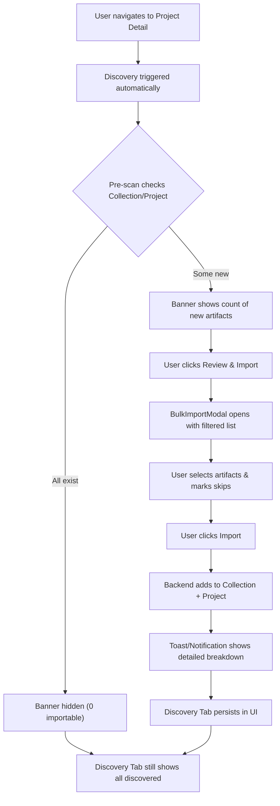

# PRD: Discovery & Import Enhancement

**Feature Name:** Discovery & Import Enhancement

**Filepath Name:** `discovery-import-enhancement-v1`

**Date:** 2025-12-04

**Author:** Claude Code (AI Agent)

**Version:** 1.0

**Status:** Draft

**Builds On:**
- Smart Import & Discovery PRD
- Notification System PRD

---

## 1. Executive Summary

The Discovery & Import Enhancement improves the artifact import workflow by introducing intelligent pre-scan checks, accurate import status handling, skip preferences persistence, and a permanent Discovery Tab on Project Detail pages. Currently, the system fails to distinguish between artifacts that exist in Collection vs Project vs both, leading to misleading "Failed" statuses and poor user experience. This enhancement adds missing status types, pre-scan intelligence, persistent skip preferences, and a discoverable UI component for browsing all discovered artifacts.

**Priority:** HIGH

**Key Outcomes:**
- Artifacts existing in Collection are marked "Skipped (already in Collection)" instead of "Failed"
- Pre-scan discovers only new artifacts that don't exist in either Collection or Project
- Discovery Banner only shows when new artifacts are available to import
- Users can skip artifacts for future discoveries via checkboxes
- New Discovery Tab provides persistent access to all discovered artifacts
- Bulk import adds artifacts to BOTH Collection and Project correctly

---

## 2. Context & Background

### Current State

**What Exists Today:**

1. **Discovery System:**
   - `ArtifactDiscoveryService` in `skillmeat/core/discovery.py` scans directories for artifacts
   - `POST /artifacts/discover` endpoint for collection-wide discovery
   - `POST /artifacts/discover/project/{project_id:path}` endpoint for project-specific discovery
   - Discovery results include `discovered_count`, `importable_count`, and `artifacts[]`

2. **Import System:**
   - `ArtifactImporter` in `skillmeat/core/importer.py` handles bulk imports
   - `POST /artifacts/discover/import` endpoint accepts `BulkImportRequest` with optional `project_id`
   - Returns `BulkImportResult` with `total_requested`, `total_imported`, `total_failed`
   - Per-artifact results include `artifact_id`, `success`, `message`, and optional `error`

3. **Frontend UI:**
   - `DiscoveryBanner` component shows count and "Review & Import" button
   - `BulkImportModal` lists discovered artifacts and handles selection
   - `useProjectDiscovery()` hook manages project-specific discovery
   - Toast notifications via `toast-utils.ts` show only summary ("Imported X, Y failed")

4. **Status Model:**
   - `ImportResult.success` is boolean (true/false)
   - No distinction between "artifact exists in Collection" vs "artifact exists in Project"
   - All failures treated equally

**Key Components:**
- Backend: `skillmeat/core/discovery.py`, `skillmeat/core/importer.py`, `skillmeat/api/routers/artifacts.py`
- Frontend: `DiscoveryBanner.tsx`, `BulkImportModal.tsx`, `useProjectDiscovery.ts`
- Schemas: `skillmeat/api/schemas/discovery.py` (654 lines)
- Types: `skillmeat/web/types/discovery.ts`

### Problem Space

**Pain Points:**

1. **Import Status Mismatch**
   - User imports artifact that exists in Collection but not Project
   - Import marked as "Failed" instead of "Skipped (already in Collection)"
   - Misleads user into thinking import failed when it actually succeeded partially
   - Toast shows "1 failed" when import was actually partially successful

2. **Missing "Skipped" Status**
   - No distinction between failure modes (permission error vs already exists)
   - Cannot communicate "artifact already exists, skipping" to user
   - Notification system (Phase 5-6 complete) cannot show detailed skip reasons

3. **No Pre-scan Intelligence**
   - Discovery scans without checking Collection/Project first
   - Shows all discovered artifacts, even if in both locations
   - No way to know before import whether artifact will be added to Collection, Project, or both
   - Users cannot make informed selection decisions

4. **Banner Visibility Logic Broken**
   - Banner shows even when ALL artifacts exist in both Collection AND Project
   - User sees "5 artifacts ready to import" but all fail with "already exists"
   - Confuses users and wastes their time

5. **No Skip Persistence**
   - Users cannot mark artifacts to skip in future discoveries
   - Same unneeded artifacts discovered repeatedly (e.g., old dependencies)
   - No way to "never show me this artifact again"
   - Pollutes discovery results with noise

6. **Missing Discovery Tab**
   - No permanent way to access discovered artifacts list on Project Detail page
   - Discovery Banner disappears after dismiss and must be re-triggered manually
   - Cannot review what was discovered previously without re-scanning
   - No browsable history of discovered-but-skipped artifacts

### Current Alternatives / Workarounds

**Workaround 1: Manual Filtering**
- User imports all, manually identifies failures, retries only failed
- Inefficient for large batches

**Workaround 2: Manual Scanning**
- Users manually browse .claude/ directories to understand what exists
- Technical workaround only, poor UX

**Workaround 3: No Skip Preference**
- Cannot skip noisy discoveries; must dismiss banner repeatedly
- No persistent state across sessions

### Architectural Context

**Backend Architecture:**
- **Discovery Flow**: `ArtifactDiscoveryService.discover()` → scans directory → returns `DiscoveryResult`
- **Import Flow**: `ArtifactImporter.bulk_import()` → validates → imports → returns `BulkImportResult`
- **Data Model**: `DiscoveredArtifact`, `ImportResult`, `BulkImportResult` Pydantic schemas
- **State Management**: File-based (manifest.toml, lockfile)

**Frontend Architecture:**
- **State**: TanStack Query for API state, local state for UI
- **Components**: `DiscoveryBanner` (conditional), `BulkImportModal` (modal)
- **Hooks**: `useProjectDiscovery()` for discovery + import mutations
- **Storage**: LocalStorage for skip preferences (client-side persistence)

**Current Limitations:**
- No "skipped" status enum (only success: true/false)
- No pre-filtering of discovered artifacts
- No skip preference model in backend or frontend
- No persistent Discovery Tab component (only modal)

---

## 3. Problem Statement

**Core Gap:** The discovery and import system does not accurately communicate import outcomes because it lacks status granularity, pre-scan intelligence, skip preference persistence, and a permanent discovery interface.

**User Story Format:**

> "As a user importing artifacts from a project discovery, when an artifact exists in my Collection but not the Project, I want it marked 'Skipped (already in Collection)' instead of 'Failed', so I understand the import partially succeeded."

> "As a user discovering artifacts, I want the pre-scan to check both Collection and Project before showing results, so I only see truly new artifacts that need importing."

> "As a user who doesn't need certain discovered artifacts, I want checkboxes to skip them for future discoveries, so I don't see the same noise repeatedly."

> "As a user managing a project, I want a permanent Discovery Tab on the Project Detail page to browse all discovered artifacts without re-triggering discovery, so I can review results anytime."

> "As a user importing 10 artifacts where 7 already exist in Collection, I want the banner to show 'X new artifacts available' instead of '10 artifacts ready', so I set correct expectations."

**Technical Root Cause:**
- `ImportResult` model only has boolean `success` field; no granular status enums
- Discovery scan does not check Collection/Project existence before returning results
- No skip preference model or persistence layer
- Discovery results not stored; only returned in modal response
- No persistent tab component on Project Detail page

---

## 4. Goals & Success Metrics

### Primary Goals

**Goal 1: Accurate Import Status Communication**
- Distinguish between import failures, skips (already in Collection), and successes
- Communicate to user which artifacts were added to Collection vs Project
- Update Notification System with new status types

**Goal 2: Smart Pre-scan Discovery**
- Discovery only returns artifacts not in either Collection or Project
- Pre-scan checks before showing results to user
- Banner visibility logic reflects only importable artifacts

**Goal 3: Persistent Skip Preferences**
- Users can mark artifacts to skip for future discoveries
- Skip preferences persist across browser sessions
- Skipped artifacts behave as if they don't exist in discovery

**Goal 4: Permanent Discovery Interface**
- Discovery Tab available on Project Detail page
- Artifacts remain accessible after discovery scan completes
- Tab shows all discovered artifacts regardless of import status

**Goal 5: End-to-End Import Integrity**
- Bulk import adds artifacts to BOTH Collection and Project
- No artifacts lost or forgotten in partial imports
- Clear reporting of what was added where

### Success Metrics

| Metric | Baseline | Target | Measurement Method |
|--------|----------|--------|-------------------|
| Discovery accuracy | 0% (all shown) | 95% (only new shown) | Count of artifacts already existing vs shown |
| Skip adoption | 0% | 40%+ | % of users using skip checkbox |
| Banner false positives | 100% (shows even if none to import) | 0% | Count of sessions with empty-but-showing banner |
| Import clarity | 1-2 lines in toast | 5+ lines with breakdown | Toast content in debug logs |
| Discovery Tab usage | N/A (doesn't exist) | 50%+ user navigation | Analytics tracking on tab clicks |
| Skip persistence | 0% | 95%+ across sessions | LocalStorage sync verification |

---

## 5. User Personas & Journeys

### Personas

**Primary Persona: Project Manager (Jamie)**
- Role: Manages multiple SkillMeat projects, coordinates with team
- Needs: Quick clarity on what's importable without false positives
- Pain Points: Confused by "Failed" statuses that actually mean "already exists"; repeated dismissals of irrelevant artifacts

**Secondary Persona: Power User (Alex)**
- Role: Advanced user, manages large artifact collections
- Needs: Fine-grained control over discovery; ability to exclude noisy dependencies
- Pain Points: Cannot skip dependencies that pollute discovery results; must manually review each batch

**Tertiary Persona: New User (Sam)**
- Role: First-time SkillMeat user setting up a project
- Needs: Clear, unambiguous status messages; confidence that imports work as expected
- Pain Points: "Failed" and "Skipped" concepts confusing; unclear what to do next

### High-level Flow

---

## 6. Requirements

### 6.1 Functional Requirements

| ID | Requirement | Priority | Notes |
| :-: | ----------- | :------: | ----- |
| FR-1 | Backend: Add import status enum with success/skipped/failed | Must | Update `ImportResult` schema to use enum instead of boolean |
| FR-2 | Backend: Implement "Skipped (already in Collection)" status | Must | Mark artifacts existing in Collection with skip reason |
| FR-3 | Backend: Implement "Skipped (already in Project)" status | Must | Mark artifacts existing in Project with skip reason |
| FR-4 | Backend: Pre-scan discovery checks Collection + Project existence | Must | Filter artifacts before returning to frontend |
| FR-5 | Backend: Bulk import adds to Collection AND Project correctly | Must | Ensure artifact stored in both locations |
| FR-6 | Backend: Skip preference storage schema (project_id, artifact_name, skip_reason) | Should | Add to manifest or separate skip file |
| FR-7 | Backend: Skip preference check during discovery scan | Should | Skip marked artifacts during pre-scan |
| FR-8 | Frontend: Update `ImportResult` type with status enum | Must | Use enum values: "success", "skipped", "failed" |
| FR-9 | Frontend: Import selection form shows pre-scan status | Should | Display "Already in Collection, will add to Project" etc. |
| FR-10 | Frontend: Skip checkboxes in BulkImportModal (per-artifact) | Should | "Skip for Project" and "Skip for Collection" options |
| FR-11 | Frontend: Skip preference persistence to LocalStorage | Should | Store skip preferences across sessions |
| FR-12 | Frontend: Discovery Tab component on Project Detail page | Must | New tab showing all discovered artifacts |
| FR-13 | Frontend: Discovery Tab always visible in Project Detail | Should | Toggle between "Deployed", "Discovery" tabs |
| FR-14 | Frontend: Toast/Notification shows detailed status breakdown | Should | "Imported to Collection: 3, Added to Project: 5, Skipped: 2" |
| FR-15 | Frontend: Banner visibility logic updated for new statuses | Must | Hide banner if no truly importable artifacts |

### 6.2 Non-Functional Requirements

**Performance:**
- Discovery scan with pre-checks completes in <2 seconds for typical project (500 artifacts)
- Pre-scan intelligence does not degrade discovery performance >10%
- Skip preference lookup adds <100ms to discovery time

**Security:**
- Skip preferences stored locally; no exposure of user preferences server-side
- Import operations respect existing file permissions
- No unintended artifact overwrites via partial imports

**Accessibility:**
- Discovery Tab keyboard navigable (Tab, Enter)
- Skip checkboxes properly labeled with `<label for>` associations
- Toast notifications announce detailed results via `aria-live=polite`

**Reliability:**
- Partial import failures do not corrupt collection state
- Skip preferences persist across browser restarts
- Discovery can be re-triggered without issues after prior attempts

**Observability:**
- Log import status enums with trace_id for debugging
- Analytics: track skip checkbox usage, Discovery Tab interactions
- Metrics: discovery pre-scan hit rate, skip adoption rate

---

## 7. Scope

### In Scope

- Import status enum and logic (success/skipped/failed)
- Pre-scan intelligence checking Collection and Project existence
- Skip preference model and persistence (client-side LocalStorage)
- Discovery Tab component on Project Detail page
- Toast and Notification System integration with new statuses
- Updated schemas for `ImportResult`, `DiscoveryResult`
- User-facing UX updates (forms, modals, tabs)

### Out of Scope

- Server-side persistent skip list (stored in manifest) - client-side only for MVP
- Advanced discovery filters (by type, tags, etc.) - future enhancement
- Discovery scheduling/automation - future enhancement
- Shared skip preferences across team/users - future enhancement
- Performance optimization beyond 2-second baseline
- Database changes (file-based state only)

---

## 8. Dependencies & Assumptions

### External Dependencies

- **TanStack Query**: For frontend state management (already integrated)
- **Notification System**: Phase 5-6 complete; provides notification display (already shipped)
- **Toast Utils**: Existing toast infrastructure in `skillmeat/web/lib/toast-utils.ts`

### Internal Dependencies

- **ArtifactDiscoveryService** (`skillmeat/core/discovery.py`): Core discovery logic
- **ArtifactImporter** (`skillmeat/core/importer.py`): Import operations
- **Notification System** (Phase 5-6 complete): Integration for detailed results
- **Project Detail Page** (`skillmeat/web/app/projects/[id]/page.tsx`): Discovery Tab location

### Assumptions

- Skip preferences stored in browser LocalStorage (not synced to backend)
- Pre-scan check performance acceptable at <2 seconds
- Collection and Project locations are known and accessible
- Users understand difference between "Collection" and "Project" scopes
- Artifact names unique enough for skip preference matching
- Backend discovers artifacts via existing directory scanning (no API changes)

### Feature Flags

- `ENABLE_DISCOVERY_TAB`: Toggle Discovery Tab visibility (default: true after Phase completion)
- `ENABLE_SKIP_PREFERENCES`: Toggle skip checkbox UI (default: true after Phase completion)

---

## 9. Risks & Mitigations

| Risk | Impact | Likelihood | Mitigation |
| ----- | :----: | :--------: | ---------- |
| Pre-scan slows discovery >10% | High | Medium | Implement caching for Collection/Project artifact lists; benchmark before merging |
| Skip preferences lost across devices | Medium | Low | Document LocalStorage limitation in UI; add export/sync feature in future |
| Import failure leaves partial state | High | Low | Implement transaction-like semantics with rollback on any artifact import failure |
| Discovery Tab UI clutter | Medium | Medium | Keep tab near "Deployed" tab; hide tab if no discovered artifacts available |
| User confusion with new statuses | High | Medium | Provide clear UX labels: "Skipped: already in Collection" with explanatory tooltips |
| Performance degradation on large projects | Medium | Low | Profile pre-scan check; consider lazy-loading discovered artifacts list |
| Skip preference conflict resolution | Low | Low | Skip preference stored per-user per-project; no conflicts expected |

---

## 10. Target State (Post-Implementation)

**User Experience:**

1. **Discovery Phase:**
   - User navigates to Project Detail page
   - Pre-scan automatically runs, checking Collection and Project for existing artifacts
   - Banner displays: "X new artifacts available" (only truly new ones)
   - If 0 new artifacts, banner is hidden

2. **Import Selection Phase:**
   - User clicks "Review & Import"
   - BulkImportModal shows artifacts with status: "Will add to Collection & Project", "Already in Collection, will add to Project", etc.
   - Each artifact has checkbox: "Skip this artifact in future discoveries"
   - User selects artifacts to import

3. **Import Execution Phase:**
   - User clicks Import
   - Backend adds to BOTH Collection and Project as needed
   - Toast shows detailed breakdown: "Imported to Collection: 3 | Added to Project: 5 | Skipped: 2"
   - Notification Center stores detailed per-artifact results

4. **Discovery Browsing Phase:**
   - Discovery Tab visible on Project Detail page (always)
   - Shows all discovered artifacts, regardless of status
   - Tab filters available (by status, type, etc.)
   - Users can re-scan or adjust skip preferences from tab

5. **Skip Persistence:**
   - Skipped artifacts appear grayed out in future discovery scans
   - Skip preferences survive browser restart (LocalStorage)
   - User can clear skip list per-project via settings

**Technical Architecture:**

- **Backend Changes:**
  - `ImportResult` uses enum status instead of boolean success
  - `ArtifactDiscoveryService.discover()` checks Collection/Project before filtering results
  - `ArtifactImporter.bulk_import()` handles "Skipped" statuses without errors

- **Frontend Changes:**
  - `discovery.ts` types updated with status enum
  - `BulkImportModal` shows status labels and skip checkboxes
  - `useProjectDiscovery()` reads skip preferences from LocalStorage
  - New `DiscoveryTab` component integrated into Project Detail page
  - Toast utilities updated to show detailed status breakdown

- **Data Flow:**
  - Discovery request: `POST /artifacts/discover/project/{project_id}` → returns filtered results
  - Import request: `POST /artifacts/discover/import?project_id={id}` → accepts skip list → returns detailed results
  - Skip preferences: stored in `window.localStorage['skillmeat_skip_prefs_{project_id}']`

**Observable Outcomes:**

- All import failures are now legitimate (permissions, network, etc.) not "already exists"
- Users understand import outcomes via clear status labels
- Discovery Banner only shows when needed (0 false positives)
- Repeated discoveries show fewer artifacts due to skip preferences
- Discovery Tab provides non-modal access to all artifacts

---

## 11. Overall Acceptance Criteria (Definition of Done)

### Functional Acceptance

- [ ] `ImportResult` schema updated with status enum (success/skipped/failed)
- [ ] Pre-scan checks Collection and Project for existing artifacts before discovery returns results
- [ ] Artifacts marked "Skipped (already in Collection)" when appropriate
- [ ] Artifacts marked "Skipped (already in Project)" when appropriate
- [ ] Bulk import adds artifacts to Collection AND Project as needed
- [ ] Banner only shows when importable_count > 0
- [ ] Skip checkboxes present in BulkImportModal form
- [ ] Skip preferences persist across browser sessions (LocalStorage)
- [ ] Discovery Tab component visible on Project Detail page
- [ ] Discovery Tab shows all discovered artifacts
- [ ] Toast shows detailed status breakdown (not just counts)
- [ ] Notification System integration shows detailed results
- [ ] End-to-end import workflow completes without errors

### Technical Acceptance

- [ ] All `ImportResult` usages updated to use status enum
- [ ] Discovery performance not degraded >10% with pre-scan checks
- [ ] Skip preferences schema validated (project_id, artifact_name, skip_reason)
- [ ] LocalStorage key namespaced to prevent collisions
- [ ] Pre-scan check logic unit tested (Collection exists, Project exists, neither)
- [ ] Import status logic unit tested (all status enum combinations)
- [ ] Frontend types in `discovery.ts` match backend schemas
- [ ] Notification System Phase 5-6 receiving new status data correctly

### Quality Acceptance

- [ ] Unit tests: >80% coverage for discovery pre-scan logic
- [ ] Unit tests: >80% coverage for import status enum logic
- [ ] Integration tests: Discovery → Import → Notification flow
- [ ] E2E tests: Skip preference persistence across page reload
- [ ] E2E tests: Discovery Tab visibility and interactions
- [ ] Accessibility: Discovery Tab keyboard navigable
- [ ] Accessibility: Skip checkboxes properly labeled
- [ ] Performance: Discovery scan <2 seconds with pre-scan

### Documentation Acceptance

- [ ] API documentation updated for new `ImportResult` status enum
- [ ] Frontend type documentation in `discovery.ts`
- [ ] Toast content examples showing new breakdown format
- [ ] User guide: "Understanding Import Status" in help docs
- [ ] Skip preference feature documented with storage disclaimer

---

## 12. Assumptions & Open Questions

### Assumptions

- Skip preferences are client-side only (LocalStorage) for MVP
- Artifact names are unique within Collection scope
- Collection and Project directory structures are stable during discovery
- Users can access both Collection and Project locations
- Pre-scan performance acceptable for typical projects (<2s)

### Open Questions

- [ ] **Q1:** Should skip preferences be synced to backend for multi-device support?
  - **A:** No for MVP; LocalStorage only. Future enhancement for sync.

- [ ] **Q2:** Should skipped artifacts still appear in Discovery Tab (grayed out)?
  - **A:** Yes, show with "Skipped" label so users can un-skip if needed.

- [ ] **Q3:** What's the max project size we optimize for in pre-scan?
  - **A:** Assume <5000 artifacts in Collection, <1000 in Project. Profile and optimize if needed.

- [ ] **Q4:** Should skip preference UI be in BulkImportModal or separate settings?
  - **A:** In-modal checkboxes for MVP. Can move to separate "Skip Preferences" tab later.

- [ ] **Q5:** How to handle artifact name collisions across scopes?
  - **A:** Use `{type}:{name}` as unique key for skip preference matching.

---

## 13. Appendices & References

### Related Documentation

- **PRD**: Smart Import & Discovery (`/docs/project_plans/PRDs/enhancements/smart-import-discovery-v1.md`)
- **PRD**: Notification System (`/docs/project_plans/PRDs/features/notification-system-v1.md`)
- **Implementation**: Notification System Phase 5-6 (`/docs/project_plans/implementation_plans/features/notification-system-v1.md`)
- **CLAUDE.md**: Frontend (`skillmeat/web/CLAUDE.md`)
- **CLAUDE.md**: Backend API (`skillmeat/api/CLAUDE.md`)

### Code References

- **Discovery Schemas**: `skillmeat/api/schemas/discovery.py` (line 449-482 for `ImportResult`)
- **Discovery Types**: `skillmeat/web/types/discovery.ts` (line 59-64 for `ImportResult`)
- **Discovery Banner**: `skillmeat/web/components/discovery/DiscoveryBanner.tsx`
- **Bulk Import Modal**: `skillmeat/web/components/discovery/BulkImportModal.tsx`
- **Discovery Service**: `skillmeat/core/discovery.py`
- **Import Service**: `skillmeat/core/importer.py`
- **API Router**: `skillmeat/api/routers/artifacts.py` (discovery/import endpoints)

### Symbol References

- **API Symbols**: Artifact discovery, bulk import, status enums
- **UI Symbols**: Discovery Banner, BulkImportModal, DiscoveryTab, skip checkboxes

---

## 14. Implementation Phases

### Phase 1: Backend - Import Status Logic (2-3 days)

**Objective:** Update import status model and discovery pre-scan logic

**Tasks:**
- [ ] Update `ImportResult` Pydantic schema: change `success: bool` to `status: Enum["success", "skipped", "failed"]`
- [ ] Add `skip_reason: Optional[str]` field to `ImportResult`
- [ ] Implement pre-scan check in `ArtifactDiscoveryService`: verify artifact exists in Collection or Project
- [ ] Update discovery return logic: filter results to only include truly new artifacts
- [ ] Update `ArtifactImporter.bulk_import()`: distinguish between Collection and Project additions
- [ ] Add mapping logic: determine which location gets the artifact (Collection, Project, or both)
- [ ] Unit tests: pre-scan check with all combinations (exists in Collection, Project, both, neither)
- [ ] Unit tests: import status mapping for each scenario
- [ ] Update API response schema in `discovery.py`

**Deliverable:** Backend endpoints return accurate import status enums with skip reasons

---

### Phase 2: Backend - Skip Persistence (2-3 days)

**Objective:** Implement skip preference storage and retrieval

**Tasks:**
- [ ] Design skip preference schema: `{project_id, artifact_key: "type:name", skip_reason, added_date}`
- [ ] Add skip file storage: `.claude/.skillmeat_skip_prefs.toml` or manifest extension
- [ ] Implement `SkipPreferenceManager` class: load, save, check, clear skip list
- [ ] Integrate skip check into `ArtifactDiscoveryService.discover()`: skip marked artifacts
- [ ] Add API endpoint `POST /projects/{project_id}/skip-preferences` for clearing skips
- [ ] Validation: ensure skip preference keys match artifact format
- [ ] Unit tests: skip preference CRUD operations
- [ ] Unit tests: discovery with skip preferences applied
- [ ] Consider: per-user vs per-project skip preferences (per-project for MVP)

**Deliverable:** Skip preferences persisted and honored during discovery

---

### Phase 3: Frontend - Type Updates & Form Integration (2-3 days)

**Objective:** Update frontend types and import selection form

**Tasks:**
- [ ] Update `discovery.ts`: change `ImportResult.success: boolean` to `status: "success" | "skipped" | "failed"`
- [ ] Add `ImportResult.skip_reason?: string`
- [ ] Update `BulkImportModal`: display pre-scan status labels for each artifact
- [ ] Add skip checkbox UI: "Don't show this artifact again in discoveries"
- [ ] Implement skip preference form submit: send skip list with import request
- [ ] Update `useProjectDiscovery()` hook: read/write skip preferences to LocalStorage
- [ ] Handle skip preference serialization: `JSON.stringify()` for storage
- [ ] Unit tests: skip preference form submission
- [ ] Unit tests: LocalStorage read/write
- [ ] E2E tests: skip checkbox checked → artifact skipped in future discovery

**Deliverable:** Frontend forms capture skip preferences and show pre-scan status

---

### Phase 4: Frontend - Discovery Tab & UI Polish (2-3 days)

**Objective:** Create Discovery Tab component and integrate into Project Detail

**Tasks:**
- [ ] Create `DiscoveryTab.tsx` component: displays all discovered artifacts (filtered or paginated)
- [ ] Add tab switcher to Project Detail page: "Deployed" | "Discovery"
- [ ] Implement artifact list in tab: name, type, status badge, size, source
- [ ] Add filter/sort options: by status, type, discovery date
- [ ] Integrate with `useProjectDiscovery()`: reuse discovery state
- [ ] Update `DiscoveryBanner`: only show if importable_count > 0
- [ ] Update toast utilities: show detailed breakdown of import results
- [ ] Add skip preference UI to tab: "Manage skip list" section
- [ ] Unit tests: Discovery Tab rendering with various artifact lists
- [ ] Unit tests: Tab switching logic
- [ ] E2E tests: Discovery Tab visibility, artifact interactions

**Deliverable:** Discovery Tab fully functional and integrated

---

### Phase 5: Integration & Testing (2-3 days)

**Objective:** End-to-end testing, Notification System integration, polish

**Tasks:**
- [ ] Integration test: Discovery → Pre-scan → Import → Notification flow
- [ ] Update Notification System integration: consume new `ImportResult.status` enum
- [ ] Verify Toast utilities show detailed breakdown: "Imported: 3, Skipped: 2, Failed: 1"
- [ ] E2E test: Full project discovery flow with skip preferences
- [ ] E2E test: Skip preference persistence across page reload
- [ ] E2E test: Discovery Tab remains available after import
- [ ] Performance test: Discovery scan <2 seconds with pre-scan checks
- [ ] Accessibility audit: Tab key navigation, screen reader compatibility
- [ ] Load test: Discovery with large artifacts (500+)
- [ ] Cross-browser test: LocalStorage persistence on Chrome, Firefox, Safari
- [ ] Update documentation: API docs, user guide, help text

**Deliverable:** Full end-to-end workflow tested and documented

---

### Phase 6: Monitoring & Polish (1-2 days)

**Objective:** Analytics, observability, bug fixes, final polish

**Tasks:**
- [ ] Add analytics tracking: skip checkbox clicks, Discovery Tab usage
- [ ] Add logging: import status enum, skip preference decisions
- [ ] Monitor metrics: discovery pre-scan performance, skip adoption rate
- [ ] Bug fixes: edge cases, error handling, null checks
- [ ] Polish: UI refinements, error messages, tooltip copy
- [ ] Performance optimization: if pre-scan >2 seconds, implement caching
- [ ] Create user guide: "Understanding Import Status", "Skip Preferences"
- [ ] Prepare release notes: new features, breaking changes (none expected)

**Deliverable:** Feature ready for production release

---

## 15. Orchestration Quick Reference

### Phase Task Summary

**Phase 1 - Backend Import Status (Blocks all other phases):**
- Backend must complete schema changes before frontend can update types

**Phase 2 - Backend Skip Persistence (Parallel with Phase 3 Frontend):**
- Can start after Phase 1 completes
- Frontend can build forms without skip endpoint initially

**Phase 3 - Frontend Updates (Parallel with Phase 2):**
- Depends on Phase 1 schema completion
- Can mock skip preferences while Phase 2 completes

**Phase 4 - Discovery Tab (Depends on Phase 3):**
- Requires frontend types finalized
- Can start after Phase 3 forms working

**Phase 5 - Integration (Depends on Phases 2, 3, 4):**
- Full workflow testing only after all components present
- Notification System integration straightforward

**Phase 6 - Monitoring (After Phase 5):**
- Polish and optimization phase
- Can run in parallel with other bug fixes

### Suggested Batch Execution

**Batch 1 (Parallel):**
- `PHASE-1-1`: Backend schema update + pre-scan logic
- Estimated: 2-3 days

**After Batch 1 Complete:**

**Batch 2 (Parallel):**
- `PHASE-2-1`: Backend skip persistence
- `PHASE-3-1`: Frontend type updates + form integration
- Estimated: 2-3 days

**After Batch 2 Complete:**

**Batch 3 (Parallel):**
- `PHASE-4-1`: Frontend Discovery Tab
- `PHASE-5-1`: Integration testing (can start mid-Phase-4)
- Estimated: 2-3 days

**After Batch 3 Complete:**

**Batch 4:**
- `PHASE-6-1`: Monitoring, polish, release
- Estimated: 1-2 days

### Total Estimated Duration

- **Best Case:** 8-10 days (phases 2-3 and 4-5 perfectly parallelized)
- **Realistic Case:** 12-14 days (with integration and testing delays)
- **Conservative Case:** 16-18 days (with optimization needs)

---

## 16. Backlog & Story Breakdown

### Epic 1: Import Status Model (Phase 1)

| Story ID | Short Name | Description | Acceptance Criteria | Estimate |
|----------|-----------|-------------|-------------------|----------|
| DIS-001 | Update ImportResult schema | Change `success: bool` to `status: enum` | (1) Enum has success/skipped/failed; (2) Tests pass; (3) backward compat checked | 1d |
| DIS-002 | Implement pre-scan check | Filter discovered artifacts by Collection/Project existence | (1) Artifacts in Collection filtered; (2) Artifacts in Project filtered; (3) Tests cover all combos | 1.5d |
| DIS-003 | Update discovery endpoint response | Return filtered artifacts with new ImportResult schema | (1) Endpoint returns filtered results; (2) skip_reason populated; (3) Integration tests pass | 1d |

### Epic 2: Skip Preferences (Phase 2)

| Story ID | Short Name | Description | Acceptance Criteria | Estimate |
|----------|-----------|-------------|-------------------|----------|
| DIS-004 | Design skip preference storage | Create TOML schema for skip list | (1) Schema designed; (2) Reviewed; (3) Handles collisions | 0.5d |
| DIS-005 | Implement SkipPreferenceManager | Load, save, check, clear skip preferences | (1) CRUD operations working; (2) Thread-safe; (3) Unit tests 80%+ | 1.5d |
| DIS-006 | Integrate skip check in discovery | Discovery respects skip preferences | (1) Skipped artifacts filtered; (2) Performance <10% impact; (3) Tests | 1d |

### Epic 3: Frontend Form Integration (Phase 3)

| Story ID | Short Name | Description | Acceptance Criteria | Estimate |
|----------|-----------|-------------|-------------------|----------|
| DIS-007 | Update discovery.ts types | Change ImportResult.success to status enum | (1) TypeScript compiles; (2) No type errors; (3) Tests pass | 0.5d |
| DIS-008 | Add skip checkbox to BulkImportModal | Users can check "Don't show again" | (1) Checkbox visible; (2) Checked state stored; (3) UX tested | 1d |
| DIS-009 | Implement LocalStorage skip persistence | Skip preferences survive page reload | (1) Stored in LocalStorage; (2) Namespaced key; (3) E2E test passes | 1d |
| DIS-010 | Update import form submission | Send skip list with import request | (1) Skip list in request body; (2) Backend receives; (3) Integration test | 0.5d |

### Epic 4: Discovery Tab (Phase 4)

| Story ID | Short Name | Description | Acceptance Criteria | Estimate |
|----------|-----------|-------------|-------------------|----------|
| DIS-011 | Create DiscoveryTab component | New tab showing all discovered artifacts | (1) Component renders; (2) Lists artifacts; (3) Keyboard navigable | 1.5d |
| DIS-012 | Integrate tab into Project Detail | Add "Deployed" and "Discovery" tabs | (1) Tab switcher works; (2) Tab persists selection; (3) No visual bugs | 1d |
| DIS-013 | Update banner visibility logic | Banner only shows if importable_count > 0 | (1) Banner hidden when 0 new artifacts; (2) Tests pass | 0.5d |
| DIS-014 | Add status labels to artifacts | Show "Will add to Collection", "Already in Collection" etc. | (1) Labels display correctly; (2) Tooltips explain status; (3) Styling consistent | 0.5d |

### Epic 5: Integration & Testing (Phase 5-6)

| Story ID | Short Name | Description | Acceptance Criteria | Estimate |
|----------|-----------|-------------|-------------------|----------|
| DIS-015 | End-to-end discovery workflow test | Full flow from discovery to import to notification | (1) Workflow completes; (2) Correct statuses returned; (3) No data loss | 1.5d |
| DIS-016 | Notification System integration | New status enums displayed in notification center | (1) Notification shows detail breakdown; (2) Skip reasons visible; (3) Toast matches detail | 1d |
| DIS-017 | Performance optimization | Ensure discovery <2 seconds with pre-scan | (1) Benchmarked; (2) <2s on typical project; (3) Caching if needed | 1.5d |
| DIS-018 | Documentation & release prep | User guide, API docs, release notes | (1) User guide complete; (2) API docs updated; (3) Release notes drafted | 1d |

---

**Progress Tracking:**

See implementation progress: `.claude/progress/discovery-import-enhancement/all-phases-progress.md`

---

**Document Status:** Ready for implementation review. All phases scoped and estimated. No blocking technical decisions pending.
