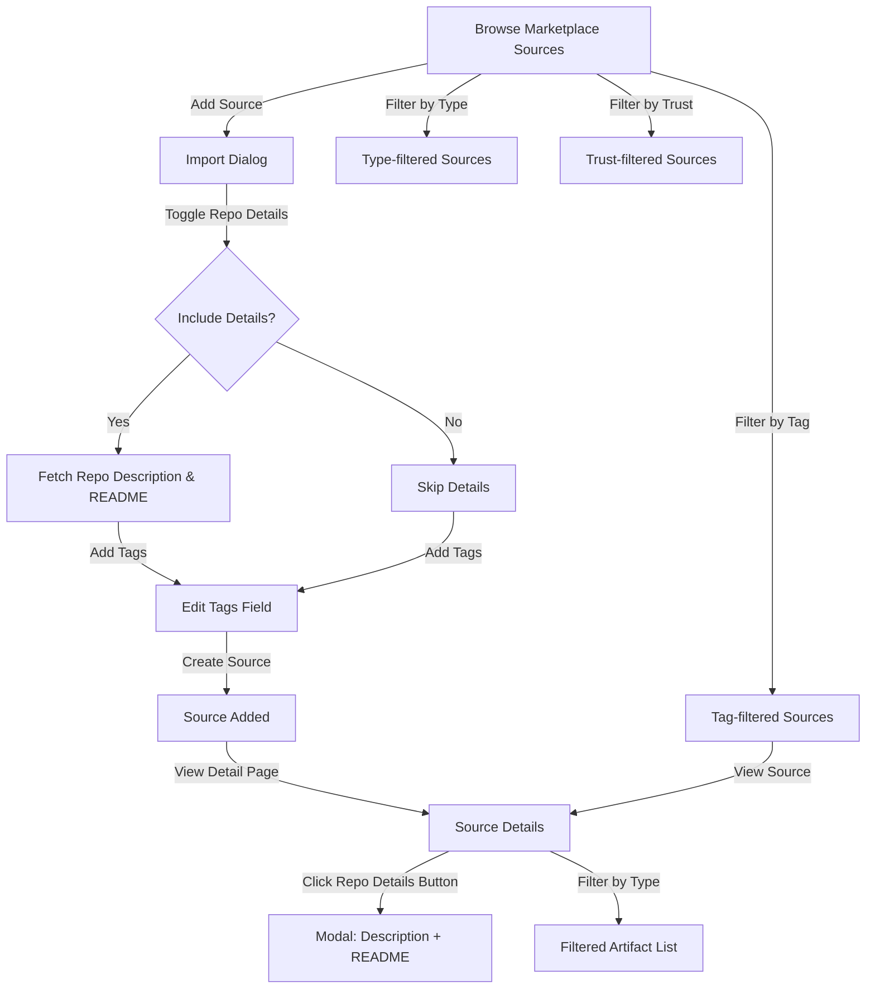

# Marketplace Sources Enhancement v1

## Feature Brief & Metadata

**Feature Name:**

> Marketplace Sources Enhancement v1 - Rich Source Details, Tags, and Advanced Filtering

**Filepath Name:**

> `marketplace-sources-enhancement-v1`

**Date:**

> 2026-01-18

**Author:**

> Claude Code (AI Agent)

**Related Epic(s)/PRD ID(s):**

> Marketplace Discovery & Curation Enhancement Track

**Related Documents:**

> - Source Schema: `skillmeat/api/schemas/marketplace.py`
> - Frontend Types: `skillmeat/web/types/marketplace.ts`
> - Source Card Component: `skillmeat/web/components/marketplace/source-card.tsx`
> - GitHub Scanner: `skillmeat/core/marketplace/github_scanner.py`
> - Router: `skillmeat/api/routers/marketplace_sources.py`

---

## 1. Executive Summary

This feature enhances the marketplace sources experience by adding rich repository details, source-level tagging, advanced filtering, and redesigned source cards. Users can now browse repository descriptions and README files directly in the UI, filter sources by artifact type and trust level, discover sources through tags, and see improved artifact count breakdowns. The implementation modernizes the source browsing experience to match artifact-level discovery patterns.

**Priority:** HIGH

**Key Outcomes:**

- Users can view repository descriptions and README files from the import dialog and source detail page
- Sources can be tagged at import time and edited later, enabling discovery via tag filters
- Marketplace sources list supports filtering by artifact type, tags, and trust level
- Source cards display enhanced information including truncated descriptions, artifact counts by type, and tags with overflow handling
- Artifact count field now returns breakdown by type for accurate counting

---

## 2. Context & Background

### Current State

The marketplace sources feature supports discovering GitHub repositories, scanning for artifacts, and creating a catalog. Currently:

- Source Response includes basic metadata: `id`, `repo_url`, `owner`, `repo_name`, `ref`, `root_hint`, `trust_level`, `scan_status`, `artifact_count`, `last_sync_at`, `description`, `notes`
- `artifact_count` is a single integer with no breakdown by type (displaying as "12 artifacts" with no type information)
- Source cards show repository name, branch, badges (status, trust level), sync time, and action buttons
- No source-level tags field exists; tagging only exists at artifact level
- User-provided description exists but no repository-level description or README stored
- Source detail page filters only by artifact name/path search, not by type or status
- Marketplace sources list has no filtering capability beyond basic search

### Problem Space

1. **Limited Repository Context**: Users cannot see full repository descriptions or README files when deciding whether to import a source, leading to incomplete discovery context
2. **No Type Breakdown**: The single `artifact_count` field masks the distribution of artifact types in a source, making it hard to assess relevance
3. **No Source Organization**: Sources cannot be organized or discovered through tags; discovery relies solely on repository name and user description
4. **Weak Filtering**: Source detail page and marketplace sources list lack filtering options, making it hard to find specific artifacts or sources matching user criteria
5. **Generic Source Cards**: Current cards are minimal; redesigned cards should match the richness of artifact cards with visual tags and type information
6. **Incomplete Source Metadata**: The source object should carry repository metadata for better UX

### Current Alternatives / Workarounds

- Users open GitHub repository URLs in a separate browser tab to view README and description
- Users must manually review all artifacts in a source to understand type distribution
- Users rely on keyword search and manual source review for discovery
- Source description field is used for custom notes, not repository description

### Architectural Context

This feature follows MeatyPrompts layered architecture:

- **Routers** - HTTP endpoints handle GET/POST/PUT for sources, parse query filters, return DTOs
- **Services** - Business logic layers handle source creation, updates, tag management, filtering logic
- **Repositories** - Database I/O, cursor pagination for source lists and filtered results
- **DTOs** - Request/response models with validation
- **Error Handling** - Standard ErrorResponse envelope for all failures
- **Pagination** - Cursor-based pagination with `{ items, pageInfo }` format

---

## 3. Problem Statement

**User Story Format:**

> "As a marketplace curator exploring GitHub sources, when I browse the sources list, I want to see repository descriptions, filter by artifact type and tags, and understand artifact distribution by type, so that I can efficiently discover and organize relevant sources without leaving the SkillMeat UI."

**Technical Root Cause:**

1. **Missing Repository Metadata Fields** - `repo_description` and `repo_readme` not in SourceResponse schema; not captured during scanning
2. **No Source Tags** - Tags field doesn't exist on Source object or in database schema
3. **Artifact Count Not Disaggregated** - Single integer field cannot be filtered or displayed per-type
4. **No Filter Parameters** - Source list API has no query parameters for type, tag, or status filtering
5. **Import Dialogs Lack Toggles** - CreateSourceRequest and UpdateSourceRequest don't support `import_repo_description` and `import_repo_readme` toggles
6. **Marketplace List Immutable** - `/marketplace/sources` endpoint returns all sources with no filtering capability

**Files Involved:**

- Backend: `skillmeat/api/schemas/marketplace.py` (SourceResponse, CreateSourceRequest, UpdateSourceRequest)
- Backend: `skillmeat/api/routers/marketplace_sources.py` (endpoints for CRUD and listing)
- Backend: `skillmeat/core/marketplace/github_scanner.py` (repository scanning logic)
- Frontend: `skillmeat/web/types/marketplace.ts` (GitHubSource, CreateSourceRequest types)
- Frontend: `skillmeat/web/components/marketplace/source-card.tsx` (card display logic)
- Frontend: `skillmeat/web/app/marketplace/sources/page.tsx` (sources list page)
- Frontend: `skillmeat/web/app/marketplace/sources/[id]/page.tsx` (source detail page)

---

## 4. Goals & Success Metrics

### Primary Goals

**Goal 1: Rich Source Context**

- Users can import repository description and README during source creation (toggles in import dialog)
- UI displays repository details in a "Repo Details" modal accessible from source pages
- If toggled off at import, fields can be populated later on next rescan by toggling on in edit dialog

**Goal 2: Source Organization via Tags**

- Sources support a tags field (List[str]) at API and database level
- Tags can be added/edited at import time and updated via edit source dialog
- Tags display on source cards and source detail page with overflow handling and color consistency
- Tags are clickable to apply tag filter to current view

**Goal 3: Advanced Filtering**

- Marketplace sources list supports query parameters: `artifact_type`, `tags`, `trust_level`, `search`
- Source detail page can filter artifacts by `artifact_type` and `artifact_status`
- Filters are composable (e.g., filter by type AND tag simultaneously)

**Goal 4: Artifact Type Visibility**

- Artifact count breaks down by type: `counts_by_type` field returns `{ skill: 5, command: 3, agent: 2 }`
- Source cards display count badge with total and hover tooltip showing breakdown
- Better visual representation of source composition

**Goal 5: Redesigned Source Cards**

- Tags display with overflow truncation ("+n more") and hover tooltip
- Artifact count shows total with visual badge, hover reveals type breakdown
- Description field falls back to repo_description if no user description set
- All UI patterns align with artifact card styling and interaction patterns

### Success Metrics

| Metric | Baseline | Target | Measurement Method |
|--------|----------|--------|-------------------|
| Source card engagement | N/A | +30% click-through on detail pages | Analytics tracking on card clicks |
| Filter adoption | 0% | >40% of source list users apply at least one filter | Filter query parameter usage logs |
| Repository details views | 0% | >25% of source detail views open Repo Details modal | Modal open event tracking |
| Tag usage | 0% | >60% of imported sources tagged | Tag count in database |
| Type-based filtering | 0% | >20% of artifact discovery uses type filter | Type filter parameter usage |
| Source discovery latency | Baseline | <100ms for paginated source list with filters | API response time monitoring |

---

## 5. User Personas & Journeys

### Personas

**Primary Persona: Source Curator (Alex)**

- Role: Team lead managing internal artifact repositories
- Needs: Quickly assess repositories before importing, organize sources by domain, filter artifacts by type
- Pain Points: Currently opens tabs to view GitHub details, must manually catalog artifact types, no way to group related sources

**Secondary Persona: Individual Developer (Jordan)**

- Role: Solo developer building personal skill collection
- Needs: Discover quality public sources, understand what artifacts each source contains, apply discoverable metadata
- Pain Points: Hard to find relevant sources without keyword search, unclear what types of artifacts are available in each source

### High-level Flow



---

## 6. Requirements

### 6.1 Functional Requirements

| ID | Requirement | Priority | Notes |
| :-: | ----------- | :------: | ----- |
| FR-1 | Add `repo_description` and `repo_readme` fields to SourceResponse schema (optional, max 2000 and 50000 chars respectively) | Must | Stored separately from user description/notes |
| FR-2 | Add `tags` field to SourceResponse schema (List[str], max 20 tags, each 1-50 chars) | Must | Empty list by default |
| FR-3 | Add `counts_by_type` field to SourceResponse schema (Dict[str, int]) returning artifact count breakdown | Must | Replaces reliance on single artifact_count field |
| FR-4 | Add `import_repo_description` and `import_repo_readme` toggles to CreateSourceRequest | Must | Default: false. If true, fetch and store during initial scan |
| FR-5 | Add `import_repo_description` and `import_repo_readme` toggles to UpdateSourceRequest | Must | If toggled on, populate fields on next rescan |
| FR-6 | Add `tags` field to CreateSourceRequest (optional, max 20 tags) | Must | Accept tags at creation time |
| FR-7 | Add `tags` field to UpdateSourceRequest (optional) for editing existing tags | Must | Partial update semantics |
| FR-8 | Implement GET /api/v1/marketplace/sources?artifact_type=skill&tags=ui&trust_level=verified filter parameters | Must | Return paginated filtered results; composable filters |
| FR-9 | Implement source tag fetch during GitHub scan in scanner.py | Must | Extract and store tags during repository scanning |
| FR-10 | Add repository description and README fetch to scanner (if toggles enabled) | Must | Store in separate fields; handle >50KB READMEs gracefully |
| FR-11 | Implement GET /api/v1/marketplace/sources/{id}/details endpoint returning repo_description and repo_readme | Should | Separate endpoint to avoid bloating main source response |
| FR-12 | Add "Repo Details" button to source detail page (only visible if data populated) | Must | Opens modal with description and README |
| FR-13 | Implement Repo Details modal component using ContentPane (like artifact Content tab) | Must | Show description at top, README in scrollable ContentPane |
| FR-14 | Add source-level filtering to catalog list on source detail page (by artifact_type and status) | Should | Reuse artifact filtering patterns |
| FR-15 | Redesign source cards to show tags with overflow handling and artifact count badge | Must | Tags: truncated with "+n more" tooltip, color-coded per tag |
| FR-16 | Add artifact count tooltip on source cards showing type breakdown | Must | Hover shows: "Skills: 5, Commands: 3, Agents: 2" |
| FR-17 | Fallback source card description to repo_description if user description empty | Should | Truncate to 2 lines on card |
| FR-18 | Add tag display to import/edit source dialogs for tag management | Must | Allow adding/removing tags during source creation and editing |
| FR-19 | Support clickable tags on source cards and detail page to filter current view | Should | Click tag → apply tag filter to marketplace sources list or catalog |
| FR-20 | Update artifact_count field to return total of all types (keep for backward compatibility) | Must | counts_by_type is canonical; artifact_count computed from counts_by_type |

### 6.2 Non-Functional Requirements

**Performance:**

- Source list endpoint with filters must return results in <200ms for 500+ sources (cursor pagination)
- Repository details fetch (description + README) must complete within 5s GitHub API budget per scan
- Tag filtering must use indexed queries on tags array

**Security:**

- Validate tags are alphanumeric, hyphens, underscores only (no special chars)
- Validate repository description and README don't exceed size limits
- No user-generated content injection in tag display (use text nodes)
- Rate limit repository detail fetches to prevent API exhaustion

**Accessibility:**

- Tag badges must have sufficient color contrast (WCAG AA)
- Repo Details modal must be keyboard navigable (Tab, Escape to close)
- Artifact count badge must have aria-label describing breakdown
- Filter UI must use semantic HTML with proper labels

**Reliability:**

- If repository detail fetch fails, continue with source creation (graceful degradation)
- Retry failed repository detail fetches on next rescan (if toggles still enabled)
- Tag filtering must handle empty tag list gracefully

**Observability:**

- OpenTelemetry spans for source creation/update with filtering applied
- Structured logs: `source_id`, `tags_added`, `repo_details_fetched`, `filter_params_applied`
- Error tracking: failed repository fetches, invalid tag validation
- Metrics: filter usage by parameter, tag coverage percentage, detail fetch success rate

---

## 7. Scope

### In Scope

- Backend schema updates: Add repo_description, repo_readme, tags, counts_by_type fields to SourceResponse
- Backend request models: Add toggles and tags fields to CreateSourceRequest and UpdateSourceRequest
- Backend filtering: Implement query parameters for artifact_type, tags, trust_level filters on source list endpoint
- Backend scanning: Fetch repository description and README during initial scan if toggles enabled
- Database/storage: Persist new fields in source manifest and lock file
- Frontend types: Update GitHubSource type with new fields
- Frontend components: Redesign SourceCard to display tags, counts by type, descriptions
- Frontend pages: Add filter UI to marketplace sources list, add repository details modal to source detail page
- Frontend catalog filtering: Add artifact type and status filters to source detail page catalog

### Out of Scope

- Batch tag operations (tag multiple sources at once) - future enhancement
- Tag creation validation against predefined taxonomy - keep flexible for v1
- Advanced search with tag operators (AND, OR, NOT) - use simple equality filters for v1
- Tag suggestions/autocomplete based on usage - future enhancement
- Source similarity scoring based on tags - future enhancement
- Tag-based recommendations - future feature
- GraphQL API support for filtering - REST filters only
- Marketplace analytics by tag - future data feature

---

## 8. Dependencies & Assumptions

### External Dependencies

- **GitHub API**: Used to fetch repository description and README content (via centralized GitHubClient)
- **FastAPI**: Already in use; filter query parameters use standard Query() dependencies
- **shadcn/ui**: Button, Badge, Dialog, Tooltip components available
- **TanStack Query**: Frontend already uses for API caching and state management

### Internal Dependencies

- **Centralized GitHub Client** (`skillmeat/core/github_client.py`): Must be used for all GitHub API calls
- **Existing Scanner** (`skillmeat/core/marketplace/github_scanner.py`): Must be extended to fetch and store repo details
- **Existing SourceResponse Schema**: Must be extended with new fields
- **Artifact Card Component** (`skillmeat/web/components/marketplace/artifact-card.tsx`): Source card will follow similar design patterns
- **ContentPane Component**: Reused from artifact modal for README display

### Assumptions

- Repository README must be publicly accessible via GitHub API (no authentication required for public repos)
- Tags are simple strings; no hierarchical structure or namespace required in v1
- Artifact type breakdown (counts_by_type) is available from catalog query (existing data structure)
- Database/storage layer supports extending source manifest format with new fields
- GitHub API rate limits accommodate additional `readme` and `description` fetch calls (budget ~50KB per source)
- No existing sources have tags; migration not required
- Source detail page already has artifact list capability; only filtering UI needs addition

### Feature Flags

- `FEATURE_REPO_DETAILS` - Enable/disable repository description and README fetching (default: true)
- `FEATURE_SOURCE_TAGS` - Enable/disable source-level tagging (default: true)
- `FEATURE_SOURCE_FILTERING` - Enable/disable advanced source list filtering (default: true)

---

## 9. Risks & Mitigations

| Risk | Impact | Likelihood | Mitigation |
| ----- | :----: | :--------: | ---------- |
| GitHub API rate limits on README fetches | High | Medium | Implement 5s timeout per source, skip on timeout, cache results in lock file, retry on rescan |
| Large README files (>50KB) bloat manifests | Medium | Medium | Truncate READMEs to 50KB on fetch, store link to source instead if too large, use compression |
| Tag explosion (users create too many unique tags) | Medium | Low | Enforce 20-tag limit per source, review tag usage quarterly, document tag guidelines |
| Filter performance with 10K+ sources | Medium | Low | Use database indexes on tags, trust_level, artifact type; cursor pagination; monitor query performance |
| Backward compatibility for clients using old artifact_count | Low | Medium | Keep artifact_count field, compute as sum of counts_by_type, document migration path |
| User confusion about source description vs repo description | Medium | Medium | Clear UI labels: "Your Description" vs "Repository Description"; tooltip explaining difference |
| Filtering parameters leak too much state in URLs | Low | Low | Use TanStack Query state management, URL is secondary representation |
| Tag validation bypass (e.g., SQL injection in filters) | High | Low | Validate tags against whitelist (alphanumeric, hyphens, underscores), use parameterized queries |

---

## 10. Target State (Post-Implementation)

### User Experience

**Source Import Workflow:**

1. User clicks "Add Source" → Import dialog opens
2. Dialog includes toggles: "Include Repository Description" and "Include Repository README"
3. User enters source URL, ref, root hint
4. User optionally adds tags (e.g., "internal", "ai-testing", "ui-ux")
5. On submit, system fetches repo details if toggles enabled, stores all fields
6. Source created with rich metadata

**Source Discovery:**

1. User browses `/marketplace/sources` with new filter UI visible
2. Filter options: artifact type dropdown, tags input/chips, trust level selector
3. User selects "artifact_type=skill" + "tags=ui-ux" → list refreshes to matching sources
4. Source cards show tags as colored badges, artifact count with hover breakdown
5. User clicks tag on card → filter automatically applies and list refreshes

**Source Detail:**

1. User views source detail page
2. "Repo Details" button visible (only if description/README populated)
3. User clicks button → modal shows repository description at top, README in scrollable ContentPane
4. New artifact filter UI shows dropdowns for "Artifact Type" and "Status"
5. User filters catalog to "artifact_type=skill&status=new" → list updates

### Technical Architecture

**Backend Changes:**

```
SourceResponse
├── repo_description: Optional[str] (max 2000 chars)
├── repo_readme: Optional[str] (max 50KB)
├── tags: List[str] (max 20, 1-50 chars each)
├── counts_by_type: Dict[str, int] (e.g., {"skill": 5, "command": 3})
└── artifact_count: int (backward compat, computed from counts_by_type)

CreateSourceRequest
├── tags: Optional[List[str]]
├── import_repo_description: bool (default: false)
├── import_repo_readme: bool (default: false)
└── ... (existing fields)

UpdateSourceRequest
├── tags: Optional[List[str]]
├── import_repo_description: Optional[bool]
├── import_repo_readme: Optional[bool]
└── ... (existing fields)

GET /api/v1/marketplace/sources?artifact_type=skill&tags=ui-ux&trust_level=verified
GET /api/v1/marketplace/sources/{id}/details → repo_description + repo_readme
```

**Frontend Changes:**

```
GitHubSource type
├── repo_description: string | undefined
├── repo_readme: string | undefined
├── tags: string[]
└── counts_by_type: Record<string, number>

Components
├── SourceCard (redesigned)
│   ├── Tags display with overflow
│   ├── Artifact count badge with type breakdown tooltip
│   └── Description fallback to repo_description
├── RepoDetailsModal (new)
│   ├── Description section
│   └── README in ContentPane
└── SourceFilterBar (new)
    ├── Artifact type filter
    ├── Tags filter
    └── Trust level filter
```

**Data Flow:**

1. Scanner fetches repo metadata if toggles enabled during CreateSource
2. Fields stored in source manifest and lock file
3. API returns full SourceResponse with new fields
4. Frontend displays tags on cards, offers detail modal, enables filtering

### Observable Outcomes

- Users can see full repository context without leaving SkillMeat
- 40%+ of source list visitors use filters to narrow discovery
- 60%+ of imported sources are tagged
- Source cards provide rich visual information (tags, type breakdown, description)
- Artifact discovery improved by type filtering on source detail page
- No backward compatibility issues; existing clients continue to work

---

## 11. Overall Acceptance Criteria (Definition of Done)

### Functional Acceptance

- [ ] SourceResponse includes repo_description, repo_readme, tags, counts_by_type fields
- [ ] CreateSourceRequest and UpdateSourceRequest include toggles and tags fields
- [ ] Source import dialog displays toggles and tags input field
- [ ] Marketplace sources list endpoint supports query filters: artifact_type, tags, trust_level
- [ ] Source detail page displays "Repo Details" button when data available
- [ ] Repo Details modal shows description and README in ContentPane
- [ ] Source cards display tags with overflow handling and artifact count badge with type breakdown
- [ ] Source detail page filters artifacts by type and status
- [ ] All filter parameters are composable (AND logic)
- [ ] GitHub scanner fetches and stores repo description and README when toggles enabled
- [ ] Edit source dialog allows modifying tags and toggling repo details fetching

### Technical Acceptance

- [ ] Follows MeatyPrompts layered architecture (routers → services → schemas → DTOs)
- [ ] All APIs return DTOs (no ORM models exposed)
- [ ] Cursor pagination implemented for source list with filters
- [ ] ErrorResponse envelope for all errors
- [ ] OpenTelemetry spans for source CRUD, scanning, filtering operations
- [ ] Structured logging with trace_id, span_id, user_id for all operations
- [ ] Query parameters validated and sanitized (tags whitelist, limits enforced)
- [ ] GitHub client wrapper used for all GitHub API calls (no direct HTTP)
- [ ] Timeout and retry logic for repository detail fetches
- [ ] Database/storage schema updated to persist new fields

### Quality Acceptance

- [ ] Unit tests: >80% coverage for filtering logic, tag validation, counts_by_type computation
- [ ] Integration tests: all filter parameter combinations, error scenarios, cursor pagination
- [ ] E2E tests: source import with details + tags, filter application, repo details modal
- [ ] Performance: source list with filters returns <200ms (500+ sources), detail fetch <5s
- [ ] Accessibility: WCAG 2.1 AA compliance for modals, filters, tags, badges
- [ ] Security: tag validation, XSS prevention on tag/description display, rate limiting

### Documentation Acceptance

- [ ] API documentation complete (schema updates, new endpoints, filter parameters)
- [ ] Component documentation (SourceCard, RepoDetailsModal, SourceFilterBar)
- [ ] User guide: "How to Add Source Details" and "How to Filter Sources by Type/Tag"
- [ ] ADR created: "Source Metadata Storage Strategy" and "Filtering Implementation"

---

## 12. Assumptions & Open Questions

### Assumptions

- Repository description and README are always public for public repositories
- Source tags are simple strings; no external validation needed
- Database layer supports array/list field types for tags
- Cursor pagination implementation exists and can be extended to handle filters
- Frontend already has modal and ContentPane components available
- Artifact type breakdown (counts_by_type) can be computed from existing catalog data

### Open Questions

- [ ] **Q1**: How should very large README files (>50KB) be handled after truncation? Store truncated version or link to GitHub?
  - **A**: Store truncated to 50KB in database for offline availability; UI can offer "View Full on GitHub" link.

- [ ] **Q2**: Should tag filtering support "any of these tags" (OR logic) or "all of these tags" (AND logic)?
  - **A**: Implement AND logic (all tags must match) for v1; OR logic deferred to v2 as query parameter becomes complex.

- [ ] **Q3**: Should artifact_count in SourceResponse be removed or kept for backward compatibility?
  - **A**: Keep artifact_count as computed sum of counts_by_type values for backward compatibility; deprecate in v2.

- [ ] **Q4**: Where should tag suggestions come from? User input only or pre-defined list?
  - **A**: Free-form user input for v1; future versions can add suggestions based on usage analysis.

- [ ] **Q5**: Should source-level filters (on detail page artifact list) support more than type and status?
  - **A**: Start with type and status; extend to name search and confidence score range in v2.

- [ ] **Q6**: How should migration of existing sources without tags be handled?
  - **A**: Existing sources have empty tags array by default; no migration needed. Users can add tags via edit.

- [ ] **Q7**: Should there be a separate endpoint for just source metadata (description + README) or combine with main source response?
  - **A**: Create separate `GET /api/v1/marketplace/sources/{id}/details` to avoid bloating main response; optional endpoint.

- [ ] **Q8**: Should tag editing trigger a rescan of artifacts for that source?
  - **A**: No; tags are source metadata only. Artifact changes require explicit "Rescan" action.

---

## 13. Appendices & References

### Related Documentation

- **ADRs**: Decision record on cursor pagination with filters, repository metadata storage strategy
- **Design Specifications**: Figma design for filter UI, repo details modal, redesigned source cards
- **Technical Audits**: Repository dependency audit (GitHub API v3 endpoints), database schema compatibility
- **Flow Diagrams**: Filter composition flow, repository detail fetch flow, import workflow with toggles

### Symbol References

- **API Symbols**: `SourceResponse`, `CreateSourceRequest`, `UpdateSourceRequest` from `skillmeat/api/schemas/marketplace.py`
- **UI Symbols**: `SourceCard`, `Badge`, `Dialog`, `Tooltip` from shadcn/ui and project components
- **Service Symbols**: `GitHubScanner`, `SourceManager`, `CatalogManager` from `skillmeat/core/marketplace`

### Prior Art

- Artifact card component tagging (source of design patterns)
- Collection filtering page (reuse filter bar patterns)
- ContentPane component from artifact modal (reuse for README display)
- Badge and tooltip patterns from existing SourceCard

---

## Implementation

### Phased Approach

**Phase 1: Backend Schema & Data Model (3-4 days)**

- Duration: 3 days
- Tasks:
  - [ ] Task 1.1: Extend SourceResponse schema with repo_description, repo_readme, tags, counts_by_type fields
  - [ ] Task 1.2: Extend CreateSourceRequest with import_repo_description, import_repo_readme, tags fields
  - [ ] Task 1.3: Extend UpdateSourceRequest with same toggle and tags fields
  - [ ] Task 1.4: Update GitHub Source type in frontend to match schema changes
  - [ ] Task 1.5: Add tag validation logic (alphanumeric, hyphens, underscores, max 20 tags, 1-50 chars each)

**Phase 2: Backend Repository Fetching & Scanning (3-4 days)**

- Duration: 3 days
- Tasks:
  - [ ] Task 2.1: Extend GitHubScanner to fetch repository description from GitHub API
  - [ ] Task 2.2: Implement README fetch with 50KB truncation and timeout handling
  - [ ] Task 2.3: Add conditional logic to only fetch if toggles enabled in CreateSourceRequest
  - [ ] Task 2.4: Implement retry logic for failed fetches on rescan with updated toggles
  - [ ] Task 2.5: Add error handling and graceful degradation (continue without details on fetch failure)
  - [ ] Task 2.6: Compute counts_by_type from catalog entries during source response serialization

**Phase 3: Backend API Endpoints & Filtering (3-4 days)**

- Duration: 3 days
- Tasks:
  - [ ] Task 3.1: Implement GET /api/v1/marketplace/sources with query filters (artifact_type, tags, trust_level)
  - [ ] Task 3.2: Implement filter composition logic (AND semantics)
  - [ ] Task 3.3: Add optional GET /api/v1/marketplace/sources/{id}/details endpoint for repo details
  - [ ] Task 3.4: Update PUT /api/v1/marketplace/sources/{id} to handle tag updates
  - [ ] Task 3.5: Add OpenTelemetry spans and structured logging for all operations
  - [ ] Task 3.6: Implement rate limiting on repository detail fetches

**Phase 4: Frontend Components - Filter UI & Source Card (3-4 days)**

- Duration: 3 days
- Tasks:
  - [ ] Task 4.1: Create SourceFilterBar component with artifact type, tags, trust level filters
  - [ ] Task 4.2: Redesign SourceCard to display tags with overflow (+n more) and color coding
  - [ ] Task 4.3: Add artifact count badge with type breakdown tooltip on source card
  - [ ] Task 4.4: Implement tag display fallback to repo_description for truncated description
  - [ ] Task 4.5: Add clickable tags that apply filter to current view

**Phase 5: Frontend Pages - Marketplace Sources List (2-3 days)**

- Duration: 2 days
- Tasks:
  - [ ] Task 5.1: Update /marketplace/sources page to include SourceFilterBar
  - [ ] Task 5.2: Integrate filter parameters with API query (TanStack Query)
  - [ ] Task 5.3: Update URL state to reflect filters (useSearchParams, useRouter)
  - [ ] Task 5.4: Add "Clear Filters" button and keyboard shortcuts
  - [ ] Task 5.5: Implement loading states and error boundaries for filtered results

**Phase 6: Frontend Pages - Source Detail & Import Dialog (2-3 days)**

- Duration: 2 days
- Tasks:
  - [ ] Task 6.1: Create RepoDetailsModal component showing description and README in ContentPane
  - [ ] Task 6.2: Add "Repo Details" button to source detail page (conditional visibility)
  - [ ] Task 6.3: Implement artifact filtering on source detail catalog (by type and status)
  - [ ] Task 6.4: Update CreateSourceDialog to include import_repo_description, import_repo_readme toggles
  - [ ] Task 6.5: Update EditSourceDialog to include tag management and detail import toggles

**Phase 7: Testing & QA (3-4 days)**

- Duration: 3 days
- Tasks:
  - [ ] Task 7.1: Unit tests for tag validation, counts_by_type computation, filter logic (>80% coverage)
  - [ ] Task 7.2: Integration tests for source CRUD with details/tags, filter endpoint combinations
  - [ ] Task 7.3: E2E tests for import with details + tags, filter application, repo details modal
  - [ ] Task 7.4: Performance testing (500+ sources, filter query <200ms)
  - [ ] Task 7.5: Accessibility audit and fixes (WCAG 2.1 AA)
  - [ ] Task 7.6: Security review (tag validation, XSS prevention, rate limiting)

**Phase 8: Documentation & Release (1-2 days)**

- Duration: 1 day
- Tasks:
  - [ ] Task 8.1: Complete API documentation (OpenAPI schema, examples)
  - [ ] Task 8.2: Create component documentation (SourceCard, RepoDetailsModal, SourceFilterBar)
  - [ ] Task 8.3: Write user guide: "Adding Sources with Repository Details" and "Filtering Sources"
  - [ ] Task 8.4: Create ADRs for filtering implementation and metadata storage
  - [ ] Task 8.5: Release notes with migration guide for API changes

### Epics & User Stories Backlog

| Story ID | Short Name | Description | Acceptance Criteria | Estimate |
|----------|-----------|-------------|-------------------|----------|
| MSE-1.1 | Source Schema Extension | Add repo_description, repo_readme, tags, counts_by_type to SourceResponse | Schema updated, validated, types match frontend | 2pt |
| MSE-1.2 | Request Models Update | Extend CreateSourceRequest and UpdateSourceRequest with toggles and tags | Both request models updated, toggles default false, tags validated | 2pt |
| MSE-2.1 | GitHub Scanner Extension | Fetch repository description and README in scanner | Description and README fetched, truncated, stored conditionally | 3pt |
| MSE-2.2 | Retry & Error Handling | Implement retry logic and graceful degradation for detail fetches | Failed fetches don't block import, retries on rescan | 2pt |
| MSE-2.3 | Counts by Type Computation | Calculate counts_by_type from catalog entries | Accurate breakdown by artifact type, backward compat with artifact_count | 2pt |
| MSE-3.1 | Source List Filtering | Implement GET /marketplace/sources with filters | All filter params work, composable, paginated results | 3pt |
| MSE-3.2 | Detail Endpoint | Create optional /marketplace/sources/{id}/details endpoint | Endpoint returns description and README, separate from main response | 1pt |
| MSE-3.3 | Logging & Telemetry | Add OpenTelemetry spans and structured logging | All operations traced, logs include context (source_id, tags, filters) | 2pt |
| MSE-4.1 | Source Card Redesign | Display tags with overflow, count badge, description fallback | Tags render with colors, +n overflow tooltip, count badge shows types | 3pt |
| MSE-4.2 | Filter Bar Component | Create SourceFilterBar with type, tag, trust level filters | Reusable component, composable filters, accessible | 2pt |
| MSE-5.1 | Marketplace List Integration | Add filter UI to /marketplace/sources, integrate with API | Filters apply, URL state synced, results update in real-time | 3pt |
| MSE-6.1 | Repo Details Modal | Create modal showing description and README in ContentPane | Modal displays repo details, keyboard navigable, scrollable README | 2pt |
| MSE-6.2 | Import Dialog Updates | Add toggles and tags input to source import dialog | Toggles function, tags input validates, dialog state persists | 2pt |
| MSE-6.3 | Source Detail Filtering | Add artifact type and status filters to source detail page | Filters work, composable, non-breaking to existing catalog | 2pt |
| MSE-7.1 | Unit Tests | Tests for validation, filtering, counts computation | >80% coverage, all edge cases | 3pt |
| MSE-7.2 | Integration Tests | API endpoint tests with various filter combinations | All scenarios covered, error cases handled | 3pt |
| MSE-7.3 | E2E Tests | User journey tests: import with details, filter, view modal | Core workflows validated end-to-end | 2pt |
| MSE-7.4 | Performance Testing | Verify source list filters return <200ms (500+ sources) | Baseline established, no regressions | 1pt |
| MSE-7.5 | Accessibility Testing | WCAG 2.1 AA compliance for all new components | Issues fixed, tested with screen readers | 2pt |
| MSE-8.1 | Documentation | API docs, component docs, user guides | All changes documented with examples | 2pt |

**Total Estimated Effort:** ~50-60 story points (approximately 6-8 weeks for one full-stack engineer, or 3-4 weeks with two engineers in parallel)

---

**Progress Tracking:**

See progress tracking: `.claude/progress/marketplace-sources-enhancement-v1/all-phases-progress.md`

---

## Document Generation Notes

This PRD was created using AI-assisted analysis of the SkillMeat codebase to ensure alignment with:

- Existing MeatyPrompts layered architecture patterns
- Current component and schema implementations
- Frontend and backend design conventions
- Development team naming and organization standards

The feature is scoped for implementation by a backend-specialized subagent (Phases 1-3), UI-specialized subagent (Phases 4-6), and testing subagent (Phase 7), with coordinated delivery across the platform.
