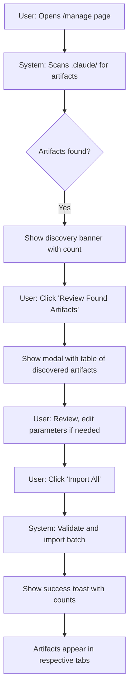
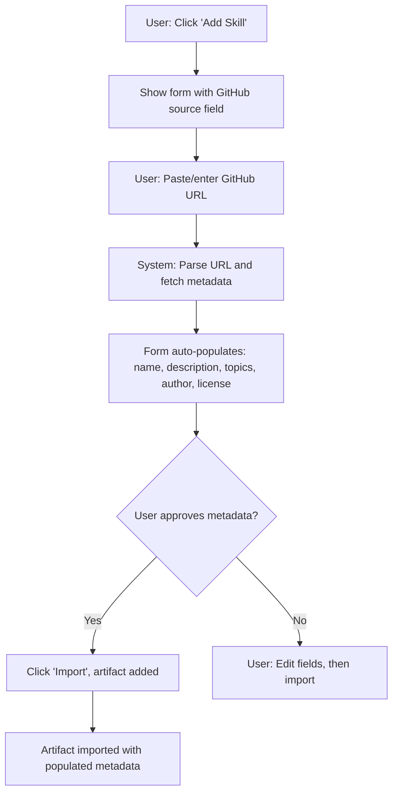
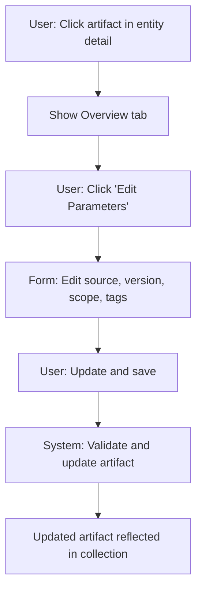

# PRD: Smart Import & Discovery

**Feature Name:** Smart Import & Discovery

**Filepath Name:** `smart-import-discovery-v1`

**Date:** 2025-11-30

**Author:** Claude Code (AI Agent)

**Version:** 1.0

**Status:** Draft

**Builds On:**
- Entity Lifecycle Management PRD
- Web UI Consolidation PRD

---

## 1. Executive Summary

Smart Import & Discovery automates and streamlines artifact acquisition in SkillMeat through two complementary features: (1) **Auto-Scanning** detects existing artifacts in project directories and offers bulk or individual import with parameter editing, and (2) **Auto-Population** fetches metadata from GitHub and other sources to minimize user input when adding new artifacts.

**Priority:** HIGH

**Key Outcomes:**
- Reduce friction in project onboarding by auto-discovering existing artifacts
- Minimize manual data entry when importing artifacts from external sources
- Support bulk import workflows with full preview and validation
- Enable post-import parameter editing for flexibility
- Support multiple source types (GitHub, GitLab, local) with smart metadata extraction

---

## 2. Context & Background

### Current State

**What Exists Today:**

1. **Artifact Import Workflow:**
   - Users manually enter GitHub source (e.g., `user/repo/path/skill@tag`)
   - Manual entry of name, description, tags, scope
   - No metadata auto-population from source
   - One artifact at a time via form

2. **Project Setup:**
   - Users must manually identify existing artifacts in `.claude/` directories
   - No discovery mechanism in web UI
   - Cannot bulk-import existing artifacts
   - Manual migration path from CLI-based projects

3. **Metadata Management:**
   - SKILL.md / COMMAND.md / AGENT.md files contain metadata but are not auto-extracted
   - Users duplicate information in manifest
   - No smart defaults based on source URL

**Key Components:**
- `ArtifactCreateRequest` schema (partially implemented)
- `ArtifactManager.create_artifact()` (CLI-based)
- Entity Management pages (can display forms but no auto-population)
- Metadata extraction logic (exists but not connected to web UI)

### Problem Space

**Pain Points:**

1. **Onboarding Friction**
   - Setting up an existing project requires manually re-declaring all artifacts
   - Projects with 10+ artifacts take 20+ minutes to import
   - Users forget artifacts or make transcription errors

2. **Data Entry Burden**
   - Users repeat information already in GitHub repos
   - Manual lookup of descriptions, topics, authors from GitHub
   - Form requires 6+ fields per artifact (name, type, source, description, tags, scope)

3. **No Bulk Operations**
   - Cannot import multiple artifacts in one flow
   - Each artifact requires separate form submission
   - No preview before committing imports

4. **Missing Discovery**
   - Cannot introspect existing projects for artifacts
   - Users must manually track what's installed where
   - No visibility into artifact parameters after import

### Current Alternatives / Workarounds

**CLI-Based Workaround:**
```bash
skillmeat add anthropics/skills/canvas-design
skillmeat add anthropics/agents/research-agent
# ... repeat for each artifact (manual)
```

**Manual File Editing:**
- Edit manifest.toml directly
- Prone to errors, no validation

**No Workaround Available:**
- Cannot bulk-import multiple artifacts
- Cannot auto-discover artifacts in existing projects

### Architectural Context

**Artifact Type System:**
- Skill, Command, Agent, MCP, Hook (5 types)
- Each has metadata file (SKILL.md, COMMAND.md, etc.)
- Source format: `username/repo/path[@version]`
- Versions: @latest, @tag, @sha, or implicit latest

**Metadata Structure:**
```yaml
# SKILL.md / COMMAND.md / AGENT.md structure
---
title: "Skill Name"
description: "What this skill does"
author: "Author Name"
license: "MIT"
tags: ["tag1", "tag2"]
topics: ["topic1", "topic2"]
---
```

**Backend Architecture:**
- FastAPI routers for artifact CRUD
- ArtifactManager for business logic
- FileSystemStorage for collection persistence
- Metadata extraction from markdown frontmatter

**Frontend Architecture:**
- React components for entity management
- TanStack Query for server state
- Form components with validation

---

## 3. Problem Statement

**Core Gap:** Users cannot efficiently import multiple artifacts or auto-populate metadata from sources, resulting in high onboarding friction and manual data entry burden.

**User Story Format:**

> "As a developer setting up a new project, I have an existing `.claude/skills/` directory with 8 skills from my previous work. When I open the web UI, I want SkillMeat to discover these artifacts and offer to import them with a single confirmation, instead of manually entering each one."

> "As a user adding a skill from GitHub, when I paste the URL (e.g., `anthropics/skills/canvas-design`), I want SkillMeat to automatically fetch and populate the name, description, author, tags, and license from the GitHub repo, so I only need to click 'Import'."

> "As a power user managing bulk imports, I want to see a table preview of all artifacts being imported, with the ability to edit parameters (source, version, tags, scope) before confirming the batch operation."

**Technical Root Causes:**
- No auto-discovery endpoint for scanning `.claude` directories
- Metadata extraction logic not exposed to web UI
- No bulk import form or preview UI
- Form doesn't support auto-population from URLs
- No GitHub URL parser for metadata extraction

**Files Involved:**
- `skillmeat/api/routers/artifacts.py` - Needs new discovery endpoint
- `skillmeat/core/artifact.py` - Needs metadata extraction utilities
- `skillmeat/web/app/manage/page.tsx` - Needs auto-population form
- `skillmeat/web/components/` - Needs bulk import components
- `skillmeat/api/schemas/artifacts.py` - Needs updated schemas

---

## 4. Goals & Success Metrics

### Primary Goals

**Goal 1: Auto-Discovery of Existing Artifacts**
- Scan `.claude/` directory for existing artifact installations
- Present list with source, type, version information
- Allow bulk or individual import
- Measurable: All artifacts in `.claude/` discoverable and importable from web UI

**Goal 2: Metadata Auto-Population from Sources**
- Parse GitHub URLs and extract metadata (name, description, topics)
- Support other sources (GitLab, local paths)
- Minimize required user input (target: 2 fields max)
- Measurable: 90%+ of common artifacts have populated metadata

**Goal 3: Flexible Bulk Import Workflow**
- Preview all artifacts before import
- Allow editing parameters (source, version, tags, scope)
- Validate all entries before batch operation
- Measurable: Users can import 10+ artifacts in <2 minutes

**Goal 4: Post-Import Parameter Editing**
- Modify artifact details after initial import
- Support retroactive source/version changes
- Edit tags, scope, aliases
- Measurable: All parameters editable from entity detail page

### Success Metrics

| Metric | Baseline | Target | Measurement |
|--------|----------|--------|-------------|
| Time to import 10 artifacts | 15+ min (manual) | <2 min (bulk) | User testing |
| Metadata auto-population rate | 0% | 90%+ | Feature completion |
| Form fields user must enter | 6 | 2 (source + confirm) | Form reduction |
| Onboarding task completion | 60% | 95% | Analytics |
| Artifacts discovered in scan | Manual discovery | 100% of .claude/ | Feature testing |
| Bulk import success rate | N/A | 99%+ | Error tracking |

---

## 5. User Personas & Journeys

### Personas

**Primary: Migration Mike**
- Role: Developer with existing `.claude/` artifacts from previous work
- Needs: Quick onboarding of existing artifacts into new SkillMeat setup
- Pain: Manual re-entering all artifact data

**Secondary: Data-Savvy Sally**
- Role: Developer who wants to minimize typing and leverage automation
- Needs: Auto-completion of forms from source URLs
- Pain: Manually looking up metadata from GitHub

**Tertiary: Bulk Operator Brian**
- Role: Team lead setting up shared artifact library
- Needs: Import multiple artifacts at once with visibility and control
- Pain: No batch operations, tedious individual imports

### High-level Flows

**Scenario A: Auto-Discover and Bulk Import**



**Scenario B: Add Artifact with Auto-Population**



**Scenario C: Edit Import Parameters After Import**



---

## 6. Requirements

### 6.1 Functional Requirements

| ID | Requirement | Priority | Category | Notes |
|:--:|-----------|:--------:|----------|-------|
| FR-1 | Auto-scan .claude/ directory for existing artifacts | MUST | Discovery | On page load or manual trigger |
| FR-2 | Display discovered artifacts in modal/table with metadata | MUST | Discovery | Show: type, name, source, version, scope |
| FR-3 | Allow user to select/deselect individual artifacts for import | MUST | Discovery | Checkbox per row |
| FR-4 | Bulk import selected artifacts with validation | MUST | Discovery | Atomic transaction, rollback on error |
| FR-5 | Allow editing parameters (source, version, scope, tags) before import | MUST | Discovery | Edit any field in discovery modal |
| FR-6 | Add discovery banner/toast on entity management page | SHOULD | Discovery | Notify user when artifacts are available |
| FR-7 | Parse GitHub URLs (user/repo/path@version format) | MUST | Auto-Population | Extract owner, repo, path, version |
| FR-8 | Fetch metadata from GitHub for parsed URLs | MUST | Auto-Population | Use GitHub API or repo file fetch |
| FR-9 | Extract and populate name from GitHub repo/path | MUST | Auto-Population | Auto-derive from last path segment |
| FR-10 | Extract and populate description from GitHub README or metadata file | MUST | Auto-Population | Check SKILL.md / COMMAND.md / AGENT.md first |
| FR-11 | Extract and populate topics from GitHub repo topics | SHOULD | Auto-Population | Use GitHub API topics |
| FR-12 | Extract and populate author from GitHub repo owner | SHOULD | Auto-Population | Fallback to MANIFEST or repo metadata |
| FR-13 | Support GitLab URL parsing and metadata extraction | COULD | Auto-Population | Similar to GitHub but GitLab API |
| FR-14 | Support local path source with fallback metadata | SHOULD | Auto-Population | Read SKILL.md if available locally |
| FR-15 | Show auto-population progress and loading states | SHOULD | UX | Skeleton or spinner during fetch |
| FR-16 | Handle auto-population errors gracefully | MUST | Error Handling | Show error, allow manual entry |
| FR-17 | Cache GitHub metadata for 1 hour to reduce API calls | SHOULD | Performance | Reduce GitHub API rate limit impact |
| FR-18 | Edit imported artifact parameters after import | MUST | Post-Import | Support source, version, scope, tags edits |
| FR-19 | Validate artifact parameters before saving | MUST | Validation | Check source format, version exists, etc. |
| FR-20 | Show atomic operation status (success/failure per artifact) | SHOULD | UX | List results in modal after import |

### 6.2 Non-Functional Requirements

**Performance:**
- Discovery scan completes < 2 seconds for projects with 50+ artifacts
- Metadata fetch from GitHub < 1 second per artifact (cached)
- Bulk import validates and saves < 3 seconds for 20+ artifacts
- Form response to URL paste < 500ms (with loading state)

**Reliability:**
- Bulk import is atomic: all-or-nothing per batch
- Failed imports don't corrupt existing artifacts
- Metadata fetch failures don't block form submission (allow manual override)
- Auto-discovery doesn't scan invalid directories gracefully

**Observability:**
- Track auto-discovery trigger count
- Log metadata fetch successes/failures with source
- Analytics for bulk import batch sizes and success rates
- Track parameter edits post-import (adoption metric)

**Security:**
- Validate GitHub URLs to prevent path traversal
- Sanitize metadata from external sources
- Rate-limit GitHub API calls to prevent abuse
- Validate artifact source format on server-side

**Accessibility:**
- Bulk import modal keyboard navigable
- Table rows selectable via keyboard
- Loading states announced for screen readers
- Error messages clear and actionable

---

## 7. Scope

### In Scope

**Auto-Discovery:**
- Scan `.claude/` directory structure recursively
- Detect skills, commands, agents, hooks, MCP servers
- Present discovery UI in entity management pages
- Support bulk select/deselect with "Select All" option
- Allow parameter editing before bulk import
- Atomic bulk import operation

**Auto-Population:**
- GitHub URL parser with validation
- GitHub metadata fetching (description, topics, author)
- Metadata extraction from SKILL.md / COMMAND.md / AGENT.md files
- Form auto-fill when URL is entered/pasted
- Loading states and error handling
- 1-hour metadata cache per URL

**Post-Import Editing:**
- Edit artifact source and version after import
- Edit tags, scope, aliases
- Save with validation and atomic updates

**Integration:**
- New discovery endpoint in artifacts API
- New metadata extraction endpoint
- Update artifact creation schema
- Form components with auto-population

### Out of Scope

**Not in MVP:**
- GitLab / other source auto-discovery (GitHub first, others COULD phase 2)
- Scheduled/automatic background scanning
- Discovery exclusion patterns (e.g., ignore certain directories)
- AI-assisted conflict resolution during bulk import
- Import history/audit trail
- Undo/rollback after import

**Future Considerations:**
- Marketplace integration for discovering artifacts
- Dependency resolution (import A because B requires it)
- Artifact templates / scaffolding
- Collaborative import workflows

---

## 8. Dependencies & Assumptions

### External Dependencies

**Libraries (Frontend):**
- `@hookform/resolvers`: URL parsing and validation
- `zod`: Schema validation for GitHub URLs and metadata
- `axios` or `fetch`: GitHub API calls
- Existing shadcn/ui components (Table, Dialog, Form, Button)

**Libraries (Backend):**
- `pydantic`: URL validation and metadata schemas
- `requests` or `httpx`: GitHub API client
- `pathlib`: Directory scanning
- `frontmatter` or `yaml`: Markdown metadata extraction

**External APIs:**
- GitHub REST API v3 (rate: 60 req/hr unauthenticated, 5000 req/hr authenticated)
- Optional: GitHub token for higher rate limits

### Internal Dependencies

**Feature Dependencies:**
- **Entity Lifecycle Management**: Provides entity form and import infrastructure
- **Artifact Manager**: Existing artifact creation and validation logic
- **Web UI Consolidation**: Entity detail form and table components

**Backend Infrastructure:**
- Artifact routers (existing, will extend)
- Collection file system access
- Manifest parsing and validation

**Status:**
- Entity Lifecycle: Implemented
- Web UI Consolidation: In progress
- Artifact Manager: Complete
- GitHub API: Public, no auth required (but rate-limited)

### Assumptions

- Users have internet access for GitHub API calls
- GitHub URLs follow standard format: `owner/repo/path[@version]`
- `.claude/` directory structure is standard (skills/, commands/, agents/, etc.)
- Artifacts in `.claude/` are valid (no corruption)
- Users prefer web UI import flow over CLI
- Metadata from GitHub is reasonably complete (title/description present)
- One GitHub token (optional) shared across all users

### Feature Flags

- `ENABLE_AUTO_DISCOVERY`: Turn on/off discovery scanning and UI
- `ENABLE_AUTO_POPULATION`: Turn on/off GitHub metadata fetching
- `GITHUB_TOKEN`: Optional token for higher rate limits
- `DISCOVERY_CACHE_TTL`: TTL for metadata cache (default: 3600 seconds)

---

## 9. Risks & Mitigations

| Risk | Impact | Likelihood | Mitigation |
|------|--------|-----------|-----------|
| GitHub API rate limiting blocks metadata fetch | MEDIUM | MEDIUM | Cache metadata, optional token, graceful fallback to manual |
| Bulk import fails partway, partial corruption | HIGH | LOW | Atomic transaction, validate all before import, rollback on error |
| Invalid artifacts in .claude/ crash discovery scan | MEDIUM | MEDIUM | Graceful error handling per artifact, skip invalid entries, log |
| User mistakenly selects wrong artifacts in bulk import | MEDIUM | MEDIUM | Show clear preview table, require confirmation, atomic rollback |
| Metadata from GitHub incorrect or incomplete | LOW | MEDIUM | Show metadata with "auto-fetched" badge, allow user edits, manual override |
| Discovery scan slow for projects with 100+ artifacts | MEDIUM | LOW | Incremental scanning, background job, cache results |
| Duplicate artifacts if user imports same source twice | MEDIUM | MEDIUM | Check for duplicates in batch, merge with existing, show conflicts |
| URL parsing breaks on non-standard GitHub formats | MEDIUM | LOW | Validate format strictly, show clear error, allow manual source entry |

---

## 10. Target State (Post-Implementation)

### User Experience

**Discovery Banner:**
```
User navigates to /manage
  → System scans .claude/ directory
  → Banner appears: "Found 8 artifacts in your project"
  → User clicks "Review & Import"
  → Modal opens with table:
    | Type | Name | Version | Source | Tags |
    | Skill | canvas | latest | user/repo/path | design |
    | ... | ... | ... | ... | ... |
  → User: Reviews, edits parameters as needed
  → User: Clicks "Import All"
  → System validates and imports batch atomically
  → Success toast: "8 artifacts imported successfully"
  → Artifacts appear in respective tabs
```

**Auto-Population Form:**
```
User clicks "Add Skill"
  → Form modal opens
  → User pastes GitHub URL: "anthropics/skills/canvas-design"
  → Loading spinner appears
  → System fetches metadata from GitHub
  → Form auto-populates:
    - Name: "canvas-design" (or human-readable from repo)
    - Description: "Canvas design skill" (from SKILL.md or README)
    - Author: "Anthropic" (from GitHub repo owner)
    - Topics: ["design", "canvas"] (from GitHub topics)
    - License: "MIT" (from GitHub)
  → User: Reviews and clicks "Import"
  → Skill imported with auto-populated metadata
```

**Post-Import Parameter Edit:**
```
User navigates to skill detail
  → Overview tab shows metadata
  → User clicks "Edit Parameters"
  → Modal opens with editable fields:
    - Source: anthropics/skills/canvas-design
    - Version: latest
    - Scope: user
    - Tags: [design, canvas]
  → User modifies and saves
  → Parameters updated in artifact
```

### Technical Architecture

**New API Endpoints:**
```
POST   /api/v1/artifacts/discover        - Scan .claude/ for artifacts
POST   /api/v1/artifacts/discover/import - Bulk import artifacts
GET    /api/v1/artifacts/metadata/github - Fetch GitHub metadata
PUT    /api/v1/artifacts/{id}/parameters - Edit artifact parameters
```

**New Frontend Components:**
```
<DiscoveryBanner>              - Alert when artifacts found
<DiscoveryModal>               - Preview and bulk import table
<BulkImportTable>              - Editable table of artifacts to import
<AutoPopulationForm>           - Form with GitHub URL input
<ParameterEditorModal>         - Edit imported artifact parameters
```

**Backend Services:**
```
GitHubMetadataExtractor        - Parse URLs and fetch GitHub metadata
ArtifactDiscovery              - Scan .claude/ and detect artifacts
ArtifactImporter               - Batch import with validation
MetadataCache                  - Cache GitHub metadata responses
```

### Observable Outcomes

**For Users:**
- Onboarding time reduced from 15+ min to <2 min for 10 artifacts
- Form filling reduced from 6 fields to 2 (source + confirm)
- Bulk import visibility improves confidence in operations
- Artifact parameters editable post-import

**For System:**
- Discovery scan < 2 seconds for 50+ artifacts
- Metadata fetch cached, reducing GitHub API load
- Atomic bulk import prevents partial corruption
- Analytics track adoption of auto-discovery and auto-population

**For Product:**
- Lower friction in new project setup
- Reduced support requests for "how do I import X"
- Increased artifact reuse and collection growth
- Data-driven improvements to form UX

---

## 11. Overall Acceptance Criteria (Definition of Done)

### Functional Acceptance

- [ ] Auto-discovery scans .claude/ and finds all artifact types
- [ ] Discovery modal shows table with 100% of artifacts found
- [ ] Bulk import is atomic (all-or-nothing per batch)
- [ ] Bulk import validates all entries before operation
- [ ] GitHub URL parsing handles all standard formats
- [ ] Metadata auto-population fills name, description, author, topics, license
- [ ] Metadata errors don't block form submission (manual fallback)
- [ ] Post-import parameter editing works for source, version, tags, scope
- [ ] All parameters saved with atomic transaction
- [ ] Discovery does not corrupt existing artifacts

### Technical Acceptance

- [ ] New API endpoints follow REST conventions
- [ ] All endpoints validate input and return proper HTTP status codes
- [ ] Error messages are user-friendly and actionable
- [ ] Metadata cache implements TTL correctly
- [ ] GitHub API rate limiting handled gracefully
- [ ] All parameters validated server-side
- [ ] Frontend form validation matches backend validation
- [ ] Loading states properly displayed during async operations

### Quality Acceptance

- [ ] Unit tests for GitHub metadata extraction (>80% coverage)
- [ ] Unit tests for discovery scan logic
- [ ] Integration tests for bulk import workflow
- [ ] E2E tests for discovery and auto-population flows
- [ ] Error handling tests (GitHub API failures, invalid artifacts)
- [ ] Performance tests (discovery < 2s, metadata fetch cached)
- [ ] No regressions in existing artifact creation flow
- [ ] Accessibility audit for forms and modals

### Documentation Acceptance

- [ ] User guide for discovery and auto-population features
- [ ] API endpoint documentation
- [ ] GitHub metadata schema documentation
- [ ] Error code reference for troubleshooting

---

## 12. Assumptions & Open Questions

### Assumptions

- GitHub URLs are the primary source (other sources COULD phase 2)
- Users want minimal friction in onboarding (preferences for automation)
- Artifact parameters rarely change post-import (edit nice-to-have)
- Metadata from GitHub is generally sufficient (title/description/topics)
- Users have stable internet for GitHub API calls

### Open Questions

- [ ] **Q1: GitHub Authentication**
  - Should we allow optional GitHub token configuration?
  - **Recommendation:** Yes, optional (higher rate limits for power users)

- [ ] **Q2: Duplicate Handling**
  - If user imports artifact that already exists, should we: skip, merge, error?
  - **Recommendation:** Show in results, allow user to choose per artifact

- [ ] **Q3: Version Resolution**
  - When discovering artifacts, should we fetch latest version available?
  - **Recommendation:** Show @latest in discovery, allow user to change

- [ ] **Q4: Metadata Cache Strategy**
  - Store cache in-memory (process lifetime) or persistent (file/DB)?
  - **Recommendation:** In-memory cache (1 hour TTL) for simplicity, persistent later

- [ ] **Q5: Discovery Trigger**
  - Should discovery scan automatically on page load, or manual button?
  - **Recommendation:** Auto on first page load, manual refresh button for subsequent

- [ ] **Q6: Source Format Support**
  - Support GitHub HTTPS URLs (e.g., https://github.com/user/repo)?
  - **Recommendation:** Yes, normalize to user/repo/path format

---

## 13. Appendices & References

### Related Documentation

- **Entity Lifecycle Management PRD**: `/docs/project_plans/PRDs/features/entity-lifecycle-management-v1.md`
- **Web UI Consolidation PRD**: `/docs/project_plans/PRDs/enhancements/web-ui-consolidation-v1.md`
- **Artifact Version Tracking PRD**: `/docs/project_plans/artifact-version-tracking-sync-prd.md`

### External References

- **GitHub REST API**: https://docs.github.com/en/rest
- **GitHub Metadata Format**: Topics, README parsing, license detection
- **SkillMeat Source Format**: `username/repo/path[@version]`

### Component References

**Existing Components to Extend:**
- Entity Management form (add auto-population)
- Entity detail panel (add parameter editing)
- Table component (use for bulk import preview)

**New Components:**
- DiscoveryBanner (simple alert/toast)
- DiscoveryModal (table with bulk import)
- BulkImportTable (editable rows)
- AutoPopulationForm (URL input with auto-fill)
- ParameterEditorModal (edit post-import)

---

## 14. Implementation Plan

### Phase 1: Backend Foundation (2-3 weeks)

**Tasks:**
- [ ] Create GitHub metadata extraction service
  - GitHub URL parser (user/repo/path format)
  - Fetch metadata from GitHub API and markdown files
  - Schema validation for extracted metadata
  - Rate limiting and error handling
- [ ] Create artifact discovery service
  - Scan .claude/ directory recursively
  - Detect artifact types and extract basic info
  - Validate artifacts and report errors
  - Return structured discovery results
- [ ] Implement metadata cache
  - In-memory cache with TTL
  - Cache hit/miss metrics
  - Optional persistent backend
- [ ] Create new API endpoints
  - POST /api/v1/artifacts/discover
  - POST /api/v1/artifacts/discover/import
  - GET /api/v1/artifacts/metadata/github
  - PUT /api/v1/artifacts/{id}/parameters
- [ ] Update artifact schemas
  - ArtifactCreateRequest with metadata fields
  - BulkImportRequest with batch validation
  - MetadataResponse schema
- [ ] Unit tests for all services (>80% coverage)

### Phase 2: Frontend Components (2-3 weeks)

**Tasks:**
- [ ] Create discovery banner component
  - Display when artifacts found
  - Call to action for review
  - Dismissible or persistent
- [ ] Create discovery modal with bulk import table
  - Table with columns: Type, Name, Version, Source, Tags
  - Checkbox selection per row
  - Edit button per row
  - "Select All / Deselect All" controls
  - Parameter editor inline or modal
  - "Import All" button with validation
- [ ] Create auto-population form component
  - GitHub URL input field
  - Validation feedback
  - Loading state during metadata fetch
  - Auto-fill form fields
  - Error handling and manual override
  - Submit with populated data
- [ ] Create parameter editor modal
  - Fields: source, version, scope, tags, aliases
  - Validation feedback
  - Save with atomic update
  - Error handling
- [ ] Integrate with entity detail page
  - Add "Edit Parameters" button
  - Show in overview or settings tab
- [ ] React Query hooks for all API calls
  - useDiscovery hook
  - useBulkImport hook
  - useGitHubMetadata hook
  - useEditParameters hook

### Phase 3: Integration & UX (1-2 weeks)

**Tasks:**
- [ ] Integrate discovery into /manage page
  - Banner on load
  - Modal trigger and flow
  - Success/error feedback
- [ ] Integrate auto-population into add artifact form
  - URL field with debounced fetch
  - Loading state management
  - Error recovery
- [ ] Integrate parameter editor into entity detail
  - Button placement and styling
  - Modal open/close behavior
  - Success feedback
- [ ] Polish loading states and error messages
  - Skeleton states for discovery modal
  - Clear error toasts
  - Rollback feedback on import failure
- [ ] Analytics instrumentation
  - Track discovery scans and results
  - Track auto-population fetches
  - Track bulk import batch sizes
  - Track parameter edits post-import

### Phase 4: Testing & Polish (1-2 weeks)

**Tasks:**
- [ ] Unit tests for discovery and GitHub extraction services
- [ ] Integration tests for bulk import flow
- [ ] E2E tests for discovery and auto-population
- [ ] Performance testing (discovery < 2s, fetch < 1s)
- [ ] Accessibility audit and fixes
- [ ] Error scenario testing (GitHub down, invalid artifacts, etc.)
- [ ] Documentation
  - User guide for discovery
  - User guide for auto-population
  - API endpoint documentation
- [ ] Deployment and monitoring
  - Feature flags for gradual rollout
  - Error tracking setup
  - Performance monitoring

---

## 15. Epics & User Stories

| Story ID | Epic | Title | Description | Acceptance Criteria | Estimate |
|----------|------|-------|-------------|-------------------|----------|
| SID-001 | Backend | GitHub Metadata Extraction | Create service to fetch metadata from GitHub | Parse GitHub URLs, fetch metadata, cache responses | 8 pts |
| SID-002 | Backend | Artifact Discovery Service | Create service to scan .claude/ directory | Detect all artifact types, extract basic info, report errors | 8 pts |
| SID-003 | Backend | Discovery API Endpoint | Implement POST /artifacts/discover endpoint | Return discovered artifacts with metadata | 5 pts |
| SID-004 | Backend | Bulk Import Endpoint | Implement POST /artifacts/discover/import endpoint | Validate and atomically import batch | 8 pts |
| SID-005 | Backend | Metadata Cache | Implement in-memory metadata cache with TTL | Cache hits reduce GitHub API calls | 3 pts |
| SID-006 | Backend | Parameter Edit Endpoint | Implement PUT /artifacts/{id}/parameters endpoint | Update artifact source, version, tags, scope | 5 pts |
| SID-007 | Frontend | Discovery Banner Component | Create banner showing discovered artifacts | Display count and call to action | 3 pts |
| SID-008 | Frontend | Discovery Modal with Bulk Table | Create modal with selectable artifact table | Show preview, allow editing, import action | 8 pts |
| SID-009 | Frontend | Parameter Editor Modal | Create modal for post-import parameter editing | Edit source, version, scope, tags | 5 pts |
| SID-010 | Frontend | Auto-Population Form Component | Create form with GitHub URL auto-fill | Fetch and populate metadata fields | 8 pts |
| SID-011 | Frontend | Discovery Hooks & State | Create React Query hooks for discovery | useDiscovery, useBulkImport, useGitHubMetadata | 5 pts |
| SID-012 | Frontend | Integration: /manage page | Wire discovery into manage page | Discovery flow from load to success | 5 pts |
| SID-013 | Frontend | Integration: Add artifact form | Wire auto-population into add form | URL input triggers fetch and fill | 5 pts |
| SID-014 | Frontend | Integration: Entity detail | Wire parameter editor into detail | Edit button opens modal | 3 pts |
| SID-015 | UX | Loading states & feedback | Implement skeleton states and error toasts | Clear UX during async operations | 5 pts |
| SID-016 | Testing | Unit tests: GitHub extraction | Tests for URL parsing and metadata fetch | >80% coverage | 5 pts |
| SID-017 | Testing | Unit tests: Discovery | Tests for .claude/ scanning | >80% coverage | 5 pts |
| SID-018 | Testing | Integration tests: Bulk import | Tests for atomic import flow | Success and error scenarios | 5 pts |
| SID-019 | Testing | E2E: Discovery flow | E2E tests for discovery -> import journey | Full user flow | 8 pts |
| SID-020 | Testing | E2E: Auto-population flow | E2E tests for URL -> form fill | Full user flow | 8 pts |
| SID-021 | Testing | Performance & Load | Performance benchmarks for discovery and fetch | Discovery < 2s, fetch < 1s (cached) | 5 pts |
| SID-022 | Testing | Error Scenarios | Test GitHub API failures, invalid artifacts | Graceful handling and recovery | 5 pts |
| SID-023 | Docs | User Guide: Discovery | Documentation for discovery feature | How to use, troubleshooting | 3 pts |
| SID-024 | Docs | User Guide: Auto-Population | Documentation for auto-population | How to use, supported sources | 3 pts |
| SID-025 | Docs | API Documentation | Document new endpoints and schemas | OpenAPI spec, examples | 3 pts |

---

**Progress Tracking:**

See progress tracking: `.claude/progress/smart-import-discovery-v1/all-phases-progress.md` (to be created)

---

## Sign-off

**PRD Status:** Draft

**Approval Required:**
- [ ] Product Owner
- [ ] Engineering Lead
- [ ] UX Review

**Created:** 2025-11-30

**Last Updated:** 2025-11-30

---

*This PRD is designed for AI agent execution. It provides sufficient detail for parallel implementation without blocking dependencies.*
