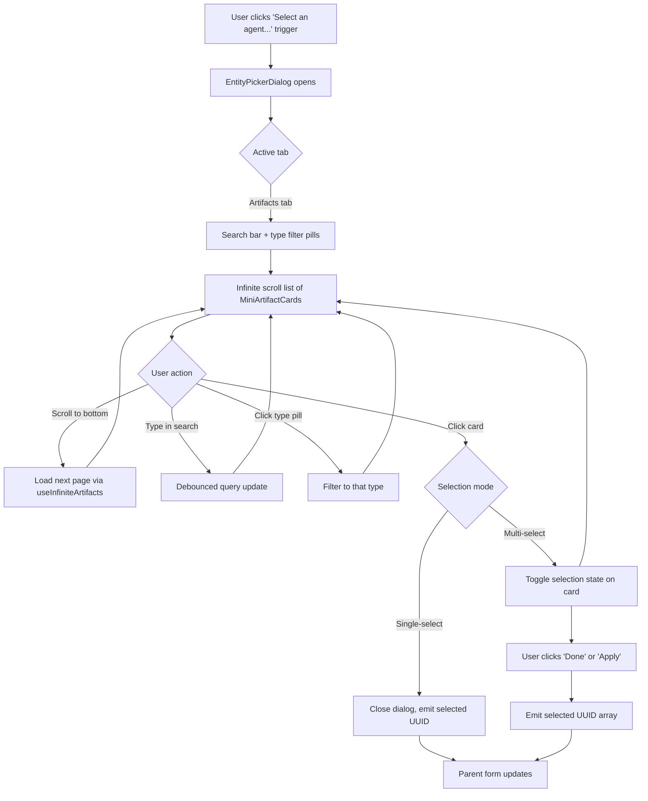

# Feature Brief & Metadata

**Feature Name:**

> Universal Entity Picker Dialog

**Filepath Name:**

> `universal-entity-picker-dialog-v1`

**Date:**

> 2026-03-06

**Author:**

> Claude (Sonnet 4.6) — PRD Writer agent

**Related Epic(s)/PRD ID(s):**

> None (standalone enhancement)

**Related Documents:**

> - `skillmeat/web/components/deployment-sets/add-member-dialog.tsx` — Rich dialog to extract patterns from
> - `skillmeat/web/components/shared/artifact-picker.tsx` — Component being replaced
> - `skillmeat/web/components/shared/context-module-picker.tsx` — Component being replaced
> - `skillmeat/web/components/collection/mini-artifact-card.tsx` — Card component to reuse
> - `skillmeat/web/components/context/context-entity-card.tsx` — Card to create mini variant from

---

## 1. Executive Summary

Workflow stage roles ("Primary Agent" and "Supporting Tools") and the workflow-level "Global Context" field currently use compact popover pickers (`ArtifactPicker`, `ContextModulePicker`) that only display a limited paginated subset of entities and show minimal metadata. This enhancement extracts the rich browsing UX from the existing `AddMemberDialog` into a reusable `EntityPickerDialog` component — with configurable tabs, full infinite scroll, type-filter pills, and rich mini-cards — and replaces all three workflow picker fields with it.

**Priority:** MEDIUM

**Key Outcomes:**
- Outcome 1: Users can browse and inspect all available agents, tools, and context entities (not just the first page) when building workflow stages.
- Outcome 2: Richer metadata (description, tags, type badge) is surfaced at selection time, reducing blind picks.
- Outcome 3: A single reusable `EntityPickerDialog` component eliminates duplicated picker logic and establishes a composable primitive for future selection UX.

---

## 2. Context & Background

### Current state

Three picker fields in the Workflow UI use compact popover-based components:

| Location | Component | Mode |
|---|---|---|
| Stage Editor > Roles > Primary Agent | `ArtifactPicker` (`typeFilter=['agent']`) | Single-select |
| Stage Editor > Roles > Supporting Tools | `ArtifactPicker` (`typeFilter=['skill','command','mcp']`) | Multi-select |
| Builder Sidebar > Global Context > Global Modules | `ContextModulePicker` | Multi-select |

Both `ArtifactPicker` (`466 lines`) and `ContextModulePicker` (`530 lines`) are Popover + Command palette components. They fetch from `useInfiniteArtifacts` / `useContextModules` respectively, display only name + type badge, and — critically — only render the current page of results.

The deployment-sets feature already solved this problem: `AddMemberDialog` (`742 lines`) provides a Dialog-based, tab-structured experience with infinite scroll, debounced search, type-filter pills, and rich `MiniArtifactCard` cards. It is, however, tightly coupled to deployment-set membership mutation logic.

### Problem space

- **Pagination limits**: `ArtifactPicker` fetches up to 50 artifacts per load but does not expose infinite scroll in its popover; users with large collections cannot browse beyond the initial page without typing an exact name.
- **Minimal detail**: Pickers show only name and a type badge. Users cannot read description or tags to disambiguate identically-named artifacts before selecting.
- **Scattered implementations**: The existing pickers each solve overlapping problems independently, producing two large files that duplicate search, debounce, and type-filter logic.

### Current alternatives / workarounds

Users must type partial names in the command palette and rely on memory, or navigate away to the collection page to inspect an artifact before returning to the form.

### Architectural context

This is a pure frontend change. No backend API changes are required — all data is already accessible through existing hooks (`useInfiniteArtifacts`, `useContextModules`, `useIntersectionObserver`, `useDebounce`). The new component lives in `components/shared/` (used by 2+ feature areas). Existing pickers remain as fallback if needed elsewhere; the workflow integrations are the only consumers being migrated in this PRD.

---

## 3. Problem Statement

**User story:**

> "As a workflow author, when I select a Primary Agent or add Supporting Tools to a stage, I see only a short list with no descriptions or tags, so I cannot confidently choose the right artifact without first navigating away to the collection page."

**Technical root cause:**

- `ArtifactPicker` uses a `<Popover>` + `<Command>` pattern with a fixed 50-item fetch; no infinite scroll sentinel is rendered inside the popover.
- `ContextModulePicker` fetches with `limit: 100` but still shows only name + type — no description or tags.
- Both components are not reusable across selection contexts because they hard-code their data sources.
- Files involved: `skillmeat/web/components/shared/artifact-picker.tsx`, `skillmeat/web/components/shared/context-module-picker.tsx`, `skillmeat/web/components/workflow/stage-editor.tsx:413-446`, `skillmeat/web/components/workflow/builder-sidebar.tsx:428-433`.

---

## 4. Goals & Success Metrics

### Primary goals

**Goal 1: Complete entity browsability**
- Users can scroll through all available agents, tools, or context entities — not just the first page.
- Success: Infinite scroll sentinel loads the next page when reached; all entities accessible without typing.

**Goal 2: Rich selection context**
- Users can see name, description, type badge, and tags for each entity before selecting.
- Success: `MiniArtifactCard` (already `436 lines` with rich layout) and a new `MiniContextEntityCard` render inside the dialog.

**Goal 3: Reusable, zero-coupling component**
- `EntityPickerDialog` has no references to workflow, deployment-sets, or any domain model.
- Success: Component API accepts only generic tab/filter/mode config; passes zero domain-specific props.

### Success metrics

| Metric | Baseline | Target | Measurement method |
|--------|----------|--------|--------------------|
| All entities browsable without search | No (page-limited) | Yes (infinite scroll) | Manual QA: scroll to end with 100+ artifacts in collection |
| Metadata shown at selection time | Name + type only | Name + description + tags + type | Visual QA of rendered card |
| Lines of duplicated picker logic | ~996 (two files) | ~0 (logic lives in `EntityPickerDialog`) | Code review |
| Workflow stage regression (existing fields) | N/A | 0 regressions | Cypress E2E |

---

## 5. User personas & journeys

### Personas

**Primary persona: Workflow Author**
- Role: Developer or power user building multi-stage Claude workflows.
- Needs: Quickly find and assign the right agent or tool to each stage without breaking flow.
- Pain points: Tiny popover, no description, forced to memorize exact artifact names.

**Secondary persona: New user onboarding**
- Role: First-time workflow builder with a growing collection.
- Needs: Browse what is available and discover tools they had forgotten they installed.
- Pain points: Cannot explore — must know the name in advance.

### High-level flow



---

## 6. Requirements

### 6.1 Functional requirements

| ID | Requirement | Priority | Notes |
|:--:|-------------|:--------:|-------|
| FR-1 | `EntityPickerDialog` accepts a `tabs` prop defining one or more tab configurations | Must | Each tab config specifies: label, icon, data hook params, card renderer, allowable type filters |
| FR-2 | `EntityPickerDialog` supports `mode: 'single' \| 'multi'` — single-select closes dialog on pick; multi-select toggles and requires explicit confirm | Must | Align with current `ArtifactPicker` `mode` prop |
| FR-3 | Dialog has a debounced search input (300 ms) that filters results across the active tab | Must | Reuse `useDebounce` hook |
| FR-4 | Type-filter pills are rendered per tab based on the types present in results; selecting a pill narrows the list | Must | Pills only rendered when `typeFilters` config provided for that tab |
| FR-5 | Active tab content uses infinite scroll (via `useIntersectionObserver` + `useInfiniteArtifacts`) to load all pages | Must | Sentinel div at list bottom; no explicit "load more" button required |
| FR-6 | Each item in the Artifacts tab renders `MiniArtifactCard` showing name, type, description, and tags | Must | Reuse existing component at `components/collection/mini-artifact-card.tsx` |
| FR-7 | Each item in the Context Entities tab renders a new `MiniContextEntityCard` showing name, type, and description | Must | New component; mini variant derived from `context-entity-card.tsx` |
| FR-8 | Already-selected items display a visual "selected" state (checkmark overlay) | Must | Match `AddMemberDialog` selection feedback pattern |
| FR-9 | Trigger element shows a summary of the current selection: selected name (single mode) or selected-count badge (multi mode) | Must | Match current `ArtifactPicker` / `ContextModulePicker` trigger behavior |
| FR-10 | Tab content is lazily fetched — no network request fires until the tab becomes active | Should | Avoids unnecessary load on dialog open |
| FR-11 | Dialog is keyboard-navigable: Tab through pills, Up/Down through list items, Enter to select, Escape to close | Must | WCAG 2.1 AA compliance |
| FR-12 | Workflow Stage Editor replaces `ArtifactPicker` (Primary Agent) with `EntityPickerDialog` in single-select mode | Must | `typeFilter=['agent']` on the Artifacts tab |
| FR-13 | Workflow Stage Editor replaces `ArtifactPicker` (Supporting Tools) with `EntityPickerDialog` in multi-select mode | Must | `typeFilter=['skill','command','mcp']` on the Artifacts tab |
| FR-14 | Workflow Builder Sidebar replaces `ContextModulePicker` (Global Modules) with `EntityPickerDialog` in multi-select mode | Must | Single "Context Entities" tab showing context modules |
| FR-15 | All three integration points preserve their existing `value` / `onChange` prop contracts so no parent form changes are required | Must | `value: string \| string[]`, `onChange: (v: string \| string[]) => void` |

### 6.2 Non-functional requirements

**Performance:**
- Dialog list renders with windowing or a standard scroll area; initial open time under 200 ms.
- Debounce prevents firing a new query on every keystroke (300 ms delay).
- Tab content does not fetch until the tab is first activated (lazy load).

**Accessibility:**
- Dialog follows ARIA dialog pattern (`role="dialog"`, `aria-modal="true"`, focus trap on open, focus returns to trigger on close).
- Filter pills use `role="group"` + `aria-label`; selected pill has `aria-pressed="true"`.
- List items are keyboard-reachable via arrow keys; selected items announce state to screen readers via `aria-selected`.
- Color is not the sole indicator of selection state (checkmark icon required alongside color).

**Reliability:**
- Loading and error states rendered for each tab content area (skeleton cards during fetch, error message on failure).
- Empty state message when no entities match the current search + filter combination.

**Reusability / coupling:**
- `EntityPickerDialog` imports zero domain-specific types from workflow, deployment-set, or context domains.
- All domain-specific configuration is injected via props (tab config objects, card renderers, data hooks).

**Observability:**
- No new telemetry spans required (pure frontend component; no new API endpoints).
- Console errors must not appear during normal operation (enforce with ESLint `no-console` rule in component).

---

## 7. Scope

### In scope

- New `EntityPickerDialog` component in `skillmeat/web/components/shared/`
- New `MiniContextEntityCard` component in `skillmeat/web/components/context/`
- Replacement of `ArtifactPicker` in `stage-editor.tsx` (Primary Agent + Supporting Tools)
- Replacement of `ContextModulePicker` in `builder-sidebar.tsx` (Global Modules)
- Unit tests for `EntityPickerDialog` covering: render, tab switching, search, filter pills, single-select, multi-select, keyboard navigation
- Unit test update for `stage-editor.tsx` and `builder-sidebar.tsx` to cover new picker invocation

### Out of scope

- Refactoring `AddMemberDialog` to use `EntityPickerDialog` as its foundation (separate follow-up)
- Removing or deprecating `ArtifactPicker` or `ContextModulePicker` — they remain as-is; only the three workflow call-sites are migrated
- Backend API changes (all data sources already exist)
- New card designs for artifact or context entity types
- Any other picker or selector field outside the three workflow call-sites
- E2E (Playwright) tests (stretch goal; unit + manual QA sufficient for this scope)

---

## 8. Dependencies & Assumptions

### External dependencies

- **Radix UI Dialog** (`@radix-ui/react-dialog`): Already in use; no new install required.
- **Lucide React**: Icon library already installed.

### Internal dependencies

- **`useInfiniteArtifacts` hook** (`hooks/index.ts`): Existing; supports `search`, `type`, `limit` params.
- **`useContextModules` hook** (`hooks/index.ts`): Existing; supports `limit` param.
- **`useIntersectionObserver` hook** (`hooks/index.ts`): Existing; used by `AddMemberDialog` for infinite scroll sentinel.
- **`useDebounce` hook** (`hooks/index.ts`): Existing.
- **`MiniArtifactCard`** (`components/collection/mini-artifact-card.tsx`): Existing (`436 lines`); supports artifact display with description + tags.
- **`AddMemberDialog`** (`components/deployment-sets/add-member-dialog.tsx`): Source of structural patterns; not modified.

### Assumptions

- `useInfiniteArtifacts` returns a standard `{ pages, fetchNextPage, hasNextPage, isLoading, isFetching }` shape compatible with infinite scroll sentinel pattern used in `AddMemberDialog`.
- `MiniArtifactCard` accepts an `Artifact` object (not just UUID) and renders description + tags when present — this is confirmed by the `436`-line component already serving the collection page.
- `context-entity-card.tsx` (`429 lines`) provides sufficient layout reference to derive a compact mini variant without redesigning card patterns.
- The workflow form state (`primaryAgentUuid: string`, `toolUuids: string[]`, `contextModuleIds: string[]`) uses UUIDs as identifiers, consistent with ADR-007.
- No feature flag is required for this change — the three call-site replacements are behaviorally backward-compatible (same props contract, same identifiers returned).

### Feature flags

- None required.

---

## 9. Risks & Mitigations

| Risk | Impact | Likelihood | Mitigation |
|------|:------:|:----------:|-----------|
| `MiniContextEntityCard` mini variant requires significant design work beyond a simple trim of `context-entity-card.tsx` | Med | Low | Inspect `context-entity-card.tsx` before implementation; if complex, scope to name + type chip only for v1 |
| Tab lazy-load logic introduces a flash of empty content on first tab activate | Low | Med | Show skeleton immediately on tab activate before first fetch resolves |
| Existing `stage-editor.tsx` unit tests break if they mock `ArtifactPicker` by import path | Low | Med | Update test mocks to reference `EntityPickerDialog` at the new import path |
| `AddMemberDialog` patterns use `useAddMember` mutation tightly woven into selection callbacks; extraction is messier than expected | Med | Low | `EntityPickerDialog` only needs selection state — mutation logic stays in `AddMemberDialog`; extraction is additive not destructive |
| Visual regression in workflow form layout if `EntityPickerDialog` trigger button is a different size than the current `ArtifactPicker` trigger | Low | Low | Match trigger button height and label style to existing form fields (`Field` + label pattern in `stage-editor.tsx`) |

---

## 10. Target state (post-implementation)

**User experience:**
- Clicking "Select an agent..." in the Stage Editor opens a full Dialog (not a small popover) with a searchable, filterable, scrollable list of all agents in the collection.
- Each agent is displayed as a rich mini-card showing name, description, tags, and type badge.
- Users can scroll to the end of the list without hitting a page limit.
- Selecting an agent closes the dialog and updates the form field immediately.
- The "Supporting Tools" and "Global Modules" fields provide the same rich browsing experience in multi-select mode.

**Technical architecture:**
- `EntityPickerDialog` is a generic shared component with a tab-config prop interface.
- `stage-editor.tsx` and `builder-sidebar.tsx` pass tab configurations to `EntityPickerDialog`; no picker-specific logic lives in the form components.
- `MiniContextEntityCard` is a new compact card component in `components/context/`.
- `ArtifactPicker` and `ContextModulePicker` are unchanged; three call-sites in workflow components now use `EntityPickerDialog`.

**Component interface (target):**

```tsx
// Tab configuration shape
interface EntityPickerTab<T> {
  id: string;
  label: string;
  icon: React.ComponentType<{ className?: string }>;
  // Hook call wrapper — returns { items, fetchNextPage, hasNextPage, isLoading, isFetching }
  useData: (params: { search: string; typeFilter?: string[] }) => InfiniteDataResult<T>;
  // Renderer for each item card
  renderCard: (item: T, isSelected: boolean) => React.ReactNode;
  // Optional type filter pill config
  typeFilters?: { value: string; label: string; icon?: React.ComponentType }[];
  // Identifier extractor — returns the UUID to store in value
  getId: (item: T) => string;
}

interface EntityPickerDialogProps<T = unknown> {
  open: boolean;
  onOpenChange: (open: boolean) => void;
  tabs: EntityPickerTab<T>[];
  mode: 'single' | 'multi';
  value: string | string[];
  onChange: (value: string | string[]) => void;
  title?: string;
  description?: string;
}
```

**Observable outcomes:**
- No API endpoint changes.
- Collection with 200+ artifacts: all items reachable via scroll in dialog.
- Zero regressions in workflow create/edit flows (same form state shape).

---

## 11. Overall acceptance criteria (definition of done)

### Functional acceptance

- [ ] FR-1 through FR-15 implemented and verified.
- [ ] All three workflow call-sites (Primary Agent, Supporting Tools, Global Modules) open `EntityPickerDialog` on trigger click.
- [ ] Single-select: clicking a card closes the dialog and updates the form value with one UUID.
- [ ] Multi-select: clicking cards toggles selection; clicking "Done" emits the full selected UUID array.
- [ ] Infinite scroll: scrolling to the bottom of the Artifacts tab triggers `fetchNextPage` when `hasNextPage` is true.
- [ ] Search: typing in the dialog search input filters results within 300 ms of the last keystroke.
- [ ] Type filter pills: selecting a pill narrows the card list to that type; deselecting restores all.
- [ ] Empty state: dialog shows "No results" message when search + filter yield zero items.
- [ ] Loading state: skeleton cards shown while initial fetch is in-flight.

### Technical acceptance

- [ ] `EntityPickerDialog` component has zero imports from workflow or deployment-set domain files.
- [ ] `MiniContextEntityCard` renders context entity name, type badge, and description.
- [ ] All new `.tsx` files pass `pnpm type-check` with no errors.
- [ ] `pnpm lint` passes with no new warnings introduced.
- [ ] No `any` type assertions in new component code.

### Quality acceptance

- [ ] Unit tests cover: dialog open/close, tab switching, search input debounce, type filter toggle, single-select pick, multi-select toggle + confirm, keyboard Escape close.
- [ ] Updated unit tests for `stage-editor.tsx` and `builder-sidebar.tsx` pass.
- [ ] Manual QA: all three workflow picker fields function correctly end-to-end in development.
- [ ] Accessibility: keyboard-only navigation through dialog (Tab, arrow keys, Enter, Escape) works correctly.

### Documentation acceptance

- [ ] JSDoc block on `EntityPickerDialog` component explaining props and usage examples for all three integration patterns.
- [ ] JSDoc block on `EntityPickerTab` interface.

---

## 12. Assumptions & open questions

### Assumptions

- `useInfiniteArtifacts` hook signature and return shape are stable and match the pattern used in `AddMemberDialog`.
- `context-entity-card.tsx` provides sufficient layout reference to derive `MiniContextEntityCard` without additional design work.
- The workflow form trigger buttons can adopt a slightly different visual style (full-width button instead of inline text with chevron) without UX regression — if this is a concern, the trigger can be styled to match the current `ArtifactPicker` button exactly.

### Open questions

- [ ] **Q1**: Should `EntityPickerDialog` support a "preview pane" for artifact detail on hover/focus, or is the mini-card sufficient for v1?
  - **A**: Mini-card only for v1. Preview pane is a potential follow-up enhancement.
- [ ] **Q2**: Should the `ContextModulePicker` replacement tab also display inherited (read-only) modules from the project scope, as the current `ContextModulePicker` does?
  - **A**: Assume yes — the `EntityPickerDialog` context entities tab should visually distinguish inherited modules (read-only, grayed) from selectable ones. If `useContextModules` does not expose this distinction, inherited display can be deferred.
- [ ] **Q3**: Is `composite` artifact type included as a filterable type for the Supporting Tools tab?
  - **A**: Out of scope per feature description (`typeFilter=['skill','command','mcp']`); `composite` omitted for v1.

---

## 13. Appendices & references

### Related documentation

- **Component patterns**: `.claude/context/key-context/component-patterns.md`
- **Hook selection**: `.claude/context/key-context/hook-selection-and-deprecations.md`
- **Data flow patterns**: `.claude/context/key-context/data-flow-patterns.md`
- **Artifact identifiers (ADR-007)**: `skillmeat/web/CLAUDE.md` § "Artifact Identifiers"
- **Testing patterns**: `.claude/context/key-context/testing-patterns.md`

### Symbol references

- `useInfiniteArtifacts`, `useContextModules`, `useIntersectionObserver`, `useDebounce` — hooks barrel: `skillmeat/web/hooks/index.ts`
- `MiniArtifactCard` — `skillmeat/web/components/collection/mini-artifact-card.tsx`
- `AddMemberDialog` — `skillmeat/web/components/deployment-sets/add-member-dialog.tsx` (structural reference)
- `ArtifactPickerProps` — `skillmeat/web/components/shared/artifact-picker.tsx:116`
- `ContextModulePickerProps` — `skillmeat/web/components/shared/context-module-picker.tsx:40`

### Prior art

- `AddMemberDialog` — full dialog pattern with tabs, infinite scroll, type filters, and mini-cards; direct structural source for `EntityPickerDialog`

---

## Implementation

### Phased approach

**Phase 1: Extract `EntityPickerDialog`**
- Duration: 2 days
- Tasks:
  - [ ] Define `EntityPickerTab` and `EntityPickerDialogProps` TypeScript interfaces
  - [ ] Build `EntityPickerDialog` component extracted from `AddMemberDialog` patterns (search input, tab structure, type filter pills, infinite scroll sentinel, selection state management)
  - [ ] Strip all deployment-set–specific mutation logic; accept generic `tabs` config only
  - [ ] Add JSDoc on all exported types and the component
  - [ ] Write unit tests for dialog behavior (open/close, search, filter, select modes, keyboard nav)

**Phase 2: Create `MiniContextEntityCard`**
- Duration: 0.5 day
- Tasks:
  - [ ] Create `MiniContextEntityCard` in `skillmeat/web/components/context/mini-context-entity-card.tsx` as a compact variant of `context-entity-card.tsx`
  - [ ] Show: name, entity type chip, description (truncated to 2 lines)
  - [ ] Write unit test verifying render with name, type, and truncated description

**Phase 3: Integrate into Stage Editor**
- Duration: 1 day
- Tasks:
  - [ ] Replace `ArtifactPicker` at `stage-editor.tsx:413` (Primary Agent) with `EntityPickerDialog` in single-select + `typeFilter=['agent']` mode
  - [ ] Replace `ArtifactPicker` at `stage-editor.tsx:424` (Supporting Tools) with `EntityPickerDialog` in multi-select + `typeFilter=['skill','command','mcp']` mode
  - [ ] Verify `value`/`onChange` prop contract unchanged
  - [ ] Update `stage-editor` unit tests

**Phase 4: Integrate into Builder Sidebar**
- Duration: 0.5 day
- Tasks:
  - [ ] Replace `ContextModulePicker` at `builder-sidebar.tsx:428` (Global Modules) with `EntityPickerDialog` using a Context Entities tab and `MiniContextEntityCard`
  - [ ] Verify `value`/`onChange` prop contract unchanged
  - [ ] Update `builder-sidebar` unit tests

**Phase 5: Testing & polish**
- Duration: 1 day
- Tasks:
  - [ ] Full `pnpm type-check` and `pnpm lint` pass
  - [ ] Complete unit test coverage pass (`pnpm test`)
  - [ ] Manual QA of all three integration points in `skillmeat web dev`
  - [ ] Accessibility audit: keyboard-only navigation through each picker dialog
  - [ ] Visual polish: ensure trigger button sizing matches surrounding form fields

### Epics & user stories backlog

| Story ID | Short name | Description | Acceptance criteria | Estimate |
|----------|------------|-------------|---------------------|----------|
| UEP-001 | EntityPickerDialog component | Build generic dialog with tab config, search, filter pills, infinite scroll | Component renders with 1+ tabs; search filters results; scroll loads next page | 5 pts |
| UEP-002 | MiniContextEntityCard | Create compact context entity card for use in picker | Renders name, type chip, description; matches mini-card visual scale | 1 pt |
| UEP-003 | Stage Editor — Primary Agent | Replace ArtifactPicker (agent, single) with EntityPickerDialog | Agent field opens dialog; selecting agent closes dialog + updates UUID | 2 pts |
| UEP-004 | Stage Editor — Supporting Tools | Replace ArtifactPicker (skill/command/mcp, multi) with EntityPickerDialog | Tools field opens dialog; selecting/deselecting tools updates UUID array | 2 pts |
| UEP-005 | Builder Sidebar — Global Modules | Replace ContextModulePicker with EntityPickerDialog | Global Modules field opens dialog with context entities; multi-select updates ID array | 2 pts |
| UEP-006 | Tests & accessibility pass | Full test suite + a11y audit for all three integration points | All unit tests pass; keyboard navigation verified; no lint or type errors | 2 pts |

---

**Progress tracking:**

See progress tracking: `.claude/progress/universal-entity-picker-dialog/all-phases-progress.md` (to be created when implementation begins)
