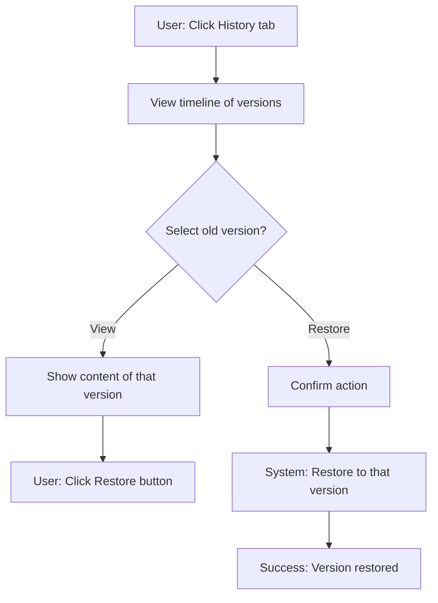
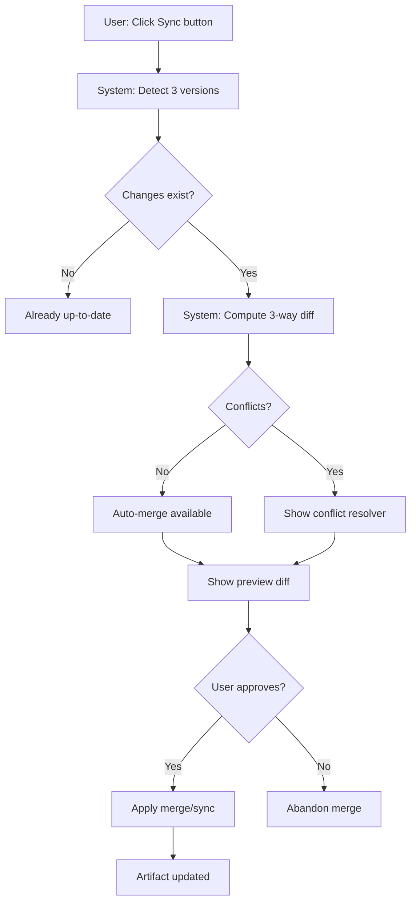
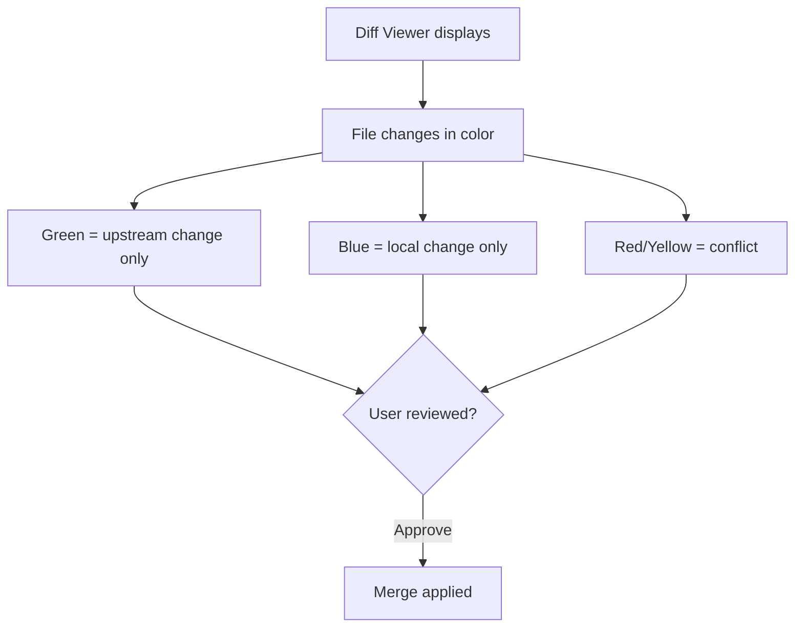

# PRD: Versioning & Merge System

**Feature Name:** Versioning & Merge System

**Filepath Name:** `versioning-merge-system-v1`

**Date:** 2025-11-30

**Author:** Claude Code (AI Agent)

**Version:** 1.0

**Status:** Draft

**Builds On:** Entity Lifecycle Management, Web UI Consolidation PRDs

---

## 1. Executive Summary

The Versioning & Merge System provides robust artifact version management, historical tracking, and intelligent three-way merge capabilities with clear local vs. upstream change visualization. This feature addresses two critical gaps:

1. **Version History & Rollback** - Users can view complete version lineage, compare any two versions, and restore prior versions with a single click
2. **Smart Merge Workflow** - When source, collection, and project have diverged, the system automatically detects and cleanly merges non-conflicting changes while presenting only true conflicts for user resolution

**Priority:** HIGH

**Key Outcomes:**
- Full version history visible in History tab with chronological timeline
- One-click rollback to any prior version
- Smart three-way merge detects local vs. upstream changes automatically
- Color-coded diff viewer shows "local change", "upstream update", "no conflict"
- Automatic merge of non-conflicting changes preserves local customizations
- Clear conflict detection only for genuine conflicts requiring user input

---

## 2. Context & Background

### Current State

**What Exists Today:**

1. **Snapshot Manager** (`skillmeat/storage/snapshot.py`):
   - Creates tarball-based snapshots of entire collection
   - Stores metadata (timestamp, message, artifact count)
   - Provides restore capability at collection level
   - No per-artifact versioning

2. **Sync Manager** (`skillmeat/core/sync.py`):
   - Detects drift between deployed and collection versions
   - Compares against deployment metadata
   - No three-way merge support
   - No clear "local vs upstream" distinction

3. **Deployment Manager** (`skillmeat/storage/deployment.py`):
   - Tracks deployed artifact state with checksums
   - Records deployment timestamp
   - No historical tracking beyond current state

4. **DiffResult Model** (`skillmeat/models.py`):
   - Supports file-level diff with status (added/removed/modified/unchanged)
   - Provides unified diff output
   - No three-way diff support

5. **Web UI - History Tab** (partially implemented):
   - Modal artifact detail has History tab
   - Shows version tree visualization
   - No actual version history retrieval or rollback

### Problem Space

**Pain Point 1: No Per-Artifact Version History**
- Users cannot view what changes were made to an artifact over time
- Cannot see who deployed/modified when
- Cannot restore previous versions
- Must rely on collection snapshots (coarse-grained, no artifact detail)

**Pain Point 2: Unclear Merge Semantics**
- When Source → Collection → Project all have changes, merge workflow is ambiguous
- System cannot distinguish "local customization" from "upstream update"
- Users don't know which changes are theirs vs. upstream
- No automatic merge of non-conflicting changes
- All differences presented as potential conflicts (low signal-to-noise)

**Pain Point 3: Example Scenario (Current)**
```
Source (GitHub): Updated skill description and added helper function
Collection: Local customization of README
Project: Deployed with original version

When syncing Project:
- Cannot distinguish GitHub change from Collection change
- Cannot auto-merge helper function (no conflict with Collection)
- User sees 3 "conflicts" but only README truly conflicts
- Must manually resolve or lose one set of changes
```

**Pain Point 4: No Rollback Mechanism**
- If merge goes wrong, no easy recovery
- Must manually revert or redeploy from backup
- No point-in-time recovery for individual artifacts

### Architectural Context

**Current Flow:**

```
Source (GitHub)
    ↓ [fetch/clone]
Collection (~/.skillmeat/collection/)
    ├─ manifest.toml (which artifacts deployed)
    ├─ artifacts/
    └─ snapshots/ (collection-level only)

Project (./.claude/)
    ├─ manifest.toml (deployed artifacts)
    ├─ artifacts/
    └─ .skillmeat-deployed.toml (deployment metadata with checksums)
```

**Versioning Needs:**

- **Source Level**: Track versions from GitHub (tags, commits)
- **Collection Level**: Track artifact versions as they're synced/deployed
- **Project Level**: Track artifact state at deployment time
- **Cross-Level**: Support three-way merge (Source, Collection, Project)

---

## 3. Problem Statement

**Core Gaps:**

1. **No per-artifact version history** - Users cannot track changes to an artifact over time
2. **No smart merge** - System cannot distinguish local edits from upstream updates
3. **No rollback** - Cannot restore previous versions of an artifact
4. **Unclear sync direction** - Merging has ambiguous semantics when multiple levels have diverged

**User Stories:**

> "As a developer, when I make local customizations to a skill and then try to sync upstream updates, I want the system to automatically merge non-conflicting changes so I don't lose my customizations or upstream improvements."

> "As a team lead, when an artifact was modified incorrectly in a project, I need to easily see the previous version and restore it with one click, rather than manually reverting files."

> "As a power user syncing between Source→Collection→Project with diverged versions, I need clear visual indication of which changes are mine, which are upstream, and which actually conflict."

**Technical Root Causes:**
- Version storage strategy undefined (per-file? snapshots? Git-based?)
- Three-way diff not implemented in core (only two-way)
- No version metadata tracking (who changed, when, why)
- Merge conflict detection assumes binary outcomes

---

## 4. Goals & Success Metrics

### Primary Goals

**Goal 1: Complete Version History for Artifacts**
- Every artifact tracks full lineage from source to deployment
- Users can browse version timeline and see changes per version
- Measurable: 100% of artifacts have restorable version history

**Goal 2: Smart Three-Way Merge**
- Automatically detect local vs upstream changes
- Auto-merge non-conflicting changes
- Only prompt user for true conflicts
- Measurable: 80% of merges auto-resolve without user input

**Goal 3: One-Click Rollback**
- Users restore prior version from History tab
- Rollback preserves subsequent non-conflicting changes
- Measurable: Rollback completes in < 1s

**Goal 4: Clear Visual Merge Workflow**
- Color-coded diff shows "local", "upstream", "merged"
- Users understand exactly what changed and why
- Measurable: User testing shows 95% understand merge status

**Goal 5: Cross-Level Sync Clarity**
- All three merge directions work: upstream→collection, collection→project, project→collection
- Users know exactly what "sync" means in each context
- Measurable: Zero ambiguity in sync dialogs/workflows

### Success Metrics

| Metric | Baseline | Target | Method |
|--------|----------|--------|--------|
| Artifacts with version history | 0% | 100% | Feature completion |
| Auto-merge success rate | 0% | 80%+ | Merge operation tracking |
| Version history retrieval time | N/A | < 100ms | Performance measurement |
| Rollback time | N/A | < 1s | Timing tests |
| Merge operation success | 60% (errors) | 95%+ | Success rate tracking |
| User understanding of conflicts | Unknown | 95% | User testing |
| Time to resolve merge manually | 5+ min | 1-2 min | UX measurement |

---

## 5. User Personas & Journeys

### Personas

**Primary: Developer Dan**
- Full-stack developer managing 10+ projects with shared skills
- Pain: Loses track of what changed when; manual merges are tedious
- Need: Easy version history + smart auto-merge

**Secondary: Team Lead Terry**
- Manages shared skill library for team
- Pain: Team member makes mistake, needs quick recovery
- Need: Rollback + clear change tracking for audits

**Tertiary: Careful Carol**
- Values code stability; syncs infrequently
- Pain: Large gaps between syncs = complex merges
- Need: Smart conflict detection to avoid surprises

### High-Level Flows

**Scenario A: Browse Version History & Restore**



**Scenario B: Smart Three-Way Merge**



**Scenario C: Merge with Color-Coded Indicators**



---

## 6. Requirements

### 6.1 Functional Requirements

#### Version History Management

| ID | Requirement | Priority | Category | Notes |
|:--:|-----------|:--------:|----------|-------|
| FR-1 | Store version snapshots per artifact (not just collection-level) | MUST | Storage | Version stored on sync/deploy/edit |
| FR-2 | Track version metadata: timestamp, hash, source, who changed | MUST | Metadata | Enable sorting, filtering, audits |
| FR-3 | Retrieve complete version history for any artifact | MUST | API | List versions chronologically |
| FR-4 | Display version timeline in History tab | MUST | UI | Chronological list with metadata |
| FR-5 | Show diff between any two versions | MUST | UI | Side-by-side or unified view |
| FR-6 | Allow user to select prior version and view its content | MUST | UI | Read-only content browser |
| FR-7 | One-click restore to any prior version | MUST | UI | Confirmation required |
| FR-8 | Preserve rollback history (audit trail) | SHOULD | Metadata | Track who restored when |
| FR-9 | Support version retention policies (keep last N, or N days) | COULD | Storage | Configurable cleanup |

#### Three-Way Merge System

| ID | Requirement | Priority | Category | Notes |
|:--:|-----------|:--------:|----------|-------|
| FR-10 | Three-way diff: Source vs Collection vs Project | MUST | Core | Base algorithm for smart merge |
| FR-11 | Detect file-level changes in each direction independently | MUST | Core | Base for conflict detection |
| FR-12 | Automatically merge non-conflicting changes | MUST | Merge | Auto-apply when safe |
| FR-13 | Identify true conflicts (changed in 2+ directions) | MUST | Merge | Only show these to user |
| FR-14 | Support merge strategies: ours, theirs, manual | MUST | Merge | Per-file resolution options |
| FR-15 | Visual diff with color-coded change types | MUST | UI | Green=upstream, Blue=local, Red=conflict |
| FR-16 | Conflict resolver shows all options (ours/theirs/manual) | MUST | UI | Reuse existing conflict-resolver component |
| FR-17 | Merge preview before applying | MUST | UI | Show what will change |
| FR-18 | Atomic merge operation (all-or-nothing) | MUST | Core | Rollback entire merge on error |

#### Sync Direction Support

| ID | Requirement | Priority | Category | Notes |
|:--:|-----------|:--------:|----------|-------|
| FR-19 | Sync up: Collection → Source (pull from GitHub) | MUST | Sync | Fetch upstream changes |
| FR-20 | Sync down: Source → Collection (deploy upstream) | MUST | Sync | Merge upstream into collection |
| FR-21 | Deploy: Collection → Project (initial deploy) | MUST | Sync | Existing deploy-dialog |
| FR-22 | Pull: Project → Collection (sync local changes back) | MUST | Sync | Bidirectional sync |
| FR-23 | All sync directions show three-way merge workflow | MUST | UI | Consistent merge UX |
| FR-24 | Clear labeling of sync direction in UI | MUST | UI | "Pull from upstream" vs "Push to collection" |

#### Version Metadata & Tracking

| ID | Requirement | Priority | Category | Notes |
|:--:|-----------|:--------:|----------|-------|
| FR-25 | Each version has: timestamp, hash, changelog, source | MUST | Metadata | Enable auditing |
| FR-26 | Version hash (deterministic) based on file contents | MUST | Metadata | Detect actual changes |
| FR-27 | Track what changed between versions (file list) | MUST | Metadata | Show in version list |
| FR-28 | Merge operation generates new version entry | MUST | Metadata | Track merges as changes |

### 6.2 Non-Functional Requirements

**Performance:**
- Version history retrieval for 100 versions: < 500ms
- Three-way diff computation for 10MB artifact: < 2s
- Rollback operation: < 1s (excluding I/O)
- Merge operation (including storage): < 5s

**Storage:**
- Version snapshots use compression (gzip or bzip2)
- Deduplicate identical files across versions (content-addressed)
- Configurable retention: keep last N versions or N days
- Estimated overhead: ~10-20% per artifact for history

**Reliability:**
- Merge operation is atomic (all-or-nothing)
- Rollback never loses data (versioning is append-only)
- Network failure during merge → graceful degradation (local change persists)
- Corrupt version metadata → graceful skip (fall back to collection version)

**Accessibility:**
- Color-coding supplemented with labels ("local", "upstream", "conflict")
- Merge workflow operable with keyboard only
- Clear text descriptions of what changed

---

## 7. Scope

### In Scope

**Version Storage & History:**
- Per-artifact version snapshots (file collections)
- Version metadata store (TOML/JSON manifest)
- Version comparison and diff generation
- Rollback mechanism with preservation of subsequent changes

**Three-Way Merge:**
- Three-way diff algorithm (base, ours, theirs)
- Automatic merge of non-conflicting changes
- Conflict detection with line-level granularity
- Merge preview and approval workflow

**UI Components:**
- History tab in unified entity modal (timeline + actions)
- Enhanced Sync Status tab with three-way merge display
- Color-coded diff viewer with change annotations
- Conflict resolver with merge strategy selection
- Version comparison view (before/after side-by-side)

**Cross-Level Sync:**
- Source → Collection sync (upstream pull)
- Collection → Project deploy and pull-back
- All scenarios use three-way merge workflow

### Out of Scope

**Not in MVP:**
- Git history integration (pull from Git history directly)
- Semantic conflict detection (AST-based merges)
- Real-time merge conflict notifications
- Automatic conflict resolution AI
- Binary file versioning
- Version branching (only linear history)
- Automatic version tagging/naming
- Webhook-triggered version captures

**Future Considerations:**
- Patch/delta-based storage (for space efficiency)
- Version signing and audit logs
- Scheduled automatic snapshots
- Smart conflict resolution via LLM
- Multi-artifact version tagging

---

## 8. Technical Approach

### Version Storage Architecture

**Directory Structure:**

```
~/.skillmeat/collection/
├── artifacts/
│   └── [artifact-name]/
│       ├── latest/          # Current version (working directory)
│       │   ├── skill.py
│       │   ├── skill.md
│       │   └── ...
│       ├── versions/
│       │   ├── v1-[hash]/   # Snapshot of version 1
│       │   ├── v2-[hash]/
│       │   └── ...
│       └── .version.toml    # Version metadata
└── ...

Project (./.claude/)
├── artifacts/
│   └── [artifact-name]/
│       ├── latest/
│       ├── versions/
│       └── .version.toml
└── ...
```

**Version Metadata (TOML):**

```toml
[versions]
version_count = 3

[[versions.entries]]
id = "v1-abc123de"
timestamp = 2025-11-20T10:00:00Z
hash = "abc123de..."
source = "source"  # "source", "upstream", "deploy", "merge", "rollback"
files_changed = ["skill.py", "skill.md"]
change_summary = "Initial upload"

[[versions.entries]]
id = "v2-def456ab"
timestamp = 2025-11-25T14:30:00Z
hash = "def456ab..."
source = "merge"
files_changed = ["skill.md"]
change_summary = "Merged upstream documentation update"
parent_versions = ["v1-abc123de"]  # For merge tracking

[[versions.entries]]
id = "v3-ghi789cd"
timestamp = 2025-11-28T09:15:00Z
hash = "ghi789cd..."
source = "rollback"
files_changed = []
change_summary = "Rolled back to v1"
parent_version = "v1-abc123de"
```

### Three-Way Merge Algorithm

**Inputs:**
- base: Source version (common ancestor)
- ours: Collection version (local)
- theirs: Project version OR upstream version (remote)

**Algorithm:**

```python
def three_way_merge(base, ours, theirs):
    """Three-way merge with conflict detection."""

    results = {
        "merged_files": [],      # Auto-merged
        "conflicts": [],         # Manual resolution needed
        "non_conflicts": [],     # No change needed
    }

    all_files = set(base.files) | set(ours.files) | set(theirs.files)

    for file in all_files:
        base_content = base.get_file(file)
        our_content = ours.get_file(file)
        their_content = theirs.get_file(file)

        # Case 1: No changes in any direction
        if base_content == our_content == their_content:
            results["non_conflicts"].append((file, our_content))
            continue

        # Case 2: Only they changed
        if base_content != their_content and base_content == our_content:
            results["merged_files"].append((file, their_content))
            continue

        # Case 3: Only we changed
        if base_content != our_content and base_content == their_content:
            results["merged_files"].append((file, our_content))
            continue

        # Case 4: Both changed - need to attempt 3-way merge
        if base_content != our_content and base_content != their_content:
            merged = attempt_line_merge(base_content, our_content, their_content)
            if merged.has_conflicts:
                results["conflicts"].append((file, merged))
            else:
                results["merged_files"].append((file, merged.content))

    return results
```

**Visual Indicators:**

```
Green   = Change in theirs only (upstream update)
Blue    = Change in ours only (local customization)
Red     = Change in both (conflict)
Yellow  = Change in base only (removed in both - deletion conflict)
```

### Component Architecture

**New/Enhanced Components:**

```
<HistoryTab>
  ├── <VersionTimeline>
  │   ├── Chronological list
  │   ├── Version metadata display
  │   └── Actions: View, Compare, Restore
  ├── <VersionComparisonView>
  │   ├── <DiffViewer color-coded>
  │   └── File-by-file changes
  └── <RestoreDialog>
      ├── Confirmation text
      └── Rollback button

<SyncStatusTab Enhanced>
  ├── <ThreeWayMergeDisplay>
  │   ├── "Auto-merge available"
  │   ├── "Conflicts detected"
  │   └── Merge preview
  ├── <ColoredDiffViewer>
  │   ├── Green = upstream only
  │   ├── Blue = local only
  │   └── Red = conflict
  └── <ApplyMergeWorkflow>
      ├── Preview step
      ├── Conflict resolution
      └── Confirmation
```

### API Design

**Version Management Endpoints:**

```
GET /api/v1/artifacts/{id}/versions
  → Returns: [{ id, timestamp, source, files_changed, hash }, ...]

GET /api/v1/artifacts/{id}/versions/{version_id}
  → Returns: { id, timestamp, source, files, metadata }

GET /api/v1/artifacts/{id}/versions/{v1}/diff/{v2}
  → Returns: DiffResult (file-level diff)

POST /api/v1/artifacts/{id}/versions/{version_id}/restore
  → Body: { confirm: true }
  → Returns: { success: true, restored_version_id }

POST /api/v1/artifacts/{id}/merge
  → Body: { merge_type: "upstream|project", strategy: "auto|manual" }
  → Returns: { auto_merged: [...], conflicts: [...], preview: [...] }

POST /api/v1/artifacts/{id}/merge/apply
  → Body: { conflict_resolutions: { file: "ours|theirs|content" } }
  → Returns: { success: true, new_version_id }
```

---

## 9. Dependencies & Assumptions

### External Dependencies

**Python Libraries:**
- `deepdiff` or `difflib` for three-way merge (standard lib sufficient)
- `bsdiff4` or similar for delta-based storage (optional, future)
- `lz4` or `brotli` for compression (optional enhancement)

**Frontend Libraries:**
- `react-diff-viewer-continued` (already used)
- Enhanced color-coding for change types

### Internal Dependencies

**Core Dependencies:**
- Artifact Version Tracking PRD (provides version lineage)
- Entity Lifecycle Management PRD (provides entity management UI)
- Web UI Consolidation PRD (provides unified modal)
- Existing `conflict-resolver.tsx` component

**Status:**
- Version tracking: In planning
- Entity lifecycle: In progress
- Web UI consolidation: In progress
- Conflict resolver: Complete and tested

### Assumptions

- Artifact files are text-based (or text-representable) for diff/merge
- Users have stable network connectivity during merge operations
- Version metadata fits in memory for a single artifact (< 100 versions typical)
- Rollback is always safe (content-addressed storage prevents loss)
- Three-way merge algorithm is sufficient for most cases (no semantic merge needed)

### Feature Flags

- `ENABLE_VERSION_HISTORY`: Enable per-artifact version tracking
- `ENABLE_THREE_WAY_MERGE`: Enable smart merge workflow
- `ENABLE_AUTO_MERGE`: Enable automatic non-conflict merges
- `VERSION_RETENTION_POLICY`: "keep_last_n" or "keep_n_days"
- `VERSION_STORAGE_TYPE`: "snapshot" or "delta" (future)

---

## 10. Risks & Mitigations

| Risk | Impact | Likelihood | Mitigation |
|------|--------|-----------|-----------|
| Merge algorithm incorrect creates corrupt artifact | HIGH | MEDIUM | Atomic operations, validation, test cases |
| Version storage bloats disk usage | MEDIUM | MEDIUM | Compression, deduplication, retention policies |
| Three-way merge confusing for users | MEDIUM | MEDIUM | Clear color-coding, tooltips, guided workflow |
| Large number of versions slows history retrieval | MEDIUM | LOW | Pagination, lazy loading, indexes |
| Rollback fails mid-operation leaves artifact inconsistent | HIGH | LOW | Transaction-like semantics, atomic writes |
| User accidentally restores wrong version | MEDIUM | LOW | Confirmation dialog, undo capability |
| Network failure during merge loses local changes | MEDIUM | LOW | Local persists, merge can retry |

---

## 11. Target State (Post-Implementation)

### User Experience

**Version History Browsing:**
```
User navigates to artifact detail
  → Clicks History tab
  → Sees timeline: v3 (latest) → v2 → v1 (oldest)
  → Each version shows: timestamp, source ("upstream merge"), files changed
  → Clicks v2 → Views content of v2 side-by-side with current
  → Clicks "Restore to v2" → Confirms → Artifact reverted
```

**Three-Way Merge Workflow:**
```
User syncs artifact with upstream changes
  → System detects: Source updated, Collection modified
  → Shows diff: green (upstream), blue (local), red (conflicts)
  → Summary: "1 auto-merge available, 0 conflicts"
  → User clicks "Merge"
  → System applies and shows: "Merged successfully"
```

**Conflict Resolution:**
```
User syncs artifact with upstream
  → System detects: Both Source and Collection changed same file
  → Shows conflict resolver: Red lines, blue lines, option to select
  → User chooses "keep both versions" or manual edit
  → Clicks "Resolve" → Conflict marked resolved
  → Clicks "Apply Merge" → Artifact updated
```

### Technical Architecture

**New Routes:**
```
/artifacts/{id}/history         - Full version history page
/artifacts/{id}/compare/{v1}/{v2} - Version comparison
/artifacts/{id}/merge           - Merge workflow
```

**Modified Routes:**
```
/manage/{type}  - Sync Status tab enhanced with three-way merge
```

**New Database/Storage:**
```
~/.skillmeat/collection/artifacts/{name}/versions/ - Version snapshots
~/.skillmeat/collection/artifacts/{name}/.version.toml - Metadata
```

### Observable Outcomes

**For Users:**
- Complete audit trail of artifact changes
- Merge operations complete 80% automatically
- Rollback takes < 1 second
- Understands exactly which changes are local vs upstream
- Zero data loss during merge conflicts

**For Developers:**
- Clear merge semantics (three-way diff)
- Atomic operations ensure consistency
- Version metadata enables debugging
- Type-safe version APIs

**System Metrics:**
- Merge success rate: 95%+
- Auto-merge rate: 80%+
- Version history query time: < 100ms
- Rollback time: < 1s
- Storage overhead: < 25% per artifact

---

## 12. Acceptance Criteria (Definition of Done)

### Functional Acceptance

- [ ] Version snapshots created for all artifact changes (deploy, sync, edit)
- [ ] Version metadata stored with timestamp, hash, source, change list
- [ ] History tab displays chronological version list with metadata
- [ ] Users can view content of any prior version
- [ ] Users can diff between any two versions
- [ ] One-click restore to prior version with confirmation
- [ ] Three-way merge detects changes in all three directions
- [ ] Auto-merge applies non-conflicting changes automatically
- [ ] Conflict resolver shows merge options for true conflicts
- [ ] Color-coded diff displays changes with clear labels
- [ ] All sync directions (upstream, collection, project) use three-way merge
- [ ] Rollback operation is atomic and preserves data integrity

### Technical Acceptance

- [ ] Version storage strategy documented and implemented
- [ ] Version metadata TOML schema finalized
- [ ] Three-way merge algorithm tested with 50+ scenarios
- [ ] API endpoints follow REST conventions
- [ ] Version retrieval performance < 500ms for 100 versions
- [ ] Merge operation time < 5s including storage
- [ ] Atomic operations never corrupt artifact state
- [ ] TypeScript strict mode with full type coverage

### Quality Acceptance

- [ ] Unit tests for merge algorithm (>80% coverage)
- [ ] Integration tests for version storage/retrieval
- [ ] E2E tests for rollback and merge workflows
- [ ] Performance tests meet benchmarks
- [ ] Accessibility audit passes (WCAG 2.1 AA)
- [ ] No regressions in existing sync functionality
- [ ] Error handling with user-friendly messages

### Documentation Acceptance

- [ ] API endpoint documentation complete
- [ ] User guide for version history and rollback
- [ ] Merge workflow guide with examples
- [ ] Version storage architecture documented
- [ ] Merge algorithm documented with examples

---

## 13. Assumptions & Open Questions

### Assumptions

- Text-based artifacts sufficient (binary files out of scope)
- Three-way merge algorithm adequate (no semantic merge needed)
- Users trust automated merge for non-conflicting changes
- Disk space available for version storage (configurable retention)
- Version history within single artifact stays < 1000 versions typically

### Open Questions

- [ ] **Q1: Version Storage Media**
  - Option A: Directory snapshots (current plan - simple, readable)
  - Option B: Delta-based storage (saves space, harder to debug)
  - Option C: Git-based (leverages Git, adds dependency)
  - **A:** Recommend A for MVP, B as optimization

- [ ] **Q2: Conflict Resolution Granularity**
  - Option A: File-level (accept whole file as ours or theirs)
  - Option B: Hunk-level (merge individual sections)
  - Option C: Line-level (diff3-style with conflict markers)
  - **A:** Recommend A for MVP, B in future

- [ ] **Q3: Automatic Merge Threshold**
  - Should 100% of non-conflicts be auto-merged?
  - Or require user confirmation for any merge?
  - **A:** Recommend auto-merge with preview option

- [ ] **Q4: Version Naming**
  - Sequential (v1, v2, v3)?
  - Hash-based (abc123de)?
  - Timestamp-based?
  - **A:** Recommend hash-based with sequential display (v3-abc123de)

- [ ] **Q5: Rollback Scope**
  - Restore single artifact only (current plan)?
  - Or bulk rollback multiple artifacts?
  - **A:** Recommend single for MVP, bulk in future

---

## 14. Implementation Strategy

### Phased Approach

**Phase 1: Version Storage Infrastructure (Week 1-2)**
- Design version storage directory structure
- Implement version snapshot capture mechanism
- Create version metadata schema and TOML storage
- Build version retrieval and listing APIs

**Phase 2: Three-Way Merge Core (Week 2-3)**
- Implement three-way diff algorithm
- Build conflict detection logic
- Create merge result data structures
- Add unit tests for merge scenarios

**Phase 3: History Tab Enhancement (Week 3-4)**
- Add version timeline component
- Show version metadata in history
- Implement version content viewer
- Add diff comparison view

**Phase 4: Rollback Mechanism (Week 4)**
- Build rollback logic (file restoration)
- Add rollback confirmation dialog
- Test atomic rollback operations
- Add rollback audit logging

**Phase 5: Merge Workflow UI (Week 5)**
- Enhance Sync Status tab with merge preview
- Integrate conflict resolver component
- Add color-coded diff viewer
- Build step-by-step merge approval workflow

**Phase 6: Cross-Level Sync Integration (Week 6)**
- Wire three-way merge into sync operations
- Test upstream→collection merge
- Test collection→project merge
- Test project→collection pull

**Phase 7: Testing & Polish (Week 7)**
- Unit tests for version/merge APIs (>80% coverage)
- Integration tests for full workflows
- E2E tests for critical user paths
- Performance optimization and benchmarking

### Epic Breakdown

| Epic | Story Count | Estimate | Dependencies |
|------|-------------|----------|--------------|
| Version Storage | 4 | 8 pts | None |
| Three-Way Merge | 5 | 13 pts | Version Storage |
| History Tab | 4 | 8 pts | Version Storage |
| Rollback | 3 | 5 pts | History Tab |
| Merge Workflow UI | 4 | 13 pts | Three-Way Merge, History |
| Sync Integration | 4 | 8 pts | Merge Workflow UI |
| Testing | 3 | 13 pts | All features |

**Total Estimate: ~68 story points (~4-5 weeks)**

---

## 15. References & Links

### Related Documentation
- Artifact Version Tracking PRD
- Entity Lifecycle Management PRD
- Web UI Consolidation PRD
- Phase 3 Advanced Implementation Plan

### Existing Code References
- `skillmeat/storage/snapshot.py` - Snapshot manager (extend for per-artifact)
- `skillmeat/core/sync.py` - Sync manager (integrate three-way merge)
- `skillmeat/models.py` - DiffResult model (enhance for three-way)
- `skillmeat/web/components/collection/conflict-resolver.tsx` - Reuse/extend

### Prior Art
- Git three-way merge and conflict markers
- Mercurial three-way merge strategy
- Google Docs revision history
- Figma version history and branching

---

**PRD Status:** Draft

**Approval Required:**
- [ ] Product Owner
- [ ] Engineering Lead
- [ ] Backend Architect

**Created:** 2025-11-30

**Last Updated:** 2025-11-30

---

*This PRD is designed for AI agent execution. It provides sufficient detail for parallel implementation of version history and merge systems without blocking dependencies.*
