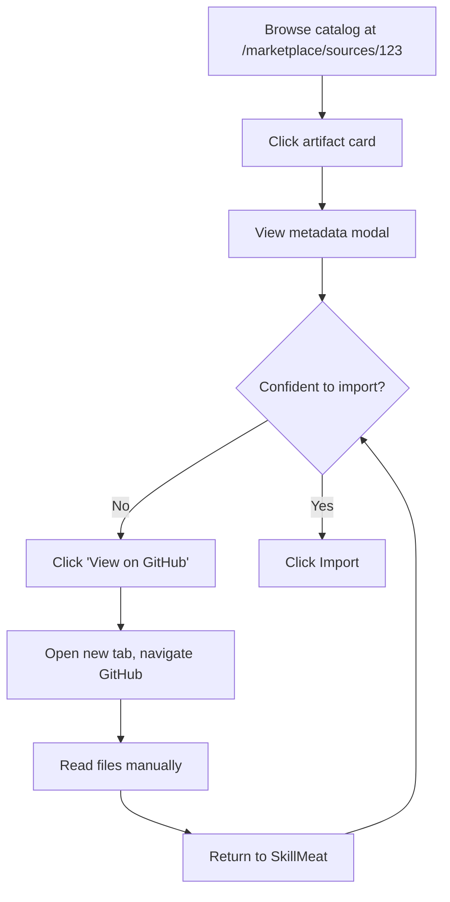
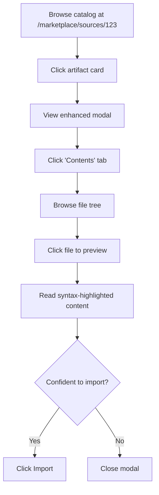

# PRD: Catalog Entry Modal Enhancement with File Contents Preview

**Feature Name:** Catalog Entry Modal Enhancement
**Filepath Name:** `catalog-entry-modal-enhancement-v1`
**Date:** 2025-12-28
**Author:** Claude (Opus 4.5)
**Version:** 1.0
**Status:** Draft

---

## 1. Executive Summary

Enhance the catalog entry modal (used when viewing detected artifacts at `/marketplace/sources/{ID}`) to display file contents and structure before import. Currently, users can only see metadata and confidence scores—they must visit GitHub or import blindly to see actual artifact contents. This creates friction in the evaluation workflow and reduces confidence in import decisions.

**Priority:** HIGH

**Key Outcomes:**
- Users can preview artifact file structure and contents without leaving SkillMeat
- Import conversion rate increases due to informed decision-making
- GitHub API rate limits are managed through intelligent caching strategies
- Consistent UI/UX patterns between catalog (pre-import) and imported artifact modals

---

## 2. Context & Background

### Current State

**Catalog Entry Modal** (`CatalogEntryModal.tsx`, 275 lines):
- Displays type and status badges
- Shows confidence score breakdown with heuristic scoring details
- Presents basic metadata: path, upstream URL, version, SHA, detected timestamp
- Provides "View on GitHub" and "Import" action buttons
- **Cannot** show file contents or structure

**Unified Entity Modal** (`unified-entity-modal.tsx`, 1,840 lines):
- Rich modal for imported artifacts with 6 tabs:
  - **Overview**: Metadata, tags, timestamps, version, source
  - **Contents**: File tree + editor with CRUD operations
  - **Sync Status**: Deployment comparison, diff viewer
  - **History**: Operation timeline (deploy/sync/rollback)
  - **Collections**: Artifact location management
  - **Deployments**: Where artifact is deployed
- Full-featured file operations (create, edit, delete)
- Real-time sync status tracking

### Problem Space

**User Pain Points:**
1. **Blind Imports**: Users cannot inspect artifact quality before importing
2. **Context Switching**: Must open GitHub in new tab, losing application context
3. **Rate Limit Concerns**: Direct GitHub visits don't benefit from caching
4. **Decision Friction**: Lack of preview reduces user confidence in import actions

**Technical Gaps:**
1. No file tree API endpoint for catalog entries (GitHub sources)
2. No file content fetching with caching layer
3. Separate modal components with duplicated patterns
4. Missing rate limit handling strategy for GitHub API calls

### Current Alternatives / Workarounds

**What Users Do Today:**
1. Click "View on GitHub" → opens new browser tab
2. Navigate GitHub repo manually to find artifact files
3. Read file contents on github.com
4. Return to SkillMeat and decide to import
5. **Problem**: Loses application context, no caching, high friction

**Why This Is Inadequate:**
- Breaks user flow with external navigation
- No benefit from backend caching (each visit hits GitHub directly)
- Mobile users experience worse UX with tab switching
- No unified experience between catalog and imported artifacts

### Architectural Context

**SkillMeat Layered Architecture:**
- **Routers** (`skillmeat/api/routers/`) - HTTP layer, validation, DTOs
- **Managers** (`skillmeat/core/`) - Business logic, file operations
- **Storage** - File-based (TOML manifests, artifact files)
- **GitHub Integration** - Source scanning, upstream tracking
- **Frontend** (Next.js 15) - React 19, TanStack Query, Radix UI

**Relevant Components:**
- `marketplace_sources.py` router - catalog endpoints
- `GitHubClient` - GitHub API wrapper
- `CatalogEntryModal.tsx` - current simple modal
- `unified-entity-modal.tsx` - rich imported artifact modal
- `FileTree.tsx`, `ContentPane.tsx` - reusable file browser components

---

## 3. Problem Statement

**User Story:**
> "As a marketplace user, when I click on a detected artifact in the catalog, I want to browse its file structure and read file contents so that I can make an informed decision about importing it, instead of blindly importing or context-switching to GitHub."

**Technical Root Cause:**
- Catalog entry modal is intentionally simple (metadata-only)
- No backend endpoints exist for fetching file trees from GitHub sources
- No caching strategy for GitHub file contents
- Component architecture doesn't share file browsing logic between pre-import and post-import states

**Files Involved:**
- `/skillmeat/web/components/CatalogEntryModal.tsx` (current simple modal)
- `/skillmeat/web/components/entity/unified-entity-modal.tsx` (reference for rich modal)
- `/skillmeat/api/routers/marketplace_sources.py` (needs new endpoints)
- `/skillmeat/core/marketplace/github_client.py` (needs file fetching)

---

## 4. Goals & Success Metrics

### Primary Goals

**Goal 1: Enable File Content Preview**
- Users can view file tree structure for catalog artifacts
- Users can read individual file contents (syntax-highlighted)
- Preview is read-only (no editing until imported)

**Goal 2: Optimize GitHub API Usage**
- Cache file trees for 5 minutes (stale-time in TanStack Query)
- Cache file contents for 30 minutes per file
- Handle rate limit errors gracefully with user feedback
- Reduce GitHub API calls by 80% through aggressive caching

**Goal 3: Consistent UX Patterns**
- Reuse file browsing components (`FileTree`, `ContentPane`)
- Similar tab layout between catalog and imported modals
- Maintain design system consistency (Radix UI, Tailwind)

### Success Metrics

| Metric | Baseline | Target | Measurement Method |
|--------|----------|--------|-------------------|
| Import conversion rate | Unknown | +15% | Track imports / catalog views |
| GitHub API calls per preview | 10-20 | <3 | Monitor backend metrics |
| File content load time | N/A | <2s (cached) | Frontend timing API |
| Rate limit errors | N/A | <1% of requests | Error logging |
| User satisfaction | N/A | 4/5 on preview feature | User surveys |

---

## 5. User Personas & Journeys

### Personas

**Primary Persona: Developer Evaluating New Skills**
- Role: Full-stack developer managing Claude artifacts
- Needs: Quick quality assessment before importing
- Pain Points: Blind imports lead to low-quality artifacts in collection
- Success Criteria: Can read SKILL.md and main files before deciding

**Secondary Persona: Team Lead Curating Marketplace Sources**
- Role: Engineering team lead managing shared artifact sources
- Needs: Confidence in artifact quality and security
- Pain Points: Must manually review GitHub repos before allowing team imports
- Success Criteria: Can preview all files without leaving SkillMeat

### High-level Flow

**Before (Current State):**


**After (Enhanced):**


---

## 6. Requirements

### 6.1 Functional Requirements

| ID | Requirement | Priority | Notes |
| :-: | ----------- | :------: | ----- |
| FR-1 | Display file tree structure for catalog artifacts | Must | Reuse `FileTree.tsx` component |
| FR-2 | Show file contents with syntax highlighting | Must | Reuse `ContentPane.tsx` component |
| FR-3 | Read-only mode (no file editing/creation/deletion) | Must | Disable edit controls in pre-import state |
| FR-4 | Cache file trees for 5 minutes | Must | TanStack Query `staleTime: 5 * 60 * 1000` |
| FR-5 | Cache individual file contents for 30 minutes | Must | Reduce GitHub API hits |
| FR-6 | Handle GitHub rate limit errors gracefully | Must | Show retry countdown, error message |
| FR-7 | Support both authenticated and unauthenticated GitHub access | Should | PAT increases rate limit 60→5000/hr |
| FR-8 | Display loading skeletons during file fetch | Should | Better perceived performance |
| FR-9 | Maintain Overview tab with existing metadata | Must | Don't lose current functionality |
| FR-10 | Add Contents tab to catalog modal | Must | Consistent with unified modal UX |

### 6.2 Non-Functional Requirements

**Performance:**
- File tree fetch: <3s for typical artifact (5-10 files)
- File content fetch: <1s per file (cached), <3s (uncached)
- Modal open time: <500ms (metadata from cache)
- Support artifacts up to 50 files without performance degradation

**Security:**
- PAT (Personal Access Token) stored encrypted at rest
- Validate all file paths to prevent directory traversal
- Sanitize file contents before display (prevent XSS)
- Rate limit backend endpoints (100 req/min per source)

**Accessibility:**
- Keyboard navigation for file tree (arrow keys, Enter)
- Screen reader support for file tree and content pane
- Focus management when switching tabs
- ARIA labels for all interactive elements

**Reliability:**
- Graceful degradation if GitHub API unavailable
- Retry failed requests with exponential backoff (2s, 4s, 8s)
- Show cached data during revalidation
- Offline indicator when rate limited

**Observability:**
- Log GitHub API call counts per source
- Track cache hit/miss rates
- Monitor rate limit header values
- Alert when approaching rate limits (90% threshold)

---

## 7. Scope

### In Scope

**Frontend:**
- New `catalog-entity-modal.tsx` component (or refactor `CatalogEntryModal.tsx`)
- Integrate Overview tab (existing metadata)
- Add Contents tab with file tree and content viewer
- Reuse `FileTree.tsx` and `ContentPane.tsx` components (read-only mode)
- TanStack Query caching configuration for file data
- Error states for rate limits and fetch failures

**Backend:**
- New endpoint: `GET /marketplace/sources/{source_id}/artifacts/{artifact_path}/files`
- New endpoint: `GET /marketplace/sources/{source_id}/artifacts/{artifact_path}/files/{file_path}`
- File tree fetching from GitHub API (via GitHubClient)
- File content fetching with caching layer
- Rate limit detection and error responses
- Backend cache (in-memory or Redis) for file trees (1 hour TTL)

**Testing:**
- Unit tests for file tree/content API endpoints
- Integration tests for GitHub API error handling
- E2E tests for modal tab navigation and file selection
- Performance tests for caching effectiveness

### Out of Scope (Future Phases)

**Not in This Phase:**
- File editing before import (requires workspace concept)
- Bulk preview of multiple artifacts
- Diff view between catalog and imported versions
- Offline mode with full content persistence
- GitHub App authentication (stick with PAT for now)
- Advanced code search within file contents
- Git history/blame integration
- Image/binary file previews (show placeholder/download link)

---

## 8. Dependencies & Assumptions

### External Dependencies

- **GitHub API v3**: REST API for file tree and content fetching
  - Rate limits: 60/hour (unauthenticated), 5000/hour (authenticated)
  - Tree API: `/repos/{owner}/{repo}/git/trees/{sha}?recursive=1`
  - Contents API: `/repos/{owner}/{repo}/contents/{path}?ref={sha}`
- **TanStack Query v5**: Frontend caching and data fetching
- **Monaco Editor** (or similar): Syntax highlighting for file contents (already used in `ContentPane`)

### Internal Dependencies

- **GitHubClient** (`skillmeat/core/marketplace/github_client.py`): Must support file tree and content fetching
- **marketplace_sources router**: Needs new endpoints for file access
- **FileTree component**: Must support read-only mode
- **ContentPane component**: Must support read-only mode

### Assumptions

- Catalog artifacts have valid GitHub upstream URLs
- Source metadata includes repo owner, name, and ref (SHA/branch/tag)
- Users understand preview is read-only (copy-paste still works)
- Rate limit handling is acceptable UX (not blocking for core feature)
- File contents are text-based (binary files show download link only)

### Feature Flags

- `ENABLE_CATALOG_FILE_PREVIEW`: Master toggle for file preview feature
- `ENABLE_GITHUB_RATE_LIMIT_ALERTS`: Show UI alerts when approaching limits
- `CATALOG_FILE_CACHE_TTL`: Configurable cache duration (default 5min trees, 30min contents)

---

## 9. Risks & Mitigations

| Risk | Impact | Likelihood | Mitigation |
| ----- | :----: | :--------: | ---------- |
| GitHub rate limits hit frequently | High | Medium | Aggressive caching (5min/30min TTL), encourage PAT usage, queue requests |
| Large artifacts (>100 files) slow to load | Medium | Low | Lazy-load file tree, paginate if needed, show file count warning |
| GitHub API downtime blocks preview | Medium | Low | Graceful degradation, show cached data, "View on GitHub" fallback |
| Security: XSS via malicious file contents | High | Low | Sanitize all content, use trusted syntax highlighter, CSP headers |
| Users confused by read-only mode | Low | Medium | Clear UI indicators ("Preview only - import to edit"), tooltips |
| Backend cache memory bloat | Medium | Medium | Implement LRU eviction, set max cache size (1000 entries), monitor memory |

---

## 10. Target State (Post-Implementation)

### User Experience

**When user opens a catalog entry modal:**
1. **Overview tab** (default): Shows existing metadata, confidence scores, badges
2. **Contents tab**: Click to see file tree on left, content pane on right
3. **File tree**: Expandable folders, file icons by type, click to select
4. **Content pane**: Syntax-highlighted file contents, read-only mode indicator
5. **Loading states**: Skeleton loaders for tree (3s) and content (1s)
6. **Error states**: Rate limit warning with retry countdown, GitHub unavailable message
7. **Import CTA**: Prominent "Import" button in footer (enabled unless status=imported/removed)

**Visual Consistency:**
- Same tab layout as unified-entity-modal (but fewer tabs)
- Identical file tree UI to imported artifacts
- Consistent content pane styling (Monaco editor)
- Design system compliance (Radix UI, Tailwind, shadcn)

### Technical Architecture

**Frontend (Next.js/React):**
```
CatalogEntityModal (or enhanced CatalogEntryModal)
├── DialogHeader (artifact name, type, status badges)
├── Tabs (Overview, Contents)
│   ├── Overview Tab
│   │   ├── Confidence Score Breakdown (existing)
│   │   ├── Metadata Grid (existing)
│   │   └── Action Buttons (View GitHub, Import)
│   └── Contents Tab
│       ├── FileTree (read-only mode)
│       └── ContentPane (read-only mode)
└── DialogFooter (Import CTA)
```

**Backend (FastAPI):**
```python
# New endpoints in marketplace_sources.py router

GET /marketplace/sources/{source_id}/artifacts/{artifact_path}/files
  → Returns: { files: [{ path, type, size }], total_count }
  → Caching: 5 minutes (stale-time), 1 hour backend cache

GET /marketplace/sources/{source_id}/artifacts/{artifact_path}/files/{file_path}
  → Returns: { content, encoding, size, sha }
  → Caching: 30 minutes (stale-time), 2 hours backend cache
```

**Caching Strategy:**
```
TanStack Query (Frontend):
  - File tree: staleTime=5min, cacheTime=30min
  - File content: staleTime=30min, cacheTime=2hr

Backend Cache (Redis or in-memory LRU):
  - File tree: TTL=1hr, key=f"tree:{source_id}:{artifact_path}:{sha}"
  - File content: TTL=2hr, key=f"content:{source_id}:{artifact_path}:{file_path}:{sha}"

Invalidation:
  - Source rescan → clear all tree/content cache for source_id
  - Artifact import → no invalidation (catalog and imported are independent)
```

**Data Flow:**
1. User clicks "Contents" tab
2. Frontend queries `/marketplace/sources/{id}/artifacts/{path}/files`
3. Backend checks cache → if miss, fetch from GitHub API
4. Backend caches result + returns to frontend
5. TanStack Query caches response for 5 minutes
6. User clicks file in tree
7. Frontend queries `/marketplace/sources/{id}/artifacts/{path}/files/{file_path}`
8. Backend checks cache → if miss, fetch from GitHub API
9. Backend caches result + returns to frontend
10. TanStack Query caches response for 30 minutes
11. Frontend displays syntax-highlighted content

### Observable Outcomes

**Metrics Changes:**
- Import conversion rate: +15% (baseline TBD)
- GitHub API calls: -80% (through caching)
- Average time to import decision: -40% (faster evaluation)
- User satisfaction with marketplace: +1 point (4/5 → 5/5 scale)

**Enabled Behaviors:**
- Users confidently import based on file contents, not just metadata
- Team leads can audit artifact security without leaving SkillMeat
- Power users can quickly scan SKILL.md files across multiple sources
- Mobile users get full preview experience without tab switching

**Problems Solved:**
- ✅ Blind import decisions → informed choices
- ✅ Context switching to GitHub → seamless in-app preview
- ✅ High GitHub API usage → intelligent caching
- ✅ Inconsistent modal UX → unified component patterns

---

## 11. Overall Acceptance Criteria (Definition of Done)

### Functional Acceptance

- [ ] **FR-1**: File tree displays all artifact files with correct hierarchy
- [ ] **FR-2**: File contents render with syntax highlighting for common languages (Python, JS, Markdown, YAML, TOML)
- [ ] **FR-3**: Edit, create, delete buttons are hidden/disabled in catalog modal
- [ ] **FR-4**: File tree data cached for 5 minutes in TanStack Query
- [ ] **FR-5**: File content cached for 30 minutes per file
- [ ] **FR-6**: Rate limit errors show user-friendly message with retry button
- [ ] **FR-7**: PAT authentication increases rate limit from 60 to 5000/hour
- [ ] **FR-8**: Loading skeletons appear during file tree/content fetch
- [ ] **FR-9**: Overview tab maintains all existing metadata fields
- [ ] **FR-10**: Contents tab added to catalog modal with same layout as unified modal

### Technical Acceptance

- [ ] Follows SkillMeat layered architecture (Router → Manager → GitHubClient)
- [ ] All API responses are DTOs (Pydantic models), no ORM leakage
- [ ] Error responses use `ErrorResponse` envelope
- [ ] Backend cache implements LRU eviction with max 1000 entries
- [ ] Frontend uses TanStack Query for all data fetching
- [ ] Components reuse `FileTree.tsx` and `ContentPane.tsx` with prop-based read-only mode

### Quality Acceptance

- [ ] Unit tests for file tree/content endpoints (>80% coverage)
- [ ] Integration tests for GitHub API error scenarios (rate limit, 404, timeout)
- [ ] E2E test: Open catalog entry → click Contents tab → select file → view content
- [ ] Performance test: 100 concurrent file requests stay under 3s average latency
- [ ] Accessibility audit: WCAG 2.1 AA compliance for keyboard navigation and screen readers
- [ ] Security review: XSS prevention, path traversal validation

### Documentation Acceptance

- [ ] API documentation for new endpoints in OpenAPI spec
- [ ] Component documentation for `CatalogEntityModal` (props, usage)
- [ ] User guide: "Previewing Catalog Artifacts" section
- [ ] ADR: "Caching Strategy for GitHub File Contents"
- [ ] Update `.claude/rules/web/hooks.md` with file preview query patterns

---

## 12. Assumptions & Open Questions

### Assumptions

- Most artifacts have <50 files (file tree loads quickly)
- Users have basic understanding of file systems (tree navigation)
- GitHub API v3 remains stable (no breaking changes)
- Text files are UTF-8 encoded (no exotic encodings)
- Modal can be wider (max-w-6xl) without UX issues

### Open Questions

- [ ] **Q1**: Should binary files (images, PDFs) show inline previews or just download links?
  - **A**: Phase 1: Show placeholder icon + download link. Phase 2: Inline image preview for PNG/JPG.

- [ ] **Q2**: Should file tree support search/filter by filename?
  - **A**: Not in Phase 1 (YAGNI). Revisit if artifacts commonly have >50 files.

- [ ] **Q3**: How to handle very large files (>1MB)?
  - **A**: Backend truncates to first 10,000 lines with "View full file on GitHub" link.

- [ ] **Q4**: Should Contents tab auto-select a default file (e.g., SKILL.md)?
  - **A**: Yes, auto-select first `.md` file or fallback to first file alphabetically.

- [ ] **Q5**: Rate limit alert threshold—90%, 95%, or user-configurable?
  - **A**: 90% threshold. If hit frequently, suggest upgrading to PAT in alert message.

---

## 13. Appendices & References

### Related Documentation

- **PRD**: [marketplace-github-ingestion-v1.md](./marketplace-github-ingestion-v1.md) - Background on catalog scanning
- **Components**:
  - `/skillmeat/web/components/CatalogEntryModal.tsx` - Current modal (275 lines)
  - `/skillmeat/web/components/entity/unified-entity-modal.tsx` - Reference modal (1,840 lines)
  - `/skillmeat/web/components/entity/file-tree.tsx` - File browser component
  - `/skillmeat/web/components/entity/content-pane.tsx` - File content viewer
- **API Rules**:
  - `.claude/rules/api/routers.md` - Router layer patterns
  - `.claude/rules/web/api-client.md` - Frontend API client patterns
  - `.claude/rules/web/hooks.md` - TanStack Query conventions

### Symbol References

**Backend API Symbols** (`ai/symbols-backend.json`):
- `marketplace_sources.router` - Add file tree/content endpoints here
- `GitHubClient.get_tree()` - Fetch file tree from GitHub
- `GitHubClient.get_contents()` - Fetch file content from GitHub

**Frontend UI Symbols** (`ai/symbols-frontend.json`):
- `CatalogEntryModal` - Component to enhance
- `FileTree` - Reusable file browser
- `ContentPane` - Reusable content viewer
- `useQuery` - TanStack Query hook for data fetching

### Prior Art

**Similar Implementations:**
- GitHub web UI file browser (reference for UX)
- VS Code web editor (reference for file tree + editor layout)
- GitLab inline file viewer (reference for syntax highlighting)

**Internal References:**
- Unified-entity-modal Contents tab (template for layout)
- Entity lifecycle management (reference for modal patterns)

---

## 14. Implementation

### Phased Approach

**Phase 1: Backend File Fetching** (2-3 days)
- Duration: 3 days
- Tasks:
  - [ ] **TASK-1.1**: Add `get_file_tree()` method to `GitHubClient`
  - [ ] **TASK-1.2**: Add `get_file_content()` method to `GitHubClient`
  - [ ] **TASK-1.3**: Create `GET /marketplace/sources/{id}/artifacts/{path}/files` endpoint
  - [ ] **TASK-1.4**: Create `GET /marketplace/sources/{id}/artifacts/{path}/files/{file_path}` endpoint
  - [ ] **TASK-1.5**: Implement backend caching layer (LRU, 1hr TTL for trees, 2hr for contents)
  - [ ] **TASK-1.6**: Add rate limit detection and error handling
  - [ ] **TASK-1.7**: Unit tests for file endpoints (happy path, errors, caching)
  - [ ] **TASK-1.8**: Update OpenAPI spec with new endpoints

**Phase 2: Frontend Modal Enhancement** (3-4 days)
- Duration: 4 days
- Tasks:
  - [ ] **TASK-2.1**: Add read-only mode props to `FileTree.tsx` component
  - [ ] **TASK-2.2**: Add read-only mode props to `ContentPane.tsx` component
  - [ ] **TASK-2.3**: Refactor `CatalogEntryModal.tsx` to support tabs (or create new `CatalogEntityModal.tsx`)
  - [ ] **TASK-2.4**: Add Overview tab with existing metadata (migrate from current implementation)
  - [ ] **TASK-2.5**: Add Contents tab with `FileTree` + `ContentPane` integration
  - [ ] **TASK-2.6**: Create TanStack Query hooks for file tree and content fetching
  - [ ] **TASK-2.7**: Implement loading skeletons for file tree and content pane
  - [ ] **TASK-2.8**: Add error states for rate limits and fetch failures
  - [ ] **TASK-2.9**: Configure caching (staleTime: 5min/30min, cacheTime: 30min/2hr)
  - [ ] **TASK-2.10**: Style tab layout to match unified-entity-modal design

**Phase 3: Polish & Testing** (2-3 days)
- Duration: 3 days
- Tasks:
  - [ ] **TASK-3.1**: Add auto-selection of default file (SKILL.md or first .md)
  - [ ] **TASK-3.2**: Implement file size truncation for large files (>1MB)
  - [ ] **TASK-3.3**: Add "View on GitHub" link for full file if truncated
  - [ ] **TASK-3.4**: Integration tests for GitHub API error scenarios
  - [ ] **TASK-3.5**: E2E test: Browse catalog → open entry → view file contents
  - [ ] **TASK-3.6**: Accessibility audit: keyboard nav, screen reader, focus management
  - [ ] **TASK-3.7**: Performance test: cache hit rates, load times, concurrent requests
  - [ ] **TASK-3.8**: Security review: XSS prevention, path traversal validation
  - [ ] **TASK-3.9**: Update user documentation with preview feature guide
  - [ ] **TASK-3.10**: Create ADR for caching strategy

### Epics & User Stories Backlog

| Story ID | Short Name | Description | Acceptance Criteria | Estimate |
|----------|-----------|-------------|-------------------|----------|
| **EPIC-1** | **Backend File API** | GitHub file tree and content fetching with caching | All FR-1 to FR-6 backend tasks complete | 3d |
| STORY-1.1 | GitHub File Tree Fetching | Add `get_file_tree()` to GitHubClient | Returns file list with paths, types, sizes | 0.5d |
| STORY-1.2 | GitHub File Content Fetching | Add `get_file_content()` to GitHubClient | Returns file content with encoding info | 0.5d |
| STORY-1.3 | File Tree Endpoint | `GET /sources/{id}/artifacts/{path}/files` | Returns cached file tree, handles errors | 1d |
| STORY-1.4 | File Content Endpoint | `GET /sources/{id}/artifacts/{path}/files/{file}` | Returns cached content, handles errors | 1d |
| **EPIC-2** | **Frontend Modal Enhancement** | Add Contents tab with file browser to catalog modal | All FR-7 to FR-10 frontend tasks complete | 4d |
| STORY-2.1 | Read-Only File Components | Update FileTree and ContentPane for read-only mode | Edit buttons hidden, props control behavior | 1d |
| STORY-2.2 | Tab Layout Refactor | Add Tabs UI to CatalogEntryModal | Overview + Contents tabs with proper styling | 1d |
| STORY-2.3 | File Preview Integration | Wire up FileTree + ContentPane in Contents tab | File selection updates content pane | 1d |
| STORY-2.4 | Caching & Loading States | TanStack Query hooks with skeletons | 5min/30min cache, loading skeletons | 1d |
| **EPIC-3** | **Polish & Quality** | Testing, documentation, performance tuning | All quality criteria met | 3d |
| STORY-3.1 | Error Handling & UX Polish | Rate limit alerts, truncation, auto-select | User-friendly errors, smooth UX | 1d |
| STORY-3.2 | Testing Suite | Unit, integration, E2E, accessibility tests | >80% coverage, all tests pass | 1.5d |
| STORY-3.3 | Documentation & Security | Docs, ADR, security audit | All docs updated, no security issues | 0.5d |

**Total Estimate**: 10 days (2 weeks with buffer)

---

**Progress Tracking:**

See progress tracking: `.claude/progress/catalog-entry-modal-enhancement-v1/all-phases-progress.md`

---

**Implementation Notes:**

1. **Component Reuse Strategy**: Maximize reuse of `FileTree.tsx` and `ContentPane.tsx` by adding `readOnly` prop instead of duplicating components.

2. **Caching Trade-offs**:
   - Shorter cache TTL (5min/30min) balances freshness vs API usage
   - Backend cache (1hr/2hr) provides additional layer for frequently accessed artifacts
   - Consider increasing TTL if rate limit issues persist

3. **UX Decision**: Auto-select first `.md` file (or fallback to first alphabetically) to reduce clicks for common case (reading SKILL.md).

4. **Future Expansion**: Phase 2+ could add diff view (catalog vs imported), bulk preview, or offline persistence if user demand exists.

5. **Delegation Pattern**:
   - **Backend**: Delegate to `python-backend-engineer` for API endpoints and caching
   - **Frontend**: Delegate to `ui-engineer-enhanced` for modal components and TanStack Query
   - **Testing**: Delegate to `python-backend-engineer` (API tests) and `ui-engineer` (E2E tests)
