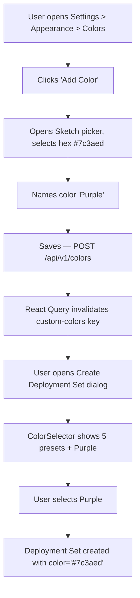
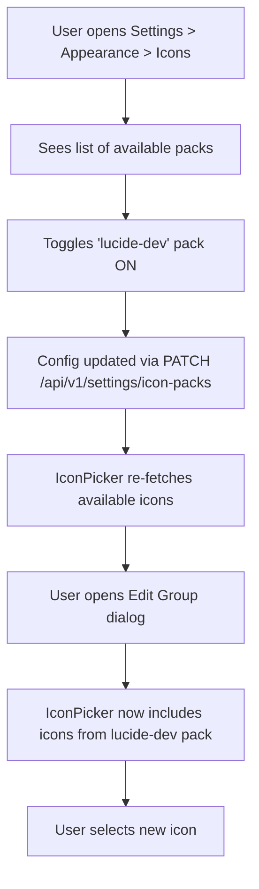
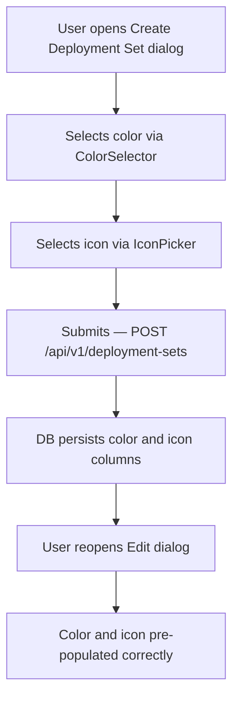

# Feature Brief & Metadata

**Feature Name:**

> Site-Wide Color & Icon Management System

**Filepath Name:**

> `color-icon-management-v1`

**Date:**

> 2026-02-25

**Author:**

> Claude (Sonnet 4.6) — PRD Writer

**Related Epic(s)/PRD ID(s):**

> Deployment Sets PRD: `docs/project_plans/PRDs/features/deployment-sets-v1.md`

**Related Documents:**

> - `skillmeat/web/app/groups/components/group-metadata-editor.tsx` — Existing color and icon selectors (source of truth for current behavior)
> - `skillmeat/web/lib/group-constants.ts` — Color tokens, icon definitions, helper functions
> - `skillmeat/web/components/deployment-sets/create-deployment-set-dialog.tsx` — Dialog to refactor
> - `skillmeat/web/components/deployment-sets/edit-deployment-set-dialog.tsx` — Dialog to refactor
> - `skillmeat/web/app/settings/page.tsx` — Settings page to extend with new tabs
> - `skillmeat/cache/models.py` — ORM models (Group color/icon at line 852, DeploymentSet at line 3232)
> - `skillmeat/api/routers/deployment_sets.py` — Router with color/icon currently commented out
> - shadcn-iconpicker: https://github.com/alan-crts/shadcn-iconpicker

---

## 1. Executive Summary

The Site-Wide Color & Icon Management System unifies color and icon selection across all entities (Groups, Deployment Sets) into shared, reusable components backed by a persistent API. Custom colors move from per-browser localStorage to a server-side store so they are consistent across devices and immediately reflected in every color picker. Icon selection replaces the current locked six-icon `Select` dropdown with a configurable, pack-based icon picker from the `shadcn-iconpicker` library. A new "Appearance" tab on the Settings page provides a central place to create, rename, and delete custom colors and to enable/disable icon packs without code changes.

**Priority:** MEDIUM

**Key Outcomes:**
- One `ColorSelector` component and one `IconPicker` component used by both Groups and Deployment Sets.
- Custom colors are API-backed, device-independent, and propagate to all open instances in real time via React Query invalidation.
- Icon packs are declared in a static config file; enabling a pack makes its icons available everywhere without a deploy.
- Deployment Set dialogs reach visual and functional parity with Group dialogs for color/icon fields.

---

## 2. Context & Background

### Current state

**Color selection (Groups only):**
- `GroupMetadataEditor` renders five preset color swatches (`slate`, `blue`, `green`, `amber`, `rose`) defined in `skillmeat/web/lib/group-constants.ts`.
- A "custom color" affordance uses the `@uiw/react-color-sketch` Sketch picker.
- Custom colors persist to `localStorage` under the key `skillmeat-group-custom-colors-v1` (max 20 entries), scoped to a single browser.
- Helper functions (`resolveColorHex`, `getClosestColorToken`, `isColorToken`, `isPresetHex`, `normalizeHex`, `dedupeHexColors`) live in `group-constants.ts`.

**Icon selection (Groups only):**
- `GroupMetadataEditor` renders a shadcn `Select` dropdown containing six hard-coded Lucide icons: `layers`, `folder`, `tag`, `sparkles`, `book`, `wrench`.
- Icons are defined in `ICON_OPTIONS` in `group-constants.ts` as `GroupIcon` (string union).
- No mechanism exists to add icons without changing code.

**Deployment Set dialogs:**
- `CreateDeploymentSetDialog` and `EditDeploymentSetDialog` accept `color` and `icon` as free-text `string | null` fields.
- The create dialog imports `COLOR_OPTIONS` from `group-constants.ts` and renders five preset color swatches only (no custom color support).
- The icon field is a freeform `<Input>` labeled "Icon (emoji or identifier)".
- Color and icon are declared in the schema (`DeploymentSetCreate.color`, `DeploymentSetUpdate.color`, `DeploymentSetResponse.color`) but are commented out in the router and not persisted to the DB.

**Settings page:**
- Four tabs: General, Integrations, Context, Platforms.
- No color or icon management surface exists.

### Problem space

The fragmented approach creates several user-facing inconsistencies:

1. Deployment Sets look visually and functionally different from Groups despite modeling the same metadata concept (`color`, `icon`).
2. Custom colors made in one browser session are lost when switching to another device.
3. Adding a new icon requires a code change.
4. There is no single place to manage the application's color palette.

### Architectural context

SkillMeat uses a layered web architecture: **Routers → Services → Repositories → DB**. The DB cache is the web's source of truth; the filesystem is the CLI's source of truth. Write-through with React Query cache invalidation is the mutation pattern. Frontend hooks use a query key factory pattern. All shared UI uses shadcn/ui primitives and Radix headless components.

---

## 3. Problem Statement

> "As a developer using SkillMeat, my custom colors disappear on a different browser, Deployment Set color/icon fields are primitive compared to Groups, and adding a new icon anywhere requires a code change."

**Technical root causes:**
- Custom colors stored in `localStorage` are browser-local and not shared across the API.
- Deployment Set dialogs were built independently of `GroupMetadataEditor` and did not adopt the shared component.
- Icon vocabulary is a hard-coded string union with no extensibility mechanism.
- No API resource or DB table exists for user-defined color entries.
- Color and icon fields exist in `DeploymentSetCreate`/`Update`/`Response` schemas but are not wired through the router or persisted to the DB.

---

## 4. Goals & success metrics

### Primary goals

**Goal 1: Shared color selector component**
- Extract the color selector logic from `GroupMetadataEditor` into a standalone `ColorSelector` component.
- Custom colors are backed by a new `custom_colors` API resource (DB table) rather than localStorage.
- Custom colors created anywhere (Groups dialog, Deployment Set dialog, Settings tab) appear everywhere without a reload.

**Goal 2: Shared icon picker component**
- Replace the `Select`-based icon picker in `GroupMetadataEditor` with a new `IconPicker` component built on `shadcn-iconpicker`.
- Available icon packs are declared in `icon-packs.config.json`; the frontend reads this config at build time (or via a lightweight API endpoint) to know which icons to offer.
- Both Groups and Deployment Set dialogs use the same `IconPicker` component.

**Goal 3: Settings — Colors tab**
- New "Colors" tab in Settings → Appearance section shows all custom colors with create, rename, and delete actions.
- Changes immediately reflect in all `ColorSelector` instances via React Query cache invalidation on the `custom-colors` query key.

**Goal 4: Settings — Icons tab**
- New "Icons" tab in Settings → Appearance section shows all configured icon packs with enable/disable toggles.
- Pack configuration is written back to `icon-packs.config.json` (or a settings API endpoint) so the state persists across restarts.

**Goal 5: Deployment Set dialog parity**
- `CreateDeploymentSetDialog` and `EditDeploymentSetDialog` replace their bespoke color/icon inputs with `ColorSelector` and `IconPicker`.
- Color and icon are wired through the router and persisted to the DB (the currently commented-out path is uncommented and completed).

### Success metrics

| Metric | Baseline | Target | Measurement method |
|--------|----------|--------|-------------------|
| Custom color visible in all dialogs after creation | Not possible (localStorage only) | Within one React Query refetch cycle (<500 ms) | Manual test + Playwright E2E |
| Deployment Set color/icon persisted to DB | 0% (commented out) | 100% (all create/update mutations) | API integration test |
| Icon picker component reuse (Groups vs Sets) | 0% (separate implementations) | 100% (single shared component) | Code review / import graph |
| `pnpm type-check` passing after migration | Baseline passing | Still passing (no regressions) | CI |
| New icon pack enabled without code change | Not possible | Possible via config file edit | Manual test |

---

## 5. User personas & journeys

### Personas

**Primary: Developer (Power User)**
- Role: Individual developer with a large SkillMeat collection organized into Groups and Deployment Sets.
- Needs: Consistent visual identity across groups and sets; custom colors that persist.
- Pain points: Custom colors lost on device switch; icon selector too limited for expressive organization.

**Secondary: Developer (Light User)**
- Role: Uses default colors; occasionally picks an icon to distinguish groups visually.
- Needs: A simple, coherent UI; does not need to manage color palettes.
- Pain points: Deployment Set icon field is a confusing free-text box.

### User journeys

**Journey A: Create a custom color and use it in a Deployment Set**



**Journey B: Enable a new icon pack and use it**



**Journey C: Deployment Set color/icon round-trip (parity with Groups)**



---

## 6. Requirements

### 6.1 Functional requirements

| ID | Requirement | Priority | Notes |
|:--:|-------------|:--------:|-------|
| FR-1 | Extract `ColorSelector` as a standalone shared component that accepts `value: string`, `onChange: (color: string) => void`, `customColors: string[]`, `onCustomColorAdd: (hex: string) => void`, `onCustomColorRemove: (hex: string) => void`, and `disabled?: boolean` | Must | Lives in `skillmeat/web/components/shared/color-selector.tsx` |
| FR-2 | `ColorSelector` renders five preset color swatches and all API-backed custom colors, with a "+" affordance to open the Sketch picker and add a new custom color | Must | Replaces inline color picker logic in `GroupMetadataEditor` |
| FR-3 | Custom colors are backed by a new `custom_colors` DB table and `/api/v1/colors` REST resource (CRUD) | Must | Replaces localStorage persistence |
| FR-4 | When a custom color is created, edited, or deleted, all mounted `ColorSelector` instances reflect the change within one React Query refetch cycle | Must | Invalidate the `custom-colors` query key on every mutation |
| FR-5 | Extract `IconPicker` as a standalone shared component wrapping `shadcn-iconpicker`, accepting `value: string`, `onChange: (icon: string) => void`, and `disabled?: boolean` | Must | Lives in `skillmeat/web/components/shared/icon-picker.tsx` |
| FR-6 | `IconPicker` displays icons from all enabled packs declared in `icon-packs.config.json` | Must | Config is loaded via a lightweight `/api/v1/settings/icon-packs` GET endpoint |
| FR-7 | `GroupMetadataEditor` delegates to `ColorSelector` and `IconPicker` instead of inline implementations | Must | Behavior must be identical post-refactor; no regression in Groups UI |
| FR-8 | `CreateDeploymentSetDialog` and `EditDeploymentSetDialog` replace their bespoke color swatch grid and freeform icon input with `ColorSelector` and `IconPicker` | Must | |
| FR-9 | The Deployment Set router (`/api/v1/deployment-sets`) persists `color` and `icon` to the DB on create and update | Must | Uncomment and complete the currently commented-out color/icon path in the router |
| FR-10 | A new "Appearance" section (or tab) is added to the Settings page containing sub-tabs "Colors" and "Icons" | Must | Adds to the existing four tabs (General, Integrations, Context, Platforms) |
| FR-11 | The Settings > Colors tab allows creating, renaming, and deleting custom colors | Must | Deletion removes the color from all pickers immediately |
| FR-12 | The Settings > Icons tab lists all configured icon packs (from `icon-packs.config.json`) with enable/disable toggles | Must | |
| FR-13 | Disabling an icon pack via Settings > Icons removes those icons from the `IconPicker` component across the app without a page reload | Should | Via React Query invalidation on icon-packs key |
| FR-14 | On first launch after migration, any custom colors in `localStorage` (`skillmeat-group-custom-colors-v1`) are migrated to the API store with a one-time import prompt | Should | Prevents data loss for existing users |
| FR-15 | `ColorSelector` accepts an optional `label` prop for accessibility (`aria-label`) | Should | WCAG 2.1 AA |
| FR-16 | `icon-packs.config.json` declares icon packs with at minimum `id`, `label`, `enabled`, and `import` fields | Must | Serves as the single source of truth for available packs |

### 6.2 Non-functional requirements

**Performance:**
- `ColorSelector` renders in <50 ms; custom color list fetched on component mount with 5-minute stale time.
- `IconPicker` with a single pack of up to 500 icons opens and renders in <200 ms.
- `shadcn-iconpicker` bundle should be code-split (dynamic import) to avoid impacting the initial page load budget.

**Accessibility:**
- `ColorSelector` swatches use `role="radio"` / `aria-checked` with visible focus rings; color is not the only differentiator (label shown on hover/focus).
- `IconPicker` is keyboard-navigable; icons have accessible names from their label metadata.

**Security:**
- Custom color entries are scoped to the single user (V1 single-user mode). Hex values are validated server-side as 3- or 6-digit hex strings (`#[0-9a-fA-F]{3,6}`).
- Icon pack config is a read/write local file; no user-supplied arbitrary code paths.

**Observability:**
- Color CRUD operations emit structured log entries with `color_id`, `hex`, and `action`.
- Icon pack enable/disable emits a log entry with `pack_id` and `enabled`.

**Reliability:**
- If the `/api/v1/colors` endpoint is unavailable, `ColorSelector` falls back to showing only the five preset colors; custom colors are not displayed.
- If `icon-packs.config.json` cannot be read, `IconPicker` falls back to the six legacy Lucide icons.

---

## 7. Scope

### In scope (V1)

- New `custom_colors` DB table + Alembic migration + `CustomColorRepository`.
- `CustomColorService` with CRUD operations.
- `/api/v1/colors` REST router (list, create, update, delete).
- `/api/v1/settings/icon-packs` REST router (get, patch to enable/disable packs).
- `icon-packs.config.json` config file with at least the current six Lucide icons as the default "lucide-core" pack.
- `ColorSelector` shared component (extracted from `GroupMetadataEditor`).
- `IconPicker` shared component (wrapping `shadcn-iconpicker`).
- Refactor `GroupMetadataEditor` to use shared components (no behavior change).
- Update `CreateDeploymentSetDialog` and `EditDeploymentSetDialog` to use shared components.
- Wire color/icon through the Deployment Set router to the DB.
- Settings page "Appearance" section with Colors and Icons sub-tabs.
- React Query hooks: `useCustomColors`, `useCreateCustomColor`, `useUpdateCustomColor`, `useDeleteCustomColor`, `useIconPacks`, `usePatchIconPacks`.
- localStorage migration prompt (FR-14).

### Out of scope (V1 — future)

- **Per-artifact color/icon overrides**: Individual artifacts (not groups or sets) getting their own color/icon fields.
- **Dark-mode semantic tokens**: Mapping custom colors to CSS variables that adapt to light/dark mode.
- **Open-ended icon search**: Searching all Lucide or other icon libraries without a pack restriction.
- **Color theming of the app chrome**: Custom colors do not affect the application's primary/secondary design tokens.
- **Shared color palettes across users**: Multi-user color sharing (V1 is single-user).
- **CLI color/icon management**: `skillmeat` CLI commands for managing colors/icon packs (can be added later against the same API).
- **Color picker other than Sketch**: The existing `@uiw/react-color-sketch` is retained; a different picker library is not evaluated in V1.

---

## 8. Dependencies & assumptions

### External dependencies

- **`shadcn-iconpicker`** (`https://github.com/alan-crts/shadcn-iconpicker`): New dependency. Must be installable via `npm`/`pnpm`. Bundle impact must be assessed; dynamic import (code splitting) is required.
- **`@uiw/react-color-sketch`**: Already installed; retained for the custom hex input in `ColorSelector`.
- **SQLAlchemy + Alembic**: Already in use; new migration for `custom_colors` table.
- **FastAPI**: Already in use; new router at `/api/v1/colors` and `/api/v1/settings/icon-packs`.
- **React Query (`@tanstack/react-query`)**: Already in use; new query keys `custom-colors` and `icon-packs`.

### Internal dependencies

- **`GroupMetadataEditor`** (`skillmeat/web/app/groups/components/group-metadata-editor.tsx`): Source of the color/icon logic to be extracted. Must not change external behavior.
- **`group-constants.ts`** (`skillmeat/web/lib/group-constants.ts`): Color token types (`GroupColorToken`, `GroupColor`) and helper functions remain but are re-exported from a new shared module `skillmeat/web/lib/color-constants.ts` to avoid coupling shared components to group-specific naming.
- **Deployment Set router** (`skillmeat/api/routers/deployment_sets.py`): Color/icon fields in the `DeploymentSetCreate` and `DeploymentSetUpdate` schemas are already defined; the router code that persists them is commented out and must be completed.
- **`DeploymentSet` ORM model** (`skillmeat/cache/models.py` line 3232): `color` and `icon` columns are expected to exist; verify in migration or add if absent.
- **Settings page** (`skillmeat/web/app/settings/page.tsx`): Existing `Tabs` component is extended; new `TabsTrigger` and `TabsContent` entries are added.

### Assumptions

- `shadcn-iconpicker` is published to npm or can be installed from GitHub; if not, a lightweight local wrapper that loads icon packs from JSON files is an acceptable fallback.
- V1 targets single-user mode; custom colors are not scoped by user ID in the DB (all colors are global to the instance).
- `icon-packs.config.json` is a static file at the project root and is read by the backend at startup; hot-reloading of icon packs is not required (Settings UI triggers a React Query refetch, not a server restart).
- The `DeploymentSet` ORM model already has `color` and `icon` columns per the existing schema definitions; if the DB migration that created the table did not include them, a supplementary migration adds them.
- Existing `GroupMetadataEditor` tests (if any) remain green after the refactor — the component's interface and rendered output are unchanged.

### Feature flags

- `color_management_enabled` (default: `true`): Gates the new `/api/v1/colors` router and the Settings > Colors tab. When disabled, `ColorSelector` shows only preset colors.
- `icon_packs_enabled` (default: `true`): Gates the `/api/v1/settings/icon-packs` endpoint and Settings > Icons tab. When disabled, `IconPicker` shows only the default six icons.

---

## 9. Risks & mitigations

| Risk | Impact | Likelihood | Mitigation |
|------|:------:|:----------:|------------|
| `shadcn-iconpicker` is not published on npm or requires significant integration effort | High | Medium | Evaluate library before Phase 3; if blocked, build a minimal custom icon grid component wrapping the existing Lucide icon set loaded from a JSON manifest |
| `shadcn-iconpicker` adds >50 KB to the JS bundle | Medium | Medium | Wrap in `next/dynamic` with `ssr: false` to lazy-load; add bundle-size check to CI |
| Migrating localStorage colors to API loses user data | Medium | Low | FR-14 migration prompt reads localStorage on first Settings > Colors visit; user explicitly confirms import; localStorage key is cleared only after successful API write |
| Deployment Set DB migration fails (color/icon columns absent) | High | Low | Audit migration `20260224_1000_add_deployment_set_tables.py` before implementation; add supplementary migration if columns are missing; make migration reversible |
| React Query cache invalidation race causes stale color list | Low | Low | Use `invalidateQueries` (not `setQueryData`) after mutations so all subscribers refetch; add optimistic update only if latency is observed |
| `GroupMetadataEditor` refactor introduces a visual regression | Medium | Low | Add snapshot/visual regression test before and after refactor; run `pnpm type-check` after each phase |

---

## 10. Target state (post-implementation)

**User experience:**
- Every "color" field across the app — whether in the Create Group dialog, Edit Group dialog, Create Deployment Set dialog, or Edit Deployment Set dialog — renders the same `ColorSelector` component: five preset swatches, then any custom colors, then a "+" button to add a new custom color via the Sketch picker.
- Every "icon" field renders the same `IconPicker` component with a searchable grid of icons from enabled packs, replacing the narrow six-icon dropdown.
- The Settings page gains an "Appearance" section with two sub-tabs:
  - **Colors**: A palette grid showing all custom colors with add, rename, and delete actions. Changes propagate instantly.
  - **Icons**: A list of icon packs (enabled/disabled toggle per pack) sourced from `icon-packs.config.json`.
- Deployment Sets display their stored color and icon consistently with Groups in list cards, detail views, and edit dialogs.

**Technical architecture:**
- `skillmeat/web/components/shared/color-selector.tsx` — Standalone `ColorSelector` component. Reads custom colors from `useCustomColors()` hook.
- `skillmeat/web/components/shared/icon-picker.tsx` — Standalone `IconPicker` component. Reads enabled packs from `useIconPacks()` hook and renders `shadcn-iconpicker`.
- `skillmeat/web/lib/color-constants.ts` — Shared color type definitions and helpers (renamed from group-specific names; `group-constants.ts` re-exports for backward compatibility).
- `skillmeat/web/lib/icon-constants.ts` — Shared icon type definitions and default pack manifest.
- `skillmeat/web/hooks/colors.ts` — `useCustomColors`, `useCreateCustomColor`, `useUpdateCustomColor`, `useDeleteCustomColor`.
- `skillmeat/web/hooks/icon-packs.ts` — `useIconPacks`, `usePatchIconPacks`.
- `skillmeat/cache/models.py` — New `CustomColor` ORM model (`id`, `hex`, `name`, `created_at`).
- `skillmeat/api/routers/colors.py` — CRUD router at `/api/v1/colors`.
- `skillmeat/api/routers/settings.py` — (new or extended) icon-packs sub-resource at `/api/v1/settings/icon-packs`.
- `icon-packs.config.json` — Root-level config declaring all available icon packs.

**Observable outcomes:**
- Custom colors created in one browser session are visible in a fresh session (API-backed, not localStorage).
- Deployment Set list cards render color accent bars and icon badges identical to Group cards.
- Adding a new icon pack requires only editing `icon-packs.config.json` and toggling it on in Settings.

---

## 11. Overall acceptance criteria (definition of done)

### Functional acceptance

- [ ] FR-1 through FR-16 implemented and manually verified.
- [ ] Custom color created in Settings > Colors appears in `ColorSelector` in both Group and Deployment Set dialogs without a page reload.
- [ ] Custom color deleted in Settings > Colors disappears from all `ColorSelector` instances within one refetch cycle.
- [ ] Deployment Set created with a non-default color and icon: both values are returned correctly in `GET /api/v1/deployment-sets/{id}`.
- [ ] Editing a Deployment Set's color and icon updates the DB record and the UI reflects the new values immediately.
- [ ] `IconPicker` in Groups dialog and Deployment Set dialog are the same component (verify via shared import).
- [ ] Settings > Icons tab lists all packs from `icon-packs.config.json`; disabling a pack removes its icons from the `IconPicker`.
- [ ] localStorage migration prompt (FR-14) fires once and only once; after migration, localStorage key `skillmeat-group-custom-colors-v1` is cleared.

### Technical acceptance

- [ ] `GroupMetadataEditor` renders identically before and after refactor (no visual regression).
- [ ] `ColorSelector` and `IconPicker` have no direct imports from `group-constants.ts` (they import from `color-constants.ts` and `icon-constants.ts` respectively).
- [ ] `shadcn-iconpicker` is dynamically imported; it does not appear in the synchronous JS bundle.
- [ ] Alembic migration for `custom_colors` table is reversible (`downgrade` path implemented).
- [ ] Deployment Set router color/icon path is wired end-to-end: `DeploymentSetCreate.color` → `DeploymentSetRepository.create` → `deployment_sets.color` DB column.
- [ ] All new API endpoints registered in `skillmeat/api/server.py` and start cleanly.
- [ ] Custom color hex values validated server-side (`#[0-9a-fA-F]{3,6}`); invalid values return HTTP 422.

### Quality acceptance

- [ ] `pnpm type-check` passes with no new TypeScript errors.
- [ ] Unit tests for `CustomColorService` cover create, list, update, delete, and hex validation.
- [ ] Integration tests for `/api/v1/colors` endpoints (list, create, update, delete).
- [ ] `ColorSelector` renders correctly with zero custom colors (empty state) and with 20 custom colors (max).
- [ ] Accessibility: `ColorSelector` swatches are keyboard-navigable; `IconPicker` is keyboard-navigable; both have appropriate ARIA labels.
- [ ] Bundle size of `shadcn-iconpicker` does not increase the initial JS bundle by more than 10 KB (it is lazy-loaded).

### Documentation acceptance

- [ ] OpenAPI spec updated to include `/api/v1/colors` and `/api/v1/settings/icon-packs` endpoints.
- [ ] `icon-packs.config.json` contains inline comments (or a companion README) describing the pack declaration format.
- [ ] Frontend hooks exported from `skillmeat/web/hooks/index.ts`.

---

## 12. Implementation phases

### Phase 1 — Backend: custom colors API & deployment set color/icon wiring

**Effort estimate:** 5 story points

| Task | Description | Assigned to | Acceptance criteria |
|------|-------------|-------------|---------------------|
| 1.1 DB model + migration | Add `CustomColor` ORM model; Alembic migration for `custom_colors` table (`id`, `hex`, `name`, `created_at`); verify `deployment_sets.color` and `deployment_sets.icon` columns exist (add supplementary migration if absent) | `data-layer-expert` | Migration runs cleanly forward and backward |
| 1.2 Repository | `CustomColorRepository`: `list_all()`, `create(hex, name)`, `update(id, hex, name)`, `delete(id)` | `python-backend-engineer` | Unit tests pass; no raw SQL |
| 1.3 Service | `CustomColorService`: delegates to repository; validates hex format; raises domain exceptions | `python-backend-engineer` | Hex validation rejects `#xyz`; valid `#7c3aed` accepted |
| 1.4 Router — colors | `/api/v1/colors` CRUD router with `GET`, `POST`, `PUT /{id}`, `DELETE /{id}`; response DTOs | `python-backend-engineer` | Integration tests cover all four endpoints |
| 1.5 Router — icon packs | `/api/v1/settings/icon-packs` `GET` returns enabled packs from config; `PATCH` toggles enabled state and persists config | `python-backend-engineer` | Config change persists across server restart |
| 1.6 Router — deployment sets color/icon | Uncomment and complete color/icon persistence in `deployment_sets.py` router; verify round-trip | `python-backend-engineer` | `POST` and `PUT` with color/icon populate DB columns; `GET` returns them |

### Phase 2 — Frontend: shared components

**Effort estimate:** 8 story points

| Task | Description | Assigned to | Acceptance criteria |
|------|-------------|-------------|---------------------|
| 2.1 Install shadcn-iconpicker | Install library; confirm it renders; measure bundle impact; configure dynamic import | `ui-engineer-enhanced` | `pnpm type-check` passes; iconpicker renders in isolation |
| 2.2 `color-constants.ts` | Create `skillmeat/web/lib/color-constants.ts` with shared types and helpers; update `group-constants.ts` to re-export | `ui-engineer-enhanced` | No import errors in downstream files |
| 2.3 `icon-constants.ts` | Create `skillmeat/web/lib/icon-constants.ts` with default icon pack manifest matching existing six icons | `ui-engineer-enhanced` | Existing Groups icon picker renders unchanged |
| 2.4 React Query hooks | `skillmeat/web/hooks/colors.ts`: `useCustomColors`, `useCreateCustomColor`, `useUpdateCustomColor`, `useDeleteCustomColor`. `skillmeat/web/hooks/icon-packs.ts`: `useIconPacks`, `usePatchIconPacks`. Export from `hooks/index.ts` | `ui-engineer-enhanced` | Hooks return typed data; `pnpm type-check` passes |
| 2.5 `ColorSelector` component | Extract from `GroupMetadataEditor`; accept props as specified in FR-1; load custom colors from `useCustomColors()` hook; add/remove callbacks call mutation hooks; invalidate `custom-colors` key | `ui-engineer-enhanced` | Visual output matches current `GroupMetadataEditor` color section |
| 2.6 `IconPicker` component | Wrap `shadcn-iconpicker`; accept props as specified in FR-5; load enabled packs from `useIconPacks()` hook; dynamic import for code splitting | `ui-engineer-enhanced` | Renders within 200 ms with 200 icons; keyboard-navigable |
| 2.7 Refactor `GroupMetadataEditor` | Replace inline color and icon logic with `ColorSelector` and `IconPicker` imports | `ui-engineer-enhanced` | Groups create/edit dialog visually unchanged; snapshot test passes |

### Phase 3 — Frontend: deployment set dialogs

**Effort estimate:** 3 story points

| Task | Description | Assigned to | Acceptance criteria |
|------|-------------|-------------|---------------------|
| 3.1 `CreateDeploymentSetDialog` update | Replace color swatch grid and freeform icon input with `ColorSelector` and `IconPicker` | `ui-engineer-enhanced` | Dialog renders; color and icon submitted to API |
| 3.2 `EditDeploymentSetDialog` update | Replace color swatch grid and freeform icon input with `ColorSelector` and `IconPicker`; pre-populate from existing values | `ui-engineer-enhanced` | Editing an existing set pre-fills color and icon; update saves correctly |
| 3.3 Deployment Set card color/icon display | Verify `deployment-set-card.tsx` and `mini-deployment-set-card.tsx` render color accent bar and icon using stored values (not hardcoded defaults) | `ui-engineer-enhanced` | Card renders correct color accent and icon for each set |

### Phase 4 — Settings page: Appearance tabs

**Effort estimate:** 5 story points

| Task | Description | Assigned to | Acceptance criteria |
|------|-------------|-------------|---------------------|
| 4.1 Settings page structure | Add "Appearance" tab trigger to `settings/page.tsx`; create `settings/components/appearance-settings.tsx` with Colors and Icons sub-tabs | `ui-engineer-enhanced` | Settings page renders with new Appearance tab; no regression on existing tabs |
| 4.2 Colors settings tab | `colors-settings.tsx`: palette grid of all custom colors from `useCustomColors()`; "Add Color" opens Sketch picker; rename in-place; delete with confirmation | `ui-engineer-enhanced` | Create/rename/delete reflected in all `ColorSelector` instances within one refetch cycle |
| 4.3 Icons settings tab | `icons-settings.tsx`: list of packs from `useIconPacks()`; enable/disable toggle per pack; persists via `usePatchIconPacks()` | `ui-engineer-enhanced` | Disabling a pack removes icons from `IconPicker` after next refetch |
| 4.4 localStorage migration | On first render of Colors settings tab, detect `skillmeat-group-custom-colors-v1` in localStorage; show a banner prompting migration; on confirm, create each hex via `useCreateCustomColor`; clear localStorage key | `ui-engineer-enhanced` | One-time prompt fires once; after migration, localStorage key is absent |

### Phase 5 — Validation & polish

**Effort estimate:** 3 story points

| Task | Description | Assigned to | Acceptance criteria |
|------|-------------|-------------|---------------------|
| 5.1 Integration tests — backend | Tests for `/api/v1/colors` CRUD and `/api/v1/settings/icon-packs` | `python-backend-engineer` | All tests pass in CI |
| 5.2 Type check + lint | `pnpm type-check`, `pnpm lint` — resolve any new errors or warnings from the refactor | `ui-engineer-enhanced` | Clean output (no new errors) |
| 5.3 Bundle analysis | Verify `shadcn-iconpicker` does not appear in synchronous bundle; measure added lazy bundle size | `ui-engineer-enhanced` | Synchronous bundle delta < 10 KB |
| 5.4 Accessibility review | Keyboard nav and ARIA labels on `ColorSelector` and `IconPicker` | `ui-engineer-enhanced` | Both components pass WCAG 2.1 AA keyboard-only walkthrough |

**Total effort estimate: 24 story points across 5 phases.**

---

## 13. Assumptions & open questions

### Assumptions

- `shadcn-iconpicker` is installable as an npm package. If the repository does not publish to npm, it will be installed directly from GitHub or vendored locally.
- `icon-packs.config.json` is a server-side file read by the FastAPI backend; it is not bundled into the Next.js frontend directly. The frontend fetches pack information via the `/api/v1/settings/icon-packs` endpoint.
- The six existing Lucide icons (`layers`, `folder`, `tag`, `sparkles`, `book`, `wrench`) become the "lucide-core" default pack, always enabled, not deletable.
- Custom colors in V1 are global to the SkillMeat instance (not user-scoped). When multi-user auth is introduced, colors will require an `owner_id` column via a subsequent migration.
- `DeploymentSet.color` and `DeploymentSet.icon` columns exist in the current `deployment_sets` table (or can be added via a supplementary migration). The schema definitions in `deployment_sets.py` already declare these fields; only the router-to-DB wiring is missing.
- The `@uiw/react-color-sketch` component is retained as the hex color input mechanism inside `ColorSelector`; switching to a different picker is out of scope.

### Open questions

- [ ] **Q1**: Should custom colors have a user-visible `name` field (e.g., "Purple") or be identified by hex only?
  - **Default assumption**: Colors have an optional `name` field for accessibility (used as `aria-label` on the swatch). Name defaults to the hex string if not provided.
- [ ] **Q2**: What is the maximum number of custom colors supported in V1?
  - **Default assumption**: 50 (up from the current 20 localStorage limit), enforced server-side with a HTTP 422 response when exceeded.
- [ ] **Q3**: Should icon packs be user-toggleable (Settings UI) or only developer-configurable (config file)?
  - **Default assumption**: Both. Packs are declared in `icon-packs.config.json` by a developer; the Settings > Icons tab allows the user to enable/disable declared packs. Packs not declared in the config file cannot be enabled from the UI.
- [ ] **Q4**: Does `shadcn-iconpicker` support rendering arbitrary icon sets beyond its built-in set, or does it require a specific icon manifest format?
  - **Action required**: Evaluate library before Phase 3 begins. If the library is too opinionated, Phase 2.6 may implement a custom icon grid component instead.

---

## 14. Appendices & references

### Related documentation

- **Deployment Sets PRD**: `docs/project_plans/PRDs/features/deployment-sets-v1.md`
- **Groups Metadata Editor**: `skillmeat/web/app/groups/components/group-metadata-editor.tsx`
- **Group Constants**: `skillmeat/web/lib/group-constants.ts`
- **Settings Page**: `skillmeat/web/app/settings/page.tsx`
- **ORM Models**: `skillmeat/cache/models.py`
- **Deployment Set Schemas**: `skillmeat/api/schemas/deployment_sets.py`
- **Deployment Set Router**: `skillmeat/api/routers/deployment_sets.py`
- **shadcn-iconpicker**: https://github.com/alan-crts/shadcn-iconpicker
- **Data flow patterns**: `.claude/context/key-context/data-flow-patterns.md`

### Data model (reference)

```python
# New ORM model (to be added to skillmeat/cache/models.py)

class CustomColor(Base):
    __tablename__ = "custom_colors"
    id: Mapped[str] = mapped_column(String, primary_key=True, default=lambda: uuid.uuid4().hex)
    hex: Mapped[str] = mapped_column(String(7), nullable=False, unique=True)
    name: Mapped[str | None] = mapped_column(String(64), nullable=True)
    created_at: Mapped[datetime] = mapped_column(
        DateTime(timezone=True), default=func.now(), nullable=False
    )
```

### icon-packs.config.json schema (reference)

```json
{
  "packs": [
    {
      "id": "lucide-core",
      "label": "Lucide Core",
      "enabled": true,
      "locked": true,
      "icons": [
        { "value": "layers",   "label": "Layers" },
        { "value": "folder",   "label": "Folder" },
        { "value": "tag",      "label": "Tag" },
        { "value": "sparkles", "label": "Sparkles" },
        { "value": "book",     "label": "Book" },
        { "value": "wrench",   "label": "Wrench" }
      ]
    },
    {
      "id": "lucide-dev",
      "label": "Lucide Dev Tools",
      "enabled": false,
      "locked": false,
      "icons": []
    }
  ]
}
```

### API contract (reference)

```
GET    /api/v1/colors                    → CustomColorListResponse
POST   /api/v1/colors                    ← CustomColorCreate  → CustomColorResponse
PUT    /api/v1/colors/{id}               ← CustomColorUpdate  → CustomColorResponse
DELETE /api/v1/colors/{id}               → 204 No Content

GET    /api/v1/settings/icon-packs       → IconPackListResponse
PATCH  /api/v1/settings/icon-packs       ← IconPackPatchRequest (array of {id, enabled})
                                         → IconPackListResponse
```

### React Query key factory (reference)

```typescript
// skillmeat/web/lib/query-keys.ts (extend existing factory)
export const colorKeys = {
  all: ['custom-colors'] as const,
  list: () => [...colorKeys.all, 'list'] as const,
};

export const iconPackKeys = {
  all: ['icon-packs'] as const,
  list: () => [...iconPackKeys.all, 'list'] as const,
};
```
