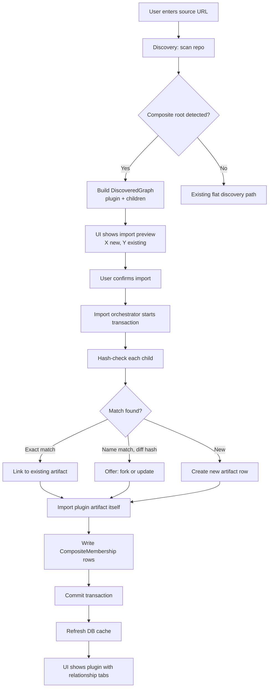

# Feature Brief & Metadata

**Feature Name:**

> Composite Artifact Infrastructure

**Filepath Name:**

> `composite-artifact-infrastructure-v1`

**Date:**

> 2026-02-17

**Author:**

> Claude (Sonnet 4.6) — PRD Writer agent

**Related Epic(s)/PRD ID(s):**

> Core architecture milestone; enables Plugin marketplace, stack distribution, and suite sharing

**Related Documents:**

> - [Design Spec: Generic Composite Artifacts (Relational Model)](/docs/project_plans/design-specs/composite-artifact-infrastructure.md)
> - `skillmeat/cache/models.py` — current ORM models
> - `skillmeat/core/artifact_detection.py` — ArtifactType enum and detection signatures
> - `skillmeat/core/discovery.py` — artifact discovery service
> - `skillmeat/core/importer.py` — import manager

---

## 1. Executive Summary

SkillMeat currently stores all artifacts (skills, commands, agents, MCP servers, hooks) as independent flat entities with no formal mechanism to represent a package that bundles multiple artifacts together. This PRD introduces a **Composite Artifact** system: collection-scoped composite entities (`Plugin` now, future `Stack`/`Suite`) with explicit membership metadata linking to atomic artifacts. Atomic artifacts remain independent and unchanged; relationships are stored as metadata. The result is graph-aware discovery, transactional smart import, version-pinned associations, and UI relationship browsing.

**Priority:** HIGH

**Key Outcomes:**
- Users can import a Plugin and receive all constituent artifacts in a single atomic transaction with deduplication.
- The DB model supports collection-scoped composite entities and typed membership metadata with pinned version hashes.
- The web UI exposes parent/child relationships so users can browse a Plugin's contents and see which Plugins a given skill belongs to.

---

## 2. Context & Background

### Current state

The `ArtifactType` enum in `skillmeat/core/artifact_detection.py` defines five atomic types: `SKILL`, `COMMAND`, `AGENT`, `HOOK`, `MCP`. The `Artifact` ORM model in `skillmeat/cache/models.py` treats every artifact as an independent row with no relationship columns. The `discovery.py` scanner returns a flat `DiscoveryResult` containing a list of individual `DiscoveredArtifact` objects; it has no graph traversal or parent-detection step. An informal "bundle" concept exists in `skillmeat/core/sharing/bundle.py` for export/import zip files, but there is no DB representation of bundle membership and no import-time deduplication.

### Problem space

GitHub repositories (and future registry entries) increasingly ship multi-artifact packages: a `git-workflow-pro` repo containing a skill, two commands, and a config agent. Today, importing such a repo requires the user to manually discover, individually import, and mentally track which artifacts belong together. There is no database record of the relationship, so re-importing the same skill from a different plugin silently creates a duplicate. Deploying a "plugin" means deploying each child artifact one-by-one with no conflict detection for version drift.

### Current alternatives / workarounds

Users manually import each child artifact and rely on naming conventions to track membership. The bundle zip format enables sharing but does not persist the parent/child relationship in the DB after import. No deduplication logic exists; hash collisions are not detected.

### Architectural context

SkillMeat uses a layered architecture:

- **Routers** (`skillmeat/api/routers/`) — HTTP surface, input validation, DTO responses
- **Services** (`skillmeat/core/services/`) — business logic orchestration, return DTOs
- **Repositories** (`skillmeat/cache/repositories.py`, `repository.py`) — all DB I/O via SQLAlchemy
- **ORM Models** (`skillmeat/cache/models.py`) — schema source of truth; migrations via Alembic
- **Core Logic** (`skillmeat/core/`) — discovery, detection, import, sync; filesystem-first

The DB cache is the web UI's source of truth; all mutations must write-through to DB and invalidate frontend caches.

---

## 3. Problem Statement

**User story:**

> "As a SkillMeat user, when I find a GitHub repo that is a multi-artifact plugin, I have to import each artifact individually and manually track which skills belong to that plugin — instead of importing the plugin once and having SkillMeat resolve, deduplicate, and persist all relationships atomically."

**Technical root cause:**

- `ArtifactType` has no composite types; there is nowhere to store a "plugin" entity in the DB.
- There is no collection-scoped composite entity model and no membership metadata table linking composites to child artifacts.
- `discovery.py` returns a flat list; it does not detect composite roots or build a dependency graph.
- `importer.py` has no hash-based deduplication; re-importing the same file creates a new row.
- No version-pinning mechanism exists to record which specific hash of a child was associated when the plugin was first imported.

---

## 4. Goals & Success Metrics

### Primary goals

**Goal 1: Relational DB model**
Introduce collection-scoped composite entities plus membership metadata so parent/child links are persisted with typed metadata and optional version pins, without mutating atomic artifact schema.

**Goal 2: Graph-aware discovery**
Update the discovery layer to detect composite roots, recursively enumerate children, and produce a `DiscoveredGraph` structure (parent + children with linkage) instead of only a flat list.

**Goal 3: Smart import with deduplication**
Implement transactional import orchestration that hash-checks each child against existing DB entries, links existing artifacts instead of duplicating them, and writes composite membership metadata in a single database transaction.

**Goal 4: Web UI relationship browsing**
Surface parent/child relationships in the artifact detail view and show an import preview ("1 Plugin + 5 children: 2 new, 3 existing") before the user confirms import.

### Success metrics

| Metric | Baseline | Target | Measurement method |
|--------|----------|--------|-------------------|
| Plugin import success rate | N/A (feature absent) | >95% of valid plugin repos import without error | Integration test suite; manual QA |
| Child deduplication accuracy | 0% (no dedup exists) | >99% exact-match dedup (same SHA-256 content hash) | Unit tests on hash logic; DB query for duplicate content hashes |
| Import transaction atomicity | N/A | 0 partial imports on error (all-or-nothing) | Integration tests with simulated mid-import failures |
| UI relationship discovery | 0 views possible | Users can navigate parent→child and child→parent within 2 clicks | Manual UX walkthrough; Playwright E2E test |
| Discovery false positive rate | N/A | <5% of scanned folders incorrectly flagged as composite | Detection unit tests on 50+ fixture repos |

---

## 5. User Personas & Journeys

### Personas

**Primary persona: Power collector**
- Role: Developer who actively curates a personal SkillMeat collection, imports from GitHub repos, and deploys to multiple projects.
- Needs: One-click plugin import, clear view of what will be imported (with dedup summary), ability to browse which plugins a skill belongs to.
- Pain points: Currently imports artifacts one by one, has no way to see relationships in the UI, accidentally creates duplicates.

**Secondary persona: Plugin publisher**
- Role: Developer who authors multi-artifact packages (e.g., `git-workflow-pro`) and wants SkillMeat users to be able to import the full suite correctly.
- Needs: A `plugin.json` manifest convention that SkillMeat can detect and a predictable import experience.
- Pain points: No formal plugin manifest format; SkillMeat ignores the package boundary entirely.

### High-level import flow

---

## 6. Requirements

### 6.1 Functional requirements

| ID | Requirement | Priority | Notes |
|:--:|-------------|:--------:|-------|
| FR-1 | Introduce `PLUGIN` value to `ArtifactType` enum in `skillmeat/core/artifact_detection.py` | Must | Architecture leaves room for `STACK`, `SUITE` later |
| FR-2 | Create `CompositeArtifact` ORM model in `skillmeat/cache/models.py` for collection-scoped composite entities (`plugin`) with manifest/meta fields | Must | Composite entity is distinct from contained atomic artifacts |
| FR-3 | Create `CompositeMembership` table linking `collection_id + composite_id` to child `artifact_id` with `relationship_type` and `pinned_version_hash` | Must | Relationship is metadata; atomic artifact records are not structurally changed |
| FR-4 | Generate and apply Alembic migration for composite entity + membership tables | Must | Must not break existing artifact rows |
| FR-5 | Update `discovery.py` to detect composite roots (presence of `plugin.json`, or multiple artifact-type subdirectories in one folder) and return a `DiscoveredGraph` | Must | `DiscoveredGraph` holds one parent + list of children with in-memory linkage |
| FR-6 | Implement `detect_composites()` in the detection layer (recursive child scan inside composite root) | Must | False positive guard: require at least 2 distinct artifact-type children |
| FR-7 | Implement hash-based dedup in `importer.py`: SHA-256 content hash check against existing DB entries before creating new artifact row | Must | Three scenarios: exact match → link; name match + diff hash → user decision; new → create |
| FR-8 | Wrap plugin import (all children + composite entity + membership rows) in a single DB transaction; roll back entirely on any child import failure | Must | Prevents partial imports |
| FR-9 | Record `pinned_version_hash` in composite membership metadata at import time (SHA-256 of child content at association time) | Must | Enables future conflict detection on deploy |
| FR-10 | API endpoint: `GET /artifacts/{id}/associations` — returns parent and child associations with relationship type and pinned hash | Must | Returns DTO, not ORM model |
| FR-11 | Artifact detail page: add "Contains" tab listing child artifacts (visible when artifact type is composite) | Must | Sorted by relationship_type then name |
| FR-12 | Artifact detail page: add "Part of" section listing parent plugins (visible for any atomic artifact that has parents) | Must | Shown in sidebar or below metadata |
| FR-13 | Import modal/flow: when a composite is detected, show preview: "Importing 1 Plugin + N children (X new, Y already in collection)" before user confirms | Must | Requires discovery to return graph before import starts |
| FR-14 | Collection storage: store plugin meta-files under `~/.skillmeat/collections/{collection}/plugins/<name>/` (separate from child artifact directories) | Should | Matches design spec file structure |
| FR-15 | Deployment: when deploying a plugin to Claude Code, detect hash conflicts between pinned child version and currently deployed version; warn user with side-by-side or overwrite options | Should | v1 platform scope: Claude Code; other platforms deferred |
| FR-16 | Composite listing: support listing composite entities (e.g., `GET /artifacts?artifact_type=plugin` or equivalent) for browsing/filtering | Should | Listing composites must not duplicate or mutate child artifacts |
| FR-17 | Support `plugin.json` manifest format for publisher-defined plugin declarations | Could | Enables explicit composition; detection falls back to heuristic if absent |
| FR-18 | Export a composite artifact as a bundle zip that includes all children (unifying bundle and plugin concepts) | Could | Future; architecture enables this |

### 6.2 Non-functional requirements

**Performance:**
- Association lookup (`GET /artifacts/{id}/associations`) responds in <200ms for plugins with up to 50 children.
- Discovery graph traversal completes within the existing discovery scan time budget (<5s for repos with <200 files).

**Security:**
- No new external attack surface introduced; association endpoints respect existing auth/authz middleware.
- SHA-256 hashes computed server-side only; no client-controlled hash values accepted.

**Accessibility:**
- "Contains" and "Part of" UI tabs meet WCAG 2.1 AA keyboard navigation and screen-reader requirements.
- Import preview dialog is announced via ARIA live region on open.

**Reliability:**
- Plugin import is transactional: no partial state on failure.
- Alembic migration is reversible (down migration drops composite entity/membership tables cleanly).
- Child artifact records remain unchanged; composite linkage is persisted as separate metadata rows.

**Observability:**
- OpenTelemetry spans on: composite detection, hash check per child, import transaction, association write.
- Structured log fields: `plugin_name`, `child_count`, `new_count`, `existing_count`, `transaction_id`.
- Metric: `plugin_import_duration_seconds` histogram; `dedup_hit_total` counter; `dedup_miss_total` counter.

---

## 7. Scope

### In scope

- `CompositeArtifact` and membership metadata tables, ORM models, Alembic migration
- `PLUGIN` enum value in `ArtifactType`
- Metadata linkage from child artifacts to one-or-more composites without mutating child artifact schema
- `detect_composites()` function and updated `DiscoveredGraph` return type in discovery layer
- Hash-based deduplication logic in importer
- Transactional import orchestration for plugins
- `pinned_version_hash` recording at import time
- `GET /artifacts/{id}/associations` API endpoint
- "Contains" tab and "Part of" section in artifact detail UI
- Import preview UI for composite artifacts
- Collection filesystem structure for `plugins/` directory
- Project deployment propagation of composite membership metadata (Claude Code in v1)

### Out of scope

- `STACK` and `SUITE` composite types (architecture supports them; implementation deferred)
- Bundle zip export unification (deferred to future milestone; FR-18)
- Registry/marketplace publishing of composite artifacts
- `plugin.json` manifest authoring tooling (FR-17 is "Could"; CLI publish command deferred)
- Circular dependency detection (no plugin-of-plugins scenarios in scope)
- UI for manually creating associations (import-driven only for v1)
- Cross-platform plugin deployment semantics beyond Claude Code

---

## 8. Dependencies & Assumptions

### External dependencies

- **SQLAlchemy 2.0+**: Required for `Mapped[]` typed relationship syntax (already in project)
- **Alembic**: Migration toolchain already integrated in `skillmeat/cache/migrations/`
- **SHA-256 (hashlib)**: Standard library; no new dependency

### Internal dependencies

- **`skillmeat/cache/models.py`**: Must be updated before any repository or service changes
- **`collection_artifacts` integration**: Membership rows must link to collection artifact IDs (`type:name`) and collection scope
- **`skillmeat/core/artifact_detection.py`**: `ArtifactType` enum change must propagate to all callers before discovery updates
- **`skillmeat/core/importer.py`**: Deduplication logic builds on existing import flow; must not break single-artifact imports
- **`skillmeat/api/openapi.json`**: Must be regenerated after new endpoint added; frontend code-gen depends on it
- **Existing `GroupArtifact` and `TemplateEntity` patterns**: The new `CompositeMembership` should follow these established association table patterns in `models.py`

### Assumptions

- A composite root is any directory containing a `plugin.json` OR two or more recognized artifact-type subdirectories (`skills/`, `commands/`, `agents/`, `hooks/`).
- The `pinned_version_hash` is the SHA-256 of the child's entire file content at time of association (or directory tree hash for skill directories); exact hashing strategy to be confirmed during Phase 1.
- Users installing a plugin implicitly consent to importing all children; individual child opt-out is out of scope for v1.
- The existing `ArtifactVersion` model is sufficient for tracking child version history; no new versioning table is required.
- Deduplication for "name match + different hash" defaults to creating a new `ArtifactVersion` rather than forking to a new artifact entry, unless the user explicitly chooses to fork.
- Composite membership metadata must carry through to project deployment records so deployed children retain "part of composite" context.
- Plugin deployment is supported for Claude Code in v1; behavior for other platforms is deferred.

### Feature flags

- `composite_artifacts_enabled`: Gates discovery and import graph logic; allows gradual rollout without disabling existing flat import path.

---

## 9. Risks & Mitigations

| Risk | Impact | Likelihood | Mitigation |
|------|:------:|:----------:|------------|
| Alembic migration breaks existing artifact rows or FK constraints | High | Low | Write reversible migration with down(); test on copy of production DB before deploy |
| Discovery false positives (flat repos mis-detected as composites) | Med | Med | Require threshold: 2+ distinct artifact-type subdirectories; add `plugin.json` as authoritative signal; unit test against 50+ fixture repos |
| Performance regression from graph traversal on large repos | Med | Low | Limit composite detection to first 3 directory levels; add scan time telemetry; gate behind feature flag |
| Dedup hash collision (two different artifacts with same SHA-256) | Low | Very Low | SHA-256 collision probability negligible; document assumption; add name+hash pair check as secondary guard |
| Version conflict resolution UX is confusing | Med | Med | Design Phase 4 conflict dialog with clear "side-by-side" vs "overwrite" options; add escape hatch to skip plugin deploy without resolving |
| `ArtifactType` enum change breaks existing callers (sync.py, sharing/bundle.py, etc.) | High | Med | Audit all `ArtifactType` references before merging; `PLUGIN` is additive; existing `match`/`if-elif` chains are exhaustive-checked in PR review |
| Partial import leaves orphaned child artifacts in collection | High | Low | Wrap entire plugin import in a single DB transaction; filesystem writes use temp-dir + atomic move pattern already established in codebase |
| Cross-platform deployment behavior is inconsistent for plugins | Med | Med | Scope v1 deployment path + conflict UX to Claude Code; return explicit "not yet supported" for other platforms |

---

## 10. Target state (post-implementation)

**User experience:**
- A user pastes a GitHub repo URL for `git-workflow-pro`. The import modal shows: "Detected Plugin: git-workflow-pro — contains 1 skill, 2 commands. 1 skill already in your collection. Import 2 new artifacts?" User confirms; all artifacts appear in the collection instantly.
- In the artifact detail view for `git-workflow-pro`, a "Contains" tab lists the three child artifacts with their types and version info.
- In the detail view for the `git-commit` skill, a "Part of" section shows "git-workflow-pro (Plugin)".

**Technical architecture:**
- Composite entity + membership metadata tables link collection-scoped composite records to child artifact IDs with typed, optionally version-pinned edges.
- Discovery produces `DiscoveredGraph` objects when composites are detected; falls back to flat `DiscoveryResult` for atomic artifacts.
- Import orchestration is graph-aware: children are resolved first (dedup), composite entity is created, membership metadata is written, all in one transaction.
- `GET /artifacts/{id}/associations` returns a `AssociationsDTO` with `parents: []` and `children: []` lists.

**Observable outcomes:**
- Zero duplicate artifact rows for exact content-hash matches after plugin import.
- `plugin_import_duration_seconds` histogram establishes baseline for performance monitoring.
- Discovery scan metrics include `composite_detected_total` counter per source scan.

---

## 11. Overall Acceptance Criteria (Definition of Done)

### Functional acceptance

- [ ] FR-1 through FR-13 implemented and verified by integration tests
- [ ] Plugin import end-to-end: source URL → detection → preview → confirm → DB rows + filesystem files created correctly
- [ ] Deduplication: re-importing same plugin a second time creates zero new artifact rows for exact matches
- [ ] Transactional rollback: simulated mid-import failure leaves collection in pre-import state
- [ ] UI relationship tabs render correctly for both parent (plugin) and child (atomic) artifact detail views

### Technical acceptance

- [ ] Alembic migration applies and rolls back cleanly against production-schema DB
- [ ] All new API endpoints return DTOs (no ORM models exposed)
- [ ] `GET /artifacts/{id}/associations` returns `{"parents": [], "children": []}` structure
- [ ] Composite membership table has composite PK and scope constraints defined (`collection_id + composite_id + child_artifact_id`)
- [ ] OpenTelemetry spans added for composite detection, hash check, import transaction, association write
- [ ] Structured logs include `plugin_name`, `child_count`, `new_count`, `existing_count`
- [ ] `composite_artifacts_enabled` feature flag gates new discovery/import paths
- [ ] `openapi.json` regenerated and committed after new endpoint is added

### Quality acceptance

- [ ] Unit test coverage >80% for: hash dedup logic, `detect_composites()`, `CompositeMembership` model, import orchestrator
- [ ] Integration tests cover: plugin import happy path, dedup scenario, partial-failure rollback, association endpoint
- [ ] E2E (Playwright) test covers: import preview modal, "Contains" tab rendering, "Part of" section rendering
- [ ] Discovery unit tests validate <5% false positive rate against fixture repo set
- [ ] No regression in existing single-artifact import tests

### Documentation acceptance

- [ ] `skillmeat/cache/models.py` docstring updated with `CompositeArtifact` + `CompositeMembership` descriptions
- [ ] `skillmeat/core/artifact_detection.py` docstring updated with `PLUGIN` type and composite detection notes
- [ ] API endpoint documented in `openapi.json` with request/response schemas
- [ ] `plugin.json` manifest format documented (even if FR-17 is deferred)

---

## 12. Assumptions & Open Questions

### Assumptions

- SHA-256 of file content (or merkle-style tree hash for skill directories) is the dedup key; exact algorithm finalized in Phase 1 implementation.
- `relationship_type` defaults to `"contains"`; other types (`"requires"`, `"extends"`) are reserved for future use and require no UI treatment in v1.
- The web UI's "Contains" tab is visible for composite entities; the "Part of" section is shown for atomic artifacts when membership metadata indicates one-or-more parent composites.

### Open questions

- [x] **Q1**: Should `pinned_version_hash` refer to the `ArtifactVersion.content_hash` field (if it exists) or be computed fresh at association time?
  - **A**: Compute and persist hash at association time as the source of truth for membership pinning; if `ArtifactVersion.content_hash` exists it must match, otherwise raise validation warning in import telemetry.
- [x] **Q2**: What is the authoritative `plugin.json` schema? Should SkillMeat define it or adopt an existing convention?
  - **A**: Use a SkillMeat-defined v1 permissive schema (`name`, `version`, optional metadata), ignore unknown keys, and fall back to heuristic detection if `plugin.json` is missing or invalid.
- [x] **Q3**: For the "name match + different hash" dedup scenario, should the default action be "create new ArtifactVersion" or prompt the user each time?
  - **A**: Keep child artifacts non-duplicated by default (link existing when exact hash matches). For hash mismatch, preserve association metadata and surface immediate/deferred conflict handling policy (import-time + drift-time).
- [x] **Q4**: Does plugin deployment support all platforms in v1?
  - **A**: No. Claude Code is in scope; other platforms are explicitly deferred and should return a clear unsupported response.

---

## 13. Appendices & References

### Related documentation

- **Design Specification**: [Composite Artifact Infrastructure Design Doc](/docs/project_plans/design-specs/composite-artifact-infrastructure.md)
- **ORM Models**: `skillmeat/cache/models.py` — `GroupArtifact` and `TemplateEntity` as reference patterns for the new membership table
- **Artifact Detection**: `skillmeat/core/artifact_detection.py` — `ArtifactType` enum, `ARTIFACT_SIGNATURES` dict, `detect_artifact()` function
- **Discovery Service**: `skillmeat/core/discovery.py` — `DiscoveryResult`, `DiscoveredArtifact`, `discover_artifacts()`
- **Import Manager**: `skillmeat/core/importer.py`
- **Sync Engine**: `skillmeat/core/sync.py` — propagate composite membership metadata into project deployment state (Claude Code v1)
- **Bundle (legacy)**: `skillmeat/core/sharing/bundle.py` — concept being formalized by this feature

### Symbol references

- `ArtifactType` enum: `skillmeat/core/artifact_detection.py:code:66-114`
- `Artifact` ORM model: `skillmeat/cache/models.py`
- `GroupArtifact` association pattern: `skillmeat/cache/models.py` (reference implementation for new membership table)

---

## Implementation

### Phased approach

**Phase 1: Core DB & model layer** (3-4 days)
- Duration: ~4 days
- Assigned agents: `data-layer-expert`, `python-backend-engineer`
- Tasks:
  - [ ] Add `PLUGIN` to `ArtifactType` enum; audit all call sites for exhaustiveness
  - [ ] Define composite entity + membership metadata ORM models in `models.py` following association-table patterns
  - [ ] Keep atomic artifact schema unchanged; model membership as separate metadata rows
  - [ ] Generate Alembic migration for composite entity + membership tables with scoped keys and `pinned_version_hash`
  - [ ] Add repository methods: `get_associations(artifact_id)`, `create_membership(composite_id, child_artifact_id, ...)`
  - [ ] Unit tests for new model and repository methods

**Phase 2: Enhanced discovery** (3 days)
- Duration: ~3 days
- Assigned agents: `python-backend-engineer`, `backend-architect`
- Tasks:
  - [ ] Define `DiscoveredGraph` dataclass (parent `DiscoveredArtifact` + `children: List[DiscoveredArtifact]` + `links`)
  - [ ] Implement `detect_composites(root_path)` in detection layer (signature: `plugin.json` OR 2+ artifact-type subdirs)
  - [ ] Update `discover_artifacts()` to return `DiscoveredGraph` when composite detected; flat `DiscoveryResult` otherwise
  - [ ] Unit tests: fixture repos for true positives and false positive rate validation

**Phase 3: Import orchestration & deduplication** (4 days)
- Duration: ~4 days
- Assigned agents: `python-backend-engineer`
- Tasks:
  - [ ] Implement SHA-256 content hash computation for skills (directory tree hash) and single-file artifacts
  - [ ] Implement dedup logic: hash lookup → link / new version / create new
  - [ ] Wrap plugin import in DB transaction; add rollback on any child failure
  - [ ] Record `pinned_version_hash` in membership metadata at write time
  - [ ] Propagate composite membership metadata to project deployments (Claude Code in v1)
  - [ ] Add `plugin.json` storage to `~/.skillmeat/collections/{collection}/plugins/<name>/`
  - [ ] Integration tests: happy path, dedup scenario, rollback scenario
  - [ ] Add API endpoint: `GET /artifacts/{id}/associations` with `AssociationsDTO`

**Phase 4: Web UI** (3-4 days)
- Duration: ~4 days
- Assigned agents: `ui-engineer-enhanced`, `frontend-developer`
- Tasks:
  - [ ] Add `AssociationsDTO` TypeScript type (sync from `openapi.json`)
  - [ ] Add `useArtifactAssociations(artifactId)` hook calling `GET /artifacts/{id}/associations`
  - [ ] Artifact detail page: "Contains" tab (conditional on composite type) with child artifact list
  - [ ] Artifact detail page: "Part of" sidebar section (conditional on `parents.length > 0`)
  - [ ] Import modal: composite detection preview ("1 Plugin + N children: X new, Y existing")
  - [ ] Version conflict resolution dialog (warn on pinned hash mismatch during deploy)
  - [ ] Playwright E2E tests: import flow, "Contains" tab, "Part of" section

### Epics & User Stories Backlog

| Story ID | Short Name | Description | Acceptance Criteria | Estimate |
|----------|-----------|-------------|-------------------|----------|
| CAI-001 | PLUGIN enum | Add `PLUGIN` to `ArtifactType`; audit call sites | All existing tests pass; `PLUGIN` serializes to `"plugin"` | 1 pt |
| CAI-002 | Composite + membership models | Composite entity + membership metadata models and migration | Migration applies/rolls back; scoped constraints enforced | 3 pt |
| CAI-003 | Membership repository | `get_associations`, `create_membership` repo methods | Unit tests green; returns correct parent/child lists | 2 pt |
| CAI-004 | Composite detection | `detect_composites()` + `DiscoveredGraph` | <5% false positive rate on fixture set | 3 pt |
| CAI-005 | Discovery integration | Update `discover_artifacts()` to return `DiscoveredGraph` | Existing flat discovery tests unaffected | 2 pt |
| CAI-006 | Content hash dedup | SHA-256 dedup logic in importer | Zero duplicate rows for exact re-imports | 3 pt |
| CAI-007 | Transactional import | Atomic plugin import + rollback | Rollback test passes; partial states impossible | 3 pt |
| CAI-008 | Version pinning | Record `pinned_version_hash` in association | Hash stored correctly; readable via repo method | 2 pt |
| CAI-009 | Associations API | `GET /artifacts/{id}/associations` endpoint | Returns `AssociationsDTO`; 200 for known id, 404 for unknown | 2 pt |
| CAI-010 | Contains tab UI | "Contains" tab on plugin detail page | Tab visible only for composite types; lists children | 3 pt |
| CAI-011 | Part of UI | "Part of" section on child artifact detail | Section visible when parents exist; links to parent | 2 pt |
| CAI-012 | Import preview UI | Composite import preview in modal | Shows plugin name + child count breakdown before confirm | 3 pt |
| CAI-013 | Conflict resolution UI | Version conflict warning on deploy | Dialog shows pinned vs current hash; offers side-by-side or overwrite | 3 pt |
| CAI-014 | Observability | OTel spans + structured logs + metrics | Spans visible in trace; metrics in prometheus endpoint | 2 pt |
| CAI-015 | Feature flag | `composite_artifacts_enabled` flag gates new paths | Disabling flag reverts to flat discovery/import behavior | 1 pt |

**Total estimate:** ~35 story points across 4 phases

---

**Progress Tracking:**

See progress tracking: `.claude/progress/composite-artifact-infrastructure/all-phases-progress.md`
