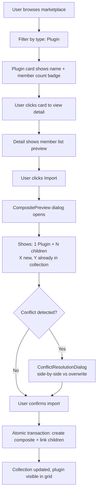
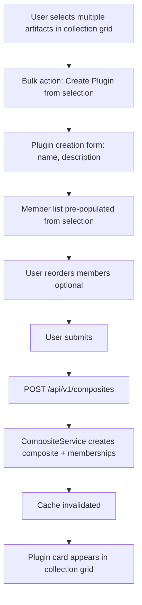

# Feature Brief & Metadata

**Feature Name:**

> Composite Artifact UX v2

**Filepath Name:**

> `composite-artifact-ux-v2`

**Date:**

> 2026-02-19

**Author:**

> Claude (Sonnet 4.6) — PRD Writer agent

**Related Epic(s)/PRD ID(s):**

> Successor to `composite-artifact-infrastructure-v1` (completed). Delivers the user-facing surface built on the v1 relational infrastructure.

**Related Documents:**

> - [v1 PRD: Composite Artifact Infrastructure](/docs/project_plans/PRDs/features/composite-artifact-infrastructure-v1.md)
> - [v1 Implementation Plan](/docs/project_plans/implementation_plans/features/composite-artifact-infrastructure-v1.md)
> - `skillmeat/web/types/artifact.ts` — `ArtifactType`, `ARTIFACT_TYPES`, `parseArtifactId`, `formatArtifactId`
> - `skillmeat/cache/composite_repository.py` — `CompositeMembershipRepository` (CRUD methods already exist)
> - `skillmeat/core/services/composite_service.py` — `CompositeService` (business logic already exists)
> - `skillmeat/api/routers/artifacts.py` — existing `GET /artifacts/{id}/associations` endpoint
> - `skillmeat/web/components/artifact/artifact-contains-tab.tsx` — v1 read-only component
> - `skillmeat/web/components/artifact/artifact-part-of-section.tsx` — v1 read-only component
> - `skillmeat/web/components/import/composite-preview.tsx` — v1 preview component (unwired)
> - `skillmeat/web/components/deployment/conflict-resolution-dialog.tsx` — v1 dialog (unwired)
> - `skillmeat/web/hooks/useArtifactAssociations.ts` — v1 hook (functional)

---

## 1. Executive Summary

v1 delivered the relational DB model, discovery heuristics, import orchestration, and read-only UI tabs for composite artifacts. However, Plugins remain invisible to most of the web app: the frontend type system does not include `'composite'`, the marketplace cannot filter or display plugins, the import flow does not surface the pre-built `CompositePreview`, and users have no way to create or manage plugin membership from the UI or CLI. This PRD closes that gap by making Plugins genuinely first-class — present in every type filter, browsable in the marketplace, importable with a preview and conflict dialog, and manageable through full CRUD endpoints and a collection UI.

**Priority:** HIGH

**Key Outcomes:**
- `'composite'` is a valid `ArtifactType` throughout the frontend type system, enabling plugins to appear in all filters, cards, forms, and detail views without conditional workarounds.
- Users can discover, preview, and import plugins from the marketplace with member-count badges and a pre-import breakdown dialog.
- Users can create, edit, and manage plugin membership (add/remove/reorder children) directly from the collection UI.
- CLI commands `skillmeat list` and `skillmeat composite create` treat plugins as first-class alongside atomic artifacts.

---

## 2. Context & Background

### Current state

**v1 delivered** (verified in codebase):
- DB models `CompositeArtifact` + `CompositeMembership` with UUID PKs and Alembic migration (committed)
- `CompositeService` and `CompositeMembershipRepository` with full CRUD methods (`get_children_of`, `get_parents_of`, `get_associations`, `create_membership`, `delete_membership`)
- `GET /artifacts/{id}/associations` API endpoint in `artifacts.py` (functional)
- Frontend: `artifact-contains-tab.tsx`, `artifact-part-of-section.tsx`, `composite-preview.tsx`, `conflict-resolution-dialog.tsx`, `useArtifactAssociations` hook
- E2E tests in `tests/e2e/composite-artifacts.spec.ts`

**What v1 did not deliver** (confirmed missing):
- `'composite'` is absent from the `ArtifactType` union in `types/artifact.ts` (currently `'skill' | 'command' | 'agent' | 'mcp' | 'hook'`)
- No `composite` entry in `ARTIFACT_TYPES` config (icon, label, color, form schema)
- `parseArtifactId()` and `formatArtifactId()` do not handle `'composite'` type
- Marketplace browse/search has no filter for composite type; marketplace source detection does not surface plugin-type repos in the UI
- `CompositePreview` is built but not wired into any actual import dialog
- `ConflictResolutionDialog` is built but not wired into the import flow
- No `POST /api/v1/composites`, `PUT`, `DELETE`, member add/remove/reorder endpoints
- No collection UI for creating a plugin from selected artifacts, no plugin card variant
- `skillmeat list` does not surface composites; no `skillmeat composite create` CLI command

### Problem space

The v1 infrastructure created a capable backend with no user-facing entry points beyond read-only relationship tabs on artifact detail pages. A user who wants to work with plugins must use raw API calls or know the exact artifact ID format. The marketplace shows GitHub sources but provides no signal that a source is a plugin. The import modal treats every source as an atomic artifact. The collection grid shows skills, commands, agents, etc. but silently omits any composite entity that was imported.

### Current alternatives / workarounds

None suitable for end users. Developers can call `GET /artifacts/{id}/associations` directly and use the `composite_repository` methods, but there is no UI or CLI surface for creating or managing composites.

### Architectural context

SkillMeat uses a layered architecture:

- **Routers** (`skillmeat/api/routers/`) — HTTP surface, input validation, DTO responses
- **Services** (`skillmeat/core/services/`) — business logic; `CompositeService` already exists
- **Repositories** (`skillmeat/cache/`) — all DB I/O; `CompositeMembershipRepository` already exists
- **ORM Models** (`skillmeat/cache/models.py`) — `CompositeArtifact`, `CompositeMembership` already exist
- **Frontend** (`skillmeat/web/`) — Next.js 15 App Router, TanStack Query, shadcn/Radix UI

The DB cache is the web UI's source of truth. All mutations must write-through to DB and invalidate frontend query caches. The v1 service and repository layers are the implementation foundation for this PRD — v2 adds the router wiring and UI surface, not new business logic.

---

## 3. Problem Statement

**User story:**

> "As a SkillMeat user, when I browse the marketplace or my collection, I cannot see, filter, import, create, or manage Plugins as a distinct artifact type — instead, plugins are either invisible or require me to use raw API calls — instead of being able to discover plugins in the marketplace, import them with a preview, and manage their members from the collection UI."

**Technical root cause:**
- `ArtifactType` union in `types/artifact.ts` does not include `'composite'`, so all composite-related code cannot type-check and is excluded from type-guarded UI paths.
- Router wiring for CRUD endpoints (`POST /composites`, `PUT /composites/{id}`, member management) has not been added; the service/repository layer is ready but unreachable from the HTTP surface.
- `CompositePreview` and `ConflictResolutionDialog` components exist but are imported nowhere in the import flow.
- Marketplace source detection identifies plugin repos in the backend but does not propagate the `composite` type classification to the browse/search UI.
- CLI `list` and `add` commands do not call composite-aware code paths.

---

## 4. Goals & Success Metrics

### Primary goals

**Goal 1: Type system integration**
`'composite'` is a valid `ArtifactType` in the frontend type union, `ARTIFACT_TYPES` config, `parseArtifactId`, `formatArtifactId`, and `lib/constants/platform-defaults.ts`. Every component that iterates artifact types (filter bars, forms, cards, detail views) handles composites without additional conditional logic.

**Goal 2: Marketplace plugin discovery**
Marketplace browse and search expose a `composite` type filter. Plugin-type sources display member-count badges. Marketplace source detection surfaces plugin classification in the UI.

**Goal 3: Wired import flow**
`CompositePreview` is embedded in the marketplace import dialog and collection add flow. `ConflictResolutionDialog` is triggered when a hash mismatch is detected. The import transaction (create composite + link children) is atomic.

**Goal 4: Plugin CRUD API**
Five new REST endpoints enable creating, updating, deleting composites and managing membership, wired to the existing `CompositeService` and `CompositeMembershipRepository`.

**Goal 5: Collection plugin management UI**
Users can create a plugin from selected collection artifacts, edit plugin metadata, add/remove/reorder member artifacts, and see a distinct plugin card variant in the collection grid.

**Goal 6: CLI integration**
`skillmeat list` includes composites in output. `skillmeat composite create` creates a plugin from specified artifact sources.

### Success metrics

| Metric | Baseline | Target | Measurement method |
|--------|----------|--------|-------------------|
| Type system breadth | 0 components handle `'composite'` type | All type-guarded UI paths accept `'composite'` without errors | `pnpm type-check` passes; zero TypeScript `ts(2339)`/`ts(2322)` errors on composite |
| Marketplace plugin visibility | 0 plugin repos labeled in UI | All repos with `plugin.json` or 2+ artifact subdirs show "Plugin" badge | Manual QA on known plugin repos; unit test on detection logic |
| Import flow completion | Composite import requires raw API | Import modal shows preview + conflict dialog; end-to-end import succeeds | Playwright E2E test; manual QA |
| CRUD endpoint availability | 0 composite CRUD endpoints | 5 endpoints exist and return correct status codes | Integration tests; OpenAPI spec |
| Plugin management UI | No UI for plugin creation/editing | User can create plugin from selection, add/remove members, reorder | Playwright E2E test; manual QA |
| CLI composite support | `skillmeat list` omits composites | `skillmeat list` shows composites; `skillmeat composite create` works | CLI integration tests |

---

## 5. User Personas & Journeys

### Personas

**Primary persona: Plugin consumer**
- Role: Developer who browses the marketplace for multi-artifact Claude Code setups (e.g., a full git workflow plugin)
- Needs: Filter marketplace by "Plugin", see member count, preview child artifacts before importing, import atomically
- Pain points: Currently sees only individual skills/commands; no way to discover that multiple artifacts belong to one package

**Secondary persona: Plugin author / collection curator**
- Role: Developer who maintains a curated SkillMeat collection and wants to group related artifacts into a named plugin for organization or sharing
- Needs: Select existing collection artifacts, wrap them in a named plugin, edit members, reorder for deploy ordering
- Pain points: Has no UI to create a composite; must use raw API calls or re-import from a GitHub plugin repo

**Tertiary persona: Plugin publisher**
- Role: Developer who publishes multi-artifact GitHub repos with `plugin.json` manifests
- Needs: Confidence that SkillMeat users will see the repo as a plugin, with correct member enumeration and import flow
- Pain points: Source detection exists on the backend but is invisible in the marketplace UI

### High-level flows

#### Marketplace import flow

#### Collection plugin creation flow

---

## 6. Requirements

### 6.1 Functional requirements

| ID | Requirement | Priority | Notes |
|:--:|-------------|:--------:|-------|
| FR-1 | Add `'composite'` to `ArtifactType` union in `skillmeat/web/types/artifact.ts` | Must | Unblocks all downstream type-safe usage |
| FR-2 | Add `composite` entry to `ARTIFACT_TYPES` config with icon (`Layers`), label (`Plugin`), plural label (`Plugins`), color (`text-amber-500`), and form schema (name, description, members field) | Must | `requiredFile` may be `plugin.json` or empty string |
| FR-3 | Update `parseArtifactId()` and `formatArtifactId()` to handle `'composite'` type without returning `null` | Must | Currently `parseArtifactId('composite:my-plugin')` returns `null` |
| FR-4 | Add `'composite'` to platform defaults in `skillmeat/web/lib/constants/platform-defaults.ts` (or equivalent constants file) | Must | Ensures composite type participates in platform-filtering logic |
| FR-5 | Marketplace browse: add `composite` option to type filter; query backend with `artifact_type=composite` (or equivalent) | Must | Backend already supports filtering via `GET /artifacts` |
| FR-6 | Marketplace browse: plugin cards display member count badge (e.g., "3 artifacts") populated from `children.length` in associations data | Must | Requires associations fetch or embedded count in listing response |
| FR-7 | Marketplace source detection: surface plugin classification (`composite` type) in source detail UI when backend heuristic detects plugin structure | Should | Detection heuristic already exists; need frontend surfacing |
| FR-8 | Wire `CompositePreview` component (`components/import/composite-preview.tsx`) into the marketplace import dialog so it renders when a composite source is detected | Must | Component is built; needs to be imported and conditionally rendered |
| FR-9 | Wire `ConflictResolutionDialog` (`components/deployment/conflict-resolution-dialog.tsx`) into the import flow for hash-mismatch scenarios | Must | Component is built; needs conditional trigger on conflict state |
| FR-10 | Ensure the import transaction (create composite + link children atomically) is called correctly from the frontend-triggered import flow | Must | Backend transaction logic exists; frontend must call the correct endpoint |
| FR-11 | `POST /api/v1/composites` — create composite with initial member list; request body: `{name, description?, members: [{artifact_id, relationship_type?, position?}]}` | Must | Wire to `CompositeService.create_composite()` |
| FR-12 | `PUT /api/v1/composites/{id}` — update composite metadata (name, description) | Must | Wire to `CompositeService.update_composite()` |
| FR-13 | `DELETE /api/v1/composites/{id}` — delete composite; cascade option: unlink members (default) or delete child artifacts | Must | Wire to `CompositeService`; default unlink, not delete children |
| FR-14 | `POST /api/v1/composites/{id}/members` — add a member artifact to a composite | Must | Wire to `CompositeMembershipRepository.create_membership()` |
| FR-15 | `DELETE /api/v1/composites/{id}/members/{member_id}` — remove a member from a composite | Must | Wire to `CompositeMembershipRepository.delete_membership()` |
| FR-16 | `PATCH /api/v1/composites/{id}/members` — reorder members (accepts array of `{artifact_id, position}`) | Should | Wire to repository update; position stored in membership metadata |
| FR-17 | Collection grid: plugin card variant displays plugin name, description, member-type chips (e.g., "2 skills, 1 command"), and member count | Must | Distinct from atomic artifact card but reuses `entity-card.tsx` composition pattern |
| FR-18 | Collection plugin creation: "Create Plugin" button or bulk selection action → plugin creation form with name, description, and pre-populated member list | Must | Accessible from collection manage page and from multi-select bulk action bar |
| FR-19 | Collection plugin detail/edit view: show member list with add/remove/reorder capabilities; changes call member management endpoints | Must | Extend `unified-entity-modal.tsx` or create a dedicated plugin modal |
| FR-20 | `skillmeat list` CLI command: include composite artifacts in output, labeled with type `composite` / `plugin` | Must | Update `cli.py` list command to query composite entities |
| FR-21 | `skillmeat composite create` CLI command: create a plugin from named artifact sources (e.g., `skillmeat composite create my-plugin skill:canvas command:git-commit`) | Should | Calls `CompositeService` via CLI layer |

### 6.2 Non-functional requirements

**Performance:**
- `POST /api/v1/composites` responds in <500ms for plugins with up to 20 initial members.
- Member list renders in collection detail view within the existing 5-minute stale-time budget (no additional round-trip for member data if embedded in associations response).
- Marketplace type filter change triggers re-fetch and renders results within 2s.

**Security:**
- All new CRUD endpoints respect existing auth middleware (API key / bearer token if enabled).
- Member artifacts must belong to the same collection as the composite; cross-collection membership is rejected with HTTP 400.
- `DELETE /api/v1/composites/{id}` with cascade-delete option requires explicit confirmation parameter (`?cascade_delete_children=true`) to prevent accidental child artifact deletion.

**Accessibility:**
- Plugin creation form meets WCAG 2.1 AA: all fields have associated labels, member reorder uses keyboard-accessible drag-handle or up/down buttons with ARIA descriptions.
- Plugin card in collection grid announces member count via `aria-label` on the badge element.
- `ConflictResolutionDialog` traps focus on open, announces heading via ARIA live region.

**Reliability:**
- Plugin creation and member management operations are transactional; partial failure rolls back.
- Frontend mutations use TanStack Query `useMutation` with `onError` handlers; on failure, optimistic updates are rolled back.

**Observability:**
- New CRUD endpoints emit OpenTelemetry spans with attributes: `composite.id`, `composite.name`, `member.count`.
- Structured logs include `composite_id`, `operation` (create/update/delete/add_member/remove_member), `user_collection`.
- Frontend mutation hooks log errors to the existing error tracking setup.

---

## 7. Scope

### In scope

- `'composite'` added to `ArtifactType` union and `ARTIFACT_TYPES` config (FR-1 through FR-4)
- Marketplace browse/search composite type filter and plugin card badge (FR-5, FR-6)
- Marketplace source type surfacing for plugin-type repos (FR-7)
- Wiring `CompositePreview` and `ConflictResolutionDialog` into import flow (FR-8 through FR-10)
- Five CRUD API endpoints for composite management (FR-11 through FR-16)
- Plugin card variant and collection management UI (FR-17 through FR-19)
- `skillmeat list` composite output and `skillmeat composite create` CLI command (FR-20, FR-21)
- `openapi.json` regenerated and committed after new endpoints
- Integration and E2E tests for all new endpoints and UI flows

### Out of scope

- `STACK`, `SUITE`, or other composite types beyond Plugin (architecture supports them; deferred to v3)
- Marketplace publishing of plugins (deferred; FR-18 in v1 PRD)
- Cross-platform composite deployment semantics beyond Claude Code (deferred)
- Plugin dependency graphs (plugin-of-plugins, nested composites)
- Automated composite detection during `skillmeat add` for non-GitHub sources
- Visual drag-and-drop reordering (keyboard-accessible up/down buttons are sufficient for v2; drag-and-drop deferred)

---

## 8. Dependencies & Assumptions

### External dependencies

- **SQLAlchemy 2.0+** and **Alembic**: Already integrated; no schema changes required (v1 migration complete)
- **TanStack Query v5**: Already integrated; used for all new mutation hooks
- **shadcn/Radix UI**: Already integrated; used for form components, dialog, badge

### Internal dependencies

- **v1 composite infrastructure**: Must be fully deployed and functional. `CompositeArtifact`, `CompositeMembership` tables exist; `CompositeService` and `CompositeMembershipRepository` have all required methods.
- **`skillmeat/api/routers/artifacts.py`**: New composite CRUD router may be added as a separate `composites.py` router or appended here; follow project conventions.
- **`skillmeat/web/types/artifact.ts`**: FR-1 through FR-3 are the critical unblocking change; must land before other frontend tasks.
- **`skillmeat/api/openapi.json`**: Must be regenerated after CRUD endpoints are added; frontend SDK depends on it.
- **`useArtifactAssociations` hook**: Already functional in v1; extended or supplemented with mutation hooks for member management.
- **`entity-card.tsx`**: Plugin card variant composes from this; must not break existing atomic artifact cards.

### Assumptions

- The existing `CompositeService` methods (`create_composite`, `update_composite`, `delete_composite`) exist in `skillmeat/core/services/composite_service.py` or can be added with minimal new business logic, relying on `CompositeMembershipRepository` for DB operations.
- `'composite'` serializes as `"composite"` in `artifact_type` fields (matching the pattern of `"skill"`, `"command"`, etc.); the backend `ArtifactType` Python enum already has `PLUGIN`/`COMPOSITE` defined — the frontend string value is `'composite'`.
- Member position (for reordering) is stored in the `CompositeMembership` table's existing `position` or `order` column; if absent, this column must be added via a lightweight Alembic migration.
- Plugin card member-type chips derive from the `children` array in `AssociationsDTO`; no additional endpoint is needed if the detail view already fetches associations.
- The marketplace listing endpoint returns `artifact_type` in its response schema, allowing the frontend to filter by `composite` without backend changes to the listing query (or a minimal query parameter addition).
- `skillmeat list` uses the DB cache; composites in `CollectionArtifact` will be returned when the type filter is not applied.

### Feature flags

- `composite_artifacts_enabled`: Inherited from v1; gates all composite-related behavior. v2 features activate when this flag is enabled.
- `composite_crud_enabled` (new, optional): May be introduced to separately gate the CRUD write endpoints from the read-only browsing features, enabling a staged rollout.

---

## 9. Risks & Mitigations

| Risk | Impact | Likelihood | Mitigation |
|------|:------:|:----------:|------------|
| Adding `'composite'` to `ArtifactType` breaks exhaustive switch/match in existing components | High | Medium | Audit all TypeScript `switch (artifact.type)` and `if (type === ...)` patterns before merging FR-1; add `default:` fallback where absent; type-check CI catches missed cases |
| `ARTIFACT_TYPES[type as ArtifactType]` lookups fail for `'composite'` if FR-2 is deployed after FR-1 | High | Low | Deploy FR-1 and FR-2 atomically in the same PR; `ARTIFACT_TYPES` must include `composite` entry before any runtime code uses it |
| `CompositeService.create_composite()` / `update_composite()` methods do not yet exist | High | Medium | Verify method existence before writing router; if absent, implement as thin wrapper over `CompositeMembershipRepository` methods |
| Plugin card in collection grid is visually indistinguishable from atomic artifact card | Medium | Medium | Use distinct icon (`Layers`), amber color scheme, and member-count badge; conduct design review before merge |
| Import flow wiring introduces regression for atomic artifact imports | High | Low | Composite detection is conditional (`if (source.artifact_type === 'composite')`); atomic path unchanged; cover with existing import E2E tests |
| `PATCH /api/v1/composites/{id}/members` reorder endpoint requires `position` column migration | Medium | Medium | Check `CompositeMembership` schema; if `position` absent, add lightweight Alembic migration before implementing FR-16 |
| CLI `skillmeat composite create` requires significant refactor to match existing `skillmeat add` patterns | Medium | Low | Scope CLI to a thin wrapper calling `CompositeService`; follow existing `cli.py` command patterns; defer complex interactive UX |
| Frontend type-check failures block other unrelated features if `composite` type union change is incomplete | Medium | Low | Land FR-1 through FR-4 as first PR; unblock other work before CRUD and UI PRs |

---

## 10. Target state (post-implementation)

**User experience:**
- A developer opens the marketplace, selects "Plugin" from the type filter, and sees a curated list of multi-artifact packages with member counts. They click a plugin, see its member breakdown, click Import, and the `CompositePreview` dialog explains what will be added. On confirmation, all children and the composite entity are imported atomically.
- In the collection page, the developer sees a plugin card labeled "git-workflow-pro — Plugin — 3 artifacts" with chips for the member types. They click the card and see a detail view with an editable member list; they can add a new skill or remove an outdated command.
- From the collection grid, the developer selects three artifacts and chooses "Create Plugin" from the bulk action menu. A form appears, they name it "my-workflow", and the plugin appears in the grid immediately.
- Running `skillmeat list` in the terminal shows composite artifacts alongside atomic ones, labeled `[plugin]`.

**Technical architecture:**
- `ArtifactType` in `types/artifact.ts` is `'skill' | 'command' | 'agent' | 'mcp' | 'hook' | 'composite'`; `ARTIFACT_TYPES` has a `composite` entry; `parseArtifactId('composite:my-plugin')` returns `{type: 'composite', name: 'my-plugin'}`.
- Five REST endpoints at `/api/v1/composites` wired to existing `CompositeService` and `CompositeMembershipRepository`.
- `CompositePreview` and `ConflictResolutionDialog` are live in the import modal, conditionally rendered based on source type detection.
- Marketplace listing query accepts `artifact_type=composite` filter parameter.
- `skillmeat list` output includes composite rows; `skillmeat composite create` command is available.

**Observable outcomes:**
- Zero TypeScript errors on composite-typed artifact objects throughout the frontend.
- `POST /api/v1/composites` integration tests pass with 201 response and correct DB state.
- Playwright E2E tests pass for marketplace plugin filter, import preview, and collection creation flows.
- `skillmeat list` output includes plugin entries in integration tests.

---

## 11. Overall Acceptance Criteria (Definition of Done)

### Functional acceptance

- [ ] FR-1 through FR-21 implemented and verified
- [ ] `ArtifactType` union includes `'composite'`; `pnpm type-check` passes with zero new errors
- [ ] `parseArtifactId('composite:my-plugin')` returns `{type: 'composite', name: 'my-plugin'}`
- [ ] Marketplace browse filters to plugins when `composite` type selected; plugin cards show member count
- [ ] Import modal renders `CompositePreview` for composite sources; `ConflictResolutionDialog` appears on hash mismatch
- [ ] `POST /api/v1/composites` creates composite and memberships in one transaction; returns 201
- [ ] `DELETE /api/v1/composites/{id}` unlinks members by default, deletes children only with explicit param
- [ ] Collection grid renders plugin card variant with member-type chips
- [ ] Plugin creation form creates plugin from multi-select; members are editable post-creation
- [ ] `skillmeat list` output includes composite artifacts
- [ ] `skillmeat composite create my-plugin skill:a command:b` creates composite and exits 0

### Technical acceptance

- [ ] All new API endpoints return DTOs (no ORM models exposed)
- [ ] `openapi.json` regenerated and committed after CRUD endpoints added
- [ ] All new CRUD endpoints respect existing auth middleware
- [ ] `DELETE` with cascade requires explicit `?cascade_delete_children=true` query param
- [ ] Frontend mutations use TanStack Query `useMutation` with rollback on error
- [ ] OpenTelemetry spans emitted for all CRUD operations with required attributes
- [ ] Structured logs include `composite_id`, `operation`, `user_collection`
- [ ] No regression in existing atomic artifact type paths (`pnpm test` passes)

### Quality acceptance

- [ ] Unit test coverage >80% for new hooks (`useCreateComposite`, `useUpdateComposite`, `useManageCompositeMembers`)
- [ ] Integration tests cover all 5 CRUD endpoints (happy path + error cases)
- [ ] Playwright E2E tests cover: marketplace plugin filter, import preview flow, collection plugin creation, member add/remove
- [ ] WCAG 2.1 AA: plugin creation form, plugin card, `ConflictResolutionDialog` pass axe audit
- [ ] No new TypeScript errors introduced (`pnpm type-check` clean)
- [ ] `pnpm lint` passes with no new warnings

### Documentation acceptance

- [ ] `types/artifact.ts` JSDoc updated to document `'composite'` type and its behavior
- [ ] New CRUD endpoints documented in `openapi.json` with request/response schema examples
- [ ] `skillmeat composite create` appears in `skillmeat --help` output
- [ ] CHANGELOG updated with v2 composite UX additions

---

## 12. Assumptions & Open Questions

### Assumptions

- `CompositeService` methods for create/update/delete exist or can be added as thin wrappers over repository methods without new business logic. If the service file is incomplete, those methods must be implemented as part of Phase 1 (Backend CRUD) before router wiring.
- The `position` column for member ordering either already exists on `CompositeMembership` or requires a trivial nullable integer column addition. This must be verified before FR-16 is scoped.
- The marketplace listing endpoint (`GET /api/v1/marketplace` or `/marketplace-catalog`) already returns `artifact_type` on source items, or can be extended to do so without structural schema changes.
- The plugin card variant is a composition of `entity-card.tsx` with an additional member badge, not a completely new component.
- `skillmeat composite create` is implemented as a Click command group under `cli.py`, consistent with existing CLI structure.

### Open questions

- [ ] **Q1**: Does `CompositeService` currently expose `create_composite()`, `update_composite()`, `delete_composite()` methods, or does v2 need to add them?
  - **A**: Verify by reading `skillmeat/core/services/composite_service.py`. If methods are absent, implement in Phase 1 before router wiring.
- [ ] **Q2**: Does `CompositeMembership` ORM model have a `position` integer column for member ordering?
  - **A**: Verify in `skillmeat/cache/models.py`. If absent, add a nullable `position` column in a lightweight Alembic migration as part of Phase 1.
- [ ] **Q3**: Should the new composite CRUD router live in `artifacts.py` (appended) or in a new `composites.py` router file?
  - **A**: Prefer a dedicated `composites.py` router to keep `artifacts.py` (already very large) from growing further. Register under `/api/v1/composites`.
- [ ] **Q4**: For marketplace plugin detection, does the source listing response already carry `artifact_type` or member count, or must those be fetched from the associations endpoint?
  - **A**: TBD during Phase 2 (Marketplace). If associations endpoint must be called per-listing, consider embedding `member_count` and `child_types` in the source detection response to avoid N+1 fetches.

---

## 13. Appendices & References

### Related documentation

- **v1 PRD**: [Composite Artifact Infrastructure PRD](/docs/project_plans/PRDs/features/composite-artifact-infrastructure-v1.md)
- **v1 Implementation Plan**: [Composite Artifact Infrastructure Implementation](/docs/project_plans/implementation_plans/features/composite-artifact-infrastructure-v1.md)
- **Design Spec**: [Generic Composite Artifacts (Relational Model)](/docs/project_plans/design-specs/composite-artifact-infrastructure.md)
- **Component patterns**: `.claude/context/key-context/component-patterns.md`
- **Router patterns**: `.claude/context/key-context/router-patterns.md`
- **Data flow patterns**: `.claude/context/key-context/data-flow-patterns.md`
- **Marketplace import flows**: `.claude/context/key-context/marketplace-import-flows.md`
- **FE/BE type sync playbook**: `.claude/context/key-context/fe-be-type-sync-playbook.md`

### Symbol references

- `ArtifactType` union and `ARTIFACT_TYPES` registry: `skillmeat/web/types/artifact.ts`
- `parseArtifactId`, `formatArtifactId`: `skillmeat/web/types/artifact.ts`
- `CompositeService`: `skillmeat/core/services/composite_service.py`
- `CompositeMembershipRepository`: `skillmeat/cache/composite_repository.py`
- `CompositeArtifact`, `CompositeMembership` ORM: `skillmeat/cache/models.py`
- `GET /artifacts/{id}/associations`: `skillmeat/api/routers/artifacts.py` (line ~8108)
- `CompositePreview`: `skillmeat/web/components/import/composite-preview.tsx`
- `ConflictResolutionDialog`: `skillmeat/web/components/deployment/conflict-resolution-dialog.tsx`
- `artifact-contains-tab.tsx`: `skillmeat/web/components/artifact/artifact-contains-tab.tsx`
- `artifact-part-of-section.tsx`: `skillmeat/web/components/artifact/artifact-part-of-section.tsx`
- `useArtifactAssociations`: `skillmeat/web/hooks/useArtifactAssociations.ts`
- `AssociationsDTO` TypeScript type: `skillmeat/web/types/associations.ts`
- `entity-card.tsx`: `skillmeat/web/components/entity/entity-card.tsx`
- `unified-entity-modal.tsx`: `skillmeat/web/components/entity/unified-entity-modal.tsx`
- `platform-defaults.ts`: `skillmeat/web/lib/constants/platform-defaults.ts`

---

## Implementation

### Phased approach

**Phase 1: Type system + backend CRUD** (3-4 days)
- Assigned agents: `python-backend-engineer` (backend), `frontend-developer` (type system)
- Tasks:
  - [ ] Add `'composite'` to `ArtifactType` union; add `composite` entry to `ARTIFACT_TYPES` with icon, label, color, form schema
  - [ ] Update `parseArtifactId()` and `formatArtifactId()` to handle `'composite'`; add `'composite'` to `platform-defaults.ts`
  - [ ] Verify `CompositeService` has `create_composite()`, `update_composite()`, `delete_composite()`; add if absent
  - [ ] Verify `CompositeMembership` has `position` column; add Alembic migration if absent
  - [ ] Implement `POST /api/v1/composites`, `PUT /api/v1/composites/{id}`, `DELETE /api/v1/composites/{id}` in new `composites.py` router
  - [ ] Implement `POST /api/v1/composites/{id}/members`, `DELETE /api/v1/composites/{id}/members/{member_id}`, `PATCH /api/v1/composites/{id}/members`
  - [ ] Add Pydantic request/response schemas for all CRUD endpoints
  - [ ] Regenerate `openapi.json`
  - [ ] Integration tests for all 6 endpoints (happy path + error cases)

**Phase 2: Marketplace plugin discovery** (2-3 days)
- Assigned agents: `ui-engineer-enhanced`, `python-backend-engineer`
- Tasks:
  - [ ] Add `composite` option to marketplace type filter (frontend filter bar)
  - [ ] Verify marketplace listing endpoint supports `artifact_type=composite` query param; add if absent
  - [ ] Embed `member_count` and `child_types` in source/listing response (or add separate endpoint) to avoid N+1 fetches
  - [ ] Plugin card in marketplace: display member count badge and child-type chips
  - [ ] Marketplace source detail: surface plugin classification badge when source is detected as composite type

**Phase 3: Import flow wiring** (2-3 days)
- Assigned agents: `ui-engineer-enhanced`, `frontend-developer`
- Tasks:
  - [ ] Wire `CompositePreview` into marketplace import dialog (conditional render when `source.artifact_type === 'composite'`)
  - [ ] Wire `CompositePreview` into collection `skillmeat add` flow
  - [ ] Wire `ConflictResolutionDialog` into import flow for hash-mismatch scenarios
  - [ ] Ensure import calls correct backend transaction endpoint (not individual child imports)
  - [ ] Update import flow hooks with TanStack Query `useMutation` and error rollback
  - [ ] E2E test: marketplace import flow (preview → confirm → collection updated)
  - [ ] E2E test: conflict dialog (hash mismatch → resolution options)

**Phase 4: Collection plugin management UI** (3-4 days)
- Assigned agents: `ui-engineer-enhanced`
- Tasks:
  - [ ] Plugin card variant in collection grid (icon, member-type chips, member count badge)
  - [ ] Plugin creation form: standalone "Create Plugin" button + bulk-select action → form with name, description, pre-populated members
  - [ ] Plugin detail/edit view: member list with add (artifact picker), remove, and reorder (keyboard up/down)
  - [ ] `useCreateComposite`, `useUpdateComposite`, `useDeleteComposite`, `useManageCompositeMembers` mutation hooks
  - [ ] Accessibility audit: all new UI elements pass WCAG 2.1 AA axe check
  - [ ] E2E test: create plugin from selection, add member, remove member

**Phase 5: CLI integration** (1-2 days)
- Assigned agents: `python-backend-engineer`
- Tasks:
  - [ ] Update `skillmeat list` to include composite artifacts in output (labeled with type)
  - [ ] Implement `skillmeat composite create <name> [artifact-ids...]` Click command
  - [ ] CLI integration tests for both commands
  - [ ] Update `skillmeat --help` output

### Epics & User Stories Backlog

| Story ID | Short Name | Description | Acceptance Criteria | Estimate |
|----------|-----------|-------------|-------------------|----------|
| CAUX-001 | Type union | Add `'composite'` to `ArtifactType`; update `ARTIFACT_TYPES` config | `pnpm type-check` passes; `getArtifactTypeConfig('composite')` returns valid config | 2 pt |
| CAUX-002 | ID helpers | Update `parseArtifactId` / `formatArtifactId` for composite | `parseArtifactId('composite:foo')` → `{type:'composite',name:'foo'}` | 1 pt |
| CAUX-003 | Platform defaults | Add composite to platform defaults constants | No TS errors in platform-defaults; composite participates in platform filtering | 1 pt |
| CAUX-004 | Composite service | Verify/add `create_composite`, `update_composite`, `delete_composite` service methods | Methods exist; unit tests pass | 2 pt |
| CAUX-005 | Position column | Alembic migration for `position` on `CompositeMembership` (if absent) | Migration applies/rolls back cleanly; column accessible via repo | 1 pt |
| CAUX-006 | CRUD router | `POST`, `PUT`, `DELETE /api/v1/composites` endpoints | 201/200/204 correct; integration tests pass | 3 pt |
| CAUX-007 | Member router | `POST`, `DELETE`, `PATCH /api/v1/composites/{id}/members` | Membership created/deleted/reordered; integration tests pass | 3 pt |
| CAUX-008 | Marketplace filter | Type filter includes `composite`; backend accepts query param | Filtering returns only composite-type sources | 2 pt |
| CAUX-009 | Plugin listing badge | Member count and child-type chips on marketplace plugin cards | Badge shows correct count; chips list distinct child types | 2 pt |
| CAUX-010 | Source classification | Plugin badge on marketplace source detail when heuristic detects composite | Source detail shows "Plugin" badge for qualifying repos | 1 pt |
| CAUX-011 | Wire CompositePreview | Embed `CompositePreview` in import modal for composite sources | Preview renders with correct child breakdown before confirm | 2 pt |
| CAUX-012 | Wire ConflictDialog | Trigger `ConflictResolutionDialog` on hash mismatch during import | Dialog appears when conflict detected; user can choose resolution | 2 pt |
| CAUX-013 | Import E2E | Playwright E2E for marketplace plugin import flow | Test passes: preview → confirm → collection updated | 2 pt |
| CAUX-014 | Plugin card | Plugin card variant in collection grid | Card shows name, member chips, count badge; links to detail | 2 pt |
| CAUX-015 | Plugin creation form | "Create Plugin" action → form → `POST /api/v1/composites` | Plugin created; appears in collection; member list correct | 3 pt |
| CAUX-016 | Plugin edit view | Plugin detail: member add/remove/reorder | Add/remove calls endpoints; position updates persist | 3 pt |
| CAUX-017 | Mutation hooks | `useCreateComposite`, `useUpdateComposite`, `useDeleteComposite`, `useManageCompositeMembers` | Hooks call correct endpoints; optimistic updates roll back on error | 2 pt |
| CAUX-018 | Collection E2E | Playwright E2E for plugin creation and member management | Test passes: create from selection → add member → remove member | 2 pt |
| CAUX-019 | CLI list | `skillmeat list` includes composite artifacts | Composite rows visible in output; correctly labeled | 1 pt |
| CAUX-020 | CLI create | `skillmeat composite create` command | Creates composite via service; exits 0; appears in list | 2 pt |

**Total estimate:** ~41 story points across 5 phases

---

**Progress Tracking:**

See progress tracking: `.claude/progress/composite-artifact-ux-v2/all-phases-progress.md`
