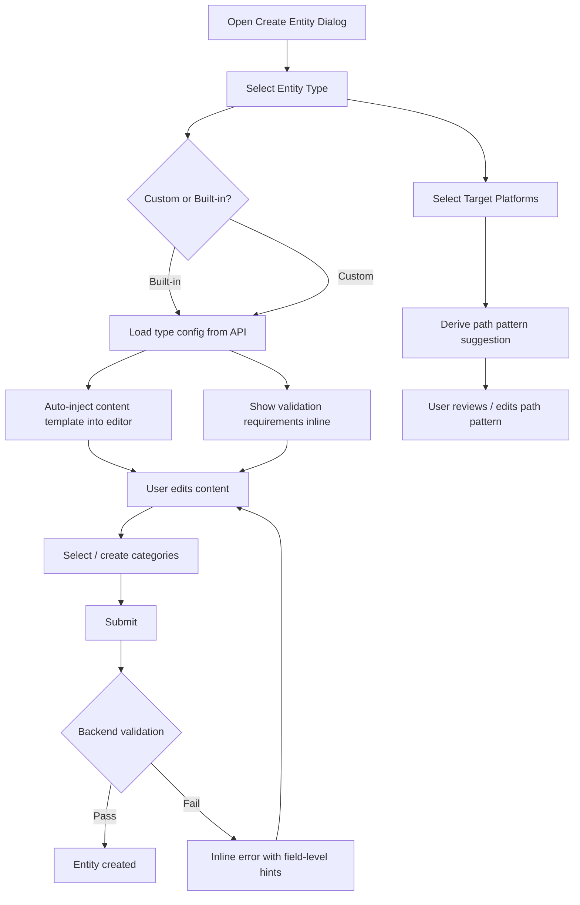

# Feature Brief & Metadata

**Feature Name:**

> Context Entity Creation Overhaul

**Filepath Name:**

> `context-entity-creation-overhaul-v1`

**Date:**

> 2026-02-28

**Author:**

> Claude (prd-writer / Sonnet 4.6)

**Related Documents:**

> - `docs/project_plans/PRDs/features/enhanced-platform-profiles-v1.md`
> - `docs/project_plans/PRDs/features/agent-context-entities-v1.md`
> - `skillmeat/core/validators/context_entity.py`
> - `skillmeat/core/platform_defaults.py`

---

## 1. Executive Summary

The context entity creation flow requires a significant overhaul to two dimensions: UX and architecture. On the UX side, users face an opaque form that provides no guidance on what each entity type requires, cannot express multi-platform intent, and has a limited single-string category field. On the architecture side, entity type definitions—including their validation rules, path conventions, and frontmatter requirements—are hardcoded in Python source and cannot be extended without a code deployment. This PRD defines a phased program to migrate entity types to a database-backed configuration system, build a new Settings tab for managing them, and redesign the creation form to surface platform selection, dynamic path patterns, content templates, and multi-select categories.

**Priority:** HIGH

**Key Outcomes:**
- Outcome 1: Users see what each entity type requires before attempting to submit (validation transparency).
- Outcome 2: Users can select one or more target platforms and get platform-appropriate path pattern suggestions automatically.
- Outcome 3: Administrators and power users can define custom entity types in Settings without touching Python source.

---

## 2. Context & Background

### Current state

The system has 5 entity types (`project_config`, `spec_file`, `rule_file`, `context_file`, `progress_template`) defined as a Python `Enum` in `skillmeat/api/schemas/context_entity.py`. Validation logic lives in `skillmeat/core/validators/context_entity.py` as per-type functions that enforce minimum content length, path prefix requirements, and frontmatter rules. Platform defaults are stored in `skillmeat/core/platform_defaults.py` as a hardcoded `PLATFORM_DEFAULTS` dict with 5 entries (`claude_code`, `codex`, `gemini`, `cursor`, `other`), with TOML/env var overrides supported.

The frontend creation form (`skillmeat/web/components/context/context-entity-editor.tsx`) exposes: name, entity type (dropdown of the 5 types), content (textarea), path pattern (text field), optional description, a single-string category field, auto-load toggle, version string, and optional platform restrictions. There are no inline validation hints, no content templates, no platform-driven path suggestions, and no mechanism to create or configure entity types at runtime.

### Problem space

- **Opaque requirements:** Users must know externally that `spec_file` requires a `title` frontmatter key and that `context_file` requires a `references` list. The form provides no hints; failed saves surface backend validation errors after submission.
- **No platform awareness during creation:** While `target_platforms` exists as a field, selecting platforms does not affect the path pattern or suggest platform-specific conventions.
- **Hardcoded extension barrier:** Adding a new entity type (e.g., `worknote_file` for `.claude/worknotes/`) requires Python changes, migration, and a release.
- **Weak category system:** A plain string field allows ad-hoc categories but provides no list of existing values, no multi-select, and no per-type or per-platform scoping.
- **No content templates:** The editor starts blank. Types that require frontmatter force users to write it from memory.

### Architectural context

SkillMeat follows a layered architecture:
- **Routers** (`skillmeat/api/routers/`) — HTTP surface only, return DTOs
- **Schemas** (`skillmeat/api/schemas/`) — Pydantic request/response models
- **Core validators** (`skillmeat/core/validators/`) — Business validation logic
- **Cache/DB** (`skillmeat/cache/`) — SQLAlchemy ORM + Alembic migrations
- **Frontend** (`skillmeat/web/`) — Next.js 15 App Router + TanStack Query

The DB is the web's source of truth; all frontend reads go through API endpoints backed by the SQLAlchemy cache.

---

## 3. Problem Statement

> "As a developer creating a new context entity, when I select `spec_file` and submit, I receive a backend error about missing frontmatter title instead of being guided to include it upfront—and I cannot add a new entity type for my project's conventions without modifying Python source."

**Technical root causes:**
- Entity types are a Python Enum; no DB table exists for runtime configuration.
- Validation rules exist only server-side with no API endpoint to expose requirements to the frontend.
- The creation form has no template injection logic; the content field starts blank.
- `category` is a scalar string column on the `Artifact` model with no foreign key to a categories table.
- Path pattern derivation is entirely manual; no platform-type mapping drives suggestions.

---

## 4. Goals & Success Metrics

### Primary goals

**Goal 1: Configuration-driven entity types**
- Move entity type definitions (path prefix, required frontmatter fields, content rules) from Python source to a DB-backed config store.
- Expose entity type configurations via a new Settings API so the frontend can render requirements inline.

**Goal 2: Platform-aware creation form**
- The creation form accepts a target-platform selection that drives path pattern defaults and, optionally, platform-specific frontmatter requirements.
- Users select from their configured platforms, choose or override the suggested path, and receive a pre-populated content template.

**Goal 3: Enhanced category system**
- Replace the single-string `category` field with a multi-select backed by a `ContextEntityCategory` table.
- Users can create new categories on the fly during entity creation.
- Categories are optionally scoped to entity type or platform.

**Goal 4: Content templates**
- Each entity type has a configurable content template (Markdown with frontmatter scaffold).
- Selecting a type (and optionally a platform) auto-inserts the template into the editor.
- Templates are editable in the new Entity Types settings tab.

**Goal 5: Custom entity types**
- Users can define new entity types in Settings, specifying: slug, display name, default path prefix (supporting `{PLATFORM}` dynamic tokens), required frontmatter fields, content template, and applicable platforms.
- Custom types appear alongside built-in types in the creation form.

### Success metrics

| Metric | Baseline | Target | Measurement method |
|--------|----------|--------|--------------------|
| Validation error rate on entity create | Unknown (server-side only) | <5% of creation attempts fail with frontmatter errors | API error logs for 422s on POST /context-entities |
| Time-to-create a valid spec_file | Manual effort, often >2 attempts | First-attempt success rate >90% | User testing sessions |
| Entity type configuration coverage | 0% (hardcoded) | 100% of built-in types migrated to DB config | DB row count vs. Enum count |
| Custom entity type creation | Not possible | Roundtrip in Settings → available in creation form | Functional test |
| Multi-category assignment | 0 (single string) | Multi-select works, new categories creatable | E2E test coverage |

---

## 5. User Personas & Journeys

### Personas

**Primary persona: The Developer**
- Role: Individual developer using SkillMeat to manage Claude Code artifacts.
- Needs: Fast, guided creation with auto-populated templates; correct path patterns by default.
- Pain points: Has to look up what frontmatter each type requires; frequently gets 422 errors.

**Secondary persona: The Power User / Team Lead**
- Role: Maintains team-wide entity type conventions and categories.
- Needs: Ability to define custom entity types, set standard templates, lock down path patterns.
- Pain points: Cannot add team-specific entity types (e.g., ADR files) without a code change.

### High-level creation flow (target state)

---

## 6. Requirements

### 6.1 Functional requirements

| ID | Requirement | Priority | Notes |
|:--:|-------------|:--------:|-------|
| FR-1 | Entity type definitions (path prefix, required frontmatter keys, content rules, applicable platforms) are stored in a DB config table, seeded from existing hardcoded defaults | Must | Phase 1 |
| FR-2 | API endpoint `GET /settings/entity-type-configs` returns all entity type configs including custom types | Must | Phase 1 |
| FR-3 | API endpoints for CRUD on entity type configs: `POST`, `PUT`, `DELETE /settings/entity-type-configs/{slug}` | Must | Phase 2 |
| FR-4 | Settings page gains an "Entity Types" tab listing all configured types with inline edit/delete | Must | Phase 2 |
| FR-5 | Entity type config includes a `content_template` field (Markdown string with frontmatter scaffold) | Must | Phase 2 |
| FR-6 | Creation form shows per-type validation requirements inline before submit (e.g., "This type requires `title` in frontmatter") | Must | Phase 3 |
| FR-7 | Creation form includes a platform multi-select field populated from configured platforms | Must | Phase 3 |
| FR-8 | Selecting entity type + platforms auto-derives a suggested `path_pattern` using the type's `path_prefix` and platform root dir | Must | Phase 3 |
| FR-9 | Path pattern field supports dynamic parameter tokens: `{PLATFORM}` resolves to the platform's `root_dir` | Must | Phase 3 |
| FR-10 | Selecting an entity type auto-inserts `content_template` into the editor; user can edit before saving | Must | Phase 3 |
| FR-11 | `category` field replaced with a multi-select backed by a `ContextEntityCategory` DB table | Must | Phase 3 |
| FR-12 | User can create a new category on the fly from within the creation form (inline combobox create) | Must | Phase 3 |
| FR-13 | Categories optionally carry a `entity_type_slug` or `platform` scope; unscoped categories are universal | Should | Phase 3 |
| FR-14 | Custom entity types created in Settings appear in the creation form alongside built-in types | Must | Phase 5 |
| FR-15 | Custom entity types support defining: slug, display name, path prefix pattern, required frontmatter keys (list of strings), optional frontmatter schema (JSON Schema subset), content template, applicable platforms | Must | Phase 5 |
| FR-16 | Core content (the actual entity text) is stored separately from platform-specific wrappers; a content assembly engine applies platform-required fields at deploy time | Should | Phase 4 |
| FR-17 | Platform-specific path pattern defaults configurable per platform in Platform Settings | Should | Phase 3 |
| FR-18 | Backend validator reads entity type config from DB rather than hardcoded Python functions | Must | Phase 1 |
| FR-19 | Validation errors from backend include field-level hints (e.g., `{"field": "content", "hint": "Add frontmatter with 'title' key"}`) | Should | Phase 1 |

### 6.2 Non-functional requirements

**Performance:**
- Entity type config API responses cached with 5-minute stale time (same as standard browsing).
- Content template insertion is client-side only (no round-trip); <100ms perceived latency.
- Category search with debounce ≤300ms; response from `/settings/categories` ≤200ms at p95.

**Security:**
- Path prefix patterns stored in DB must be validated server-side before use; no arbitrary filesystem paths.
- Custom entity type slugs must match `^[a-z][a-z0-9_]{0,63}$` and be unique.
- Content templates stored as plain Markdown strings; no server-side template execution.

**Accessibility:**
- Multi-select category combobox must be keyboard navigable and screen-reader compatible (ARIA combobox pattern).
- Validation hint text must be associated with the relevant form field via `aria-describedby`.
- Platform selection checkboxes must have visible labels.

**Reliability:**
- If the entity type config API is unavailable at form open time, fall back to a client-side list of the 5 built-in types with no inline hints.
- DB migration must be additive (no column drops on existing Artifact table columns in Phase 1).

**Observability:**
- Log entity type config reads, creates, updates, and deletes with `feature=context_entity_config` structured key.
- Track creation form completion rate (start vs. successful create) via existing analytics.

---

## 7. Scope

### In scope

- New `EntityTypeConfig` DB model and Alembic migration (Phase 1).
- Seeding the 5 built-in types from `platform_defaults.py` and `context_entity.py` validator logic (Phase 1).
- Backend validator refactor to read config from DB rather than hardcoded dispatch map (Phase 1).
- Settings page "Entity Types" tab with list, create, edit, delete (Phase 2).
- Content template field in entity type config, editable in Settings (Phase 2).
- Creation form: platform multi-select, path pattern derivation, template injection, inline validation hints (Phase 3).
- Multi-select category system with `ContextEntityCategory` DB table (Phase 3).
- On-the-fly category creation from the creation form (Phase 3).
- Modular content architecture: core content + platform wrapper assembly at deploy time (Phase 4).
- Custom entity type creation in Settings with full field set (Phase 5).
- End-to-end tests for critical paths: create spec_file, create custom type, deploy multi-platform entity (Phase 6).

### Out of scope

- Version history / git-backed diffing for entity content.
- Real-time collaborative editing.
- Teams compliance modules (deferred to a future Teams PRD).
- Marketplace publishing of custom entity types.
- Automated migration of existing `category` string values into the new categories table (manual cleanup acceptable for beta).
- Renaming or merging existing built-in entity types (backward compatibility preserved).

---

## 8. Dependencies & Assumptions

### External dependencies

- **SQLAlchemy + Alembic**: Already in use; new migration scripts extend existing migration chain.
- **Pydantic v2**: Schema validation; custom entity type config validated via Pydantic before DB write.
- **TanStack Query v5**: Existing query infrastructure; new entity type config hook added.
- **Radix UI Combobox**: Used for the multi-select category field (shadcn `Combobox` pattern).

### Internal dependencies

- **`skillmeat/core/platform_defaults.py`**: Source of truth for seeding initial entity type configs; must remain stable during Phase 1 migration.
- **`skillmeat/cache/models.py`**: New `EntityTypeConfig` and `ContextEntityCategory` models added; existing `Artifact` model `category` column kept (deprecated) until Phase 3 migration completes.
- **`DeploymentProfile` model**: Platform list for creation form comes from existing deployment profiles; creation form reads from `GET /api/v1/settings/platforms` or infers from `PLATFORM_DEFAULTS`.
- **Context entity router** (`skillmeat/api/routers/context_entities.py`): Validator call in `POST /context-entities` replaced in Phase 1.
- **Settings router** (`skillmeat/api/routers/settings.py`): New sub-routes added for entity type configs and categories.

### Assumptions

- The existing `ContextEntityType` Python Enum (`project_config`, `spec_file`, `rule_file`, `context_file`, `progress_template`) remains as a compatibility layer; the DB config table is the source of truth, and the Enum is generated/validated against it at startup.
- The 5 built-in types are never deleted by users; they can be edited (path prefix, template) but not removed via the UI (soft-delete only).
- Platform selection in the creation form is optional; unselected means "all platforms" (preserving existing behavior of `target_platforms: null`).
- Categories are global to the SkillMeat installation (not per-project) in Phase 3; per-project scoping is deferred.
- Alembic migrations run automatically at API startup (`check_same_thread=False` SQLite configuration already in place).

### Feature flags

- `entity_type_config_enabled`: Gates Phase 1 DB-backed validation (default `false` until migration verified). Fallback to legacy hardcoded validators when disabled.
- `entity_types_settings_tab`: Gates Phase 2 Settings tab visibility.
- `creation_form_v2`: Gates Phase 3 enhanced creation form.
- `modular_content_architecture`: Gates Phase 4 content assembly engine.

---

## 9. Risks & Mitigations

| Risk | Impact | Likelihood | Mitigation |
|------|:------:|:----------:|------------|
| Alembic migration regresses existing context entity records (Artifact rows with `type` in Enum set) | High | Medium | Write idempotent migration; add pre-migration backup step in test suite; feature-flag gates Phase 1 validator switch |
| Frontend/backend type drift: custom entity types added via API not reflected in TypeScript types | Medium | Medium | Auto-generate SDK types from OpenAPI; add a `GET /settings/entity-type-configs` integration test that validates response shape matches TypeScript interface |
| Content template storage introduces XSS surface if templates rendered as HTML in editor | Medium | Low | Templates are stored as raw Markdown strings and rendered via existing safe Markdown renderer; no `dangerouslySetInnerHTML`; CSP headers in place |
| DB-backed validator adds latency to `POST /context-entities` | Low | Medium | Cache entity type configs in memory at API startup with 60s TTL; add cache invalidation on config write |
| Custom entity type slugs collide with future built-in types | Low | Low | Reserve all 5 current built-in slugs as non-deletable; document reserved namespace; validate on create |
| `category` column data loss during migration to multi-select | High | Low | Keep `category` column, add `entity_categories` join table; backfill join table from existing string values at migration time; deprecate old column post-Phase 3 |
| Phase sequencing complexity: 6 phases may create long tail of partially-delivered UX | Medium | Medium | Each phase is independently releasable behind feature flags; user-facing improvement visible from Phase 3 |

---

## 10. Target State (Post-Implementation)

### User experience

- A developer opens the "Create Context Entity" dialog and selects `spec_file`. The form immediately shows: "Requires frontmatter with `title` key." The content editor pre-fills with the spec_file template (YAML frontmatter block + placeholder body).
- The developer selects platforms `claude_code` and `codex`. The path pattern field auto-populates: `.claude/specs/my-spec.md` (primary) with a note that Codex will use `.codex/specs/my-spec.md` at deploy time.
- The developer types a name, picks categories from a combobox (existing: `api`, `web`; creates new: `onboarding`), edits the content, and saves — first attempt, no validation errors.
- A power user opens Settings → Entity Types, clicks "Add Type", defines `adr_file` with path prefix `.claude/decisions/`, required frontmatter `["status", "date"]`, and a Markdown template. The new type immediately appears in the creation form dropdown.

### Technical architecture

- `EntityTypeConfig` table in SQLite stores per-type config rows; seeded from hardcoded defaults at first startup; supports custom rows.
- `ContextEntityCategory` table stores categories; `entity_category_associations` join table links entities to categories (replacing the scalar `category` column).
- Backend validator (`validate_context_entity`) loads type config from DB cache (in-memory 60s TTL) instead of the hardcoded dispatch map.
- New API routes under `/api/v1/settings/entity-type-configs` and `/api/v1/settings/entity-categories` handle CRUD.
- Frontend `useEntityTypeConfigs()` hook fetches type configs on form open; `useEntityCategories()` fetches categories for combobox.
- Content assembly engine (`skillmeat/core/content_assembly.py`) composes `core_content` + platform wrapper at deploy time (Phase 4), keeping stored content platform-agnostic.

### Observable outcomes

- 422 error rate on `POST /context-entities` drops measurably as template injection ensures required frontmatter is present.
- Category coverage increases (distinct category values per entity) as multi-select makes assigning multiple categories frictionless.
- New entity types appear in production without code deployments.

---

## 11. Overall Acceptance Criteria (Definition of Done)

### Functional acceptance

- [ ] All 5 built-in entity types have DB config rows with correct path prefix, required frontmatter keys, and content template.
- [ ] `GET /settings/entity-type-configs` returns all types; response matches `EntityTypeConfigResponse` schema.
- [ ] Settings "Entity Types" tab renders, allows create/edit/delete of custom types.
- [ ] Creation form: selecting a type shows validation hints and injects content template.
- [ ] Creation form: selecting platforms derives path pattern suggestion.
- [ ] Category multi-select: existing categories appear; new categories can be created inline.
- [ ] Custom entity types created in Settings appear in creation form and validate correctly.
- [ ] Content assembly at deploy time applies platform-specific wrappers without altering stored `core_content`.

### Technical acceptance

- [ ] Alembic migration is additive; existing `Artifact` rows survive the migration unchanged.
- [ ] Backend validator reads from DB config (feature-flagged); hardcoded dispatch map kept as fallback.
- [ ] All new API endpoints return proper DTOs (no ORM model leakage).
- [ ] Validation error responses from `POST /context-entities` include `field` and `hint` keys.
- [ ] Feature flags control each phase boundary; disabling a flag reverts to prior behavior.
- [ ] `EntityTypeConfig` in-memory cache invalidated within 1s of a config write.

### Quality acceptance

- [ ] Unit tests cover: DB seeding idempotency, config cache TTL, validator fallback path, path pattern derivation for each platform.
- [ ] Integration tests cover all new settings API endpoints (CRUD round-trips).
- [ ] E2E tests cover: create spec_file (first-attempt success), create custom type in Settings → use in creation form.
- [ ] TypeScript types for entity type config generated from OpenAPI spec; no manual drift.
- [ ] Accessibility: combobox keyboard navigation, ARIA attributes, focus management tested.

### Documentation acceptance

- [ ] API docs updated for new `/settings/entity-type-configs` and `/settings/entity-categories` endpoints.
- [ ] `skillmeat/core/validators/context_entity.py` module docstring updated to reflect DB-driven architecture.
- [ ] Settings tab documented in user-facing web docs.

---

## 12. Assumptions & Open Questions

### Assumptions

- The SQLite DB used by the API server is writable at runtime (already true per existing architecture).
- The `entity_type_config_enabled` feature flag defaults to `false` in production until Phase 1 is fully validated; the legacy hardcoded validators serve as the fallback.
- Categories created in the creation form are immediately persisted to DB (no draft state); deletion of categories with existing associations is blocked at the API level.
- The `{PLATFORM}` token in path prefix patterns resolves only to the known platform `root_dir` values; arbitrary tokens are not supported in Phase 3.

### Open questions

- [ ] **Q1**: Should built-in entity type configs be editable by users (e.g., changing the `spec_file` path prefix), or should they be read-only with only `content_template` editable?
  - **A**: TBD — recommend allowing template edits only for built-in types to prevent breaking existing validation assumptions.
- [ ] **Q2**: Should the content assembly engine (Phase 4) operate at create time (storing assembled content) or at deploy time (assembling on the fly)?
  - **A**: Deploy time is preferred to keep `core_content` platform-agnostic; stored content stays clean.
- [ ] **Q3**: For multi-platform entities with different required frontmatter per platform, should the editor show a merged or per-platform template?
  - **A**: TBD — merged superset template is simplest for Phase 3; per-platform views deferred to Phase 4.
- [ ] **Q4**: Is the `category` migration (scalar → join table) safe to run in a single migration, or should it be a two-step (add join table → backfill → drop column)?
  - **A**: Two-step is safer; column drop deferred to a post-Phase-3 cleanup migration.

---

## 13. Appendices & References

### Related documentation

- **Platform defaults**: `skillmeat/core/platform_defaults.py` — hardcoded source to be superseded by DB config.
- **Entity validators**: `skillmeat/core/validators/context_entity.py` — validation logic to be DB-driven.
- **Context entity schema**: `skillmeat/api/schemas/context_entity.py` — request/response models to be extended.
- **Settings page**: `skillmeat/web/app/settings/page.tsx` — receives new "Entity Types" tab in Phase 2.
- **Entity types frontend**: `skillmeat/web/types/context-entity.ts` — TypeScript types to be extended.
- **Context entity API client**: `skillmeat/web/lib/api/context-entities.ts` — extended for new endpoints.

### Symbol references

- **API symbols**: `ai/symbols-api.json` — search `context_entity` for existing router/schema symbols.
- **UI symbols**: `ai/symbols-ui.json` — search `context-entity-editor` for current form component.

---

## Implementation

### Phased approach

**Phase 1: Entity type configuration backend** (5–7 days)
- Duration: 1 sprint
- Goal: DB-backed entity type config, seeded from hardcoded defaults, with feature-flagged validator.
- Tasks:
  - [ ] Add `EntityTypeConfig` SQLAlchemy model to `skillmeat/cache/models.py`
  - [ ] Write Alembic migration: create `entity_type_configs` table
  - [ ] Write seeding logic: populate 5 built-in types from `platform_defaults.py` and validator rules
  - [ ] Refactor `validate_context_entity()` to read config from DB (with in-memory cache and hardcoded fallback)
  - [ ] Add `GET /settings/entity-type-configs` endpoint returning all configs
  - [ ] Validation error response shape: add `field` and `hint` keys to error detail
  - [ ] Unit tests: seeding idempotency, cache TTL, fallback path

**Phase 2: Entity Type Settings UI** (4–5 days)
- Duration: 1 sprint
- Goal: Settings page gains "Entity Types" tab; power users can CRUD custom types.
- Tasks:
  - [ ] Add CRUD endpoints: `POST`, `PUT`, `DELETE /settings/entity-type-configs/{slug}`
  - [ ] Add Pydantic schemas: `EntityTypeConfigCreateRequest`, `EntityTypeConfigResponse`
  - [ ] Add `content_template` field to DB model and API schemas
  - [ ] Add "Entity Types" tab to `skillmeat/web/app/settings/page.tsx`
  - [ ] Build `EntityTypeConfigList` and `EntityTypeConfigForm` components
  - [ ] Integration tests: full CRUD round-trip for custom types
  - [ ] Feature flag: `entity_types_settings_tab`

**Phase 3: Enhanced creation form** (7–10 days)
- Duration: 1.5 sprints
- Goal: Creation form surfaces platform selection, path derivation, template injection, multi-category.
- Tasks:
  - [ ] Add `ContextEntityCategory` DB model and `entity_category_associations` join table
  - [ ] Add Alembic migration for categories tables
  - [ ] Add `GET /settings/entity-categories` and `POST /settings/entity-categories` endpoints
  - [ ] `useEntityTypeConfigs()` hook: fetches configs, provides template and hints by type slug
  - [ ] `useEntityCategories()` hook: fetches categories for combobox
  - [ ] Redesign `context-entity-editor.tsx`: platform multi-select, path derivation, template injection, inline hints
  - [ ] Multi-select category combobox with inline create
  - [ ] E2E test: create spec_file on first attempt with template pre-populated
  - [ ] Feature flag: `creation_form_v2`

**Phase 4: Modular content architecture** (5–7 days)
- Duration: 1 sprint
- Goal: Separate `core_content` from platform-specific wrappers; content assembly engine at deploy time.
- Tasks:
  - [ ] Add `core_content` column to `Artifact` (context entity rows); existing `content` kept as deployed cache
  - [ ] Write `skillmeat/core/content_assembly.py`: takes `core_content` + entity type config + platform → assembled content
  - [ ] Modify deploy endpoint to invoke assembly engine before writing to filesystem
  - [ ] Modify creation/update to store `core_content` separately
  - [ ] Unit tests: assembly for each built-in type × each platform
  - [ ] Feature flag: `modular_content_architecture`

**Phase 5: Custom entity types** (6–8 days)
- Duration: 1 sprint
- Goal: Full user-defined entity type support, available in creation form.
- Tasks:
  - [ ] Extend `EntityTypeConfig` model with: `applicable_platforms`, `frontmatter_schema` (JSON Schema subset, stored as JSON)
  - [ ] Validate custom type slugs and frontmatter schema at API layer
  - [ ] Creation form: custom types appear in type dropdown with their configured requirements
  - [ ] Backend validator: custom type validation uses `frontmatter_schema` JSON Schema validation (jsonschema library)
  - [ ] Integration test: create custom type in Settings → create entity of custom type → deploy
  - [ ] Reserve built-in type slugs; block deletion of built-in types

**Phase 6: Integration, testing, polish** (4–5 days)
- Duration: 1 sprint
- Goal: Cross-cutting quality, documentation, feature flag cleanup.
- Tasks:
  - [ ] Remove `entity_type_config_enabled` feature flag (promote DB validator to default)
  - [ ] Deprecation notice for `category` scalar column (add to deprecation registry)
  - [ ] API docs regenerated and verified for all new endpoints
  - [ ] Accessibility audit of creation form (keyboard navigation, ARIA)
  - [ ] Performance test: `POST /context-entities` with DB-backed validator vs. baseline
  - [ ] Update `skillmeat/web/CLAUDE.md` and API `CLAUDE.md` with new patterns
  - [ ] E2E test: full creation → deploy flow for custom entity type across two platforms

### Epics & user stories backlog

| Story ID | Short name | Description | Acceptance criteria | Estimate |
|----------|------------|-------------|---------------------|----------|
| CECO-1.1 | EntityTypeConfig model | Add `EntityTypeConfig` SQLAlchemy model and Alembic migration | Table exists; 5 built-in rows seeded idempotently | 3 pts |
| CECO-1.2 | DB-backed validator | Refactor `validate_context_entity()` to load rules from DB with in-memory cache | Validator uses DB; falls back to hardcoded on DB error | 3 pts |
| CECO-1.3 | Config list endpoint | `GET /settings/entity-type-configs` returns all configs as DTOs | Response matches schema; 200 status | 2 pts |
| CECO-1.4 | Enhanced error hints | Validation error detail includes `field` and `hint` keys | 422 response body has hint for missing frontmatter | 2 pts |
| CECO-2.1 | Config CRUD endpoints | `POST/PUT/DELETE /settings/entity-type-configs/{slug}` with Pydantic validation | Full CRUD round-trip; built-in types not deletable | 4 pts |
| CECO-2.2 | Content template field | `content_template` field added to DB model, migration, and API schema | Template stored and returned in GET response | 2 pts |
| CECO-2.3 | Entity Types settings tab | New tab in Settings page with list + create/edit/delete flows | Tab visible behind flag; CRUD operable | 5 pts |
| CECO-3.1 | Category DB model | `ContextEntityCategory` model, join table, Alembic migration | Categories table and associations persisted | 3 pts |
| CECO-3.2 | Category API | `GET/POST /settings/entity-categories`; DELETE blocked if associations exist | Endpoints functional; orphan prevention | 2 pts |
| CECO-3.3 | Creation form v2 | Redesigned form with platform multi-select, path derivation, template injection | First-attempt success on spec_file creation | 8 pts |
| CECO-3.4 | Multi-select categories | Combobox with inline create; replaces `category` string field | Multiple categories assignable; new category creatable | 4 pts |
| CECO-4.1 | Content assembly engine | `core_content` column + assembly module + deploy-time assembly | Assembled output differs by platform; core unchanged | 5 pts |
| CECO-5.1 | Custom type CRUD | Full Settings flow for defining custom entity types with schema validation | Custom type validates on create entity | 6 pts |
| CECO-5.2 | Custom type in form | Custom types appear in creation form type dropdown | Custom type selectable; template injected | 3 pts |
| CECO-6.1 | Flag cleanup & docs | Remove dev feature flags; update API + frontend CLAUDE.md | No feature flags remain; docs accurate | 3 pts |
| CECO-6.2 | E2E test suite | End-to-end tests: spec_file first-attempt, custom type lifecycle, multi-platform deploy | All critical paths green in CI | 4 pts |

---

**Progress tracking:**

See progress tracking: `.claude/progress/context-entity-creation-overhaul/all-phases-progress.md`
