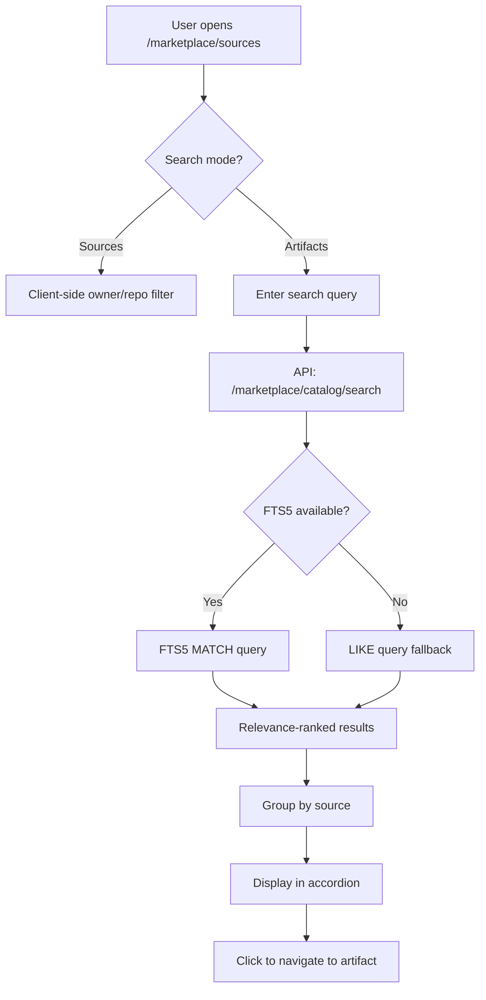

# Feature Brief & Metadata

**Feature Name:**

> Cross-Source Artifact Search

**Filepath Name:**

> `cross-source-artifact-search-v1`

**Date:**

> 2026-01-23

**Author:**

> Claude Opus 4.5

**Related Epic(s)/PRD ID(s):**

> SPIKE-2026-01-20-cross-source-artifact-search

**Related Documents:**

> - SPIKE: `docs/project_plans/SPIKEs/cross-source-artifact-search-spike.md`
> - Phase 0 PRD: `docs/project_plans/PRDs/enhancements/configurable-frontmatter-caching-v1.md` (COMPLETE)
> - Symbol references: `skillmeat/cache/models.py`, `skillmeat/api/routers/marketplace_sources.py`

---

## 1. Executive Summary

This feature enables users to search for artifacts across ALL marketplace sources from a single unified interface. Users can discover skills, agents, commands, and other artifacts by name, description, or tags without knowing which source repository contains them. The search leverages frontmatter metadata extracted during source scanning and provides relevance-ranked results.

**Priority:** HIGH

**Key Outcomes:**
- Users can search artifacts across 1000+ sources in <100ms
- Frontmatter metadata (title, description, tags) is extracted and persisted during scanning
- Dual-mode toggle allows switching between "search sources" and "search artifacts"
- FTS5 full-text search provides phrase, prefix, and boolean query support

---

## 2. Context & Background

### Current State

**Phase 0 Complete (Configuration Infrastructure):**
- Global `artifact_search.indexing_mode` configuration exists (off/on/opt_in)
- Per-source `indexing_enabled` boolean flag in MarketplaceSource model
- UI toggles in add/edit source modals
- API endpoint `/api/v1/config/artifact_search.indexing_mode`

**MarketplaceCatalogEntry Schema (Current - 15 columns):**
- Detection fields: `id`, `source_id`, `artifact_type`, `name`, `path`, `upstream_url`, `confidence_score`
- Import tracking: `status`, `import_date`, `import_id`, `excluded_at`, `excluded_reason`
- Metadata: `detected_version`, `detected_sha`, `path_segments`, `metadata_json`

**What's Missing:**
- ❌ `title` column - Cannot display proper artifact titles
- ❌ `description` column - Cannot show descriptions
- ❌ `search_tags` column - Cannot filter by tags across sources
- ❌ `search_text` column - Cannot search efficiently (denormalized FTS field)
- ❌ Search API endpoint
- ❌ Frontend search UI for artifacts

### Problem Space

**Pain Points:**

1. **No Cross-Source Discovery** - Users must navigate to each source individually to find artifacts; no way to search all 50+ sources at once
2. **Frontmatter Not Persisted** - SKILL.md frontmatter is parsed during scanning but not stored for search
3. **Source-Only Search** - Current search only filters sources by owner/repo name, not artifact content
4. **Poor Discovery UX** - Users who don't know which repo contains an artifact cannot find it

### Current Alternatives / Workarounds

- **Manual Source Navigation**: Browse each source individually (tedious with 50+ sources)
- **GitHub Search**: Use GitHub search outside SkillMeat (loses context, must reimport)
- **Browser Find**: Ctrl+F on sources page (only searches visible items)

### Architectural Context

Follows SkillMeat layered architecture:
- **Routers** - HTTP endpoints, return DTOs
- **Services/Managers** - Business logic, coordinate operations
- **Repositories** - Database I/O, pagination
- **Models** - SQLAlchemy ORM definitions

**Storage Estimates (from SPIKE):**
- Per artifact: ~850 bytes
- Per source (50 artifacts avg): ~42 KB
- 1000 sources: ~42 MB (acceptable)
- With FTS5 index: +50% overhead

---

## 3. Problem Statement

Users cannot discover artifacts across marketplace sources without manually navigating each repository. There is no search functionality that spans multiple sources.

**User Story Format:**
> "As a SkillMeat user exploring marketplace sources, when I'm looking for a specific skill or agent (e.g., 'python linting'), I have to manually check each source repository instead of searching across all sources at once."

**Technical Root Cause:**
- MarketplaceCatalogEntry lacks searchable columns (title, description, tags, search_text)
- No frontmatter extraction during source scanning
- No search API endpoint for catalog entries
- Frontend only supports source-level search, not artifact-level

---

## 4. Goals & Success Metrics

### Primary Goals

**Goal 1: Persist Searchable Frontmatter**
- Extract title, description, tags from frontmatter during source scanning
- Store in new columns on MarketplaceCatalogEntry
- Conditional on `indexing_enabled` per-source flag
- Success: 95% of SKILL.md frontmatter persisted for indexed sources

**Goal 2: API-Level Search**
- Create `/marketplace/catalog/search` endpoint
- Support query, type filter, confidence threshold, tag filter
- Return paginated results with source context
- Success: <100ms response time at 50K artifact scale

**Goal 3: FTS5 Full-Text Search**
- Create FTS5 virtual table with sync triggers
- Support phrase, prefix, boolean queries
- Provide relevance ranking and snippets
- Success: <10ms query time, BM25 relevance ranking

**Goal 4: Frontend Dual-Mode Toggle**
- Toggle between "search sources" and "search artifacts" modes
- Artifact search results grouped by source
- Graceful handling when indexing is disabled
- Success: Users switch modes in <1 click, results render <200ms

### Success Metrics

| Metric | Baseline | Target | Measurement Method |
|--------|----------|--------|-------------------|
| Search latency (LIKE) | N/A | <100ms at 50K | API timing logs |
| Search latency (FTS5) | N/A | <10ms at 50K | API timing logs |
| Frontmatter extraction rate | 0% | 95%+ for indexed sources | Database query |
| User search completion | 0 | 80% success rate | Analytics |
| Mode toggle usage | N/A | 40%+ use artifact mode | Analytics |

---

## 5. User Personas & Journeys

### Personas

**Primary Persona: Artifact Discoverer Dana**
- Role: Developer exploring marketplace for skills
- Needs: Find relevant skills by topic without knowing source
- Pain Points: Cannot search across sources; must browse individually

**Secondary Persona: Source Maintainer Mark**
- Role: Developer who manages multiple sources
- Needs: Verify artifacts appear in search correctly
- Pain Points: Cannot test cross-source discovery

### High-level Flow



---

## 6. Requirements

### 6.1 Functional Requirements

| ID | Requirement | Priority | Notes |
| :-: | ----------- | :------: | ----- |
| FR-1 | Add title, description, search_tags, search_text columns to MarketplaceCatalogEntry | Must | Alembic migration |
| FR-2 | Extract frontmatter during scanning when indexing_enabled=true | Must | Modify heuristic detector |
| FR-3 | Create `/marketplace/catalog/search` API endpoint | Must | Supports query, type, confidence, tags, pagination |
| FR-4 | Support LIKE-based search as baseline | Must | Phase 1 |
| FR-5 | Create FTS5 virtual table with sync triggers | Should | Phase 2 |
| FR-6 | Return snippet/highlight in search results | Should | FTS5 snippet() function |
| FR-7 | Create dual-mode toggle (sources/artifacts) in frontend | Must | Phase 3 |
| FR-8 | Display artifact results grouped by source | Must | Accordion component |
| FR-9 | Show "indexing disabled" message when mode is off | Should | Graceful degradation |
| FR-10 | Provide backfill script for existing entries | Should | One-time migration |

### 6.2 Non-Functional Requirements

**Performance:**
- LIKE search: <100ms at 50K entries
- FTS5 search: <10ms at 50K entries
- Frontend render: <200ms for 50 results
- Storage overhead: <100MB for 50K entries

**Security:**
- No sensitive data in search results
- Respect source visibility (public sources only)

**Accessibility:**
- Toggle has ARIA labels
- Search input properly labeled
- Results navigable by keyboard
- Screen reader announces result count

**Reliability:**
- FTS5 feature-detected at startup (fallback to LIKE)
- Search continues working if indexing disabled
- Graceful handling of malformed frontmatter

**Observability:**
- Log search queries at DEBUG level
- Track search latency in metrics
- Alert on search error rate >1%

---

## 7. Scope

### In Scope

- Alembic migration adding 4 columns + indexes to MarketplaceCatalogEntry
- Frontmatter extraction during source scanning (conditional on indexing_enabled)
- Repository search method with LIKE queries
- API endpoint `/marketplace/catalog/search`
- FTS5 virtual table and sync triggers
- Frontend dual-mode toggle component
- React Query hook for artifact search
- Grouped result display with accordions
- Backfill script for existing entries

### Out of Scope

- **Semantic/AI search** - Vector embeddings, semantic similarity (Future)
- **Search history** - Tracking popular searches (Future Phase 4)
- **Saved searches** - User-saved search filters (Future)
- **Cross-tenant search** - Multi-tenant isolation (N/A for v1)
- **Search analytics dashboard** - Admin metrics view (Future)

---

## 8. Dependencies & Assumptions

### External Dependencies

- **SQLite FTS5**: Must be compiled into SQLite build (feature-detect at startup)
- **React Query**: Already in use for frontend data fetching

### Internal Dependencies

- **Phase 0 Complete**: Configurable indexing infrastructure (DONE)
- **MarketplaceSource model**: indexing_enabled flag (DONE)
- **Heuristic detector**: Existing frontmatter parsing (Needs extension)
- **Frontend sources page**: Existing search toolbar (Needs extension)

### Assumptions

- SQLite FTS5 is available in deployment environment (feature-detect with fallback)
- Frontmatter structure is consistent across artifact types
- 50K artifacts is reasonable scale target for v1
- Users understand sources vs artifacts distinction

### Feature Flags

- `ARTIFACT_SEARCH_FTS5_ENABLED`: Enable FTS5 (fallback to LIKE if false)

---

## 9. Risks & Mitigations

| Risk | Impact | Likelihood | Mitigation |
| ----- | :----: | :--------: | ---------- |
| FTS5 not available in SQLite build | High | Low | Feature-detect at startup; fall back to LIKE queries |
| Large sources overwhelm search | Medium | Medium | Default confidence threshold; pagination limits |
| Frontmatter inconsistency across sources | Low | High | Lenient parsing; store empty strings for missing fields |
| Search performance degrades at scale | Medium | Low | FTS5 provides 5-10x improvement; add indexes |
| Index size exceeds expectations | Low | Low | Monitor; implement pruning for low-quality entries |
| Users confused by dual-mode | Medium | Medium | Clear toggle labels; tooltip explanation |

---

## 10. Target State (Post-Implementation)

### User Experience

**Searching for artifacts (artifact mode enabled):**
1. User navigates to /marketplace/sources
2. User clicks "Artifacts" toggle (vs "Sources")
3. User types "python linting" in search box
4. API returns matching artifacts from all indexed sources
5. Results display grouped by source in accordion
6. User clicks result to navigate to artifact detail

**Searching when indexing disabled:**
1. User has global indexing mode = "off"
2. User clicks "Artifacts" toggle
3. UI shows message: "Artifact search disabled. Enable indexing to search artifacts."
4. User can still use "Sources" mode

### Technical Architecture

**Database Schema:**
```python
# MarketplaceCatalogEntry additions
title: Mapped[Optional[str]] = mapped_column(String(200), nullable=True)
description: Mapped[Optional[str]] = mapped_column(Text, nullable=True)
search_tags: Mapped[Optional[str]] = mapped_column(Text, nullable=True)  # JSON array
search_text: Mapped[Optional[str]] = mapped_column(Text, nullable=True)  # Denormalized
```

**FTS5 Virtual Table:**
```sql
CREATE VIRTUAL TABLE catalog_fts USING fts5(
    name UNINDEXED,
    artifact_type UNINDEXED,
    title,
    description,
    search_text,
    tags,
    content='marketplace_catalog_entries',
    content_rowid='rowid',
    tokenize='porter unicode61 remove_diacritics 2'
);
```

**API Contract:**
```
GET /api/v1/marketplace/catalog/search
Query Parameters:
  - q: string (search query)
  - type: string (artifact type filter)
  - source_id: string (limit to source)
  - min_confidence: int (0-100)
  - tags: string (comma-separated)
  - limit: int (1-200, default 50)
  - cursor: string (pagination)

Response:
{
  "items": [
    {
      "id": "...",
      "name": "python-linter",
      "artifact_type": "skill",
      "title": "Python Linting Skill",
      "description": "Lint Python code using ruff",
      "search_tags": ["python", "linting", "ruff"],
      "confidence_score": 95,
      "source": {
        "id": "...",
        "owner": "anthropics",
        "repo_name": "skills"
      },
      "snippet": "...Python <mark>linting</mark> using..."
    }
  ],
  "page_info": {
    "has_next_page": true,
    "end_cursor": "..."
  },
  "total_count": 42
}
```

### Observable Outcomes

- Cross-source artifact search available in UI
- Search latency <100ms (LIKE) / <10ms (FTS5)
- 95%+ frontmatter extraction rate for indexed sources
- Users can discover artifacts without knowing source

---

## 11. Overall Acceptance Criteria (Definition of Done)

### Functional Acceptance

- [ ] Search query returns matching artifacts across all indexed sources
- [ ] Results include title, description, snippet, source context
- [ ] Filter by artifact type works
- [ ] Filter by minimum confidence works
- [ ] Tag filter works
- [ ] Cursor pagination works
- [ ] Dual-mode toggle switches between sources and artifacts
- [ ] Accordion groups results by source
- [ ] Click navigates to artifact detail
- [ ] "Indexing disabled" message appears when mode is off

### Technical Acceptance

- [ ] Alembic migration adds 4 columns + 3 indexes
- [ ] FTS5 virtual table created with sync triggers
- [ ] Frontmatter extracted during scan when indexing_enabled
- [ ] API returns <100ms at 50K scale (LIKE)
- [ ] API returns <10ms at 50K scale (FTS5)
- [ ] FTS5 feature-detected with LIKE fallback

### Quality Acceptance

- [ ] Unit tests for repository search method
- [ ] Unit tests for frontmatter extraction
- [ ] Integration tests for search API endpoint
- [ ] Component tests for toggle and results display
- [ ] E2E test for full search workflow
- [ ] Accessibility audit passes

### Documentation Acceptance

- [ ] API endpoint documented in OpenAPI spec
- [ ] Frontend component documented in Storybook
- [ ] Backfill script documented in README
- [ ] SPIKE document updated with Phase completion status

---

## 12. Assumptions & Open Questions

### Assumptions

- FTS5 available in production SQLite (feature-detect with fallback)
- Frontmatter structure consistent enough for lenient parsing
- 50K artifacts is sufficient scale for v1
- Users understand sources vs artifacts distinction

### Open Questions

- [x] **Q1**: Should search depth include README/SKILL.md body text?
  - **A**: No - start with frontmatter only; expand if users request body search

- [x] **Q2**: Default confidence threshold for search?
  - **A**: Default min_confidence=50, allow override via filter

- [ ] **Q3**: Should we track search analytics?
  - **A**: Defer to Phase 4; focus on core functionality first

- [x] **Q4**: How to handle sources with indexing_enabled=false?
  - **A**: Exclude from search results; show "some sources not indexed" note

---

## 13. Appendices & References

### Related Documentation

- **SPIKE**: `docs/project_plans/SPIKEs/cross-source-artifact-search-spike.md`
- **Phase 0 PRD**: `docs/project_plans/PRDs/enhancements/configurable-frontmatter-caching-v1.md`
- **MarketplaceCatalogEntry**: `skillmeat/cache/models.py`
- **Heuristic Detector**: `skillmeat/marketplace/detection/`
- **Frontend Sources Page**: `skillmeat/web/app/marketplace/sources/page.tsx`

### Symbol References

**Backend:**
- `skillmeat.cache.models.MarketplaceCatalogEntry` - Catalog entry model
- `skillmeat.cache.models.MarketplaceSource` - Source model with indexing_enabled
- `skillmeat.api.routers.marketplace_sources` - Existing API router
- `skillmeat.utils.frontmatter.parse_markdown_with_frontmatter` - Frontmatter parser

**Frontend:**
- `@/app/marketplace/sources/page.tsx` - Sources page
- `@/components/marketplace/source-filter-toolbar.tsx` - Filter toolbar
- `@/hooks/use-marketplace-sources.ts` - React Query hooks

### Prior Art

- **SQLite FTS5 Documentation**: https://sqlite.org/fts5.html
- **React Query Patterns**: Existing hooks in `skillmeat/web/hooks/`

---

## Implementation

### Phased Approach

**Phase 1: Database + Basic Search API (Est. 3 days)**
- Alembic migration for 4 new columns + indexes
- Modify heuristic detector to extract/persist frontmatter
- Create repository search method with LIKE queries
- Create `/marketplace/catalog/search` API endpoint
- Backfill script for existing entries

**Phase 2: FTS5 Enhancement (Est. 2 days)**
- Create FTS5 virtual table with sync triggers
- Add FTS5 search path with MATCH queries
- Snippet generation for result highlighting
- Feature detection with LIKE fallback

**Phase 3: Frontend UI (Est. 2 days)**
- Dual-mode toggle component (sources/artifacts)
- React Query hook for artifact search
- Grouped result display with accordions
- Loading states and error handling
- "Indexing disabled" graceful degradation

### Epics & User Stories Backlog

| Story ID | Short Name | Description | Acceptance Criteria | Estimate |
|----------|-----------|-------------|-------------------|----------|
| SEARCH-001 | Schema Migration | Add search columns to MarketplaceCatalogEntry | Migration runs, columns exist, indexes created | 3 pts |
| SEARCH-002 | Frontmatter Extraction | Extract frontmatter during scan | title/description/tags populated for indexed sources | 5 pts |
| SEARCH-003 | Search Repository | Create repository search method | LIKE query returns matching entries | 3 pts |
| SEARCH-004 | Search API | Create /marketplace/catalog/search endpoint | Endpoint works with filters, pagination | 3 pts |
| SEARCH-005 | Backfill Script | Backfill existing entries | Script runs, existing entries populated | 2 pts |
| SEARCH-006 | FTS5 Table | Create FTS5 virtual table | Virtual table created, triggers work | 3 pts |
| SEARCH-007 | FTS5 Search | FTS5 MATCH query with ranking | <10ms queries, relevance ranking | 2 pts |
| SEARCH-008 | Feature Detection | Detect FTS5 availability | Fallback to LIKE if unavailable | 1 pt |
| SEARCH-009 | Mode Toggle | Dual-mode toggle component | Toggle switches modes, state persists | 3 pts |
| SEARCH-010 | Search Hook | React Query hook for artifact search | Hook fetches, caches, handles errors | 2 pts |
| SEARCH-011 | Results Display | Grouped accordion results | Results grouped by source, navigable | 3 pts |
| SEARCH-012 | Graceful Degradation | Handle indexing disabled | Message shown, sources mode still works | 1 pt |

**Total Estimate**: 31 story points (~7 days)

---

**Progress Tracking:**

See progress tracking: `.claude/progress/cross-source-artifact-search-v1/`

---

**Implementation Notes:**

1. **Frontmatter Extraction Point**: Modify `skillmeat/marketplace/detection/` to call frontmatter parser when creating catalog entries. Check `source.indexing_enabled` before storing.

2. **FTS5 Feature Detection**: At app startup, run `SELECT sqlite_version()` and attempt to create a test FTS5 table. Set global flag for query path selection.

3. **Backfill Strategy**: Create script that iterates existing entries, fetches SKILL.md from GitHub cache if available, parses frontmatter, updates entry. Run as one-time migration.

4. **Mode Toggle State**: Store in URL query param (`?mode=artifacts`) for shareable links and browser back/forward.

5. **Performance Indexes**: Create indexes on `(artifact_type, status)`, `confidence_score`, and `name` for common query patterns.
