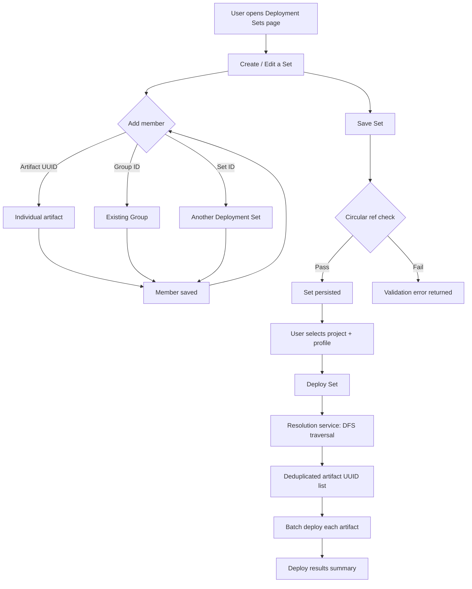

# Feature Brief & Metadata

**Feature Name:**

> Deployment Sets

**Filepath Name:**

> `deployment-sets-v1`

**Date:**

> 2026-02-23

**Author:**

> Claude (Sonnet 4.6) — PRD Writer

**Related Epic(s)/PRD ID(s):**

> REQ-20260211-skillmeat-01

**Related Documents:**

> - `docs/project_plans/PRDs/features/enhanced-platform-profiles-v1.md` — Platform Profiles (prerequisite deployment layer)
> - `skillmeat/cache/models.py` — Group, GroupArtifact, DeploymentProfile ORM models
> - `skillmeat/api/routers/groups.py` — Existing Groups API (reference for conventions)
> - `skillmeat/api/routers/deployments.py` — Existing deploy/undeploy endpoints

---

## 1. Executive Summary

Deployment Sets are composable, user-scoped bundles of artifacts that can be deployed to a project in a single action. Unlike Groups (which are organizational and collection-scoped), Deployment Sets are operational — they reference artifacts, groups, or other sets; resolve all members recursively; and batch-deploy the deduplicated result to a target project and profile.

**Priority:** HIGH

**Key Outcomes:**
- Users build reusable deployment bundles once, apply them to any project in one click.
- Sets nest and chain: a "Full-Stack Dev" set can compose "Backend Dev" + "Frontend Dev" + "Planning" sets without duplication.
- Batch deploy replaces repetitive per-artifact deploy actions.

---

## 2. Context & Background

### Current state

SkillMeat has two separate organizational concepts:

- **Groups** (`groups` table): collection-scoped, purely organizational containers of artifacts. They have no deployment behavior; they exist only to declutter large collections.
- **Deployments** (`deployment_profiles` + TOML-backed `Deployment` dataclass): project-scoped records of which artifacts are installed to a project under a given platform profile.

There is no link between Groups and Deployments. Deploying a "Backend Dev" group to a new project requires individually deploying each artifact — potentially 10+ manual actions.

### Problem space

Each new project requires a repetitive, error-prone setup: find all desired artifacts, deploy each one individually, and hope no artifact is missed. Users who maintain large collections (50+ artifacts) grouped by domain have no way to say "deploy this domain bundle to this project."

### Current alternatives

Users either deploy artifacts one-by-one or maintain per-project manifest files manually. Neither approach is reusable or discoverable from the web UI.

### Architectural context

SkillMeat follows a layered architecture: **Routers** handle HTTP and delegate to **Services** (business logic), which delegate to **Repositories** (all DB I/O). The DB cache is the web's source of truth; the filesystem is the CLI's source of truth. Write-through pattern: DB write first for web mutations, then FS sync. All API responses return DTOs, never ORM models.

---

## 3. Problem Statement

> "As a power user, when I start a new project, I deploy the same 15-20 artifacts individually every time instead of applying a saved bundle of my standard toolset."

**Technical root cause:**
- No data model linking reusable artifact groupings to the deployment layer.
- No batch-deploy service method that accepts a set of artifact UUIDs.
- Groups are collection-scoped and have no operational semantics.

---

## 4. Goals & Success Metrics

### Primary goals

**Goal 1: Composable deployment bundles**
- Users can create named Deployment Sets that reference individual artifacts (by `artifact_uuid`), Groups (by `group_id` as string UUID), and other Deployment Sets (by `set_id` as string UUID).
- Composition forms a DAG — circular references are rejected at write time.

**Goal 2: One-action batch deploy**
- "Deploy Set to Project" recursively resolves all member references, deduplicates by `artifact_uuid`, and invokes the existing deploy service for each resolved artifact against a chosen project+profile.

**Goal 3: Set management UI**
- Users can create, edit, clone, delete, and view Deployment Sets from the web app.
- Each set displays its resolved member count and nesting depth.

### Success metrics

| Metric | Baseline | Target | Measurement method |
|--------|----------|--------|-------------------|
| Time to deploy 15 artifacts to a new project | ~5 min (manual) | <30 sec (one action) | Manual timing |
| Circular-reference accepted at API | N/A (no sets exist) | 0 accepted | API integration test |
| Batch deploy latency (50 artifacts) | N/A | <5 sec | Performance test |
| Unit test coverage on resolution logic | N/A | >90% | pytest --cov |

---

## 5. User personas & journeys

### Personas

**Primary: Power User**
- Role: Individual developer with a large, well-organized collection
- Needs: Replicate their personal toolset across projects instantly
- Pain points: Repetitive manual artifact deployment; no way to save a "standard setup"

**Secondary: Team Lead**
- Role: Manages shared team collections; onboards others to projects
- Needs: Standardized set definitions others can clone and customize
- Pain points: No sharable, versionable bundle concept exists

### High-level flow



---

## 6. Requirements

### 6.1 Functional requirements

| ID | Requirement | Priority | Notes |
|:--:|-------------|:--------:|-------|
| FR-1 | Create a named Deployment Set with optional description, tags, color, and icon | Must | Mirrors Group metadata fields |
| FR-2 | Add members to a set: artifact by `artifact_uuid`, group by `group_id`, or nested set by `set_id` | Must | `group_id` and `set_id` are string UUIDs. Each member has optional `position` for display ordering |
| FR-3 | Remove members from a set | Must | |
| FR-4 | Reject circular references at write time (set A cannot reference a set that transitively references A) | Must | Traversal check before insert |
| FR-5 | Resolve a set recursively: depth-first traversal of the member DAG, expanding groups and nested sets, deduplicating by `artifact_uuid` | Must | Resolution is read-only; does not mutate any records |
| FR-6 | Batch deploy a resolved set to a target project + deployment profile | Must | Invokes existing per-artifact deploy service via adapter (`artifact_uuid` -> deploy request fields + project path resolution); returns per-artifact success/failure |
| FR-7 | List all Deployment Sets (paginated, with resolved member count) | Must | |
| FR-8 | Read a single Deployment Set with its direct members and resolved artifact count | Must | |
| FR-9 | Update a Deployment Set's metadata (name, description, tags, color, icon) | Must | |
| FR-10 | Delete a Deployment Set; cascade-delete its `DeploymentSetMember` rows | Must | Sets that are members of other sets are removed from those sets (no hard block) |
| FR-11 | Clone a Deployment Set: duplicate the set and all its direct member rows | Should | Cloned set gets a new name suffix "(copy)" |
| FR-12 | Reorder members within a set | Should | Update `position` column via PATCH |
| FR-13 | Filter/search sets by name or tag from the list endpoint | Should | |

### 6.2 Non-functional requirements

**Performance:**
- Resolution for a set with up to 100 members across 5 nesting levels completes in <500 ms.
- Batch deploy for 50 artifacts completes in <5 sec (network-bound, not CPU-bound).

**Security:**
- Sets are user-scoped. The `owner_id` field on `DeploymentSet` is populated from authenticated claims when auth is enabled; when auth is disabled, use a single-user fallback owner identity. Sets belonging to other users are not readable or writable.
- No SQL injection risk: all queries use ORM parameterized statements.

**Accessibility:**
- All set management UI components meet WCAG 2.1 AA: keyboard navigation for member list, focus management in add-member modal.

**Reliability:**
- Batch deploy is not atomic by default in V1. Each artifact deploys independently; partial failures are reported in the response summary.
- Circular-reference check must be O(n) amortized for practical set sizes (<1000 nodes).

**Observability:**
- Structured log entries with `set_id`, `project_id`, `profile_id`, `resolved_count` on batch deploy.
- Resolution errors (circular ref detected, missing member) emit a `WARNING`-level log entry with full traversal path.

---

## 7. Scope

### In scope (V1)

- `DeploymentSet` and `DeploymentSetMember` DB models, Alembic migration, and repository layer.
- Service layer: CRUD, member management, recursive resolution, circular-reference detection, batch deploy.
- REST API: full CRUD + member management + resolve (dry-run) + deploy-set endpoints.
- Web UI: Deployment Sets list page, set detail/edit page, add-member dialog, batch deploy action with result summary.
- Clone set action (API + UI).

### Out of scope (V1 — future)

- **CLI auto-scan**: Scanning a project directory to suggest or build a Deployment Set automatically (future; referenced in source request as expansion).
- **Drag-and-drop visual builder**: A canvas-based set composition UI (future).
- **Memory/Context Pack linking**: Attaching Memory items or Context Packs to sets or individual agents (future).
- **Shared/team sets**: Cross-user set sharing or a marketplace for sets (future).
- **Auto-grouping**: Automatically grouping collection artifacts (separate backlog item REQ-20260130).
- **Atomic batch deploy**: Rollback of partially-deployed sets on failure (future; V1 returns per-artifact result summary).

---

## 8. Dependencies & assumptions

### External dependencies

- **SQLAlchemy + Alembic**: ORM and migration toolchain (already in use).
- **FastAPI**: REST endpoint framework (already in use).
- **React Query + shadcn/ui**: Frontend data fetching and UI primitives (already in use).

### Internal dependencies

- **Groups model** (`skillmeat/cache/models.py` — `Group`, `GroupArtifact`): Sets reference groups by `group_id`; the resolution service reads `GroupArtifact` rows to expand a group into its constituent artifact UUIDs.
- **DeploymentProfile + deploy service** (`skillmeat/api/routers/deployments.py`, core deploy logic): Batch deploy calls per-artifact deploy through an adapter from resolved UUIDs to deploy request contract (`artifact_id`, `artifact_name`, `artifact_type`, `project_path`).
- **ADR-007 `artifact_uuid`**: Stable identifier used as deduplication key during resolution. All resolved members normalize to `artifact_uuid`.

### Assumptions

- V1 targets single-user local deployment; multi-user row-level security on sets is deferred.
- Groups are not modified by this feature; sets reference them read-only.
- The existing per-artifact deploy service is idempotent (deploying an already-deployed artifact is a no-op or graceful overwrite).
- Deployment Set writes are DB-authoritative in V1; manifest/file write-through for sets is deferred, but warning-level observability is required for resolution/deploy failures.
- Resolution depth will not exceed 10 levels in practice; a hard depth limit of 20 is enforced to prevent runaway traversal.

### Feature flags

- `deployment_sets_enabled` (default: `true`): Gates the entire feature in the web UI nav. Can be toggled during rollout.
- Backend config and frontend nav/page affordances must both honor the feature flag state.

---

## 9. Risks & mitigations

| Risk | Impact | Likelihood | Mitigation |
|------|:------:|:----------:|------------|
| Circular reference in nested sets causes infinite loop during resolution | High | Medium | Enforce DAG check at write time using descendant reachability (FR-4); add a depth-limit guard (20 levels) in the resolution traversal as a safety net |
| Batch deploy partial failure leaves project in inconsistent state | Medium | Medium | Return per-artifact `{artifact_uuid, status, error}` list; log all failures; provide UI retry per-failed artifact in future version |
| Resolved UUIDs do not match deploy API request contract | High | Medium | Add service adapter for UUID -> deploy request fields and cover adapter failures in integration tests |
| ORM model → DTO schema divergence (same issue as platform profiles) | Medium | Low | Code-generate or manually mirror field names at time of model creation; add integration test asserting round-trip |
| Missing feature-flag wiring exposes incomplete UI | Medium | Medium | Wire `deployment_sets_enabled` in backend config and frontend nav/page checks with explicit ON/OFF tests |
| Resolution of large sets (100+ members, 5+ levels) is slow | Low | Low | Add DB indexes on `deployment_set_members(set_id)`, `member_set_id`, and `(set_id, position)`; benchmark during Phase 1 |

---

## 10. Target state (post-implementation)

**User experience:**
- A "Deployment Sets" top-level nav item appears in the web app.
- Users create sets by giving them a name and adding members from a searchable picker (artifacts, groups, other sets).
- The set detail view shows direct members (with type badges: Artifact / Group / Set) and a "Resolved: N artifacts" count.
- "Deploy to Project" opens a modal to select the target project and profile, then dispatches the batch deploy and shows a per-artifact result table.

**Technical architecture:**
- Two new ORM tables: `deployment_sets` (set metadata) and `deployment_set_members` (polymorphic join: member is artifact UUID, group ID, or set ID).
- `DeploymentSetRepository` handles all DB I/O; `DeploymentSetService` owns resolution logic and calls the existing deploy service.
- New router at `/deployment-sets` with endpoints for CRUD, member management, resolve (dry-run), and batch deploy.
- Frontend: Next.js App Router pages at `/deployment-sets` and `/deployment-sets/[id]`; React Query hooks for all data fetching; shadcn card/table/dialog primitives for UI.

**Observable outcomes:**
- Average new-project setup time decreases from ~5 minutes (manual) to under 30 seconds.
- Zero circular-reference incidents reach resolution service (all caught at write time).

---

## 11. Overall acceptance criteria (definition of done)

### Functional acceptance

- [ ] FR-1 through FR-13 implemented and manually verified via the web UI.
- [ ] Circular-reference rejection verified: creating set A → B → A returns HTTP 422.
- [ ] Batch deploy of a 3-level nested set deploys all unique artifacts to a test project; duplicates appear only once.
- [ ] FR-10 delete semantics verified: deleting a set removes inbound parent references (no hard block).
- [ ] Clone action produces an independent copy: editing the clone does not affect the source.

### Technical acceptance

- [ ] Follows SkillMeat layered architecture (router → service → repository).
- [ ] All API responses return DTOs (no ORM model serialization exposed).
- [ ] Resolution service is stateless and testable without DB (accepts in-memory member maps).
- [ ] Alembic migration is reversible (`downgrade` path implemented).
- [ ] Depth-limit guard (20 levels) raises a `DeploymentSetResolutionError` with a clear message.
- [ ] Batch deploy adapter correctly maps `artifact_uuid` and project/profile identifiers to current deploy request contract.
- [ ] Router is registered in `skillmeat/api/server.py` and starts cleanly.

### Quality acceptance

- [ ] Unit tests for resolution logic achieve >90% branch coverage (pytest).
- [ ] Integration tests cover all `/deployment-sets` endpoints (create, list, read, update, delete, clone, add-member, remove-member, update-member-position, resolve, deploy-set).
- [ ] Performance test: resolution of 100-member 5-level set completes in <500 ms.
- [ ] Frontend: `pnpm type-check` passes with no new errors.
- [ ] Accessibility: keyboard navigation through member list and add-member dialog works without a mouse.
- [ ] Warning-level logs include traversal path for resolution failures (cycle/missing member).

### Documentation acceptance

- [ ] OpenAPI spec auto-generated from FastAPI router; no manual edits to `openapi.json` required.
- [ ] Frontend hooks documented in `skillmeat/web/hooks/index.ts` exports.

---

## 12. Assumptions & open questions

### Assumptions

- Sets are user-scoped in V1 with no sharing mechanism; `owner_id` is derived from auth claims when enabled, with single-user fallback identity when auth is disabled.
- Member `position` is a float (to allow gap-free reordering without rewriting all positions), consistent with the existing `GroupArtifact.position` convention.
- The resolution dry-run endpoint (`GET /deployment-sets/{id}/resolve`) returns the flattened `artifact_uuid` list without executing any deploy action.

### Open questions

- [ ] **Q1**: Should deleting a set that is a member of another set hard-block the delete, or silently remove the reference?
  - **A**: V1 silently removes the reference (soft delete from parent sets). This avoids cascade complexity and matches how artifact deletion from groups works today.
- [ ] **Q2**: Should sets be scoped to a collection or to the user globally?
  - **A**: User-scoped globally (not bound to a specific collection). Sets compose across the whole collection; this avoids the complication of which collection a set belongs to when artifacts span multiple sources.
- [ ] **Q3**: Should the batch deploy endpoint support a "dry run" flag?
  - **A**: Yes. The separate `GET /deployment-sets/{id}/resolve` endpoint serves as the dry-run (returns artifact list without deploying). The `POST /deployment-sets/{id}/deploy` endpoint always executes.

---

## 13. Appendices & references

### Related documentation

- **Enhanced Platform Profiles PRD**: `docs/project_plans/PRDs/features/enhanced-platform-profiles-v1.md`
- **Groups API**: `skillmeat/api/routers/groups.py`
- **Deploy API**: `skillmeat/api/routers/deployments.py`
- **ORM models**: `skillmeat/cache/models.py`

### Data model (reference)

```python
# New ORM models (to be added in skillmeat/cache/models.py)

class DeploymentSet(Base):
    __tablename__ = "deployment_sets"
    id: Mapped[str] = mapped_column(String, primary_key=True, default=lambda: uuid.uuid4().hex)
    name: Mapped[str] = mapped_column(String(255), nullable=False)
    description: Mapped[str | None]
    color: Mapped[str | None] = mapped_column(String(7))   # hex color
    icon: Mapped[str | None] = mapped_column(String(64))
    tags_json: Mapped[str | None]                          # JSON array of strings
    owner_id: Mapped[str] = mapped_column(String, nullable=False, default="local-user")
    created_at: Mapped[datetime]
    updated_at: Mapped[datetime]
    members: Mapped[list["DeploymentSetMember"]] = relationship(
        cascade="all, delete-orphan"
    )

class DeploymentSetMember(Base):
    __tablename__ = "deployment_set_members"
    id: Mapped[str] = mapped_column(String, primary_key=True, default=lambda: uuid.uuid4().hex)
    set_id: Mapped[str] = mapped_column(ForeignKey("deployment_sets.id", ondelete="CASCADE"), index=True)
    # Polymorphic member reference — exactly one of the three is non-null
    artifact_uuid: Mapped[str | None]  # ADR-007 stable UUID
    group_id: Mapped[str | None]       # references groups.id (string UUID)
    member_set_id: Mapped[str | None]  # references deployment_sets.id (nesting)
    position: Mapped[float] = mapped_column(default=0.0)
    added_at: Mapped[datetime]
    __table_args__ = (
        CheckConstraint(
            "(artifact_uuid IS NOT NULL) + (group_id IS NOT NULL) + (member_set_id IS NOT NULL) = 1",
            name="ck_deployment_set_member_exactly_one_ref",
        ),
        Index("idx_deployment_set_members_set_id", "set_id"),
        Index("idx_deployment_set_members_member_set_id", "member_set_id"),
        Index("idx_deployment_set_members_set_position", "set_id", "position"),
    )
```

### API surface (reference)

| Method | Path | Description |
|--------|------|-------------|
| GET | `/deployment-sets` | List sets (paginated, filterable) |
| POST | `/deployment-sets` | Create set |
| GET | `/deployment-sets/{id}` | Get set with direct members |
| PATCH | `/deployment-sets/{id}` | Update set metadata |
| DELETE | `/deployment-sets/{id}` | Delete set and members |
| POST | `/deployment-sets/{id}/clone` | Clone set |
| POST | `/deployment-sets/{id}/members` | Add member (artifact / group / set) |
| DELETE | `/deployment-sets/{id}/members/{member_id}` | Remove member |
| PATCH | `/deployment-sets/{id}/members/{member_id}` | Update member position |
| GET | `/deployment-sets/{id}/resolve` | Dry-run: return resolved artifact UUID list |
| POST | `/deployment-sets/{id}/deploy` | Batch deploy to project + profile |

---

## Implementation

### Phased approach

**Phase 1: Database + repository layer**
- Duration: 1–2 days
- Tasks:
  - [ ] Add `DeploymentSet` and `DeploymentSetMember` ORM models to `skillmeat/cache/models.py`
  - [ ] Write Alembic migration (upgrade + downgrade)
  - [ ] Implement `DeploymentSetRepository` with CRUD, member add/remove, position update
  - [ ] Unit tests for repository layer (pytest + SQLite in-memory)

**Phase 2: Service layer**
- Duration: 1–2 days
- Tasks:
  - [ ] Implement `DeploymentSetService` with CRUD delegation to repository
  - [ ] Implement `resolve(set_id)` → deduplicated `list[str]` of `artifact_uuid` (DFS traversal, depth limit 20)
  - [ ] Implement circular-reference check: on `add_member` with a nested set, use descendant reachability from candidate set to detect cycles
  - [ ] Implement `batch_deploy(set_id, project_id, profile_id)` with adapter from resolved UUIDs to deploy request contract; returns `list[{artifact_uuid, status, error}]`
  - [ ] Unit tests: resolution with 3-level nesting, circular-ref detection, deduplication

**Phase 3: API layer**
- Duration: 1 day
- Tasks:
  - [ ] Create `skillmeat/api/schemas/deployment_sets.py` with all request/response DTOs
  - [ ] Create `skillmeat/api/routers/deployment_sets.py` with all 11 endpoints
  - [ ] Register router in `skillmeat/api/server.py`
  - [ ] Enforce owner scoping from auth claims (single-user fallback when auth is disabled)
  - [ ] Integration tests for all endpoints (FastAPI TestClient)

**Phase 4: Frontend — set management**
- Duration: 2 days
- Tasks:
  - [ ] Add `DeploymentSet` and `DeploymentSetMember` TypeScript types to `skillmeat/web/types/deployment-sets.ts`
  - [ ] Add React Query hooks: `useDeploymentSets`, `useDeploymentSet`, `useCreateSet`, `useUpdateSet`, `useDeleteSet`, `useCloneSet`, `useAddMember`, `useRemoveMember`, `useResolveSet`
  - [ ] Deployment Sets list page: `skillmeat/web/app/deployment-sets/page.tsx`
  - [ ] Set detail/edit page: `skillmeat/web/app/deployment-sets/[id]/page.tsx`
  - [ ] Add-member dialog: `skillmeat/web/components/deployment-sets/add-member-dialog.tsx`
  - [ ] Member list with type badges (Artifact / Group / Set)
  - [ ] Gate Deployment Sets nav/page affordances behind `deployment_sets_enabled`

**Phase 5: Frontend — batch deploy**
- Duration: 1 day
- Tasks:
  - [ ] `useBatchDeploySet` React Query mutation hook
  - [ ] Deploy-to-Project modal: project + profile selector, then dispatch batch deploy
  - [ ] Deploy result table: per-artifact status (success / skip / error)
  - [ ] Add "Deploy Set" button to set detail page and set list card

**Phase 6: Testing + documentation**
- Duration: 1 day
- Tasks:
  - [ ] Integration tests: circular-ref API test, batch deploy adapter path, and FR-10 delete semantics
  - [ ] Performance test: resolution of 100-member 5-level set
  - [ ] `pnpm type-check` clean run
  - [ ] Update `skillmeat/web/hooks/index.ts` exports
  - [ ] Verify `deployment_sets_enabled` feature-flag behavior for nav/page affordances

### Epics & user stories backlog

| Story ID | Short name | Description | Acceptance criteria | Estimate |
|----------|-----------|-------------|---------------------|----------|
| DS-001 | DB models + migration | Add `DeploymentSet` + `DeploymentSetMember` ORM tables | Alembic upgrade runs clean; downgrade reverts | 2 pt |
| DS-002 | Repository CRUD | `DeploymentSetRepository` create/read/update/delete/list + FR-10 parent-reference cleanup | All repo methods covered by unit tests | 2 pt |
| DS-003 | Member management | Repository add/remove/reorder members | Position updates persist; position float gap reordering works | 1 pt |
| DS-004 | Resolution service | DFS resolution with dedup and depth limit | 3-level nest resolves correctly; cycle input raises error | 3 pt |
| DS-005 | Circular-ref detection | On add-member (nested set), detect cycle before insert via candidate descendant reachability | API returns 422 for A→B→A; valid DAG accepted | 2 pt |
| DS-006 | Batch deploy service | `batch_deploy` adapts resolved UUIDs to existing deploy request contract | Returns per-artifact result list; partial failure does not abort | 2 pt |
| DS-007 | REST API (CRUD) | All 11 endpoints implemented and registered | Integration tests pass for all endpoints | 3 pt |
| DS-008 | Clone endpoint | `POST /deployment-sets/{id}/clone` duplicates set + members | Clone is independent; modifying clone does not affect source | 1 pt |
| DS-009 | Frontend types + hooks | TS types and React Query hooks for all set operations | `pnpm type-check` clean | 2 pt |
| DS-010 | Set list page | `/deployment-sets` page with card grid, search, create action | Renders sets with member count; empty state handled | 2 pt |
| DS-011 | Set detail/edit page | `/deployment-sets/[id]` with member list and metadata edit | Members list with type badges; inline name edit | 3 pt |
| DS-012 | Add-member dialog | Searchable picker for artifact / group / set with type toggle | Selecting item calls add-member API; list refreshes | 2 pt |
| DS-013 | Batch deploy UI | Deploy modal + result table | Project+profile selected; per-artifact results displayed | 2 pt |
| DS-014 | Testing + polish | Integration tests, perf test, accessibility pass | All acceptance criteria in §11 checked | 2 pt |

**Total estimate:** 32 points

---

**Progress tracking:**

See progress tracking: `.claude/progress/deployment-sets-v1/all-phases-progress.md`
