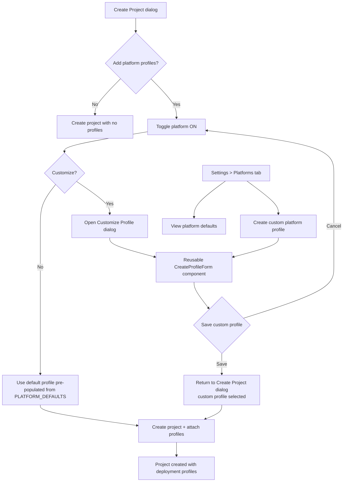

# Feature Brief & Metadata

**Feature Name:**

> Enhanced Platform Profiles

**Filepath Name:**

> `enhanced-platform-profiles-v1`

**Date:**

> 2026-02-22

**Author:**

> Claude Sonnet 4.6 (PRD Writer)

**Related Documents:**

> - `skillmeat/cache/models.py` - DeploymentProfile ORM model (lines 399-460)
> - `skillmeat/api/schemas/deployment_profiles.py` - Pydantic request/response schemas
> - `skillmeat/api/routers/deployment_profiles.py` - Full CRUD router
> - `skillmeat/web/lib/constants/platform-defaults.ts` - Frontend platform constant mirror
> - `skillmeat/web/app/projects/[id]/profiles/page.tsx` - Current inline profile form
> - `skillmeat/web/app/settings/page.tsx` - Current settings page

---

## 1. Executive summary

SkillMeat's deployment-profile system defines how artifacts are deployed to agentic platforms (Claude Code, Codex, Gemini, Cursor, Other), but the profile configuration workflow is split across two disconnected surfaces, lacks a usable description field, and cannot be accessed during project creation. This PRD delivers a cohesive profile management experience: a reusable Create Profile component, a `description` field on the model, a multi-select artifact-type picker with auto-populated path maps, profile selection inside the Create Project dialog, and a new Platforms settings tab.

**Priority:** HIGH

**Key Outcomes:**
- Users configure the right platform profile at project creation time, reducing post-creation rework.
- Platform profile UI is reusable and consistent across all surfaces (project profiles page, settings, create-project dialog).
- Platform management is centralised in Settings > Platforms so global custom profiles can be created and maintained without navigating to a specific project.

---

## 2. Context & background

### Current state

**Backend:** Full CRUD for `DeploymentProfile` exists.

| Layer | File | Status |
|---|---|---|
| ORM model | `skillmeat/cache/models.py` lines 399-460 | No `description` column |
| Repository | `skillmeat/cache/repositories.py` | Functional, no description |
| API schema | `skillmeat/api/schemas/deployment_profiles.py` | No `description` field in any schema class |
| Router | `skillmeat/api/routers/deployment_profiles.py` | Full CRUD (POST, GET list, GET one, PUT, DELETE) |

Key ORM fields: `id`, `project_id`, `profile_id`, `platform`, `root_dir`, `artifact_path_map` (JSON), `config_filenames` (JSON), `context_prefixes` (JSON), `supported_types` (JSON). No `description` column exists.

The `platform` column is constrained to `('claude_code', 'codex', 'gemini', 'cursor', 'other')`.

**Frontend:** Three disconnected surfaces.

| Surface | File | Gap |
|---|---|---|
| Create Project dialog | `web/app/projects/components/create-project-dialog.tsx` | Name, path, description only; no profile selection |
| Project Profiles page | `web/app/projects/[id]/profiles/page.tsx` | Inline Create Profile form; not extracted as a component |
| Settings page | `web/app/settings/page.tsx` | Platform Defaults + Custom Context sections inline; no Platforms tab |

`PLATFORM_DEFAULTS` in `web/lib/constants/platform-defaults.ts` mirrors backend defaults for five platforms. `ArtifactType` values: `'skill' | 'command' | 'agent' | 'mcp' | 'hook' | 'composite'`. `Platform` enum: `CLAUDE_CODE, CODEX, GEMINI, CURSOR, OTHER`.

### Problem space

Users who create a project and want artifact deployment on a non-default platform must navigate to Settings, then navigate to the project profiles page, then create a profile manually from scratch. There is no guidance on which artifact types a platform supports, no description to distinguish profiles, and no way to associate a profile at project creation time.

### Current alternatives / workarounds

Users create the project, then manually navigate to `Projects > [id] > Profiles` and fill in the raw JSON fields without any pre-population. Platform defaults are displayed in Settings but are read-only and not linked to profile creation.

### Architectural context

SkillMeat uses a layered architecture:
- **Routers** (`skillmeat/api/routers/`) - HTTP surface, Pydantic validation, delegate to repositories.
- **Repositories** (`skillmeat/cache/repositories.py`) - All DB I/O via SQLAlchemy ORM.
- **ORM Models** (`skillmeat/cache/models.py`) - SQLAlchemy mapped columns; schema changes require Alembic migrations.
- **Frontend** (`skillmeat/web/`) - Next.js 15 App Router, TanStack Query, shadcn/ui, TypeScript.

---

## 3. Problem statement

**User story:**
> "As a power user setting up a new project for Cursor, when I open the Create Project dialog I cannot select or customise a deployment profile, so I must complete project creation and then navigate to a separate page to configure it — rather than finishing setup in one workflow."

**Technical root causes:**
- `DeploymentProfile` ORM model has no `description` column; API schemas have no `description` field.
- The Create Profile form is inlined in `projects/[id]/profiles/page.tsx` and is not a standalone, reusable component.
- The Create Project dialog (`create-project-dialog.tsx`) has no knowledge of `DeploymentProfile` and makes no API calls to the deployment-profiles router.
- `supported_types` (ORM column name) is exposed as `supported_artifact_types` in the API schema — this naming divergence must be managed carefully to avoid drift.
- The Settings page has no Platforms tab; Platform Defaults are display-only.

---

## 4. Goals & success metrics

### Primary goals

**Goal 1: Unified profile creation component**
- Extract Create Profile form into a standalone React component.
- Render correctly in both page context (full width) and dialog/modal context (constrained width).

**Goal 2: Profile selection at project creation**
- Add a "Platform Profiles" accordion/section to Create Project dialog.
- Toggling a platform auto-selects the default profile; users can customise via a nested dialog.
- Custom profiles list with descriptions is shown when available.

**Goal 3: Improved form UX for profile creation**
- Multi-select for `supported_artifact_types` sourced from the `ArtifactType` enum.
- Placing supported types immediately after `root_dir` in field order.
- Selecting types auto-populates `artifact_path_map` JSON from `PLATFORM_DEFAULTS`.
- Informational tooltips on every field.

**Goal 4: Description field on DeploymentProfile**
- Add optional `description` (TEXT, nullable) to DB model and Alembic migration.
- Surface in create, update, and read API schemas.
- Display in profile lists, selection UIs, and edit forms.

**Goal 5: Settings > Platforms tab**
- Move Platform Defaults component to a new Platforms tab.
- Add custom profile creation UI (create global or project-scoped custom profiles).
- Support optional platform profiles config file for CLI users.

### Success metrics

| Metric | Baseline | Target | Measurement method |
|---|---|---|---|
| Profile configured at project creation | 0% of new projects | >50% of new projects | DB query: projects with ≥1 deployment_profile at creation time |
| Create Profile form rendering | Page only | Page + dialog + settings tab | Manual QA in all three contexts |
| Artifact type multi-select coverage | Manual JSON only | Auto-populated for all 5 platforms | QA: select platform, verify path map JSON populates |
| `description` round-trip | N/A (field absent) | Present in create/read/update | API integration test |
| Settings Platforms tab accessible | No tab | Tab renders and lists defaults | E2E navigation test |

---

## 5. User personas & journeys

### Personas

**Primary persona: Power User**
- Role: Developer who manages multiple agentic platforms (Claude Code for personal use, Cursor for work).
- Needs: Fast, accurate profile setup at project creation; ability to create reusable custom profiles globally.
- Pain points: Must navigate through 3+ pages to configure a second platform; no descriptions make profiles indistinguishable.

**Secondary persona: First-time User**
- Role: New SkillMeat user setting up their first project.
- Needs: Guided defaults; tooltips explaining what each field means; pre-populated values.
- Pain points: Raw JSON fields with no guidance; no indication which artifact types each platform supports.

### High-level flow

---

## 6. Requirements

### 6.1 Functional requirements

| ID | Requirement | Priority | Notes |
|:-:|---|:-:|---|
| FR-01 | Add optional `description` TEXT column to `deployment_profiles` table via Alembic migration | Must | Nullable; backward-compatible |
| FR-02 | Add `description: Optional[str]` to `DeploymentProfileCreate`, `DeploymentProfileUpdate`, and `DeploymentProfileRead` Pydantic schemas | Must | Matches column name exactly |
| FR-03 | Update `DeploymentProfile.to_dict()` to include `description` | Must | Required for repository layer consistency |
| FR-04 | Extract Create Profile form from `projects/[id]/profiles/page.tsx` into `components/profiles/create-profile-form.tsx` | Must | Prop-driven context mode: `'page' | 'dialog'` |
| FR-05 | `CreateProfileForm` accepts `onSubmit`, `onCancel`, `defaultValues`, and `contextMode` props | Must | Enables reuse across all three surfaces |
| FR-06 | `supported_artifact_types` rendered as multi-select checkboxes or combobox sourced from ArtifactType enum values | Must | Replaces free-text list input |
| FR-07 | Field order in `CreateProfileForm`: platform, profile_id, root_dir, supported_artifact_types, artifact_path_map, config_filenames, context_prefixes, description | Must | UX requirement |
| FR-08 | Selecting a `platform` pre-populates all fields from `PLATFORM_DEFAULTS[platform]` | Must | Users may override after pre-population |
| FR-09 | Changing `supported_artifact_types` selection auto-updates `artifact_path_map` JSON with defaults for selected types from `PLATFORM_DEFAULTS` | Should | Only when artifact_path_map has not been manually edited |
| FR-10 | Every form field in `CreateProfileForm` has an informational tooltip (label + explanation + example value) | Must | Accessibility: tooltip triggered by icon button, keyboard-accessible |
| FR-11 | Add `description` input field to `CreateProfileForm` (optional, text area, max 500 chars) | Must | Shown below context_prefixes |
| FR-12 | Add "Platform Profiles" section to Create Project dialog | Must | Collapsed by default; expandable |
| FR-13 | Platform Profiles section shows one row per platform (from `PLATFORM_DEFAULTS` keys), each with a toggle and a "Customize" button | Must | Toggle enabled = use this platform's profile |
| FR-14 | Toggling a platform ON creates a pending default profile in local state pre-populated from `PLATFORM_DEFAULTS` | Must | Not persisted until project creation API call |
| FR-15 | "Customize" button opens a dialog containing `CreateProfileForm` in `contextMode='dialog'` | Must | Form pre-populated with current pending profile for that platform |
| FR-16 | Saving a customized profile from the "Customize" dialog returns to the Create Project dialog with the custom profile shown in a selection list | Must | Replaces the default selection |
| FR-17 | When custom profiles exist for a platform in the project, Create Project dialog shows an expandable list with Default + all custom profiles and their descriptions | Should | For edit-project flows and re-use scenarios |
| FR-18 | On project creation success, POST each enabled profile to `/api/v1/projects/{project_id}/profiles` | Must | Sequential calls after project creation |
| FR-19 | Add "Platforms" tab to Settings page navigation | Must | Positioned after existing tabs |
| FR-20 | Move `PlatformDefaultsSettings` component to Platforms tab | Must | Remove from current inline position |
| FR-21 | Platforms tab includes a "New Custom Profile" button that opens `CreateProfileForm` in `contextMode='dialog'` with platform pre-selected | Should | Global profile creation (project-scoped via project selector in form) |
| FR-22 | `description` displayed in profile list rows and profile detail views | Must | Truncated to 80 chars in list; full in detail |

### 6.2 Non-functional requirements

**Performance:**
- `CreateProfileForm` must not cause layout shift when toggling tooltip popovers.
- Create Project dialog with Platform Profiles section must render initial state in < 200ms (no API calls until user toggles a platform).

**Security:**
- `description` field must be sanitised server-side (strip HTML). Max 500 characters enforced at API schema level via `Field(max_length=500)`.
- No new authentication requirements beyond existing API key/bearer token.

**Accessibility:**
- All tooltip triggers must be keyboard-focusable (`<button>` or `role="button"`) with `aria-label`.
- Multi-select for artifact types must support keyboard navigation (Space to toggle, Enter to confirm).
- Form field labels must have explicit `for` associations with input IDs.
- WCAG 2.1 AA compliance for all new components.

**Reliability:**
- Alembic migration must be reversible (`downgrade()` implemented as `op.drop_column`).
- If profile creation POST fails after project creation, project is not rolled back; partial profile creation errors are surfaced as a non-blocking warning toast.

**Observability:**
- Structured log entry when `description` is set on profile creation/update (field name, truncated value, profile_id).
- No new OpenTelemetry spans required beyond existing router-level instrumentation.

---

## 7. Scope

### In scope

- `description` column: DB migration, ORM, repository, API schema (create/update/read).
- `CreateProfileForm` reusable component with multi-select artifact types, field reordering, tooltips, auto-population from `PLATFORM_DEFAULTS`, and `description` field.
- Platform Profiles section in Create Project dialog (toggles, customize dialog, profile selection list).
- Profile creation API calls on project creation.
- Settings > Platforms tab (move Platform Defaults, add custom profile creation button).
- Frontend type updates in `types/deployments.ts` to include `description`.

### Out of scope

- Cross-project global profile library (profiles are always scoped to a project or created for a specific project).
- Real-time filesystem detection of installed platform tools.
- Breaking changes to existing deployment-profiles API response format (description is additive).
- Migration of existing profiles to have descriptions (they remain null).
- Configuration file support for platform profiles (deferred; referenced as future work in R5 but not implemented in v1).
- Edit-project dialog platform profile management (only create-project in v1).
- `other` platform custom type creation (custom platform types beyond the five constrained values).

---

## 8. Dependencies & assumptions

### External dependencies

- **Alembic**: Migration toolchain already in use; no version change required.
- **shadcn/ui**: Multi-select or Combobox primitive. If not already installed, add via `pnpm dlx shadcn@latest add`. Alternatively use Radix `Checkbox` with a custom list pattern.
- **Radix UI Tooltip** (`@radix-ui/react-tooltip`): Already used in the project via shadcn.

### Internal dependencies

- **`/api/v1/projects/{project_id}/profiles` router**: Must be operational for profile creation on project save.
- **`PLATFORM_DEFAULTS` constant** (`web/lib/constants/platform-defaults.ts`): Source of truth for pre-population; must remain in sync with `skillmeat/core/platform_defaults.py`.
- **`ArtifactType` enum** (`web/types/enums.ts`): Values used to populate the multi-select; must include `'composite'` as introduced in recent feature work.

### Assumptions

- The `Platform` enum constraint (`claude_code, codex, gemini, cursor, other`) is stable and will not change during this feature's development.
- The API field name `supported_artifact_types` (schema) maps to ORM column `supported_types`; this divergence is intentional and must not be changed as part of this feature.
- The Create Project dialog today has no profile-related API calls; no existing wiring needs to be removed.
- Existing project profiles page will continue to use its inline form until Phase 2 extraction is complete; the inline form is replaced (not removed as a dead code stub) by the extracted component.
- Config file support for platform profiles is deferred to a follow-on PRD.

### Feature flags

- None required. Changes are additive and backward-compatible.

---

## 9. Risks & mitigations

| Risk | Impact | Likelihood | Mitigation |
|---|:-:|:-:|---|
| Alembic migration conflicts if another branch also modifies `deployment_profiles` | High | Low | Check migration history before starting Phase 1; coordinate with active branches |
| ORM field name (`supported_types`) vs API field name (`supported_artifact_types`) causes frontend/backend drift | High | Medium | Add explicit mapping test in Phase 1 acceptance; document divergence in schema comment |
| Multi-select component unavailable in current shadcn version | Medium | Low | Fall back to Radix Checkbox list pattern; implementation detail, not design change |
| Create Project dialog becomes too large with Platform Profiles section | Medium | Medium | Default collapsed; use Accordion pattern so profiles section is opt-in visual footprint |
| Partial profile creation after project creation leaves inconsistent state | Medium | Low | Surface as non-blocking toast; user can complete profile setup on the profiles page |
| `description` max_length=500 not enforced at DB level | Low | Low | Enforce at Pydantic schema level; DB stores TEXT (no constraint needed for SQLite) |

---

## 10. Target state (post-implementation)

**User experience:**
- Creating a new project: user expands "Platform Profiles", toggles Claude Code and Cursor ON, clicks "Customize" for Cursor, modifies the root_dir in the form with tooltips explaining each field, saves, and creates the project — all within one dialog.
- Creating a profile: user selects platform (Codex), supported types auto-select (skill, command, agent), artifact_path_map JSON auto-fills, user edits description to "My Codex config for monorepo work", saves.
- Settings > Platforms: user browses platform defaults for reference, then creates a global custom Claude Code profile for a special use-case project.

**Technical architecture:**
- `DeploymentProfile` ORM model has `description: Mapped[Optional[str]]` column (TEXT, nullable).
- `DeploymentProfileCreate/Update/Read` schemas include `description: Optional[str] = None`.
- `CreateProfileForm` React component at `web/components/profiles/create-profile-form.tsx` accepts `contextMode: 'page' | 'dialog'` and adjusts layout/width accordingly.
- Create Project dialog makes POST calls to `/api/v1/projects/{project_id}/profiles` for each toggled platform after project creation.
- Settings `page.tsx` renders a `Tabs` component with a new "Platforms" tab containing the moved `PlatformDefaultsSettings` and a new "Add Custom Profile" flow.

**Observable outcomes:**
- Projects created via the dialog can have deployment profiles attached at creation time.
- `DeploymentProfileRead` response body contains `description` field.
- Settings > Platforms tab is navigable and functional.

---

## 11. Overall acceptance criteria (definition of done)

### Functional acceptance

- [ ] FR-01 through FR-22 implemented as specified.
- [ ] Creating a project with two platforms toggled results in two `DeploymentProfile` rows in DB, each linked to the new project.
- [ ] `CreateProfileForm` renders in all three contexts (profiles page, create-project customize dialog, settings platforms tab) without layout breakage.
- [ ] Setting `description` on profile creation and then fetching the profile via GET returns the same value.
- [ ] Selecting platform "codex" in `CreateProfileForm` sets `supported_artifact_types` to `['skill', 'command', 'agent']` and `artifact_path_map` to `{"skill":"skills","command":"commands","agent":"agents"}`.
- [ ] Tooltips appear on all fields and are accessible via keyboard (Tab + Enter/Space).

### Technical acceptance

- [ ] Alembic migration applies and reverts cleanly (`upgrade` + `downgrade`).
- [ ] `DeploymentProfileCreate`, `DeploymentProfileUpdate`, `DeploymentProfileRead` all include `description`.
- [ ] `to_dict()` on `DeploymentProfile` includes `description`.
- [ ] No breaking changes to existing `DeploymentProfileRead` response shape (description is additive).
- [ ] `CreateProfileForm` is a named export from `components/profiles/` barrel.
- [ ] `types/deployments.ts` updated with `description?: string` on the frontend profile type.

### Quality acceptance

- [ ] Unit tests for `CreateProfileForm` cover: pre-population from platform selection, artifact type toggle updates path map, description character limit.
- [ ] API integration test: POST profile with description → GET profile → assert description round-trips.
- [ ] E2E test: Create project with one platform toggled → verify profile appears on project profiles page.
- [ ] `pnpm type-check` passes with no new errors.
- [ ] `pnpm lint` passes with no new warnings on new/modified files.
- [ ] Accessibility: tooltip triggers pass axe-core scan (no critical violations).

### Documentation acceptance

- [ ] Inline JSDoc on `CreateProfileForm` props interface.
- [ ] Schema docstrings updated on `DeploymentProfileCreate` and `DeploymentProfileRead` to document `description`.
- [ ] `PLATFORM_DEFAULTS` comment updated to note that `supported_artifact_types` in the form maps from these values.

---

## 12. Assumptions & open questions

### Assumptions

- `description` character limit of 500 aligns with other description fields in the codebase (e.g., `marketplace_sources.description`).
- The existing "Profiles" sub-navigation in `projects/[id]/` remains; the extracted `CreateProfileForm` is used as a drop-in replacement for the inline form on that page.
- Platform profile creation during project creation does not require a transaction: project creation and profile creation are separate API calls; profile creation failure is non-fatal.

### Open questions

- [ ] **Q1**: Should the Settings > Platforms tab support creating profiles that are project-scoped (requiring a project selector in the form) or only for displaying defaults?
  - **A**: Deferred to implementation planning. For v1, the settings Platforms tab focuses on displaying defaults and links to project-specific profile management. Custom profile creation from settings is a "Should" priority (FR-21) and may be scoped out if effort is high.
- [ ] **Q2**: Should custom profiles created in the Create Project "Customize" dialog be persisted globally (accessible from other project creations) or only applied to the current project?
  - **A**: Applied only to the current project (project-scoped). Cross-project profile sharing is out of scope for v1.
- [ ] **Q3**: Does the `platform` CHECK constraint need to be relaxed to allow user-defined platform types (R5: "create entirely new platform profile types")?
  - **A**: Out of scope for v1 (see Scope > Out of Scope). The constraint remains unchanged. Custom types within `other` platform is the workaround.

---

## 13. Appendices & references

### Related documentation

- **ORM Model**: `skillmeat/cache/models.py` lines 399-460 (DeploymentProfile class)
- **API Schemas**: `skillmeat/api/schemas/deployment_profiles.py`
- **Router**: `skillmeat/api/routers/deployment_profiles.py`
- **Platform constants**: `skillmeat/web/lib/constants/platform-defaults.ts`
- **Router patterns**: `.claude/context/key-context/router-patterns.md`
- **Component patterns**: `.claude/context/key-context/component-patterns.md`
- **FE/BE type sync**: `.claude/context/key-context/fe-be-type-sync-playbook.md`
- **Data flow**: `.claude/context/key-context/data-flow-patterns.md`

### Symbol references

- **API Symbols**: Query `ai/symbols-api.json` for `DeploymentProfile`, `deployment_profiles` to locate all usages.
- **UI Symbols**: Query `ai/symbols-ui.json` for `ProfileForm`, `create-project-dialog`, `platform-defaults-settings` to locate component consumers.

---

## Implementation

### Phased approach

**Phase 1: Backend - description field**
- Duration: 1-2 days
- Tasks:
  - [ ] Add `description: Mapped[Optional[str]]` to `DeploymentProfile` ORM model and update `to_dict()`.
  - [ ] Write Alembic migration: `op.add_column('deployment_profiles', sa.Column('description', sa.Text, nullable=True))` with `downgrade` reverting it.
  - [ ] Add `description: Optional[str] = Field(None, max_length=500)` to `DeploymentProfileCreate`, `DeploymentProfileUpdate`, and `DeploymentProfileRead`.
  - [ ] Update repository `create_profile()` and `update_profile()` methods to pass description.
  - [ ] Write API integration test: create profile with description → GET → assert value.

**Phase 2: Reusable create profile form component**
- Duration: 2-3 days
- Tasks:
  - [ ] Create `skillmeat/web/components/profiles/create-profile-form.tsx` with props: `onSubmit`, `onCancel`, `defaultValues`, `contextMode: 'page' | 'dialog'`, `platformLock?: string`.
  - [ ] Implement platform selector that pre-populates all fields from `PLATFORM_DEFAULTS`.
  - [ ] Implement multi-select for `supported_artifact_types` using ArtifactType enum values.
  - [ ] Implement auto-population of `artifact_path_map` when artifact types change (unless manually edited).
  - [ ] Add tooltip to every field (trigger: `<InfoIcon>` button with `aria-label`).
  - [ ] Add `description` textarea (optional, max 500 chars, character counter).
  - [ ] Reorder fields: platform → profile_id → root_dir → supported_artifact_types → artifact_path_map → config_filenames → context_prefixes → description.
  - [ ] Replace inline form in `projects/[id]/profiles/page.tsx` with `<CreateProfileForm contextMode="page" />`.
  - [ ] Export from `components/profiles/index.ts`.
  - [ ] Write unit tests: pre-population, artifact type toggle, description field.

**Phase 3: Create project dialog - platform profiles section**
- Duration: 2-3 days
- Tasks:
  - [ ] Add "Platform Profiles" `<Accordion>` section to Create Project dialog below description field.
  - [ ] Render one row per `PLATFORM_DEFAULTS` key with platform label, toggle switch, and "Customize" button.
  - [ ] Toggle ON creates local pending profile state from `PLATFORM_DEFAULTS`.
  - [ ] "Customize" button opens a `<Dialog>` containing `<CreateProfileForm contextMode="dialog" platformLock={platform} />` pre-populated from pending profile state.
  - [ ] Saving customized profile updates pending profile state for that platform.
  - [ ] On project creation, iterate enabled platforms and POST each profile to `/api/v1/projects/{project_id}/profiles`.
  - [ ] Surface profile creation errors as toast (non-blocking; project creation is already successful).
  - [ ] Update `types/deployments.ts`: add `description?: string` to frontend profile type.
  - [ ] Write unit tests: toggle behaviour, customize dialog opens, form submission.

**Phase 4: Settings platforms tab**
- Duration: 1-2 days
- Tasks:
  - [ ] Add "Platforms" tab to `web/app/settings/page.tsx` Settings `<Tabs>` component.
  - [ ] Move `<PlatformDefaultsSettings>` component from current inline position to Platforms tab content.
  - [ ] Add "New Custom Profile" button in Platforms tab that opens `<CreateProfileForm contextMode="dialog">` (FR-21, "Should" priority).
  - [ ] Write E2E test: navigate to Settings > Platforms → verify platform defaults table renders.

### Epics & user stories backlog

| Story ID | Short name | Description | Acceptance criteria | Estimate |
|---|---|---|---|---|
| EPP-P1-01 | Add description column | Alembic migration + ORM update | Migration applies/reverts; `to_dict()` includes description | 2 pts |
| EPP-P1-02 | Schema description field | Add description to all three Pydantic schemas | Create/update/read schemas all include optional description | 1 pt |
| EPP-P1-03 | Repository description support | Pass description through create/update repo methods | Integration test: create → read round-trip | 1 pt |
| EPP-P2-01 | CreateProfileForm component | Extract and rewrite as reusable component | Renders in page + dialog modes; existing profiles page uses it | 5 pts |
| EPP-P2-02 | Multi-select artifact types | Replace text input with multi-select | Selecting types updates path map JSON; keyboard accessible | 3 pts |
| EPP-P2-03 | Field tooltips | Add tooltip to every form field | All fields have tooltip trigger; axe-core passes | 2 pts |
| EPP-P2-04 | Platform pre-population | Platform selector triggers auto-fill | Selecting Codex fills all fields from PLATFORM_DEFAULTS | 2 pts |
| EPP-P3-01 | Platform profiles accordion | Add accordion to Create Project dialog | Section collapses by default; toggles work | 3 pts |
| EPP-P3-02 | Customize profile dialog | "Customize" opens nested dialog with form | Form pre-populated; saving returns to parent dialog | 3 pts |
| EPP-P3-03 | Profile creation on project save | POST profiles after project creation | Profiles in DB linked to new project after creation | 2 pts |
| EPP-P4-01 | Settings Platforms tab | New tab + move Platform Defaults | Tab navigable; Platform Defaults component renders | 2 pts |
| EPP-P4-02 | Global profile creation in settings | "New Custom Profile" button in Platforms tab | Form opens; submission creates project-scoped profile | 3 pts |

**Total estimate: ~29 points across 4 phases**

---

**Progress tracking:**

See progress tracking: `.claude/progress/enhanced-platform-profiles-v1/all-phases-progress.md`
