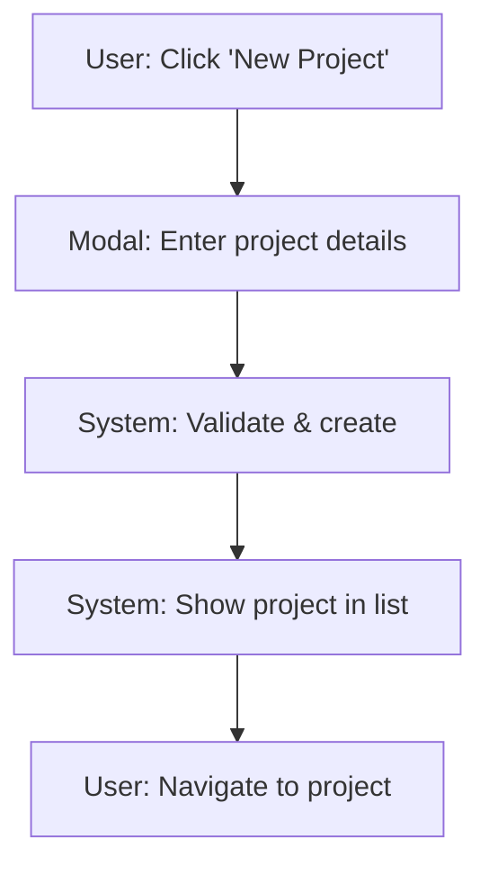
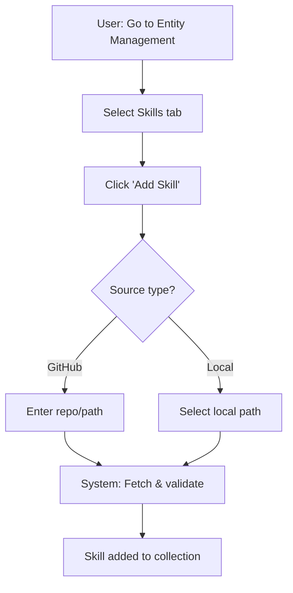
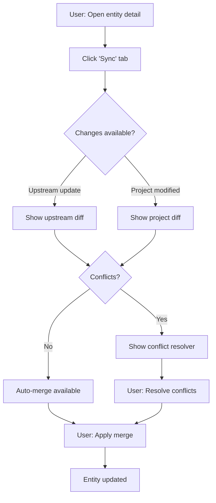

# PRD: Entity Lifecycle Management

**Feature Name:** Entity Lifecycle Management

**Filepath Name:** `entity-lifecycle-management-v1`

**Date:** 2025-11-24

**Author:** Claude Code (AI Agent)

**Version:** 1.0

**Status:** Draft

**Related Documents:**
- Artifact Version Tracking & Sync PRD
- Phase 3 Advanced Implementation Plan
- ADR-001: Web Platform Architecture

---

## 1. Executive Summary

The Entity Lifecycle Management feature provides comprehensive CRUD operations for projects and all entity types (skills, agents, commands, hooks, MCP servers) through a unified web interface. This replaces the current fragmented approach where version merging is handled on the main page, introducing dedicated management pages with consistent components that work at both instance (collection) and project levels.

**Priority:** HIGH

**Key Outcomes:**
- Users can create, edit, delete, and manage projects directly from the web app
- All entity types have full lifecycle management in a dedicated, tabbed interface
- Unified components for merge, diff, sync operations work consistently across instance and project views
- Version operations (upstream sync, project pull, merge) accessible from entity detail pages
- Reduced code duplication through shared component architecture

---

## 2. Context & Background

### Current State

**What Exists Today:**

1. **Collection View** (`/collection`):
   - Browse artifacts in grid/list view
   - Filter and sort artifacts
   - Deploy artifacts to projects via dialog
   - Sync artifacts from upstream
   - View version tree

2. **Projects View** (`/projects` and `/projects/[id]`):
   - List projects with deployment counts
   - View deployed artifacts within a project
   - Check modification status
   - **LIMITATION:** Cannot create, edit, or delete projects
   - **LIMITATION:** Cannot perform lifecycle operations on deployed entities

3. **Main Page Operations:**
   - Version merging handled from main collection page
   - No dedicated entity management page
   - Scattered functionality across different views

**Key Components (Existing):**
- `artifact-detail.tsx` - Modal with Overview and Version History tabs
- `sync-dialog.tsx` - Sync operation with SSE progress
- `deploy-dialog.tsx` - Deploy to project workflow
- `conflict-resolver.tsx` - Merge conflict resolution
- `version-tree.tsx` - Version tree visualization

### Problem Space

**Pain Points:**

1. **No Project CRUD from Web App**
   - Users cannot create new projects from the UI
   - Project deletion not supported
   - Project settings/metadata cannot be edited
   - Must use CLI for project management

2. **Entity Management is Fragmented**
   - Different pages handle different operations
   - No single place to manage an entity's full lifecycle
   - Version merging on main page is confusing
   - Cannot manage entities at the project level (only view them)

3. **Duplicate Implementation Risk**
   - Same operations needed at instance and project levels
   - Without shared components, code duplication is inevitable
   - Inconsistent UX between collection and project views

4. **Missing Entity Operations**
   - Cannot add new entities directly (must use CLI)
   - Cannot edit entity metadata from web
   - Cannot delete entities from collection or project
   - Cannot pull project modifications back to collection

### Current Alternatives / Workarounds

**CLI-Only Operations:**
- Users must switch to CLI for project creation
- Entity addition requires `skillmeat add` command
- No visual feedback during operations

**Manual File Editing:**
- Edit configuration files directly
- Error-prone and inconsistent

**No Workaround Available:**
- Cannot create projects from web at all
- Cannot pull project changes back via web UI

### Architectural Context

**Current Web Architecture:**
- **Framework:** Next.js 15 with App Router
- **State:** TanStack React Query for server state
- **UI:** shadcn/ui components (Radix UI primitives)
- **API:** FastAPI backend with `/api/v1` prefix

**Component Organization:**
```
/components/
├── collection/     # Artifact collection components
├── dashboard/      # Analytics widgets
├── marketplace/    # Marketplace components
├── mcp/           # MCP server management
├── sharing/       # Bundle sharing features
└── ui/            # Base UI components
```

**Backend API Structure:**
- `/api/v1/projects` - Project browsing (read-only)
- `/api/v1/artifacts` - Artifact CRUD + sync
- `/api/v1/collections` - Collection management
- `/api/v1/deploy` - Deployment operations

---

## 3. Problem Statement

**Core Gap:** Users cannot perform full lifecycle management of projects and entities from the web interface, and existing operations are scattered across different views without consistent, reusable components.

**User Story Format:**

> "As a developer using SkillMeat, when I want to create a new project or add a skill to my collection, I have to use the CLI because the web app doesn't support these operations. I need full CRUD capabilities in the web interface so I can manage everything visually."

> "As a user managing multiple projects, when I improve an artifact in one project, I cannot pull those changes back to my collection through the web UI. I need bidirectional sync operations accessible from both collection and project views."

> "As a developer, when I want to merge upstream changes with my local modifications, I have to navigate to different pages and use inconsistent interfaces. I need a dedicated entity management page with consistent merge/diff operations."

**Technical Root Causes:**
- Project endpoints are read-only (no POST/PUT/DELETE)
- No dedicated entity management routes in Next.js app
- Components tightly coupled to collection view
- No shared abstraction for entity operations
- Project view lacks action buttons for entity lifecycle

**Files Involved:**
- `skillmeat/web/app/projects/` - Project pages (read-only)
- `skillmeat/web/app/collection/` - Collection page (partial operations)
- `skillmeat/web/components/collection/` - Entity components (collection-specific)
- `skillmeat/api/routers/projects.py` - Project API (read-only)
- `skillmeat/api/routers/artifacts.py` - Artifact API

---

## 4. Goals & Success Metrics

### Primary Goals

**Goal 1: Full Project Lifecycle Management**
- Create new projects directly from web UI
- Edit project metadata (name, description, settings)
- Delete projects with confirmation workflow
- Measurable: All project CRUD operations available in web app

**Goal 2: Dedicated Entity Management Interface**
- Create a new `/entities` or `/manage` route for entity lifecycle
- Tab-based interface per entity type (Skills, Agents, Commands, Hooks, MCP)
- Full CRUD for each entity type
- Version operations (sync, merge, diff) accessible per entity
- Measurable: Single page provides all entity operations

**Goal 3: Unified Operations at Instance and Project Level**
- Same lifecycle operations available in collection and project views
- Shared components for merge, diff, sync operations
- Consistent UX across all management contexts
- Measurable: 80%+ component reuse between views

**Goal 4: Bidirectional Sync from Web UI**
- Update entities from upstream (GitHub)
- Pull project modifications back to collection
- Merge with visual diff comparison
- Measurable: All sync directions accessible from web UI

**Goal 5: Component Architecture for Reusability**
- Shared `EntityManager` component abstraction
- Consistent lifecycle hooks across entity types
- Props-based customization for context (instance vs project)
- Measurable: New entity types require <50 lines of view code

### Success Metrics

| Metric | Baseline | Target | Measurement Method |
|--------|----------|--------|-------------------|
| Project operations available in web | 0 (read-only) | 4 (CRUD) | Feature completion |
| Entity types with full lifecycle | 0 | 5 (all types) | Feature completion |
| Component reuse rate | 0% | 80%+ | Code analysis |
| Pages needed for entity management | 5+ scattered | 1 dedicated | Route count |
| User actions to perform merge | 5+ (multi-page) | 2 (single flow) | UX measurement |
| Time to add entity from web | N/A (CLI only) | < 30s | User testing |
| Code duplication for similar views | High | <20% | Code analysis |

---

## 5. User Personas & Journeys

### Personas

**Primary Persona: Developer Dan**
- Role: Full-stack developer managing 10+ projects
- Needs: Manage all entities from a single interface, perform sync operations visually
- Pain Points: Switching between CLI and web, scattered operations

**Secondary Persona: Team Lead Terry**
- Role: Team lead managing shared skill library
- Needs: Create projects for teams, manage entity versions, pull improvements
- Pain Points: No project creation from web, no visual diff for reviews

**Tertiary Persona: Solo Samantha**
- Role: Freelancer with few projects
- Needs: Simple CRUD, visual feedback, minimal learning curve
- Pain Points: Must learn CLI for basic operations

### High-level Flow

**Scenario A: Create New Project**



**Scenario B: Add New Skill to Collection**



**Scenario C: Sync Entity with Visual Merge**



---

## 6. Requirements

### 6.1 Functional Requirements

| ID | Requirement | Priority | Category | Notes |
|:--:|-----------|:--------:|----------|-------|
| FR-1 | Create projects from web UI with name, path, description | MUST | Project CRUD | Modal form with validation |
| FR-2 | Edit project metadata (name, description) from web UI | MUST | Project CRUD | Inline edit or modal |
| FR-3 | Delete projects with confirmation and cleanup options | MUST | Project CRUD | Destructive action protection |
| FR-4 | Dedicated entity management page with tabbed interface | MUST | UI Structure | One page, tabs per entity type |
| FR-5 | Full CRUD for Skills in dedicated management interface | MUST | Entity CRUD | Add, edit, remove skills |
| FR-6 | Full CRUD for Agents in dedicated management interface | MUST | Entity CRUD | Add, edit, remove agents |
| FR-7 | Full CRUD for Commands in dedicated management interface | MUST | Entity CRUD | Add, edit, remove commands |
| FR-8 | Full CRUD for Hooks in dedicated management interface | SHOULD | Entity CRUD | Add, edit, remove hooks |
| FR-9 | Full CRUD for MCP servers in dedicated management interface | SHOULD | Entity CRUD | Leverage existing MCP components |
| FR-10 | Add entities from GitHub source with version selection | MUST | Add Entity | Support @latest, @tag, @sha |
| FR-11 | Add entities from local path | MUST | Add Entity | File browser or path input |
| FR-12 | Visual diff viewer for entity changes | MUST | Version Ops | Side-by-side or unified diff |
| FR-13 | Merge workflow with conflict resolution UI | MUST | Version Ops | Reuse conflict-resolver component |
| FR-14 | Upstream sync (GitHub → Collection) from web UI | MUST | Version Ops | With progress indicator |
| FR-15 | Project pull (Project → Collection) from web UI | MUST | Version Ops | Bidirectional sync |
| FR-16 | Deploy entity to specific project from entity detail | MUST | Deployment | Reuse deploy-dialog |
| FR-17 | Undeploy entity from project | MUST | Deployment | With confirmation |
| FR-18 | Entity management at project level (/projects/[id]/entities) | MUST | Project Scope | Same components as collection |
| FR-19 | Shared EntityLifecycleManager component | MUST | Architecture | Reusable across contexts |
| FR-20 | Shared DiffViewer component | MUST | Architecture | Used in sync, merge, pull |
| FR-21 | Shared EntityForm component for add/edit | MUST | Architecture | Customizable per entity type |
| FR-22 | Version history tab in entity detail | SHOULD | Version Ops | Show full lineage |
| FR-23 | Rollback to previous version from web UI | SHOULD | Version Ops | Select from version history |
| FR-24 | Bulk operations (multi-select + action) | COULD | Bulk Ops | Update all, deploy all |
| FR-25 | Search and filter on entity management page | SHOULD | UX | Type, status, tags filters |

### 6.2 Non-Functional Requirements

**Performance:**
- Page load time < 1s for entity management page
- Entity CRUD operations complete < 500ms
- Diff computation for files < 10MB: < 1s
- List rendering for 100+ entities: < 100ms (virtualized)

**Security:**
- CSRF protection on all mutating operations
- API key authentication for all endpoints
- Validate file paths for traversal attacks
- Confirm destructive operations (delete, overwrite)

**Accessibility:**
- Keyboard navigation for all operations
- WCAG 2.1 AA compliance
- Screen reader support for dialogs and forms
- Focus management in modals

**Reliability:**
- Optimistic updates with rollback on failure
- Graceful degradation if API unavailable
- Auto-retry for transient network errors
- Form state preserved on network failure

**Observability:**
- Analytics events for all CRUD operations
- Error tracking with context
- Performance metrics for page loads
- User action logging for debugging

---

## 7. Scope

### In Scope

**Project Management:**
- Create project (name, path, description)
- Edit project metadata
- Delete project with cleanup options
- Project settings page

**Entity Management Page:**
- New route: `/manage` or `/entities`
- Tabbed interface: Skills | Agents | Commands | Hooks | MCP
- Grid/list view per tab with filters
- Add, edit, delete operations per entity type

**Project-Level Entity Management:**
- Enhanced route: `/projects/[id]/manage`
- Same tabs and operations as collection level
- Context-aware (shows deployed entities only)
- Additional: Deploy to this project, Pull to collection

**Shared Components:**
- `EntityLifecycleManager` - Orchestrates all operations
- `EntityForm` - Add/edit form (type-specific fields)
- `EntityList` - Grid/list with selection
- `DiffViewer` - Side-by-side diff display
- `MergeWorkflow` - Step-by-step merge process
- `ConflictResolver` - File-by-file resolution (existing)

**Version Operations:**
- Sync from upstream (GitHub)
- Pull from project to collection
- Merge with conflict resolution
- Diff preview before operations
- Rollback to previous version

### Out of Scope

**Not in MVP:**
- Real-time collaborative editing
- Bulk import/export from web UI (use CLI or sharing feature)
- Custom merge drivers for YAML/TOML (text diff only)
- Entity dependency management
- Team permissions and sharing
- Mobile-optimized interface

**Future Considerations:**
- Drag-and-drop reordering
- Entity templates/scaffolding
- AI-assisted conflict resolution
- Batch operations with preview

---

## 8. Dependencies & Assumptions

### External Dependencies

**Libraries (Frontend):**
- `diff` or `diff-match-patch`: Client-side diff computation
- `react-diff-viewer-continued`: Diff visualization component
- `@tanstack/react-query`: Already used, for server state

**Libraries (Backend):**
- Existing FastAPI infrastructure
- Existing storage managers (manifest, deployment)

### Internal Dependencies

**Feature Dependencies:**
- **Artifact Version Tracking PRD**: Provides version lineage, sync infrastructure
- **Existing Components**: artifact-detail, sync-dialog, conflict-resolver
- **Backend API**: Artifacts router, projects router (to be extended)

**Status:**
- Artifact version tracking: In progress
- Existing components: Complete
- Backend API: Partial (needs CRUD endpoints)

### Assumptions

- Users have basic understanding of version control concepts
- Entity files are text-based (for diff/merge)
- Network connectivity is generally available
- Browser supports modern JavaScript (ES2020+)

### Feature Flags

- `ENABLE_PROJECT_CRUD`: Enable project create/edit/delete
- `ENABLE_ENTITY_MANAGEMENT`: Enable dedicated entity management page
- `ENABLE_PROJECT_ENTITY_OPS`: Enable entity operations at project level
- `ENABLE_VISUAL_MERGE`: Enable visual merge workflow (vs. CLI fallback)

---

## 9. Risks & Mitigations

| Risk | Impact | Likelihood | Mitigation |
|------|--------|-----------|-----------|
| Component complexity leads to prop drilling | HIGH | MEDIUM | Use React Context for shared state, composition patterns |
| Diff computation slow for large files | MEDIUM | LOW | Virtualized rendering, worker thread for computation |
| Project deletion causes data loss | HIGH | LOW | Multi-step confirmation, soft delete with recovery period |
| Inconsistent UX between collection and project views | MEDIUM | MEDIUM | Shared components with context props, design system |
| API changes break existing functionality | MEDIUM | LOW | Versioned API, backward compatible changes |
| Entity form complexity for different types | MEDIUM | MEDIUM | Type-specific form schemas, shared base component |
| Merge conflicts in web UI confusing | MEDIUM | MEDIUM | Clear visual indicators, guided workflow, help tooltips |
| Performance degradation with many entities | MEDIUM | LOW | Virtual scrolling, pagination, lazy loading |

---

## 10. Target State (Post-Implementation)

### User Experience

**Project Management:**
```
User navigates to /projects
  → Sees "New Project" button
  → Clicks to open creation modal
  → Enters name, selects path, adds description
  → Project created and appears in list
  → Can click to edit metadata or delete with confirmation
```

**Entity Management (Collection Level):**
```
User navigates to /manage
  → Sees tabbed interface: Skills | Agents | Commands | Hooks | MCP
  → Selects Skills tab
  → Sees grid of all skills with status indicators
  → Clicks "Add Skill" → Form with GitHub or Local source
  → Clicks a skill → Opens detail panel with:
    - Overview tab: metadata, tags, upstream info
    - Sync tab: upstream updates, merge button
    - History tab: version lineage
    - Actions: Edit, Delete, Deploy
```

**Entity Management (Project Level):**
```
User navigates to /projects/[id]/manage
  → Sees same tabbed interface
  → Shows only entities deployed to this project
  → "Add to Project" button deploys from collection
  → "Pull to Collection" syncs changes back
  → Same detail panel with project context
```

**Visual Merge Workflow:**
```
User clicks "Sync" on an entity
  → System detects upstream has updates
  → Shows diff: left (local) vs right (upstream)
  → Highlights changes: green (additions), red (deletions)
  → If no conflicts: "Apply Merge" button
  → If conflicts: Conflict resolver shows each conflicting file
  → User selects resolution per file (ours/theirs/manual)
  → Merge applied, entity updated
```

### Technical Architecture

**New Routes:**
```
/manage                    - Entity management (collection)
/manage/[type]            - Filtered by entity type
/projects/[id]/manage     - Entity management (project)
/projects/[id]/manage/[type] - Filtered by entity type
/projects/new             - Create project form
/projects/[id]/settings   - Project settings
```

**Component Hierarchy:**
```
<EntityManagementPage>
  ├── <EntityTabs>
  │   ├── Skills | Agents | Commands | Hooks | MCP
  │   └── (controls active tab)
  ├── <EntityList context={collection|project}>
  │   ├── <EntityCard> (grid view)
  │   └── <EntityRow> (list view)
  ├── <EntityDetailPanel>
  │   ├── <OverviewTab>
  │   ├── <SyncTab>
  │   │   ├── <DiffViewer>
  │   │   └── <MergeWorkflow>
  │   └── <HistoryTab>
  │       └── <VersionTree>
  └── <EntityForm> (add/edit modal)
```

**Shared Component Props:**
```typescript
interface EntityLifecycleProps {
  context: 'collection' | 'project';
  projectId?: string;  // Required if context='project'
  entityType: ArtifactType;
  onEntityAction?: (action: EntityAction) => void;
}
```

**API Endpoints (New/Extended):**
```
POST   /api/v1/projects          - Create project
PUT    /api/v1/projects/{id}     - Update project
DELETE /api/v1/projects/{id}     - Delete project

POST   /api/v1/artifacts          - Create artifact (add to collection)
PUT    /api/v1/artifacts/{id}     - Update artifact metadata
DELETE /api/v1/artifacts/{id}     - Delete artifact

POST   /api/v1/artifacts/{id}/pull - Pull project changes to collection
GET    /api/v1/artifacts/{id}/diff - Get diff between versions
```

### Observable Outcomes

**For Users:**
- Complete project management without CLI
- Single page for all entity lifecycle operations
- Visual merge workflow reduces cognitive load
- Consistent experience across collection and project views
- Faster entity management (30s vs 2+ min via CLI)

**For Developers:**
- 80%+ component reuse across views
- Type-safe entity forms with validation
- Clear separation of concerns (presentation vs logic)
- Easy to add new entity types

**System Metrics:**
- Entity CRUD success rate: 99%+
- Page load time: < 1s
- Merge operation success: 85% auto-merge
- User task completion: 95% without errors

---

## 11. Overall Acceptance Criteria (Definition of Done)

### Functional Acceptance

- [ ] Project CRUD operations work end-to-end from web UI
- [ ] Entity management page accessible at `/manage`
- [ ] All 5 entity types have full CRUD in dedicated tabs
- [ ] Visual diff viewer shows accurate file comparisons
- [ ] Merge workflow handles both auto-merge and conflict scenarios
- [ ] Project-level entity management matches collection-level functionality
- [ ] Bidirectional sync (upstream and project) works from web UI
- [ ] Shared components function correctly in both contexts

### Technical Acceptance

- [ ] Components follow React best practices (hooks, composition)
- [ ] TypeScript strict mode with full type coverage
- [ ] API endpoints follow REST conventions
- [ ] Error handling with user-friendly messages
- [ ] Optimistic updates with proper rollback
- [ ] Responsive design works on tablet and desktop

### Quality Acceptance

- [ ] Unit tests for shared components (>80% coverage)
- [ ] Integration tests for CRUD operations
- [ ] E2E tests for critical user flows
- [ ] Accessibility audit passes (WCAG 2.1 AA)
- [ ] Performance benchmarks met
- [ ] No regressions in existing functionality

### Documentation Acceptance

- [ ] Component API documentation
- [ ] User guide for entity management
- [ ] API endpoint documentation
- [ ] Architecture decision record for component design

---

## 12. Assumptions & Open Questions

### Assumptions

- Entity management page is the primary interface (main page simplified)
- Project path is validated but not created on filesystem by web app
- Users prefer visual merge over CLI-based resolution
- Tab-based navigation is intuitive for entity type selection

### Open Questions

- [ ] **Q1: Route Structure**
  - Should entity management be `/manage`, `/entities`, or integrated into existing routes?
  - **A:** TBD - Recommend `/manage` for clarity

- [ ] **Q2: Project Path Handling**
  - Should web app create project directory or just track metadata?
  - **A:** TBD - Recommend track only, user creates directory

- [ ] **Q3: Diff Library Choice**
  - Use `diff-match-patch` (Google) or `jsdiff` for client-side diff?
  - **A:** TBD - Recommend `react-diff-viewer-continued` which uses jsdiff

- [ ] **Q4: Entity Type Extension**
  - How should new entity types be added in future?
  - **A:** TBD - Recommend type registry pattern with form schemas

- [ ] **Q5: Mobile Support**
  - Is mobile-optimized UI required for MVP?
  - **A:** TBD - Recommend desktop-first, tablet acceptable, mobile deferred

---

## 13. Appendices & References

### Related Documentation

- **Artifact Version Tracking PRD**: `/docs/project_plans/artifact-version-tracking-sync-prd.md`
- **Phase 3 Implementation Plan**: `/docs/project_plans/ph3-advanced/phase3-implementation-plan.md`
- **Web Platform ADR**: `/docs/project_plans/ph3-advanced/adr-0001-web-platform.md`

### Component References

**Existing Components to Reuse/Extend:**
- `artifact-detail.tsx` - Base for entity detail panel
- `sync-dialog.tsx` - Base for sync workflow
- `conflict-resolver.tsx` - Reuse directly
- `version-tree.tsx` - Reuse directly
- `deploy-dialog.tsx` - Reuse directly
- `MCPServerForm.tsx` - Pattern for entity forms

**shadcn/ui Components Used:**
- Dialog, Sheet (modals)
- Tabs (entity type navigation)
- Button, Input, Select (forms)
- Table, Card (entity lists)
- Badge (status indicators)
- Progress (operation feedback)

### Prior Art

- **GitHub Repository Settings**: Project CRUD patterns
- **Vercel Dashboard**: Entity management with tabs
- **Linear**: Issue management with keyboard shortcuts
- **Notion**: Database views with filters

---

## Implementation

### Phased Approach

**Phase 1: Backend API Extensions**
- Tasks:
  - [ ] Add project CRUD endpoints (POST, PUT, DELETE)
  - [ ] Add artifact creation endpoint
  - [ ] Add diff endpoint for version comparison
  - [ ] Add pull endpoint for project-to-collection sync
  - [ ] Update OpenAPI spec and regenerate SDK

**Phase 2: Shared Components Foundation**
- Tasks:
  - [ ] Create EntityLifecycleManager context/provider
  - [ ] Build DiffViewer component
  - [ ] Build EntityForm base component
  - [ ] Build EntityList component with selection
  - [ ] Create type registry for entity schemas

**Phase 3: Entity Management Page**
- Tasks:
  - [ ] Create /manage route with tab structure
  - [ ] Implement Skills tab with full CRUD
  - [ ] Implement Agents tab
  - [ ] Implement Commands tab
  - [ ] Implement Hooks and MCP tabs

**Phase 4: Project Management**
- Tasks:
  - [ ] Add project creation form/modal
  - [ ] Add project edit functionality
  - [ ] Add project delete with confirmation
  - [ ] Create project settings page

**Phase 5: Project-Level Entity Management**
- Tasks:
  - [ ] Create /projects/[id]/manage route
  - [ ] Integrate shared components with project context
  - [ ] Add "Pull to Collection" workflow
  - [ ] Add "Deploy from Collection" workflow

**Phase 6: Visual Merge Workflow**
- Tasks:
  - [ ] Integrate DiffViewer into sync workflow
  - [ ] Build step-by-step merge UI
  - [ ] Handle conflict detection and resolution
  - [ ] Add version rollback functionality

**Phase 7: Testing & Polish**
- Tasks:
  - [ ] Unit tests for shared components
  - [ ] Integration tests for CRUD operations
  - [ ] E2E tests for critical flows
  - [ ] Accessibility audit and fixes
  - [ ] Performance optimization

### Epics & User Stories Backlog

| Story ID | Epic | Title | Description | Acceptance Criteria | Estimate |
|----------|------|-------|-------------|-------------------|----------|
| ELM-001 | Backend | Project CRUD Endpoints | Add POST/PUT/DELETE for projects | All CRUD operations work via API | 5 pts |
| ELM-002 | Backend | Artifact Creation Endpoint | Add POST for creating artifacts | Can add artifacts from GitHub/local | 5 pts |
| ELM-003 | Backend | Diff Endpoint | Add GET for version diff | Returns accurate file-level diff | 3 pts |
| ELM-004 | Backend | Pull Endpoint | Add POST for project-to-collection sync | Bidirectional sync works | 5 pts |
| ELM-005 | Components | EntityLifecycleManager | Create shared context/provider | Manages entity state across views | 8 pts |
| ELM-006 | Components | DiffViewer | Build side-by-side diff component | Shows changes with syntax highlighting | 8 pts |
| ELM-007 | Components | EntityForm | Build add/edit form with type schemas | Works for all entity types | 8 pts |
| ELM-008 | Components | EntityList | Build grid/list view with selection | Supports filter, sort, bulk select | 5 pts |
| ELM-009 | UI | Entity Management Page | Create /manage with tabs | Page loads with all tabs | 8 pts |
| ELM-010 | UI | Skills Tab CRUD | Full lifecycle for skills | Add, edit, delete, sync skills | 8 pts |
| ELM-011 | UI | Agents Tab CRUD | Full lifecycle for agents | Add, edit, delete, sync agents | 5 pts |
| ELM-012 | UI | Commands Tab CRUD | Full lifecycle for commands | Add, edit, delete, sync commands | 5 pts |
| ELM-013 | UI | Hooks Tab CRUD | Full lifecycle for hooks | Add, edit, delete, sync hooks | 3 pts |
| ELM-014 | UI | MCP Tab Integration | Integrate existing MCP components | Full MCP management in tab | 3 pts |
| ELM-015 | Projects | Project Creation UI | Modal form for new projects | User can create project from web | 5 pts |
| ELM-016 | Projects | Project Edit UI | Edit metadata functionality | User can edit project details | 3 pts |
| ELM-017 | Projects | Project Delete UI | Delete with confirmation | User can delete project safely | 3 pts |
| ELM-018 | Projects | Project Settings Page | Dedicated settings route | Settings page accessible | 5 pts |
| ELM-019 | Project-Level | Project Entity Management | /projects/[id]/manage route | Same tabs as collection level | 8 pts |
| ELM-020 | Project-Level | Pull to Collection | Pull workflow from project | Changes sync to collection | 5 pts |
| ELM-021 | Project-Level | Deploy from Collection | Deploy workflow to project | Entity deployed to project | 3 pts |
| ELM-022 | Merge | Visual Merge Workflow | Step-by-step merge UI | User completes merge visually | 8 pts |
| ELM-023 | Merge | Conflict Resolution Integration | Integrate existing resolver | Conflicts resolved via UI | 5 pts |
| ELM-024 | Merge | Version Rollback | Rollback to previous version | User can revert changes | 5 pts |
| ELM-025 | Testing | Component Unit Tests | Tests for shared components | >80% coverage | 8 pts |
| ELM-026 | Testing | CRUD Integration Tests | Tests for all operations | All CRUD tested | 5 pts |
| ELM-027 | Testing | E2E Critical Flows | E2E for key user journeys | Critical paths tested | 8 pts |
| ELM-028 | Quality | Accessibility Audit | WCAG 2.1 AA compliance | Audit passes | 5 pts |
| ELM-029 | Quality | Performance Optimization | Meet performance benchmarks | All targets met | 5 pts |
| ELM-030 | Docs | Component Documentation | Document shared components | API docs complete | 3 pts |

---

**Progress Tracking:**

See progress tracking: `.claude/progress/entity-lifecycle-management-v1/all-phases-progress.md`

---

## Sign-off

**PRD Status:** Draft

**Approval Required:**
- [ ] Product Owner
- [ ] Engineering Lead
- [ ] UX Review

**Created:** 2025-11-24

**Last Updated:** 2025-11-24

---

*This PRD is designed for AI agent execution. It provides sufficient detail for parallel implementation without blocking dependencies.*
