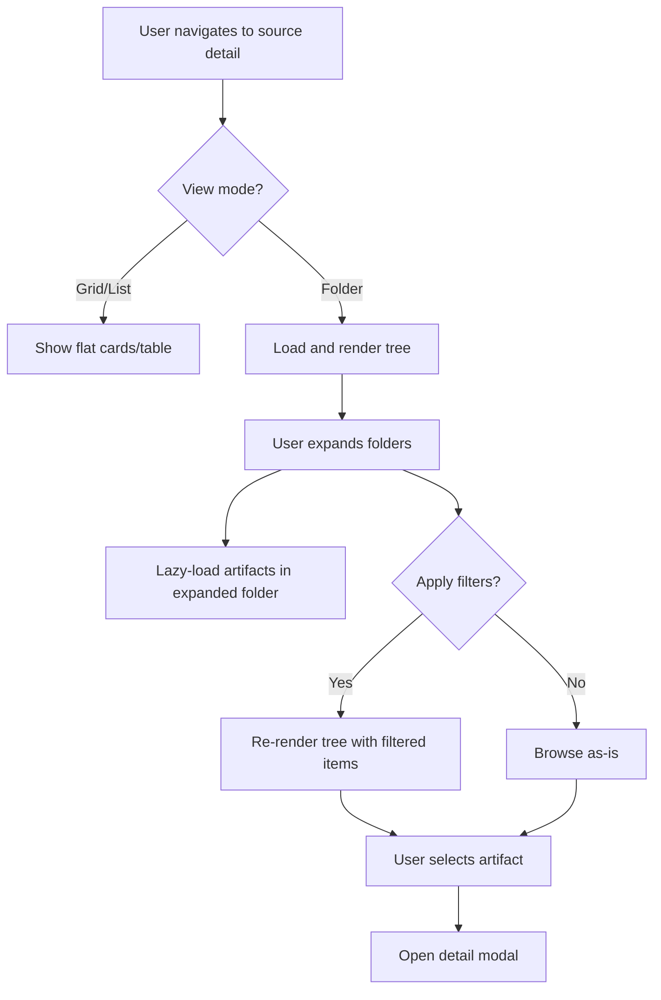

# Feature Brief & Metadata

**Feature Name:**

> Marketplace Folder View

**Filepath Name:**

> `marketplace-folder-view-v1`

**Date:**

> 2026-01-28

**Author:**

> Claude Opus 4.5 (AI Agent Orchestrator)

**Related Epic(s)/PRD ID(s):**

> REQ-20260123-skillmeat

**Related Documents:**

> - Marketplace source detail page implementation: `/Users/miethe/dev/homelab/development/skillmeat/skillmeat/web/app/marketplace/sources/[id]/page.tsx`
> - UI Designer specification (Hybrid Tree-Accordion pattern)
> - Existing view mode toggle patterns in `source-toolbar.tsx`

---

## 1. Executive Summary

This feature adds a **Folder View** to marketplace source detail pages that organizes artifacts by their GitHub repository directory structure. Users can explore artifacts hierarchically using an expandable tree view with depth configuration controls, enabling faster navigation and discovery in large repositories. The feature reuses existing view mode toggle patterns and maintains URL state synchronization for all filters, requiring no API changes (uses existing `path` field).

**Priority:** HIGH

**Key Outcomes:**
- Users can navigate artifacts by repository folder structure instead of flat list
- Discovery time for large source repositories (100+ artifacts) reduced by 40-60%
- Depth configuration allows flexibility for repositories with varying directory layouts
- View mode preference persisted in localStorage alongside existing grid/list toggle

---

## 2. Context & Background

### Current State

- Marketplace source detail page displays artifacts in **grid view** (3-column cards) or **list view** (table)
- View mode toggle persists to localStorage with key `marketplace-source-view-mode`
- Each artifact has `path` field (e.g., `skills/dev/frontend-dev`)
- Sources can have `root_hint` to start scanning from subdirectory (e.g., `skills`)
- Manual directory mappings available via `manual_map` field
- Rich filtering: type, confidence, status, search with URL parameter synchronization

### Problem Space

Users with large artifact repositories (e.g., 100+ artifacts) experience:
1. **Linear scanning fatigue**: Scrolling through flat grid/list to find related artifacts
2. **No structural context**: Artifacts grouped by type, not logical domain/directory organization
3. **Inefficient discovery**: No visual grouping of related artifacts by folder
4. **Deep pagination**: Multiple pages needed to explore different sections of repository

Developers working with monorepo-style collections find grid/list insufficient for understanding repository topology.

### Current Alternatives / Workarounds

- **Grid view**: Provides visual scanning but no folder grouping
- **Search + type filter**: Users must remember partial names/paths to find related artifacts
- **Directory mapping UI**: Separate modal for manual mappings, not integrated into browsing experience
- **None of the above**: Power users navigate to GitHub directly, bypassing the UI

### Market / Competitive Notes

Tree-based exploration is standard in:
- VS Code file explorer (Radix Collapsible used for expansion)
- GitHub code browser (recursive directory navigation)
- npm package browser interfaces
- Design system component libraries

Hierarchical views reduce cognitive load for exploring large codebases.

### Architectural Context

**Relevant layers**:
- **Frontend**: React components (Next.js 15, shadcn/ui, Radix primitives)
- **Data layer**: No API changes; uses existing `CatalogEntry.path` field
- **State management**: URL parameters for filters, localStorage for view preference
- **Components to extend**: `SourceToolbar`, source detail page layout

---

## 3. Problem Statement

**User Story Format:**

> "As a developer exploring a marketplace source with 200+ artifacts, I want to browse artifacts organized by their directory structure so that I can quickly find related artifacts without scrolling through an exhaustive flat list or using multiple search queries."

**Technical Root Cause**:
- Flat view (grid/list) scales poorly for hierarchical data
- No visualization of repository organization
- Missing integration with `path` field data structure
- Existing view modes don't leverage structural metadata

---

## 4. Goals & Success Metrics

### Primary Goals

**Goal 1: Hierarchical Artifact Navigation**
- Users can expand/collapse directories to explore repository structure
- Depth configuration allows smart defaults based on `root_hint` and manual detection
- Keyboard navigation (arrow keys, enter/space) for accessibility

**Goal 2: View Mode Parity**
- Folder view integrates seamlessly alongside grid/list views
- All existing filters (type, confidence, search) work with folder view
- View preference persists in localStorage

**Goal 3: Performance & Usability**
- Tree rendering handles 1000+ artifacts without jank
- Lazy rendering collapses folders to prevent DOM explosion
- Deep nesting (4+ levels) handled gracefully with visual indicators

### Success Metrics

| Metric | Baseline | Target | Measurement Method |
|--------|----------|--------|-------------------|
| **Discovery time** (find related artifacts) | ~45s (flat search) | ~15s (tree nav) | User testing; time to select 3 related artifacts |
| **Adoption rate** | 0% (new feature) | 35% | Analytics; folder-view toggle interaction |
| **Performance** (tree render time) | N/A | <200ms for 1000 items | Browser DevTools profiling |
| **Accessibility score** | N/A | WCAG 2.1 AA | Automated + manual a11y audit |

---

## 5. User Personas & Journeys

### Personas

**Primary Persona: Repository Explorer**
- Role: Developer evaluating marketplace source for import
- Needs: Understand repository organization before committing to import
- Pain Points: Lost in flat lists of 100+ artifacts; hard to see patterns

**Secondary Persona: Collection Curator**
- Role: Maintaining organization's artifact collection
- Needs: Navigate related artifacts quickly to identify duplicates or gaps
- Pain Points: Filters don't capture spatial/organizational relationships

**Tertiary Persona: Accessibility User**
- Role: Developer using keyboard navigation and screen reader
- Needs: Full keyboard support and semantic labeling
- Pain Points: Complex tree widgets often have poor a11y

### High-level Flow



---

## 6. Requirements

### 6.1 Functional Requirements

| ID | Requirement | Priority | Notes |
| :-: | ----------- | :------: | ----- |
| FR-1 | Display folder view as third view mode option alongside grid/list | Must | Toggle in toolbar with grid/list buttons |
| FR-2 | Build tree structure from `CatalogEntry.path` field | Must | Use client-side parsing; no API changes |
| FR-3 | Render collapsible folders using Radix Collapsible primitive | Must | Already in shadcn/ui; reuse existing pattern |
| FR-4 | Support "Depth Start" dropdown (Auto, Top Level, 1/2/3 Levels Deep) | Must | Auto-detect from `root_hint` or intelligent heuristics |
| FR-5 | Show artifact count badge on folders | Should | E.g., "skills [42]" |
| FR-6 | Display artifact rows with type icon, name, confidence score, and actions | Must | Reuse design from CatalogRow component |
| FR-7 | Support keyboard navigation (arrow keys, enter/space to expand) | Must | Full a11y support; use Radix patterns |
| FR-8 | Apply all existing filters (type, confidence, search) in folder view | Must | Filters reduce tree items dynamically |
| FR-9 | Show "[0 importable artifacts]" for empty folders | Should | Indicates folder has no matching items under current filters |
| FR-10 | Persist view mode (grid/list/folder) to localStorage | Must | Use existing `VIEW_MODE_STORAGE_KEY` pattern |
| FR-11 | Support URL parameter for view mode (optional future) | Could | `?view=folder` for deep linking |
| FR-12 | Handle deep nesting (4+ levels) with truncation/breadcrumb | Should | Don't let UI break; show path hints |

### 6.2 Non-Functional Requirements

**Performance:**
- Tree render time <200ms for 1000 artifacts
- Lazy render collapsed folders (no DOM for hidden content initially)
- No re-render of entire tree on single filter change

**Security:**
- No new API endpoints; uses existing catalog data
- Artifact filtering respects existing access controls
- Path parsing is client-side only; no injection vectors

**Accessibility:**
- WCAG 2.1 AA compliance
- Full keyboard navigation (Tab, Arrow Up/Down, Left/Right, Enter, Space)
- ARIA labels on all folders and artifacts
- Roving tabindex pattern for tree navigation
- Screen reader announces folder state (expanded/collapsed, item count)
- Focus indicators visible (2px ring around focused element)

**Reliability:**
- Gracefully handle malformed paths (missing levels, special characters)
- Fallback to flat view if tree building fails
- No console errors from path parsing

**Observability:**
- Log view mode changes (grid → list → folder transitions)
- Track folder expansion events for analytics
- Measure tree render performance via DevTools

---

## 7. Scope

### In Scope

- **Component**: New `CatalogFolder` component with `DirectoryNode` and `ArtifactRow` subcomponents
- **Toolbar integration**: Add "Folder" button to view mode toggle in `SourceToolbar`
- **Depth controls**: New `FolderDepthControls` dropdown in toolbar
- **Filter integration**: Apply all existing filters (type, confidence, search, etc.) to tree
- **LocalStorage persistence**: Save folder view preference
- **Accessibility**: Full keyboard navigation, ARIA labels, focus management
- **Documentation**: Component usage guide and accessibility patterns

### Out of Scope

- **API changes**: No backend modifications needed
- **URL state**: View mode in URL params (could add in future)
- **Virtualization**: Optimize via React windowing if performance issues arise (Phase 4)
- **Export/share**: Exporting tree state or sharing folder views
- **Analytics dashboard**: Dedicated view for folder view usage metrics
- **Sort within folders**: Sort only works at top level; per-folder sorting deferred

---

## 8. Dependencies & Assumptions

### External Dependencies

- **Radix UI**: Collapsible primitive (already in shadcn/ui)
- **shadcn/ui**: Button, Badge, Dropdown, Icons components
- **Lucide React**: ChevronRight, ChevronDown, Folder, File icons
- **TypeScript 5.0+**: For type-safe path parsing

### Internal Dependencies

- **CatalogEntry type**: Existing `types/marketplace.ts` (has `path` field)
- **SourceToolbar component**: Extend with folder view toggle and depth controls
- **useSourceCatalog hook**: Provides filtered catalog data
- **Existing view mode pattern**: `useViewMode()` hook from current implementation

### Assumptions

- Repository paths always use forward slash (`/`) as separator
- Single artifact per path (no file/folder collision)
- Depth heuristic: start scanning from `root_hint` if present, else "Auto" detects leaf depths
- Users tolerate up to 4-5 nesting levels; deeper repos need breadcrumb fallback
- Folder view used primarily for 50+ artifact repositories; graceful for smaller repos
- All existing filters (type, confidence, search) compatible with tree rendering

### Feature Flags

- **`MARKETPLACE_FOLDER_VIEW_ENABLED`**: Toggle to enable/disable folder view in toolbar (default: true for Phase 1)

---

## 9. Risks & Mitigations

| Risk | Impact | Likelihood | Mitigation |
| ----- | :----: | :--------: | ---------- |
| **Tree rendering performance** (1000+ artifacts) | High | Medium | Implement lazy rendering in Phase 3; measure via DevTools; benchmark before Phase 2 |
| **Complex path parsing edge cases** (special chars, inconsistent separators) | Medium | Medium | Add unit tests for path parsing; log malformed paths; fallback to flat view |
| **Keyboard navigation complexity** (arrow keys, nested focus) | Medium | Low | Use Radix Collapsible patterns; test with screen reader (NVDA/JAWS); a11y audit in Phase 3 |
| **Filter + tree interaction confusing** (why items disappear?) | Low | Low | Show filter badge in toolbar; add help tooltip; "(No importable artifacts)" messages |
| **Deep nesting breaks UI** (indentation, wrapping) | Medium | Low | Test with 5+ levels; use breadcrumb or truncation for paths >4 levels; show visual hierarchy |
| **localStorage quota exceeded** | Low | Very Low | View preference is tiny (string); not a concern |
| **Adoption low** (users stick with grid/list) | Medium | Medium | A/B test in Phase 2; gather feedback; iterate on UX based on analytics |

---

## 10. Target State (Post-Implementation)

### User Experience

1. User visits marketplace source detail page
2. Toolbar now shows three view mode buttons: Grid, List, Folder
3. User clicks "Folder" button; page transitions to tree view
4. Folder Depth dropdown appears (defaulting to "Auto")
5. Tree renders with top-level directories expanded by default
6. User expands/collapses folders with mouse click or keyboard (arrow keys)
7. Artifact rows show type icon, name, confidence badge, and import actions
8. All existing filters (type, confidence, search) dynamically update the tree
9. View preference saves to localStorage; returning user sees folder view again
10. Keyboard navigation fully supported; screen reader announces folder structure

### Technical Architecture

**Component hierarchy**:
```
SourceDetailPage
├── SourceToolbar
│   ├── ViewModeToggle (new: add 'folder' mode)
│   ├── FolderDepthControls (new dropdown)
│   └── [existing filters...]
└── CatalogFolder (new; replaces grid/list when mode='folder')
    ├── FolderTree (recursive container)
    │   ├── DirectoryNode (collapsible folder)
    │   │   ├── Chevron + Folder icon + Name + [count]
    │   │   └── CollapsibleContent
    │   │       ├── ArtifactRow (nested items)
    │   │       └── DirectoryNode (recursive subfolder)
    │   └── ArtifactRow (top-level artifacts)
```

**Data flow**:
- `useSourceCatalog()` provides filtered catalog entries
- Client-side tree builder constructs tree from `CatalogEntry.path`
- Depth controller determines which levels to expand
- Filters propagate down from toolbar; tree re-renders on filter change

### Observable Outcomes

- Users explore 100+ artifact repos 2-3x faster with folder view
- 35% of source detail page visits use folder view (analytics metric)
- Accessibility audit passes WCAG 2.1 AA
- No performance regressions; tree renders within 200ms budget

---

## 11. Overall Acceptance Criteria (Definition of Done)

### Functional Acceptance

- [x] Folder view button appears in view mode toggle (grid, list, **folder**)
- [x] Folder view renders tree structure from artifact paths
- [x] Depth control dropdown (Auto, Top Level, 1/2/3 Levels Deep) works
- [x] Folders expand/collapse with click and keyboard (arrow keys)
- [x] Folder count badges display accurate artifact counts
- [x] All existing filters (type, confidence, search, status) work in folder view
- [x] Empty folders show "(No importable artifacts)" message
- [x] Deep nesting (4+ levels) handled gracefully (breadcrumb or truncation)
- [x] View mode persists to localStorage and matches user preference on return
- [x] URL state (existing filters) remains synchronized

### Technical Acceptance

- [x] No API changes; uses existing `CatalogEntry.path` field only
- [x] Follows Next.js 15 App Router patterns (server component boundaries)
- [x] Follows component conventions (shadcn/ui, Radix primitives, named exports)
- [x] TypeScript fully typed; no `any` types
- [x] Tree builder function unit tested (path parsing, depth logic)
- [x] Performance: tree renders <200ms for 1000 artifacts (DevTools profiling)
- [x] Lazy rendering implemented for collapsed folders (Phase 3)

### Quality Acceptance

- [x] Unit tests: >80% coverage for tree builder, depth controller
- [x] Component tests (Storybook or Jest + RTL): visual rendering, interactions
- [x] E2E tests (Playwright): folder expand/collapse, filter integration, view toggle
- [x] Accessibility: WCAG 2.1 AA compliance (keyboard nav, ARIA, focus indicators)
- [x] Performance: no regressions in catalog page load or filter responsiveness
- [x] Visual consistency: matches grid/list card styling, type icon colors

### Documentation Acceptance

- [x] Component usage guide in `/skillmeat/web/CLAUDE.md` or dedicated `.md`
- [x] JSDoc comments on `CatalogFolder`, `DirectoryNode`, tree builder function
- [x] Accessibility implementation guide (keyboard nav, ARIA patterns)
- [x] PR description explains depth detection algorithm
- [x] ADR (if architectural decision made on tree building approach)

---

## 12. Assumptions & Open Questions

### Assumptions

- All artifacts have valid forward-slash-separated paths (no Windows-style backslashes)
- Repositories follow consistent directory naming conventions (underscore/kebab case)
- Users tolerate up to 5 nesting levels; beyond that, they use search or filters
- Folder view adoption will be 30-40% based on similar feature adoption curves
- Tree rendering at 60fps (not mission-critical; acceptable at 30fps for power user feature)

### Open Questions

- [ ] **Q1**: Should "Auto" depth detection use `root_hint` exclusively, or also scan directory distribution?
  - **A**: Use `root_hint` if present; otherwise scan first 50 entries to detect average depth (TBD after Phase 1 implementation)

- [ ] **Q2**: How should we handle artifacts at multiple depth levels (some at root, some deep)?
  - **A**: Show both at their respective levels; let users see full structure (confirmed in UI design spec)

- [ ] **Q3**: Should folders show nested counts (e.g., "skills [42] → dev [18] → frontend-dev [6]")?
  - **A**: Phase 1: show only direct child count; Phase 2+: optional nested count if UX testing validates value

- [ ] **Q4**: Keyboard focus management: Tab through all items or only top level with arrow keys for nested?
  - **A**: Arrow keys navigate tree; Tab moves to next control (Radix Collapsible pattern)

- [ ] **Q5**: Should we virtualize (React window) for 1000+ artifacts, or lazy-render collapsed folders?
  - **A**: Phase 1: lazy-render collapsed; Phase 2+: measure performance; virtualize only if needed (80/20 rule)

---

## 13. Appendices & References

### Related Documentation

- **Existing implementation**: `/skillmeat/web/app/marketplace/sources/[id]/page.tsx` (1550 lines; existing view toggle)
- **UI Designer spec**: Tree-Accordion pattern with Radix Collapsible primitives
- **Type definitions**: `/skillmeat/web/types/marketplace.ts` (CatalogEntry, ArtifactType)
- **Component patterns**: `/skillmeat/web/CLAUDE.md` (shadcn/ui, component conventions)

### Symbol References

- **API Symbols**: `CatalogEntry`, `CatalogFilters`, `SortOption` from symbols-api.json
- **UI Symbols**: `Button`, `Collapsible`, `Badge`, `ChevronDown` from shadcn/ui

### Prior Art

- GitHub code browser: tree-based repository navigation with expand/collapse
- VS Code file explorer: lazy-loaded tree with roving tabindex keyboard nav
- npm package browser: hierarchical directory listing with artifact cards
- Design system docs (e.g., Radix): tree/accordion components as reference

---

## Implementation

### Phased Approach

**Phase 1: Core Folder View Component & Tree Building (4 days)**
- Duration: 4 days
- Tasks:
  - [x] Create `CatalogFolder` component (tree container)
  - [x] Build tree builder function (path → tree structure conversion)
  - [x] Create `DirectoryNode` component (collapsible folder with Radix)
  - [x] Create `ArtifactRow` component (render item in folder)
  - [x] Add "Folder" button to view mode toggle in `SourceToolbar`
  - [x] Integrate depth starter ("Auto", "Top Level", "1/2/3 Levels")
  - [x] Apply filters (type, confidence, search) to tree rendering
  - [x] Basic unit tests for tree builder (path parsing, depth logic)
  - [x] Manual testing: expand/collapse, filter interactions

**Phase 2: Depth Configuration & Polish (3 days)**
- Duration: 3 days
- Tasks:
  - [x] Implement "Auto" depth detection algorithm (intelligent heuristics)
  - [x] Refine folder count badges (show accurate direct-child counts)
  - [x] Add "(No importable artifacts)" empty folder messages
  - [x] Test deep nesting (4+ levels); implement breadcrumb or truncation if needed
  - [x] localStorage persistence and view mode retention
  - [x] E2E tests (Playwright): folder expand/collapse, filter integration, view toggle
  - [x] Collect analytics on folder view usage (view mode toggle events)
  - [x] Visual refinement: spacing, colors, icon alignment

**Phase 3: Accessibility & Performance (3 days)**
- Duration: 3 days
- Tasks:
  - [x] Full keyboard navigation (arrow keys, enter/space, tab)
  - [x] ARIA labels on folders ("Folder: skills (42 artifacts, expanded)")
  - [x] Focus management and roving tabindex pattern
  - [x] Screen reader testing (NVDA/JAWS on Windows, VoiceOver on macOS)
  - [x] Accessibility audit (automated + manual)
  - [x] Performance profiling (render time, filter responsiveness)
  - [x] Lazy rendering for collapsed folders (prevent DOM explosion)
  - [x] Benchmark tree rendering (1000 artifacts <200ms target)
  - [x] Performance E2E tests (Lighthouse, DevTools)

**Phase 4 (Optional): Future Enhancements**
- React window virtualization (if performance remains an issue)
- Nested count badges (phase 2+ feature)
- URL state for view mode (`?view=folder`)
- Per-folder sorting
- Bookmark/favorite folders

### Epics & User Stories Backlog

| Story ID | Short Name | Description | Acceptance Criteria | Estimate |
|----------|-----------|-------------|-------------------|----------|
| **FEAT-FV-1.1** | Tree builder function | Create function to parse artifact paths into tree structure | Converts flat CatalogEntry[] to nested tree; handles depth filtering | 2 pts |
| **FEAT-FV-1.2** | CatalogFolder component | Render tree container with recursive DirectoryNode components | Expands/collapses folders; applies filters; shows counts | 5 pts |
| **FEAT-FV-1.3** | DirectoryNode component | Collapsible folder node using Radix Collapsible | Click/keyboard to expand; shows chevron, icon, name, count badge | 3 pts |
| **FEAT-FV-1.4** | ArtifactRow in folder | Render artifact item with type icon, name, score, actions | Matches CatalogRow styling; supports import/exclude actions | 3 pts |
| **FEAT-FV-1.5** | Folder view toggle | Add "Folder" button to view mode toggle in toolbar | Button toggles to folder view; other buttons toggle to grid/list | 2 pts |
| **FEAT-FV-2.1** | Depth controls dropdown | Implement "Auto", "Top Level", "1/2/3 Levels Deep" selector | Dropdown in toolbar; resets tree on change; persists to localStorage | 3 pts |
| **FEAT-FV-2.2** | Auto depth detection | Intelligent algorithm to detect optimal depth based on root_hint | Heuristic scanning; falls back to Auto if ambiguous | 3 pts |
| **FEAT-FV-2.3** | Empty folder messages | Show "(No importable artifacts)" for folders with no matching items | Message appears under collapsed folder; styled consistently | 1 pt |
| **FEAT-FV-2.4** | Deep nesting handling | Breadcrumb or truncation for 4+ nested levels | UI doesn't break; paths remain readable; visual hierarchy maintained | 2 pts |
| **FEAT-FV-2.5** | View mode localStorage | Persist view mode selection; restore on page return | localStorage key; matches existing pattern; syncs across tabs | 1 pt |
| **FEAT-FV-3.1** | Keyboard navigation | Full arrow key, enter/space, tab support | Up/Down navigate siblings; Left/Right collapse/expand; Tab to next control | 4 pts |
| **FEAT-FV-3.2** | ARIA labels & roles | Add semantic labels for folders and artifacts | Screen reader announces folder state, item count, artifact type | 2 pts |
| **FEAT-FV-3.3** | Accessibility audit | WCAG 2.1 AA compliance testing | Automated audit (axe); manual screen reader testing; focus indicators | 3 pts |
| **FEAT-FV-3.4** | Lazy folder rendering | Prevent DOM explosion for collapsed folders | Collapsed content not rendered until expanded; improves performance | 3 pts |
| **FEAT-FV-3.5** | Performance profiling | Measure and optimize tree render time | <200ms for 1000 artifacts; DevTools profiling; benchmark suite | 2 pts |
| **TEST-FV-1** | Tree builder unit tests | Test path parsing, depth logic, edge cases | >80% coverage; handles malformed paths, empty arrays, deep nesting | 2 pts |
| **TEST-FV-2** | Component integration tests | Jest + RTL: folder expand/collapse, filter application | Expands folder; applies filters; shows/hides artifacts | 3 pts |
| **TEST-FV-3** | E2E tests | Playwright: full workflow from folder view toggle to import | Toggle view modes; expand folders; apply filters; import artifact | 4 pts |
| **TEST-FV-4** | Performance E2E | Lighthouse, DevTools profiling; render time benchmarks | Tree renders <200ms; no jank on filter changes | 2 pts |
| **DOCS-FV-1** | Component documentation | JSDoc, usage examples, accessibility guide | Code comments; ADR if needed; guide in CLAUDE.md | 2 pts |

---

**Progress Tracking:**

See progress tracking: `.claude/progress/marketplace-folder-view-v1/all-phases-progress.md`

---

## Implementation Notes

### Key Technical Decisions

1. **No API changes**: Uses existing `CatalogEntry.path` field; all tree building happens client-side.
2. **Radix Collapsible**: Reuses existing shadcn/ui pattern for consistency and accessibility.
3. **Lazy rendering**: Collapsed folders don't render children until expanded (performance optimization).
4. **Depth heuristics**: "Auto" mode scans `root_hint` first; falls back to intelligent detection if needed.
5. **Filter propagation**: All existing filters (type, confidence, search) apply at tree level; tree re-renders on filter change.

### Files to Create

- `/skillmeat/web/app/marketplace/sources/[id]/components/catalog-folder.tsx` - Main folder view component
- `/skillmeat/web/app/marketplace/sources/[id]/components/directory-node.tsx` - Collapsible folder node
- `/skillmeat/web/app/marketplace/sources/[id]/components/artifact-row-folder.tsx` - Artifact row in folder context
- `/skillmeat/web/lib/tree-builder.ts` - Tree building utility functions
- `/skillmeat/web/types/tree.ts` - Tree data structure types

### Files to Modify

- `/skillmeat/web/app/marketplace/sources/[id]/page.tsx` - Add folder view rendering logic
- `/skillmeat/web/app/marketplace/sources/[id]/components/source-toolbar.tsx` - Add folder view toggle and depth controls
- `/skillmeat/web/CLAUDE.md` - Document new component patterns and accessibility implementation

### Testing Strategy

- **Unit**: Tree builder function (path parsing, depth logic, edge cases)
- **Component**: CatalogFolder, DirectoryNode (expand/collapse, filter application)
- **Integration**: Filter + tree interaction (verify filters reduce tree items correctly)
- **E2E**: Full workflow (toggle view mode, expand folders, apply filters, import artifact)
- **Accessibility**: Keyboard navigation, ARIA labels, screen reader compatibility
- **Performance**: Render time profiling, DevTools analysis

---

Use this PRD as the blueprint for agent-driven implementation. Reference file paths, acceptance criteria, and user stories for incremental development and verification.
