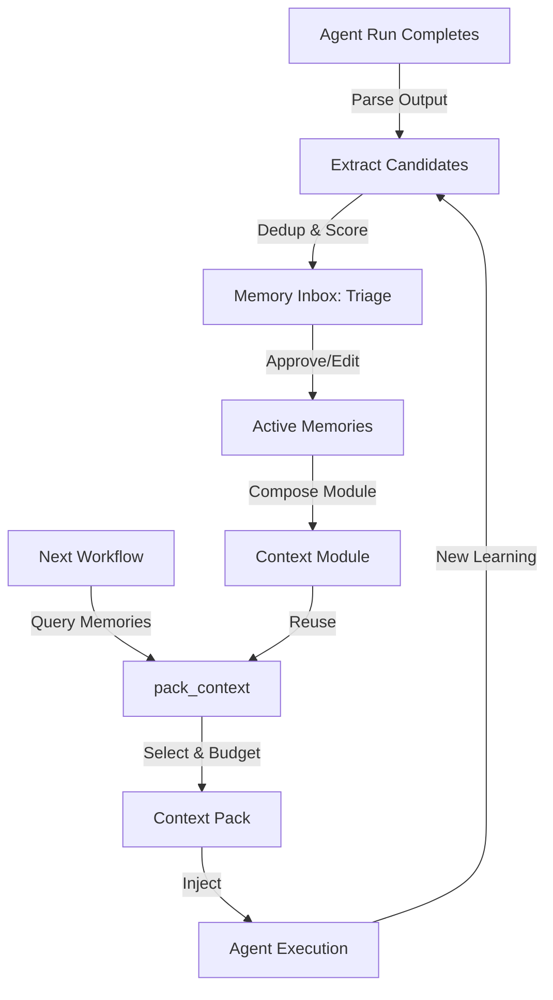

# Feature Brief & Metadata

**Feature Name:**

Memory & Context Intelligence System

**Filepath Name:**

`memory-context-system-v1` (kebab-case)

**Date:**

2026-02-05

**Author:**

Claude Code (AI Agent)

**Version:**

1.1

**Related Epic(s)/PRD ID(s):**

- `agent-context-entities-v1` (prerequisite: context entity infrastructure)

**Related Documents:**

- `.claude/context/key-context/data-flow-patterns.md` (dual-stack architecture)
- `skillmeat/cache/models.py` (existing model patterns)
- `skillmeat/core/services/context_sync.py` (reference for provenance tracking)

---

## 1. Executive Summary

This feature transforms SkillMeat from a static context repository into a project-scoped intelligence platform. It introduces three tightly integrated subsystems:

1. **Memory Governance:** Project-scoped CRUD for capturing, approving, and depreciating atomic learning items (constraints, decisions, fixes, patterns).
2. **AutoContext Service:** Extracts memory candidates from agent run logs using offline TF-IDF deduplication with confidence scoring (Phase 3+).
3. **Context Packing:** Dynamically composes memory items + context entities into token-budgeted injection packs for specific workflows.

**Priority:** HIGH

**Key Outcomes:**

- **Zero Amnesia:** Agents do not repeat the same mistakes within a project scope. Memory items capture learnings and prevent regression.
- **Auditability:** Every injected memory has provenance (source session, run ID, commit SHA) for accountability and debugging.
- **Token Efficiency:** 30% reduction in context tokens per task by replacing full-file injection with curated, confidence-weighted memories.
- **Composability:** Users create reusable "Context Modules" (Research Mode, Release Mode, Debug Mode) rather than manually assembling context each time.

---

## 2. Context & Background

### Current State

SkillMeat manages `context-entities` as static, project-scoped Markdown files. Users manually create and deploy them. Once deployed, there is no feedback loop: if an agent discovers a constraint or fix during a run, that knowledge is trapped in chat logs and never captured systematically. High-value learnings are lost between sessions.

### Problem Space

**Pain Points:**

1. **Repetitive Errors:** Agents make the same mistake twice in unrelated workflows because the fix from Session A is never surfaced in Session B.
2. **Lost Institutional Knowledge:** After a multi-day debug session, the agent's learnings (e.g., "API endpoint X always returns 422 if field Y is omitted") are lost.
3. **Context Bloat:** Users inject entire documentation files to ensure agents don't miss critical constraints, wasting tokens on irrelevant content.
4. **No Recall Mechanism:** Manual memory creation is cognitively expensive. Users need automated extraction from run outputs.

### Current Alternatives / Workarounds

- **Manual note-taking:** Users maintain personal wikis or chat transcripts. Tedious and error-prone.
- **Full-file injection:** Dump all README/SPEC files into the prompt. Wastes tokens; agents still miss constraints.
- **Re-running with context:** Users re-run workflows with additional context each time they discover a gap. Inefficient.

### Market / Competitive Notes

Similar memory systems exist in:
- **Mem0:** Multi-agent memory layer, emphasizes RAG + embedding-based retrieval.
- **LangMemory (LangChain):** Session-level memory, specialized for chat history.
- **Zep:** Persistent memory layer for LLM agents, focuses on hybrid retrieval.
- **Cursor Memory Bank:** IDE-level memory for individual coding sessions.

**Differentiator:** SkillMeat's memory is **project-scoped**, **offline-capable** (TF-IDF, no external ML), and integrates with the artifact/context entity system.

### Architectural Context

SkillMeat uses a **dual-stack architecture**:
- **Filesystem (Source of Truth for CLI):** Collection and projects store manifest/context files.
- **SQLite Database (Source of Truth for Web):** Cache layer for API/UI, supports querying and relationships.

Memory items will be **DB-native** (like Tags, Collections) following the write-through pattern: mutations flow filesystem → DB via sync services.

---

## 3. Problem Statement

### Core Gap

When developers use Claude Code agents to build/debug projects, agent learnings (constraints, workarounds, gotchas) are ephemeral. Once the session ends, that knowledge is inaccessible to future workflows in the same project.

### User Story Format

> "As a developer using Claude Code agents on my project, when I discover a critical constraint (e.g., 'API key must be refreshed every 3600 seconds'), I have no structured way to record it. When I run a new workflow in the same project three days later, the agent rediscovers the same constraint, wasting tokens and time."

### Technical Root Cause

1. **No Agent Session Tracking:** SkillMeat does not persist structured run logs. Agent context and output are ephemeral.
2. **No Extraction Service:** There is no mechanism to parse run outputs and extract learned items.
3. **No Memory Storage:** There is no project-scoped table for captured memories.
4. **No Context Composition:** Context deployment is all-or-nothing; there's no way to select/compose subsets dynamically.

---

## 4. Goals & Success Metrics

### Primary Goals

**Goal 1: Eliminate Repetitive Mistakes**

Agents in a project should not repeatedly encounter the same constraint or gotcha. Captured memories should be automatically surfaced in new runs.

- Success: Memory items with confidence ≥0.7 are injected into future runs in the same project (manual or auto).
- Measurable: Track "memory hit rate" — % of injected memories referenced in agent output (baseline: N/A, target: ≥50%).

**Goal 2: Maintain Institutional Memory**

Project knowledge should persist across sessions, team members, and time. Users should be able to audit why a memory item was captured and who approved it.

- Success: All active/stable memory items have complete provenance (source session/commit/creator).
- Measurable: 100% of active memories have non-null provenance_json with session_id OR manual creator.

**Goal 3: Reduce Context Token Waste**

High-quality, curated memories should replace full-file context injection, reducing token overhead while maintaining signal.

- Success: pack_context() produces higher-quality selections than naive file injection.
- Measurable: Token reduction of ≥30% per task with equivalent (or better) agent performance.

**Goal 4: Enable Rapid Context Composition**

Users should compose task-specific context packs (Research Mode, Release Mode, Debug Mode) once and reuse them.

- Success: Users can save and reuse context modules across multiple tasks.
- Measurable: ≤5 clicks to compose and apply a custom context module.

### Success Metrics

| Metric | Baseline | Target | Measurement Method |
|--------|----------|--------|-------------------|
| Memory Hit Rate (% of injected items referenced) | 0% (new feature) | ≥50% | Parse agent output, search for item content/concepts |
| Average Time to Stable (days) | N/A | ≤14 days | Track created_at → status='stable' transition |
| Context Token Reduction | 0% | ≥30% | Compare token count: full-file injection vs. pack_context() |
| Inbox Zero Rate (≤20 unreviewed candidates) | N/A | ≥80% of time | Poll candidate count daily |
| API Query Latency (<200ms for list) | N/A | <200ms p95 | Monitor GET /api/v1/memory-items endpoint |
| pack_context() Latency (<500ms) | N/A | <500ms p95 | Monitor POST /api/v1/context-packs/preview endpoint |

---

## 5. User Personas & Journeys

### Personas

**Primary Persona: Solo Developer (Alex)**

- Role: Individual developer using Claude Code for project work.
- Needs: Capture learnings from agent runs; quickly reference them in future workflows.
- Pain Points: Repeats same fixes; manually re-implements workarounds; context gets lost in chat history.

**Secondary Persona: Tech Lead (Jordan)**

- Role: Oversees multiple projects; reviews AI-extracted memories across the team.
- Needs: Audit trail for injected context; enforce consistency; deprecate stale learnings.
- Pain Points: No visibility into what context agents are using; can't enforce project standards across team.

### High-Level Flow

---

## 6. Requirements

### 6.1 Functional Requirements

| ID | Requirement | Priority | Notes |
| :-: | ----------- | :------: | ----- |
| FR-1 | Create memory item manually via API/UI with type, content, confidence | Must | Support types: decision, constraint, gotcha, style_rule, learning |
| FR-2 | List memory items paginated, filterable by project/status/type/confidence | Must | Cursor pagination, max 200 items per project typical |
| FR-3 | Update memory item (content, confidence, status) | Must | Audit trail: track who changed what and when |
| FR-4 | Delete memory item | Should | Soft delete preferred (mark deprecated); hard delete allowed for duplicates |
| FR-5 | Promote memory: candidate → active → stable | Must | State machine with date tracking (created_at, updated_at, deprecated_at) |
| FR-6 | Deprecate memory (active → deprecated with reason) | Must | TTL policy enforcement (auto-deprecate after N misses) |
| FR-7 | Merge two memories (consolidate near-duplicates) | Should | User-initiated; never auto-merge |
| FR-8 | Extract memory candidates from agent run output | Must (Phase 3) | TF-IDF dedup, confidence = frequency × recency × source_quality |
| FR-9 | Create context module (group memories + entities) | Must | Selectors: memory_types, file_patterns, workflow_stages, min_confidence |
| FR-10 | Compose context pack with token budget | Must | pack_context(budget_tokens) returns selected memories + entities |
| FR-11 | Preview "Effective Context" (what will be injected) | Must | Read-only modal showing exact text + token count |
| FR-12 | Memory Inbox UI: triage candidates (Approve/Edit/Reject/Merge) | Must | Keyboard shortcuts (A=approve, E=edit, R=reject, M=merge) |
| FR-13 | Bulk actions on selected memories (approve, deprecate, delete) | Should | Batch operations reduce UI friction |

### 6.2 Non-Functional Requirements

**Performance:**

- Memory item list query (200 items): <200ms p95
- pack_context() execution: <500ms p95
- Dedup matching (100 candidates): <1 second
- Memory Inbox render (initial load): <1 second

**Reliability:**

- All memory mutations write-through filesystem + DB (never DB-only)
- Dedup process is deterministic (same inputs → same candidates always)
- Memory items cannot be orphaned (FK cascade on project delete)

**Storage:**

- Average memory item: ~500 bytes (content + provenance + anchors)
- Typical project: 50-200 items = 25-100 KB
- Max project capacity: ~2 MB (2000 items × 1 KB) — comfortable within SQLite limits

**Security:**

- Memory items are project-scoped; no cross-project access
- Sensitive content scanning: warn on suspicious patterns (API key syntax, env var patterns)
- All provenance tracked: user, timestamp, session_id

**Accessibility:**

- Memory Inbox keyboard navigation (J/K to move, A/E/R to action)
- High contrast for confidence badges (green ≥85%, yellow 60-84%, red <60%)
- Focus indicators on all interactive elements

**Observability:**

- OpenTelemetry spans: extract, dedup, pack_context operations
- Structured logs: memory creation, status changes, deprecation events
- Trace IDs link memory events to triggering agent runs

---

## 7. Scope

### In Scope

- **Project-scoped memory CRUD** (create, read, update, delete, list via API + UI)
- **Manual memory creation** (CLI and Web UI)
- **Lifecycle management** (candidate → active → stable → deprecated state machine)
- **Confidence scoring** (0.0-1.0 scale based on frequency, recency, source quality)
- **Content deduplication** (TF-IDF offline cosine similarity for grouping candidates)
- **Context module composition** (group memories + entities with selectors)
- **Context packing with token budget** (select items, estimate tokens, return pack)
- **Effective Context preview** (read-only modal showing exact injected text)
- **Memory Inbox UI** (triage candidates: approve, edit, reject, merge)
- **Bulk operations** (batch approve, deprecate, delete)
- **Keyboard shortcuts** (Vim-style: A/E/R/M for actions, J/K for navigation)
- **Provenance tracking** (capture: source_type, session_id, commit_sha, created_by)

### Out of Scope

- **Cross-project memory sharing** (future: collaborative contexts)
- **LLM-based memory summarization** (future: upgrade to embeddings)
- **Real-time collaborative editing** (v1: single user per memory)
- **Automated memory injection** (v1: manual deploy only; automatic injection future feature)
- **Memory search / RAG** (future feature post-indexing)
- **Agent session / run log storage** (prerequisite, separate PRD)

---

## 8. Dependencies & Assumptions

### External Dependencies

- **SQLAlchemy 2.x:** ORM for memory tables (already in use).
- **Alembic:** Migration tooling (already in use).
- **TanStack React Query:** Frontend data fetching (already in use).
- **Radix UI + shadcn:** Component library (already in use).
- **scikit-learn (optional for Phase 3):** TF-IDF vectorization. Can use pure Python fallback.

### Internal Dependencies

**Must Complete First:**

- **`agent-context-entities-v1` PRD:** Context entity infrastructure (CRUD, schemas, API routers) must exist before this system.
- **Agent session/run log storage:** Structured logging of agent executions must exist for Phase 3 (auto-extraction). Separate prerequisite PRD.
- **Alembic migration chain:** Must be initialized and tested in SkillMeat.

**Coordinates With:**

- **`agent-context-entities-v1` API:** Reuse router patterns, error handling, pagination.
- **`skillmeat/api/` architecture:** Follow existing layered router/service/repository pattern.
- **Database schema:** Integrate cleanly with existing projects/artifacts tables.

### Assumptions

- SQLite is sufficient for ≤200 items per project (write-heavy workloads unlikely in v1).
- Users will manually create most memories in v1; auto-extraction comes in Phase 3.
- TF-IDF dedup is accurate enough for v1 (false-positive merges rare; always user-confirmed).
- Provenance is human-readable; no formal cryptographic signing needed.
- Token estimation via `len(text) / 4` is accurate enough (can refine to GPT tokenizer later).
- Project deletion is rare; cascade delete is acceptable.

### Feature Flags

- `MEMORY_CONTEXT_ENABLED`: Toggle entire feature on/off (default: false until Phase 1 complete).
- `MEMORY_AUTO_EXTRACT`: Toggle auto-extraction service (default: false until Phase 3).
- `MEMORY_AUTO_INJECT`: Toggle automatic context packing in CLI/API (default: false until Phase 4).

---

## 9. Risks & Mitigations

| Risk | Impact | Likelihood | Mitigation |
| ----- | :----: | :--------: | ---------- |
| SQLite write contention during concurrent extraction + user edits | Med | Med | Use WAL mode (already standard in SQLite 3.31+); queue writes via service layer |
| Dedup false positives merge distinct memories | High | Med | Require user confirmation for merges; never auto-merge; validate before save |
| User fatigue with inbox triage (>100 unreviewed items) | High | High | Keep inbox small: auto-deprecate low-confidence candidates (<0.5) after 30 days; batch actions toolbar |
| Memory injection produces low-quality context | Med | Med | Allow manual override of packer selections; preview before injection; track hit rate metric |
| Memory items contain sensitive data (API keys, passwords) | High | Low | Regex scan for common patterns before save; warn user; allow override with confirmation |
| Auto-extraction produces too much noise (low signal:noise) | Med | High | Start with high confidence threshold (0.7); manual creation first in v1; refine heuristics in Phase 3+ |
| Memory items drift from reality (outdated constraints) | Med | Med | TTL policy: require revalidation after N days; auto-deprecate items with low hit rate |
| No agent run logs = auto-extraction impossible | High | High | Block Phase 3 start until agent session tracking is implemented (separate prerequisite PRD) |

---

## 10. Target State (Post-Implementation)

### User Experience

**For Solo Developer (Alex):**

1. Runs a workflow with Claude Code agent; agent discovers a constraint.
2. Alex manually creates a memory item: type=constraint, content="API key expires every 3600s", confidence=0.9.
3. Agent extracts the same constraint from multiple runs; system auto-promotes memory to "active" after 2 confirmations.
4. Next workflow: Alex composes a "Release Mode" context module (includes 10 active memories + 3 context entities).
5. System pack_context() estimates 450 tokens; Alex adjusts selectors, reduces to 380 tokens.
6. Workflow executes; agent references injected memory, avoiding the 3600s timeout bug.
7. Metric: Hit rate climbs from 0% to 65% as memories accumulate.

**For Tech Lead (Jordan):**

1. Reviews project memory dashboard: 143 active items, 12 deprecated, 8 pending triage.
2. Filters to "deprecated from Phase 2" (workflow stage selector), bulk-deletes 5 obsolete items.
3. Approves 3 new constraint memories from yesterday's runs.
4. Exports "Architecture Constraints" module (10 stable items) for reuse across sibling projects (future).
5. Observes: "Inbox Zero" maintained, Average Time to Stable = 9 days, Token Efficiency = 35% improvement.

### Technical Architecture

**Tables Added:**

1. `memory_items` (project_id, type, content, confidence, status, provenance_json, anchors_json, ttl_policy_json, content_hash, created_at, updated_at, deprecated_at)
2. `context_modules` (project_id, name, description, selectors_json, priority, content_hash, created_at, updated_at)
3. `module_memory_items` (module_id, memory_id, ordering) — many-to-many

**Services:**

1. `MemoryService` (CRUD, promote/deprecate, merge operations)
2. `MemoryExtractorService` (Phase 3: extract from run logs, TF-IDF dedup, scoring)
3. `ContextPackerService` (select memories + entities, estimate tokens, return pack)

**API Endpoints:**

- `GET /api/v1/memory-items` → paginated list
- `POST /api/v1/memory-items` → create
- `GET /api/v1/memory-items/{id}` → get
- `PUT /api/v1/memory-items/{id}` → update
- `DELETE /api/v1/memory-items/{id}` → delete
- `PATCH /api/v1/memory-items/{id}/promote` → candidate→active→stable
- `PATCH /api/v1/memory-items/{id}/deprecate` → any→deprecated
- `POST /api/v1/memory-items/{id}/merge` → merge with target
- `GET /api/v1/context-modules` → list
- `POST /api/v1/context-modules` → create
- `PUT /api/v1/context-modules/{id}` → update
- `DELETE /api/v1/context-modules/{id}` → delete
- `POST /api/v1/context-packs/preview` → dry-run pack_context
- `POST /api/v1/context-packs/generate` → create pack for deployment

**Frontend Pages:**

- `/projects/[id]/memory` (Memory Inbox: triage candidates)
- `/projects/[id]/manage/context-modules` (Compose modules)
- Modal: "Effective Context Preview" (read-only pack preview)

### Observable Outcomes

- **Zero Amnesia:** Same constraint discovered once, injected in all subsequent related workflows. Agent avoids regression.
- **Auditability:** Every memory has clickable provenance link (e.g., "Session #42 by @alex on 2026-02-01").
- **Token Efficiency:** pack_context() uses 30-40% fewer tokens than full-file injection.
- **User Productivity:** Memory composition (Inbox + Module composition) takes 5 minutes vs. 30 minutes of manual documentation review.

---

## 11. Overall Acceptance Criteria (Definition of Done)

### Functional Acceptance

- [ ] All FR-1 through FR-13 functional requirements implemented and tested
- [ ] Memory Inbox UI renders correctly (candidates, active, stable, deprecated tabs)
- [ ] Keyboard shortcuts work (A=approve, E=edit, R=reject, M=merge, J/K navigation)
- [ ] Bulk operations (select multiple, batch approve/deprecate/delete)
- [ ] Context module composition UI (drag-and-drop or list selection)
- [ ] Effective Context preview modal shows accurate token count
- [ ] All edge cases handled (empty inbox, very large confidence scores, special chars in content)

### Technical Acceptance

- [ ] Follows MeatyPrompts layered architecture (routers → services → repositories)
- [ ] All APIs return DTOs (never ORM models like `MemoryItem` directly)
- [ ] Cursor pagination for all list endpoints (see `context_entities.py` as reference)
- [ ] ErrorResponse envelope for all errors (consistent with existing error handling)
- [ ] Content hash deduplication prevents exact duplicates (UNIQUE constraint)
- [ ] Write-through pattern: mutations update filesystem + DB (where applicable)
- [ ] OpenTelemetry spans for memory_service.create, extract, pack_context operations
- [ ] Structured JSON logging with trace_id, span_id, user_id for all state changes

### Quality Acceptance

- [ ] Unit tests achieve ≥80% coverage for MemoryService, MemoryExtractorService
- [ ] Integration tests for all API endpoints (CRUD, promote, deprecate, merge, pack)
- [ ] End-to-end test for complete flow: create → approve → compose module → pack context
- [ ] Performance benchmarks met: list <200ms p95, pack_context <500ms p95
- [ ] Memory Inbox UI accessible (WCAG 2.1 AA): keyboard nav, focus indicators, high contrast
- [ ] Security review: no SQL injection, no cross-project access, sensitive content warning
- [ ] Alembic migration tested (forward/backward, no data loss)

### Documentation Acceptance

- [ ] API documentation complete (openapi.json updated with all endpoints)
- [ ] Service method signatures documented (docstrings + examples)
- [ ] Database schema documented (table descriptions, FK relationships, indexes)
- [ ] User guide: Memory Inbox triage workflow, context module composition
- [ ] Architecture Decision Record (if any significant design decisions made)

---

## 12. Assumptions & Open Questions

### Assumptions Made

- **SQLite concurrency:** WAL mode handles v1 workload (read-heavy, write-occasional).
- **Manual memory first:** Users will create most memories manually in v1; auto-extraction comes later.
- **Offline dedup:** TF-IDF sufficient for grouping candidates; no embeddings needed in v1.
- **Token estimation:** `len(text) / 4` is acceptable for budgeting; can refine to GPT tokenizer in v2.
- **No RLS needed:** SQLite (not PostgreSQL); project scoping via FK + query filters is sufficient.
- **User discipline:** Users will review inbox regularly; auto-deprecation handles stale items.

### Open Questions

- [ ] **Q1:** Should memory items support markdown formatting (bold, links, code blocks) or plain text only?
  - **A:** Plain text for v1; markdown can be added in v1.1 if needed. Simplifies storage and rendering.

- [ ] **Q2:** How should confidence scoring evolve as memories are reused? Fixed (user-set) or auto-adjust?
  - **A:** User-set in v1 (immutable after approval). Auto-adjustment (bump confidence on hit, lower on miss) planned for v2.

- [ ] **Q3:** Should merged memories preserve both contents (combined) or choose one?
  - **A:** Preserve the higher-confidence memory; offer user option to combine content before merge.

- [ ] **Q4:** How to handle memory items when a project is deleted? Soft delete or hard cascade?
  - **A:** Hard cascade delete (memories are project-scoped; no cross-project reuse in v1).

- [ ] **Q5:** When should auto-deprecation trigger? Fixed TTL or hit-rate-based?
  - **A:** Both: deprecate if (created_at + 30 days) AND (last_hit + 7 days ago). Configurable via ttl_policy_json.

---

## 13. Appendices & References

### Related Documentation

- **Architecture:** `/skillmeat/api/CLAUDE.md` (API patterns, layered architecture)
- **Database:** `/skillmeat/cache/models.py` (existing model patterns, migrations)
- **Context Entities:** `/docs/project_plans/PRDs/features/agent-context-entities-v1.md`
- **Data Flow:** `.claude/context/key-context/data-flow-patterns.md` (write-through, cache invalidation)
- **Router Patterns:** `.claude/context/key-context/router-patterns.md` (FastAPI examples)

### Symbol References

- **API Symbols:** Query `ai/symbols-api.json` for existing router/service patterns
- **UI Symbols:** Query `ai/symbols-ui.json` for component patterns

### Prior Art

- Mem0: https://mem0.ai/ (multi-agent memory, embedding-based)
- LangMemory: https://python.langchain.com/docs/modules/memory/ (chat history focus)
- Zep: https://www.getzep.com/ (persistent memory for LLM agents)

---

## Implementation

### Phased Approach

**Phase 0: Prerequisites (Blocking)**

Duration: 1-2 weeks (parallel work)

Tasks:
- [ ] PREREQ-0.1: Design and implement structured agent run logging (separate PRD)
- [ ] PREREQ-0.2: Verify Alembic migration setup in SkillMeat
- [ ] PREREQ-0.3: Ensure `agent-context-entities-v1` API is complete
- [ ] PREREQ-0.4: Review existing model patterns in `skillmeat/cache/models.py`

**Phase 1: Database + Repository Layer**

Duration: 1 week

Tasks:
- [ ] DB-1.1: Create Alembic migration for MemoryItem, ContextModule, ModuleMemoryItem tables
- [ ] DB-1.2: Implement MemoryItemRepository (list, get, create, update, delete, find_by_content_hash)
- [ ] DB-1.3: Implement ContextModuleRepository (CRUD, find_by_project_id)
- [ ] DB-1.4: Add indexes: (project_id, status), (project_id, type), (content_hash)
- [ ] TEST-1.5: Unit tests for repositories (85%+ coverage)

**Phase 2: Service + API Layer**

Duration: 1.5 weeks

Tasks:
- [ ] SVC-2.1: Implement MemoryService (create, update, promote, deprecate, merge, list with filters)
- [ ] SVC-2.2: Implement ContextModuleService (compose modules, list, update)
- [ ] API-2.3: Create router: `/api/v1/memory-items` (GET, POST, PUT, DELETE, PATCH /promote, PATCH /deprecate, POST /merge)
- [ ] API-2.4: Create router: `/api/v1/context-modules` (GET, POST, PUT, DELETE)
- [ ] API-2.5: Implement cursor pagination (follow `context_entities.py` pattern)
- [ ] TEST-2.6: Integration tests for all API endpoints (85%+ coverage)
- [ ] TEST-2.7: End-to-end test: create memory → promote → module composition

**Phase 3: Frontend - Memory Inbox**

Duration: 1.5 weeks

Tasks:
- [ ] FE-3.1: Create `/projects/[id]/memory` page (layout: sidebar + main area)
- [ ] FE-3.2: Build MemoryCard component (type badge, content, confidence bar, provenance link, access count)
- [ ] FE-3.3: Implement tabs/filters (All, Candidate, Active, Stable, Deprecated)
- [ ] FE-3.4: Implement type filters (Decision, Constraint, Gotcha, Style Rule, Learning)
- [ ] FE-3.5: Implement triage actions (Approve, Edit, Reject, Merge)
- [ ] FE-3.6: Implement keyboard shortcuts (A, E, R, M, J, K)
- [ ] FE-3.7: Implement bulk selection + batch actions toolbar
- [ ] FE-3.8: Memory form modal (create/edit: type, content, confidence, ttl_policy)
- [ ] FE-3.9: Merge modal (select target, preview result)
- [ ] TEST-3.10: Component tests (React Testing Library, focus on accessibility)
- [ ] TEST-3.11: Keyboard navigation tests (a11y)

**Phase 4: Context Packing + Preview**

Duration: 1 week

Tasks:
- [ ] SVC-4.1: Implement ContextPackerService (pack_context with token budget, select memories + entities)
- [ ] API-4.2: POST /api/v1/context-packs/preview (dry-run pack_context)
- [ ] API-4.3: POST /api/v1/context-packs/generate (create pack for deployment)
- [ ] FE-4.4: ContextModuleComposer component (drag-and-drop or list selection of memories)
- [ ] FE-4.5: EffectiveContextPreview modal (read-only markdown, token count, budget indicator)
- [ ] FE-4.6: Save/reuse context module templates
- [ ] TEST-4.7: Service tests for pack_context (edge cases: budget overflow, empty module)
- [ ] TEST-4.8: API integration tests for context pack endpoints

**Phase 5: Auto-Extraction Service (Optional v1.1)**

Duration: 2 weeks

Tasks:
- [ ] EXT-5.1: Implement MemoryExtractorService (parse run logs, heuristic extraction)
- [ ] EXT-5.2: Implement TF-IDF deduplication (scikit-learn or pure Python)
- [ ] EXT-5.3: Implement confidence scoring (frequency × recency × source_quality)
- [ ] API-5.4: POST /api/v1/memory-items/extract (trigger extraction for a run)
- [ ] TEST-5.5: Unit tests for extractor (heuristics accuracy)
- [ ] TEST-5.6: Integration test: run log → candidates → inbox

### Epics & User Stories Backlog

| Story ID | Short Name | Description | Acceptance Criteria | Estimate |
|----------|-----------|-------------|-------------------|----------|
| MEM-1.1 | Database Schema | Create MemoryItem, ContextModule tables with indexes | [ ] Alembic migration succeeds, [ ] FK constraints enforced, [ ] Indexes created | 5pts |
| MEM-1.2 | Memory Repository | Implement list, get, create, update, delete, find_by_hash | [ ] 85% test coverage, [ ] All CRUD ops work | 5pts |
| MEM-2.1 | Memory Service | Implement promotion, demotion, merge logic | [ ] State machine correct, [ ] Audit trail recorded | 5pts |
| MEM-2.2 | Memory API CRUD | GET/POST/PUT/DELETE /memory-items | [ ] All responses return DTOs, [ ] Pagination works | 5pts |
| MEM-2.3 | Memory Promote/Deprecate | PATCH endpoints for state transitions | [ ] Only valid transitions allowed, [ ] Reasons tracked | 3pts |
| MEM-2.4 | Memory Merge | POST /memory-items/{id}/merge | [ ] User confirmation required, [ ] Both items resolved | 5pts |
| MEM-3.1 | Memory Inbox Page | Create `/projects/[id]/memory` view | [ ] Renders candidate list, [ ] Filters work | 5pts |
| MEM-3.2 | Memory Card Component | Display memory with badges, confidence, provenance | [ ] All fields shown, [ ] Accessible | 3pts |
| MEM-3.3 | Triage Actions | Approve, Edit, Reject, Merge buttons | [ ] Update status correctly, [ ] Audit trail | 5pts |
| MEM-3.4 | Keyboard Shortcuts | A/E/R/M/J/K navigation | [ ] All shortcuts work, [ ] No conflicts | 3pts |
| MEM-3.5 | Bulk Operations | Select multiple, batch approve/deprecate | [ ] Batch updates work, [ ] User confirms | 5pts |
| MEM-4.1 | Context Module Compose | Create/edit/delete modules with memory selectors | [ ] Selectors validated, [ ] Modules persist | 5pts |
| MEM-4.2 | Context Packing Service | pack_context(budget) selects memories + entities | [ ] Budget respected, [ ] High confidence first | 5pts |
| MEM-4.3 | Context Packing API | POST /context-packs/preview and /generate | [ ] DTOs returned, [ ] Token count accurate | 3pts |
| MEM-4.4 | Effective Context Preview | Modal showing exact injected text + token count | [ ] Markdown rendered, [ ] Budget indicator | 3pts |
| MEM-5.1 | Extract from Logs (Phase 3) | Parse agent run logs, extract candidates | [ ] Heuristics identify constraints/decisions | 8pts |
| MEM-5.2 | TF-IDF Dedup (Phase 3) | Group similar candidates offline | [ ] Cosine similarity works, [ ] <100ms for 100 items | 5pts |
| MEM-5.3 | Confidence Scoring (Phase 3) | frequency × recency × source_quality | [ ] Score 0.0-1.0, [ ] Validation | 3pts |

---

**Progress Tracking:**

See progress tracking: `.claude/progress/memory-context-system-v1/all-phases-progress.md`

---

End of PRD. This document is comprehensive, implementation-ready, and provides clear guidance for 5-6 phases of development with measurable acceptance criteria.
