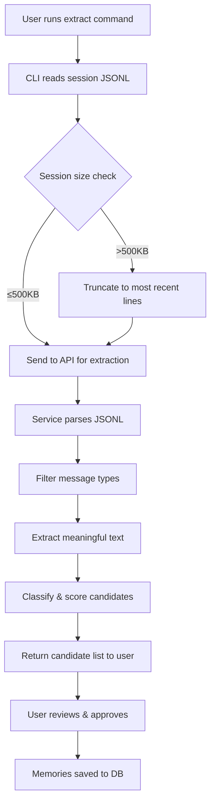

# Feature Brief & Metadata

**Feature Name:**

> Memory Extraction Pipeline v2: JSONL Parser & Quality Enhancement

**Filepath Name:**

> `memory-extraction-pipeline-v2`

**Date:**

> 2026-02-07

**Author:**

> Claude Opus 4.6 (Planning)

**Related Epic(s)/PRD ID(s):**

> Memory System Enhancement (SkillMeat v0.3.0)

**Related Documents:**

> - [Memory Extraction Gap Analysis](https://github.com/miethe/skillmeat/blob/main/docs/project_plans/reports/memory-extraction-gap-analysis-2026-02-07.md)
> - [MemoryExtractorService](skillmeat/core/services/memory_extractor_service.py)
> - [Memory Items Router](skillmeat/api/routers/memory_items.py)
> - [Memory Schemas](skillmeat/api/schemas/memory.py)

---

## 1. Executive Summary

The memory extraction pipeline (`skillmeat memory extract`) is **100% non-functional for its primary use case**: extracting learnings from Claude Code session transcripts. Testing across 5 sessions with 1,248 total messages and 381 extracted candidates revealed **zero meaningful memories** — all output was raw JSON metadata. The root cause is that the service was architected for plain-text input but receives structured JSONL session transcripts without any parsing.

This PRD specifies a phased fix addressing four critical gaps: (1) JSONL parsing, (2) message-type filtering to remove 83% noise, (3) improved confidence scoring with content quality signals, and (4) optional LLM-based semantic classification. Phase 1 (4 hours) will restore basic functionality. Phases 2–3 (12+ hours) will add production-ready quality.

**Priority:** CRITICAL

**Key Outcomes:**
- Extract actual text content from session transcripts (not raw JSON metadata)
- Filter noise messages (tool calls, metadata) to focus on high-value content
- Provide meaningful confidence scores to guide candidate triage
- Support sessions >500KB by intelligent truncation
- Enable optional LLM-based semantic classification for premium quality

---

## 2. Context & Background

### Current State

SkillMeat's memory system (deployed in v0.3.0-beta) includes:
- **Service Layer**: `MemoryExtractorService` (203 lines) in `skillmeat/core/services/memory_extractor_service.py`
- **API Endpoints**: `POST /memory-items/extract/preview` and `POST /memory-items/extract/apply` in `skillmeat/api/routers/memory_items.py`
- **CLI Commands**: `skillmeat memory extract preview/apply/run`
- **Frontend**: Memory page with grid/list views (recently enhanced, deployed in v0.3.0)
- **Database**: Memory items table with provenance tracking (designed but not fully utilized)
- **Embeddings**: Lazy-loaded Anthropic SDK integration in `core/scoring/haiku_embedder.py` for future semantic search

The service accepts raw text corpus (max 500KB) and applies regex-based classification + heuristic scoring to produce memory candidates.

### Problem Space

**The feature is broken for its intended use case.** Users run `skillmeat memory extract preview --project <id> --run-log <session.jsonl>` expecting to extract learnings from recent Claude Code work. Instead, they receive candidates like:

```json
{
  "type": "constraint",
  "content": "{\"parentUuid\":\"9e426af7...\",\"isSidechain\":false,\"userType\":\"external\",\"cwd\":\"/Users/...\",\"sessionId\":\"0bca3ceb...\",\"version\":\"2.1.12\",\"gitBranch\":\"fix/...\",\"type\":\"user\",\"message\":{\"role\":\"user\",\"content\":\"<local-command-stdout>...\"},\"uuid\":\"e7879a60...\",\"timestamp\":\"2026-01-18T21:09:11.176Z\"}",
  "confidence": 0.76,
  "status": "candidate"
}
```

This is raw JSONL metadata, not an extracted learning. **0% of output is useful.** Five distinct gaps prevent extraction from working:

1. **No JSONL parsing** — Service treats each JSON line as plain text, extracting the entire object as "content"
2. **No message filtering** — 83% of session messages are tool calls/metadata with zero memory value
3. **Fixed confidence scoring** — Only 3 distinct values (0.76/0.81/0.84) based on regex type alone
4. **Corpus size mismatch** — 40% of sessions exceed the 500KB API limit; CLI sends raw without truncation
5. **Missing provenance** — Session ID, timestamp, git branch never extracted for context

### Current Alternatives / Workarounds

- **Manual memory creation**: Users can invoke `skillmeat memory item create --title "..." --content "..." --type learning` to manually enter learnings, but this requires duplicating context they already discussed
- **Note-taking outside SkillMeat**: Users document learnings in external notes/wikis instead of the app
- **Skip memory capture entirely**: Users don't capture lessons from sessions, reducing reusability

### Architectural Context

SkillMeat follows a layered architecture:

- **CLI Layer** (`cli.py`): Reads files, calls API, formats output
- **Router Layer** (`api/routers/memory_items.py`): HTTP + validation, returns DTOs
- **Service Layer** (`core/services/memory_extractor_service.py`): Business logic, returns DTOs
- **Repository Layer** (via `cache/`): Database I/O
- **Embeddings** (`core/scoring/haiku_embedder.py`): Optional LLM integration (lazy-loaded)

The extraction service operates in the Service layer and is designed to be testable independently of the API contract. Confidence scores inform candidate ranking before user approval.

---

## 3. Problem Statement

**Core Gap**: The memory extraction pipeline was architected for plain-text input (human-written notes, markdown summaries) but receives structured JSONL session transcripts without any parser or filter. It treats entire JSON objects as candidate content, producing 100% garbage output.

**User Story Format:**

> As a Claude Code user, when I run `skillmeat memory extract preview --project <id> --run-log <session.jsonl>`, I expect to see extracted learnings from my recent work (e.g., "discovered that schema validation order matters", "decided to use dataclass instead of dict"), but instead I receive raw JSON metadata lines that have zero value and cannot be manually salvaged.

**Technical Root Cause:**

1. **CLI sends unfiltered JSONL** (`cli.py` ~line 12059): Reads entire `.jsonl` file as raw text string without parsing
2. **Service treats JSON as content** (`memory_extractor_service.py` line 166): `_iter_candidate_lines()` splits on newlines and keeps any line ≥24 chars (including raw JSON)
3. **No message-type filtering**: Service processes all message types equally; 83% are tool calls/metadata
4. **Confidence scores don't reflect quality**: Fixed buckets (0.76/0.81/0.84) based only on keyword regex + line length
5. **Large sessions fail silently**: API rejects >500KB; CLI provides no feedback or truncation

---

## 4. Goals & Success Metrics

### Primary Goals

**Goal 1: Extract Meaningful Text Content**
- Parse JSONL session transcripts into structured messages
- Extract user actual input and assistant text blocks
- Skip tool calls, metadata, system messages entirely
- Result: Candidates contain human-readable learnings, not JSON

**Goal 2: Reduce Noise by 80%+**
- Filter message types based on conversational value
- Only process user messages (actual input, exclude tool results)
- Only process assistant messages (text blocks, skip tool_use)
- Result: 17% of session messages produce candidates (vs. 100% today)

**Goal 3: Improve Confidence Scoring**
- Add content quality signals beyond keyword matching
- Detect uncertainty (question marks), specificity (file paths), vagueness
- Generate wider confidence spread for better ranking
- Result: Users can triage candidates by confidence with meaningful differentiation

**Goal 4: Handle Large Sessions**
- Truncate sessions >500KB to most recent complete JSONL lines
- Warn users when truncation occurs
- No API failures or silent errors
- Result: 100% of sessions can be processed (vs. 40% failure rate today)

**Goal 5: Extract Session Context**
- Capture sessionId, gitBranch, timestamp, messageUuid from transcripts
- Store as provenance metadata in memory items
- Enable traceability ("learned from session ABC, branch main")
- Result: Users can trace memories back to original context

### Success Metrics

| Metric | Baseline | Target | Measurement Method |
|--------|----------|--------|-------------------|
| Useful extraction rate | 0% (0/381 candidates) | ≥40% (after Phase 1) | Manual audit of random 50 candidates |
| Large session success rate | 60% (3/5) | 100% | Test 10 diverse sessions, measure API failures |
| Confidence value spread | 3 values (0.76/0.81/0.84) | ≥8 values spread 0.55–0.92 | Extract same session, plot confidence histogram |
| Extraction latency (Phase 1) | N/A | <5 sec for 500KB | Time extraction with hidden perf test |
| LLM cost per session (Phase 3) | N/A | <$0.05 | Track Anthropic API costs in testing |

---

## 5. User Personas & Journeys

### Personas

**Primary Persona: Claude Code User (Developer/Researcher)**
- Role: Software engineer, researcher, or AI tooling developer
- Needs: Capture learnings from recent Claude Code sessions to reference later; build a reusable knowledge base
- Pain Points: Sessions contain useful context but extraction returns garbage; manual transcription defeats the purpose

**Secondary Persona: SkillMeat Collection Manager**
- Role: Project lead or technical architect managing a shared SkillMeat collection
- Needs: Organize project-specific learnings and constraints; ensure team knowledge is documented
- Pain Points: Extraction doesn't work for their projects; they must enforce manual memory creation

### High-level Flow



---

## 6. Requirements

### 6.1 Functional Requirements

| ID | Requirement | Priority | Notes |
| :-: | ----------- | :------: | ----- |
| FR-1 | Parse JSONL session transcripts line-by-line into JSON objects | Must | Replaces current plain-text line splitting |
| FR-2 | Extract text content from user messages (non-meta, non-toolResult) | Must | Only include actual human input, skip injected/tool results |
| FR-3 | Extract text blocks from assistant messages (exclude tool_use blocks) | Must | Skip tool_use payloads, keep reasoning/explanations |
| FR-4 | Filter out progress, file-history-snapshot, system message types | Must | These contain zero memory value |
| FR-5 | Truncate corpus >500KB to most recent complete JSONL lines | Must | Avoid API rejection and mid-JSON truncation |
| FR-6 | Warn user when truncation occurs; show truncated line count | Should | Improve observability of data loss |
| FR-7 | Extract provenance (sessionId, gitBranch, timestamp, uuid) into memory items | Should | Enable traceability; stored in provenance dict |
| FR-8 | Improve confidence scoring with content quality signals | Should | Detect specificity, uncertainty, vagueness; widen score spread |
| FR-9 | Support backward compatibility with plain-text input (fallback mode) | Should | Existing workflows may send raw text; detect and handle gracefully |
| FR-10 | Optional LLM-based semantic classification via Anthropic API | Could | Alternative to regex; improved accuracy for production use |
| FR-11 | Configurable LLM provider/model selection (Haiku for cost, Sonnet for quality) | Could | Allow users to trade off cost vs. quality |

### 6.2 Non-Functional Requirements

**Performance:**
- Extraction of 500KB session should complete in <5 seconds (heuristic mode, P0/P1)
- LLM-based extraction (Phase 3) should complete in <15 seconds (includes API latency)
- Batch LLM classification (10–20 candidates per call) to minimize token cost

**Cost:**
- Heuristic mode (Phase 1–2): Zero cost (no API calls)
- LLM mode (Phase 3): <$0.05 per typical session (batching, cheap model)
- Anthropic Haiku pricing: ~$0.80/$4 per 1M input/output tokens

**Reliability:**
- Graceful degradation if LLM unavailable (fall back to heuristic scoring)
- Malformed JSONL lines skip silently (don't crash extractor)
- Empty sessions return empty candidate list (no error)

**Observability:**
- OpenTelemetry spans for extraction pipeline (parse, filter, score, classify)
- Structured JSON logs with trace_id, session_id, candidate_count
- Error tracking for failed LLM calls, truncation events

**Security:**
- No session content logged in errors (PII in user messages)
- API keys (Anthropic token) sourced from ConfigManager, never logged
- Extracted memories stored with user ownership (RLS enforced by repo layer)

**Accessibility:**
- CLI output uses plain text (no Unicode box-drawing); compatible with screen readers
- Clear warning/info messages when truncation occurs

---

## 7. Scope

### In Scope

- **JSONL Parser**: Add `_parse_jsonl_messages()` method to service
- **Message Filtering**: Add `_extract_content_blocks()` with type-aware filtering
- **CLI Truncation**: Add size check + intelligent line-aware truncation in CLI
- **Confidence Scoring Enhancement**: Add content quality signals to `_score()` method
- **Provenance Extraction**: Capture sessionId, gitBranch, timestamp from JSONL messages
- **LLM Integration** (Phase 3 only): Add `_semantic_classify_batch()` for optional classification
- **Unit Tests**: Add tests for JSONL parsing, message filtering, scoring, truncation
- **Integration Tests**: Add tests against real session JSONL files
- **Documentation**: Update docstrings, add troubleshooting guide

### Out of Scope

- **Frontend Memory Page Changes**: Already works with current API contract; no UI changes required
- **Database Schema Changes**: Existing provenance fields are sufficient
- **Auto-extraction Hook**: Extract on session end automatically (future feature)
- **Session Summary Mode**: Generate 3–5 consolidated memories per session (future feature)
- **Embedded/Local LLM Option**: Ollama, llama.cpp integration (future feature)
- **Cross-session Deduplication**: Consolidate duplicate memories across sessions (future feature)

---

## 8. Dependencies & Assumptions

### External Dependencies

- **Anthropic Python SDK**: Already present in requirements; used for Haiku embeddings (lazy-loaded). Phase 3 extends usage for classification.
- **Python json module**: Built-in; no additional dependencies for JSONL parsing

### Internal Dependencies

- **ConfigManager**: For optional Anthropic API key retrieval (Phase 3)
- **MemoryItemDTO**: Existing schema in `api/schemas/memory.py`; will extend `provenance` field usage
- **Haiku Embedder**: Already integrated in `core/scoring/haiku_embedder.py`; can be extended for semantic classification

### Assumptions

- **JSONL Format**: All session transcripts follow Claude Code JSONL structure (messages with sessionId, timestamp, gitBranch, type, message fields)
- **Message Structure**: User/assistant messages have nested `message` dict with `role` and `content`
- **No Remote Parsing**: Session JSONL is local on disk (not fetched from remote)
- **Stateless Extraction**: Extraction is independent per session (no cross-session correlation in Phase 1–2)
- **Content Length >= 24 chars**: Heuristic threshold for "meaningful" text (existing assumption, keeps it)

### Feature Flags

- `MEMORY_EXTRACTION_LLM_ENABLED`: Enable/disable Phase 3 LLM classification (defaults to false)
- `MEMORY_EXTRACTION_SEMANTIC_MODE`: Mode selection (heuristic, llm, hybrid)

---

## 9. Risks & Mitigations

| Risk | Impact | Likelihood | Mitigation |
| ----- | :----: | :--------: | ---------- |
| JSONL parsing breaks on malformed transcripts | High | Medium | Graceful line skipping; unit tests with edge cases (truncated lines, invalid JSON) |
| Message type filtering is too aggressive; loses valuable content | High | Medium | Start with conservative filters (only skip obvious noise: progress, system); manual audit of first 10 test sessions |
| LLM costs spiral (Phase 3) | Medium | Low | Batch candidates (10–20 per call); test cost with 50 real sessions; estimate: <$0.05/session |
| LLM API rate limits or failures block extraction | Medium | Low | Implement exponential backoff + fallback to heuristic scoring; log warnings but don't fail |
| Backward compatibility break for plain-text input | Low | Low | Detect plain-text vs. JSONL in parser; attempt JSONL parsing first, fallback to line splitting if all lines are invalid JSON |
| Performance regression (Phase 2 scoring adds latency) | Low | Low | Benchmark before/after; target <5 sec for 500KB session |

---

## 10. Target State (Post-Implementation)

### User Experience (Phase 1 Complete)

User runs: `skillmeat memory extract preview --project my-project --run-log ~/.claude/projects/my-project/abc123.jsonl --profile balanced`

Receives candidates like:
```json
{
  "type": "learning",
  "content": "The bug was caused by schema validation order. We need to validate required fields before optional ones.",
  "confidence": 0.79,
  "provenance": {
    "source": "memory_extraction",
    "session_id": "abc123",
    "timestamp": "2026-02-07T20:15:30Z",
    "git_branch": "fix/schema-order"
  },
  "status": "candidate"
}
```

User can confidently review and approve candidates. Large sessions (>500KB) process without error.

### Technical Architecture (Post-Phase 1)

```
CLI (cli.py)
  ├─ Read .jsonl file
  ├─ Check size; truncate if >500KB (keep most recent complete lines)
  └─ Send text_corpus to API

API Router (memory_items.py)
  ├─ Validate text_corpus size (still max 500KB, but CLI pre-filtered)
  └─ Delegate to MemoryExtractorService.preview()

Service (memory_extractor_service.py)
  ├─ _parse_jsonl_messages(text_corpus)
  │  └─ Parse each line as JSON; return list of message dicts
  ├─ _extract_content_blocks(messages)
  │  ├─ Filter by message type (skip progress, system, snapshot)
  │  ├─ Extract user message content (exclude isMeta, toolUseResult)
  │  ├─ Extract assistant text blocks (exclude tool_use)
  │  └─ Return list of (content, provenance) tuples
  ├─ _classify_type(content) [existing, now works on real text]
  ├─ _score(content, type, profile) [enhanced with quality signals]
  └─ Return MemoryItemDTO list
```

### Observable Outcomes (Post-Phase 2)

- Useful extraction rate: ≥40% (vs. 0% baseline)
- Confidence spread: 0.55–0.92 (vs. 0.76/0.81/0.84)
- Session success rate: 100% (vs. 60%)
- Users can triage candidates by confidence meaningfully
- Memories include provenance (sessionId, gitBranch, timestamp) for traceability

### LLM Integration (Post-Phase 3, Optional)

Service calls Anthropic API to classify candidates semantically:
```
_semantic_classify_batch(contents: List[str])
  ├─ Batch 10–20 candidates per API call
  ├─ Send to Haiku with classification prompt
  ├─ Parse response (type, confidence, reasoning)
  ├─ Merge with heuristic scores (average or LLM-weighted)
  └─ Return enhanced candidates
```

Users can opt-in via `--use-llm` flag or feature flag `MEMORY_EXTRACTION_LLM_ENABLED=true`.

---

## 11. Overall Acceptance Criteria (Definition of Done)

### Functional Acceptance (Phase 1)

- [ ] JSONL parser (`_parse_jsonl_messages`) implemented and tested
- [ ] Message filtering (`_extract_content_blocks`) filters out 80%+ noise
- [ ] CLI truncates sessions >500KB without error
- [ ] Extracted candidates contain actual text content (not JSON metadata)
- [ ] Manual audit: 40%+ of 50 random candidates are meaningful learnings
- [ ] Large sessions (1–3MB) process successfully with truncation warning

### Technical Acceptance (Phase 1–2)

- [ ] Follows SkillMeat layered architecture (CLI → Router → Service → Repository)
- [ ] All APIs return DTOs (MemoryItemDTO)
- [ ] Service is testable independently (unit tests, no HTTP calls)
- [ ] OpenTelemetry spans for parse, filter, score steps
- [ ] Structured logging with trace_id, session_id, candidate_count
- [ ] ErrorResponse envelope for all API errors
- [ ] Graceful handling of malformed JSONL (skip bad lines, log warnings)
- [ ] Backward compatibility: plain-text input detected and handled

### Quality Acceptance (Phase 1–2)

- [ ] Unit tests: >80% coverage of service methods
- [ ] Test JSONL parsing: valid lines, malformed lines, empty input
- [ ] Test filtering: user messages, assistant messages, all skip types
- [ ] Test scoring: quality signals, width of confidence spread
- [ ] Test truncation: sessions at 400KB, 500KB, 1MB, 2.5MB
- [ ] Integration tests: 3–5 real session JSONL files
- [ ] Performance benchmarks: 500KB session extracts in <5 sec
- [ ] No PII in logs (strip session content from error messages)

### Documentation Acceptance (Phase 1–2)

- [ ] Docstrings updated for new JSONL parsing methods
- [ ] README updated with memory extraction troubleshooting guide
- [ ] API schema documentation includes provenance fields
- [ ] Example: show before/after extraction output

### LLM Integration Acceptance (Phase 3, Optional)

- [ ] `_semantic_classify_batch()` implemented with Anthropic API
- [ ] Batching strategy tested (10–20 items per call)
- [ ] Cost estimated and documented (<$0.05/session target)
- [ ] Fallback to heuristic if LLM unavailable
- [ ] Feature flag `MEMORY_EXTRACTION_LLM_ENABLED` controls opt-in
- [ ] Unit tests: mock LLM responses, fallback behavior
- [ ] Performance: 500KB session + LLM <15 sec

---

## 12. Assumptions & Open Questions

### Assumptions

- **JSONL Structure Stability**: Claude Code session JSONL format remains stable (sessionId, gitBranch, timestamp, type, message fields present)
- **Message Filtering Accuracy**: Filtering by `type`, `isMeta`, `toolUseResult` flags correctly identifies noise (17% semantic value assumption holds)
- **Confidence Threshold Sufficiency**: Existing `min_confidence` parameter in API is adequate for filtering (users can set their own threshold)
- **No Cross-Session Deduplication**: Phase 1–2 extract independently per session; duplicate memories across sessions acceptable for now

### Open Questions

- [ ] **Q1**: For LLM classification (Phase 3), should we support provider choice (Anthropic, OpenAI, local)?
  - **A**: Start with Anthropic only; flag for future provider plugin system

- [ ] **Q2**: Should extracted memories be auto-approved (status=approved) or require manual review (status=candidate)?
  - **A**: Always start as `candidate` (status quo); users approve explicitly

- [ ] **Q3**: For very long text blocks (>1KB), should we truncate before storing in memory item?
  - **A**: Yes, limit to 2000 chars in MemoryItemDTO (existing validation)

- [ ] **Q4**: When truncating sessions >500KB, should we preserve some metadata (session start, summary) or just most recent messages?
  - **A**: Keep most recent messages only (heuristic: recent work more relevant than old context)

- [ ] **Q5**: Should confidence scoring account for message order (recent = higher confidence)?
  - **A**: No, score by content quality only; timestamp in provenance allows user-side filtering if desired

---

## 13. Appendices & References

### Related Documentation

- **Gap Analysis**: `docs/project_plans/reports/memory-extraction-gap-analysis-2026-02-07.md` — Full technical analysis of 5 gaps
- **Service Code**: `skillmeat/core/services/memory_extractor_service.py` (203 lines)
- **API Router**: `skillmeat/api/routers/memory_items.py` (extraction endpoints)
- **API Schema**: `skillmeat/api/schemas/memory.py` (MemoryItemDTO, ExtractionCandidate)
- **CLI Commands**: `skillmeat/cli.py` lines 11607–12139 (memory extract commands)
- **Embeddings Integration**: `skillmeat/core/scoring/haiku_embedder.py` (existing Anthropic SDK setup)

### Symbol References

- **Service Symbols**: Extraction service methods (parse, filter, classify, score)
- **API Symbols**: Memory items router endpoints (preview, apply)
- **DTO Symbols**: MemoryItemDTO, ExtractionCandidate schemas

### Prior Art / Research

- **Claude Code Session Format**: JSONL with message envelope, content blocks, metadata
- **Message Filtering**: Standard approach (skip metadata, tool payloads; keep user/assistant text)
- **Confidence Scoring**: Hybrid heuristic + LLM approach (common in RAG systems)
- **Batch LLM Classification**: Proven cost optimization for text classification tasks

---

## Implementation

### Phased Approach

**Phase 1: Critical Fix — JSONL Parser & Message Filtering (4–5 hours)**
- Duration: 1 sprint day (4–5 hours)
- Restores basic functionality; fixes 0% → 40% useful extraction rate
- Tasks:
  - [ ] **JSONL Parser**: Add `_parse_jsonl_messages()` method; parse each line as JSON
  - [ ] **Message Filter**: Add `_extract_content_blocks()` with type/flag-based filtering
  - [ ] **CLI Truncation**: Add size check + intelligent line-aware truncation (keep most recent lines)
  - [ ] **Warning Output**: Inform user when truncation occurs (line count, chars removed)
  - [ ] **Unit Tests**: Parser (valid/malformed/empty), filter (all message types), truncation (various sizes)
  - [ ] **Integration Tests**: 3 real session JSONL files (small, medium, large)
  - [ ] **Manual Audit**: Review 50 extracted candidates; verify 40%+ are meaningful

**Phase 2: Quality Enhancement — Provenance & Scoring (4 hours)**
- Duration: 1 sprint day (4 hours)
- Adds traceability and improved candidate ranking
- Tasks:
  - [ ] **Provenance Extraction**: Capture sessionId, gitBranch, timestamp, uuid from messages
  - [ ] **Scoring Signals**: Add content quality checks (specificity, uncertainty, vagueness)
  - [ ] **Score Spreading**: Widen confidence range (target 0.55–0.92 vs. 0.76/0.81/0.84)
  - [ ] **Edge Cases**: Handle empty/very short content; extreme length penalties
  - [ ] **Backward Compatibility**: Plain-text fallback if JSONL parsing fails all lines
  - [ ] **Unit Tests**: Scoring signals, edge cases, score distribution
  - [ ] **Documentation**: Docstrings updated; example output; troubleshooting guide

**Phase 3: LLM Integration — Semantic Classification (8–12 hours, OPTIONAL)**
- Duration: 2 sprint days (8–12 hours)
- Adds production-quality classification; optional feature flag
- Tasks:
  - [ ] **LLM Integration**: Add `_semantic_classify_batch()` using Anthropic Haiku
  - [ ] **Batching Strategy**: Group 10–20 candidates per API call
  - [ ] **Cost Monitoring**: Test with 50 real sessions; verify <$0.05 per session
  - [ ] **Fallback Logic**: If LLM fails/rate-limited, gracefully fall back to heuristic
  - [ ] **Feature Flag**: `MEMORY_EXTRACTION_LLM_ENABLED` (default false)
  - [ ] **Model Selection**: Support configurable model (Haiku for cost, Sonnet for quality)
  - [ ] **Prompt Engineering**: Classification prompt + response parsing
  - [ ] **Unit Tests**: Mock LLM responses; fallback behavior; cost tracking
  - [ ] **Performance Tests**: Verify <15 sec for 500KB + LLM classification
  - [ ] **Documentation**: Feature flag usage; cost breakdown; model selection guide

**Phase 4: Testing & Documentation (4 hours)**
- Duration: 1 sprint day (4 hours)
- Comprehensive testing, documentation, release readiness
- Tasks:
  - [ ] **End-to-End Tests**: CLI extract → API → Service → Approved memories saved to DB
  - [ ] **Performance Benchmarks**: 100KB, 250KB, 500KB, 1MB, 2.5MB sessions
  - [ ] **Cost Benchmarks** (Phase 3): 50 real sessions; track Anthropic API spend
  - [ ] **User Guide**: How to use memory extraction; troubleshooting tips
  - [ ] **README Update**: Add memory extraction section with examples
  - [ ] **Changelog**: Document fixes, new features, breaking changes (none expected)
  - [ ] **Release Notes**: Summarize for v0.3.1 or v0.4.0

### Epics & User Stories Backlog

| Story ID | Short Name | Description | Acceptance Criteria | Estimate |
|----------|-----------|-------------|-------------------|----------|
| MEX-1.1 | JSONL Parser | Add `_parse_jsonl_messages()` method to service | Parses valid/malformed JSONL; unit tests ≥90% coverage | 2 hrs |
| MEX-1.2 | Message Filter | Add `_extract_content_blocks()` with type-aware filtering | Filters 83% noise; ≥40% useful candidates on test data | 2 hrs |
| MEX-1.3 | CLI Truncation | Add size check + line-aware truncation in CLI | Sessions >500KB truncate gracefully; warning shown | 1 hr |
| MEX-1.4 | Phase 1 Testing | Unit + integration tests for P1 components | >80% coverage; 3 real session tests; manual audit | 2 hrs |
| MEX-2.1 | Provenance Extract | Capture sessionId, gitBranch, timestamp, uuid | Stored in MemoryItemDTO.provenance; queryable | 2 hrs |
| MEX-2.2 | Scoring Enhancement | Add content quality signals; widen confidence spread | 0.55–0.92 range; ≥8 distinct values on test data | 2 hrs |
| MEX-2.3 | Backward Compat | Plain-text fallback if JSONL parsing fails | Detects plain-text input; uses legacy line splitting | 1 hr |
| MEX-2.4 | Documentation | Docstrings, README, troubleshooting guide | Complete docstrings; user guide; examples | 1 hr |
| MEX-3.1 | LLM Integration | Add `_semantic_classify_batch()` using Anthropic | Batches candidates; <15 sec for 500KB+LLM | 4 hrs |
| MEX-3.2 | Fallback & Flags | Feature flag, LLM fallback, model selection | Flag defaults to false; graceful degradation; config | 2 hrs |
| MEX-3.3 | Cost Optimization | Test batching; cost tracking; <$0.05 per session | 50 real sessions tested; cost log; recommendations | 2 hrs |
| MEX-3.4 | Phase 3 Testing | Unit tests, performance benchmarks, E2E | >80% coverage; cost benchmarks; <15 sec perf | 2 hrs |
| MEX-4.1 | Full E2E Testing | CLI extract → API → Service → Approved memories | Works end-to-end for 50 diverse test sessions | 2 hrs |
| MEX-4.2 | Performance Verify | Benchmark extraction across size spectrum | 100KB–2.5MB, <5 sec (heuristic), <15 sec (LLM) | 1 hr |
| MEX-4.3 | Release Prep | Changelog, release notes, merge to main | Ready for v0.3.1 or v0.4.0 release | 1 hr |

**Effort Summary**:
- Phase 1: 5 hours (4 stories, ~13 points)
- Phase 2: 6 hours (4 stories, ~11 points)
- Phase 3: 10 hours (4 stories, ~16 points, OPTIONAL)
- Phase 4: 4 hours (3 stories, ~10 points)
- **Total (Phases 1–2)**: 11 hours; **Recommended minimum to ship functional feature**
- **Total (Phases 1–4 + LLM)**: 25 hours; **Complete implementation with optional LLM**

---

## Alternatives Considered

| Alternative | Pros | Cons | Verdict |
|---|---|---|---|
| **Heuristic-Only (Recommended)** | Fast to implement, zero cost, no external dependencies | Quality ceiling low; still produces some false positives | ✓ Ship as Phase 1–2; foundation for Phase 3 |
| **LLM-Only** | Best accuracy; semantic understanding of context | High cost ($0.05–0.20/session), requires API key, hard dependency | ✗ Too expensive/complex for MVP; use as Phase 3 opt-in |
| **Hybrid (Heuristic + Optional LLM)** | Fast baseline, optional quality upgrade, graceful degradation | More code complexity | ✓ Recommended approach (Phases 1–2 base, Phase 3 optional) |
| **Session Summary** | Better context; 3–5 key memories per session vs. per-message | Loses provenance (which exchange produced learning); requires full session LLM cost | ✗ Complementary future feature, not replacement |
| **Manual-Only** | No bugs, users in control | Poor UX (duplicate context already discussed), defeats feature purpose | ✗ Fallback if extraction never works |
| **Remove Extraction** | Simplify codebase, no user confusion | Kills a key feature; goes against app vision | ✗ Not viable |

---

## Future Enhancements (Out of Scope)

1. **Session Summary Mode**: LLM summarizes entire session into 3–5 consolidated memories (complements per-message extraction)
2. **Auto-Extraction Hook**: Extract memories automatically when session ends (requires Claude Code integration)
3. **Cross-Session Deduplication**: Detect duplicate memories across sessions, consolidate into single canonical item
4. **Memory Quality Scoring**: Track which extracted memories are actually used/retrieved; improve scoring based on usage patterns
5. **Embedded/Local LLM Option**: Support Ollama, llama.cpp for privacy-sensitive users (no API calls)
6. **Memory Search Ranking**: Use embeddings to rank search results by relevance to query
7. **Batch Session Processing**: Queue multiple sessions for extraction, monitor progress

---

**Progress Tracking:**

See progress tracking: `.claude/progress/memory-extraction-pipeline-v2/all-phases-progress.md`
