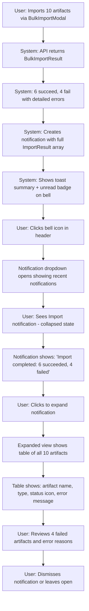
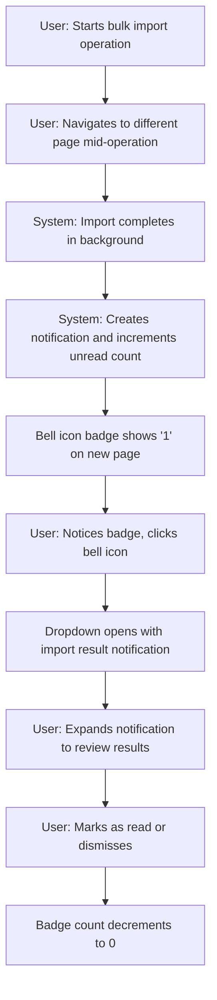
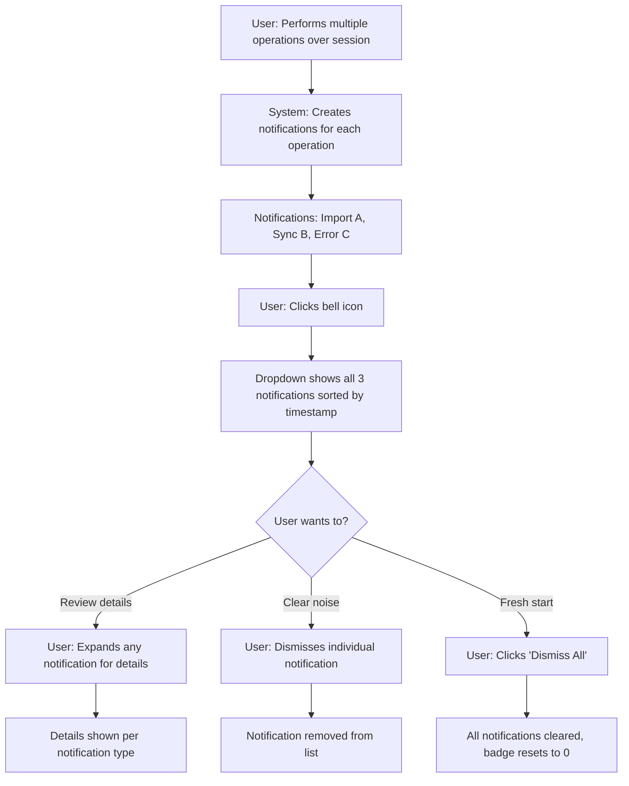

# PRD: Notification System

**Feature Name:** Notification System

**Filepath Name:** `notification-system-v1`

**Date:** 2025-12-03

**Author:** Claude Code (AI Agent)

**Version:** 1.0

**Status:** Draft

**Builds On:**
- Smart Import & Discovery PRD
- Entity Lifecycle Management PRD

---

## 1. Executive Summary

The Notification System adds a persistent notification center to the SkillMeat web UI, addressing the gap where transient toast messages disappear before users can act on failures or review detailed results. The system captures import results, sync operations, errors, and system messages in a persistent, expandable interface accessible from the app header.

**Priority:** HIGH

**Key Outcomes:**
- Users can review detailed failure reasons for failed imports instead of seeing only "3 failed"
- Notification history persists across page navigation within a session
- Expandable detail views show per-artifact status for bulk operations
- Bell icon with unread badge provides quick access to notification center
- Frontend-only implementation requires no backend changes for MVP

---

## 2. Context & Background

### Current State

**What Exists Today:**

1. **Toast Notification System:**
   - Sonner library integrated in `Providers` component
   - Toast utilities in `skillmeat/web/lib/toast-utils.ts`:
     - `showSuccessToast(message, description?)`
     - `showErrorToast(error, fallbackMessage)`
     - `showWarningToast(message, description?)`
     - `showImportResultToast(result)` - shows summary only
   - Toasts auto-dismiss after 4-5 seconds
   - No persistent record of notifications

2. **Bulk Import Flow:**
   - `BulkImportModal` calls `showImportResultToast()` with `BulkImportResult`
   - Backend returns detailed `ImportResult[]` with per-artifact success/message/error
   - Frontend displays only summary: "Imported 3 artifact(s), 2 failed"
   - Detailed failure reasons (`error` field per artifact) are discarded
   - Users cannot see which specific artifacts failed or why

3. **Error Handling:**
   - API errors shown via `showErrorToast()`
   - Generic error messages with no detail preservation
   - No way to review past errors after toast dismissal

**Key Components:**
- `skillmeat/web/lib/toast-utils.ts` - Toast wrapper functions
- `skillmeat/web/components/discovery/BulkImportModal.tsx` - Calls `showImportResultToast()`
- `skillmeat/web/types/discovery.ts` - `BulkImportResult` and `ImportResult` types
- `skillmeat/api/schemas/discovery.py` - Backend schemas with detailed error info

### Problem Space

**Pain Points:**

1. **Silent Failures**
   - User imports 10 artifacts, sees "Imported 6, 4 failed"
   - Toast disappears before user can read it
   - No way to see which 4 failed or why
   - User must retry entire batch or guess which artifacts to re-import

2. **Lost Context**
   - Toasts disappear after 4-5 seconds
   - User navigates away, loses failure information
   - No notification history to review
   - Cannot share error details with support

3. **Poor Discoverability**
   - Users may miss toast notifications entirely
   - No visual indicator of past errors/events
   - Cannot review what happened during bulk operations

4. **Data Loss**
   - Backend returns detailed `ImportResult[]` with per-artifact errors
   - Frontend receives data but only shows summary
   - Rich error context (`message`, `error` fields) is discarded
   - Users cannot debug or self-serve

### Current Alternatives / Workarounds

**No Workaround Available:**
- Cannot review past notifications once toasts dismiss
- Cannot see detailed failure reasons for bulk imports
- Must manually track which imports failed

**Partial Workaround:**
- Users screenshot toasts before they disappear (impractical)
- Check browser console for API errors (technical users only)

### Architectural Context

**Frontend Architecture:**
- Next.js 15 App Router with `app/layout.tsx` as root layout
- Header component at `skillmeat/web/components/header.tsx`
- Providers component at `skillmeat/web/components/providers.tsx` includes Toaster
- TanStack Query for server state management
- Local storage for client-side persistence

**Notification Data Sources:**
- `BulkImportResult` from `/api/v1/artifacts/discover/import`
- `DiscoveryResult` from `/api/v1/artifacts/discover` (errors field)
- Generic API errors via `ApiError` class
- Future: Sync results, deployment notifications

---

## 3. Problem Statement

**Core Gap:** Users cannot review detailed failure information from bulk operations because toast notifications are ephemeral and only show summaries, resulting in frustration and repeated failed imports.

**User Story Format:**

> "As a user importing 10 artifacts from discovery, when 3 imports fail, I want to see a persistent list showing which artifacts failed and the exact error message for each, so I can fix the issues and retry only the failed imports."

> "As a user who navigates away during a bulk import, I want to see a bell icon with an unread badge indicating completed operations, so I can return to check the results without losing context."

> "As a user troubleshooting an import failure, I want to expand a notification to see per-artifact status with error messages, so I can identify patterns (e.g., all failures are permission errors) and resolve them efficiently."

**Technical Root Causes:**
- No persistent notification storage mechanism
- `showImportResultToast()` only uses `total_imported` and `total_failed`, discards `results[]`
- No UI component for notification center or history
- No state management for notifications across components
- Toast system designed for ephemeral messages only

**Files Involved:**
- `skillmeat/web/components/header.tsx` - Add bell icon and dropdown
- `skillmeat/web/lib/toast-utils.ts` - Integrate with notification store
- `skillmeat/web/components/discovery/BulkImportModal.tsx` - Send detailed results to store
- NEW: `skillmeat/web/lib/notification-store.ts` - State management
- NEW: `skillmeat/web/components/notifications/` - UI components
- NEW: `skillmeat/web/types/notification.ts` - Type definitions

---

## 4. Goals & Success Metrics

### Primary Goals

**Goal 1: Persistent Notification Storage**
- Store notifications in React state + localStorage
- Persist across page navigation (within session)
- Support max 50 notifications (FIFO eviction)
- Measurable: All notifications accessible until manually dismissed or capacity reached

**Goal 2: Detailed Import Result Display**
- Show per-artifact status for bulk operations
- Display error messages and reasons for failures
- Support expandable detail views
- Measurable: 100% of import failure reasons visible to users

**Goal 3: Accessible Notification Center**
- Bell icon in app header with unread count badge
- Dropdown panel showing recent notifications
- Keyboard navigable, screen reader friendly
- Measurable: Notification center accessible from any page in <2 clicks

**Goal 4: Read/Unread State Management**
- Track read/unread status per notification
- Mark as read when viewed
- Dismiss individual or all notifications
- Measurable: Unread count accurately reflects notification state

### Success Metrics

| Metric | Baseline | Target | Measurement |
|--------|----------|--------|-------------|
| Users who can see failure reasons | 0% (toast only) | 100% | Feature completion |
| Notification retention across navigation | 0% (ephemeral) | 100% (session) | localStorage + state |
| Time to find import failure reason | N/A (impossible) | <10 seconds | User testing |
| Support requests for "why did import fail" | Baseline count | -50% | Support ticket tracking |
| Users who interact with notification center | N/A | 80%+ of users with failures | Analytics |
| Notification UI render time | N/A | <100ms | Performance testing |

---

## 5. User Personas & Journeys

### Personas

**Primary: Frustrated Fred**
- Role: Developer importing multiple artifacts from discovery
- Needs: Clear feedback on what failed and why
- Pain: Sees "3 failed" in toast but no details before it disappears

**Secondary: Multitasking Mary**
- Role: Developer navigating between pages during operations
- Needs: Persistent notification indicator so she can check results later
- Pain: Loses context when navigating away, must retry entire operation

**Tertiary: Debugging Dan**
- Role: Power user who wants to troubleshoot import failures
- Needs: Detailed error messages to debug permission/format issues
- Pain: No access to structured error data, must guess root causes

### High-level Flows

**Scenario A: Bulk Import with Failures**



**Scenario B: Notification Persistence Across Navigation**



**Scenario C: Review Notification History**



---

## 6. Requirements

### 6.1 Functional Requirements

| ID | Requirement | Priority | Category | Notes |
|:--:|-----------|:--------:|----------|-------|
| FR-1 | Store notifications in React state with localStorage persistence | MUST | Storage | Max 50 notifications, FIFO eviction |
| FR-2 | Display bell icon in app header with unread count badge | MUST | UI | Badge shows count, hides when 0 |
| FR-3 | Clicking bell icon opens dropdown panel with notifications | MUST | UI | Dropdown anchored to bell icon |
| FR-4 | Show notification list sorted by timestamp (newest first) | MUST | UI | Display title, timestamp, read status |
| FR-5 | Support notification types: import_result, sync_result, error, info | MUST | Data Model | Extensible for future types |
| FR-6 | Show collapsed notification with summary (title + message) | MUST | UI | One-line summary per notification |
| FR-7 | Expand notification to show detailed view on click | MUST | UI | Toggle expand/collapse |
| FR-8 | Display import result details in expandable table | MUST | Import Details | Columns: artifact, type, status, error |
| FR-9 | Show status icons for success/failure (✓/✗) in detail table | SHOULD | Import Details | Visual feedback per artifact |
| FR-10 | Capture full BulkImportResult including results[] array | MUST | Data Capture | Store all per-artifact data |
| FR-11 | Mark notification as read when expanded | SHOULD | Read State | Auto-mark on first expand |
| FR-12 | Allow user to manually dismiss individual notifications | MUST | Dismiss | Remove from list permanently |
| FR-13 | Provide "Dismiss All" action in dropdown | SHOULD | Dismiss | Clear all notifications at once |
| FR-14 | Persist notifications to localStorage on change | MUST | Persistence | Restore on page reload |
| FR-15 | Restore notifications from localStorage on app load | MUST | Persistence | Hydrate state from storage |
| FR-16 | Show empty state when no notifications | SHOULD | UX | "No notifications" message |
| FR-17 | Show timestamp for each notification (relative time) | SHOULD | UX | "2 minutes ago", "1 hour ago" |
| FR-18 | Support keyboard navigation in dropdown | SHOULD | Accessibility | Tab, Enter, Escape |
| FR-19 | Announce new notifications to screen readers | SHOULD | Accessibility | ARIA live region |
| FR-20 | Close dropdown when clicking outside | MUST | UX | Standard dropdown behavior |

### 6.2 Non-Functional Requirements

**Performance:**
- Notification center render time < 100ms
- Dropdown open/close animation < 300ms
- localStorage read/write < 10ms
- Support 50 notifications without lag

**Reliability:**
- Notification storage fails gracefully if localStorage unavailable
- State syncs reliably between components
- No data loss on page reload
- FIFO eviction works correctly at capacity

**Observability:**
- Track notification creation by type
- Track notification interactions (expand, dismiss)
- Log localStorage failures
- Analytics for notification center usage

**Security:**
- Validate notification data before storing
- Sanitize error messages from API (XSS prevention)
- No sensitive data in localStorage (PII-free)
- Notifications scoped to current user session

**Accessibility:**
- Bell icon keyboard accessible (Tab + Enter)
- Dropdown keyboard navigable
- Screen reader announces unread count
- ARIA labels for all interactive elements
- Focus management in dropdown

**Usability:**
- Notification text clear and actionable
- Error messages user-friendly (no stack traces)
- Timestamp format human-readable
- Visual hierarchy clear (new vs read)

---

## 7. Scope

### In Scope

**Notification Center UI:**
- Bell icon component with unread badge
- Dropdown panel component
- Notification list component
- Expandable notification item component
- Empty state component

**Notification Types:**
- Import Result notifications (primary use case)
  - Summary: "Import completed: X succeeded, Y failed"
  - Details: Table with per-artifact status
- Error notifications (generic API errors)
- Future-ready structure for sync, deployment, system messages

**State Management:**
- React Context + Hooks for notification store
- localStorage persistence
- Read/unread state tracking
- Dismiss actions (individual + all)
- Max 50 notifications with FIFO eviction

**Data Capture:**
- Integrate with `showImportResultToast()` to capture full `BulkImportResult`
- Store detailed `ImportResult[]` array
- Capture error details from API responses
- Preserve metadata (timestamp, type, read status)

**Interactions:**
- Click bell to open/close dropdown
- Click notification to expand/collapse details
- Dismiss individual notification
- Dismiss all notifications
- Mark as read on expand

### Out of Scope

**Not in MVP:**
- Backend notification storage (frontend-only for MVP)
- Push notifications (browser/desktop)
- Email notifications
- Real-time updates via WebSocket
- Notification preferences/settings
- Notification filtering by type
- Search within notifications
- Notification grouping (e.g., batch multiple imports)
- Notification actions (e.g., "Retry import" button)
- Export notifications to file

**Future Considerations:**
- Backend persistence for cross-device sync
- Notification preferences (enable/disable by type)
- Rich notifications with action buttons
- Notification templates for common patterns
- Integration with external notification services

---

## 8. Dependencies & Assumptions

### External Dependencies

**Libraries (Frontend):**
- `lucide-react`: Bell icon component (already used)
- `date-fns`: Relative timestamp formatting (e.g., "2 minutes ago")
- Existing: Radix UI (Dropdown, Table, Badge) - already installed
- Existing: Tailwind CSS for styling
- Existing: React Context API for state management

**Browser APIs:**
- localStorage for persistence (fallback: in-memory only)
- No external API dependencies (frontend-only storage)

### Internal Dependencies

**Feature Dependencies:**
- **Bulk Import Flow**: Source of primary notification type (import results)
- **Toast Utils**: Integration point for capturing notification data
- **Header Component**: Location for bell icon
- **Providers Component**: Potential location for notification context provider

**Status:**
- Bulk Import: Implemented (BulkImportModal.tsx)
- Toast Utils: Implemented (toast-utils.ts)
- Header Component: Implemented (header.tsx)
- Discovery Types: Implemented (types/discovery.ts)

### Assumptions

- Users want persistent notification history (not just ephemeral toasts)
- localStorage is available in 99%+ of user browsers
- Session-scoped persistence is sufficient (no cross-device sync needed for MVP)
- Users will not accumulate >50 notifications per session (FIFO is acceptable)
- Notification data is not sensitive (safe to store in localStorage)
- Users prefer quick access from header over dedicated notifications page
- Import result notifications are the primary use case (80%+ of notifications)
- Users can self-serve with detailed error messages (reduces support load)

### Feature Flags

Not required for MVP (frontend-only feature, easy to rollback)

Optional future flags:
- `ENABLE_NOTIFICATION_CENTER`: Enable/disable entire feature
- `NOTIFICATION_MAX_COUNT`: Configure max notifications (default: 50)
- `NOTIFICATION_PERSIST_BACKEND`: Future backend storage toggle

---

## 9. Risks & Mitigations

| Risk | Impact | Likelihood | Mitigation |
|------|--------|-----------|-----------|
| localStorage unavailable (private browsing, disabled) | MEDIUM | LOW | Fallback to in-memory store, show warning banner |
| Notification data too large (hits localStorage quota) | MEDIUM | MEDIUM | Limit to 50 notifications, truncate long error messages |
| Stale notifications persist across sessions (confusing) | LOW | MEDIUM | Clear localStorage on logout, add TTL (e.g., 24 hours) |
| Dropdown blocks critical UI elements | MEDIUM | LOW | Proper z-index, close on scroll, position aware |
| Notification overflow (hundreds of notifications) | LOW | LOW | FIFO eviction at 50, "Dismiss All" action |
| Performance degradation with many notifications | MEDIUM | LOW | Virtualized list for 50+ items, lazy render details |
| Users miss notifications (don't notice bell icon) | MEDIUM | MEDIUM | Animate badge on new notification, toast still shows |
| Notification detail overload (too much info) | LOW | MEDIUM | Collapsible details, clear visual hierarchy, summary first |
| XSS via unsanitized error messages | HIGH | LOW | Sanitize all error messages, validate data before render |
| Notification center adoption low (users ignore) | MEDIUM | MEDIUM | A/B test with/without, track engagement, iterate UX |

---

## 10. Target State (Post-Implementation)

### User Experience

**App Header with Bell Icon:**
```
+--------------------------------------------------+
| SkillMeat [Logo]              [🔔 3] GitHub Docs |
+--------------------------------------------------+
  - Bell icon with badge showing "3" unread notifications
  - Hover: tooltip "Notifications"
  - Click: opens dropdown panel
```

**Notification Dropdown (Collapsed State):**
```
+----------------------------------------+
| Notifications                          |
|                                        |
| [🔔] Import completed              2m  |
|      6 succeeded, 4 failed        [×]  |
|                                        |
| [⚠️] Sync failed                  5m  |
|      Network timeout              [×]  |
|                                        |
| [ℹ️] System message               1h  |
|      Update available             [×]  |
|                                        |
| [Dismiss All]                          |
+----------------------------------------+
```

**Notification Dropdown (Expanded Import Result):**
```
+----------------------------------------------------------+
| Notifications                                            |
|                                                          |
| [🔔] Import completed                               2m   |
|      6 succeeded, 4 failed                          [×]  |
|      [Expanded Detail View]                              |
|      +--------------------------------------------------+|
|      | Artifact       | Type  | Status | Error          ||
|      |----------------|-------|--------|----------------||
|      | canvas-design  | skill | ✓      | -              ||
|      | pdf-handler    | skill | ✓      | -              ||
|      | code-review    | agent | ✓      | -              ||
|      | git-helper     | cmd   | ✗      | Already exists ||
|      | data-analyzer  | skill | ✗      | Invalid format ||
|      | ...            | ...   | ...    | ...            ||
|      +--------------------------------------------------+|
|                                                          |
| [⚠️] Sync failed                                    5m   |
|      Network timeout                                [×]  |
|                                                          |
| [Dismiss All]                                            |
+----------------------------------------------------------+
```

### Technical Architecture

**New Components:**
```
components/
└── notifications/
    ├── notification-bell.tsx        # Bell icon with badge
    ├── notification-dropdown.tsx    # Dropdown panel
    ├── notification-list.tsx        # List of notifications
    ├── notification-item.tsx        # Individual notification (collapsed)
    └── notification-details/
        ├── import-result-detail.tsx # Expandable import result table
        ├── error-detail.tsx         # Error notification detail
        └── generic-detail.tsx       # Generic message detail
```

**New State Management:**
```
lib/
└── notification-store.ts            # React Context + Hooks
    - NotificationContext
    - NotificationProvider
    - useNotifications() hook
    - useNotificationActions() hook
```

**New Types:**
```typescript
// types/notification.ts

export type NotificationType = 'import_result' | 'sync_result' | 'error' | 'info';

export interface BaseNotification {
  id: string;                    // UUID
  type: NotificationType;
  title: string;
  message: string;
  timestamp: Date;
  read: boolean;
  dismissed: boolean;
}

export interface ImportResultNotification extends BaseNotification {
  type: 'import_result';
  details: {
    totalRequested: number;
    totalImported: number;
    totalFailed: number;
    results: Array<{
      artifactName: string;
      artifactType: string;
      artifactId: string;
      success: boolean;
      message: string;
      error?: string;
    }>;
  };
}

export interface ErrorNotification extends BaseNotification {
  type: 'error';
  details: {
    errorCode?: string;
    errorMessage: string;
    context?: Record<string, unknown>;
  };
}

export type Notification = ImportResultNotification | ErrorNotification | GenericNotification;
```

**Integration Points:**
```typescript
// Modified: lib/toast-utils.ts
import { useNotifications } from '@/lib/notification-store';

export function showImportResultToast(result: BulkImportResult) {
  const { addNotification } = useNotifications();

  // Show ephemeral toast as before
  if (result.total_imported > 0 && result.total_failed === 0) {
    showSuccessToast(`Successfully imported ${result.total_imported} artifact(s)`);
  } else if (result.total_imported > 0 && result.total_failed > 0) {
    showWarningToast(
      `Imported ${result.total_imported} artifact(s)`,
      `${result.total_failed} failed`
    );
  } else {
    showErrorToast(null, 'Import failed - no artifacts imported');
  }

  // NEW: Create persistent notification with full details
  addNotification({
    type: 'import_result',
    title: 'Import completed',
    message: `${result.total_imported} succeeded, ${result.total_failed} failed`,
    details: {
      totalRequested: result.total_requested,
      totalImported: result.total_imported,
      totalFailed: result.total_failed,
      results: result.results.map(r => ({
        artifactName: extractArtifactName(r.artifact_id),
        artifactType: extractArtifactType(r.artifact_id),
        artifactId: r.artifact_id,
        success: r.success,
        message: r.message,
        error: r.error,
      })),
    },
  });
}
```

**Updated Header Component:**
```tsx
// components/header.tsx
import { NotificationBell } from '@/components/notifications/notification-bell';

export function Header() {
  return (
    <header className="...">
      <div className="container flex h-14 items-center">
        <div className="mr-4 flex">...</div>
        <div className="flex flex-1 items-center justify-between space-x-2 md:justify-end">
          <nav className="flex items-center space-x-6 text-sm font-medium">
            {/* NEW: Notification bell */}
            <NotificationBell />
            <Link href="...">GitHub</Link>
            <Link href="...">Documentation</Link>
          </nav>
        </div>
      </div>
    </header>
  );
}
```

**Updated Providers Component:**
```tsx
// components/providers.tsx
import { NotificationProvider } from '@/lib/notification-store';

export function Providers({ children }: { children: React.ReactNode }) {
  const [queryClient] = useState(() => new QueryClient({ ... }));

  return (
    <QueryClientProvider client={queryClient}>
      {/* NEW: Notification provider */}
      <NotificationProvider>
        {children}
        <Toaster />
      </NotificationProvider>
    </QueryClientProvider>
  );
}
```

### Observable Outcomes

**For Users:**
- 100% of import failures now have visible, actionable error messages
- Users can review notification history after navigating away
- Time to diagnose import failures reduced from "impossible" to <10 seconds
- Support requests for "why did my import fail" decrease significantly

**For System:**
- Notification center renders in <100ms
- localStorage persistence reliable across page reloads
- No performance degradation with 50 notifications
- Analytics show 80%+ interaction rate for users with failures

**For Product:**
- Feature adoption tracked via analytics
- User feedback on notification usefulness
- Foundation for future notification types (sync, deployment, etc.)
- Reduced friction in bulk import workflows

---

## 11. Overall Acceptance Criteria (Definition of Done)

### Functional Acceptance

- [ ] Bell icon displayed in app header with unread count badge
- [ ] Badge shows correct unread count, hides when count is 0
- [ ] Clicking bell icon opens dropdown panel
- [ ] Clicking outside dropdown closes panel
- [ ] Notification list shows all notifications sorted by timestamp (newest first)
- [ ] Notification item displays title, message, timestamp in collapsed state
- [ ] Clicking notification expands to show detailed view
- [ ] Import result detail shows table with all artifacts and error messages
- [ ] Status icons (✓/✗) displayed correctly per artifact
- [ ] Mark notification as read when expanded
- [ ] Dismiss individual notification removes it from list
- [ ] "Dismiss All" action clears all notifications
- [ ] Notifications persist to localStorage on creation/update
- [ ] Notifications restored from localStorage on page reload
- [ ] FIFO eviction works correctly at 50 notification capacity
- [ ] Full `BulkImportResult` data captured in notification
- [ ] Error messages from API properly sanitized and displayed

### Technical Acceptance

- [ ] NotificationProvider wraps app in Providers component
- [ ] useNotifications hook provides state and actions
- [ ] NotificationBell component integrated into Header
- [ ] Notification dropdown uses Radix UI primitives
- [ ] Import result detail table uses existing Table component
- [ ] TypeScript types defined for all notification data structures
- [ ] localStorage read/write operations handle errors gracefully
- [ ] In-memory fallback works when localStorage unavailable
- [ ] showImportResultToast() updated to create notifications
- [ ] Error notifications created for API failures

### Quality Acceptance

- [ ] Unit tests for notification store (>80% coverage)
- [ ] Unit tests for notification components
- [ ] Integration tests for bell icon + dropdown interaction
- [ ] Integration tests for expand/collapse notification
- [ ] E2E test: bulk import → notification created → expand → dismiss
- [ ] E2E test: notification persistence across page reload
- [ ] Accessibility audit for bell icon and dropdown (WCAG 2.1 AA)
- [ ] Keyboard navigation works (Tab, Enter, Escape)
- [ ] Screen reader announces unread count and new notifications
- [ ] Visual regression tests for notification UI
- [ ] Performance test: render 50 notifications < 100ms

### Documentation Acceptance

- [ ] User guide: How to use notification center
- [ ] Developer docs: How to add new notification types
- [ ] Developer docs: NotificationProvider and hooks API
- [ ] Code comments in notification-store.ts
- [ ] Storybook stories for notification components (optional)

---

## 12. Assumptions & Open Questions

### Assumptions

- Users primarily need notification history for troubleshooting failures
- Session-scoped persistence (localStorage) is sufficient for MVP
- 50 notification capacity is adequate (users won't hit limit)
- Users will not accumulate sensitive data in notifications
- Import result notifications are 80%+ of notification volume
- Users prefer header-based access over dedicated notifications page
- Notification detail is more important than notification actions (e.g., retry)

### Open Questions

- [ ] **Q1: Notification TTL**
  - Should notifications expire after X hours/days?
  - **Recommendation:** No TTL for MVP, clear on logout, revisit if users complain about stale data

- [ ] **Q2: Notification Grouping**
  - Should multiple import operations be grouped into one notification?
  - **Recommendation:** No grouping for MVP, one notification per operation

- [ ] **Q3: Notification Actions**
  - Should notifications have action buttons (e.g., "Retry Import")?
  - **Recommendation:** Not in MVP, add in future iteration if user feedback requests

- [ ] **Q4: Notification Preferences**
  - Should users be able to disable certain notification types?
  - **Recommendation:** Not in MVP, all notifications enabled by default

- [ ] **Q5: Backend Storage**
  - When should we add backend persistence for cross-device sync?
  - **Recommendation:** Post-MVP, only if users request cross-device access

- [ ] **Q6: Notification Sound/Visual Effects**
  - Should new notifications trigger sound or animation?
  - **Recommendation:** Subtle badge animation only, no sound for MVP

- [ ] **Q7: Notification Page**
  - Should there be a dedicated /notifications page for full history?
  - **Recommendation:** Not in MVP, dropdown is sufficient for 50 notifications

---

## 13. Appendices & References

### Related Documentation

- **Smart Import & Discovery PRD**: `/docs/project_plans/PRDs/enhancements/smart-import-discovery-v1.md`
- **Entity Lifecycle Management PRD**: `/docs/project_plans/PRDs/features/entity-lifecycle-management-v1.md`
- **Web UI Consolidation PRD**: `/docs/project_plans/PRDs/enhancements/web-ui-consolidation-v1.md`

### External References

- **Radix UI Dropdown**: https://www.radix-ui.com/docs/primitives/components/dropdown-menu
- **Sonner Toast Library**: https://sonner.emilkowal.ski/
- **ARIA Live Regions**: https://developer.mozilla.org/en-US/docs/Web/Accessibility/ARIA/ARIA_Live_Regions
- **localStorage API**: https://developer.mozilla.org/en-US/docs/Web/API/Window/localStorage

### Component References

**Existing Components to Use:**
- Radix UI Dropdown (for notification panel)
- Radix UI Badge (for unread count)
- shadcn Table (for import result detail)
- lucide-react Bell icon

**New Components:**
- NotificationBell (bell icon + badge)
- NotificationDropdown (panel)
- NotificationList (list container)
- NotificationItem (individual notification)
- ImportResultDetail (table for import results)

**Design Patterns:**
- Follow existing header component patterns (lucide icons, Tailwind styles)
- Match existing modal/dropdown styles (shadcn/Radix UI)
- Consistent with existing table components

---

## 14. Implementation Plan

### Phase 1: Foundation (1 week)

**Tasks:**
- [ ] Define TypeScript types for notifications
  - `types/notification.ts` with all notification interfaces
  - Export `Notification`, `ImportResultNotification`, `ErrorNotification`, etc.
- [ ] Create notification store with React Context
  - `lib/notification-store.ts`
  - NotificationProvider component
  - useNotifications hook (state + actions)
  - localStorage persistence logic
  - FIFO eviction at 50 capacity
- [ ] Unit tests for notification store (>80% coverage)
  - Test add, dismiss, mark as read
  - Test localStorage persistence and restoration
  - Test FIFO eviction
  - Test fallback when localStorage unavailable

### Phase 2: Core UI Components (1 week)

**Tasks:**
- [ ] Create NotificationBell component
  - Bell icon from lucide-react
  - Badge with unread count
  - Hover tooltip
  - Click handler to toggle dropdown
- [ ] Create NotificationDropdown component
  - Radix UI Dropdown primitive
  - Header with "Notifications" title
  - "Dismiss All" button
  - Empty state when no notifications
- [ ] Create NotificationList component
  - Map over notifications array
  - Sort by timestamp (newest first)
  - Render NotificationItem for each
- [ ] Create NotificationItem component
  - Collapsed state: title, message, timestamp, dismiss button
  - Expanded state: include detail view
  - Toggle expand/collapse on click
  - Mark as read on expand
  - Visual indicator for read/unread
- [ ] Unit tests for all UI components (>80% coverage)
  - Test click handlers
  - Test expand/collapse behavior
  - Test dismiss action

### Phase 3: Detail Views (1 week)

**Tasks:**
- [ ] Create ImportResultDetail component
  - Table using shadcn Table component
  - Columns: Artifact, Type, Status, Error
  - Status icons (✓/✗) using lucide-react
  - Handle empty results array
  - Responsive design (stack on mobile)
- [ ] Create ErrorDetail component
  - Display error code, message, context
  - Format for readability
  - Sanitize error messages (XSS prevention)
- [ ] Create GenericDetail component
  - Fallback for info/system message types
  - Display structured data as key-value pairs
- [ ] Unit tests for detail components
  - Test table rendering with various data
  - Test empty states
  - Test error message sanitization

### Phase 4: Integration (1 week)

**Tasks:**
- [ ] Integrate NotificationProvider into Providers component
  - Wrap app with NotificationProvider
  - Ensure provider is above all components that need notifications
- [ ] Integrate NotificationBell into Header component
  - Add bell icon to header nav
  - Position next to GitHub/Docs links
  - Ensure responsive design
- [ ] Update toast-utils.ts to create notifications
  - Modify `showImportResultToast()` to call `addNotification()`
  - Create ImportResultNotification with full `BulkImportResult` data
  - Modify `showErrorToast()` to create ErrorNotification
  - Ensure backward compatibility (toasts still show)
- [ ] Update BulkImportModal to pass full result to toast util
  - No code changes needed (already passes full result)
  - Verify integration works end-to-end
- [ ] Integration tests
  - Test notification creation flow from bulk import
  - Test notification persistence across page navigation
  - Test bell badge updates correctly

### Phase 5: Polish & Testing (1 week)

**Tasks:**
- [ ] Accessibility improvements
  - ARIA labels for bell icon and dropdown
  - Keyboard navigation (Tab, Enter, Escape)
  - Screen reader announcements for new notifications
  - Focus management in dropdown
- [ ] Visual polish
  - Hover states for notification items
  - Smooth expand/collapse animation
  - Consistent spacing and typography
  - Dark mode support (if applicable)
- [ ] E2E tests
  - Test: bulk import → notification created → expand → dismiss
  - Test: notification persistence across page reload
  - Test: FIFO eviction at 50 notifications
  - Test: dismiss all functionality
- [ ] Performance optimization
  - Lazy render detail views (only when expanded)
  - Virtualized list for 50+ notifications (if needed)
  - Optimize localStorage reads/writes
- [ ] Documentation
  - User guide: How to use notification center
  - Developer guide: How to add new notification types
  - Code comments in store and components

### Phase 6: Deployment & Monitoring (1 week)

**Tasks:**
- [ ] Deploy to staging environment
  - Verify localStorage persistence works
  - Test across browsers (Chrome, Firefox, Safari)
  - Test on mobile devices
- [ ] Add analytics instrumentation
  - Track notification creation by type
  - Track notification interactions (expand, dismiss)
  - Track bell icon clicks and dropdown opens
  - Track "Dismiss All" usage
- [ ] Error monitoring setup
  - Log localStorage failures
  - Track notification rendering errors
  - Monitor performance metrics
- [ ] Beta user feedback
  - Collect feedback on notification usefulness
  - Identify any UX issues
  - Iterate on design based on feedback
- [ ] Production deployment
  - Gradual rollout to all users
  - Monitor error rates and performance
  - Collect usage analytics

---

## 15. Epics & User Stories

| Story ID | Epic | Title | Description | Acceptance Criteria | Estimate |
|----------|------|-------|-------------|-------------------|----------|
| NS-001 | Foundation | Define Notification Types | Create TypeScript interfaces for all notification types | Types exported from types/notification.ts | 2 pts |
| NS-002 | Foundation | Create Notification Store | Implement React Context with state and actions | useNotifications hook available | 5 pts |
| NS-003 | Foundation | localStorage Persistence | Store and restore notifications from localStorage | Notifications persist across page reload | 5 pts |
| NS-004 | Foundation | FIFO Eviction Logic | Implement max 50 notifications with FIFO eviction | Oldest notification removed when adding 51st | 3 pts |
| NS-005 | Foundation | Store Unit Tests | Unit tests for notification store | >80% coverage | 5 pts |
| NS-006 | Core UI | NotificationBell Component | Bell icon with unread badge in header | Badge shows count, hides when 0 | 3 pts |
| NS-007 | Core UI | NotificationDropdown Component | Dropdown panel with notification list | Opens on bell click, closes on outside click | 5 pts |
| NS-008 | Core UI | NotificationList Component | List container sorting and rendering notifications | Notifications sorted by timestamp | 3 pts |
| NS-009 | Core UI | NotificationItem Component | Individual notification with collapse/expand | Toggle detail view on click | 5 pts |
| NS-010 | Core UI | Empty State Component | Message when no notifications | "No notifications" displayed | 2 pts |
| NS-011 | Core UI | UI Unit Tests | Unit tests for all UI components | >80% coverage | 5 pts |
| NS-012 | Detail Views | ImportResultDetail Component | Table showing per-artifact status | All artifacts shown with error messages | 5 pts |
| NS-013 | Detail Views | ErrorDetail Component | Display error notification details | Error code and message formatted | 3 pts |
| NS-014 | Detail Views | GenericDetail Component | Fallback detail view for generic notifications | Key-value display of data | 2 pts |
| NS-015 | Detail Views | Detail Unit Tests | Unit tests for detail components | >80% coverage | 3 pts |
| NS-016 | Integration | Integrate Provider | Add NotificationProvider to Providers | Provider wraps app | 2 pts |
| NS-017 | Integration | Integrate Bell in Header | Add NotificationBell to Header component | Bell icon visible in header | 2 pts |
| NS-018 | Integration | Update toast-utils.ts | Modify toast functions to create notifications | Notifications created on toast calls | 5 pts |
| NS-019 | Integration | Integration Tests | Tests for end-to-end notification flow | Import → notification → expand → dismiss works | 5 pts |
| NS-020 | Polish | Accessibility Improvements | Keyboard navigation and ARIA labels | Passes WCAG 2.1 AA audit | 5 pts |
| NS-021 | Polish | Visual Polish | Hover states, animations, spacing | Matches existing UI style | 3 pts |
| NS-022 | Polish | E2E Tests | End-to-end tests for key flows | All critical paths covered | 8 pts |
| NS-023 | Polish | Performance Optimization | Optimize rendering and storage | 50 notifications render in <100ms | 3 pts |
| NS-024 | Docs | User Documentation | Guide for using notification center | User guide published | 3 pts |
| NS-025 | Docs | Developer Documentation | API docs for adding notification types | Developer guide published | 3 pts |
| NS-026 | Deploy | Analytics Instrumentation | Track notification usage metrics | Analytics events firing | 3 pts |
| NS-027 | Deploy | Error Monitoring | Log and monitor errors | Error tracking configured | 2 pts |
| NS-028 | Deploy | Production Deployment | Deploy to production | Feature live for all users | 2 pts |

**Total Story Points:** ~95 points (~6 weeks at 15-20 points/week)

---

**Progress Tracking:**

See progress tracking: `.claude/progress/notification-system-v1/` (to be created)

---

## Sign-off

**PRD Status:** Draft

**Approval Required:**
- [ ] Product Owner
- [ ] Engineering Lead
- [ ] UX Review

**Created:** 2025-12-03

**Last Updated:** 2025-12-03

---

*This PRD is designed for AI agent execution. It provides sufficient detail for parallel implementation without blocking dependencies.*
