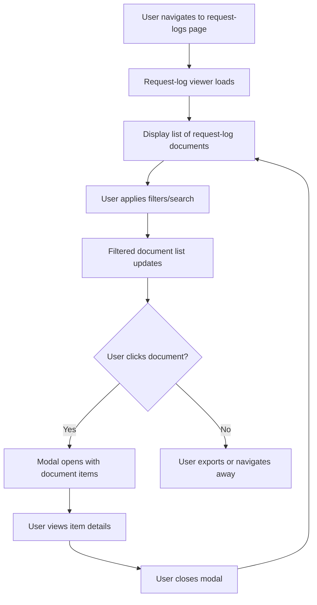

# PRD: MeatyCapture Request-Log Viewer for SkillMeat Web UI

**Feature Name:** MeatyCapture Request-Log Viewer

**Filepath:** `request-log-viewer-v1`

**Date:** 2026-01-30

**Author:** PM Agent

**Related Epic(s)/PRD ID(s):** REQ-20260129-skillmeat

**Related Documents:**
- Architecture Decision Record: (to be created after design review)
- MeatyCapture CLI Reference: https://github.com/miethe/meatycapture (external tool)
- Symbol references: `ai/symbols-api.json`, `ai/symbols-ui.json`

---

## Executive Summary

This feature adds a read-only viewer for MeatyCapture request logs directly within the SkillMeat web application. Users can browse, search, and view their captured bugs, enhancements, ideas, tasks, and questions without leaving the web UI, bridging the gap between CLI-based capture workflows and visual artifact management. The backend will use subprocess calls to the meatycapture CLI with JSON output, while the frontend will provide rich search and filtering capabilities similar to the existing artifact browser.

**Priority:** MEDIUM

**Key Outcomes:**
- Users can list and search all request-log documents for a project
- Users can view individual request items with full details in an interactive modal
- Search/filter capabilities by type, domain, status, priority, and keyword
- Read-only interface (capture/update remains CLI-based)
- Consistent UI patterns with existing artifact modals

---

## Context & Background

### Current State

SkillMeat v0.3.0 provides a web interface for browsing and managing Claude Code artifacts (skills, commands, agents, MCP servers, hooks). The application currently does not expose MeatyCapture request logs in the web UI. Users who capture requests via the CLI (using `meatycapture log create` and related commands) must use CLI commands like `meatycapture log list`, `meatycapture log view`, and `meatycapture log search` to access them.

MeatyCapture is a separate CLI tool maintained at `~/.meatycapture/{project}/` that stores request-log markdown files. It supports JSON output on all list, view, and search operations.

### Problem Space

Users experience friction when context-switching between the SkillMeat web UI and the terminal to view request logs. This creates a disjointed workflow:
- Artifact browsing happens visually in the web UI
- Request log viewing requires terminal commands
- No unified interface to see both artifacts and their associated capture history

This gap is especially problematic for:
- Teams wanting a centralized dashboard of project artifacts and related requests
- Users who prefer graphical browsing to CLI interaction
- Integration scenarios where request logs should be visible alongside artifacts

### Current Alternatives / Workarounds

Users currently:
1. Use `meatycapture log list --json` to fetch request-log documents
2. Manually parse JSON output or use `jq` for filtering
3. Open terminal for view operations (`meatycapture log view <document-id>`)
4. Copy/paste relevant context back to the web UI when needed

These workarounds are adequate for occasional use but create cognitive overhead for frequent access.

### Architectural Context

**Backend Architecture** (FastAPI):
- Routers handle HTTP + validation, return DTOs
- Services/managers execute business logic
- Subprocess calls to CLI tools are acceptable for non-critical operations
- All responses follow consistent pagination and error envelope patterns

**Frontend Architecture** (Next.js 15 + React 19 + shadcn/ui):
- Server components by default, `'use client'` boundary kept low
- Radix UI + shadcn/ui for consistent design system
- TanStack Query for data fetching and caching
- Modal patterns established in artifact browser (see artifact modal implementations)

**Collection Structure**:
- Request logs stored in `~/.meatycapture/{project}/` (outside SkillMeat collection)
- Each project has its own set of request-log documents
- Documents are markdown files with structured JSON frontmatter (MeatyCapture format)

---

## Problem Statement

**Core Gap:**
Users cannot view MeatyCapture request logs within the SkillMeat web UI, forcing context switching to the terminal and fragmenting the artifact management experience.

**User Story Format:**
> "As a SkillMeat user managing a project, when I want to view captured bugs or enhancement requests, I must switch to the terminal and use CLI commands instead of browsing them visually in the web UI alongside my artifacts."

**Technical Root Cause:**
- No API endpoints exist to expose MeatyCapture request logs
- Frontend has no request-log viewer or search interface
- MeatyCapture is a separate CLI tool; integration requires subprocess orchestration

**Files Involved:**
- Backend: `skillmeat/api/routers/` (new router needed)
- Backend: `skillmeat/core/` (new manager for subprocess calls)
- Frontend: `skillmeat/web/app/` (new pages/routes for request logs)
- Frontend: `skillmeat/web/components/` (new request-log viewer components)

---

## Goals & Success Metrics

### Primary Goals

**Goal 1: Enable Visual Request-Log Browsing**
- Users can list all request-log documents for their current project
- Documents are displayed in a sortable, filterable table
- Document metadata (type counts, status distribution) are visible
- Success measured by: Users accessing request-log viewer at least once per week

**Goal 2: Implement Rich Search & Filtering**
- Users can search by keyword across request items
- Users can filter by type (bug, enhancement, idea, task, question)
- Users can filter by domain (e.g., api, web, cli)
- Users can filter by status (open, closed, in-progress)
- Users can filter by priority (critical, high, medium, low)
- Success measured by: >80% of queries use filters or search

**Goal 3: Support Detail View & Item Inspection**
- Clicking a document opens a modal with all request items
- Items can be viewed with full details (description, context, notes)
- Modal provides keyboard navigation and accessibility features
- Success measured by: >70% of document views result in item inspection

**Goal 4: Maintain API Consistency**
- Request-log endpoints follow SkillMeat API patterns (DTOs, error envelopes, pagination)
- API documentation is auto-generated via OpenAPI
- Success measured by: Zero API contract violations in tests

### Success Metrics

| Metric | Baseline | Target | Measurement Method |
|--------|----------|--------|-------------------|
| API endpoint latency (list) | N/A | <500ms | CloudWatch/APM |
| Search query latency (cold) | N/A | <1000ms | CloudWatch/APM |
| Frontend test coverage | N/A | >80% | Jest coverage report |
| API integration test pass rate | N/A | 100% | CI/CD pipeline |
| User adoption (weekly active) | 0% | >50% of users | Analytics tracking |
| Search filter usage | N/A | >80% of queries | Analytics event tracking |

---

## User Personas & Journeys

### Primary Personas

**Persona 1: Claude Code Developer**
- Role: Engineer using SkillMeat to manage skills and track improvements
- Needs: Quick access to captured bugs/enhancement requests for context while editing artifacts
- Pain Points: Currently must alt-tab to terminal to check request logs

**Persona 2: Project Manager / Team Lead**
- Role: Oversees project artifacts and request tracking
- Needs: Dashboard-style view of all outstanding requests (bugs, enhancements) associated with project
- Pain Points: Can't get a unified view of project status; must check CLI separately

**Persona 3: Technical Writer / Documentation Lead**
- Role: Tracks documentation gaps and improvements via request logs
- Needs: Search/filter capabilities to find docs-related requests without CLI
- Pain Points: Current workaround (CLI + jq) is slow and error-prone

### High-level Flow



---

## Requirements

### Functional Requirements

| ID | Requirement | Priority | Notes |
|:--:|-------------|:--------:|-------|
| FR-1 | List all request-log documents for the current project | MUST | Paginated, with document name, item count, status distribution |
| FR-2 | Display document metadata (type counts: bugs, enhancements, ideas, tasks, questions) | MUST | Calculated from document JSON |
| FR-3 | Filter request logs by document type (bug, enhancement, idea, task, question) | MUST | Multi-select filter |
| FR-4 | Filter request logs by domain (e.g., api, web, cli, docs) | SHOULD | Multi-select, extracted from items |
| FR-5 | Filter request logs by status (open, closed, in-progress) | SHOULD | Multi-select filter |
| FR-6 | Filter request logs by priority (critical, high, medium, low) | SHOULD | Multi-select filter |
| FR-7 | Search request logs by keyword (title, description, context) | MUST | Full-text search across all items in documents |
| FR-8 | Open request-log document detail modal | MUST | Modal shows all items with expandable details |
| FR-9 | Display item details in modal (type, domain, status, priority, title, problem, goal, notes) | MUST | Consistent layout, copy-to-clipboard actions |
| FR-10 | Keyboard navigation in modal (arrow keys, Esc to close) | SHOULD | Standard modal accessibility |
| FR-11 | Persist filter/search state in URL query parameters | SHOULD | Allows bookmarking, sharing filter states |
| FR-12 | Export filtered results as JSON | COULD | Future enhancement, out of scope for v1 |

### Non-Functional Requirements

**Performance:**
- List endpoint must return results in <500ms for projects with 50+ documents
- Search must complete within 1000ms for typical query sizes (cold start)
- Frontend must cache results with TanStack Query (5-minute TTL default)
- Subprocess calls to meatycapture CLI must not block API (consider async execution if CLI is slow)

**Security:**
- Request-log viewer is read-only; no write operations exposed
- MeatyCapture CLI calls execute with project context (no cross-project data leaks)
- API endpoints protected by existing SkillMeat authentication (no new auth needed)

**Accessibility:**
- Modal follows WCAG 2.1 AA standards
- Keyboard navigation (Tab, Arrow keys, Esc) fully supported
- ARIA labels on filter buttons and search input
- Color contrast ratio >4.5:1 for text

**Reliability:**
- Graceful handling when MeatyCapture CLI is missing or returns errors
- User-friendly error messages for failures (e.g., "MeatyCapture not found or project has no request logs")
- Timeouts on subprocess calls (max 5 seconds default)

**Observability:**
- OpenTelemetry spans for all API operations (list, view, search)
- Structured JSON logs with trace_id, span_id, project_id
- Error tracking and categorization (CLI errors vs. API errors)
- Frontend analytics events: viewer_opened, filter_applied, search_query, item_viewed

---

## Scope

### In Scope

- Backend API endpoints: list documents, get document details, search
- Frontend viewer page and modal components
- Search and filtering UI with multi-select capabilities
- Request-log modal detail view
- Subprocess integration with meatycapture CLI (JSON output)
- API integration tests and frontend unit tests
- OpenAPI documentation

### Out of Scope

- Write operations (create, update, delete request logs from web UI; use CLI instead)
- Real-time sync of MeatyCapture changes (polling not implemented)
- Markdown rendering of request-log content (plain text display only)
- Custom request-log templates or domains (use MeatyCapture CLI)
- Export to PDF or other formats (JSON export could be future enhancement)
- Multi-project request-log aggregation (per-project viewing only)

---

## Dependencies & Assumptions

### External Dependencies

- **MeatyCapture CLI**: Must be installed and in PATH; accessed via subprocess
  - Minimum version: 1.0.0 (supports --json flag)
  - Standard location: `~/.meatycapture/{project}/`
- **shadcn/ui**: Existing dependency for dialog, table, button, input components
- **TanStack Query**: Existing dependency for data fetching and caching

### Internal Dependencies

- **Existing Authentication**: Reuse SkillMeat API auth middleware (no new auth required)
- **Project Registry**: Leverage existing project context resolution (`api/project_registry.py`)
- **API Architecture**: Follow established patterns (routers → services → DTOs)

### Assumptions

- MeatyCapture CLI is available on the system where SkillMeat API runs
- Request-log documents follow standard MeatyCapture JSON structure (title, type, domain, status, priority fields)
- Users expect request logs to be read-only in the web UI (capture via CLI only)
- Project context is available from request (cookies, headers, or URL path)
- Filtering/search performance is acceptable with in-memory JSON parsing (consider caching if problematic)

### Feature Flags

- `request_log_viewer_enabled`: Toggle feature on/off (default: false during beta)
- `request_log_search_enabled`: Toggle search capability (useful for rollout)
- `request_log_export_enabled`: Future export feature toggle

---

## Risks & Mitigations

| Risk | Impact | Likelihood | Mitigation |
|------|:------:|:----------:|-----------|
| MeatyCapture CLI missing or incompatible | High | Medium | Graceful error handling, detect CLI version, clear error messages |
| Subprocess calls block API threads | High | Medium | Implement async subprocess calls, add timeout limits, consider worker pool |
| Large document sets cause performance degradation | Medium | Medium | Implement pagination, caching with TTL, consider indexing large projects |
| Search latency on large documents | Medium | High | Implement client-side filtering for fast responsive UX, consider full-text index |
| Breaking changes in MeatyCapture JSON format | Medium | Low | Version-lock assumptions in code, add schema validation, document expected format |
| Users expect write operations in web UI | Medium | Medium | Clear labeling "Read-only", provide CLI guidance, include link to MeatyCapture docs |

---

## Target State (Post-Implementation)

### User Experience

**Request-Log Viewer Page:**
- User navigates to `/projects/{id}/request-logs` or similar route
- Page displays a filterable, searchable list of request-log documents
- Each document row shows name, document type, item count, and status distribution
- User can apply multi-select filters (type, domain, status, priority)
- User can search by keyword with live filtering
- Clicking a document row opens a modal showing all items in that document

**Detail Modal:**
- Modal displays document name as title
- Items are listed in a scrollable area with expandable detail rows
- Each item shows: type badge, domain tag, status, priority, title
- Expanding an item shows: full problem description, goal, context, notes
- Keyboard navigation: Arrow keys to move between items, Esc to close
- Copy-to-clipboard button for sharing item details

**Integration with Existing UI:**
- Request-log viewer accessible from project detail page (sidebar or tab)
- Follows existing design patterns (buttons, modals, colors from shadcn/ui)
- Consistent with artifact browser styling and interactions

### Technical Architecture

**Backend Architecture:**
```
Request-Log Viewer API (New)
  ├── Router: GET /api/v1/projects/{project_id}/request-logs
  │   └── Returns: { documents: [{id, name, type_counts, status_distribution}], pageInfo }
  ├── Router: GET /api/v1/projects/{project_id}/request-logs/{document_id}
  │   └── Returns: { document: {id, name, items: [{type, domain, status, ...}]} }
  ├── Router: GET /api/v1/projects/{project_id}/request-logs/search
  │   └── Query: q=keyword&type=bug&domain=api&status=open
  │   └── Returns: { results: [{document_id, items: [...]}], pageInfo }
  └── Service: RequestLogManager (subprocess integration)
      └── Calls meatycapture CLI with --json, parses output, returns structured DTOs
```

**Frontend Architecture:**
```
Request-Log Viewer Pages (New)
  ├── Page: /projects/[id]/request-logs
  │   ├── Component: RequestLogList (server component fetching initial data)
  │   ├── Component: RequestLogFilters (client component with TanStack Query)
  │   ├── Component: RequestLogTable (displays documents, handles row click)
  │   └── Component: RequestLogModal (detail view, client component)
  └── Hooks: useRequestLogs(), useRequestLogSearch() (custom TanStack Query hooks)
```

**Data Flow:**
1. User navigates to request-logs page → Server fetches initial documents
2. User applies filter/search → Client-side hook updates TanStack Query
3. API returns filtered results → Table/modal updates
4. User clicks document → Modal opens with cached or fresh details
5. User closes modal → Filter state preserved in URL

### Observable Outcomes

- **Metric 1**: Request-log viewer accessed by >50% of active users within 2 weeks
- **Metric 2**: Average time in modal >30 seconds (indicates engagement)
- **Metric 3**: Search feature used in >80% of request-log sessions
- **Metric 4**: Zero reported bugs related to filtering/search within 1 week of launch
- **Metric 5**: API latency for list/search stays <1000ms under typical load

---

## Overall Acceptance Criteria (Definition of Done)

### Functional Acceptance

- [ ] API endpoint `GET /api/v1/projects/{project_id}/request-logs` returns paginated document list
- [ ] API endpoint `GET /api/v1/projects/{project_id}/request-logs/{document_id}` returns document with items
- [ ] API endpoint `GET /api/v1/projects/{project_id}/request-logs/search` filters by keyword and metadata
- [ ] Frontend page `/projects/[id]/request-logs` displays document list with filters
- [ ] Filter/search state persists in URL query parameters
- [ ] Request-log detail modal opens on document selection
- [ ] Modal displays all item fields (type, domain, status, priority, description, goal, notes)
- [ ] Keyboard navigation works (Arrow keys, Esc)
- [ ] Graceful error handling when MeatyCapture CLI is missing or fails
- [ ] Read-only behavior enforced (no write operations exposed)

### Technical Acceptance

- [ ] All API responses return Pydantic DTOs (no raw CLI output exposed)
- [ ] Cursor/offset pagination implemented for document list and search results
- [ ] ErrorResponse envelope used for all error cases
- [ ] OpenTelemetry spans added for list, view, search operations
- [ ] Structured logging with trace_id, span_id, project_id
- [ ] Subprocess calls have timeouts (max 5 seconds) and error handling
- [ ] TanStack Query used for frontend data fetching with 5-minute cache TTL
- [ ] API follows FastAPI router patterns (async handlers, proper status codes)
- [ ] Frontend components follow shadcn/ui patterns (no inline styles, Tailwind classes)

### Quality Acceptance

- [ ] API integration tests: >80% coverage (list, view, search, error cases)
- [ ] Frontend unit tests: >80% coverage (filters, search, modal logic)
- [ ] Frontend E2E test: Full user flow from list to modal
- [ ] Accessibility: WCAG 2.1 AA compliance (keyboard nav, ARIA labels, color contrast)
- [ ] Performance: List endpoint <500ms, search <1000ms
- [ ] No TypeScript errors or ESLint warnings
- [ ] All tests pass locally and in CI/CD

### Documentation Acceptance

- [ ] API documentation auto-generated in OpenAPI (available at `/docs`)
- [ ] README updated with feature description and usage examples
- [ ] Architecture Decision Record (ADR) created for subprocess integration decision
- [ ] Inline code comments explain MeatyCapture CLI integration points
- [ ] User guide/FAQ added to SkillMeat docs (how to filter, search, export)

---

## Assumptions & Open Questions

### Assumptions Made During Planning

1. **MeatyCapture Availability**: Assume CLI is always available in PATH on deployment; graceful degradation if missing
2. **JSON Output Format**: MeatyCapture `--json` flag outputs standard JSON structure with expected fields (type, domain, status, priority, title, problem, goal, notes)
3. **Per-Project Isolation**: Each project has isolated request logs; no cross-project queries needed
4. **Read-Only First**: Capture/update operations remain CLI-only in v1; write operations deferred to v2
5. **Authentication Reuse**: Existing SkillMeat auth middleware protects request-log endpoints; no new auth needed
6. **Performance Acceptable**: Subprocess calls to CLI for each query are acceptable (not a bottleneck); caching with TTL is sufficient

### Open Questions

- [ ] **Q1**: Should the viewer support real-time sync of changes to request logs?
  - **A**: No, not in v1. CLI captures are visible on page refresh or cache expiry (5-minute TTL).

- [ ] **Q2**: What is the expected limit on number of request-log documents per project?
  - **A**: Assume <100 documents per project for v1; pagination for >50 items recommended.

- [ ] **Q3**: Should users be able to create/update/delete request logs from the web UI in the future?
  - **A**: Explicitly deferred to v2. v1 is read-only. Link to MeatyCapture CLI for now.

- [ ] **Q4**: How should the viewer handle MeatyCapture projects with different JSON schemas?
  - **A**: Validate against expected schema; use graceful fallbacks (e.g., missing optional fields). Log schema violations.

- [ ] **Q5**: Should export to PDF, CSV, or other formats be included?
  - **A**: Out of scope for v1. Implement feature flag for future JSON export capability.

- [ ] **Q6**: What is the retention policy for request-log documents? Should old items be archived?
  - **A**: Managed by MeatyCapture, not SkillMeat. Viewer shows all available documents.

---

## Appendices & References

### Related Documentation

- **Symbol References**:
  - API routers: `skillmeat/api/routers/artifacts.py` (pattern reference)
  - Frontend components: `skillmeat/web/components/shared/` (artifact modal pattern reference)
- **Architecture Decision Records**: (To be created)
  - subprocess integration for CLI tools
  - Caching strategy for request-log data

### Prior Art & References

- **Artifact Viewer**: Existing `/projects/[id]/artifacts` page provides modal pattern template
- **MeatyCapture CLI**: External tool at https://github.com/miethe/meatycapture
- **Similar Features**: GitHub Issues API (filtering, search), Jira request viewer

---

## Implementation

### Phased Approach

**Phase 1: Backend API Foundation** (Estimated 3-4 days)
- Create request-log manager with MeatyCapture subprocess integration
- Implement list endpoint with pagination
- Implement detail endpoint
- Implement search endpoint with basic filtering
- Add comprehensive error handling and logging
- Write API integration tests (>80% coverage)
- Duration: 3-4 days

**Phase 2: Frontend Pages & Components** (Estimated 3-4 days)
- Create request-logs page structure
- Build request-log list component with filters
- Build request-log detail modal
- Integrate TanStack Query for data fetching
- Add keyboard navigation and accessibility
- Write frontend unit tests (>80% coverage)
- Duration: 3-4 days

**Phase 3: Integration & Polish** (Estimated 2-3 days)
- End-to-end integration testing (Playwright)
- URL state persistence for filters
- Performance optimization (caching, pagination)
- Error handling and user feedback
- OpenAPI documentation verification
- Accessibility audit (WCAG 2.1 AA)
- Duration: 2-3 days

**Phase 4: Documentation & Deployment** (Estimated 1-2 days)
- Update README and user guides
- Create ADR for architecture decisions
- Feature flag configuration
- Beta release to canary users
- Monitor metrics and gather feedback
- Duration: 1-2 days

### Epics & User Stories Backlog

| Story ID | Short Name | Description | Acceptance Criteria | Estimate |
|----------|-----------|-------------|-------------------|----------|
| RLVF-1.1 | MeatyCapture Manager | Create RequestLogManager class with subprocess integration to meatycapture CLI | Manager can call list, view, search operations; returns structured DTOs; handles errors gracefully | 1 day |
| RLVF-1.2 | List API Endpoint | GET /api/v1/projects/{project_id}/request-logs with pagination | Returns paginated documents with type_counts, status_distribution; <500ms latency | 1 day |
| RLVF-1.3 | Detail API Endpoint | GET /api/v1/projects/{project_id}/request-logs/{document_id} | Returns document with all items; includes all expected fields; error handling for missing docs | 1 day |
| RLVF-1.4 | Search API Endpoint | GET /api/v1/projects/{project_id}/request-logs/search with q, type, domain, status, priority params | Filters by keyword and metadata; pagination; <1000ms latency | 1 day |
| RLVF-1.5 | API Tests | Unit + integration tests for all three endpoints | >80% coverage; edge cases (missing CLI, invalid project, empty results) | 1 day |
| RLVF-2.1 | Request-Logs Page | Create /projects/[id]/request-logs page structure | Page loads, displays empty state or document list | 0.5 day |
| RLVF-2.2 | Document List Component | Table displaying documents with name, type, item count, status | Rows clickable, supports sorting, accessible | 1 day |
| RLVF-2.3 | Filter UI | Multi-select filters for type, domain, status, priority | Filters update table reactively, state in URL | 1 day |
| RLVF-2.4 | Search Component | Search input with live filtering | Debounced search, highlights matching items | 0.5 day |
| RLVF-2.5 | Detail Modal | Modal showing document items with expandable details | All fields displayed, keyboard nav (Esc, arrows), accessibility compliant | 1 day |
| RLVF-2.6 | Frontend Tests | Unit tests for components and hooks | >80% coverage; TanStack Query setup, user interactions | 1 day |
| RLVF-3.1 | E2E Testing | Playwright test covering full user flow | Open viewer, apply filters, search, open modal | 0.5 day |
| RLVF-3.2 | Performance Optimization | Caching, pagination, lazy loading | <500ms list, <1000ms search, smooth interactions | 0.5 day |
| RLVF-3.3 | Accessibility Audit | WCAG 2.1 AA compliance check | Color contrast, keyboard nav, ARIA labels all pass | 0.5 day |
| RLVF-4.1 | Documentation | README, user guide, ADR | Feature description, usage examples, architecture notes | 1 day |
| RLVF-4.2 | Feature Flag | Implement feature flag (request_log_viewer_enabled) | Can toggle feature on/off via config | 0.5 day |

---

**Total Estimated Effort**: 10-12 days (2.5-3 weeks with buffer)

**Progress Tracking:**
See `.claude/progress/request-log-viewer-v1/` for phase-by-phase progress updates.

---

## Detailed API Contracts

### 1. List Request-Log Documents

**Endpoint:** `GET /api/v1/projects/{project_id}/request-logs`

**Query Parameters:**
- `page` (int, default=1): Page number for pagination
- `page_size` (int, default=50): Items per page (max=100)
- `sort_by` (string, default="name"): Sort field (name, created_at, updated_at, item_count)
- `sort_order` (string, default="asc"): Sort direction (asc, desc)

**Response (200):**
```json
{
  "documents": [
    {
      "id": "req-20260129-skillmeat",
      "name": "SkillMeat Request Log",
      "path": "/Users/user/.meatycapture/skillmeat/req-20260129-skillmeat.md",
      "created_at": "2026-01-29T10:00:00Z",
      "updated_at": "2026-01-30T15:00:00Z",
      "item_count": 12,
      "type_counts": {
        "bug": 5,
        "enhancement": 4,
        "idea": 2,
        "task": 1,
        "question": 0
      },
      "status_distribution": {
        "open": 8,
        "in_progress": 2,
        "closed": 2
      }
    }
  ],
  "pageInfo": {
    "page": 1,
    "page_size": 50,
    "total": 1,
    "has_next": false,
    "has_prev": false
  }
}
```

**Error Responses:**
- `404 Not Found`: Project not found or has no request logs
- `500 Internal Server Error`: MeatyCapture CLI missing or failed

---

### 2. Get Request-Log Document Details

**Endpoint:** `GET /api/v1/projects/{project_id}/request-logs/{document_id}`

**Response (200):**
```json
{
  "document": {
    "id": "req-20260129-skillmeat",
    "name": "SkillMeat Request Log",
    "created_at": "2026-01-29T10:00:00Z",
    "updated_at": "2026-01-30T15:00:00Z",
    "items": [
      {
        "id": "item-1",
        "type": "bug",
        "title": "Artifact modal not closing on Esc key",
        "domain": "web",
        "status": "open",
        "priority": "high",
        "problem": "When viewing artifact details in modal, pressing Esc does not close the modal.",
        "goal": "Modal should close when user presses Esc key.",
        "context": "Affects artifact browser in project manage page",
        "notes": "This is blocking new users from dismissing modals easily",
        "created_at": "2026-01-29T10:00:00Z"
      }
    ]
  }
}
```

**Error Responses:**
- `404 Not Found`: Document not found
- `500 Internal Server Error`: CLI failure

---

### 3. Search Request-Log Documents

**Endpoint:** `GET /api/v1/projects/{project_id}/request-logs/search`

**Query Parameters:**
- `q` (string, required): Keyword to search in title, problem, goal, notes
- `type` (string, optional): Filter by type (comma-separated: bug,enhancement,idea,task,question)
- `domain` (string, optional): Filter by domain (comma-separated)
- `status` (string, optional): Filter by status (comma-separated: open,in_progress,closed)
- `priority` (string, optional): Filter by priority (comma-separated: critical,high,medium,low)
- `page` (int, default=1): Page number
- `page_size` (int, default=50): Items per page

**Response (200):**
```json
{
  "results": [
    {
      "document_id": "req-20260129-skillmeat",
      "document_name": "SkillMeat Request Log",
      "items": [
        {
          "id": "item-1",
          "type": "bug",
          "title": "Artifact modal not closing on Esc key",
          "domain": "web",
          "status": "open",
          "priority": "high",
          "problem": "When viewing artifact details in modal, pressing Esc does not close the modal.",
          "goal": "Modal should close when user presses Esc key.",
          "context": "Affects artifact browser in project manage page",
          "notes": "This is blocking new users from dismissing modals easily",
          "created_at": "2026-01-29T10:00:00Z"
        }
      ]
    }
  ],
  "pageInfo": {
    "page": 1,
    "page_size": 50,
    "total": 1,
    "has_next": false,
    "has_prev": false
  }
}
```

**Error Responses:**
- `400 Bad Request`: Missing required query parameter `q`
- `500 Internal Server Error`: CLI failure or invalid filters

---

## Detailed Frontend Specifications

### Page: `/projects/[id]/request-logs`

**Layout:**
```
┌─────────────────────────────────────────┐
│ Request Logs for [Project Name]         │
├─────────────────────────────────────────┤
│ [Search Input] [Filter Dropdowns]       │
├─────────────────────────────────────────┤
│ Document Name  │ Items │ Status │       │
├─────────────────────────────────────────┤
│ req-20260129   │   12  │ 8 open │  ▶    │
│ req-20260120   │    8  │ 5 open │  ▶    │
└─────────────────────────────────────────┘
```

**Key Components:**
1. **RequestLogList** (Server Component): Fetches initial data
2. **RequestLogFilters** (Client Component): Type, domain, status, priority multi-select dropdowns
3. **RequestLogSearch** (Client Component): Debounced keyword search
4. **RequestLogTable** (Client Component): Document rows, click opens modal
5. **RequestLogModal** (Client Component): Detail view with items

**State Management:**
- URL search params: `?type=bug&domain=web&status=open&q=search%20term`
- TanStack Query cache: 5-minute TTL
- Modal open state: Local component state

### Component: RequestLogModal

**Behavior:**
- Opens on document row click
- Displays document title and item list
- Each item row shows: type badge, domain tag, status, priority, title
- Click item row to expand and show details
- Keyboard navigation:
  - Esc: Close modal
  - Arrow Up/Down: Navigate items
  - Enter: Expand/collapse item details
- Copy-to-clipboard button for each item

**Styling:**
- Use shadcn/ui Dialog component for modal container
- Use shadcn/ui Badge for type/domain/status pills
- Use Tailwind classes for layout (no inline styles)
- Dark mode support (follows project theme)

---

**Document prepared for implementation by AI agent.**
