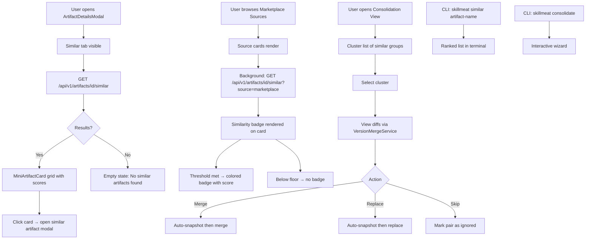

# Feature Brief & Metadata

**Feature Name:**

> Similar Artifacts — Detection, Comparison & Consolidation

**Filepath Name:**

> `similar-artifacts-v1`

**Date:**

> 2026-02-25

**Author:**

> Claude Sonnet 4.6 (prd-writer)

**Related Epic(s)/PRD ID(s):**

> Standalone feature; related to `cross-source-artifact-search-v1.md` and `entity-lifecycle-management-v1.md`

**Related Documents:**

> - `skillmeat/models.py` — ArtifactFingerprint (line 458-570), DuplicatePair model
> - `skillmeat/core/scoring/match_analyzer.py` — TF-IDF keyword scoring
> - `skillmeat/core/scoring/semantic_scorer.py` — cosine similarity via HaikuEmbedder
> - `skillmeat/api/routers/match.py` — existing `/api/v1/match/` endpoint
> - `skillmeat/web/components/collection/artifact-details-modal.tsx` — tab host
> - `skillmeat/web/components/collection/mini-artifact-card.tsx` — card component for lists
> - `skillmeat/web/components/marketplace/source-card.tsx` — badge host for marketplace
> - `skillmeat/web/components/discovery/duplicate-review-modal.tsx` — existing dedup UX

---

## 1. Executive summary

Similar Artifacts surfaces the existing similarity scoring stack (ArtifactFingerprint, MatchAnalyzer, SemanticScorer) through purpose-built UX and CLI commands. Users gain a **Similar Artifacts tab** in every artifact detail view, **color-coded similarity badges** on marketplace source cards, and a dedicated **Consolidation view** for reviewing and resolving duplicate clusters—all backed by a new artifact-centric `/api/v1/artifacts/{id}/similar` endpoint.

**Priority:** MEDIUM

**Key outcomes:**
- Collectors immediately see whether a marketplace artifact is already covered by something they own.
- Power users can audit and consolidate their collection, removing redundant artifacts with confidence.
- All similarity capabilities are accessible from the CLI for scripting and automation workflows.

---

## 2. Context & background

### Current state

SkillMeat's collection manager supports ~500+ artifacts per user. The backend contains a mature similarity stack: ArtifactFingerprint computes weighted content/structure/metadata hashes; MatchAnalyzer performs TF-IDF keyword scoring across name, title, tags, description, and aliases; SemanticScorer adds cosine similarity via HaikuEmbedder with graceful fallback. The existing `/api/v1/match/?q=...` endpoint uses this stack for query-to-artifact search, returning composite confidence scores.

The DuplicatePair model exists in `skillmeat/models.py`. The Discovery tab surfaces duplicates via DuplicateReviewModal and DuplicateReviewTab, and VersionMergeService provides 3-way diff with conflict detection and auto-snapshot. However, none of this is artifact-centric: there is no way to open an artifact and ask "what else in my collection is similar to this?"

### Problem space

Without artifact-to-artifact similarity:

1. Users browsing the marketplace cannot tell if they already own a functionally identical artifact under a different name.
2. Users cannot identify which of several similar artifacts is the best fit for a given use-case before deploying.
3. Long-time collectors accumulate redundant artifacts with no tooling to find and remove them.
4. The marketplace source card has no at-a-glance indicator of coverage, forcing users to manually cross-reference.

### Current alternatives / workarounds

Users manually run `skillmeat search <keyword>` or browse the collection by type. This finds artifacts by name/tag but not by semantic or structural similarity. The Discovery tab shows hard duplicates (exact/hash/name-type matches) but misses near-duplicates.

### Architectural context

SkillMeat follows a layered architecture:
- **Routers** — HTTP surface, validation, DTO return
- **Services** — Business logic, similarity orchestration
- **Repositories** — DB I/O, cursor pagination
- **Cache/DB** — SQLAlchemy ORM, Alembic migrations
- **Frontend** — Next.js 15 App Router, React Query, shadcn/Radix UI

The new similarity engine sits in the **Service** layer, calling existing scorer classes. The API router adds one new endpoint. The frontend adds tabs and badge components consuming React Query hooks.

---

## 3. Problem statement

**User story format:**

> "As a SkillMeat user, when I view an artifact in my collection or browse a marketplace source, I cannot see which other artifacts are functionally similar, so I repeatedly acquire near-duplicates and cannot efficiently consolidate my collection."

**Technical root cause:**

- The existing similarity scorers are query-centric (`/api/v1/match/?q=...`) and not artifact-centric; no endpoint accepts an artifact ID and returns similar artifacts.
- ArtifactFingerprint comparison is computed only during import/discovery, not on-demand per artifact.
- DuplicatePair records exist but are not surfaced in the main artifact UX (ArtifactDetailsModal).
- The marketplace source card has no hook into the user's collection for real-time coverage indicators.

**Files involved:**

- `skillmeat/models.py` — ArtifactFingerprint, DuplicatePair
- `skillmeat/core/scoring/match_analyzer.py`, `semantic_scorer.py`
- `skillmeat/api/routers/match.py` — existing endpoint
- `skillmeat/web/components/collection/artifact-details-modal.tsx` — missing tab
- `skillmeat/web/components/marketplace/source-card.tsx` — missing badge

---

## 4. Goals & success metrics

### Primary goals

**Goal 1: Artifact-centric similarity engine**
- A new service layer method accepts an artifact ID and returns a ranked list of similar artifacts with per-artifact similarity scores.
- Must handle collection sizes up to 500 artifacts in <2 s at p95.

**Goal 2: Similar Artifacts tab in artifact detail views**
- The tab appears in ArtifactDetailsModal (collection) and in the marketplace source artifact detail view.
- Displays results using MiniArtifactCard in the standard `grid grid-cols-2 gap-3` layout.
- Allows clicking through to the similar artifact's own detail modal.

**Goal 3: Marketplace similarity badges**
- Source cards on the Marketplace Sources page show a color-coded badge indicating "High Match", "Partial Match", "Low Match", or no badge (below floor threshold).
- Badge color thresholds are configurable in Settings > Appearance > Similarity.

**Goal 4: Collection consolidation view**
- A dedicated UI view (accessible from Collection page and CLI) clusters similar artifacts and allows merge/replace/skip actions.
- Every destructive action is preceded by auto-snapshot.

**Goal 5: CLI parity**
- `skillmeat similar <artifact-name-or-id>` — print ranked similar artifacts.
- `skillmeat consolidate` — interactive consolidation wizard in the terminal.

### Success metrics

| Metric | Baseline | Target | Measurement method |
|--------|----------|--------|--------------------|
| Similar artifacts API p95 latency | N/A (new) | <2 000 ms | API timing log |
| Marketplace badge paint overhead | 0 ms | <100 ms added | Lighthouse perf audit |
| Duplicate pair recall (vs manual review) | Unknown | >80% of known duplicates surfaced | Manual spot-check on test collection |
| CLI `skillmeat similar` latency | N/A (new) | <3 000 ms | CLI timing output |
| Consolidation actions per session (adoption) | 0 | >1 after feature launch | Event telemetry |

---

## 5. User personas & journeys

### Personas

**Primary persona: The Collector**
- Role: Power user managing 100–500 artifacts across multiple projects.
- Needs: Quickly identify redundant artifacts; understand which marketplace artifacts duplicate what they own.
- Pain points: Manual search misses semantic duplicates; Discovery tab only catches exact duplicates.

**Secondary persona: The Browser**
- Role: User browsing the marketplace to find new artifacts.
- Needs: Know at a glance whether a marketplace artifact is already covered.
- Pain points: No visual coverage indicator; must mentally cross-reference collection.

**Tertiary persona: The Scripter**
- Role: Developer automating collection maintenance via CLI.
- Needs: CLI commands for similarity queries and batch deduplication.
- Pain points: No `skillmeat similar` or `skillmeat consolidate` commands today.

### High-level flow

---

## 6. Requirements

### 6.1 Functional requirements

| ID | Requirement | Priority | Notes |
|:--:|-------------|:--------:|-------|
| FR-1 | New `/api/v1/artifacts/{id}/similar` endpoint returns ranked similar artifacts with composite score, score breakdown, and match type | Must | Uses ArtifactFingerprint + MatchAnalyzer + optional SemanticScorer |
| FR-2 | Endpoint accepts query params: `limit` (default 10, max 50), `min_score` (0–1, default 0.3), `source` (`collection`\|`marketplace`\|`all`) | Must | `source=marketplace` compares against marketplace index |
| FR-3 | "Similar" tab added to `ArtifactDetailsModal` using `BASE_TABS` extension pattern | Must | Tab label: "Similar"; icon: `GitCompare` or equivalent Lucide icon |
| FR-4 | Similar tab renders a `grid grid-cols-2 gap-3 pb-1 pr-1 sm:grid-cols-3` of MiniArtifactCards | Must | Each card shows artifact name, type badge, and similarity score percentage |
| FR-5 | Clicking a MiniArtifactCard in the Similar tab opens that artifact's ArtifactDetailsModal | Must | Maintain modal stack / navigation |
| FR-6 | Similar tab available when viewing an artifact sourced from a Marketplace Source | Must | Compares against user's collection; uses `source=collection` |
| FR-7 | Marketplace source cards display a color-coded similarity badge when any collection artifact scores >= floor threshold | Must | Badge shows highest match score found |
| FR-8 | Similarity thresholds (high/partial/low/floor) are configurable in Settings > Appearance > Similarity sub-tab | Must | Defaults: high ≥0.80, partial ≥0.55, low ≥0.35, floor ≥0.20 |
| FR-9 | Threshold colors are configurable using the existing custom color system (`/api/v1/colors`) | Should | Default colors: green (high), yellow (partial), orange (low) |
| FR-10 | Consolidation view accessible from Collection page toolbar and via `skillmeat consolidate` CLI | Must | Shows clusters of artifacts with similarity ≥ configurable threshold |
| FR-11 | Consolidation cluster list shows: artifact count, highest similarity score, artifact type | Must | Sorted by score descending |
| FR-12 | Clicking a cluster opens a detail view with side-by-side comparison using existing DiffViewer / VersionMergeService | Must | Shows content diff, metadata diff |
| FR-13 | Consolidation actions: Merge (keep primary, apply changes), Replace (keep primary, discard secondary), Skip (mark pair as ignored for future runs) | Must | All destructive actions auto-snapshot before execution |
| FR-14 | `skillmeat similar <artifact>` CLI command prints ranked similar artifacts in a Rich table | Must | Accepts artifact name or ID; supports `--limit`, `--min-score`, `--source` flags |
| FR-15 | `skillmeat consolidate` CLI command presents an interactive consolidation wizard | Must | Shows clusters, prompts for merge/replace/skip per pair |
| FR-16 | Empty state for Similar tab when no artifacts meet `min_score` threshold | Must | Descriptive message + suggestion to lower threshold |
| FR-17 | Similarity score breakdown tooltip on hover (content hash %, structure %, metadata %, keyword %) | Should | Reuse existing tooltip pattern |
| FR-18 | "Ignored pairs" management: users can un-ignore previously skipped pairs | Should | Accessible from Consolidation view settings |
| FR-19 | Batch ignore: mark all pairs in a cluster as ignored at once | Could | Consolidation view batch action |
| FR-20 | Export consolidation report to JSON/CSV | Could | CLI flag `--output` on `skillmeat consolidate` |

### 6.2 Non-functional requirements

**Performance:**
- `/api/v1/artifacts/{id}/similar` responds in <2 000 ms at p95 for collections up to 500 artifacts.
- Marketplace badge fetches are batched (one request per visible viewport, not per card) to avoid N+1 API calls.
- SemanticScorer invocations are rate-limited/debounced; keyword-only fallback activates if embedder exceeds 800 ms.

**Security:**
- Similarity endpoint enforces collection ownership: users can only compare against their own artifacts.
- Marketplace similarity queries are read-only; no collection mutation from this endpoint.
- Consolidation merge/replace actions require explicit user confirmation (no auto-apply).

**Accessibility:**
- Similarity badges include `aria-label` with score percentage and match level (e.g., "High similarity: 87%").
- Similar tab is keyboard-navigable; MiniArtifactCards are focusable with Enter/Space to open.
- Consolidation view meets WCAG 2.1 AA contrast for all threshold colors.

**Reliability:**
- SemanticScorer failure falls back to keyword-only scoring transparently; user sees no error.
- If the similarity endpoint fails, the Similar tab shows a non-blocking error state (not a modal crash).
- Consolidation auto-snapshot must succeed before any merge/replace; if snapshot fails, action is aborted with error.

**Observability:**
- OpenTelemetry spans on `SimilarityService.find_similar()`, MatchAnalyzer, SemanticScorer.
- Structured JSON logs for each similarity query: `artifact_id`, `result_count`, `latency_ms`, `scorer_used`.
- Telemetry event on consolidation action: `action_type` (merge/replace/skip), `similarity_score`, `artifact_ids`.

---

## 7. Scope

### In scope

- New `SimilarityService` wrapping ArtifactFingerprint + MatchAnalyzer + SemanticScorer for artifact-to-artifact queries.
- `/api/v1/artifacts/{id}/similar` endpoint with `limit`, `min_score`, and `source` parameters.
- "Similar" tab in ArtifactDetailsModal (collection artifacts).
- "Similar" tab when viewing a marketplace artifact detail panel.
- Color-coded similarity badges on marketplace source cards.
- Settings > Appearance > Similarity sub-tab for threshold and color configuration.
- Similarity threshold storage via existing settings/config mechanism.
- Consolidation view in the Collection page for cluster review and actions (merge/replace/skip).
- Auto-snapshot before destructive consolidation actions (reuse VersionMergeService).
- Ignored pairs storage and management (un-ignore capability).
- `skillmeat similar <artifact>` CLI command.
- `skillmeat consolidate` CLI interactive wizard.

### Out of scope

- Embedding persistence / vector store (SemanticScorer remains stateless per-query).
- Automated background deduplication without user confirmation.
- Cross-user or shared-collection similarity.
- "Smart search" by use-case or technology domain (future: noted as explicit future enhancement).
- Automatic merge conflict resolution (user must confirm).
- Similarity-based recommendations ("you might also like").
- Bulk marketplace import with pre-dedup filter (separate feature).
- Admin-level collection-wide deduplication reports.

---

## 8. Dependencies & assumptions

### External dependencies

- **HaikuEmbedder** (via SemanticScorer): optional; graceful fallback to keyword-only if unavailable or slow.
- No new third-party libraries required; all scoring uses existing in-process Python code.

### Internal dependencies

- **ArtifactFingerprint** (`skillmeat/models.py:458-570`): stable, no changes needed.
- **MatchAnalyzer** (`skillmeat/core/scoring/match_analyzer.py`): stable; may add `compare(artifact_a, artifact_b)` helper.
- **SemanticScorer** (`skillmeat/core/scoring/semantic_scorer.py`): stable; used as-is.
- **DuplicatePair** (`skillmeat/models.py`): extended with `ignored` boolean field.
- **VersionMergeService**: reused for consolidation merge/diff; no interface changes.
- **Custom colors API** (`/api/v1/colors`): reused for threshold color configuration.
- **MiniArtifactCard** component: reused as-is; receives `similarityScore` prop for badge overlay.
- **ArtifactDetailsModal** `BASE_TABS` pattern: extended with new "Similar" tab entry.
- **Settings page** Appearance tab: extended with new "Similarity" sub-tab.

### Assumptions

- Collection size upper bound for initial implementation is 500 artifacts per user; pagination handles larger collections.
- The existing `/api/v1/match/` endpoint is not modified; the new `/api/v1/artifacts/{id}/similar` is additive.
- Similarity threshold defaults (high ≥0.80, partial ≥0.55, low ≥0.35, floor ≥0.20) are reasonable starting points; users can adjust.
- Marketplace source card badge fetches are triggered lazily (on viewport entry) to avoid bulk API load on page render.
- SemanticScorer is considered optional infrastructure; the feature ships without it if embedder is unavailable, degrading gracefully to keyword-only scoring.
- Ignored pairs are stored in the DB (extending DuplicatePair); no separate ignored-pairs store.

### Feature flags

- `SIMILAR_ARTIFACTS_ENABLED`: gates the Similar tab, marketplace badge, and consolidation view. Default: `true` on next release.
- `SEMANTIC_SCORING_ENABLED`: gates SemanticScorer usage within the similarity engine. Default: `true` if HaikuEmbedder is configured.

---

## 9. Risks & mitigations

| Risk | Impact | Likelihood | Mitigation |
|------|:------:|:----------:|------------|
| SemanticScorer latency causes Similar tab to feel slow | High | Medium | Hard cap at 800 ms; fall back to keyword-only; show progressive loading skeleton |
| Marketplace N+1 badge fetches degrade page performance | High | High | Batch badge queries via viewport-aware IntersectionObserver; deduplicate by source artifact ID |
| Similarity thresholds produce noisy results by default | Medium | Medium | Conservative defaults (floor ≥0.20); empty-state guidance to adjust; per-session threshold override |
| Consolidation merge destroys data if snapshot fails | Critical | Low | Abort merge if snapshot fails; surface blocking error; never proceed without confirmed snapshot |
| Large collection (500+ artifacts) exceeds 2 s SLA | Medium | Medium | Limit full fingerprint comparison to top-N candidates by keyword score; implement result caching with 5-min staleTime |
| DuplicatePair schema extension causes migration issues | Low | Low | Additive migration (add `ignored` boolean with default `false`); backward-compatible |
| CLI interactive wizard UX is awkward in non-TTY environments | Low | Medium | Detect non-TTY; fall back to `--non-interactive` JSON output mode |

---

## 10. Target state (post-implementation)

### User experience

- Opening any artifact in ArtifactDetailsModal shows a "Similar" tab alongside Overview, Files, Deployments, etc.
- The Similar tab renders a responsive card grid of up to 10 similar artifacts (configurable) with name, type, score percentage, and click-through navigation.
- Browsing the Marketplace Sources page, users see color-coded badges on cards: green "87% match", yellow "62% match", orange "38% match", or no badge if below the floor.
- From the Collection page toolbar, users open the Consolidation view, see clustered similar artifact groups, and resolve them one cluster at a time using merge/replace/skip with auto-snapshot protection.
- From the terminal, `skillmeat similar canvas-skill` prints a ranked Rich table; `skillmeat consolidate` walks through pairs interactively.

### Technical architecture

- `SimilarityService` (new, `skillmeat/core/similarity.py`): orchestrates ArtifactFingerprint + MatchAnalyzer + optional SemanticScorer. Returns `SimilarityResult` dataclass list.
- `/api/v1/artifacts/{id}/similar` (new router method in `skillmeat/api/routers/artifacts.py`): calls `SimilarityService`, returns `SimilarArtifactDTO` list.
- `SimilarArtifactsTab` React component: React Query hook `useSimilarArtifacts(artifactId)` with 5-min staleTime; renders MiniArtifactCard grid.
- `SimilarityBadge` React component: used inside `SourceCard`; queries via `useSimilarArtifacts(artifactId, { source: 'collection' })` with lazy loading.
- `SimilaritySettings` Settings sub-tab: reads/writes threshold config via existing settings API; uses existing `useCustomColors` for color selection.
- Consolidation view: clusters DuplicatePair records + new SimilarityService output; renders cluster list, uses DiffViewer for comparison, calls existing VersionMergeService for merge.
- DB: `DuplicatePair.ignored` boolean column added via Alembic migration.

### Observable outcomes

- Similarity API calls visible in OpenTelemetry traces with scorer breakdown spans.
- Consolidation actions logged with artifact IDs and action type for audit.
- Marketplace badge render timing tracked; alert if p95 badge paint > 150 ms.
- Users can report fewer "accidental duplicate" acquisitions over time.

---

## 11. Overall acceptance criteria (definition of done)

### Functional acceptance

- [ ] FR-1 through FR-16 implemented and passing end-to-end test coverage.
- [ ] Similar tab renders in ArtifactDetailsModal with at least one result for a known-similar artifact pair in the test collection.
- [ ] Marketplace badge appears on source cards for artifacts with similarity ≥ floor threshold.
- [ ] Consolidation merge, replace, and skip actions each complete without data loss (snapshot verified before action).
- [ ] CLI `skillmeat similar` and `skillmeat consolidate` commands exit 0 with expected output on happy path.

### Technical acceptance

- [ ] Follows SkillMeat layered architecture: router → service → repository → DB.
- [ ] All API endpoints return DTOs (no ORM models leaked).
- [ ] Cursor pagination on `/api/v1/artifacts/{id}/similar` (`limit`/`cursor` params).
- [ ] ErrorResponse envelope on all error paths.
- [ ] OpenTelemetry spans on SimilarityService, MatchAnalyzer, SemanticScorer.
- [ ] Structured logging with `artifact_id`, `latency_ms`, `scorer_used`, `result_count`.
- [ ] DuplicatePair `ignored` column migration is backward-compatible (default `false`).
- [ ] SemanticScorer timeout enforced at 800 ms with keyword-only fallback.

### Quality acceptance

- [ ] Unit tests ≥80% coverage on `SimilarityService` and new router handler.
- [ ] Integration tests cover: similar endpoint happy path, empty result, score filter, source filter.
- [ ] E2E test: open artifact modal → click Similar tab → verify card grid renders.
- [ ] E2E test: marketplace source page → verify badge renders on card for known matching artifact.
- [ ] E2E test: consolidation merge → verify auto-snapshot exists post-action.
- [ ] Performance test: similar endpoint ≤2 000 ms for 500-artifact collection.
- [ ] Accessibility: badges have `aria-label`; Similar tab is keyboard-navigable; WCAG 2.1 AA contrast on badge colors.
- [ ] CLI: `skillmeat similar --help` and `skillmeat consolidate --help` render correctly.

### Documentation acceptance

- [ ] OpenAPI spec (`skillmeat/api/openapi.json`) updated with new endpoint.
- [ ] CLI `--help` strings complete for `similar` and `consolidate` commands.
- [ ] Settings > Similarity sub-tab has inline help text explaining each threshold.

---

## 12. Assumptions & open questions

### Assumptions

- Similarity scores are computed on-demand (not pre-indexed); acceptable given the 2 s SLA and collection size cap.
- Marketplace artifact similarity compares against the user's collection, not against other marketplace artifacts.
- The floor threshold (below which no badge is shown) is a single global setting, not per-source configurable.
- Ignored pairs persist indefinitely until the user explicitly un-ignores them.

### Open questions

- [ ] **Q1**: Should the Similar tab appear for all artifact types, or should it be gated on types where similarity is meaningful (e.g., Skills, Commands)?
  - **A**: Default to all types; display a note if similarity is limited for binary artifact types. Revisit post-launch.
- [ ] **Q2**: Should similarity badge fetches on the Marketplace Sources page be triggered on page load (all visible cards) or on hover?
  - **A**: IntersectionObserver on card enter (lazy batch load), not hover. Balances UX immediacy with API load.
- [ ] **Q3**: Should the Consolidation view be a full page route (`/collection/consolidate`) or a modal/panel?
  - **A**: Assume a full-page route for the initial implementation to allow deep-linking and adequate workspace. A quick-access button lives in the Collection page toolbar.
- [ ] **Q4**: What is the maximum number of clusters shown in the Consolidation view before pagination?
  - **A**: Default 20 clusters per page with cursor pagination; same pattern as collection lists.
- [ ] **Q5**: Should `skillmeat consolidate --non-interactive` produce a JSON report or plain text?
  - **A**: JSON by default in non-interactive mode; `--format=text` for human-readable output.

---

## 13. Appendices & references

### Related documentation

- **Existing scoring stack**: `skillmeat/core/scoring/match_analyzer.py`, `skillmeat/core/scoring/semantic_scorer.py`
- **ArtifactFingerprint model**: `skillmeat/models.py:458-570`
- **DuplicatePair model**: `skillmeat/models.py` (search `DuplicatePair`)
- **Discovery tab (existing dedup UX)**: `skillmeat/web/components/discovery/duplicate-review-modal.tsx`, `skillmeat/web/components/discovery/duplicate-review-tab.tsx`
- **VersionMergeService**: referenced in existing Discovery tab for 3-way diff and conflict detection
- **Match API**: `skillmeat/api/routers/match.py` — existing query-centric endpoint; not modified by this feature
- **ArtifactDetailsModal tab pattern**: `skillmeat/web/components/collection/artifact-details-modal.tsx` — `BASE_TABS` constant and `ArtifactDetailsTab` type
- **MiniArtifactCard**: `skillmeat/web/components/collection/mini-artifact-card.tsx` — 140px min-height, left border by type
- **Card grid pattern**: `grid grid-cols-2 gap-3 pb-1 pr-1 sm:grid-cols-3` (used across deployment set members, etc.)
- **Source card badge system**: `skillmeat/web/components/marketplace/source-card.tsx` — existing Status/Trust/Indexing badges with tooltips
- **Custom colors API**: `skillmeat/api/routers/colors.py`, hooks `useCustomColors()` in `skillmeat/web/hooks/colors.ts`
- **Settings page structure**: `skillmeat/web/app/settings/page.tsx` — 5 main tabs; Appearance sub-tabs: Colors | Icons
- **Cross-source artifact search PRD**: `docs/project_plans/PRDs/features/cross-source-artifact-search-v1.md`

### Symbol references

- **API symbols**: `ai/symbols-api.json` — search `match`, `artifact`, `duplicate`
- **UI symbols**: `ai/symbols-ui.json` — search `ArtifactDetailsModal`, `MiniArtifactCard`, `SourceCard`

### Prior art

- `cross-source-artifact-search-v1.md` — establishes precedent for multi-source artifact queries.
- `entity-lifecycle-management-v1.md` — merge/replace lifecycle patterns.
- Discovery tab (`duplicate-review-modal.tsx`) — existing dedup UX; Consolidation view extends this approach.

---

## Implementation

### Phased approach

**Phase 1: Core similarity engine** (3–4 days)
- Tasks:
  - [ ] Create `SimilarityService` (`skillmeat/core/similarity.py`) wrapping ArtifactFingerprint + MatchAnalyzer + SemanticScorer with 800 ms timeout.
  - [ ] Add `compare(artifact_a, artifact_b) -> SimilarityResult` helper to MatchAnalyzer.
  - [ ] Implement `find_similar(artifact_id, limit, min_score, source) -> list[SimilarityResult]` on SimilarityService.
  - [ ] Add `ignored` boolean column to DuplicatePair (Alembic migration, default `false`).
  - [ ] Add `SimilarArtifactDTO` and `SimilarityBreakdownDTO` Pydantic schemas.
  - [ ] Implement `/api/v1/artifacts/{id}/similar` GET endpoint in `artifacts.py` router.
  - [ ] Unit tests for SimilarityService: happy path, empty result, scorer fallback, score filtering.
  - [ ] Integration tests for the new endpoint.

**Phase 2: Similar Artifacts tab — collection** (2–3 days)
- Tasks:
  - [ ] Add `useSimilarArtifacts(artifactId, options)` React Query hook (`skillmeat/web/hooks/similarity.ts`).
  - [ ] Create `SimilarArtifactsTab` component (`skillmeat/web/components/collection/similar-artifacts-tab.tsx`) with MiniArtifactCard grid, loading skeleton, and empty state.
  - [ ] Extend `ArtifactDetailsModal` `BASE_TABS` with the "Similar" tab entry; wire `TabContentWrapper`.
  - [ ] Add similarity score overlay to MiniArtifactCard (score badge, optional; gated by `showScore` prop).
  - [ ] Score breakdown tooltip on hover (Radix UI Tooltip wrapping score badge).
  - [ ] E2E test: open modal → click Similar tab → verify grid renders.

**Phase 3: Similar Artifacts tab — marketplace** (1–2 days)
- Tasks:
  - [ ] Extend `useSimilarArtifacts` hook with `source: 'collection'` param for marketplace artifact context.
  - [ ] Add Similar tab to marketplace artifact detail panel (reuse `SimilarArtifactsTab`; configure `source='collection'`).
  - [ ] E2E test: open marketplace artifact detail → verify Similar tab content against known collection artifact.

**Phase 4: Marketplace similarity badges** (2–3 days)
- Tasks:
  - [ ] Create `SimilarityBadge` component (`skillmeat/web/components/marketplace/similarity-badge.tsx`): color-coded by threshold level, `aria-label` with score and level.
  - [ ] Integrate `SimilarityBadge` into `SourceCard` with IntersectionObserver lazy loading.
  - [ ] Batch badge queries: collect artifact IDs for visible cards, issue single batched API request.
  - [ ] Create `SimilaritySettings` sub-tab in Settings > Appearance (`skillmeat/web/app/settings/components/similarity-settings.tsx`): threshold sliders (high/partial/low/floor) + color pickers using `useCustomColors`.
  - [ ] Persist threshold settings via settings API or user preferences endpoint.
  - [ ] Load threshold config in `SimilarityBadge` via `useSimilaritySettings()` hook.
  - [ ] E2E test: marketplace page → badge renders on matching card; no badge on non-matching card.

**Phase 5: Collection consolidation view** (3–4 days)
- Tasks:
  - [ ] Create `/collection/consolidate` page route (`skillmeat/web/app/collection/consolidate/page.tsx`).
  - [ ] Implement `useConsolidationClusters()` React Query hook fetching cluster list (grouped DuplicatePair + SimilarityService results).
  - [ ] Add `/api/v1/artifacts/consolidation/clusters` endpoint returning paginated cluster list.
  - [ ] Create `ConsolidationClusterList` component: table of clusters with artifact count, score, type.
  - [ ] Create `ConsolidationClusterDetail` component: uses existing DiffViewer + VersionMergeService for side-by-side comparison.
  - [ ] Implement merge/replace/skip actions with auto-snapshot gate via existing VersionMergeService API.
  - [ ] Add `ignored` field support to DuplicatePair repository (mark/unmark ignored).
  - [ ] Add "Consolidate Collection" button to Collection page toolbar.
  - [ ] E2E test: open consolidation → select cluster → merge → verify snapshot created → verify artifact removed.

**Phase 6: CLI integration** (1–2 days)
- Tasks:
  - [ ] Add `skillmeat similar <artifact>` Click command (`skillmeat/cli.py`) with `--limit`, `--min-score`, `--source` flags; Rich table output.
  - [ ] Add `skillmeat consolidate` Click command: interactive wizard (TTY) and `--non-interactive --output=json` mode.
  - [ ] Wire both commands to `SimilarityService` (direct Python call, not HTTP).
  - [ ] Unit tests for CLI commands (mock SimilarityService).
  - [ ] Manual smoke test of `--help` strings and non-interactive output.

### Epics & user stories backlog

| Story ID | Short name | Description | Acceptance criteria | Estimate |
|----------|------------|-------------|--------------------|---------:|
| SA-001 | Similarity engine | `SimilarityService.find_similar()` with fingerprint + keyword + semantic scoring | Returns ranked results; fallback on scorer timeout; unit tests pass | 5 pts |
| SA-002 | Similar endpoint | `GET /api/v1/artifacts/{id}/similar` with limit/min_score/source params | 200 with DTO list; 404 on unknown artifact; integration tests pass | 3 pts |
| SA-003 | DuplicatePair.ignored migration | Add `ignored` boolean column; default `false` | Migration runs; backward-compatible | 1 pt |
| SA-004 | Similar tab — collection | "Similar" tab in ArtifactDetailsModal with MiniArtifactCard grid | Tab visible; grid renders on known-similar pair; empty state works | 3 pts |
| SA-005 | Score overlay on MiniArtifactCard | `showScore` prop adds percentage badge + breakdown tooltip | Badge renders; tooltip shows breakdown; keyboard accessible | 2 pts |
| SA-006 | Similar tab — marketplace | Similar tab in marketplace artifact detail comparing to collection | Tab visible in marketplace context; correct `source=collection` results | 2 pts |
| SA-007 | Similarity badge | Color-coded badge on SourceCard; lazy-loaded via IntersectionObserver | Badge renders on match; no badge below floor; aria-label correct | 3 pts |
| SA-008 | Badge batch fetching | Visible cards batch-queried rather than individual requests | Network tab shows single batched request per viewport entry | 2 pts |
| SA-009 | Similarity settings | Settings > Appearance > Similarity sub-tab with threshold + color config | Config persists; badge reflects updated thresholds immediately | 3 pts |
| SA-010 | Consolidation clusters endpoint | `GET /api/v1/artifacts/consolidation/clusters` with pagination | Returns paginated cluster list; integration tests pass | 3 pts |
| SA-011 | Consolidation UI — cluster list | `/collection/consolidate` page with cluster table | Clusters listed; score, count, type visible; pagination works | 3 pts |
| SA-012 | Consolidation UI — detail + actions | Cluster detail with diff viewer; merge/replace/skip buttons | Actions complete; snapshot auto-created; skip marks ignored | 5 pts |
| SA-013 | Ignored pairs management | Un-ignore skipped pairs from Consolidation view | Ignored pairs hidden by default; un-ignore restores to list | 2 pts |
| SA-014 | `skillmeat similar` CLI | `skillmeat similar <artifact>` with flags; Rich table output | Matches UI results; help text complete; non-TTY output clean | 2 pts |
| SA-015 | `skillmeat consolidate` CLI | Interactive wizard + `--non-interactive` JSON mode | TTY wizard works; JSON mode exits 0 with correct schema | 3 pts |

**Total estimate:** ~42 pts across 6 phases

---

**Progress tracking:**

See progress tracking: `.claude/progress/similar-artifacts/all-phases-progress.md`
