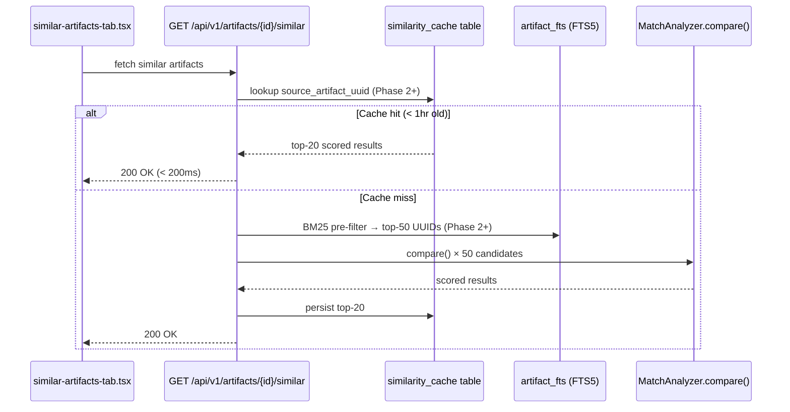

# Feature Brief & Metadata

**Feature Name:**

> Similarity Scoring Overhaul

**Filepath Name:**

> `similarity-scoring-overhaul-v1`

**Date:**

> 2026-02-26

**Author:**

> Claude Opus (claude-opus)

**Related Epic(s)/PRD ID(s):**

> None — standalone feature

**Related Documents:**

> - `docs/project_plans/SPIKEs/similarity-scoring-overhaul-v1.md` — SPIKE with full algorithm analysis and code examples
> - `skillmeat/api/utils/fts5.py` — Existing FTS5 integration to reuse
> - `skillmeat/core/scoring/match_analyzer.py` — Primary scoring file
> - `skillmeat/core/similarity.py` — SimilarityService orchestrator

---

## 1. Executive summary

SkillMeat's Similar Artifacts tab computes relevance scores with five structural defects that cause it to return nearly meaningless results: descriptions are compared by length not content, content and structure hashes are never persisted to the DB, the semantic scorer is an unconditional placeholder, and all scoring runs O(n) live per request. This overhaul replaces the broken scoring components with BM25/bigram text matching, persists artifact fingerprint data, adds a SQLite FTS5 pre-filter and `similarity_cache` table for sub-200ms responses, and optionally wires up `sentence-transformers` for real semantic scoring.

**Priority:** HIGH

**Key outcomes:**
- Artifacts with shared descriptions or similar names surface in each other's Similar Artifacts tab with meaningful, non-trivial scores.
- Repeated tab views return pre-computed results from cache rather than re-scoring all candidates.
- Semantic scoring works and shows real values when `sentence-transformers` is installed; degrades cleanly to keyword-only when it is not.

---

## 2. Context & background

### Current state

The Similar Artifacts tab is backed by `GET /api/v1/artifacts/{id}/similar`, which calls `SimilarityService._find_similar_impl()`. On every request, that method fetches all collection artifacts from the DB, builds an `ArtifactFingerprint` for each, runs `MatchAnalyzer.compare()` for every candidate, sorts the results, and returns the top-N.

`MatchAnalyzer.compare()` aggregates five component scores into a composite:

| Component | Weight | Status |
|-----------|--------|--------|
| Keyword | 30% | Functional — bag-of-words token overlap |
| Content | 25% | Broken — hashes not persisted; almost always 0.0 |
| Structure | 20% | Broken — `file_count`/`total_size` not in DB; falls to 0.0 |
| Metadata | 15% | Broken — description uses length ratio, not content |
| Semantic | 10% | Non-functional — `HaikuEmbedder` always returns `None` |

The `DuplicatePair` table exists for pre-computed pairs, but `find_similar()` never consults it.

### Problem space

The SPIKE (`docs/project_plans/SPIKEs/similarity-scoring-overhaul-v1.md`) identified five concrete deficiencies:

1. **Description comparison uses length ratio** — `_compute_metadata_score()` computes `min(len_a, len_b) / max(len_a, len_b)`. A 100-char description about React and a 100-char description about database migrations score identically. Effective contribution to composite score: **1.5% — and that 1.5% is pure noise**.

2. **Title matching is too weak** — Title token Jaccard contributes only 0.75% (15% of metadata's 15%) to composite score. Short titles with any shared token score near-zero despite being clearly related.

3. **Content and structure hashes are never persisted** — `CollectionArtifact` has no `artifact_content_hash`, `artifact_structure_hash`, `artifact_file_count`, or `artifact_total_size` columns. The `ArtifactFingerprint` in `models.py` carries these fields, but they are computed on-demand from the filesystem and never written to the DB. Every `_fingerprint_from_row()` call produces empty strings and zeros.

4. **Semantic scorer is an explicit placeholder** — `HaikuEmbedder._generate_embedding()` returns `None` unconditionally. The 10% semantic weight is always redistributed to other components.

5. **No pre-computation** — With 500 artifacts, each tab open triggers 499 full scoring computations. With heavier descriptions, this creates noticeable latency.

### Architectural context

SkillMeat's layered architecture (router → service → repository → DB) is preserved throughout. All scoring changes are isolated to `core/scoring/` (service layer). All schema changes are in `cache/models.py` and new Alembic migrations (DB layer). The API surface (`SimilarArtifactDTO`, `SimilarityBreakdownDTO`) remains stable across all phases, with an additive `text_score` field in the breakdown.

```
GET /api/v1/artifacts/{id}/similar
  └─> artifacts.py router
      └─> SimilarityService._find_similar_impl()
          ├─> similarity_cache lookup (Phase 2+)
          ├─> FTS5 pre-filter → top-50 candidates (Phase 2+)
          └─> MatchAnalyzer.compare() × k candidates
              ├─> _compute_keyword_score()
              ├─> _compute_text_score()      ← new (Phase 1)
              ├─> _compute_content_score()   ← fixed (Phase 2)
              ├─> _compute_structure_score() ← fixed (Phase 2)
              └─> _compute_semantic_score()  ← fixed (Phase 3)
```

---

## 3. Problem statement

> "As a developer browsing an artifact, when I open the Similar Artifacts tab, I see results scored at 0% or all bunched near 88% with no meaningful differentiation, instead of a ranked list of genuinely related artifacts that helps me discover relevant tools."

**Technical root causes:**
- `_compute_metadata_score()` in `skillmeat/core/scoring/match_analyzer.py` (lines 479–483) compares description character length, not content.
- `skillmeat/cache/models.py` `CollectionArtifact` class (lines 218–355) is missing `artifact_content_hash`, `artifact_structure_hash`, `artifact_file_count`, `artifact_total_size` columns — so `_fingerprint_from_row()` in `SimilarityService` always reads empty strings and zeros.
- `skillmeat/core/scoring/haiku_embedder.py` `_generate_embedding()` (lines 301–337) returns `None` unconditionally.
- `skillmeat/core/similarity.py` `_find_similar_impl()` (lines 379–475) re-scores all candidates on every request with no cache check.

---

## 4. Goals & success metrics

### Primary goals

**Goal 1: Accurate text-based similarity**
Replace length-ratio description comparison and weak token-Jaccard title comparison with character bigram Jaccard (names) and BM25 (descriptions). Rebalance metadata weights so text content drives the signal.

**Goal 2: Persisted fingerprint data**
Add the four missing artifact fingerprint columns to `CollectionArtifact`. Populate them during `populate_collection_artifact_from_import()` so content and structure scoring work.

**Goal 3: Sub-200ms tab response via caching**
Add `similarity_cache` table (top-20 per artifact) and a SQLite FTS5 pre-filter. The API checks cache first; on miss, pre-filters to top-50 candidates before full scoring, then persists results.

**Goal 4: Functional optional semantic scoring**
Replace `HaikuEmbedder` with a pluggable `EmbeddingProvider` that defaults to `sentence-transformers` (`all-MiniLM-L6-v2`, 80MB, local, no API key) when the `[semantic]` extra is installed.

### Success metrics

| Metric | Baseline | Target | Measurement |
|--------|----------|--------|-------------|
| metadata_score for identical-description artifacts | ~0.015 (noise) | >= 0.60 | Unit test assertion |
| metadata_score for similar-name artifacts (e.g., `canvas-design` vs `canvas-layout`) | ~0.007 | >= 0.40 | Unit test assertion |
| Similar Artifacts tab load time (cache hit) | ~200ms–1s (O(n)) | < 200ms | API response time log |
| Content score for artifacts with populated hashes | 0.0 | > 0.0 | Integration test assertion |
| Semantic score when `[semantic]` installed | N/A always | Numeric value > 0 for related artifacts | Integration test |
| Regression: non-zero scores remain non-zero | Baseline | No regressions | Existing unit test suite |

---

## 5. User personas & journeys

### Personas

**Primary persona: Artifact browser**
- Role: Developer or agent user viewing an artifact's detail page
- Needs: Discover other artifacts related to the one they are looking at without manually searching
- Pain points: Similar Artifacts tab shows either 0% scores (useless) or uniformly high scores with no differentiation (misleading)

**Secondary persona: Collection curator**
- Role: User managing a personal collection of skills, commands, and agents
- Needs: Identify duplicate or near-duplicate artifacts before importing new ones
- Pain points: Similarity results are not reliable enough to use for deduplication decisions

### High-level flow



---

## 6. Requirements

### 6.1 Functional requirements

| ID | Requirement | Priority | Notes |
|:--:|-------------|:--------:|-------|
| FR-1 | Replace description length-ratio with BM25 or character bigram similarity in `_compute_metadata_score()` | Must | Core defect fix |
| FR-2 | Replace title token-Jaccard with character bigram Jaccard for name/title comparison | Must | Effective weight was 0.75% of composite |
| FR-3 | Rebalance `metadata_score` internal weights: tags=30%, type=15%, title_bigram=25%, desc_bm25=25%, length_ratio=5% | Must | Per SPIKE RQ1 analysis |
| FR-4 | Rebalance composite weights: keyword=25%, metadata=30%, content=20%, structure=15%, semantic=10% | Must | Metadata now carries text content |
| FR-5 | Add `artifact_content_hash`, `artifact_structure_hash`, `artifact_file_count`, `artifact_total_size` columns to `CollectionArtifact` ORM | Must | Unblocks content/structure scoring |
| FR-6 | Populate new fingerprint columns in `populate_collection_artifact_from_import()` during sync/import | Must | Data pipeline fix |
| FR-7 | Create SQLite FTS5 virtual table `artifact_fts` (name, title, description, tags; `porter ascii` tokenizer) | Should | Enables BM25 pre-filter; reuses `skillmeat/api/utils/fts5.py` patterns |
| FR-8 | Create `similarity_cache` table (source_uuid, target_uuid, composite_score, breakdown_json, computed_at) | Should | Caches top-20 per artifact |
| FR-9 | Modify `_find_similar_impl()` to check `similarity_cache` before scoring; populate cache on miss | Should | Phase 2 — reduces response time |
| FR-10 | Call `_invalidate_similarity_cache()` from `refresh_single_artifact_cache()` when an artifact is updated | Should | Ensures cache freshness after import/sync |
| FR-11 | Add optional `text_score` field to `SimilarityBreakdownDTO` | Should | Exposes new text-scoring component to UI |
| FR-12 | Replace `HaikuEmbedder` with pluggable `EmbeddingProvider`; implement `SentenceTransformerEmbedder` as default provider | Could | Phase 3 — optional semantic scoring |
| FR-13 | Add `sentence-transformers>=2.7.0` as `[semantic]` optional dependency in `pyproject.toml` | Could | Phase 3 |
| FR-14 | Expose `POST /api/v1/artifacts/{id}/similarity-cache/rebuild` for manual cache invalidation | Could | Operator convenience endpoint |
| FR-15 | Add unit tests covering `_compute_text_score()`, `_bigram_jaccard()`, cache hit/miss paths | Must | Required for all phases shipped |

### 6.2 Non-functional requirements

**Performance:**
- Similar Artifacts tab must load in < 200ms on a cache hit for collections of <= 1000 artifacts.
- FTS5 pre-filter must reduce full-score computation from O(n) to O(50) candidates.
- First request after service startup (cache cold) must complete in < 2s for collections of <= 500 artifacts.
- `sentence-transformers` model load is allowed to take up to 2s on first use; subsequent requests must complete in < 50ms.

**Reliability:**
- Fallback chain must be robust: if FTS5 is unavailable, fall back to full O(n) scan with a logged warning. If `sentence-transformers` is not installed, fall back to keyword-only scoring silently.
- Phase 2 Alembic migration must use `ADD COLUMN IF NOT EXISTS` semantics and must not corrupt existing data.
- `similarity_cache` invalidation must trigger on any artifact update to prevent serving stale results.

**Observability:**
- Log cache hit/miss events with artifact UUID and response time at DEBUG level.
- Log which fingerprint fields are populated vs. empty at TRACE/DEBUG level during import.
- Log a WARNING at startup if FTS5 is unavailable in the SQLite build.
- Log a INFO message when `sentence-transformers` model is loaded.

**Security:**
- No new authentication surface. All existing endpoint authorization is preserved.
- FTS5 query inputs must be escaped to prevent FTS5 injection (double-quote escaping of `"` characters).

**Compatibility:**
- Python 3.9+ (project minimum). `sentence-transformers` requires Python 3.8+, so no conflict.
- SQLite FTS5 is available in CPython 3.6+ standard `sqlite3` module. Verify at startup with `SELECT fts5()` and degrade gracefully if absent.
- No PostgreSQL migration. SQLite remains the sole database backend.
- `SimilarArtifactDTO` and `SimilarityBreakdownDTO` shapes are additive-only. No breaking changes to existing API response shape.

---

## 7. Scope

### In scope

- Fix `_compute_metadata_score()` — description BM25, title bigram Jaccard, weight rebalancing (Phase 1)
- Fix `_compute_keyword_score()` weight in composite rebalancing (Phase 1)
- Add missing fingerprint columns to `CollectionArtifact` + Alembic migration (Phase 2)
- Populate fingerprint columns during import/sync (Phase 2)
- Create `artifact_fts` FTS5 virtual table and wire into candidate pre-filtering (Phase 2)
- Create `similarity_cache` table and integrate into `_find_similar_impl()` (Phase 2)
- Cache invalidation on artifact update (Phase 2)
- Replace `HaikuEmbedder` with `SentenceTransformerEmbedder` as optional provider (Phase 3)
- Add `[semantic]` optional dependency group (Phase 3)
- Unit and integration tests for all new components (Phase 4)
- Optional `POST /api/v1/artifacts/{id}/similarity-cache/rebuild` endpoint (Phase 2, could-have)

### Out of scope

- PostgreSQL migration or `pgvector` integration
- Real-time or event-driven similarity score updates (beyond cache invalidation on sync)
- Cross-user or cross-collection similarity
- Full-text search feature (separate concern from similarity scoring)
- UI changes beyond displaying `text_score` in the breakdown if present
- Cloud embedding APIs (OpenAI, Cohere, Voyage) — `sentence-transformers` local is the only Phase 3 target; cloud providers are post-v1 work
- `sqlite-vss` or `sqlite-vec` native vector extensions (too complex for personal-tool scale)
- N×N full pairwise pre-computation (bounded top-20-per-artifact cache is sufficient)

---

## 8. Dependencies & assumptions

### External dependencies

- **SQLite FTS5**: Available in Python standard library `sqlite3` module for CPython 3.6+. No pip install required. Verify at startup. Fallback: full O(n) scan with warning log.
- **`sentence-transformers>=2.7.0`** (Phase 3, optional): `pip install skillmeat[semantic]`. First run downloads `all-MiniLM-L6-v2` (~80MB) to `~/.cache/huggingface/`. No API key.
- **`rank_bm25`** (Phase 1, optional alternative): Single-file BSD-licensed package. Preferred approach is SQLite FTS5 to eliminate this dependency; only use `rank_bm25` if FTS5 is unavailable in the runtime build.

### Internal dependencies

- **Alembic migration chain**: Phase 2 schema changes require a clean migration head. Any in-flight or unapplied migrations must be resolved first.
- **`skillmeat/api/utils/fts5.py`**: Existing FTS5 utility module. Phase 2 FTS5 virtual table creation should reuse or extend these utilities rather than duplicating raw SQL.
- **`refresh_single_artifact_cache()`** in `skillmeat/cache/refresh.py`: Phase 2 cache invalidation hooks into this function. It must already exist and be the canonical post-import/sync refresh path.
- **`HaikuEmbedder` embedding cache** (`~/.skillmeat/embeddings.db`): The SQLite embedding cache infrastructure is already correct and reusable. `SentenceTransformerEmbedder` can reuse the same cache schema without modification.

### Assumptions

- Collection size at target scale is 100–1000 artifacts. Performance requirements are calibrated to this range. If the collection grows to 10,000+, the caching strategy should be revisited.
- `SimilarArtifactDTO` and `SimilarityBreakdownDTO` are the canonical API contracts for the Similar Artifacts feature. No other endpoint exposes raw similarity scores.
- The `DuplicatePair` table is not the right vehicle for the similarity cache. A new dedicated `similarity_cache` table is cleaner and avoids semantic confusion with deduplication.
- Anthropic does not expose a dedicated embeddings API as of February 2026. `HaikuEmbedder` must be disabled rather than fixed.
- Phase 1 ships independently as a standalone PR before Phase 2 begins. This avoids blocking visible quality improvement on schema changes.

### Feature flags

- **`SKILLMEAT_SIMILARITY_CACHE_ENABLED`** (optional env var): Controls whether `similarity_cache` lookups are used. Defaults to `true`. Allows disabling cache for debugging or testing.
- **`SKILLMEAT_SIMILARITY_CACHE_TTL_SECONDS`** (optional env var): Cache TTL in seconds. Defaults to `3600` (1 hour). Tune for more aggressive freshness.

---

## 9. Risks & mitigations

| Risk | Impact | Likelihood | Mitigation |
|------|:------:|:----------:|------------|
| Phase 2 Alembic migration corrupts existing DB on upgrade | High | Low | Use `ADD COLUMN IF NOT EXISTS`; test against a fixture DB with representative data in CI before merging |
| FTS5 not available in non-standard Python/SQLite build | High (Phase 2 fails) | Low — FTS5 is default in CPython | Check `sqlite3.sqlite_version_info` and `SELECT fts5()` at startup; log `WARNING` and fall back to full O(n) scan |
| BM25 over-scores domain-common words ("skill", "tool", "command", "agent") | Medium — noisy results | Medium | Add a small domain-specific stop-word list to the tokenizer for name/description scoring |
| `similarity_cache` grows unbounded | Low (SQLite size) | Low — bounded at top-20 per artifact | Add `MAX_CACHE_ENTRIES_PER_ARTIFACT = 20` enforcement; consider periodic cleanup of rows older than 7 days |
| `sentence-transformers` model download blocks first request | Medium (UX degradation) | Low — lazy load pattern | Lazy-load on first similarity request; log INFO "downloading model (first use)"; do not block startup |
| FTS5 virtual table goes out of sync with `collection_artifacts` | Medium — stale candidates | Medium — manual sync required | Rebuild FTS5 table on full `refresh_cache()` calls; update FTS5 entry in `refresh_single_artifact_cache()` |
| Content hash fields populated incorrectly by data pipeline | Medium — wrong scores | Medium — fingerprint computation has bugs | Add unit tests asserting fingerprint fields are non-empty after a simulated import; log populated vs. empty field count per import batch |

---

## 10. Target state (post-implementation)

### User experience

- Opening the Similar Artifacts tab for any artifact produces a ranked list where the top results share meaningful name, tag, or description overlap with the viewed artifact.
- Score breakdown shows `text_score` as a named component alongside keyword, content, structure, and semantic scores.
- Repeated visits to the tab are fast (< 200ms) because scores are cached.
- If `skillmeat[semantic]` is installed, the semantic score column shows a real numeric value for related artifacts instead of "N/A".

### Technical architecture

**Phase 1 state (algorithm fix only):**
- `_compute_metadata_score()` uses character bigram Jaccard for name/title and BM25 similarity for descriptions.
- Composite weights: keyword=25%, metadata=30%, content=20%, structure=15%, semantic=10%.
- Metadata internal weights: tags=30%, type=15%, title_bigram=25%, desc_bm25=25%, length_ratio=5%.
- `SimilarityBreakdownDTO` has optional `text_score` field.

**Phase 2 state (schema + caching):**
- `CollectionArtifact` has `artifact_content_hash`, `artifact_structure_hash`, `artifact_file_count`, `artifact_total_size` columns, populated during import/sync.
- `artifact_fts` FTS5 virtual table indexes name, title, description, tags for all artifacts.
- `similarity_cache` table holds top-20 pre-computed pairs per artifact with TTL-based freshness.
- `_find_similar_impl()` checks cache first, uses FTS5 pre-filter on miss, persists results.
- `refresh_single_artifact_cache()` invalidates and rebuilds similarity cache for updated artifacts.

**Phase 3 state (optional embeddings):**
- `SentenceTransformerEmbedder` (`all-MiniLM-L6-v2`) is the default embedding provider when `skillmeat[semantic]` is installed.
- `HaikuEmbedder` is renamed `AnthropicEmbedder` with `is_available()` returning `False` and a clear docstring.
- Embedding vectors stored in existing `~/.skillmeat/embeddings.db` cache (no schema change).
- Provider selection order: `SentenceTransformerEmbedder` → `AnthropicEmbedder` (always unavailable) → `None` (keyword-only fallback).

### Observable outcomes

- `_compute_metadata_score()` returns >= 0.6 for artifacts with identical descriptions (vs. ~0.015 today).
- `_compute_content_score()` returns > 0 for artifacts where `artifact_content_hash` is populated.
- Second request for the same artifact UUID returns results in < 200ms.
- FTS5 pre-filter log line shows "50 candidates selected from N total" on cache miss.

---

## 11. Overall acceptance criteria (definition of done)

### Functional acceptance

- [ ] FR-1: `_compute_metadata_score()` uses BM25/bigram for description, not length ratio
- [ ] FR-2: `_compute_metadata_score()` uses character bigram Jaccard for name/title
- [ ] FR-3: `metadata_score` internal weights match specification (tags=30%, type=15%, title=25%, desc=25%, length=5%)
- [ ] FR-4: Composite weights match specification (keyword=25%, metadata=30%, content=20%, structure=15%, semantic=10%)
- [ ] FR-5: `CollectionArtifact` ORM has all four fingerprint columns with correct types and defaults
- [ ] FR-6: Fingerprint columns are populated during `populate_collection_artifact_from_import()`
- [ ] FR-7: `artifact_fts` FTS5 virtual table exists and is populated for all collection artifacts
- [ ] FR-8: `similarity_cache` table exists with correct schema and indexes
- [ ] FR-9: `_find_similar_impl()` checks cache first and uses FTS5 pre-filter on miss
- [ ] FR-10: `refresh_single_artifact_cache()` invalidates affected `similarity_cache` rows
- [ ] FR-11: `SimilarityBreakdownDTO` has optional `text_score` field
- [ ] FR-12 (optional): `SentenceTransformerEmbedder` installed and used when `[semantic]` extra is present
- [ ] FR-15: Unit tests cover all new scoring methods and cache paths

### Technical acceptance

- [ ] Follows SkillMeat layered architecture (router → service → repository → DB)
- [ ] All APIs return DTOs — no raw ORM models leaked
- [ ] `SimilarArtifactDTO` shape is backward-compatible (no removed fields)
- [ ] Alembic migration runs cleanly from any existing DB state: `alembic upgrade head`
- [ ] FTS5 unavailability degrades gracefully with warning log, not exception
- [ ] `sentence-transformers` absence degrades gracefully to keyword-only, not exception

### Quality acceptance

- [ ] Unit tests: `_bigram_jaccard()` covers hyphenated names, prefix variants, empty inputs
- [ ] Unit tests: `_compute_text_score()` covers identical, partial, no-overlap, missing-description cases
- [ ] Unit tests: `_find_similar_impl()` cache hit path returns without calling `MatchAnalyzer.compare()`
- [ ] Unit tests: `_find_similar_impl()` cache miss path calls FTS5 pre-filter and persists to cache
- [ ] Unit tests: `_invalidate_similarity_cache()` deletes correct rows for updated artifact
- [ ] Integration test: Alembic migration `upgrade head` succeeds against a fixture DB
- [ ] Integration test: Import of an artifact with a known description populates fingerprint columns
- [ ] No regression: all existing `MatchAnalyzer.compare()` unit tests pass after weight rebalancing
- [ ] Performance: cache-hit response time < 200ms measured with `time.perf_counter()` in test

### Documentation acceptance

- [ ] ADR-SSO-001 created: SQLite FTS5 as similarity pre-filter (FTS5 vs. in-memory BM25)
- [ ] ADR-SSO-002 created: embedding provider strategy (sentence-transformers vs. cloud APIs)
- [ ] ADR-SSO-003 created: similarity cache invalidation policy (TTL vs. event-driven)
- [ ] Docstrings updated on all modified public methods in `SimilarityService` and `MatchAnalyzer`

---

## 12. Assumptions & open questions

### Assumptions

- FTS5 is available in the SkillMeat deployment environment (macOS and Linux default CPython builds). CI must verify this.
- The `populate_collection_artifact_from_import()` code path in `cache/refresh.py` is the authoritative import hook. If fingerprint data is computed elsewhere, that path must also be updated.
- `DuplicatePair` table is left intact and unused by this feature. A future deduplication PRD may repurpose or deprecate it.
- Cache TTL of 1 hour is appropriate for personal-tool use patterns (not multi-user concurrent edit scenarios).
- Phase 1 can be reviewed and merged before Phase 2 begins. There is no hard dependency between phases, only a logical ordering preference.

### Open questions

- [ ] **Q1**: Does `populate_collection_artifact_from_import()` currently have access to the filesystem artifact directory to compute `content_hash`, `structure_hash`, `file_count`, and `total_size`? Or does the fingerprint computation live in a separate path that must be traced?
  - **A**: TBD — investigate `skillmeat/cache/refresh.py` and `skillmeat/sources/` import flow before Phase 2 begins.

- [ ] **Q2**: Should the FTS5 virtual table be rebuilt entirely on each full `refresh_cache()` call, or should it be updated incrementally via `INSERT/UPDATE/DELETE` per artifact? SQLite FTS5 does not support automatic cascading from parent tables.
  - **A**: TBD — SPIKE recommends investigating trigger vs. rebuild approach. Full rebuild on full refresh is simpler and acceptable at n=1000.

- [ ] **Q3**: Should `text_score` appear in the UI score breakdown, or only in the API response for programmatic consumers?
  - **A**: Default: expose in API response via `SimilarityBreakdownDTO`. UI display is a could-have — no UI change is required for Phase 1/2.

- [ ] **Q4**: What is the actual fingerprint population rate in production today? Run `SELECT COUNT(*), COUNT(artifact_content_hash) FROM collection_artifacts` before Phase 2 to confirm the defect scope.
  - **A**: TBD — run diagnostic before Phase 2 planning.

---

## 13. Appendices & references

### Related documentation

- **SPIKE**: `docs/project_plans/SPIKEs/similarity-scoring-overhaul-v1.md` — Full algorithm analysis, RQ answers, code examples, and risk matrix
- **FTS5 utilities**: `skillmeat/api/utils/fts5.py` — Existing FTS5 integration patterns to reuse in Phase 2
- **ADRs to create**: ADR-SSO-001, ADR-SSO-002, ADR-SSO-003 (see Documentation Acceptance above)

### Symbol references

- **`SimilarityService`**: `skillmeat/core/similarity.py` (orchestrator, lines 379–475 for `_find_similar_impl()`)
- **`MatchAnalyzer`**: `skillmeat/core/scoring/match_analyzer.py` (scoring algorithm, `_compute_metadata_score()` lines 479–483)
- **`ArtifactFingerprint`**: `skillmeat/models.py` (~line 458)
- **`CollectionArtifact`**: `skillmeat/cache/models.py` (lines 218–355)
- **`SimilarityBreakdownDTO`**: `skillmeat/api/schemas/artifacts.py` (lines 1396–1452)
- **`HaikuEmbedder`**: `skillmeat/core/scoring/haiku_embedder.py` (lines 301–337)
- **`use-similar-artifacts.ts`**: `skillmeat/web/hooks/use-similar-artifacts.ts`
- **`similar-artifacts-tab.tsx`**: `skillmeat/web/components/collection/similar-artifacts-tab.tsx`

### Prior art

- SQLite FTS5 documentation: https://www.sqlite.org/fts5.html
- `sentence-transformers` library: https://www.sbert.net (model: `all-MiniLM-L6-v2`)
- BM25: Robertson and Zaragoza (2009), "The Probabilistic Relevance Framework: BM25 and Beyond"

---

## Implementation

### Phased approach

**Phase 1: Fix scoring algorithm (no schema changes)**
- Duration: ~1.5 days
- Risk: Low — zero schema changes, all changes in service layer
- Tasks:
  - [ ] Add `_bigram_jaccard(text_a, text_b)` method to `MatchAnalyzer`
  - [ ] Add `_compute_text_score(a, b)` method using BM25 (FTS5 or `rank_bm25`) for descriptions, bigram for fallback
  - [ ] Replace description length-ratio in `_compute_metadata_score()` with call to `_compute_text_score()`
  - [ ] Replace title token-Jaccard with `_bigram_jaccard()` in `_compute_metadata_score()`
  - [ ] Rebalance `metadata_score` internal weights (tags=0.30, type=0.15, title=0.25, desc=0.25, length=0.05)
  - [ ] Rebalance composite weights in `similarity.py` (keyword=0.25, metadata=0.30, content=0.20, structure=0.15, semantic=0.10)
  - [ ] Add optional `text_score` field to `SimilarityBreakdownDTO` in `schemas/artifacts.py`
  - [ ] Disable `HaikuEmbedder.is_available()` to return `False`; add docstring explaining Anthropic has no embedding API
  - [ ] Write unit tests for `_bigram_jaccard()` and `_compute_text_score()`

**Phase 2: Schema + caching**
- Duration: ~2.5 days
- Risk: Medium — Alembic migration, FTS5 virtual table management
- Prerequisite: Run diagnostic `SELECT COUNT(*), COUNT(artifact_content_hash) FROM collection_artifacts` to confirm fingerprint gap
- Tasks:
  - [ ] Add four fingerprint columns to `CollectionArtifact` ORM model
  - [ ] Write Alembic migration for new columns (ADD COLUMN IF NOT EXISTS pattern)
  - [ ] Populate fingerprint columns in `populate_collection_artifact_from_import()`; trace import path from `sources/` to confirm hook location
  - [ ] Write Alembic migration for `artifact_fts` FTS5 virtual table (raw SQL in migration; use `skillmeat/api/utils/fts5.py` patterns)
  - [ ] Write Alembic migration for `similarity_cache` table with indexes
  - [ ] Implement `_fts5_prefilter(session, target_fp, k=50)` in `SimilarityService`
  - [ ] Implement `_check_similarity_cache(session, source_uuid)` and `_persist_similarity_cache(session, source_uuid, results)` in `SimilarityService`
  - [ ] Implement `_invalidate_similarity_cache(session, artifact_uuid)` and call from `refresh_single_artifact_cache()`
  - [ ] Update `_find_similar_impl()` to use cache-check → FTS5 pre-filter → score → persist flow
  - [ ] Add FTS5 availability check at startup with WARNING fallback
  - [ ] Add optional `SKILLMEAT_SIMILARITY_CACHE_ENABLED` and `SKILLMEAT_SIMILARITY_CACHE_TTL_SECONDS` env var support
  - [ ] Write integration tests: migration clean run, fingerprint population, cache hit/miss paths

**Phase 3: Optional semantic embeddings**
- Duration: ~1 day
- Risk: Low — well-bounded, existing embedding cache infrastructure is reusable
- Prerequisite: Phase 1 complete
- Tasks:
  - [ ] Create `skillmeat/core/scoring/sentence_transformer_embedder.py` implementing `EmbeddingProvider`
  - [ ] Implement lazy model load with `threading.Lock` for thread safety
  - [ ] Add `[semantic]` optional dependency group to `pyproject.toml`
  - [ ] Update `SimilarityService.__init__()` provider selection: try `SentenceTransformerEmbedder`, then `AnthropicEmbedder` (always unavailable), then `None`
  - [ ] Rename `haiku_embedder.py` → `anthropic_embedder.py`; update `is_available()` to return `False` with clear docstring
  - [ ] Write unit tests: `SentenceTransformerEmbedder.is_available()` returns `True` when package installed, graceful fallback when not

**Phase 4: Tests and observability**
- Duration: ~1 day
- Tasks:
  - [ ] Complete unit test coverage for all new scoring methods
  - [ ] Add cache timing instrumentation (DEBUG log: "similarity cache hit/miss for {uuid} in {ms}ms")
  - [ ] Add FTS5 candidate count logging (DEBUG log: "FTS5 pre-filter: {k} of {n} candidates selected")
  - [ ] Add fingerprint population count logging during import (DEBUG log: "{n} of {total} artifacts had content_hash populated")
  - [ ] Create ADR-SSO-001, ADR-SSO-002, ADR-SSO-003

### Epics & user stories backlog

| Story ID | Short Name | Description | Acceptance Criteria | Estimate |
|----------|------------|-------------|---------------------|----------|
| SSO-P1-01 | Bigram Jaccard | Add `_bigram_jaccard()` to `MatchAnalyzer` | Unit tests pass for hyphenated names, prefix variants, empty inputs | 2 pts |
| SSO-P1-02 | Text score method | Add `_compute_text_score()` using BM25/bigram for descriptions | Identical descriptions score >= 0.8; no overlap scores ~0.0 | 3 pts |
| SSO-P1-03 | Metadata weight fix | Replace length-ratio and token-Jaccard; rebalance internal weights | metadata_score >= 0.6 for identical-description artifacts | 2 pts |
| SSO-P1-04 | Composite weight rebalance | Update composite weight constants in `similarity.py` | Existing unit tests pass with new weights | 1 pt |
| SSO-P1-05 | Breakdown DTO extension | Add optional `text_score` to `SimilarityBreakdownDTO` | API response includes `text_score` field; existing consumers not broken | 1 pt |
| SSO-P1-06 | Disable HaikuEmbedder | `is_available()` returns `False`; add docstring | No exceptions thrown; fallback to keyword-only scoring verified | 1 pt |
| SSO-P2-01 | Fingerprint columns | Add 4 columns to `CollectionArtifact` + migration | `alembic upgrade head` succeeds; columns present in schema | 2 pts |
| SSO-P2-02 | Fingerprint population | Populate fingerprint columns during import | After import, `artifact_content_hash` is non-null for artifacts with files | 3 pts |
| SSO-P2-03 | FTS5 virtual table | Create `artifact_fts` + migration; populate on import | FTS5 MATCH queries return results; BM25 ordering correct | 3 pts |
| SSO-P2-04 | Similarity cache table | Create `similarity_cache` + migration + indexes | Table exists; PRIMARY KEY and indexes created | 1 pt |
| SSO-P2-05 | Cache lookup integration | Check `similarity_cache` in `_find_similar_impl()` | Second request for same artifact returns in < 200ms | 3 pts |
| SSO-P2-06 | FTS5 pre-filter | Implement `_fts5_prefilter()` and use on cache miss | Log shows "50 of N candidates selected" on miss | 2 pts |
| SSO-P2-07 | Cache invalidation | `_invalidate_similarity_cache()` called on artifact update | Updated artifact's cache rows deleted; next request recomputes | 2 pts |
| SSO-P3-01 | SentenceTransformerEmbedder | Implement embedder with lazy model load | When `[semantic]` installed, semantic score is non-zero for related artifacts | 4 pts |
| SSO-P3-02 | Optional dependency | Add `[semantic]` extra to `pyproject.toml` | `pip install skillmeat[semantic]` installs `sentence-transformers` | 1 pt |
| SSO-P4-01 | Observability | Add cache hit/miss, FTS5, fingerprint log lines | Log output present at DEBUG level in test run | 1 pt |
| SSO-P4-02 | ADRs | Write ADR-SSO-001, -002, -003 | Three ADR files created with decision rationale | 2 pts |

**Total estimate:** ~34 points (~6 days)

---

**Progress tracking:**

See progress tracking: `.claude/progress/similarity-scoring-overhaul/all-phases-progress.md`
