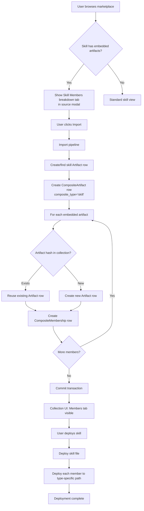

# Feature Brief & Metadata

**Feature Name:**

> Skill-Contained Artifacts

**Filepath Name:**

> `skill-contained-artifacts-v1`

**Date:**

> 2026-02-21

**Author:**

> Claude (Sonnet 4.6) — PRD Writer agent

**Related Epic(s)/PRD ID(s):**

> Successor to `composite-artifact-infrastructure-v1` (infrastructure layer) and `composite-artifact-ux-v2` (UX layer for plugins). Extends the composite system to cover Skills as parent containers.

**Related Documents:**

> - [PRD: Composite Artifact Infrastructure](/docs/project_plans/PRDs/features/composite-artifact-infrastructure-v1.md)
> - [PRD: Composite Artifact UX v2](/docs/project_plans/PRDs/features/composite-artifact-ux-v2.md)
> - `.claude/progress/marketplace-embedded-artifacts-v1/` — prior fix: prevents embedded artifacts from being promoted as top-level items
> - `skillmeat/cache/models.py` — `CompositeArtifact`, `CompositeMembership` ORM models (lines 2905–3145)
> - `skillmeat/core/marketplace/heuristic_detector.py` — `DetectedArtifact.embedded_artifacts` (lines 799, 2556, 2623)
> - `skillmeat/core/discovery.py` — `DiscoveredGraph`, `detect_composites()` (lines 199–504)
> - `skillmeat/core/importer.py` — composite import with hash-based dedup
> - `skillmeat/core/deployment.py` — skill deployment (no member awareness)

---

## 1. Executive Summary

Skills in SkillMeat can contain embedded sub-artifacts (commands, agents, hooks, MCP servers) in typed subdirectories. The `marketplace-embedded-artifacts-v1` fix prevents those sub-artifacts from appearing as independent top-level items, but it stops short of modeling the parent-child relationship in the database. This PRD extends the existing `CompositeArtifact` / `CompositeMembership` infrastructure — already proven for Plugins — to cover Skills with embedded content, giving users proper relationship visibility, deduplicated import, coordinated deployment, and three-layer version tracking.

**Priority:** HIGH

**Key Outcomes:**

- Skills with embedded artifacts are represented as `CompositeArtifact` rows (type `"skill"`) linked to member `Artifact` rows via `CompositeMembership`, reusing all existing service and repository code.
- Importing a skill that contains embedded artifacts is atomic and deduplicated: if an embedded command already exists in the collection, a membership link is created rather than a duplicate artifact row.
- The web UI surfaces a "Members" tab on skill detail/operations views and a "Part of" section on member artifact views, genericized from the existing plugin components.
- Deploying a skill optionally deploys all its member artifacts to their correct type-specific locations in a single atomic operation.
- Version drift across source, collection, and project layers is tracked and surfaced for skills and their members together.

---

## 2. Context & Background

### Current state

**Composite infrastructure (completed as of `composite-artifact-infrastructure-v1` and `composite-artifact-ux-v2`):**

- `CompositeArtifact` ORM model (`composite_type` values: `plugin`, `stack`, `suite`; CHECK constraint enforces these three values only).
- `CompositeMembership` ORM model: `composite_id` FK → `composite_artifacts.id` (CASCADE delete); `child_artifact_uuid` FK → `artifacts.uuid`.
- `CompositeService` and `CompositeMembershipRepository` with full CRUD.
- `GET /api/v1/artifacts/{id}/associations` endpoint returning parents and children.
- Frontend: `artifact-contains-tab.tsx`, `artifact-part-of-section.tsx`, `useArtifactAssociations` hook.
- Plugin Breakdown tab in marketplace source modal.

**Embedded artifact detection (partially completed):**

- `heuristic_detector.py` populates `DetectedArtifact.embedded_artifacts` for skills that contain typed subdirectories.
- `marketplace-embedded-artifacts-v1` fix: embedded artifacts are not promoted as independent top-level items.
- `DiscoveredGraph` exists in `discovery.py` for directory-based composite detection, but is only triggered by `plugin.json` presence or multi-artifact-type root directories — not specifically for skills with embedded subdirs.

**Gaps (not yet done):**

- `composite_type` CHECK constraint does not include `"skill"` — adding `"skill"` requires an Alembic migration.
- No `CompositeArtifact` rows are created for skills; there is therefore no `CompositeMembership` rows linking skills to their embedded artifacts.
- Import flow (`importer.py`) does not process a skill's `embedded_artifacts` list to create membership links.
- `deployment.py` deploys skill files only; no awareness of member artifacts.
- UI "Members" tab label is plugin-specific; no genericized label for skills.
- No three-layer version tracking for skill members.
- The `marketplace-embedded-artifacts-v1` fix is too aggressive: embedded artifacts are completely hidden from top-level display, preventing users from discovering and importing them individually. A display toggle is needed.

### Problem space

A skill such as `anthropics/skills/git-workflow-pro` may contain a `commands/` subdirectory with a `deploy.md` command and an `agents/` subdirectory with a `pr-reviewer.md` agent. After the `marketplace-embedded-artifacts-v1` fix, those sub-artifacts correctly stay hidden as top-level items. However:

1. There is no database record linking the skill to its embedded artifacts. `GET /artifacts/{skill_id}/associations` returns empty.
2. Importing the skill a second time, or importing a different skill that happens to contain the same embedded command, creates a silent duplicate artifact row — the same command existing twice with different UUIDs.
3. The collection UI shows the skill card with no indication that it contains 2 artifacts. Clicking into it shows no Members tab.
4. Deploying the skill copies the skill markdown file but ignores the embedded command and agent. The user must deploy each sub-artifact manually.
5. When the upstream skill version bumps (new command added), there is no diff to show which members changed.
6. The v1 embedded artifacts fix over-corrected: embedded artifacts are now invisible as top-level items in the marketplace source, preventing individual discovery and import. Users should see embedded artifacts as top-level items by default, with the option to collapse them under their parent skill.

### Current alternatives / workarounds

None for end users. Developers can inspect `embedded_artifacts` on a `DetectedArtifact` by calling the heuristic detector directly. There is no UI surface or import-time handling for the data.

### Architectural context

SkillMeat uses a layered architecture:

- **Routers** (`skillmeat/api/routers/`) — HTTP surface, input validation, DTO responses
- **Services** (`skillmeat/core/services/`) — business logic; `CompositeService` already exists and handles plugin membership CRUD
- **Repositories** (`skillmeat/cache/`) — all DB I/O; `CompositeMembershipRepository` already exists
- **ORM Models** (`skillmeat/cache/models.py`) — `CompositeArtifact`, `CompositeMembership` already exist; `composite_type` must be extended
- **Frontend** (`skillmeat/web/`) — Next.js 15 App Router, TanStack Query, shadcn/Radix UI; existing plugin UI components require label generalization only

The DB cache is the web UI's source of truth. All mutations write-through to DB and invalidate frontend query caches.

**Critical design decision resolved:** `CompositeMembership.composite_id` is a hard FK to `composite_artifacts.id`. Skills are stored as `Artifact` rows (not `CompositeArtifact` rows). To reuse the membership infrastructure without schema surgery, this feature creates a companion `CompositeArtifact` row (type `"skill"`) for every skill that has embedded artifacts. The skill `Artifact` row and the skill `CompositeArtifact` row share a stable identifier (the skill's collection-scoped path/name) stored in `CompositeArtifact.metadata_json`. This is Option (a) from the feature brief — it reuses all existing infrastructure with minimal changes (one new `composite_type` value + one migration).

---

## 3. Problem Statement

**User story:**

> "As a SkillMeat user, when I import a skill that contains embedded commands or agents, those sub-artifacts are silently lost from the database relationship graph — I cannot see what the skill contains, duplicates are created on re-import, deploying the skill does not deploy its members, and I cannot track version drift across source, collection, and project — instead of having the skill modeled as a proper container with full member visibility, deduplication, coordinated deployment, and version tracking."

**Technical root cause:**

- `composite_type` CHECK constraint (`'plugin', 'stack', 'suite'`) excludes `'skill'`, so no `CompositeArtifact` rows can be created for skills with the current schema.
- Import flow (`importer.py`) inspects `DetectedArtifact.embedded_artifacts` but does not create `CompositeMembership` rows — this field was added in `heuristic_detector.py` but the downstream import pipeline was never extended to consume it.
- `deployment.py` has no concept of member artifacts; it deploys the skill file(s) only.
- UI tabs (`artifact-contains-tab.tsx`, `artifact-part-of-section.tsx`) query `useArtifactAssociations` which returns empty for skills because no DB membership rows exist.

---

## 4. Goals & Success Metrics

### Primary goals

**Goal 1: Schema extension for skill-type composites**
Extend `CompositeArtifact.composite_type` to accept `"skill"` via an Alembic migration, and update the `CompositeService` to create companion `CompositeArtifact` rows for skills with embedded artifacts at import time.

**Goal 2: Atomic, deduplicated import**
When importing a skill with embedded artifacts, the import pipeline creates or reuses child `Artifact` rows (hash-based dedup) and links them via `CompositeMembership` rows in a single atomic transaction.

**Goal 3: Marketplace and collection UI — member visibility**
The marketplace source modal shows a "Skill Members" breakdown tab for skills with embedded artifacts. The collection detail/operations modal shows a "Members" tab with member list and sync status. Member artifact views show a "Part of" section naming the parent skill.

**Goal 4: Coordinated deployment**
`skillmeat deploy <skill>` optionally deploys the skill and all its member artifacts atomically. A `--members` / `--no-members` flag controls member inclusion; default is `--members`.

**Goal 5: Three-layer version tracking**
Version drift for skill members is detected and surfaced: source version vs. collection version vs. deployed version for each member. Sync operations treat the skill and its members as a unit.

### Success metrics

| Metric | Baseline | Target | Measurement method |
|--------|----------|--------|--------------------|
| Membership rows created on skill import | 0 | N (count of embedded artifacts) | DB query: `SELECT COUNT(*) FROM composite_memberships WHERE composite_id IN (SELECT id FROM composite_artifacts WHERE composite_type='skill')` |
| Duplicate artifacts on re-import of same skill | Creates new rows | 0 duplicates | Integration test: import skill twice, verify artifact count unchanged |
| UI member tab renders for skills with embedded artifacts | Not rendered | Renders with correct member count | E2E test |
| Coordinated deploy success rate | 0% (no member deploy) | 100% (all members deployed) | Integration test: deploy skill, verify member files at target paths |
| Version drift detection coverage | 0 members tracked | All embedded members tracked | Unit test on sync diff logic |

---

## 5. User personas & journeys

### Personas

**Primary persona: Collection manager**
- Role: Developer managing a personal Claude Code artifact collection via the SkillMeat web UI
- Needs: Clear visibility into what artifacts a skill contains; single-action import and deploy for the whole skill package
- Pain points: Currently must manually discover and import each embedded artifact individually; has no idea if a deployed skill is missing its companion commands

**Secondary persona: Marketplace browser**
- Role: Developer discovering skills in the SkillMeat marketplace
- Needs: Before importing a skill, see what sub-artifacts it includes; understand whether any are already in their collection
- Pain points: Currently the marketplace shows the skill as an opaque item with no member count or breakdown

### High-level flow



---

## 6. Requirements

### 6.1 Functional requirements

| ID | Requirement | Priority | Notes |
|:--:|-------------|:--------:|-------|
| FR-1 | `CompositeArtifact.composite_type` must accept `"skill"` as a valid value | Must | Requires Alembic migration to update CHECK constraint; existing rows unaffected |
| FR-2 | When importing a skill whose `DetectedArtifact.embedded_artifacts` is non-empty, the importer creates a `CompositeArtifact` row (type `"skill"`) and `CompositeMembership` rows for each embedded artifact | Must | Atomic transaction; skill `Artifact.uuid` stored in `CompositeArtifact.metadata_json` as `{"artifact_uuid": "..."}` for back-reference |
| FR-3 | Deduplication: before creating a child `Artifact` row during skill import, check collection for matching content hash; if found, reuse the existing UUID | Must | Use same hash-based dedup as plugin import in `importer.py` |
| FR-4 | `GET /api/v1/artifacts/{artifact_id}/associations` must return member artifacts when `artifact_id` resolves to a skill with a companion `CompositeArtifact` row | Must | Router must perform the skill UUID → CompositeArtifact.id lookup before querying memberships |
| FR-5 | Marketplace source view: embedded artifacts within skills are shown as top-level items by default, with a toggle to hide/show them. When toggle is ON (default), embedded artifacts appear in the main artifact list AND in the Skill Members tab. When toggle is OFF, they appear only in the Skill Members tab. Deduplication ensures each artifact is shown only once in the main list regardless of how many skills contain it. | Must | Reverses the v1 suppression behavior; toggle is a display filter, not a detection filter. Detection always discovers all artifacts. |
| FR-5a | Individual import: users can import an embedded artifact individually (as a standalone artifact) OR import the entire skill with all members (like Composite import). When importing individually, no CompositeMembership is created. When importing the whole skill, memberships are created for all embedded artifacts. | Must | Mirrors Composite import behavior: individual member import vs. whole-package import |
| FR-6 | Collection detail/operations modal: when viewing a skill with `CompositeMembership` rows, show a "Members" tab listing child artifacts with type icon, name, version, and sync status | Must | Reuse `artifact-contains-tab.tsx`; label generalization only |
| FR-7 | Collection detail/operations modal: for artifacts that are members of a skill, show a "Part of" section in the Links tab naming the parent skill | Must | Reuse `artifact-part-of-section.tsx`; no code change expected if associations API is wired correctly |
| FR-8 | `skillmeat deploy <skill>` deploys the skill and its member artifacts by default | Must | Members are deployed to their type-specific paths (e.g., `commands/` → `.claude/commands/`, `agents/` → `.claude/agents/`) |
| FR-9 | `skillmeat deploy <skill> --no-members` deploys the skill file only, skipping member artifacts | Should | Opt-out flag for users who manage members independently |
| FR-10 | Version tracking: collection sync operations surface version drift for skill members (source version vs. collection version vs. deployed version) | Should | Extend existing sync diff logic; display per-member drift in the sync status tab |
| FR-11 | `skillmeat list` output for a skill with members shows a member count indicator (e.g., `[+3 members]`) | Could | Low-effort CLI polish; reuse existing associations query |
| FR-12 | Re-importing a skill (e.g., after an upstream update) reconciles membership: adds new members, removes dropped members, updates existing membership links | Could | Required for sync correctness; may be deferred to a sync-phase PR |

### 6.2 Non-functional requirements

**Performance:**
- Skill import with embedded artifacts must complete in under 5 seconds for a skill containing up to 10 embedded artifacts (includes hash lookups and DB writes).
- Associations API response time must remain under 200 ms for skills with up to 50 members (covered by existing `idx_composite_memberships_composite_id` index).

**Security:**
- Embedded artifact paths during import must be validated to prevent directory traversal (same validation as atomic artifact import).
- No new privilege escalation vectors — skill deployment with members uses the same permission model as individual artifact deployment.

**Accessibility:**
- Members tab and "Part of" section must meet WCAG 2.1 AA: keyboard navigable, labeled with `aria-label`, role-appropriate list semantics.

**Reliability:**
- Skill import with member creation must be fully atomic: if any member insert or membership link fails, the entire transaction rolls back. No partial state persisted.
- Migration must be backward-compatible: existing `CompositeArtifact` rows with `composite_type IN ('plugin', 'stack', 'suite')` are unaffected.

**Observability:**
- OpenTelemetry spans for: skill composite creation, member dedup check, membership link creation, coordinated deployment.
- Structured log fields: `skill_artifact_uuid`, `composite_id`, `member_count`, `dedup_hit_count`, `transaction_id`.

---

## 7. Scope

### In scope

- Alembic migration: extend `composite_type` CHECK constraint to include `"skill"`.
- `CompositeService` extension: `create_skill_composite()` method that accepts a skill `Artifact` and a list of `DetectedArtifact` children.
- Import pipeline extension (`importer.py`): consume `embedded_artifacts` field; invoke `create_skill_composite()` after skill artifact row is committed.
- Associations API fix: resolve skill `Artifact` UUID → companion `CompositeArtifact.id` before querying memberships.
- `artifact-contains-tab.tsx`: generalize tab label from "Plugin Members" to `"{Type} Members"`.
- Marketplace source modal: render "Skill Members" breakdown tab for skills with embedded artifacts.
- `deployment.py`: extend to deploy member artifacts when `--members` flag (default on) is set.
- Three-layer version tracking for skill members surfaced in the sync status tab.
- `skillmeat list` member count indicator.

### Out of scope

- Circular dependency detection (skills that contain other skills as members).
- Cross-collection membership (members from a different collection than the parent skill).
- Custom relationship types beyond `"contains"`.
- Automated conflict resolution when duplicate members have differing content (user is prompted to resolve).
- Stack or Suite composite types (separate feature, not part of this PRD).
- Editing skill membership from the UI (add/remove members post-import) — read-only membership in v1; mutation UI is a follow-on.

---

## 8. Dependencies & Assumptions

### External dependencies

- **SQLAlchemy 2.x** — ORM in use; migration authored with Alembic.
- **Alembic** — migration tooling already configured in `skillmeat/cache/migrations/`.

### Internal dependencies

- **`composite-artifact-infrastructure-v1`** (completed) — `CompositeArtifact`, `CompositeMembership`, `CompositeService`, `CompositeMembershipRepository`, `GET /associations` endpoint all exist and are functional.
- **`composite-artifact-ux-v2`** (completed) — `artifact-contains-tab.tsx`, `artifact-part-of-section.tsx`, `useArtifactAssociations` hook all exist and are functional for plugins; this PRD genericizes their labels.
- **`marketplace-embedded-artifacts-v1`** (completed) — `DetectedArtifact.embedded_artifacts` is populated by `heuristic_detector.py`; embedded artifacts are not promoted as top-level items. This PRD depends on that field being present and correct.

### Assumptions

- A skill directory uses predictable subdirectory names for embedded types: `commands/`, `agents/`, `hooks/`, `mcps/` (matching the existing `heuristic_detector.py` detection logic).
- A skill `Artifact` row has a stable `uuid` that can be cross-referenced from the companion `CompositeArtifact` row via `metadata_json`.
- Content-hash deduplication for embedded artifacts uses the same SHA-256 file-content hash already computed during atomic artifact import.
- The existing `composite_memberships` unique index on `(collection_id, composite_id, child_artifact_uuid)` provides idempotent upsert semantics during re-import.
- Deployment target paths for embedded artifact types follow the same conventions as direct deployment of those types (i.e., commands go to `.claude/commands/`, agents to `.claude/agents/`, etc.).

### Feature flags

- `SKILL_CONTAINED_ARTIFACTS_ENABLED` — guards import-time membership creation and coordinated deployment. Default: `false` until Phase 5 (testing) passes. Allows progressive rollout and safe rollback.

---

## 9. Risks & Mitigations

| Risk | Impact | Likelihood | Mitigation |
|------|:------:|:----------:|------------|
| Alembic migration breaks existing `composite_type` CHECK constraint on production DB | High | Low | Write migration as ADD-constraint-after-DROP pattern; test on a DB snapshot with existing plugin rows before merging |
| Skill `Artifact` UUID → `CompositeArtifact.id` lookup adds latency to `GET /associations` | Medium | Low | Add `idx_composite_artifacts_metadata_json` if query is slow; benchmark before adding index |
| `embedded_artifacts` list in `heuristic_detector.py` is incomplete or inaccurate for edge-case skill layouts | Medium | Medium | Validate with 10 real-world GitHub skill repos from the marketplace; add fixture-based unit tests for detection edge cases |
| Partial state on import failure (skill row created, member rows not) leaves orphaned `CompositeArtifact` | High | Low | Entire import is wrapped in a single SQLAlchemy `Session.begin()` block; any exception triggers rollback |
| Coordinated deployment overwrites user-customized member files | Medium | Medium | Before deploying a member, check if a deployed version exists and is locally modified (same conflict detection as single artifact deployment); prompt user if conflict detected |
| Re-import reconciliation (FR-12) is complex and error-prone | Medium | Medium | Defer FR-12 to a follow-on PR; scope v1 to initial import only; add a warning log when re-importing a skill that already has membership rows |
| UI label generalization introduces regressions for existing plugin views | Low | Low | Snapshot-test existing plugin member tab before and after change; generalization is a label substitution only |

---

## 10. Target state (post-implementation)

### User experience

- **Marketplace**: A skill card with embedded artifacts displays a member count badge. The source artifact list shows embedded artifacts as top-level items by default (toggle ON). Clicking "View Details" on a skill opens the source modal with a "Skill Members" tab. Users can toggle embedded artifact visibility in the main list via a "Show embedded artifacts" toggle. Individual embedded artifacts can be imported standalone, or the whole skill can be imported with all members linked.
- **Import**: Clicking "Add to Collection" on a skill with members triggers the import dialog. Progress shows "Importing skill + N members". On completion, the collection shows the skill; each member is also accessible individually.
- **Collection**: The skill detail card shows a "Members" tab listing N artifacts with type icons, names, version, and sync status indicators. Clicking a member opens its own detail view.
- **Member artifact view**: The "Links" tab of a member artifact shows "Part of: [Skill Name]" with a link back to the parent skill.
- **Deployment**: `skillmeat deploy git-workflow-pro` prints "Deploying git-workflow-pro + 3 members..." and places each artifact at its correct path.
- **Sync**: The sync status tab for a skill shows overall skill version drift and per-member drift rows, allowing the user to update the whole bundle or individual members.

### Technical architecture

```
Import flow:
  heuristic_detector.py → DetectedArtifact(embedded_artifacts=[...])
  importer.py →
    [1] create/find skill Artifact row
    [2] CompositeService.create_skill_composite(skill_artifact, embedded_list)
        → CompositeArtifact(composite_type="skill", metadata_json={"artifact_uuid": <skill_uuid>})
        → for each embedded: hash lookup → create/reuse Artifact → CompositeMembership
    [3] commit transaction

Associations API:
  GET /artifacts/{artifact_id}/associations
  → lookup CompositeArtifact WHERE metadata_json contains artifact_id
  → query CompositeMembership by composite_id
  → return parents + children DTO (existing schema, no change)

Deployment:
  deployment.py DeploymentManager.deploy(artifact, include_members=True)
  → deploy skill files to target
  → for each CompositeMembership child: deploy child to type-specific path
  → atomic rollback on any failure
```

### Observable outcomes

- `SELECT COUNT(*) FROM composite_artifacts WHERE composite_type='skill'` returns N for N imported skills with embedded artifacts.
- `SELECT COUNT(*) FROM composite_memberships WHERE composite_id IN (SELECT id FROM composite_artifacts WHERE composite_type='skill')` returns the total member count.
- Zero duplicate `Artifact` rows created when the same embedded command exists in two different imported skills (dedup working).
- CI E2E suite passes with new skill membership scenarios.

---

## 11. Overall acceptance criteria (definition of done)

### Functional acceptance

- [ ] FR-1 through FR-9 implemented and passing tests.
- [ ] Importing `anthropics/skills/git-workflow-pro` (or a fixture equivalent) creates 1 `CompositeArtifact` row (type `"skill"`) and N `CompositeMembership` rows.
- [ ] Re-importing the same skill does not create duplicate `Artifact` rows.
- [ ] `GET /api/v1/artifacts/{skill_id}/associations` returns the member list.
- [ ] Members tab renders correctly in the collection detail modal.
- [ ] Deploying a skill with `--members` (default) places all member files at the correct paths.

### Technical acceptance

- [ ] Alembic migration upgrades and downgrades cleanly on a DB with existing plugin composite rows.
- [ ] All DB writes within the import transaction are atomic (verified by rollback integration test).
- [ ] Associations API P95 response time under 200 ms for a skill with 20 members (load test or benchmark).
- [ ] OpenTelemetry spans emitted for all new code paths.
- [ ] Structured log fields present in all new log statements.

### Quality acceptance

- [ ] Unit test coverage for `CompositeService.create_skill_composite()` (happy path, hash dedup hit, rollback on failure).
- [ ] Unit tests for `deployment.py` member-aware deploy (skill only, skill + members, conflict detection).
- [ ] Integration test: full import → associations query → deploy flow for a fixture skill with 3 embedded artifacts.
- [ ] E2E tests: marketplace "Skill Members" tab renders; collection Members tab renders; "Part of" section renders on member view.
- [ ] No regressions in existing plugin composite tests.

### Documentation acceptance

- [ ] `skillmeat deploy --help` updated to document `--members` / `--no-members` flags.
- [ ] `CHANGELOG.md` entry for v1 skill-contained artifacts.
- [ ] Inline docstrings on `create_skill_composite()` and updated deployment method.

---

## 12. Assumptions & Open Questions

### Assumptions

- The `metadata_json` column on `CompositeArtifact` (already `TEXT`, nullable) is the correct place to store the back-reference `{"artifact_uuid": "<skill_artifact_uuid>"}`. No schema change required for this field.
- Skills that gain or lose embedded artifacts between upstream versions will be reconciled by a follow-on sync PR (FR-12 deferred).
- `"skill"` as a `composite_type` value is the correct semantic label; alternative (`"skill-container"`) was considered but rejected as unnecessarily verbose.

### Open questions

- [ ] **Q1**: Should the `CompositeArtifact` row for a skill share the same `id` value as the skill `Artifact.uuid`, or should it have an independent UUID?
  - **A**: Independent UUID (standard Alembic UUID PK). The cross-reference is stored in `metadata_json`. Using the same UUID would require schema surgery and violates table PK isolation.
- [ ] **Q2**: When a skill with members is deleted from the collection, should member `Artifact` rows be deleted if they are not referenced by any other composite?
  - **A**: Default: members are NOT auto-deleted (they may have been imported independently). A `--cascade` flag on `skillmeat remove` can optionally cascade. TBD in implementation.
- [ ] **Q3**: If an embedded artifact type (e.g., `hooks/`) is not yet fully supported in the collection model, should its import be skipped silently or surfaced as a warning?
  - **A**: Surface as a warning in both CLI output and the import dialog. Do not fail the overall import.
- [ ] **Q4**: The `composite_type` CHECK constraint is a database-level constraint. Does the SQLite version used in tests support `ALTER TABLE ... DROP CONSTRAINT`?
  - **A**: SQLite does not support `DROP CONSTRAINT`. The Alembic migration must recreate the table (using `batch_alter_table`) when running against SQLite. PostgreSQL migration is straightforward. Confirm migration strategy with a SQLite-targeted test run before merging.

---

## 13. Appendices & References

### Related documentation

- **Composite Artifact Infrastructure PRD**: `/docs/project_plans/PRDs/features/composite-artifact-infrastructure-v1.md`
- **Composite Artifact UX v2 PRD**: `/docs/project_plans/PRDs/features/composite-artifact-ux-v2.md`
- **Data Flow Patterns**: `.claude/context/key-context/data-flow-patterns.md` — write-through and cache invalidation graph
- **Marketplace Import Flows**: `.claude/context/key-context/marketplace-import-flows.md` — import endpoints, DB sync invariants
- **Previous fix progress**: `.claude/progress/marketplace-embedded-artifacts-v1/`

### Symbol references

- `CompositeArtifact` — `skillmeat/cache/models.py:2905`
- `CompositeMembership` — `skillmeat/cache/models.py:3023`
- `CompositeMembership.composite_id` FK definition — `skillmeat/cache/models.py:3078`
- `DetectedArtifact.embedded_artifacts` — `skillmeat/core/marketplace/heuristic_detector.py:~2556`
- `DiscoveredGraph` — `skillmeat/core/discovery.py:199`
- `detect_composites()` — `skillmeat/core/discovery.py:482`
- `artifact-contains-tab.tsx` — `skillmeat/web/components/artifact/artifact-contains-tab.tsx`
- `artifact-part-of-section.tsx` — `skillmeat/web/components/artifact/artifact-part-of-section.tsx`
- `useArtifactAssociations` — `skillmeat/web/hooks/useArtifactAssociations.ts`

### Prior art

- Plugin import deduplication pattern: `skillmeat/core/importer.py` — hash-based dedup for plugin child artifacts
- Plugin deployment: `skillmeat/core/deployment.py` — model for extension to member-aware deploy
- `marketplace-embedded-artifacts-v1` fix: defensive path resolution and embedded artifact rendering

---

## Implementation

### Phased approach

**Phase 1: Schema extension (2 days)**
- Tasks:
  - [ ] Write Alembic migration: update `check_composite_artifact_type` CHECK constraint to `'plugin', 'stack', 'suite', 'skill'`; use `batch_alter_table` for SQLite compatibility
  - [ ] Update `CompositeArtifact` model docstring and `__table_args__` in `models.py`
  - [ ] Update `CompositeService` to accept `composite_type="skill"` in `create_composite()` (or add `create_skill_composite()` method)
  - [ ] Verify migration up/down on DB with existing plugin rows

**Phase 2: Import pipeline (3 days)**
- Tasks:
  - [ ] Extend `importer.py`: after skill `Artifact` row is committed, call `create_skill_composite()` if `embedded_artifacts` is non-empty
  - [ ] Implement hash-based dedup for each embedded artifact (reuse existing dedup logic)
  - [ ] Wrap all writes in a single atomic transaction; add rollback integration test
  - [ ] Populate `CompositeArtifact.metadata_json` with `{"artifact_uuid": "<skill_uuid>"}`

**Phase 3: API wiring (1 day)**
- Tasks:
  - [ ] Update `GET /api/v1/artifacts/{artifact_id}/associations` router logic: when `artifact_id` refers to a skill, look up companion `CompositeArtifact` by `metadata_json`->`artifact_uuid`, then query memberships
  - [ ] Add integration test asserting associations are returned for a skill with members

**Phase 4: Marketplace UI (3 days)**
- Tasks:
  - [ ] Add "Show embedded artifacts" toggle to marketplace source artifact list (default: ON)
  - [ ] When toggle ON: render embedded artifacts as top-level items in the source list with parent skill indicator badge
  - [ ] Implement display-level deduplication: if artifact exists both independently and embedded, show once with "also in: [Skill Name]" indicator
  - [ ] Generalize "Plugin Breakdown" tab in source modal to render as "Skill Members" when type is skill
  - [ ] Individual import action on embedded artifacts (import as standalone, no membership)
  - [ ] Verify member count badge renders on skill source cards

**Phase 5: Collection UI (2 days)**
- Tasks:
  - [ ] Generalize `artifact-contains-tab.tsx` tab label from "Plugin Members" to `"{displayType} Members"` using existing `ARTIFACT_TYPES` config
  - [ ] Verify "Part of" section renders on member artifacts (should work automatically once associations API is wired)
  - [ ] Add E2E tests for Members tab and Part of section on skills

**Phase 6: Deployment (2 days)**
- Tasks:
  - [ ] Extend `deployment.py` `DeploymentManager.deploy()` to accept `include_members: bool = True`
  - [ ] When `include_members=True`, query `CompositeMembership` children of the skill's `CompositeArtifact` and deploy each to its type-specific path
  - [ ] Add `--members` / `--no-members` CLI flags to `skillmeat deploy`
  - [ ] Integration test: deploy skill fixture, verify all member files written to correct paths

**Phase 7: Version tracking & sync (2 days)**
- Tasks:
  - [ ] Extend sync diff logic to include per-member version rows for skills
  - [ ] Surface member drift in the sync status tab (source version vs. collection version vs. deployed version per member)
  - [ ] Add `skillmeat list` member count indicator

**Phase 8: Testing & validation (2 days)**
- Tasks:
  - [ ] Full E2E test: marketplace browse skill → view members → import → collection Members tab → deploy → verify file placement
  - [ ] Regression suite: run existing plugin composite tests; confirm no regressions
  - [ ] Performance benchmark: import skill with 10 members; associations API with 20 members
  - [ ] Enable `SKILL_CONTAINED_ARTIFACTS_ENABLED` feature flag by default

### Epics & user stories backlog

| Story ID | Short name | Description | Acceptance criteria | Estimate |
|----------|-----------|-------------|---------------------|----------|
| SCA-001 | Schema migration | Extend `composite_type` CHECK to include `"skill"`; SQLite-safe migration | Migration up/down succeeds on DB with existing plugin rows | 2 pts |
| SCA-002 | Skill composite creation | `CompositeService.create_skill_composite()` creates `CompositeArtifact` + memberships | Unit tests: happy path, dedup hit, rollback | 3 pts |
| SCA-003 | Import pipeline extension | `importer.py` calls `create_skill_composite()` for skills with embedded artifacts | Integration test: import fixture skill, verify DB rows | 3 pts |
| SCA-004 | Import deduplication | Embedded artifact hash checked against collection; reuse existing UUID if match | Integration test: import two skills sharing a command; verify 1 command artifact row | 3 pts |
| SCA-005 | Associations API wiring | `GET /associations` resolves skill UUID → CompositeArtifact → members | API test: returns member list for skill with 3 members | 2 pts |
| SCA-006 | Marketplace embedded display | Source artifact list shows embedded artifacts as top-level with toggle (default ON), display dedup, parent skill indicator, individual import support | E2E: toggle ON shows embedded as top-level; toggle OFF hides; dedup works; individual import creates standalone artifact | 5 pts |
| SCA-007 | Collection Members tab | `artifact-contains-tab.tsx` label generalized; renders for skills | E2E: skill detail modal shows Members tab | 2 pts |
| SCA-008 | Part of section | `artifact-part-of-section.tsx` renders for member artifacts once associations API is wired | E2E: member artifact links tab shows parent skill | 1 pt |
| SCA-009 | Coordinated deployment | `skillmeat deploy` deploys skill + members atomically; `--no-members` skips members | Integration test: deploy skill, verify all member file paths | 4 pts |
| SCA-010 | Version tracking | Per-member version drift shown in sync status tab | Manual verification + snapshot test | 3 pts |
| SCA-011 | CLI list member count | `skillmeat list` shows `[+N members]` for skills with members | Unit test on list output | 1 pt |
| SCA-012 | Feature flag & E2E suite | Enable feature flag; full E2E flow test; performance benchmark | All E2E tests pass; P95 import < 5s, associations < 200ms | 3 pts |

**Total estimate:** 32 points

---

**Progress tracking:**

See progress tracking: `.claude/progress/skill-contained-artifacts-v1/all-phases-progress.md` (created when implementation begins)
