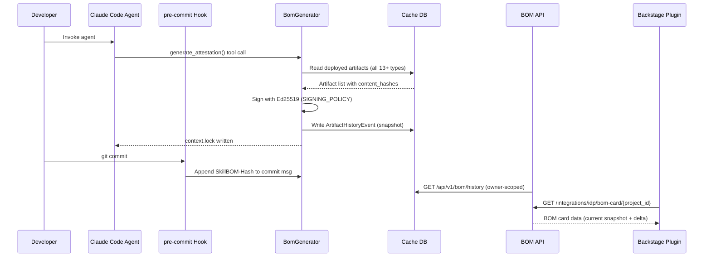

# PRD: SkillBOM & Attestation System

**Feature Name:** SkillBOM (Software Bill of Materials for Skills) & Attestation System
**Filepath Name:** `skillbom-attestation-v1`
**Date:** 2026-02-23
**Version:** 2.0
**Status:** Draft
**Priority:** HIGH (Strategic Enterprise Differentiator)

**Related Epic(s)/PRD ID(s):**
- `versioning-merge-system-v1.5-state-tracking`
- `004-artifact-version-tracking`

**Related Documents:**
- `/docs/dev/architecture/decisions/004-artifact-version-tracking.md`
- `/docs/ops/security/SIGNING_POLICY.md`
- `/skillmeat/core/deployment.py`
- `/skillmeat/api/routers/idp_integration.py`
- `/plugins/backstage-plugin-scaffolder-backend/`

---

## 1. Executive Summary

The SkillBOM & Attestation System transforms SkillMeat from an artifact management utility into a comprehensive AI supply chain security platform. It introduces a cryptographic "Bill of Materials" (BOM) for AI context, capturing the exact state, content hashes, and configuration of every artifact type active in a project — skills, commands, agents, MCPs, hooks, workflows, composites, project configs, spec files, rule files, context files, progress templates, memory items, deployment sets, and deployment profiles.

The system records a full lifecycle event log per artifact (create, update, delete, deployment state change, collection sync), enabling time-ordered querying and historical replay. Attestation metadata is owner-scoped (user, team, enterprise) via the existing AAA/RBAC system, enabling individual provenance tracking, team-level audit trails, and enterprise policy enforcement. Attestations are surfaced across multiple interfaces: CLI commands, REST API with owner-scoped filtering, web app provenance tabs, and Backstage IDP plugin cards via the existing `idp_integration` router.

**Key Outcomes:**
- Any artifact state at any point in the project's history is queryable and restorable.
- Attestations cryptographically prove which AI artifacts were active when a commit was authored, with Ed25519 signatures linking to the developer or team that authorized the configuration.
- CI/CD pipelines can gate merges on required attestation fields or missing security-guardrail skills.
- Backstage plugin cards surface live provenance data from the SkillMeat API without a separate data store.

---

## 2. Context & Background

### Current State

SkillMeat already uses SHA-256 content hashing for drift detection (see `004-artifact-version-tracking.md`) and maintains deployment metadata in `.skillmeat-deployed.toml`. The `SIGNING_POLICY.md` defines a production-ready Ed25519 signing infrastructure. The IDP integration router (`skillmeat/api/routers/idp_integration.py`) provides scaffold and deployment registration endpoints consumed by the Backstage plugin in `/plugins/backstage-plugin-scaffolder-backend/`.

However, the BOM and attestation surface is missing: there is no point-in-time snapshot document, no full artifact lifecycle event log, no owner-scoped attestation metadata model, and no history-aware API endpoints.

### Problem Space

Agentic development introduces non-determinism into the SDLC. When an AI agent authors a commit, the output is a product of the code *and* the specific configuration of the agent at that exact moment — prompts, loaded tools, specific versions of skills, active context files.

1. **The "Time Travel" Problem:** A bug appears in AI-authored code months later. Debugging fails because the agent's `sql-helper` skill was silently updated, changing its behavior.
2. **The "Shadow IT" Problem:** Compliance teams cannot verify which tools or guardrails were active when sensitive logic was generated, nor who authorized that configuration.
3. **Prompt Injection / Tampering:** Malicious actors can silently alter an agent's system prompt in `.claude/` with no audit trail indicating the environment was compromised.
4. **Incomplete Artifact Coverage:** Existing tracking covers only skills and agents; memory items, deployment profiles, composite bundles, workflow definitions, and config/spec/rule files are invisible to the BOM.
5. **No History Continuity:** The current BOM concept describes a single snapshot with no event log, making trend analysis and lifecycle auditing impossible.
6. **No Owner Attribution:** Attestations carry no user/team/enterprise context, preventing role-aware compliance reporting and team-scoped audit trails.

### Architectural Context

SkillMeat uses a layered hexagonal architecture:
- **Routers** — HTTP surface, return DTOs, delegate to services
- **Services** — Business logic, return DTOs only
- **Repositories** — All DB I/O via `I*Repository` ABCs
- **Repository Factory** — Edition-based routing (local SQLite / enterprise PostgreSQL)

Auth context is provided per-request by `require_auth()` with `AuthContext` fields `{user_id: UUID, tenant_id: UUID|None, roles: List[str], scopes: List[str]}`. Owner-scoped queries use `OwnerType` (`user`, `team`) and `Visibility` (`private`, `team`, `public`) from `skillmeat/cache/auth_types.py`.

---

## 3. Problem Statement

As an enterprise developer or security engineer using SkillMeat, when I look at AI-authored code from three months ago, I cannot determine which exact artifact versions were active, who authorized that agent configuration, or whether any artifacts were tampered with — instead of having a cryptographically-verifiable, owner-attributed, time-queryable audit trail covering all 13+ artifact types.

**User Stories:**
> "As a security engineer, when I audit an AI-authored commit, I need to see which exact artifact versions were active at that moment, cryptographically signed by the authorizing developer, so that I can prove no unauthorized configuration changes occurred."

> "As a team admin, when a team member's AI agent generates a deployment, I need team-scoped attestation records so that the team's audit trail reflects our collective authorization — not just individual records."

> "As a Backstage user, when I view a component catalog entry, I want to see the live SkillBOM card showing the artifact provenance of the associated SkillMeat project, without leaving the IDP."

**Technical Root Cause:**
- No `SkillBOM` Pydantic schema or `context.lock` generation service exists.
- No `ArtifactHistoryEvent` model in `cache/models.py` — lifecycle events are not recorded.
- No owner-scope field in attestation structures — `AuthContext` is not propagated to BOM records.
- `idp_integration.py` router has no BOM or history endpoints — Backstage has no provenance surface.

---

## 4. Goals & Success Metrics

### Primary Goals

**Goal 1: Universal Artifact Coverage**
- All 13+ artifact types captured in BOM snapshots with content hashes and provenance.
- Measurable: BOM `generate` command returns non-empty `artifacts` array for projects containing any of the supported types.

**Goal 2: Full Lifecycle History**
- Every create, update, delete, deployment-state-change, and collection-sync event recorded as an immutable log entry per artifact.
- Measurable: `GET /api/v1/bom/history/{artifact_id}` returns ordered event list spanning the artifact's full lifetime.

**Goal 3: AAA/RBAC-Scoped Attestation Metadata**
- Attestation records carry `owner_type` (`user`/`team`/`enterprise`), `owner_id`, and associated role/scope at time of attestation.
- Measurable: `GET /api/v1/bom/attestations?owner_scope=team` returns only attestations associated with the authenticated user's teams.

**Goal 4: Multi-Surface Viewing**
- Attestation and history data surfaced via CLI, REST API, web app, and Backstage plugin without duplicating storage.
- Measurable: All four surfaces display consistent data from a single API source.

**Goal 5: Cryptographic Integrity**
- `context.lock` files optionally signed with Ed25519 using existing `SIGNING_POLICY.md` infrastructure.
- Measurable: `skillmeat bom verify` returns VALID for signed BOMs with trusted keys.

### Success Metrics

| Metric | Baseline | Target | Measurement Method |
|--------|----------|--------|-------------------|
| Artifact types covered in BOM | 2 (skill, agent) | 13+ | BOM schema validation test |
| History event capture latency | N/A | < 50ms per event | OpenTelemetry span on event write |
| BOM generation time (50 artifacts) | N/A | < 2s | CLI benchmark |
| API response for history query | N/A | < 200ms p95 | Load test |
| Backstage card load time | N/A | < 500ms | Backstage E2E test |

---

## 5. User Personas & Journeys

### Personas

**Primary Persona: Security Engineer (Enterprise)**
- Role: Compliance and audit lead
- Needs: Cryptographically-verifiable provenance for all AI-authored changes; team and org-level attestation reports; CI gate integration.
- Pain Points: Cannot currently produce a point-in-time inventory of AI tools active in a project; no audit trail linking commits to specific agent configurations.

**Secondary Persona: Team Admin**
- Role: Team lead managing a shared SkillMeat collection
- Needs: Team-scoped attestation visibility; ability to see which team members' agents used which artifacts; shared BOM history for the team's projects.
- Pain Points: Individual-only attestation records make team auditing impossible; no team-level rollup view.

**Tertiary Persona: Individual Developer**
- Role: Developer using Claude Code with deployed SkillMeat artifacts
- Needs: Automated BOM generation on commit; easy time-travel restore for debugging; personal attestation history.
- Pain Points: Manual tracking of which skill versions were used when; no restore mechanism when a skill update breaks behavior.

**Quaternary Persona: Platform Engineer (Backstage)**
- Role: IDP platform maintainer
- Needs: Live SkillBOM card in Backstage component catalog entries; no separate data store to maintain.
- Pain Points: Currently must manually maintain IDP catalog YAML to reflect AI context changes.

### High-level Flow



---

## 6. Requirements

### 6.1 Functional Requirements

| ID | Requirement | Priority | Notes |
| :-: | ----------- | :------: | ----- |
| FR-01 | BOM schema covers all 13+ artifact types: skill, command, agent, mcp/mcp_server, hook, workflow, composite, project_config, spec_file, rule_file, context_file, progress_template, memory_item, deployment_set, deployment_profile | Must | Pydantic schema in `skillmeat/api/schemas/bom.py` |
| FR-02 | `skillmeat bom generate` produces `.skillmeat/context.lock` with all deployed artifact types | Must | Uses `DeploymentTracker` + `content_hash` utilities |
| FR-03 | Artifact lifecycle events (create, update, delete, deploy, undeploy, sync) are recorded as immutable `ArtifactHistoryEvent` rows in the DB | Must | New table in `cache/models.py` |
| FR-04 | History events are queryable by `artifact_id`, `event_type`, `time_range`, `actor_id` | Must | `GET /api/v1/bom/history` with filter params |
| FR-05 | Attestation records carry `owner_type` (user/team/enterprise), `owner_id`, `roles`, `scopes` at time of attestation, sourced from `AuthContext` | Must | Sourced from `require_auth()` result |
| FR-06 | `GET /api/v1/bom/attestations` supports filtering by `owner_scope=user|team|enterprise` | Must | Returns only records visible to authenticated caller's scope |
| FR-07 | `skillmeat bom verify` validates Ed25519 signatures on `context.lock` files | Must | Uses existing `SIGNING_POLICY.md` infrastructure |
| FR-08 | `skillmeat bom restore --commit <git-hash>` rehydrates `.claude/` to the exact artifact state at that commit | Must | Reads BOM from target commit; fetches historical hashes |
| FR-09 | Git pre-commit hook appends `SkillBOM-Hash: sha256:<hash>` footer to commit messages | Must | `skillmeat bom install-hook` installs `.git/hooks/pre-commit` |
| FR-10 | `generate_attestation` Claude Code tool allows agents to snapshot their environment before issuing git commits | Must | Tool definition in skillmeat/core/bom/tool.py; registered as a Claude Code MCP tool via SkillMeat's MCP server |
| FR-11 | Enterprise attestations support required policy fields (required_artifacts, required_scopes, compliance_metadata) configurable per tenant | Should | Enterprise edition only; stored in DB |
| FR-12 | `GET /integrations/idp/bom-card/{project_id}` returns a Backstage-renderable BOM card payload (current snapshot + recent history delta) | Must | Extends existing `idp_integration` router |
| FR-13 | Web app artifact detail pages include a "Provenance" tab showing BOM snapshot and history timeline | Should | New tab in artifact detail view |
| FR-14 | Web app project pages include a "BOM History" timeline view | Should | New section in project dashboard |
| FR-15 | `skillmeat history <artifact-name>` CLI command shows time-ordered event log for an artifact | Must | New command group |
| FR-16 | `skillmeat attest create` CLI command creates a manual attestation for a project or artifact | Should | Manual attestation for offline workflows |
| FR-17 | BOM generation captures memory items (MemoryItem model, project-scoped) with content hash of item text | Must | Memory items are active AI context |
| FR-18 | CI/CD gatekeeping: `skillmeat bom check --require <artifact-name>` exits non-zero if named artifact missing from current BOM | Must | For GitHub Actions / CI pipeline integration |
| FR-19 | Time-travel restoration falls back to upstream GitHub fetch if local collection lacks a historical hash | Should | Prompts user before network fetch |
| FR-20 | All BOM API endpoints return cursor-paginated results (`{ items, pageInfo }`) | Must | Follows project pagination standard |

### 6.2 Non-Functional Requirements

**Performance:**
- BOM generation for a project with 50 artifacts completes in under 2 seconds.
- History event write latency under 50ms p95 (synchronous DB write on artifact mutation).
- BOM API history query (100 events) responds in under 200ms p95.

**Security:**
- Ed25519 signing uses existing `skillmeat/security/crypto.py` and `SIGNING_POLICY.md` key management.
- Attestation records with `owner_type=team` are readable only by team members and `system_admin`.
- Attestation records with `owner_type=enterprise` are readable only by `system_admin` and `team_admin` roles.
- Private attestation records follow existing `Visibility` model from `skillmeat/cache/auth_types.py`.

**Accessibility:**
- Web app provenance tab and BOM history timeline meet WCAG 2.1 AA compliance.
- History timeline provides keyboard navigation and screen-reader labels.

**Reliability:**
- History event recording must not block or fail a mutation if the BOM write fails — log the error and continue (fire-and-forget with error capture).
- `context.lock` generation is idempotent; running `bom generate` twice produces the same output given the same artifact state.

**Observability:**
- OpenTelemetry spans on all BOM generation, signing, verification, and history recording operations.
- Structured JSON logs with `trace_id`, `span_id`, `user_id`, `owner_type` on every BOM API call.
- Metrics: BOM generation count, signing success/failure rate, history event write rate, restore operation count.

---

## 7. Scope

### In Scope

- Universal BOM schema covering all 13+ artifact types (v2 schema).
- `ArtifactHistoryEvent` DB model and repository.
- Owner-scoped attestation metadata model with RBAC enforcement.
- `BomGenerator` service and `generate_attestation` tool.
- Git pre-commit hook installation and `SkillBOM-Hash` commit footer.
- `skillmeat bom` and `skillmeat history` CLI command groups.
- REST API: `/api/v1/bom/` namespace with history, attestation, snapshot, verify endpoints.
- Backstage IDP extension: `/integrations/idp/bom-card/{project_id}`.
- Web app provenance tab and BOM history timeline.
- Ed25519 signing via existing `SIGNING_POLICY.md` infrastructure.
- Time-travel restoration with local collection and upstream fallback.
- CI/CD gatekeeping via `skillmeat bom check`.
- Both local (SQLite, SQLAlchemy 1.x style) and enterprise (PostgreSQL, SQLAlchemy 2.x style) editions via `RepositoryFactory`.

### Out of Scope

- Centralized key revocation lists or OCSP-style certificate revocation (future).
- Web-of-trust transitivity for signing keys (future).
- Automatic BOM-based dependency resolution or upgrade suggestions.
- LLM-based attestation policy generation.
- Federated BOM sharing across organizations (future).
- Real-time streaming of history events via WebSockets.

---

## 8. Dependencies & Assumptions

### External Dependencies

- **Python `cryptography` library**: Ed25519 signing (already a dependency via `SIGNING_POLICY.md`).
- **Python `keyring` library**: Key storage (already used in signing infrastructure).
- **Backstage plugin framework**: `/plugins/backstage-plugin-scaffolder-backend/` (existing plugin, extension only).

### Internal Dependencies

- **`SIGNING_POLICY.md` infrastructure**: Ed25519 key generation, signing, and verification already implemented in `skillmeat/security/crypto.py`.
- **`DeploymentTracker`**: Existing deployment state tracking used for BOM snapshot generation.
- **`content_hash` utilities**: SHA-256 hashing already used in drift detection.
- **`idp_integration` router**: Existing scaffold and register-deployment endpoints; BOM card endpoint is additive.
- **`require_auth()` / `AuthContextDep`**: RBAC enforcement for all new BOM API endpoints.
- **`RepositoryFactory`**: Edition-based routing — new `IBomRepository` must have both local and enterprise implementations.
- **`cache/models.py`**: New `ArtifactHistoryEvent` and `BomSnapshot` tables.

### Assumptions

- The existing Ed25519 signing infrastructure in `skillmeat/security/crypto.py` is stable and does not require modification for BOM signing.
- Memory items (`MemoryItem` model) are already stored in the DB cache and retrievable via the existing memory repository.
- The Backstage plugin communicates with SkillMeat API using the Enterprise PAT (`verify_enterprise_pat`) bootstrap auth — consistent with the existing scaffold and register-deployment endpoints.
- Deployment sets and deployment profiles are already modeled in the DB cache (confirmed by migration `20260224_1000_add_deployment_set_tables.py`).
- Composite artifact membership is already modeled (confirmed by migration `20260218_1100_add_composite_artifact_tables.py`).

### Feature Flags

- `skillbom_enabled`: Master switch for SkillBOM feature (default: `false` in v1, `true` after Phase 7 stabilization).
- `skillbom_auto_sign`: Auto-sign BOMs with local key if available (default: `false`).
- `skillbom_history_capture`: Enable automatic history event recording on artifact mutations (default: `false` until Phase 3 stabilizes).

---

## 9. Risks & Mitigations

| Risk | Impact | Likelihood | Mitigation |
| ----- | :----: | :--------: | ---------- |
| History event write slows mutation endpoints | High | Medium | Fire-and-forget write with async background task; log failures without blocking response |
| `context.lock` grows large in active repos | Medium | High | Track only *active* deployed artifacts, not full collection; add configurable artifact limit |
| Historical hash unavailable on restore | High | Medium | Prompt user before upstream fetch; provide `--skip-missing` flag for partial restores |
| SQLAlchemy 1.x vs 2.x divergence for new BOM tables | High | High | Follow existing pattern: local uses `session.query()` style; enterprise uses `select()` style; test both in `IBomRepository` |
| Enterprise UUID vs local int PK mismatch for BOM records | High | Medium | Use `String` PKs (UUID-like) for `ArtifactHistoryEvent` to be edition-agnostic; see existing `cache/enterprise_repositories.py` |
| Backstage card endpoint becomes a hot path | Medium | Medium | Add response cache (30s TTL) on `GET /integrations/idp/bom-card/`; use existing stale-time standards |
| Pre-commit hook slows git commits | Medium | Low | BOM generation is fast (< 2s target); make hook opt-in via `skillmeat bom install-hook` |
| Team attestation scope leaks private records | High | Low | Enforce `apply_visibility_filter_stmt` on all BOM queries in enterprise edition; unit-test RBAC boundaries |

---

## 10. Target State (Post-Implementation)

**User Experience:**

- A developer runs `skillmeat bom generate` or lets the pre-commit hook run automatically; `.skillmeat/context.lock` is written with all active artifact types hashed and optionally signed.
- A security engineer runs `skillmeat bom verify --commit abc123` and receives a VALID/INVALID verdict with the signing key fingerprint and signer identity.
- A team admin opens the Backstage catalog entry for their component and sees the live SkillBOM card showing current artifact inventory, recent history events, and the last attestation signature.
- A developer debugging an old AI-authored feature runs `skillmeat bom restore --commit abc123` and Claude Code's `.claude/` directory is rehydrated to exactly the skill/agent/hook versions active at that commit.

**Technical Architecture:**

- `skillmeat/core/bom/generator.py` — `BomGenerator` reads from `DeploymentTracker` and all 13+ artifact repositories, produces `SkillBOM` Pydantic model, optionally signs with Ed25519.
- `skillmeat/core/bom/history.py` — `HistoryRecorder` writes `ArtifactHistoryEvent` rows on artifact mutations; called from all mutation paths in existing repositories.
- `skillmeat/cache/models.py` — New tables: `artifact_history_events`, `bom_snapshots`, `bom_attestations`.
- `skillmeat/api/routers/bom.py` — New router with BOM API endpoints under `/api/v1/bom/`.
- `skillmeat/api/routers/idp_integration.py` — Extended with `GET /integrations/idp/bom-card/{project_id}`.
- `plugins/backstage-plugin-scaffolder-backend/` — New BOM card component consuming `idp/bom-card` endpoint.
- `skillmeat/web/` — New "Provenance" tab on artifact detail pages; "BOM History" section on project pages.

**Observable Outcomes:**

- Zero-friction cryptographic provenance for every AI commit.
- `skillmeat bom check --require security-guardrail` integrates into CI as a required step.
- Backstage IDP reflects real-time artifact inventory without manual catalog maintenance.

---

## 11. Functional Specifications (Expanded)

### 11.1 Universal Artifact Coverage

The BOM schema must include all 13+ artifact types supported by SkillMeat:

| Category | Types | Notes |
|----------|-------|-------|
| Core agent context | `skill`, `command`, `agent` | Primary AI context artifacts |
| Integration | `mcp`, `mcp_server` | Model Context Protocol servers |
| Automation | `hook`, `workflow` | Pre/post hooks, workflow definitions |
| Bundled | `composite` | Multi-artifact packages with member list |
| Configuration | `project_config`, `spec_file`, `rule_file`, `context_file`, `progress_template` | `.claude/` configuration artifacts |
| Intelligence | `memory_item` | Project-scoped MemoryItem DB records |
| Deployment | `deployment_set`, `deployment_profile` | Deployment configuration entities |

Memory items are captured as:
```json
{
  "type": "memory_item",
  "name": "<memory_item_id>",
  "content_hash": "sha256:<hash_of_content_field>",
  "provenance": "local",
  "memory_type": "decision|constraint|gotcha|style_rule|learning",
  "confidence": 0.85,
  "status": "candidate|confirmed"
}
```

Composite artifacts include their membership list:
```json
{
  "type": "composite",
  "name": "my-bundle",
  "content_hash": "sha256:<manifest_hash>",
  "members": [
    {"type": "skill", "name": "frontend-design"},
    {"type": "agent", "name": "ui-engineer"}
  ]
}
```

### 11.2 Full Artifact History Model

Each artifact mutation produces an `ArtifactHistoryEvent` record:

| Field | Type | Description |
|-------|------|-------------|
| `id` | String (UUID) | Immutable event ID |
| `artifact_id` | String | Artifact identifier (`type:name`) |
| `artifact_uuid` | String | UUID from ADR-007 |
| `artifact_type` | String | One of 13+ types |
| `event_type` | Enum | `created`, `updated`, `deleted`, `deployed`, `undeployed`, `synced`, `snapshot` |
| `content_hash_before` | String\|null | SHA-256 before mutation (null for `created`) |
| `content_hash_after` | String\|null | SHA-256 after mutation (null for `deleted`) |
| `actor_id` | String | `user_id` from `AuthContext` |
| `owner_type` | Enum | `user`, `team`, `enterprise` |
| `owner_id` | String | User UUID or team ID |
| `tenant_id` | String\|null | Enterprise tenant ID |
| `project_id` | String | Project the event occurred in |
| `metadata` | JSON | Event-specific payload (e.g., deployment target, upstream URL) |
| `occurred_at` | DateTime | Timestamp of event (UTC) |

Events are **append-only** — never mutated or deleted. The event table has no soft-delete.

History is queryable via:
```
GET /api/v1/bom/history
  ?artifact_id=skill:frontend-design
  &event_type=updated
  &since=2026-01-01T00:00:00Z
  &until=2026-03-01T00:00:00Z
  &actor_id=<user_uuid>
  &project_id=<project_id>
  &cursor=<opaque_cursor>
  &limit=50
```

Response:
```json
{
  "items": [ /* ArtifactHistoryEvent objects */ ],
  "pageInfo": { "hasNextPage": true, "endCursor": "..." }
}
```

### 11.3 AAA/RBAC-Scoped Attestation Metadata

Every BOM snapshot record carries owner attribution sourced from the `AuthContext` at generation time:

```json
{
  "owner": {
    "owner_type": "user | team | enterprise",
    "owner_id": "<uuid>",
    "roles": ["team_member"],
    "scopes": ["artifact:read", "deployment:write"],
    "tenant_id": "<uuid> | null"
  }
}
```

**Owner type semantics:**

| Owner Type | Visibility | Who Can Read |
|-----------|-----------|-------------|
| `user` | `private` | Owner + `system_admin` |
| `team` | `team` | Team members + `system_admin` |
| `enterprise` | `public` within tenant | All tenant users + `system_admin` |

> **Migration note:** The existing `OwnerType` enum in `skillmeat/cache/auth_types.py` currently has only `user` and `team`. Adding `enterprise` requires an Alembic migration to extend the enum (Phase 1, TASK-1.5).

**Enterprise attestation policy fields** (enterprise edition only):
```json
{
  "enterprise_policy": {
    "required_artifacts": ["skill:security-guardrail", "hook:pre-commit-scan"],
    "required_scopes": ["deployment:write"],
    "compliance_tags": ["SOC2", "ISO27001"],
    "policy_version": "1.0"
  }
}
```

If `enterprise_policy.required_artifacts` is set for a tenant, `skillmeat bom generate` warns (non-blocking) if any required artifact is absent. `skillmeat bom check` fails with exit code 1.

### 11.4 Multi-Surface Viewing Architecture

All four surfaces read from the same SkillMeat API — no data duplication.

**Surface 1: CLI**
```bash
skillmeat bom generate                          # Generate context.lock
skillmeat bom generate --sign                   # Generate + Ed25519 sign
skillmeat bom install-hook                      # Install pre-commit hook
skillmeat bom verify [--commit <sha>]           # Verify signature
skillmeat bom restore --commit <git-hash>       # Time-travel restore
skillmeat bom check --require <artifact-name>   # CI gate
skillmeat bom show [--format json|table]        # Display current BOM

skillmeat history <artifact-name>               # Show artifact event log
skillmeat history --project <project-id>        # All events for project
skillmeat history --since 2026-01-01            # Time-filtered

skillmeat attest create [--scope team]          # Manual attestation
skillmeat attest list [--scope user|team|enterprise]
skillmeat attest verify <attestation-id>
```

**Surface 2: REST API**

New router at `/api/v1/bom/` using `AuthContextDep` for all endpoints:

| Method | Path | Description |
|--------|------|-------------|
| `POST` | `/api/v1/bom/snapshots` | Generate and store a BOM snapshot |
| `GET` | `/api/v1/bom/snapshots/{snapshot_id}` | Get specific snapshot |
| `GET` | `/api/v1/bom/snapshots` | List snapshots (owner-scoped, paginated) |
| `GET` | `/api/v1/bom/history` | Query artifact history events (filtered, paginated) |
| `GET` | `/api/v1/bom/history/{artifact_id}` | Full history for one artifact |
| `POST` | `/api/v1/bom/attestations` | Create attestation record |
| `GET` | `/api/v1/bom/attestations` | List attestations (`?owner_scope=user|team|enterprise`) |
| `GET` | `/api/v1/bom/attestations/{id}` | Get specific attestation |
| `POST` | `/api/v1/bom/verify` | Verify signature on uploaded `context.lock` |

**Surface 3: Backstage IDP**

Extends existing `idp_integration` router (`/integrations/idp/`):

| Method | Path | Description |
|--------|------|-------------|
| `GET` | `/integrations/idp/bom-card/{project_id}` | BOM card payload for Backstage |
| `GET` | `/integrations/idp/bom-history/{project_id}` | Recent history for Backstage timeline |

`bom-card` response schema (Backstage-renderable):
```json
{
  "project_id": "...",
  "generated_at": "2026-03-10T00:00:00Z",
  "artifact_count": 12,
  "artifact_type_summary": { "skill": 5, "agent": 3, "hook": 2, "memory_item": 2 },
  "last_bom_hash": "sha256:...",
  "last_signed_at": "2026-03-09T00:00:00Z",
  "last_signer": "Jane Doe",
  "recent_events": [ /* last 5 history events */ ],
  "missing_required_artifacts": []
}
```

Authentication: Enterprise PAT (`verify_enterprise_pat`) — consistent with existing scaffold/register-deployment endpoints.

**Surface 4: Web App**

- **Artifact detail page**: New "Provenance" tab showing current BOM entry for the artifact, content hash history chart, and event timeline.
- **Project page**: New "BOM History" section with timeline chart and export-to-JSON button for the full `context.lock`.
- **Collection page**: Aggregate BOM coverage indicator (how many artifacts have full history).

All web surfaces consume `/api/v1/bom/` endpoints via the existing frontend API client with standard stale times (30s for interactive, 5min for browsing).

---

## 12. Proposed Data Structure

### BOM Snapshot (`context.lock`) — v2 Schema

```json
{
  "bom_version": "2.0",
  "schema_version": 2,
  "timestamp": "2026-03-10T14:30:00Z",
  "commit_sha": "7f8a9b1c2d3e4f5a6b7c8d9e0f1a2b3c4d5e6f7a",
  "project_id": "my-project",
  "signature": {
    "algorithm": "Ed25519",
    "value": "base64:...",
    "signer_name": "Jane Doe",
    "signer_email": "jane@example.com",
    "key_fingerprint": "sha256:a1b2c3...",
    "signed_at": "2026-03-10T14:30:01Z"
  },
  "owner": {
    "owner_type": "team",
    "owner_id": "<team_uuid>",
    "roles": ["team_member"],
    "scopes": ["artifact:read", "artifact:write", "deployment:write"],
    "tenant_id": "<tenant_uuid>"
  },
  "enterprise_policy": {
    "required_artifacts": ["skill:security-guardrail"],
    "required_scopes": ["deployment:write"],
    "compliance_tags": ["SOC2"],
    "policy_version": "1.0"
  },
  "environment": {
    "claude_model": "claude-sonnet-4-6",
    "skillmeat_version": "0.9.0",
    "edition": "enterprise",
    "mcp_server_versions": {
      "filesystem": "1.2.0"
    }
  },
  "artifacts": [
    {
      "type": "skill",
      "name": "python-expert",
      "content_hash": "sha256:e3b0c44298fc1c149afbf4c8996fb92427ae41e4649b934ca495991b7852b855",
      "provenance": "github.com/anthropics/skills",
      "version_tag": "v2.1.0",
      "local_modifications": false,
      "deployed_at": "2026-03-01T10:00:00Z"
    },
    {
      "type": "agent",
      "name": "security-reviewer",
      "content_hash": "sha256:88d4266fd4e6338d13b845fcf289579d209c897823b9217da3e161936f031589",
      "provenance": "local",
      "local_modifications": true,
      "deployed_at": "2026-02-20T09:00:00Z"
    },
    {
      "type": "composite",
      "name": "fullstack-bundle",
      "content_hash": "sha256:aaaa1234...",
      "provenance": "github.com/myorg/bundles",
      "members": [
        { "type": "skill", "name": "frontend-design" },
        { "type": "agent", "name": "ui-engineer" }
      ]
    },
    {
      "type": "memory_item",
      "name": "mem_abc123",
      "content_hash": "sha256:bbbb5678...",
      "provenance": "local",
      "memory_type": "decision",
      "confidence": 0.85,
      "status": "confirmed"
    },
    {
      "type": "deployment_set",
      "name": "production-deploy",
      "content_hash": "sha256:cccc9012...",
      "provenance": "local",
      "target_platforms": ["claude-desktop", "cursor"]
    }
  ]
}
```

### `ArtifactHistoryEvent` DB Model

```python
class ArtifactHistoryEvent(Base):
    __tablename__ = "artifact_history_events"

    id = Column(String, primary_key=True)  # UUID string; edition-agnostic
    artifact_id = Column(String, nullable=False, index=True)
    artifact_uuid = Column(String, nullable=True)
    artifact_type = Column(String, nullable=False)
    event_type = Column(String, nullable=False)  # Enum stored as string
    content_hash_before = Column(String, nullable=True)
    content_hash_after = Column(String, nullable=True)
    actor_id = Column(String, nullable=False)
    owner_type = Column(String, nullable=False)
    owner_id = Column(String, nullable=False)
    tenant_id = Column(String, nullable=True)
    project_id = Column(String, nullable=False)
    metadata = Column(Text, nullable=True)  # JSON serialized; sa.Text() for SQLite/PostgreSQL portability
    occurred_at = Column(DateTime, nullable=False, default=datetime.utcnow)
```

---

## 13. Implementation Phases

### Phase 1: Universal attestation schema + history model (Week 1–2)

- Define Pydantic v2 schema `SkillBOM` (schema_version 2) in `skillmeat/api/schemas/bom.py` covering all 13+ artifact types with discriminated union on `type`.
- Add `ArtifactHistoryEvent`, `BomSnapshot`, and `BomAttestation` SQLAlchemy models to `cache/models.py`.
- Write Alembic migration for new tables; ensure it runs in both local (SQLite) and enterprise (PostgreSQL) editions.
- Define `IBomRepository` ABC with methods: `record_event`, `get_history`, `save_snapshot`, `get_snapshot`, `list_attestations`.
- Implement `LocalBomRepository` (SQLAlchemy 1.x style, int-like PKs) and `EnterpriseIBomRepository` (SQLAlchemy 2.x `select()` style, UUID PKs).
- Register both in `RepositoryFactory` with edition routing.
- Unit tests for schema serialization/deserialization for all 13+ artifact types.

### Phase 2: BOM generation (Week 2–3)

- Implement `BomGenerator` service in `skillmeat/core/bom/generator.py`.
  - Reads from `DeploymentTracker`, all artifact repositories, memory repository, deployment set repository.
  - Produces `SkillBOM` Pydantic model with all active artifacts hashed.
  - Writes `context.lock` to project root (`.skillmeat/context.lock`).
- Add `generate_attestation` Claude Code tool definition in `skillmeat/core/bom/tool.py`.
- Add `skillmeat bom generate` and `skillmeat bom show` CLI commands.
- Feature flag: `skillbom_enabled`.

### Phase 3: History capture and querying (Week 3–4)

- Implement `HistoryRecorder` in `skillmeat/core/bom/history.py`.
  - Wraps artifact mutation calls in existing repositories to append `ArtifactHistoryEvent` rows.
  - Uses fire-and-forget pattern: errors are logged but do not block the primary mutation response.
- Instrument all artifact mutation paths in local and enterprise repositories.
- Implement `GET /api/v1/bom/history` and `GET /api/v1/bom/history/{artifact_id}` endpoints.
- Feature flag: `skillbom_history_capture`.
- Integration tests covering all event types across both editions.

### Phase 4: AAA/RBAC scoped metadata (Week 4–5)

- Extend `BomGenerator` to capture `owner` block from `AuthContext` at generation time.
- Extend `IBomRepository.save_snapshot` and `record_event` to accept and persist `owner_type`, `owner_id`, `tenant_id`.
- Implement `apply_visibility_filter_stmt` on `IBomRepository` read paths for enterprise edition (mirrors existing pattern in `enterprise_repositories.py`).
- Implement enterprise policy fields: `required_artifacts`, `required_scopes`, `compliance_tags` configurable per tenant.
- Add `GET /api/v1/bom/attestations?owner_scope=user|team|enterprise` with RBAC enforcement.
- Unit tests for RBAC boundaries: team member cannot read `private` user attestations; `system_admin` can read all.

### Phase 5: Git integration (Week 5)

- Implement `.git/hooks/pre-commit` installation logic in `skillmeat/core/bom/hooks.py`.
- `skillmeat bom install-hook` installs the hook; `skillmeat bom uninstall-hook` removes it.
- Hook generates BOM if dirty `.claude/` changes detected; appends `SkillBOM-Hash: sha256:<hash>` footer to commit message.
- Feature flag: hook is opt-in.

### Phase 6: Cryptographic signing (Week 5–6)

- Integrate `skillmeat/security/crypto.py` Ed25519 signing into `BomGenerator` (auto-sign if `skillbom_auto_sign` is true and a signing key is available).
- Implement `skillmeat bom verify` CLI command and `POST /api/v1/bom/verify` endpoint.
- Signature metadata stored in `BomSnapshot.signature` column (JSON).
- CI integration documentation: GitHub Actions snippet for `skillmeat bom verify`.

### Phase 7: API layer with owner-scoped filtering (Week 6–7)

- Implement full `bom` router (`skillmeat/api/routers/bom.py`) with all endpoints defined in section 11.4 Surface 2.
- All endpoints protected by `AuthContextDep` with appropriate scope requirements.
- Cursor pagination (`{ items, pageInfo }`) on all list endpoints.
- 30s response cache on `GET /api/v1/bom/snapshots` (browsing stale time).
- OpenTelemetry spans on all operations.
- OpenAPI schema updated.

### Phase 8: CLI commands (Week 7)

- Full `skillmeat bom` command group: `generate`, `show`, `verify`, `restore`, `check`, `install-hook`, `uninstall-hook`.
- `skillmeat history` command group: list by artifact name, project, time range, event type.
- `skillmeat attest` command group: `create`, `list`, `verify`.
- Rich-formatted table output (follows existing CLI patterns — ASCII-compatible, no Unicode box-drawing).

### Phase 9: Web app integration (Week 7–8)

- New "Provenance" tab on artifact detail pages:
  - Current BOM snapshot entry for the artifact.
  - Content hash history chart (sparkline).
  - Event timeline with event type icons and actor attribution.
- New "BOM History" section on project pages:
  - Full timeline of artifact events across the project.
  - Export `context.lock` JSON button.
  - Coverage indicator (% of artifacts with full history).
- All components follow existing shadcn + Radix UI component patterns.
- 30s stale time for provenance tab queries; 5min for project BOM history.

### Phase 10: Backstage plugin integration (Week 8–9)

- Implement `GET /integrations/idp/bom-card/{project_id}` and `GET /integrations/idp/bom-history/{project_id}` endpoints in `idp_integration.py`.
  - Auth: Enterprise PAT (`verify_enterprise_pat`) — matches existing scaffold/register-deployment pattern.
  - Response cache: 30s TTL to avoid becoming a hot path.
- Implement Backstage UI card component in `/plugins/backstage-plugin-scaffolder-backend/` consuming the new endpoints.
- Card displays: artifact count by type, last BOM hash, last signer identity, recent events, missing required artifacts.
- Documentation: Backstage template YAML snippet for referencing SkillBOM card.

---

## 14. Epics & User Stories Backlog

| Story ID | Short Name | Description | Acceptance Criteria | Estimate |
|----------|-----------|-------------|-------------------|----------|
| SBOM-001 | Universal BOM schema | Pydantic schema covering 13+ artifact types | All types serialize/deserialize; discriminated union works | 3 pts |
| SBOM-002 | DB models for history | `ArtifactHistoryEvent`, `BomSnapshot`, `BomAttestation` tables | Migration runs on SQLite and PostgreSQL; no data loss | 3 pts |
| SBOM-003 | `IBomRepository` ABCs | Interface + local + enterprise implementations | Both editions pass same unit test suite | 5 pts |
| SBOM-004 | `BomGenerator` service | Produces `context.lock` from all active artifact repositories | Snapshot includes all 13+ types for a test project | 5 pts |
| SBOM-005 | `HistoryRecorder` | Appends events on artifact mutations | All mutation paths instrumented; fire-and-forget on error | 5 pts |
| SBOM-006 | History query endpoints | `GET /api/v1/bom/history` with filters and cursor pagination | Filters by type, time range, actor; paginated | 3 pts |
| SBOM-007 | Owner-scoped metadata | `owner` block in snapshots from `AuthContext` | RBAC tests: team records invisible to non-members | 5 pts |
| SBOM-008 | Enterprise policy fields | Required artifacts config per tenant | `bom check` exits 1 if missing required artifact | 3 pts |
| SBOM-009 | Git pre-commit hook | Install/uninstall hook; appends `SkillBOM-Hash` footer | Hook generates BOM and appends hash on commit | 3 pts |
| SBOM-010 | Ed25519 signing | `bom generate --sign`; `bom verify` | VALID result for signed BOM; INVALID if tampered | 5 pts |
| SBOM-011 | BOM API router | All endpoints in section 11.4 Surface 2 | Endpoints return correct DTOs; 401 without auth | 5 pts |
| SBOM-012 | Time-travel restore | `skillmeat bom restore --commit <hash>` | `.claude/` rehydrated to historical state | 5 pts |
| SBOM-013 | CLI command groups | `bom`, `history`, `attest` groups | All commands documented; Rich table output | 5 pts |
| SBOM-014 | Web provenance tab | Artifact detail "Provenance" tab | Timeline renders; stale time 30s | 5 pts |
| SBOM-015 | Web BOM history | Project page "BOM History" section | Timeline + export JSON button | 3 pts |
| SBOM-016 | Backstage IDP endpoints | `bom-card` and `bom-history` IDP endpoints | Returns Backstage-renderable payload | 3 pts |
| SBOM-017 | Backstage UI card | BOM card component in plugin | Card displays artifact summary, signer, events | 5 pts |
| SBOM-018 | CI gate | `skillmeat bom check --require <artifact>` | Exit 0 if present, exit 1 if missing; GitHub Actions doc | 2 pts |
| SBOM-019 | `generate_attestation` tool | Claude Code tool definition | Agent can call tool to snapshot environment | 2 pts |
| SBOM-020 | Observability | OpenTelemetry spans + structured logs on all BOM operations | Spans visible in test; logs include `owner_type` | 3 pts |

**Total estimate:** ~78 story points across 10 phases.

---

## 15. Overall Acceptance Criteria (Definition of Done)

### Functional Acceptance

- [ ] All 13+ artifact types appear in BOM snapshot output from a test project.
- [ ] `ArtifactHistoryEvent` rows are created for create, update, delete, deploy, and sync events.
- [ ] Owner-scoped filtering enforced: team records not visible to non-members.
- [ ] Ed25519 signing and verification work end-to-end with a local test key.
- [ ] `skillmeat bom restore --commit <hash>` rehydrates `.claude/` to the correct historical state.
- [ ] Backstage BOM card renders with live data from the API.
- [ ] `skillmeat bom check --require <artifact>` exits 1 when artifact is absent.

### Technical Acceptance

- [ ] `IBomRepository` has both local (SQLAlchemy 1.x) and enterprise (SQLAlchemy 2.x) implementations.
- [ ] New DB tables have Alembic migrations tested on both SQLite and PostgreSQL.
- [ ] All BOM API endpoints use `AuthContextDep` (not legacy `TokenDep`).
- [ ] All list endpoints return cursor-paginated `{ items, pageInfo }` responses.
- [ ] `HistoryRecorder` uses fire-and-forget — mutations do not fail if history write fails.
- [ ] Feature flags (`skillbom_enabled`, `skillbom_history_capture`, `skillbom_auto_sign`) control all new behavior.
- [ ] OpenTelemetry spans on all BOM operations.
- [ ] Structured logs include `trace_id`, `span_id`, `user_id`, `owner_type`.

### Quality Acceptance

- [ ] Unit test coverage > 80% for `BomGenerator`, `HistoryRecorder`, and `IBomRepository` implementations.
- [ ] Integration tests for all BOM API endpoints (auth, RBAC, pagination, filtering).
- [ ] RBAC boundary tests: user cannot read team attestations; `system_admin` can read all.
- [ ] Enterprise edition RBAC tests use `@pytest.mark.integration` (PostgreSQL-required tests) per existing pattern.
- [ ] Web app provenance tab passes WCAG 2.1 AA audit.
- [ ] Backstage card E2E test validates data matches API response.
- [ ] `skillmeat bom generate` benchmarks < 2s for 50-artifact project.

### Documentation Acceptance

- [ ] CLI command help text for all `bom`, `history`, and `attest` commands.
- [ ] API documentation (auto-generated OpenAPI) for all `/api/v1/bom/` endpoints.
- [ ] GitHub Actions snippet for CI gate integration.
- [ ] Backstage template YAML snippet for BOM card reference.
- [ ] ADR created for `ArtifactHistoryEvent` append-only immutability decision.

---

## 16. Assumptions & Open Questions

### Assumptions

- Memory items are retrievable via an existing memory repository interface and are project-scoped.
- Deployment sets and deployment profiles are fully modeled in the DB cache (confirmed by archived migrations).
- The Backstage plugin communicates via Enterprise PAT auth — no new auth mechanism needed.
- `HistoryRecorder` instrumentation can be added to existing repository mutation paths without architectural refactoring.
- `context.lock` is committed to version control as a tracked file — its size must stay manageable (active artifacts only, not full collection).

### Open Questions

- [ ] **Q1**: Should `ArtifactHistoryEvent` records be replicated across tenants in enterprise multi-tenant mode, or strictly isolated per `tenant_id`?
  - **A**: TBD — default to strict isolation per `tenant_id` until cross-tenant auditing requirements are confirmed.
- [ ] **Q2**: Should the web app BOM history timeline be a new page or embedded in the existing project dashboard?
  - **A**: Embedded as a collapsible section in the project dashboard (reduces nav depth).
- [ ] **Q3**: For `skillmeat bom restore --commit <hash>`, if the target commit predates SkillBOM adoption, should it warn or fail?
  - **A**: Warn with actionable message: "No BOM found at this commit. SkillBOM was not active at that time."
- [ ] **Q4**: Should the Backstage BOM card be opt-in (explicit catalog YAML annotation) or auto-discovered by project ID?
  - **A**: Opt-in via `metadata.annotations.skillmeat/project-id` in catalog entity YAML — follows Backstage convention.
- [ ] **Q5**: How large will `context.lock` grow in high-frequency repos with many memory items?
  - **A**: Cap memory items at 50 most recently active (by confidence + recency), configurable via `skillbom_memory_limit` setting.

---

## 17. Appendices & References

### Related Documentation

- **ADRs**: `/docs/dev/architecture/decisions/004-artifact-version-tracking.md`
- **Signing Policy**: `/docs/ops/security/SIGNING_POLICY.md`
- **Auth Architecture**: `.claude/context/key-context/auth-architecture.md`
- **Repository Architecture**: `.claude/context/key-context/repository-architecture.md`
- **Data Flow Patterns**: `.claude/context/key-context/data-flow-patterns.md`
- **IDP Integration Router**: `skillmeat/api/routers/idp_integration.py`
- **Backstage Plugin**: `plugins/backstage-plugin-scaffolder-backend/`
- **Enterprise Repositories**: `skillmeat/cache/enterprise_repositories.py`

### Prior Art

- `package-lock.json` / `yarn.lock` — Deterministic dependency locking pattern adapted for AI context.
- SLSA (Supply chain Levels for Software Artifacts) — Provenance attestation model for software supply chains.
- SBOM standards: CycloneDX, SPDX — Inspiration for artifact inventory schema design.
- Sigstore / cosign — Reference for ephemeral signing and verification without long-lived keys.

---

**Progress Tracking:**
- Phase 1-2: `.claude/progress/skillbom-attestation/phase-1-2-progress.md`
- Phase 3-4: `.claude/progress/skillbom-attestation/phase-3-4-progress.md`
- Phase 5-6: `.claude/progress/skillbom-attestation/phase-5-6-progress.md`
- Phase 7-8: `.claude/progress/skillbom-attestation/phase-7-8-progress.md`
- Phase 9-10: `.claude/progress/skillbom-attestation/phase-9-10-progress.md`
- Phase 11: `.claude/progress/skillbom-attestation/phase-11-progress.md`
