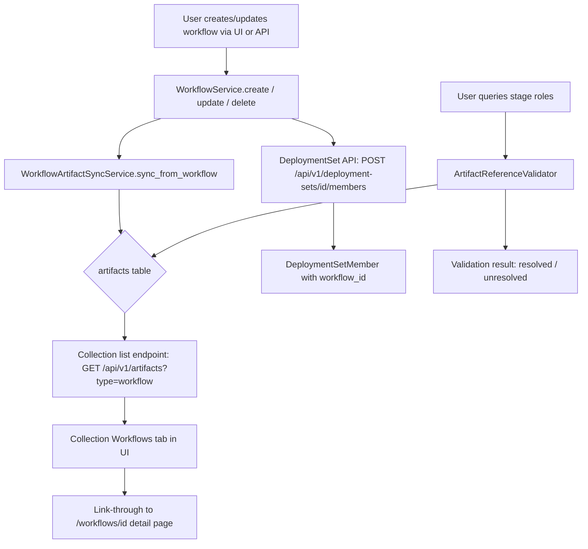

# Feature Brief & Metadata

**Feature Name:**

> Workflow-Artifact Collection Wiring

**Filepath Name:**

> `workflow-artifact-wiring-v1`

**Date:**

> 2026-03-10

**Author:**

> Claude (Sonnet 4.6) — prd-writer agent

**Related Epic(s)/PRD ID(s):**

> Workflow Orchestration v1, Deployment Sets v1, Composite Artifact Infrastructure v1

**Related Documents:**

> - `docs/project_plans/PRDs/features/workflow-orchestration-v1.md`
> - `docs/project_plans/PRDs/features/deployment-sets-v1.md`
> - `docs/project_plans/PRDs/features/composite-artifact-infrastructure-v1.md`
> - `docs/project_plans/PRDs/features/memory-context-system-v1.md`
> - `docs/project_plans/PRDs/integrations/backstage-integration-demo.md`
> - `docs/dev/architecture/decisions/ADR-007-artifact-uuid-identity.md`
> - `docs/project_plans/architecture/ADRs/adr-008-artifact-tiering-composition-hierarchy.md`
> - `docs/project_plans/implementation_plans/features/workflow-orchestration-v1.md`

---

## 1. Executive Summary

The Workflow Orchestration Engine and the Artifact Collection system exist as fully functional but entirely isolated systems. Workflow definitions live in the `workflows` DB table but have no presence in the `artifacts` table, making them invisible to unified discovery, search, deployment sets, and the collection UI. This PRD wires the two systems together so that workflow definitions become first-class Tier 3 artifacts — discoverable, deployable, syncable, and searchable through the same mechanisms as skills, agents, and composites.

**Priority:** HIGH

**Key Outcomes:**
- Outcome 1: Workflow definitions appear in artifact listings alongside all other artifact types, searchable and filterable via existing collection endpoints.
- Outcome 2: Deployment sets can include workflow references, enabling workflow-aware deployment targeting.
- Outcome 3: Collection and Manage UI pages surface workflow artifacts with link-through to the workflow detail view, eliminating the empty Workflows tab.

---

## 2. Context & Background

### Current State

Two fully built systems exist in parallel without integration:

**Workflow Engine** — complete, self-contained:
- DB tables: `workflows`, `workflow_stages`, `workflow_executions`, `execution_steps`
- Service: `WorkflowService` (`skillmeat/core/workflow/service.py`) handles CRUD, validation, and planning
- API: `/api/v1/workflows` (CRUD) and `/api/v1/workflow-executions` (lifecycle)
- Frontend: `/workflows` page with list, detail, edit, and execution views
- Storage: `definition_yaml` text column plus parsed fields in DB
- Artifact refs: String format `"agent:researcher-v1"` in `roles_json` — not foreign keys

**Artifact Collection** — complete, with workflow stubs already in place:
- DB table: `artifacts` with `CHECK` constraint already allowing `type='workflow'`
- Detection: `ArtifactType.WORKFLOW` exists in `core/artifact_detection.py` with container names `{"workflows", "workflow"}` and manifest file `WORKFLOW.yaml`
- Sync: `core/sync.py` handles workflow artifacts at `workflows/{name}.yaml` path
- Frontend: Collection and Manage pages already have a Workflows tab — currently empty
- Types: `ArtifactType` includes `'workflow'` with full `ARTIFACT_TYPES` config

**Deployment Sets** — complete, but workflow-unaware:
- `DeploymentSet` + `DeploymentSetMember` (polymorphic: `artifact_uuid`, `group_id`, `member_set_id`)
- No column or code path for workflow references
- API: `/api/v1/deployment-sets`

### Problem Space

Workflow definitions cannot be discovered, searched, or managed through the unified artifact collection interface. Despite the `ArtifactType.WORKFLOW` stub existing, no workflow records populate the `artifacts` table. The Workflows tab in the collection UI is permanently empty. Deployment sets cannot target workflows. Stage role assignments reference artifact strings but are never validated against actual collection artifacts.

### Current Alternatives / Workarounds

Users must navigate to `/workflows` to find workflow definitions and cannot mix workflow references into deployment sets. There is no path from a workflow stage role to its referenced artifact in the collection.

### Architectural Context

SkillMeat uses a layered architecture:
- **Routers** — HTTP surface, request validation, DTO responses
- **Services** — Business logic, orchestration, DTO mapping
- **Repositories** — All DB I/O via SQLAlchemy, transaction boundaries
- **DB Cache** — Web's source of truth; filesystem is CLI's source of truth
- **Write-through pattern** — Mutations write primary record first, then sync derived records

**Artifact Tiering Model:** See [ADR-008: Artifact Tiering and Composition Hierarchy](../../architecture/ADRs/adr-008-artifact-tiering-composition-hierarchy.md) for the formal 4-tier hierarchy (T0 Atomic → T1 Composite → T2 Aggregator → T3 Process/Distribution). Workflows are Tier 3 — the highest tier, able to reference any T0-T2 artifact. Wiring workflows into the collection system is the prerequisite for any future Tier 3 deployment capability.

---

## 3. Problem Statement

Workflows are first-class orchestration units that reference other collection artifacts, yet they are invisible to the collection system that manages those artifacts.

**User Story:**
> "As a SkillMeat user, when I browse my artifact collection, I cannot find or manage my workflow definitions in the same place as my skills and agents, and I cannot include a workflow in a deployment set."

**Technical Root Cause:**
- The `workflows` table is the authoritative store for workflow definitions, but no sync mechanism writes derived records to the `artifacts` table.
- `DeploymentSetMember` has no `workflow_id` column; workflow UUIDs cannot be added to deployment sets.
- Stage role assignments in `roles_json` are unvalidated string references — no DB-level link to `artifacts`.
- Files involved: `skillmeat/core/workflow/service.py`, `skillmeat/cache/models.py`, `skillmeat/cache/workflow_repository.py`, `skillmeat/api/routers/deployment_sets.py`

---

## 4. Goals & Success Metrics

### Primary Goals

**Goal 1: Dual-record sync**
- Every workflow CRUD operation (create, update, delete, rename) automatically maintains a corresponding `artifacts` record with `type='workflow'`.
- The `artifacts` record is a derived view; the `workflows` table remains authoritative.

**Goal 2: Unified discovery**
- Workflow artifacts appear in `GET /api/v1/artifacts?type=workflow` responses.
- `skillmeat list --type workflow` returns synced workflow entries.
- Workflows are searchable and filterable alongside skills, agents, and composites.

**Goal 3: Deployment set integration**
- `DeploymentSetMember` supports a `workflow_id` (UUID) column.
- Workflows can be added to and removed from deployment sets via the existing API.

**Goal 4: Collection UI completeness**
- The collection Workflows tab renders real workflow artifact cards.
- Each card links through to the workflow detail page (`/workflows/{id}`).
- The Manage page shows workflow artifacts with the same operations as other artifact types.

**Goal 5: Artifact reference validation**
- Stage role assignments can be validated against actual collection artifacts when present.
- Validation is non-blocking (warning, not error) when referenced artifacts are absent from the collection.

### Success Metrics

| Metric | Baseline | Target | Measurement Method |
|--------|----------|--------|--------------------|
| Workflows visible in collection list | 0 | 100% of DB workflows | `GET /api/v1/artifacts?type=workflow` count == `GET /api/v1/workflows` count |
| Deployment sets with workflow members | 0 supported | Workflow UUID accepted | POST to `/api/v1/deployment-sets/{id}/members` with `workflow_id` returns 2xx |
| Collection Workflows tab empty | Always empty | Never empty when workflows exist | Manual / E2E assertion |
| Sync lag on workflow mutation | N/A | < 100 ms p99 | OpenTelemetry span on sync call |
| CLI `skillmeat list --type workflow` | Returns 0 | Returns all synced workflows | CLI integration test |

---

## 5. User Personas & Journeys

### Personas

**Primary Persona: Power User / Agent Engineer**
- Role: Builds and orchestrates multi-agent workflows referencing skills, agents, and composites
- Needs: Manage all artifact types in one place; include workflows in deployment targets
- Pain Points: Cannot find workflow definitions in the collection; cannot deploy workflows alongside their constituent artifacts

**Secondary Persona: Team Lead / DevOps**
- Role: Assembles deployment sets for environment rollout
- Needs: Reference workflows as deployment targets alongside individual artifacts
- Pain Points: Deployment sets do not accept workflow IDs; must manage workflows out-of-band

### High-level Flow

---

## 6. Requirements

### 6.1 Functional Requirements

| ID | Requirement | Priority | Notes |
|:--:|-------------|:--------:|-------|
| FR-1 | `WorkflowArtifactSyncService` creates an `artifacts` record (`type='workflow'`) whenever a workflow is created | Must | Sync is write-through; called from `WorkflowService` after primary write |
| FR-2 | `WorkflowArtifactSyncService` updates the `artifacts` record when a workflow name, description, or tags change | Must | Keeps derived record consistent |
| FR-3 | `WorkflowArtifactSyncService` soft-deletes or removes the `artifacts` record when a workflow is deleted | Must | Prevents stale collection entries |
| FR-4 | `GET /api/v1/artifacts?type=workflow` returns workflow artifact records including `workflow_id` reference field | Must | Standard collection discovery path |
| FR-5 | `GET /api/v1/artifacts` (no type filter) includes workflows in the unified listing | Must | Workflows must appear in default collection browse |
| FR-6 | `DeploymentSetMember` DB model gains a `workflow_id` UUID column (nullable, mutually exclusive with `artifact_uuid`, `group_id`, `member_set_id`) | Must | New member variant; existing variants unchanged |
| FR-7 | `POST /api/v1/deployment-sets/{id}/members` accepts `{ "workflow_id": "<uuid>" }` body | Must | API surface for adding workflow to deployment set |
| FR-8 | `DELETE /api/v1/deployment-sets/{id}/members/{member_id}` removes workflow members | Must | Existing delete endpoint; no special handling required |
| FR-9 | Collection Workflows tab renders artifact cards for all `type='workflow'` artifacts | Must | Replaces the permanently empty tab |
| FR-10 | Each workflow artifact card in the collection provides a link to `/workflows/{workflow_id}` | Must | Link-through to existing workflow detail page |
| FR-11 | Manage page lists workflow artifacts with name, description, type badge, and last-updated date | Must | Consistent with other artifact type rows |
| FR-12 | `skillmeat list --type workflow` CLI command returns synced workflow artifacts | Must | Uses existing list infrastructure |
| FR-13 | Stage role `"agent:researcher-v1"` format strings can be resolved against `artifacts` table when requested | Should | Non-blocking validation; missing artifacts produce a warning, not an error |
| FR-14 | `GET /api/v1/workflows/{id}` response includes a `resolved_roles` field listing matched artifact records | Should | Surface-level reference resolution; no structural change to workflow engine |
| FR-15 | `POST /api/v1/cache/refresh` re-syncs all workflow artifacts from the `workflows` table | Should | Idempotent full re-sync for repair scenarios |
| FR-16 | Workflow artifact card in collection shows execution status badge (idle / running / failed) sourced from `workflow_executions` | Could | Requires join; defer if performance cost is high |

### 6.2 Non-Functional Requirements

**Performance:**
- Sync call from `WorkflowService` to `WorkflowArtifactSyncService` must complete within 100 ms p99 (single DB upsert).
- `GET /api/v1/artifacts?type=workflow` must return in < 200 ms p95 for collections up to 500 workflows.
- No N+1 queries in the collection listing endpoint; join or batch-load workflow metadata.

**Security:**
- Workflow artifact records in the `artifacts` table inherit the same access-control path as other artifacts.
- `workflow_id` on `DeploymentSetMember` must reference a valid row in `workflows`; enforce via FK constraint.
- Role resolution (FR-13, FR-14) is read-only; no write escalation.

**Accessibility:**
- Workflow artifact cards in the collection use the same accessible card pattern as other artifact types (keyboard navigable, role labels, focus management on link-through).

**Reliability:**
- Sync failure (e.g., DB error during artifact upsert) must not roll back the primary workflow write; log the failure and surface via health check.
- Idempotent upsert: re-running sync for the same workflow ID must not create duplicate `artifacts` rows.

**Observability:**
- OpenTelemetry span wrapping `WorkflowArtifactSyncService.sync_from_workflow` with attributes: `workflow.id`, `workflow.name`, `sync.operation` (create/update/delete).
- Structured log on every sync event: `workflow_id`, `artifact_id`, `operation`, duration.
- Counter metric: `workflow_artifact_sync.total{operation, status}`.

---

## 7. Scope

### In Scope

- `WorkflowArtifactSyncService` — new service implementing write-through sync from `workflows` to `artifacts`
- Hook points in `WorkflowService.create`, `update`, `delete` calling the sync service
- `DeploymentSetMember` model migration: new `workflow_id` UUID column + FK to `workflows.id`
- Deployment set API update to accept and return workflow members
- Collection API (`/api/v1/artifacts`) returning workflow artifact records
- Collection Workflows tab UI wiring (renders real data, not placeholder)
- Manage page workflow row rendering
- CLI `skillmeat list --type workflow` integration
- Non-blocking stage role validation against the `artifacts` table (FR-13, FR-14)
- Full re-sync via `POST /api/v1/cache/refresh` (FR-15)
- Alembic migration for `deployment_set_members.workflow_id`

### Out of Scope

- **Tier 3 Deployment** (future PRD): "Deploy workflow → deploy all constituent T0-T2 artifacts to target" — requires dependency resolution, artifact graph traversal, and multi-target support.
- **Backstage Workflow Scaffolding** (future): Workflows as scaffold targets in the IDP integration.
- **Multi-Target Deployment** (future): Different deployment strategies per target (web app, CLI, Backstage, enterprise API).
- **Workflow Marketplace Distribution** (future): Publishing/importing workflows via marketplace broker.
- **Visual Dependency Graph** (future): UI showing the workflow → artifact dependency tree.
- **Workflow file-system export** (future): Writing `WORKFLOW.yaml` files to the collection filesystem for CLI-first sync.
- Changes to the existing `/api/v1/workflows` endpoints — they remain unchanged.

---

## 8. Dependencies & Assumptions

### External Dependencies

- SQLAlchemy 2.x — used for all new repository code (enterprise-style `select()` syntax, not 1.x `session.query()`)
- Alembic — migration for `deployment_set_members.workflow_id` column

### Internal Dependencies

- **Workflow Engine** (`WorkflowService`, `skillmeat/core/workflow/service.py`) — fully built; this PRD adds hooks without changing existing logic
- **Artifact Collection** (`artifacts` table, `ArtifactType.WORKFLOW`) — stubs already in place; this PRD populates them
- **Deployment Sets** (`DeploymentSet`, `DeploymentSetMember`, `skillmeat/api/routers/deployment_sets.py`) — fully built; this PRD extends the member model
- **Collection Sync** (`core/sync.py`) — exists; FR-15 may route through or alongside it
- **Frontend artifact tabs** (`skillmeat/web/components/shared/artifact-type-tabs.tsx`) — already fixed for 8 artifact types including workflow; no tab change required

### Assumptions

- The `workflows` table uses UUID primary keys (`workflows.id` is `uuid.UUID`); the `artifacts` record will store this as `workflow_id` in a metadata field or dedicated column for link-through.
- The existing `artifacts` table schema can accommodate `type='workflow'` rows without additional columns beyond what is already defined in the `CHECK` constraint.
- Sync failure isolation (FR-15 reliability requirement) is acceptable — primary workflow writes succeed even when artifact sync fails. Product stakeholders accept eventual consistency in failure scenarios.
- Stage role validation (FR-13) is non-blocking and advisory; it does not gate workflow execution.
- The collection Workflows tab and Manage page reuse existing artifact card and row components; no new UI components are required.

### Feature Flags

- `workflow_artifact_sync_enabled`: Controls whether `WorkflowService` mutations trigger artifact sync. Defaults to `true`. Allows disabling sync during migration rollout without deploying code.

---

## 9. Risks & Mitigations

| Risk | Impact | Likelihood | Mitigation |
|------|:------:|:----------:|------------|
| Sync failure on workflow mutation causes silent data inconsistency | Med | Med | Emit structured log + metric on failure; expose via `/health`; provide manual re-sync via `POST /cache/refresh` |
| `DeploymentSetMember` migration breaks existing deployment set reads | High | Low | Additive migration only (nullable column); existing queries unaffected; tested in CI before merge |
| Duplicate `artifacts` rows if sync is called concurrently (race on create) | Med | Low | Use DB-level `ON CONFLICT DO UPDATE` (upsert) keyed on `workflow_id`; idempotent by design |
| N+1 query in collection listing when joining workflow metadata | Med | Med | Batch-load or join in repository layer; validate with query logging in integration tests |
| Frontend link-through to `/workflows/{id}` breaks for soft-deleted workflows | Low | Med | Check workflow existence before rendering link; show "archived" badge if workflow record is gone |
| Stage role validation adds latency to workflow GET endpoint | Low | Low | FR-14 (`resolved_roles`) is opt-in via query param `?resolve_roles=true`; not computed by default |

---

## 10. Target State (Post-Implementation)

**User Experience:**
- A user browsing the collection sees Workflow artifact cards in the Workflows tab — name, description, type badge, last-updated date.
- Clicking a workflow card navigates to the existing `/workflows/{id}` detail page with full edit and execution UI.
- A user building a deployment set can search for and add a workflow by name or UUID alongside skills and agents.
- `skillmeat list --type workflow` in the CLI prints all workflow artifacts with the same output format as other types.

**Technical Architecture:**
- `WorkflowService` is the single write path for workflow mutations. After each successful write, it calls `WorkflowArtifactSyncService.sync_from_workflow(workflow_id, operation)`.
- `WorkflowArtifactSyncService` performs an idempotent upsert into `artifacts` (`type='workflow'`, metadata fields mapped from workflow record).
- `DeploymentSetMember` has a new nullable `workflow_id` UUID column with a FK to `workflows.id`. The existing polymorphic columns are unchanged.
- The `/api/v1/artifacts?type=workflow` endpoint returns workflow artifact DTOs. The artifact DTO includes a `workflow_id` field for link-through.
- Stage role strings can be resolved to artifact records on demand via `ArtifactReferenceValidator`; resolution is read-only and non-blocking.

**Observable Outcomes:**
- `workflow_artifact_sync.total{operation="create", status="ok"}` counter increments on every new workflow.
- `GET /api/v1/artifacts?type=workflow` count equals `GET /api/v1/workflows` count under normal conditions.
- Deployment sets can reference workflow UUIDs; this is the prerequisite foundation for future Tier 3 deployment capability.

---

## 11. Overall Acceptance Criteria (Definition of Done)

### Functional Acceptance

- [ ] FR-1 through FR-12 implemented and verified by integration tests
- [ ] Creating a workflow via `POST /api/v1/workflows` results in a corresponding row in the `artifacts` table within the same request cycle
- [ ] Updating workflow name/description updates the `artifacts` row
- [ ] Deleting a workflow removes or soft-deletes the `artifacts` row
- [ ] `GET /api/v1/artifacts?type=workflow` returns all synced workflow artifacts
- [ ] `POST /api/v1/deployment-sets/{id}/members` with `{ "workflow_id": "<uuid>" }` succeeds and persists
- [ ] Collection Workflows tab renders artifact cards (not empty placeholder) when workflows exist
- [ ] Each card navigates to `/workflows/{id}`
- [ ] `skillmeat list --type workflow` returns synced results

### Technical Acceptance

- [ ] Follows SkillMeat layered architecture (router → service → repository → DB)
- [ ] All new API endpoints return DTOs; no ORM models leaked in responses
- [ ] Alembic migration is additive-only; no destructive schema changes
- [ ] `ON CONFLICT DO UPDATE` upsert prevents duplicate `artifacts` rows
- [ ] Sync failure does not roll back the primary workflow write
- [ ] OpenTelemetry span on `WorkflowArtifactSyncService.sync_from_workflow`
- [ ] Structured log emitted on every sync event with `workflow_id`, `artifact_id`, `operation`, duration

### Quality Acceptance

- [ ] Unit tests for `WorkflowArtifactSyncService`: create, update, delete, idempotent upsert
- [ ] Integration tests for `GET /api/v1/artifacts?type=workflow`
- [ ] Integration tests for deployment set member with `workflow_id`
- [ ] Integration test: full round-trip — create workflow → verify artifact record → add to deployment set → delete workflow → verify artifact removal
- [ ] E2E test: collection Workflows tab renders cards and link-through works
- [ ] No N+1 queries in collection listing (verified via query count assertion in integration test)

### Documentation Acceptance

- [ ] `WorkflowArtifactSyncService` has module-level docstring describing sync contract
- [ ] API schema (`openapi.json`) updated to reflect new `workflow_id` field on `DeploymentSetMemberRequest`
- [ ] ADR-007 (artifact UUID identity) referenced in code comments where `workflow_id` is used as identity anchor

---

## 12. Assumptions & Open Questions

### Assumptions

- The `artifacts` table `metadata` JSON column (or equivalent) can store the `workflow_id` UUID reference without a schema migration to the `artifacts` table itself. If a dedicated `workflow_id` column is needed on `artifacts`, this is a minor additive migration.
- Frontend artifact card components are sufficiently generic that Workflow cards require only data wiring, not new component authorship.
- The `feature_flag` `workflow_artifact_sync_enabled` is implemented via the existing `APISettings` / config mechanism, not a new feature-flag system.

### Open Questions

- [ ] **Q1**: Should the `artifacts` record for a workflow be soft-deleted (set `deleted_at`) or hard-deleted when the workflow is removed?
  - **A**: Prefer soft-delete to preserve deployment set membership history. If the workflows table also soft-deletes, mirror that behavior. **TBD — confirm with data retention policy.**
- [ ] **Q2**: Should `GET /api/v1/artifacts` (no type filter) include workflow artifacts by default, or only when explicitly requested?
  - **A**: Include by default for unified discovery. Callers can filter by type to exclude. Assumed yes.
- [ ] **Q3**: What artifact `name` field maps to for workflows — `workflow.name` or `workflow.display_name`?
  - **A**: Use `workflow.name` as the canonical identifier; use `workflow.display_name` (if present) as the human-readable label. **TBD — verify workflow model fields.**
- [ ] **Q4**: Does the `DeploymentSetMember.workflow_id` column require a DB-level mutual exclusivity check with `artifact_uuid` / `group_id` / `member_set_id`?
  - **A**: Enforce in service layer validation (exactly one of the four columns must be non-null). DB-level `CHECK` constraint is preferred for correctness but may be complex across dialects. **TBD — confirm with data-layer-expert.**

---

## 13. Appendices & References

### Related Documentation

- **ADRs**: `docs/dev/architecture/decisions/ADR-007-artifact-uuid-identity.md` — UUID identity for artifacts
- **Workflow PRD**: `docs/project_plans/PRDs/features/workflow-orchestration-v1.md`
- **Workflow Implementation Plan**: `docs/project_plans/implementation_plans/features/workflow-orchestration-v1.md`
- **Deployment Sets PRD**: `docs/project_plans/PRDs/features/deployment-sets-v1.md`
- **Composite Infrastructure PRD**: `docs/project_plans/PRDs/features/composite-artifact-infrastructure-v1.md`
- **Data Flow Patterns**: `.claude/context/key-context/data-flow-patterns.md` — write-through, stale times, invalidation graph
- **Repository Architecture**: `.claude/context/key-context/repository-architecture.md` — repository pattern invariants

### Key Files

| File | Role in This PRD |
|------|-----------------|
| `skillmeat/core/workflow/service.py` | Add sync hook calls after CRUD operations |
| `skillmeat/core/workflow/models.py` | SWDL Pydantic models — source of field mapping for artifact record |
| `skillmeat/cache/models.py` | Add `workflow_id` to `DeploymentSetMember`; verify `Artifact` model |
| `skillmeat/cache/workflow_repository.py` | New sync repository methods |
| `skillmeat/core/artifact_detection.py` | `ArtifactType.WORKFLOW` already defined — no change expected |
| `skillmeat/core/sync.py` | Hook FR-15 re-sync here or alongside |
| `skillmeat/api/routers/workflows.py` | Existing workflow endpoints — unchanged |
| `skillmeat/api/routers/artifacts.py` | Must return workflow artifacts via existing type filter |
| `skillmeat/api/routers/deployment_sets.py` | Add `workflow_id` to member create schema and handler |
| `skillmeat/web/types/artifact.ts` | Add `workflow_id` to artifact DTO type |
| `skillmeat/web/components/shared/artifact-type-tabs.tsx` | Already handles 8 types — no change |

### Symbol References

- **API Symbols**: Query `ai/symbols-api.json` for `WorkflowService`, `DeploymentSetMember`, `ArtifactType`
- **UI Symbols**: Query `ai/symbols-ui.json` for collection tab components and artifact card patterns

---

## Implementation

### Phased Approach

**Phase 1: Data layer — sync model and migration**
- Duration: 1-2 days
- Tasks:
  - [ ] Alembic migration: add `workflow_id` UUID column to `deployment_set_members` with FK to `workflows.id`
  - [ ] Verify `Artifact` model in `cache/models.py` supports `type='workflow'` rows without additional columns
  - [ ] Add `WorkflowArtifactRepository` methods: `upsert_artifact_from_workflow`, `delete_artifact_for_workflow`, `get_by_workflow_id`
  - [ ] Add mutual-exclusivity validation for `DeploymentSetMember` (exactly one member column non-null)
- Assigned agents: `data-layer-expert`, `python-backend-engineer`

**Phase 2: Service layer — sync service and hooks**
- Duration: 1-2 days
- Tasks:
  - [ ] Implement `WorkflowArtifactSyncService` with `sync_from_workflow(workflow_id, operation)` — idempotent upsert, OTel span, structured log
  - [ ] Add sync hook calls in `WorkflowService.create`, `update`, `delete` (post-primary-write, failure-isolated)
  - [ ] Add `ArtifactReferenceValidator` for stage role string resolution (non-blocking, advisory)
  - [ ] Implement `feature_flag: workflow_artifact_sync_enabled` guard in sync service
  - [ ] Add full re-sync path callable from cache refresh
- Assigned agents: `python-backend-engineer`

**Phase 3: API layer — deployment sets and collection endpoints**
- Duration: 1 day
- Tasks:
  - [ ] Update `DeploymentSetMemberRequest` schema to accept `workflow_id` field
  - [ ] Update deployment set member create handler to persist `workflow_id` rows
  - [ ] Verify `GET /api/v1/artifacts?type=workflow` returns synced workflow artifact DTOs
  - [ ] Add `workflow_id` reference field to artifact DTO for link-through
  - [ ] Add `?resolve_roles=true` query param to `GET /api/v1/workflows/{id}` returning `resolved_roles`
  - [ ] Update `openapi.json`
- Assigned agents: `python-backend-engineer`, `openapi-expert`

**Phase 4: Frontend wiring — collection and manage pages**
- Duration: 1 day
- Tasks:
  - [ ] Wire collection Workflows tab to `GET /api/v1/artifacts?type=workflow`
  - [ ] Render workflow artifact cards with name, description, type badge, last-updated date
  - [ ] Add link-through from card to `/workflows/{workflow_id}`
  - [ ] Update Manage page to include workflow artifact rows with standard operations
  - [ ] Update `skillmeat/web/types/artifact.ts` with `workflow_id` field
- Assigned agents: `ui-engineer-enhanced`

**Phase 5: Testing and validation**
- Duration: 1-2 days
- Tasks:
  - [ ] Unit tests: `WorkflowArtifactSyncService` (create/update/delete/idempotent upsert)
  - [ ] Unit tests: `ArtifactReferenceValidator`
  - [ ] Integration tests: full round-trip create → artifact record → deployment set → delete
  - [ ] Integration test: N+1 query assertion on collection listing
  - [ ] E2E test: Workflows tab renders cards, link-through navigates to detail page
  - [ ] CLI integration test: `skillmeat list --type workflow`
- Assigned agents: `python-backend-engineer`, `ui-engineer-enhanced`, `senior-code-reviewer`

### Epics & User Stories Backlog

| Story ID | Short Name | Description | Acceptance Criteria | Estimate |
|----------|-----------|-------------|---------------------|----------|
| WAW-001 | Sync migration | Add `workflow_id` to `deployment_set_members`; verify `artifacts` table readiness | Migration applies cleanly; FK constraint enforced | 2 pts |
| WAW-002 | Artifact upsert repo | `WorkflowArtifactRepository` upsert and delete methods | Idempotent upsert; no duplicate rows on concurrent calls | 2 pts |
| WAW-003 | Sync service | `WorkflowArtifactSyncService` with OTel and failure isolation | Span emitted; primary write succeeds on sync failure | 3 pts |
| WAW-004 | Service hooks | Hook sync into `WorkflowService` CRUD | Artifact record created/updated/deleted in sync with workflow mutations | 2 pts |
| WAW-005 | Deployment set API | Accept `workflow_id` in member create; return in member list | POST with `workflow_id` persists; GET returns it | 2 pts |
| WAW-006 | Collection API | `GET /api/v1/artifacts?type=workflow` returns workflow DTOs with `workflow_id` | Count matches workflow table; DTO has `workflow_id` field | 2 pts |
| WAW-007 | Role validation | `ArtifactReferenceValidator` resolves stage role strings non-blocking | Warning logged for unresolved roles; no error thrown | 2 pts |
| WAW-008 | Re-sync endpoint | `POST /api/v1/cache/refresh` triggers full workflow artifact re-sync | All workflow records upserted; idempotent | 1 pt |
| WAW-009 | Collection tab UI | Workflows tab renders real artifact cards | Tab shows cards when workflows exist; empty state when none | 3 pts |
| WAW-010 | Card link-through | Workflow card navigates to `/workflows/{id}` | Click navigates; 404 handled gracefully | 1 pt |
| WAW-011 | Manage page rows | Workflow artifacts appear in Manage page list | Rows show name, type badge, last-updated; link to detail | 2 pts |
| WAW-012 | CLI listing | `skillmeat list --type workflow` returns synced workflows | Output format matches other artifact types | 1 pt |
| WAW-013 | Tests | Unit + integration + E2E coverage per acceptance criteria | All test assertions pass; no N+1 in collection query | 3 pts |

**Total Estimated Effort: 26 story points**

---

**Progress Tracking:**

See progress tracking: `.claude/progress/workflow-artifact-wiring/all-phases-progress.md`
