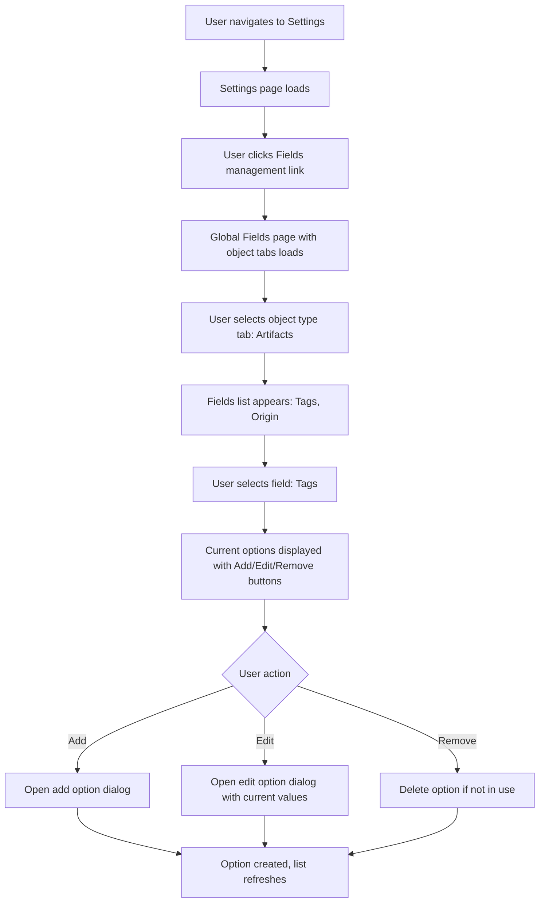

# Feature Brief & Metadata

**Feature Name:**

> Global Fields Management

**Filepath Name:**

> `global-fields-management-v1`

**Date:**

> 2026-01-22

**Author:**

> Claude Code (Opus 4.5)

**Related Epic(s)/PRD ID(s):**

> SkillMeat Core - Settings & Configuration

**Related Documents:**

> - `skillmeat/api/CLAUDE.md` - Backend architecture
> - `skillmeat/web/CLAUDE.md` - Frontend architecture
> - `skillmeat/cache/models.py` - Database schema (Tag, MarketplaceSource models)
> - `skillmeat/core/services/tag_service.py` - Tag business logic

---

## 1. Executive Summary

A dedicated settings page at `/settings/fields` enables users to centrally manage enumerable field options (select/dropdown values) across all SkillMeat domains. Users can view, add, edit, and remove options for fields like Tags (Artifacts), Origin (Artifacts), Trust Level (Marketplace Sources), Visibility (Marketplace Sources), and others—with appropriate guardrails preventing deletion of required values or breaking field constraints.

**Priority:** HIGH

**Key Outcomes:**
- Users have a single, discoverable place to manage all field enumerations
- Administrators can enforce consistent field values without direct database access
- Business logic for field validation (tag normalization, uniqueness, cascade deletes) is honored
- UI remains consistent with existing SkillMeat patterns (Card, Tabs, shadcn components)

---

## 2. Context & Background

### Current State

- **Tags**: Managed via dedicated `/api/tags/*` endpoints with full CRUD and cursor pagination. Tags have separate `tags` table with many-to-many association (`artifact_tags`). Tag normalization (trim → lowercase → underscores) is enforced at service layer.
- **Origin (Artifacts)**: Hardcoded inline enum (`local`, `github`, `marketplace`) as CHECK constraint in schema. Not currently user-editable.
- **Marketplace Source Fields**: Trust Level, Visibility, Scan Status stored as string columns with CHECK constraints. Values are constrained but scattered across UI (modal edits, filter sidebars).
- **User Flow**: Users currently edit these fields inline (modal edit in artifact/source cards) or via inline forms. No centralized management UI.

### Problem Space

1. **Discoverability**: Users don't know where to manage field values. Tags UI is separate from source filters; no unified admin interface.
2. **Consistency**: Field value management is distributed across multiple edit forms. Adding a new option requires changes in multiple places (database schema, service layer, UI).
3. **Validation**: Removing in-use values breaks constraints (e.g., removing an Origin type used by existing artifacts should be prevented).
4. **Governance**: No centralized audit or governance of enumerable values across the system.

### Current Alternatives / Workarounds

- **Direct database editing**: Power users edit the database to manage `tags` table or update CHECK constraints.
- **CLI commands**: Potential future CLI command to manage tags (not yet implemented).
- **Inline forms**: Users manage tags in artifact edit modal or source edit forms (scattered, not discoverable).

### Architectural Context

**Backend (FastAPI + SQLAlchemy):**
- Routers: Handle HTTP requests, return Pydantic DTOs
- Services: Implement business logic (tag normalization, validation, cascade deletes)
- Repositories: Data access, cursor pagination
- Layered architecture enforced by MeatyPrompts

**Frontend (Next.js 15 + React 19):**
- App Router for file-based routing
- Server components by default; `'use client'` boundary kept low
- shadcn/ui for primitives (Button, Card, Tabs, Dialog, etc.)
- TanStack Query for data fetching and state management

**Database:**
- Tag model: `tags` table (id, name, slug, color) with unique constraints and artifact association via `artifact_tags` junction table
- MarketplaceSource model: Single row with JSON-serialized arrays (tags, auto_tags) and CHECK constraints for trust_level, visibility, scan_status

---

## 3. Problem Statement

**User Story Format:**
> "As an administrator, when I want to add/remove/edit enumerable field values (tags, trust levels, etc.), I don't have a centralized UI—I must either edit inline in scattered locations or access the database directly. I want a single settings page to manage all field options."

**Technical Root Cause:**
- Field management is scattered: Tags have dedicated API + UI, but other fields (Origin, Trust Level, Visibility, Scan Status) are managed via inline forms.
- No unified UI for browsing and modifying enum values.
- Validation logic (cascade deletes for tags, required field guards) exists at service layer but has no centralized enforcement for direct modifications.

**Files Involved:**
- Frontend: `skillmeat/web/app/settings/` (new page at `fields.tsx`)
- Backend: New router `skillmeat/api/routers/fields.py` (or extend tags/marketplace routers)
- Services: Existing `TagService`, need new `FieldsService` or extend existing
- Database: `Tag`, `MarketplaceSource` models; ensure CHECK constraints prevent invalid states

---

## 4. Goals & Success Metrics

### Primary Goals

**Goal 1: Centralized Field Management UI**
- Provide a single, discoverable `/settings/fields` page with tabbed interface for different object types
- Allow users to view, add, edit, and remove options for each field
- Honor existing field constraints and validation rules

**Goal 2: Business Logic Compliance**
- Cascade delete for tags (removing tag option removes from all linked artifacts)
- Prevent removal of required field values if in use
- Apply field normalization (tag normalization: trim → lowercase → underscores)
- Validate field constraints (hex color format for tags, valid enum values for select fields)

**Goal 3: Consistency with SkillMeat Patterns**
- Use existing shadcn/ui components (Card, Tabs, Button, Dialog, Input, etc.)
- Follow settings page card-based layout pattern
- Maintain API layer separation (routers → services → repositories)
- Implement cursor pagination for field option lists

### Success Metrics

| Metric | Baseline | Target | Measurement Method |
|--------|----------|--------|-------------------|
| User discoverability | 0% (no UI exists) | 90%+ | UX testing feedback |
| Time to manage field | N/A (manual DB edits) | <5 min per field | Usability testing |
| Coverage of managed fields | Tags only | 100% (all enumerable fields) | Feature checklist |
| Error rate for invalid operations | N/A | <1% | Error logs/monitoring |
| API response time for field list | N/A | <200ms (p95) | Performance monitoring |

---

## 5. User Personas & Journeys

### Personas

**Primary Persona: Administrator / Power User**
- Role: SkillMeat operator responsible for managing field values
- Needs: Centralized place to view and modify all enumerable field options without database access
- Pain Points: Currently scattered across forms or requires DB access; unclear what fields are managed where

**Secondary Persona: Team Lead**
- Role: Oversees collection of artifacts and marketplace sources
- Needs: Quick reference to available field values; ability to add new Trust Levels or Tags for categorization
- Pain Points: Doesn't know which Tags are available; can't add new Trust Levels without admin help

### High-level Flow



---

## 6. Requirements

### 6.1 Functional Requirements

| ID | Requirement | Priority | Notes |
| :-: | ----------- | :------: | ----- |
| FR-1 | Display page at `/settings/fields` with horizontal tabs for object types (Artifacts, Marketplace Sources) | Must | Tab persistence optional; default to Artifacts |
| FR-2 | For each object type tab, display vertical list of manageable fields (left sidebar) | Must | Fields: Artifacts (Tags, Origin), Marketplace Sources (Tags, Trust Level, Visibility, Auto Tags) |
| FR-3 | When field selected, display current options in main area with Add Option button | Must | Options displayed as rows with name, color (if applicable), usage count |
| FR-4 | Implement Add Option dialog with field-specific inputs (name for Tags, value for enums) | Must | Tag: name (auto-slugified), color (optional hex). Enum: value selection/entry |
| FR-5 | Implement Edit Option dialog with field-specific inputs (pre-populate current values) | Must | Allow editing name and color for tags; read-only display for system enums where applicable |
| FR-6 | Implement Remove Option with confirmation and validation (prevent removal if in use) | Must | Show usage count; warn if removing; cascade delete for tags (remove from all artifacts) |
| FR-7 | Apply field normalization before save (e.g., tag normalization: trim → lowercase → underscores) | Must | Use existing normalization logic from TagService and field implementations |
| FR-8 | Support cursor-based pagination for field option lists (if >50 options) | Should | Cursor button or "Load More" pattern; reuse pagination from artifact views |
| FR-9 | Display read-only fields with clear indication (e.g., Auto Tags, Scan Status should be view-only) | Should | Disable Add/Edit/Remove buttons for read-only fields |
| FR-10 | Show validation errors inline (e.g., "Color must be valid hex", "Name must be unique") | Must | Use form validation from existing UI patterns |

### 6.2 Non-Functional Requirements

**Performance:**
- Field list API response: <200ms (p95)
- Option add/edit/remove: <500ms (p95)
- Page load (with all tabs data prefetch): <1s (p95)

**Security:**
- Require authentication (use existing auth middleware)
- No direct database schema exposure (all operations via validated API)
- Input validation for all fields (name, color, custom values)
- Sanitize and validate before save

**Accessibility:**
- WCAG 2.1 AA compliance for tab navigation and form inputs
- Keyboard navigation for all dialogs (Tab, Enter, Esc)
- ARIA labels for icon buttons (Edit, Remove)
- Descriptive error messages for validation failures

**Reliability:**
- Graceful error handling with user-friendly messages
- Optimistic UI updates with rollback on failure
- Transaction safety for cascade operations (tag removal)

**Observability:**
- OpenTelemetry spans for all field operations (add, edit, remove, list)
- Structured JSON logs with trace_id, span_id, operation type
- Error tracking (failed validations, DB errors)
- Monitor cascade delete operations to ensure consistency

---

## 7. Scope

### In Scope

- `/settings/fields` page with tabbed interface (Artifacts, Marketplace Sources)
- CRUD UI for enumerable fields:
  - **Artifacts**: Tags (full CRUD), Origin (view-only or edit if design permits)
  - **Marketplace Sources**: Tags (full CRUD), Trust Level (view/reference), Visibility (view/reference), Auto Tags (view-only)
- Backend API endpoints for field listing and CRUD (extend existing or create `/api/v1/fields/*`)
- Business logic integration (tag normalization, cascade deletes, uniqueness validation)
- Error handling and validation feedback
- Unit tests for field operations
- E2E test for critical path (view fields, add field, remove field)

### Out of Scope

- **Field definition management** (adding new fields to the system; only managing values of existing fields)
- **Advanced governance features** (approval workflows, audit trails, role-based access control)
- **Bulk import/export of field values** (future enhancement)
- **Auto-tagging configuration** (system-managed; view-only in this PRD)
- **Deployment-specific fields** (if any; TBD based on roadmap)
- **User/Team-level field overrides** (centralized system-wide only)

---

## 8. Dependencies & Assumptions

### External Dependencies

- **shadcn/ui**: Button, Card, Tabs, Dialog, Input, Badge, Select components (already in use)
- **TanStack Query v5**: Data fetching, caching, mutations (already in use)
- **Lucide React**: Icons (Edit, Trash2, Plus, etc.; already in use)
- **Next.js 15**: App Router, server/client components (already in use)
- **FastAPI**: Router framework (already in use)
- **SQLAlchemy 2.0+**: ORM models (already in use)

### Internal Dependencies

- **TagService** (`skillmeat/core/services/tag_service.py`): Existing tag business logic (normalization, validation, cascade delete)
- **Tag API** (`skillmeat/api/routers/tags.py`): Existing CRUD endpoints
- **Settings page layout** (`skillmeat/web/app/settings/page.tsx`): Template for new fields page
- **Database models** (`skillmeat/cache/models.py`): Tag, MarketplaceSource, Artifact (for validation)

### Assumptions

- **Field constraint enforcement**: CHECK constraints in database schema remain the source of truth; API validates before database commit
- **Tag cascade delete is safe**: Existing TagService.delete_tag() handles cascade to artifacts; reuse this logic
- **No concurrent edits**: Assume single user access to settings; optimistic locking not required (can add later if needed)
- **Enum values are fixed**: Fields like Trust Level, Visibility have fixed set of values (not user-defined); only add/remove options for fields with flexible enumerations (Tags)
- **Auto Tags are generated**: System generates auto-tags from GitHub topics; users view-only (no manual add/edit/remove)
- **Performance**: Assume <1000 options per field; if larger, implement pagination or filtering

### Feature Flags

- `FIELDS_MANAGEMENT_ENABLED`: Global feature flag to enable `/settings/fields` page (default: true in this release)
- `FIELDS_ALLOW_ENUM_EDIT`: Allow editing of enum field values (Trust Level, Visibility) vs. view-only (default: false; future phase)

---

## 9. Risks & Mitigations

| Risk | Impact | Likelihood | Mitigation |
| ----- | :----: | :--------: | ---------- |
| Accidental deletion of in-use field value | High | Med | Implement usage count validation; require confirmation with clear warning; add undo capability (future) |
| Cascade delete removes too many records | High | Low | Test cascade thoroughly; add dry-run mode to preview deletions; log all cascade operations |
| Performance degrades with many field options | Med | Low | Implement cursor pagination; add client-side caching (TanStack Query); monitor API response times |
| Field normalization edge cases | Med | Med | Reuse existing TagService._slugify() and normalize functions; add comprehensive test suite |
| User confusion about read-only fields | Low | Med | Clearly mark read-only fields (badge, disabled buttons, help text); add UI affordance (lock icon, tooltip) |
| Breaking existing API contracts | High | Low | New endpoints only; no changes to existing tag/marketplace APIs; backward compatibility guaranteed |
| Authorization bypass | High | Low | Use existing auth middleware; require admin role (TBD scope); validate in service layer; audit logging |

---

## 10. Target State (Post-Implementation)

**User Experience:**
- Admin navigates to Settings → Fields Management
- Sees tabbed interface: Artifacts, Marketplace Sources
- Selects "Artifacts" tab, sees field list: Tags, Origin
- Clicks "Tags" field, sees all current tags with counts, edit/remove buttons, and "Add Tag" button
- Clicks "Add Tag", fills in name, optional color, submits
- Tag appears in list; automatically available for tagging artifacts
- Clicks "Remove" on unused tag; tag deleted immediately
- Clicks "Remove" on in-use tag; dialog shows usage count and warning; user confirms; tag removed from all artifacts

**Technical Architecture:**
```
Frontend (Next.js):
  /settings/fields
    ├── FieldsPage (server component)
    └── FieldsClient (client component)
        ├── ObjectTypeTabs (render: Artifacts, Marketplace Sources)
        ├── FieldSidebar (render: manageable fields for selected object)
        └── FieldOptionsContent
            ├── OptionsList (cursor pagination)
            ├── AddOptionDialog (form validation)
            ├── EditOptionDialog (pre-fill, validation)
            └── RemoveConfirmDialog (validation, cascade warning)

Backend (FastAPI):
  /api/v1/fields
    ├── GET /fields?object_type=artifacts&field_name=tags
    │   └── Returns: { items: [{ id, name, color, usage_count }], pageInfo }
    ├── POST /fields/options
    │   └── Create option (normalize, validate, save)
    ├── PUT /fields/options/{option_id}
    │   └── Update option (validate uniqueness, save)
    └── DELETE /fields/options/{option_id}
        └── Delete option (validate in-use, cascade if tag, audit log)

Services:
  FieldsService (new or extend existing)
    ├── list_field_options(object_type, field_name, pagination)
    ├── create_field_option(object_type, field_name, data)
    ├── update_field_option(option_id, data)
    └── delete_field_option(option_id, cascade=True)

Repositories:
  - Leverage TagRepository for tags
  - Extend MarketplaceSourceRepository for marketplace source fields
```

**Observable Outcomes:**
- Field value management is discoverable and centralized
- Users can add/modify field options without database access
- Cascade deletes prevent orphaned references
- API response times remain <200ms
- Error rate <1% (validation, authorization, system errors)

---

## 11. Overall Acceptance Criteria (Definition of Done)

### Functional Acceptance

- [ ] `/settings/fields` page loads with object type tabs (Artifacts, Marketplace Sources)
- [ ] Clicking tabs switches field list and options display
- [ ] Field list displays all manageable fields for object type
- [ ] Clicking field displays current options with count, edit, remove buttons
- [ ] Add Option dialog opens, accepts input, validates, saves (tags normalize correctly)
- [ ] Edit Option dialog pre-fills values, allows modification, validates, saves
- [ ] Remove Option dialog shows usage count, warns if cascade delete will affect records, deletes on confirm
- [ ] Removed tags disappear from artifact edit forms (soft validation passes)
- [ ] Read-only fields (Auto Tags, Scan Status) are clearly marked and not editable
- [ ] All error messages are user-friendly and actionable
- [ ] Form validation prevents invalid entries (e.g., non-hex color, duplicate names)

### Technical Acceptance

- [ ] Follows MeatyPrompts layered architecture (routers → services → repos)
- [ ] All APIs return Pydantic DTOs (no ORM models exposed)
- [ ] Cursor pagination implemented for large field option lists (>50 items)
- [ ] ErrorResponse envelope for all error responses
- [ ] OpenTelemetry spans for all field operations (list, add, edit, delete)
- [ ] Structured logging with trace_id, span_id, operation type
- [ ] Backward compatibility: no breaking changes to existing tag/marketplace APIs
- [ ] Cascade delete operations logged and auditable
- [ ] Frontend uses Next.js 15 App Router patterns (await params, server components default)
- [ ] Frontend uses TanStack Query for data fetching and mutations

### Quality Acceptance

- [ ] Unit tests: >80% coverage for FieldsService, validation logic
- [ ] Integration tests: All API endpoints tested (list, add, edit, delete)
- [ ] E2E tests: Critical path (load page, view fields, add field, remove field)
- [ ] Performance: API response <200ms (p95), page load <1s
- [ ] Accessibility: WCAG 2.1 AA; keyboard navigation, ARIA labels, error messages
- [ ] Security: Input validation, SQL injection prevention, auth checks
- [ ] Browser testing: Chrome, Firefox, Safari (latest)
- [ ] Mobile responsiveness: Tested on mobile breakpoints

### Documentation Acceptance

- [ ] API endpoint documentation (OpenAPI/Swagger)
- [ ] Component README with usage examples
- [ ] Deployment notes (feature flags, env vars, migrations if any)
- [ ] User guide: How to manage fields
- [ ] ADR: Design decision for centralized vs. distributed field management

---

## 12. Assumptions & Open Questions

### Assumptions

- Origin (Artifacts) field is managed centrally (not user-editable in this release; can be toggled via feature flag)
- All enumerable fields with fixed values (Trust Level, Visibility, Scan Status) are view-only; no manual add/edit/remove
- Tag normalization rules are final (trim → lowercase → underscores) and no changes planned
- Concurrent editing of same field is not a concern; single user per settings page
- Users understand field relationships (e.g., removing a tag removes it from all artifacts)

### Open Questions

- [ ] **Q1**: Should Origin (Artifacts) be editable in Phase 1 or only view-only?
  - **A**: View-only in Phase 1; may enable edits in Phase 2 with `FIELDS_ALLOW_ENUM_EDIT` flag
- [ ] **Q2**: Should users be able to bulk import/export field values (CSV, JSON)?
  - **A**: Out of scope for Phase 1; future enhancement based on user feedback
- [ ] **Q3**: Should we implement undo/redo for field deletions?
  - **A**: Not in Phase 1; can add soft-delete + restore in Phase 2
- [ ] **Q4**: How do we handle field deprecation (retiring old values while keeping history)?
  - **A**: Out of scope; can be addressed in future with archival/deprecation status field
- [ ] **Q5**: Should field management require admin role or be available to all users?
  - **A**: TBD; assume admin-only for security; implement auth check in service layer
- [ ] **Q6**: Auto Tags are system-generated; should we allow user override/manual entry?
  - **A**: No; system-managed, view-only. Manual tags separate from auto-tags
- [ ] **Q7**: What happens if a tag is removed while artifact edit modal is open?
  - **A**: Optimistic update handles removal; tag selector re-fetches on next interaction

---

## 13. Appendices & References

### Related Documentation

- **Database Schema**: `skillmeat/cache/models.py` (Tag, ArtifactTag, MarketplaceSource models)
- **Tag API**: `skillmeat/api/routers/tags.py` (existing CRUD endpoints, pagination patterns)
- **Tag Service**: `skillmeat/core/services/tag_service.py` (business logic: normalization, validation)
- **Settings Page**: `skillmeat/web/app/settings/page.tsx` (template for layout, Card pattern)
- **Backend Architecture**: `skillmeat/api/CLAUDE.md` (router/service/repo layers, error handling)
- **Frontend Architecture**: `skillmeat/web/CLAUDE.md` (Next.js, TanStack Query, shadcn patterns)
- **Tag Editor Component**: `skillmeat/web/components/shared/tag-editor.tsx` (reusable tag UI component)

### Symbol References

- **API Routers**: `skillmeat/api/routers/` - Pattern examples for CRUD, pagination
- **Services**: `skillmeat/core/services/` - Business logic templates
- **React Components**: `skillmeat/web/components/ui/` - shadcn primitives for dialog, form, tabs

### Prior Art

- **Artifact Tags**: Tag management already implemented via `/api/tags/*` and tag-editor component
- **Marketplace Source Scan Status**: Displayed in marketplace source list; read-only in UI
- **Settings Pattern**: Card-based settings page (GitHub Settings section as reference)

---

## Implementation

### Phased Approach

**Phase 1: Core Infrastructure & Tags (5-7 days)**
- Duration: 5-7 days
- Tasks:
  - [ ] Create `/settings/fields` page structure (tabs, sidebar layout)
  - [ ] Implement FieldsService with list/create/update/delete operations for tags
  - [ ] Create API router `/api/v1/fields/*` with proper error handling and pagination
  - [ ] Build FieldsList component (display options, usage count)
  - [ ] Build AddOptionDialog & EditOptionDialog (form validation, submission)
  - [ ] Build RemoveConfirmDialog (usage validation, cascade warning)
  - [ ] Integrate with TanStack Query for mutations (add, edit, delete)
  - [ ] Add E2E test for tag management workflow
  - [ ] Performance testing (ensure <200ms API response)

**Phase 2: Marketplace Source Fields & UI Polish (3-5 days)**
- Duration: 3-5 days
- Tasks:
  - [ ] Add Marketplace Sources tab with Trust Level, Visibility, Auto Tags fields
  - [ ] Implement view-only display for Auto Tags (no add/edit/remove)
  - [ ] Add field descriptions/help text in UI
  - [ ] Implement cursor pagination for large option lists
  - [ ] Add accessibility testing (WCAG 2.1 AA, keyboard navigation)
  - [ ] Add unit tests for field validation logic
  - [ ] Performance optimization (lazy load tabs, query optimization)

**Phase 3: Enhancements & Refinement (2-3 days)**
- Duration: 2-3 days
- Tasks:
  - [ ] Add feature flags (FIELDS_MANAGEMENT_ENABLED, FIELDS_ALLOW_ENUM_EDIT)
  - [ ] Implement origin field (view-only or editable based on flag)
  - [ ] Add comprehensive error logging and monitoring
  - [ ] User documentation and in-app help
  - [ ] Final QA and bug fixes
  - [ ] Deployment and rollout plan

### Epics & User Stories Backlog

| Story ID | Short Name | Description | Acceptance Criteria | Estimate |
|----------|-----------|-------------|-------------------|----------|
| GFM-001 | Settings page layout | Create `/settings/fields` page with Artifacts/Marketplace tabs | Page loads, tabs switch, field list appears | 2d |
| GFM-002 | List field options | Display field options with usage count and action buttons | Options load, pagination works, counts accurate | 1d |
| GFM-003 | Add field option | Create Add dialog, validation, normalization, save | Add dialog appears, form validates, tag created | 2d |
| GFM-004 | Edit field option | Create Edit dialog, pre-fill, validation, update | Edit dialog pre-fills, changes saved, list updates | 1d |
| GFM-005 | Remove field option | Delete with usage validation and cascade handling | Confirm dialog shows usage, deletes on confirm | 2d |
| GFM-006 | Backend API | Create `/api/v1/fields/*` endpoints with DTOs | All CRUD endpoints working, pagination, error handling | 2d |
| GFM-007 | Tag normalization | Apply existing tag normalization logic | Tags lowercase, underscores, duplicates rejected | 1d |
| GFM-008 | Cascade delete audit | Log cascade delete operations for audit | Logs created, traceable to user/session | 1d |
| GFM-009 | Read-only fields | Mark Auto Tags, Scan Status as view-only | UI disabled, no edit/remove buttons, clear indicator | 1d |
| GFM-010 | Error handling | User-friendly error messages, form validation | Errors display clearly, validation prevents invalid entries | 1d |
| GFM-011 | Performance testing | Ensure <200ms API response, <1s page load | Benchmarks met, monitoring in place | 1d |
| GFM-012 | Accessibility | WCAG 2.1 AA compliance, keyboard navigation | Test results pass, keyboard nav works, ARIA labels | 1d |
| GFM-013 | E2E tests | Critical path test (view, add, delete field) | Test covers workflow, runs in CI/CD | 1d |
| GFM-014 | Documentation | API docs, component README, user guide | Docs complete, examples provided, deployment notes | 1d |

---

## Implementation Notes for Agents

### Backend Implementation Path

**Phase 1 Task: Backend API**

1. **Create `/api/v1/fields` router** (`skillmeat/api/routers/fields.py`):
   - `GET /fields?object_type=artifacts&field_name=tags&limit=50&after=<cursor>` - List field options with pagination
   - `POST /fields/options` - Create option (request: { object_type, field_name, name, color? })
   - `PUT /fields/options/{option_id}` - Update option (request: { name?, color? })
   - `DELETE /fields/options/{option_id}` - Delete option (validates in-use, returns { cascade_count })

2. **Create `FieldsService`** (`skillmeat/core/services/fields_service.py`):
   - Wrapper around TagService for tag-specific operations
   - Validation logic: check uniqueness, prevent deletion of in-use values
   - Leverage existing TagService methods (normalize, validate, cascade delete)
   - Return DTOs matching router expectations

3. **Create API schemas** (`skillmeat/api/schemas/fields.py`):
   - `FieldOptionResponse`: { id, name, color?, usage_count, created_at, updated_at }
   - `FieldListResponse`: { items: [FieldOptionResponse], page_info: PageInfo }
   - `CreateFieldOptionRequest`: { object_type, field_name, name, color? }
   - `UpdateFieldOptionRequest`: { name?, color? }

4. **Error handling**:
   - 409 Conflict if creating duplicate tag name
   - 422 Unprocessable Entity if validation fails (invalid color, empty name)
   - 400 Bad Request if removing in-use field value
   - 404 Not Found if field/option doesn't exist

### Frontend Implementation Path

**Phase 1 Task: UI Components**

1. **Create `/settings/fields` page** (`skillmeat/web/app/settings/fields.tsx`):
   - Server component that fetches initial tab data (optional)
   - Renders page header, passes to client component

2. **Create `FieldsClient` component** (`skillmeat/web/components/settings/fields-client.tsx`):
   - `'use client'` boundary
   - Render ObjectTypeTabs (Artifacts, Marketplace Sources)
   - Render FieldSidebar (field list for selected object)
   - Render FieldOptionsContent (options + buttons)

3. **Create sub-components**:
   - `FieldOptions List`: Render options as rows with badges (color), usage count, edit/remove buttons
   - `AddOptionDialog`: Form with name, optional color; submit creates option
   - `EditOptionDialog`: Pre-fill form fields; submit updates option
   - `RemoveConfirmDialog`: Show usage count, cascade warning; confirm deletes

4. **Use TanStack Query**:
   - Create hooks: `useFieldOptions()`, `useAddFieldOption()`, `useUpdateFieldOption()`, `useDeleteFieldOption()`
   - Setup mutation with invalidation on success (refetch option list)
   - Handle loading/error states

5. **Validation**:
   - Client-side: name not empty, color valid hex (or empty)
   - Error display: inline form messages, toast notifications on failure

6. **Integration**:
   - Reuse existing tag-editor styling/colors for consistency
   - Use shadcn/ui components: Tabs, Card, Button, Dialog, Input, etc.
   - Follow existing settings page pattern (Card layout, spacing)

---

**Progress Tracking:**

See progress tracking: `.claude/progress/global-fields-management/all-phases-progress.md`

---

*PRD prepared for agent execution. Review assumptions and open questions; unblock any dependencies before starting Phase 1.*
