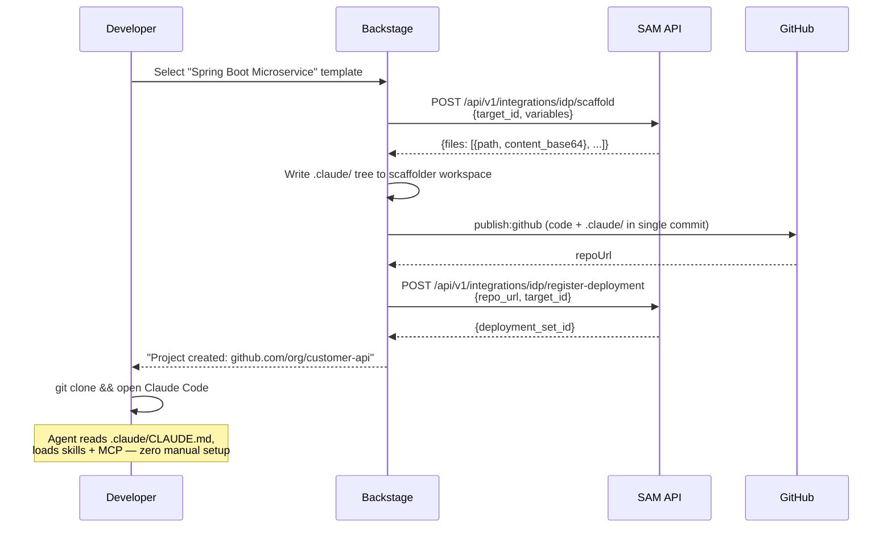

# Feature Brief & Metadata

**Feature Name:**

> Backstage/RHDH Integration & Agentic SDLC Demo ("Curing Agent Amnesia")

**Filepath Name:**

> `backstage-integration-demo-v1`

**Date:**

> 2026-03-03

**Author:**

> Claude Sonnet 4.6

**Related Documents:**

> - `skillmeat/api/routers/project_templates.py` — existing template scaffolding router
> - `skillmeat/core/services/template_service.py` — variable substitution engine
> - `skillmeat/core/deployment.py` — DeploymentManager and DeploymentProfile
> - `skillmeat/cache/models.py` — CompositeArtifact, DeploymentSet models
> - `skillmeat/api/routers/composites.py` — composite management router

---

## 1. Executive Summary

This PRD defines the work required to integrate SAM (SkillMeat Artifact Manager) with Backstage / Red Hat Developer Hub (RHDH), enabling headless "Golden Context Pack" provisioning during project scaffolding. When a developer creates a new project through the IDP, a Backstage scaffolder action calls the SAM API to resolve and render a composite artifact into the scaffolder workspace; Backstage then commits the resulting `.claude/` directory alongside the application code in a single atomic push. This "Curing Agent Amnesia" demo proves the Agentic SDLC value proposition for enterprise go-to-market engagements.

**Priority:** HIGH (critical-path for enterprise pilot GTM)

**Key Outcomes:**

- Outcome 1: AI agents have governed context from day one in any IDP-scaffolded project, with no manual setup.
- Outcome 2: Platform engineering teams can enforce organizational AI governance through a single SAM composite artifact.
- Outcome 3: SAM registers IDP-deployed packs as tracked `DeploymentSet` records, enabling future drift detection and bulk policy updates.

---

## 2. Context & Background

### Current State

SAM operates as a local CLI tool and web dashboard. The deployment path is developer-initiated: a user runs `skillmeat deploy` to push artifacts from `~/.skillmeat/collection/` into a local project's `.claude/` directory. The `DeploymentManager` and `DeploymentProfile` models support local filesystem targets. `TemplateService` resolves a whitelist of variables (`{{PROJECT_NAME}}`, `{{AUTHOR}}`, etc.) and writes rendered files to disk via async batch operations.

The existing `project_templates.py` router already supports template-based project scaffolding with `TemplateEntity` associations and variable substitution. This system is the closest existing analog to what the IDP integration requires.

### Problem Space

New projects scaffolded through Backstage receive zero AI agent context. Developers must manually create `CLAUDE.md`, configure skills, and wire MCP servers before an AI agent can work productively. In enterprise environments, this manual step is inconsistent, undocumented, and bypasses organizational governance policies.

### Current Alternatives / Workarounds

Developers either copy context files manually between projects or skip AI agent setup entirely. Neither approach scales or enforces governance. Post-hoc SAM deployment is possible but requires developer awareness and local collection setup.

### Architectural Context

SAM follows a layered architecture:

- **Routers** — HTTP surface, Pydantic schema validation, return DTOs. Registered in `skillmeat/api/server.py`.
- **Services** — Business logic, orchestrate repositories and sub-services.
- **Repositories** — All DB I/O via SQLAlchemy ORM (`skillmeat/cache/`).
- **Models** — ORM models (`skillmeat/cache/models.py`); DTOs are Pydantic schemas in `skillmeat/api/schemas/`.
- **Write-through** — FS write first, then DB sync via `refresh_single_artifact_cache()`; DB cache is web's source of truth.
- **UUID stability** — ADR-007 governs UUID assignment for cross-context artifact identity.

The new IDP integration namespace (`/api/v1/integrations/idp/`) adds two endpoints that share the `TemplateService` render pipeline but deliver rendered content as an in-memory payload rather than writing to disk.

---

## 3. Problem Statement

> "As a platform engineer, when I create a new microservice template in Backstage, AI agents in that project start with zero context instead of inheriting the organization's governed skills, MCP configs, and CLAUDE.md."

**Technical Root Cause:**

- `TemplateService` only renders to disk; there is no in-memory render path for API consumers.
- `DeploymentManager` only records local filesystem targets; remote repository URLs are not a supported deployment target type.
- No Backstage scaffolder action exists to call the SAM API.

---

## 4. Goals & Success Metrics

### Primary Goals

**Goal 1: Headless Render API**

Extend `TemplateService` with an in-memory render path. Expose it via a new `POST /api/v1/integrations/idp/scaffold` endpoint that accepts a composite or template ID plus variable substitution values, and returns the fully resolved file tree as Base64-encoded content.

**Goal 2: Deployment Registration**

Expose `POST /api/v1/integrations/idp/register-deployment` to record that a context pack was deployed to a remote Git repository. This creates a `DeploymentSet` record associated with the remote URL, enabling drift detection in future SAM releases.

**Goal 3: Backstage Plugin**

Author `@skillmeat/backstage-plugin-scaffolder-backend` — a Node.js package containing two Backstage scaffolder actions that call the two SAM endpoints above.

**Goal 4: Demo Composite Artifact**

Create the "Financial Services Compliance Pack" as a SAM composite artifact of type `stack`, seeded as demo data, to anchor the GTM narrative.

### Success Metrics

| Metric | Baseline | Target | Measurement Method |
|--------|----------|--------|--------------------|
| `.claude/` presence in scaffolded repo | 0% | 100% | Manual end-to-end test |
| Agent uses injected context without setup | Never | Always | Demo walkthrough |
| Scaffold API p99 latency | N/A | < 500 ms | API benchmark |
| Deployment registration audit trail | None | DeploymentSet record per scaffold | DB query post-demo |

---

## 5. User Personas & Journeys

### Personas

**Primary Persona: Platform Engineer**

- Role: Owns the IDP, Backstage templates, and organizational AI governance policies.
- Needs: Inject governed AI context into every new project without burdening application developers.
- Pain Points: Currently has no mechanism to enforce AI context standards at project creation time.

**Secondary Persona: Backend Developer**

- Role: Creates new microservices via Backstage self-service portal.
- Needs: AI agent that understands project conventions immediately after clone.
- Pain Points: Must manually read documentation and set up agent context before productive AI-assisted coding begins.

**Tertiary Persona: DevSecOps Consultant**

- Role: Evaluates enterprise AI tooling for compliance and governance fit.
- Needs: Observable, auditable context injection with a clear chain of custody.
- Pain Points: Ad-hoc AI context files create untracked governance risk.

### High-level Flow



---

## 6. Requirements

### 6.1 Functional Requirements

| ID | Requirement | Priority | Notes |
|:--:|-------------|:--------:|-------|
| FR-1 | `POST /api/v1/integrations/idp/scaffold` accepts a `target_id` (composite or template, `type:name` format) and `variables` dict; returns a `files` array of `{path, content_base64}` objects representing the rendered `.claude/` tree | Must | Reuses `TemplateService` variable substitution; adds in-memory render path. Extends the existing project templates system rather than wholly new code. |
| FR-2 | `POST /api/v1/integrations/idp/register-deployment` accepts `repo_url`, `target_id`, and optional `metadata`; creates a `DeploymentSet` record linked to the remote URL via `DeploymentManager` | Must | `DeploymentProfile` must support `remote_git` as a platform type alongside existing local targets. |
| FR-3 | `@skillmeat/backstage-plugin-scaffolder-backend` implements `skillmeat:context:inject` action: calls FR-1 endpoint, writes returned files into Backstage scaffolder workspace using `@backstage/integration` file APIs | Must | External Node.js package, separate from SAM Python codebase. |
| FR-4 | Plugin implements `skillmeat:deployment:register` action: calls FR-2 endpoint after `publish:github` completes, passing the resolved `repoUrl` | Must | External Node.js package. Runs as a post-publish step in the Backstage template YAML. |
| FR-5 | "Financial Services Compliance Pack" composite artifact of type `stack` created and seeded in demo environment: `CLAUDE.md` with `corp-db-wrapper` mandate, `agent:db-architect` skill, `mcp:internal-db-explorer` config | Must | Uses `CompositeArtifact` + `CompositeMembership` model. Demo data seeded via startup script. |
| FR-6 | Scaffold endpoint resolves composite membership in dependency order, renders each member artifact's templates, and returns the complete merged file tree | Must | UUID resolution per ADR-007. Composite type `stack` defines ordered render. |
| FR-7 | All IDP endpoints require bearer token authentication | Must | Reuse existing SAM API auth middleware. |
| FR-8 | Demo `docker-compose.demo.yml` stands up SAM API/UI, Backstage instance with plugin mounted, and mock PostgreSQL for MCP target | Should | For GTM demo reproducibility. |

### 6.2 Non-Functional Requirements

**Performance:**

- `POST /idp/scaffold` p99 latency < 500 ms for a composite with up to 10 member artifacts.
- In-memory render must not materialize temp files to disk.

**Security:**

- All IDP endpoints require bearer token (same auth middleware as existing SAM API routes).
- `content_base64` responses must not include secrets; MCP config templates use placeholder values for credentials.
- Token is validated server-side; Backstage plugin passes token from Backstage backend config, never from frontend.

**Reliability:**

- Scaffold endpoint returns `422 Unprocessable Entity` with structured error if `target_id` does not exist or variables fail validation.
- Register-deployment endpoint is idempotent on `(repo_url, target_id)` — duplicate calls update `updated_at` rather than creating duplicate records.

**Observability:**

- OpenTelemetry spans for scaffold render pipeline and deployment registration.
- Structured JSON logs include `trace_id`, `span_id`, `target_id`, `repo_url` where applicable.
- `DeploymentSet` record includes `provisioned_by: "idp"` metadata field for audit queries.

---

## 7. Scope

### In Scope

- Two new FastAPI endpoints under `/api/v1/integrations/idp/`.
- `TemplateService` in-memory render extension.
- `DeploymentManager` / `DeploymentProfile` support for `remote_git` platform type.
- Pydantic request/response schemas for both endpoints.
- `@skillmeat/backstage-plugin-scaffolder-backend` Node.js package with two actions.
- Demo composite "Financial Services Compliance Pack" seed data.
- `docker-compose.demo.yml` for reproducible demo environment.
- Backstage `template.yaml` example using both actions.

### Out of Scope

- Full marketplace integration with Backstage Software Catalog (future v2).
- Multi-IDP support (only Backstage/RHDH for v1).
- Real-time drift detection UI (DeploymentSet records are created; UI surfacing is a follow-on).
- Authentication token management UI in SAM web interface.
- Automatic pack updates when composite artifact changes in collection.

---

## 8. Dependencies & Assumptions

### External Dependencies

- **Backstage `@backstage/cli`**: Used to scaffold plugin package. Version pinned to whatever the target RHDH instance ships with.
- **`@backstage/plugin-scaffolder-node`**: Required for custom action authoring.
- **Docker Compose v2**: Required for demo environment.
- **Mock PostgreSQL image**: `postgres:15-alpine` for MCP demo target.

### Internal Dependencies

- **Composite artifact system** (`CompositeArtifact`, `CompositeMembership` in `skillmeat/cache/models.py`): Must be stable. FR-5 depends on creating a `stack`-type composite.
- **`TemplateService`** (`skillmeat/core/services/template_service.py`): In-memory render path is additive; existing disk-write path must be unchanged.
- **`DeploymentManager`** (`skillmeat/core/deployment.py`): Adding `remote_git` platform type must not break existing `DeploymentProfile` usage.
- **Project templates router** (`skillmeat/api/routers/project_templates.py`): New IDP router reuses service-layer logic; no changes to existing router endpoints.

### Assumptions

- The demo targets a locally running Backstage instance (not a cloud RHDH tenant).
- Variable whitelist in `TemplateService` (`PROJECT_NAME`, `PROJECT_DESCRIPTION`, `AUTHOR`, `DATE`, `ARCHITECTURE_DESCRIPTION`) is sufficient for the fin-serv demo pack.
- The Backstage scaffolder workspace file-writing API is stable across supported RHDH versions.
- Bearer token auth for IDP endpoints uses the same mechanism as existing authenticated SAM API routes.

### Feature Flags

- `idp_integration_enabled`: Gates the `/api/v1/integrations/idp/` namespace. Default off in production; on for demo environment.

---

## 9. Risks & Mitigations

| Risk | Impact | Likelihood | Mitigation |
|------|:------:|:----------:|------------|
| Backstage plugin API changes between RHDH versions break the Node.js action | High | Medium | Pin plugin to tested RHDH version; add version compatibility note to plugin README |
| In-memory render path in `TemplateService` introduces memory pressure for large composites | Medium | Low | Cap composite membership at 20 artifacts for v1; return `413` above limit |
| Demo environment `docker-compose` is fragile across Mac/Linux host differences | Medium | Medium | Test on both platforms; document known issues; provide `make demo-up` wrapper |
| `DeploymentProfile` model change breaks existing deployment workflows | High | Low | Additive schema change only; `remote_git` is a new enum value, not a modification |
| Backstage's `publish:github` step fails after `skillmeat:context:inject` — `.claude/` never lands in repo | High | Low | Workspace hydration pattern means Backstage owns the commit; `.claude/` files are in workspace regardless of SAM API issues post-inject |

---

## 10. Target State (Post-Implementation)

**User Experience:**

- A platform engineer configures a Backstage template YAML once, embedding the two SAM scaffolder actions.
- Developers self-service new projects through Backstage with zero AI context setup.
- The resulting repository contains `.claude/CLAUDE.md`, any configured skills, and MCP server configs, committed in the initial scaffold commit.
- Opening Claude Code (or compatible IDE) in the cloned repo surfaces the injected context immediately.

**Technical Architecture:**

- Two new FastAPI routes under `skillmeat/api/routers/idp_integration.py`, registered in `server.py`.
- `TemplateService.render_in_memory(target_id, variables)` returns `list[RenderedFile]` (path + bytes).
- `DeploymentManager` creates a `DeploymentSet` with `platform="remote_git"` and `remote_url` field.
- External `@skillmeat/backstage-plugin-scaffolder-backend` package published or mounted locally for demo.

**Observable Outcomes:**

- `DeploymentSet` table gains records with `provisioned_by="idp"` for each scaffolded project.
- SAM web UI (future) can query these records to show "IDP-deployed" packs and flag drift.
- GTM demo is reproducible via `make demo-up` and a documented walkthrough.

---

## 11. Overall Acceptance Criteria (Definition of Done)

### Functional Acceptance

- [ ] `POST /api/v1/integrations/idp/scaffold` with `target_id: "composite:fin-serv-compliance"` and valid variables returns `200 OK` with `files` array containing `.claude/CLAUDE.md` and at least one skill/MCP file.
- [ ] `POST /api/v1/integrations/idp/scaffold` with unknown `target_id` returns `422` with structured error body.
- [ ] `POST /api/v1/integrations/idp/register-deployment` creates a `DeploymentSet` record queryable from the SAM API.
- [ ] Duplicate `register-deployment` calls with same `(repo_url, target_id)` do not create duplicate records.
- [ ] Backstage `template.yaml` with both SAM actions executes end-to-end: new GitHub repo contains `.claude/` directory.
- [ ] Cloning generated repo and opening Claude Code causes agent to reference injected `CLAUDE.md` constraints without manual configuration.

### Technical Acceptance

- [ ] New endpoints registered in `skillmeat/api/server.py` under `/api/v1/integrations/idp/` prefix.
- [ ] Pydantic schemas use `ConfigDict` and return DTOs, not ORM models.
- [ ] `TemplateService.render_in_memory()` does not write temp files to disk.
- [ ] `DeploymentProfile` change is additive — existing local deployment workflows pass all existing tests.
- [ ] OpenTelemetry spans present for scaffold render and deployment registration.
- [ ] IDP endpoints return `401` when no bearer token is provided.

### Quality Acceptance

- [ ] Unit tests for `render_in_memory()` covering variable substitution, missing variable handling, composite member ordering.
- [ ] Integration tests for both IDP endpoints (authenticated and unauthenticated cases).
- [ ] Demo `docker-compose.demo.yml` starts cleanly on macOS and Linux without manual steps beyond `make demo-up`.

### Documentation Acceptance

- [ ] Plugin `README.md` documents installation, configuration, and both action schemas.
- [ ] `DEMO_GUIDE.md` provides step-by-step walkthrough for the GTM demo narrative.
- [ ] OpenAPI spec updated with IDP endpoint schemas.

---

## 12. Assumptions & Open Questions

### Assumptions

- The fin-serv demo pack is sufficient for GTM; no second demo pack required for v1.
- SAM's existing bearer token auth is shared with IDP consumers; no separate IDP-scoped token system.
- Backstage workspace file API is synchronous within an action; no streaming required from the SAM scaffold endpoint.

### Open Questions

- [ ] **Q1**: Should the scaffold endpoint support both `composite:*` and `template:*` target IDs, or composites only?
  - **A**: Both are desirable long-term. For v1, composite-only is sufficient for the demo; template support is additive.
- [ ] **Q2**: Should `register-deployment` be a blocking step in the Backstage template, or fire-and-forget?
  - **A**: Best practice is blocking to capture the audit record. Plugin action should await the SAM response before reporting success.
- [ ] **Q3**: Does the `fin-serv-compliance` composite need to be version-pinned, or always resolve to latest?
  - **A**: Latest is acceptable for the demo. Production usage would pin via `CompositeArtifact` version field.

---

## 13. Appendices & References

### Related Documentation

- `skillmeat/api/CLAUDE.md` — FastAPI server patterns and middleware.
- `skillmeat/core/services/template_service.py` — Variable substitution whitelist and `DeploymentResult` dataclass.
- `skillmeat/core/deployment.py` — `DeploymentManager`, `DeploymentSet`, `DeploymentProfile`.
- `skillmeat/cache/models.py` — `CompositeArtifact`, `CompositeMembership` ORM models.
- `skillmeat/api/routers/project_templates.py` — Closest existing analog to IDP scaffold endpoint.
- `skillmeat/api/routers/composites.py` — Composite CRUD router.

### Prior Art

- Workspace Hydration pattern (this PRD, Section 2): Backstage owns the Git commit; SAM provides rendered content only.
- ADR-007: UUID stability for cross-context artifact identity — governs UUID assignment in composite membership resolution.

### API Contract Sketch

**Request schema (Pydantic)**:

```python
class IDPScaffoldRequest(BaseModel):
    model_config = ConfigDict(str_strip_whitespace=True)

    target_id: str          # e.g. "composite:fin-serv-compliance"
    variables: dict[str, str] = {}

class IDPRegisterDeploymentRequest(BaseModel):
    model_config = ConfigDict(str_strip_whitespace=True)

    repo_url: str           # e.g. "https://github.com/org/customer-api"
    target_id: str
    metadata: dict[str, str] = {}
```

**Response schema**:

```python
class RenderedFile(BaseModel):
    path: str               # Relative path, e.g. ".claude/CLAUDE.md"
    content_base64: str

class IDPScaffoldResponse(BaseModel):
    files: list[RenderedFile]

class IDPRegisterDeploymentResponse(BaseModel):
    deployment_set_id: str  # UUID of created DeploymentSet
    created: bool           # False if idempotent update
```

---

## Implementation

### Phased Approach

**Phase 1: SAM Backend API** (assigned: `python-backend-engineer`)

- Duration: 3-4 days
- Tasks:
  - [ ] 1.1: Add `render_in_memory(target_id, variables)` method to `TemplateService`; returns `list[RenderedFile]` without writing to disk.
  - [ ] 1.2: Add `remote_git` platform type to `DeploymentProfile`; add `remote_url` field to `DeploymentSet`.
  - [ ] 1.3: Create `skillmeat/api/routers/idp_integration.py` with `POST /scaffold` and `POST /register-deployment` endpoints; register in `server.py`.
  - [ ] 1.4: Add Pydantic schemas to `skillmeat/api/schemas/idp_integration.py`.
  - [ ] 1.5: Unit and integration tests for both endpoints.

**Phase 2: Backstage Plugin** (assigned: platform-engineer)

- Duration: 2-3 days
- Tasks:
  - [ ] 2.1: Scaffold `@skillmeat/backstage-plugin-scaffolder-backend` via `@backstage/cli`.
  - [ ] 2.2: Implement `createSkillMeatInjectAction` — calls `/idp/scaffold`, writes files to workspace.
  - [ ] 2.3: Implement `createSkillMeatRegisterAction` — calls `/idp/register-deployment` post-publish.
  - [ ] 2.4: Export actions; write plugin README with configuration and action schema docs.

**Phase 3: Demo Environment & Data** (assigned: `python-backend-engineer` + `platform-engineer`)

- Duration: 2 days
- Tasks:
  - [ ] 3.1: Create `fin-serv-compliance` composite seed data script (composite type `stack`, three member artifacts).
  - [ ] 3.2: Author `docker-compose.demo.yml` with SAM API/UI, Backstage instance, mock PostgreSQL.
  - [ ] 3.3: Author Backstage `template.yaml` example with `skillmeat:context:inject` and `skillmeat:deployment:register` steps.
  - [ ] 3.4: Write `DEMO_GUIDE.md` with end-to-end walkthrough narrative.

### Epics & User Stories Backlog

| Story ID | Short Name | Description | Acceptance Criteria | Estimate |
|----------|------------|-------------|---------------------|----------|
| IDP-001 | In-memory render | `TemplateService.render_in_memory()` renders composite to memory | Returns correct files; no disk writes; variables substituted | 3 pts |
| IDP-002 | Scaffold endpoint | `POST /idp/scaffold` returns Base64 file tree | 200 with files; 422 on bad target; 401 without token | 2 pts |
| IDP-003 | Register deployment | `POST /idp/register-deployment` creates DeploymentSet | Record queryable; idempotent on duplicate | 2 pts |
| IDP-004 | Inject action | Backstage `skillmeat:context:inject` calls scaffold endpoint | Files appear in workspace; action logs success | 3 pts |
| IDP-005 | Register action | Backstage `skillmeat:deployment:register` calls register endpoint | DeploymentSet record created post-publish | 1 pt |
| IDP-006 | Demo composite | Fin-serv compliance pack seeded as `stack` composite | Pack resolves via scaffold endpoint; all three members rendered | 2 pts |
| IDP-007 | Demo environment | `docker-compose.demo.yml` brings up full stack | All services healthy; demo walkthrough passes | 3 pts |

---

**Progress Tracking:**

See progress tracking: `.claude/progress/backstage-integration-demo/all-phases-progress.md`
