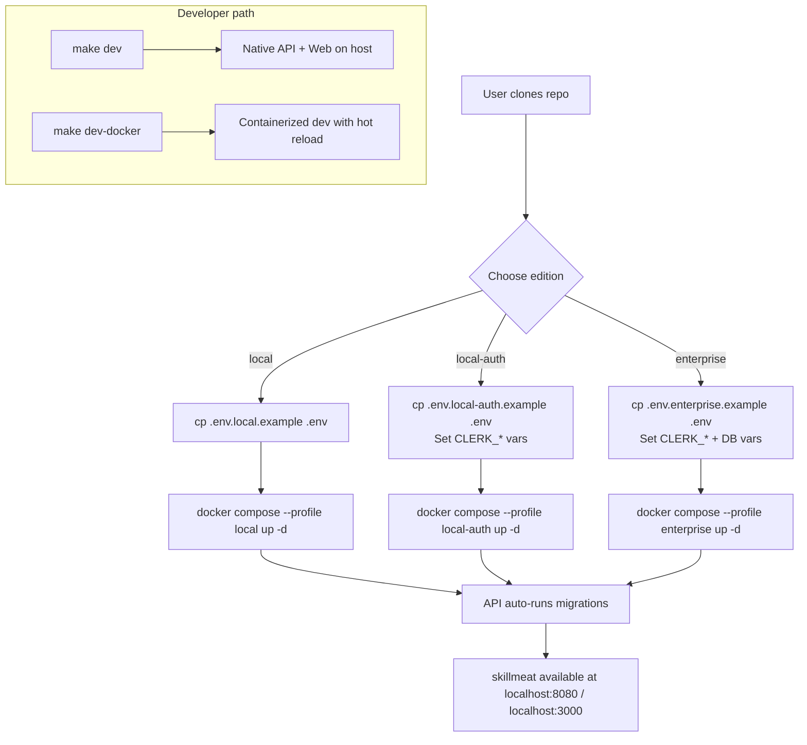
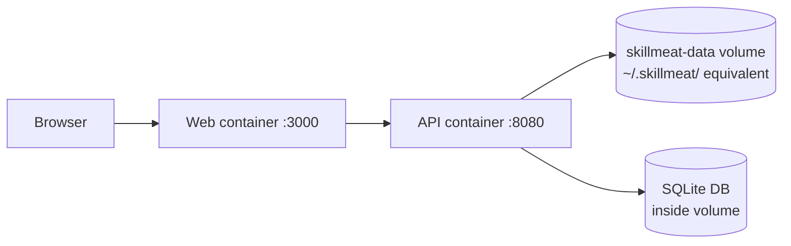

# Feature Brief & Metadata

**Feature Name:**

> Deployment Infrastructure Consolidation

**Filepath Name:**

> `deployment-infrastructure-consolidation-v1`

**Date:**

> 2026-03-08

**Author:**

> Claude Sonnet 4.6 (prd-writer)

**Related Documents:**

> - `docs/ops/operations-guide.md`
> - `docs/ops/enterprise-readiness-checklist.md`
> - `docs/project_plans/PRDs/refactors/enterprise-db-storage-v1.md`
> - `docs/project_plans/PRDs/refactors/repo-pattern-refactor-v1.md`

---

## 1. Executive summary

SkillMeat's deployment infrastructure is functional but fragmented: 5 Docker Compose files, no production Dockerfiles, and env templates scattered across 4 locations make first-time deployment a 30+ minute research exercise. This PRD consolidates everything into a single compose file with edition profiles, production-grade Dockerfiles, a developer Makefile, and a unified documentation entry point — reducing time-to-deploy to under 5 minutes for all three edition tiers.

**Priority:** HIGH

**Key outcomes:**

- Any edition (local, local-auth, enterprise) deployable with a single `docker compose --profile <edition> up` command.
- Developers have a `make dev` / `make dev-docker` entry point that works within 60 seconds of a fresh clone.
- Container images for API and Web published to GHCR automatically on every release.

---

## 2. Context & background

### Current state

SkillMeat supports three deployment tiers controlled by `SKILLMEAT_EDITION` and `SKILLMEAT_AUTH_PROVIDER` environment variables:

| Edition | Database | Auth | Scope |
|---------|----------|------|-------|
| `local` | SQLite + filesystem | LocalAuthProvider (no auth) | Single user |
| `local` + Clerk | SQLite + filesystem | Clerk JWT | Single user |
| `enterprise` | PostgreSQL | Clerk JWT + Enterprise PAT | Multi-tenant |

The application stack already has:

- `skillmeat web dev|build|start|doctor` CLI commands
- Next.js standalone output mode configured in `next.config.js`
- Alembic migrations infrastructure (working)
- Deploy scripts with health checks and rollback (`deploy/staging/deploy.sh`, `deploy/production/deploy.sh`)
- Smoke test suites for staging and production
- Comprehensive observability configuration (`docker/` directory: Prometheus, Grafana, Loki, Promtail configs)
- Alertmanager configs for staging and production
- Edition control via `SKILLMEAT_EDITION` env var
- Auth provider selection via `SKILLMEAT_AUTH_PROVIDER` env var

### Problem space

The deployment infrastructure suffers from four compounding fragmentation problems:

**1. No production Dockerfiles.** Staging (`deploy/staging/docker-compose.staging.yml`) and production (`deploy/production/docker-compose.production.yml`) compose files reference `skillmeat/api:latest` and `skillmeat/web:latest`, but no Dockerfile exists to build either image. The demo compose uses `python:3.12-slim` with `pip install -e '.[dev]'` — an editable dev install, unsuitable for production.

**2. Five separate compose files.** `docker-compose.demo.yml`, `docker-compose.monitoring.yml`, `docker-compose.test.yml`, `deploy/staging/docker-compose.staging.yml`, and `deploy/production/docker-compose.production.yml` encode overlapping but diverging stacks. A new operator must read all five to understand the full deployment surface.

**3. Env templates in four locations.** Root-level `.env.example`, `.env.enterprise.example`, `.env.local-auth.example`; `deploy/staging/env.staging`; `deploy/production/env.production`; and inline variables in `docker-compose.demo.yml`. No single authoritative template exists.

**4. No Makefile.** Common tasks (start dev, build images, run tests, deploy) require knowing the correct shell script path or CLI incantation. New contributors have no discoverable entry point.

### Current alternatives / workarounds

Operators currently must: read five compose files to understand the stack, locate the correct env template manually, run shell scripts from non-root paths, and use the demo compose as a starting point for production — which installs dev dependencies and mounts source code.

### Architectural context

SkillMeat is a dual-stack application:

- **API**: FastAPI (Python 3.12) — serves `skillmeat/api/`, talks to SQLite or PostgreSQL via Alembic-managed schema, exposes `/api/v1/*` endpoints.
- **Web**: Next.js 15 — serves `skillmeat/web/`, already configured for standalone output mode, communicates only with the API.
- **Filesystem**: Local edition reads/writes `~/.skillmeat/collection/` — this volume must be accessible from the API container.
- **Database**: Local editions use a SQLite file; enterprise uses an external PostgreSQL service.

---

## 3. Problem statement

**User story:**

> "As a self-hosting user, when I want to try SkillMeat, I have to read 5 compose files and find env templates in 4 locations just to get a working stack, instead of running a single documented command."

**Technical root causes:**

- No `Dockerfile` exists for either service, so staging/production compose files reference images that can never be built from this repo.
- Compose files were created ad-hoc per context (demo, observability, CI, staging, production) rather than as a unified profile-based configuration.
- Env templates were duplicated whenever a new deployment context was added rather than consolidated at the root.
- No `Makefile` was created because all automation was embedded in shell scripts — accessible only if you know where to look.

**Files involved:**

- `docker-compose.demo.yml`, `docker-compose.monitoring.yml`, `docker-compose.test.yml`
- `deploy/staging/docker-compose.staging.yml`, `deploy/production/docker-compose.production.yml`
- `.env.example`, `.env.enterprise.example`, `.env.local-auth.example`
- `deploy/staging/env.staging`, `deploy/production/env.production`

---

## 4. Goals & success metrics

### Primary goals

**Goal 1: Zero-friction deployment for all three tiers**
Any edition deployable with one `docker compose --profile <edition> up` command after copying a single env template. No additional files to locate or read.

**Goal 2: Production-grade container images**
Non-root, multi-stage Dockerfiles that produce slim, secure images suitable for GHCR publishing. Auto-migrations run at startup so the database is always at the correct schema version.

**Goal 3: Developer-first Makefile**
A `Makefile` at the repo root serves as the single discoverable interface for all common dev/build/test/deploy tasks. `make help` lists all targets.

**Goal 4: Automated image publishing**
GHCR images built and pushed via GitHub Actions on every release tag, eliminating the "pre-built images that don't exist" problem in staging/production compose files.

**Goal 5: Single documentation entry point**
One deployment guide (`docs/ops/deployment.md`) covers all tiers, linking to the relevant env template and compose profile.

### Success metrics

| Metric | Baseline | Target | Measurement |
|--------|----------|--------|-------------|
| Time to first successful deploy (new user) | 30+ min | < 5 min | Manual user test |
| Docker Compose files to understand | 5 | 1 + 2 optional addons | File count |
| Env template locations | 4 | 1 (repo root) | Directory count |
| Steps to start local dev | ~5 (find script, set env, run) | 2 (`cp .env.local.example .env && make dev`) | Step count |
| Container images on GHCR | 0 | 2 (api, web) on every release | CI pipeline |
| API image size | N/A (none) | < 500 MB | `docker image ls` |
| Web image size | N/A (none) | < 300 MB | `docker image ls` |
| Startup to healthy | N/A | < 30 s | `docker compose up` health check |

---

## 5. User personas & journeys

### Personas

**Primary persona: Self-hosting user**
- Role: Developer or enthusiast deploying SkillMeat for personal use
- Needs: Working local or local-auth stack in < 5 minutes
- Pain points: Cannot find the right compose file; env templates contradict each other

**Secondary persona: DevOps / enterprise admin**
- Role: Engineering or ops lead deploying enterprise edition for a team
- Needs: Reproducible, auditable deployment with Postgres, Clerk auth, and monitoring
- Pain points: Staging/production compose reference images that don't exist; no Makefile to standardize team workflows

**Tertiary persona: SkillMeat contributor**
- Role: Developer contributing features
- Needs: `make dev` and `make dev-docker` that start the right services without manual configuration
- Pain points: No Makefile; uncertain which compose file to use for development

### High-level deployment flow



---

## 6. Requirements

### 6.1 Functional requirements

| ID | Requirement | Priority | Notes |
|:--:|-------------|:--------:|-------|
| FR-1 | Multi-stage production `Dockerfile.api` for the FastAPI backend (Python 3.12-slim base, non-root user, editable-install-free, copies only runtime files) | Must | No Dockerfile currently exists |
| FR-2 | Multi-stage production `Dockerfile.web` for the Next.js frontend (Node 20-alpine base, standalone output, non-root user) | Must | No Dockerfile currently exists |
| FR-3 | `.dockerignore` excluding `.git`, `node_modules`, `__pycache__`, `.env*`, `.claude/`, `tests/`, `docs/`, `demo/`, and build artifacts | Must | None exists; build context would include node_modules |
| FR-4 | Unified `docker-compose.yml` at repo root with profiles: `local`, `local-auth`, `enterprise` | Must | Replaces `docker-compose.demo.yml` and the staging/production compose files for local use |
| FR-5 | `docker-compose.override.yml` for containerized dev: source bind-mounts, hot reload for both services, editable Python install | Must | Enables `make dev-docker`; applied automatically by Docker Compose when present |
| FR-6 | Enterprise profile includes a `postgres` service with healthcheck; API service depends on it and runs Alembic migrations before startup | Must | Currently manual in deploy scripts |
| FR-7 | `docker/docker-entrypoint.sh` script that runs `alembic upgrade head` then starts `uvicorn`; used by `Dockerfile.api` | Must | Migrations currently run manually or in deploy scripts |
| FR-8 | Named volume (`skillmeat-data`) mounted at `/root/.skillmeat` in the API container for local edition filesystem access; documented host-path override for power users | Must | Local edition requires persistent `~/.skillmeat/collection/` access |
| FR-9 | Consolidated env templates at repo root: `.env.local.example`, `.env.local-auth.example`, `.env.enterprise.example` | Must | Replaces 6 scattered templates; all variables documented inline |
| FR-10 | `Makefile` at repo root with targets: `dev`, `dev-docker`, `dev-enterprise`, `build`, `test`, `lint`, `deploy-staging`, `deploy-production`, `clean`, `help` | Must | No Makefile exists |
| FR-11 | `docker-compose.monitoring.yml` as an opt-in addon (rename/refactor of `docker-compose.monitoring.yml`); attach via `docker compose -f docker-compose.yml -f docker-compose.monitoring.yml up` | Should | Decouples monitoring from core deployment; staging/production currently embed it non-optionally |
| FR-12 | Update `deploy/staging/deploy.sh` and `deploy/production/deploy.sh` to reference unified compose file and new image names | Should | Currently reference separate compose files that are not aligned with new structure |
| FR-13 | GitHub Actions workflow (`.github/workflows/publish-images.yml`) that builds and pushes `ghcr.io/miethe/skillmeat-api` and `ghcr.io/miethe/skillmeat-web` on release tags and merges to `main` | Should | Staging/production compose files reference pre-built images that don't exist |
| FR-14 | Audit `pyproject.toml` for PyPI publishing readiness: correct metadata, classifiers, long description, and `[build-system]` table; document publishing procedure | Should | Entry point exists but package is not published |
| FR-15 | Homebrew formula for `skillmeat` CLI installation | Could | Stretch goal; depends on PyPI publishing being complete |
| FR-16 | Single consolidated deployment guide at `docs/ops/deployment.md` covering all three tiers, linking to env templates and compose profiles | Must | Currently spread across `docs/ops/operations-guide.md`, `docs/ops/enterprise-readiness-checklist.md`, and inline compose comments |
| FR-17 | Remove or archive deprecated compose files (`docker-compose.demo.yml`, duplicate staging/production compose files) after consolidation is validated | Must | Cleanup prevents future confusion |

### 6.2 Non-functional requirements

**Performance:**
- API container image size < 500 MB (multi-stage build discards build tooling)
- Web container image size < 300 MB (Next.js standalone output, Node alpine base)
- Container startup to healthy (all services running, migrations complete) < 30 seconds on modern hardware
- Hot-reload latency in `dev-docker` mode matches native development (bind-mount strategy, not copy)

**Security:**
- All containers run as non-root users with explicit `USER` directives in Dockerfiles
- No secrets baked into images; all configuration via environment variables (12-factor)
- `.dockerignore` prevents `.env*`, `.claude/`, SSH keys, and credential files from entering the build context
- Base images pinned to specific digest or minor version to prevent silent upstream changes

**Reliability:**
- `HEALTHCHECK` directives on all services in compose; readiness before dependent services start
- Automatic Alembic migration on API startup via entrypoint script
- Named volume for SQLite data persists across container restarts
- `restart: unless-stopped` policy on production-profile services

**Developer experience:**
- `make dev` starts native development (API + Web on host) within 60 seconds of a fresh clone (after deps installed)
- `make help` outputs all available targets with one-line descriptions
- Switching between editions requires only `.env` file swap — no compose file changes
- Clear startup error messages when required env variables are missing

**Observability:**
- Monitoring compose addon (`docker-compose.monitoring.yml`) preserves existing Prometheus/Grafana/Loki configuration
- Existing alertmanager configs in `docker/` remain functional

---

## 7. Scope

### In scope

- Production Dockerfiles for API (`Dockerfile.api`) and Web (`Dockerfile.web`)
- `.dockerignore` for both services
- `docker/docker-entrypoint.sh` with migration + server startup
- Unified `docker-compose.yml` with `local`, `local-auth`, and `enterprise` profiles
- `docker-compose.override.yml` for containerized development
- `docker-compose.monitoring.yml` (refactored from `docker-compose.monitoring.yml`)
- Consolidated env templates (`.env.local.example`, `.env.local-auth.example`, `.env.enterprise.example`)
- `Makefile` at repo root
- Update of existing deploy scripts to reference unified compose
- GitHub Actions workflow for GHCR image publishing
- PyPI publishing readiness audit (no actual publish required in this PRD)
- Consolidated deployment documentation (`docs/ops/deployment.md`)
- Removal of deprecated compose files after validation

### Out of scope

- Kubernetes manifests (future roadmap)
- Terraform or other IaC for cloud deployment
- CI/CD pipeline redesign beyond image publishing workflow
- Any changes to application code (API or frontend)
- `demo/` Backstage integration (archive separately in a dedicated task)
- Custom domain and TLS certificate management
- Homebrew formula (tracked as FR-15 Could — stretch goal after PyPI)
- Actual PyPI package publishing (audit only; publish is a separate release task)

---

## 8. Dependencies & assumptions

### External dependencies

- **Docker Engine 24+** and **Docker Compose v2** on all target systems (required for profile support)
- **Node 20** in Web Dockerfile base image (matches current `package.json` engine requirement)
- **Python 3.12-slim** in API Dockerfile base image (matches current `pyproject.toml` requires-python)
- **GHCR** (GitHub Container Registry) — accessible via `GITHUB_TOKEN` in Actions workflows
- **Alembic** — existing migration infrastructure confirmed working (dependency, not a risk)

### Internal dependencies

- **Next.js standalone output mode** — already configured in `next.config.js`; Dockerfile.web depends on this output being present after `next build`
- **`skillmeat web build` CLI command** — already wraps the Next.js build; Makefile `build` target should call this
- **Alembic migration directory** (`skillmeat/cache/alembic/`) — must be included in API container image
- **Observability configs in `docker/`** — `docker-compose.monitoring.yml` references these config files by path; directory structure preserved

### Assumptions

- Docker Compose v2 profile syntax (`--profile`) is supported on all target systems. Compose v1 (`docker-compose`) is not supported.
- The `SKILLMEAT_EDITION` and `SKILLMEAT_AUTH_PROVIDER` environment variables remain the edition-switching mechanism; no new mechanism is introduced.
- SQLite database file path for local editions defaults to `/root/.skillmeat/skillmeat.db` inside the container, mapped to the `skillmeat-data` named volume.
- The `monitoring/examples/docker-compose.monitoring.yml` file is superseded by the new root-level `docker-compose.monitoring.yml` and can be deprecated.
- PyPI account credentials and GHCR permissions are available to the project maintainer for publishing tasks.

### Feature flags

- None. This is an infrastructure-only change; no application feature flags are added.

---

## 9. Risks & mitigations

| Risk | Impact | Likelihood | Mitigation |
|------|:------:|:----------:|------------|
| Breaking existing deploy scripts during compose consolidation | High | Medium | Update scripts incrementally; validate each against a test deployment before removing old compose files |
| Filesystem volume permissions differ on macOS vs Linux host (UID/GID mismatch for `~/.skillmeat/`) | Medium | High | Test on both platforms; document `PUID`/`PGID` env vars if needed; use a named volume (not host bind-mount) as default |
| Next.js standalone build output is incomplete (missing static assets) | Medium | Low | Standalone mode is already configured and exercised via `skillmeat web build`; validate in CI |
| Hot reload performance degradation in containerized dev (slow bind-mounts on macOS) | Low | Medium | Use `:cached` or `:delegated` bind-mount options; document known macOS Docker Desktop latency; native dev (`make dev`) remains the recommended path |
| Staging/production deploy scripts break during transition period before scripts are updated | High | Medium | Update scripts in the same PR as the unified compose file; add smoke test to CI that validates the new compose profiles |
| `.dockerignore` missing a sensitive path causes secrets in image | High | Low | Enumerate all sensitive paths explicitly; add CI step that scans image for known secret patterns |

---

## 10. Target state (post-implementation)

### User experience

- A new user follows four steps: clone repo, copy env template, run `docker compose --profile <edition> up -d`, open browser.
- A developer runs `make dev` (native) or `make dev-docker` (containerized) and is productive immediately.
- An enterprise operator runs `docker compose --profile enterprise -f docker-compose.yml -f docker-compose.monitoring.yml up -d` for a full production-equivalent local stack.
- `make help` is the first command any new contributor runs to discover all available operations.

### Technical architecture

```
skillmeat/                         # repo root
├── Dockerfile.api                 # Multi-stage: builder + runtime (non-root)
├── Dockerfile.web                 # Multi-stage: deps + builder + runtime (standalone)
├── .dockerignore                  # Excludes node_modules, .git, .env*, .claude/
├── docker-compose.yml             # Profiles: local | local-auth | enterprise
├── docker-compose.override.yml    # Dev: source mounts + hot reload (auto-applied)
├── docker-compose.monitoring.yml  # Opt-in: Prometheus, Grafana, Loki, Promtail
├── .env.local.example             # Template for local edition
├── .env.local-auth.example        # Template for local + Clerk auth
├── .env.enterprise.example        # Template for enterprise edition
├── Makefile                       # dev, build, test, deploy, help
├── docker/
│   ├── docker-entrypoint.sh       # alembic upgrade head && uvicorn start
│   ├── prometheus/                # (unchanged)
│   ├── grafana/                   # (unchanged)
│   └── loki/                      # (unchanged)
└── deploy/
    ├── staging/
    │   └── deploy.sh              # Updated to use unified compose + new image names
    └── production/
        └── deploy.sh              # Updated to use unified compose + new image names

ghcr.io/miethe/skillmeat-api:latest    # Published on release tag
ghcr.io/miethe/skillmeat-web:latest    # Published on release tag
```

**Compose profile mapping:**

| Profile flag | Edition | Auth | Database | Notes |
|---|---|---|---|---|
| `--profile local` | local | LocalAuthProvider | SQLite (named volume) | Default for new users |
| `--profile local-auth` | local | Clerk JWT | SQLite (named volume) | Requires Clerk keys |
| `--profile enterprise` | enterprise | Clerk JWT + PAT | PostgreSQL (service) | Includes postgres sidecar |

**Data flow (local edition in Docker):**



### Observable outcomes

- Zero broken image references in staging/production compose files
- `docker compose config --profile local` validates without errors
- All existing smoke tests pass against a containerized stack
- GHCR shows `skillmeat-api` and `skillmeat-web` after the first release following this work
- `docs/ops/deployment.md` is the only file a new operator needs to read

---

## 11. Overall acceptance criteria (definition of done)

### Functional acceptance

- [ ] `docker compose --profile local up -d` starts a working SkillMeat instance; API health check passes at `localhost:8080/health`
- [ ] `docker compose --profile local-auth up -d` starts with Clerk auth; unauthenticated requests to protected endpoints return 401
- [ ] `docker compose --profile enterprise up -d` starts the full enterprise stack including Postgres; migrations run automatically
- [ ] `make dev` starts native development environment (API on host + Next.js on host) within 60 seconds
- [ ] `make dev-docker` starts containerized dev with hot reload; source file changes reflect without container restart
- [ ] `make build` produces `skillmeat-api` and `skillmeat-web` container images locally
- [ ] `make test` runs all Python and frontend tests
- [ ] `docker compose -f docker-compose.yml -f docker-compose.monitoring.yml --profile local up -d` starts Grafana and Prometheus alongside the app
- [ ] All existing smoke tests (`deploy/staging/smoke-test.sh`, `deploy/production/smoke-test.sh`) pass against the containerized stack
- [ ] Deprecated compose files (`docker-compose.demo.yml`) are removed from the repo or explicitly archived

### Technical acceptance

- [ ] API Dockerfile uses multi-stage build; final image does not contain pip, build tools, or test dependencies
- [ ] Web Dockerfile uses Next.js standalone output; final image contains only the standalone server bundle
- [ ] Both images run as non-root users (verified via `docker inspect`)
- [ ] `.dockerignore` present; `docker build` context does not include `node_modules`, `.env*`, or `.claude/` (verified via `--progress=plain` output)
- [ ] `docker-entrypoint.sh` runs `alembic upgrade head` before `uvicorn`; migration failure causes non-zero exit and container restart
- [ ] Named volume persists SQLite data across `docker compose down && docker compose up`

### Quality acceptance

- [ ] API image size < 500 MB (measured via `docker image ls`)
- [ ] Web image size < 300 MB (measured via `docker image ls`)
- [ ] Container startup to healthy < 30 seconds on a 2020-era laptop (measured via `docker compose up` output)
- [ ] GHCR workflow triggered on a test release tag; images appear at `ghcr.io/miethe/skillmeat-api` and `ghcr.io/miethe/skillmeat-web`

### Documentation acceptance

- [ ] `docs/ops/deployment.md` is a single self-contained guide covering all three tiers
- [ ] `make help` output is accurate and covers all targets
- [ ] Each env template (`.env.*.example`) has every variable commented with expected values and edition applicability

---

## 12. Assumptions & open questions

### Assumptions

- Named Docker volume (`skillmeat-data`) is an acceptable default for local edition data persistence. Power users who want a host bind-mount will override via `docker-compose.override.yml`.
- The `monitoring/examples/docker-compose.monitoring.yml` file is purely an example and has no active dependents; it can be deprecated in favor of the root-level monitoring addon.
- Existing deploy scripts are tested manually before this PRD's work is merged; their current behavior is the baseline for regression testing.
- PyPI publishing readiness audit (FR-14) results in documented steps but not an immediate publish; timing of the actual PyPI release is outside this PRD's scope.

### Open questions

- [ ] **Q1**: Should `docker-compose.test.yml` (the CI Postgres container) be absorbed into a `--profile ci` in the unified compose, or remain a separate file for test isolation?
  - **A**: TBD — leaning toward keeping it separate to avoid polluting the main compose with CI-only services. Revisit during Phase 2.

- [ ] **Q2**: Should the Makefile `deploy-staging` and `deploy-production` targets invoke `deploy.sh` directly, or re-implement the deploy logic in Make?
  - **A**: Invoke `deploy.sh` directly. The shell scripts have complex health-check and rollback logic that should not be duplicated.

- [ ] **Q3**: What is the target base image for `Dockerfile.api`? `python:3.12-slim` (Debian-based) or `python:3.12-alpine`?
  - **A**: Defaulting to `python:3.12-slim` (Debian-based) for broader native extension compatibility. Alpine may cause issues with certain compiled dependencies (e.g., `cryptography`, `psycopg2`). Document this decision in the Dockerfile.

- [ ] **Q4**: Should the Homebrew formula (FR-15) target the PyPI-published package or a standalone binary built with `pyinstaller`?
  - **A**: TBD — depends on PyPI publishing outcome. Homebrew formula is a stretch goal and will be planned separately after FR-14 is resolved.

---

## 13. Appendices & references

### Related documentation

- **Operations guide**: `docs/ops/operations-guide.md` — existing ops reference (to be superseded by new deployment guide)
- **Enterprise readiness checklist**: `docs/ops/enterprise-readiness-checklist.md` — linked from new deployment guide
- **Existing deploy scripts**: `deploy/staging/deploy.sh`, `deploy/production/deploy.sh`
- **Next.js standalone docs**: https://nextjs.org/docs/pages/api-reference/next-config-js/output (`output: 'standalone'`)
- **Docker Compose profiles**: https://docs.docker.com/compose/how-tos/profiles/
- **GHCR publishing**: https://docs.github.com/en/packages/working-with-a-github-packages-registry/working-with-the-container-registry

### Prior art

- `docker-compose.demo.yml` — starting reference for service definitions (superseded by this work)
- `deploy/staging/docker-compose.staging.yml`, `deploy/production/docker-compose.production.yml` — reference for intended service topology

---

## Implementation

### Phased approach

**Phase 1: Container foundation**
- Duration: 2–3 days
- Tasks:
  - [ ] Write `Dockerfile.api` (multi-stage, non-root, runtime-only)
  - [ ] Write `Dockerfile.web` (multi-stage, Next.js standalone, non-root)
  - [ ] Write `.dockerignore`
  - [ ] Write `docker/docker-entrypoint.sh` (migration + uvicorn)
  - [ ] Validate local builds produce working images

**Phase 2: Compose consolidation**
- Duration: 2 days
- Tasks:
  - [ ] Write unified `docker-compose.yml` with `local`, `local-auth`, `enterprise` profiles
  - [ ] Write `docker-compose.override.yml` for dev (bind-mounts, hot reload)
  - [ ] Refactor `docker-compose.monitoring.yml` → `docker-compose.monitoring.yml`
  - [ ] Consolidate env templates to repo root (`.env.local.example`, `.env.local-auth.example`, `.env.enterprise.example`)
  - [ ] Validate all three profiles start and pass health checks

**Phase 3: Developer experience**
- Duration: 1 day
- Tasks:
  - [ ] Write `Makefile` with all required targets and `make help`
  - [ ] Update `deploy/staging/deploy.sh` and `deploy/production/deploy.sh` for unified compose
  - [ ] Validate `make dev`, `make dev-docker`, `make build`, `make test`

**Phase 4: Distribution**
- Duration: 1–2 days
- Tasks:
  - [ ] Write `.github/workflows/publish-images.yml` for GHCR publishing
  - [ ] Audit `pyproject.toml` for PyPI readiness; document publishing procedure
  - [ ] Validate GHCR workflow on a test tag

**Phase 5: Documentation**
- Duration: 1 day
- Tasks:
  - [ ] Write `docs/ops/deployment.md` as single consolidated entry point
  - [ ] Update `README.md` deployment section to point to new guide
  - [ ] Inline-comment all env template variables

**Phase 6: Cleanup**
- Duration: 0.5 days
- Tasks:
  - [ ] Remove `docker-compose.demo.yml` (or move to `archive/`)
  - [ ] Remove inline env vars from deleted files
  - [ ] Update any README or docs references to old compose files

### Epics & user stories backlog

| Story ID | Short Name | Description | Acceptance Criteria | Estimate |
|----------|-----------|-------------|-------------------|----------|
| DIC-001 | API Dockerfile | Multi-stage production Dockerfile for FastAPI backend | Non-root, < 500 MB, passes `/health` | 3 pts |
| DIC-002 | Web Dockerfile | Multi-stage production Dockerfile for Next.js | Non-root, < 300 MB, serves UI | 3 pts |
| DIC-003 | .dockerignore | Exclude dev/secret artifacts from build context | node_modules, .env*, .claude/ excluded | 1 pt |
| DIC-004 | Entrypoint script | `docker-entrypoint.sh` runs migrations then starts server | Migration failure = non-zero exit | 2 pts |
| DIC-005 | Unified compose | `docker-compose.yml` with 3 profiles | All profiles start and pass healthchecks | 4 pts |
| DIC-006 | Dev override | `docker-compose.override.yml` with source mounts | Code changes reflect without restart | 2 pts |
| DIC-007 | Monitoring addon | `docker-compose.monitoring.yml` as opt-in | Prometheus + Grafana accessible when enabled | 2 pts |
| DIC-008 | Env templates | 3 consolidated templates at repo root | All vars documented inline | 2 pts |
| DIC-009 | Makefile | Repo root Makefile with all targets | `make help` accurate; all targets functional | 3 pts |
| DIC-010 | Update deploy scripts | Align staging/production scripts with unified compose | Smoke tests pass against new stack | 2 pts |
| DIC-011 | GHCR workflow | GitHub Actions workflow to publish images on release | Images appear at GHCR on test tag push | 3 pts |
| DIC-012 | PyPI audit | Audit `pyproject.toml` for publishing readiness | Documented publish checklist | 1 pt |
| DIC-013 | Deployment docs | Single `docs/ops/deployment.md` for all tiers | No external files needed to deploy | 2 pts |
| DIC-014 | Cleanup | Remove deprecated compose files and orphaned env templates | No broken references remain | 1 pt |

**Total estimate: 31 pts**

---

**Progress tracking:**

See progress tracking: `.claude/progress/deployment-infrastructure-consolidation/all-phases-progress.md`

---
