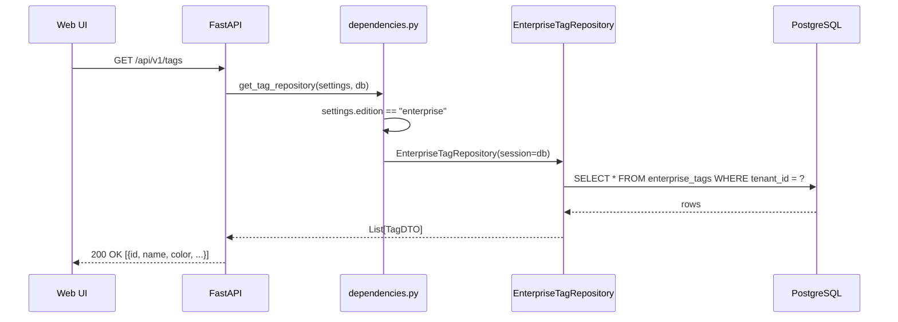
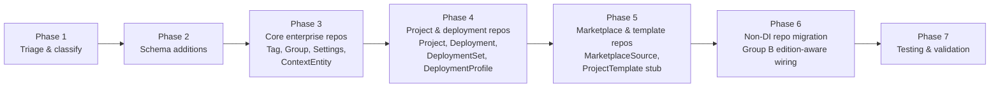

# Feature brief & metadata

**Feature name:**

> Enterprise Repository Parity v2

**Filepath name:**

> `enterprise-repo-parity-v2`

**Date:**

> 2026-03-12

**Author:**

> Claude Sonnet 4.6 (prd-writer)

**Related documents:**

> - `.claude/findings/ENTERPRISE_503_REPOSITORY_GAPS.md`
> - `docs/project_plans/PRDs/refactors/enterprise-db-storage-v1.md`
> - `docs/project_plans/implementation_plans/refactors/enterprise-db-storage-v1.md`
> - `docs/project_plans/PRDs/refactors/repo-pattern-refactor-v1.md`
> - `docs/project_plans/PRDs/refactors/enterprise-governance-3-tier.md`

---

## 1. Executive summary

Enterprise-db-storage-v1 (Phase 2) delivered enterprise repository implementations for `IArtifactRepository` and `ICollectionRepository` only. The remaining 8 DI-routed interfaces raise HTTP 503 in enterprise mode, and 8 non-DI repositories silently write to SQLite regardless of edition — creating a split-brain state in any PostgreSQL-backed deployment.

This PRD delivers the complete set of enterprise repository implementations required for feature parity in `SKILLMEAT_EDITION=enterprise`. The work is purely backend infrastructure: no new user-facing features, no frontend changes. Every repository follows the established `EnterpriseRepositoryBase` pattern (SQLAlchemy 2.x `select()`, injected `Session`, UUID PKs, automatic `_apply_tenant_filter()`).

**Priority:** HIGH

**Key outcomes:**

- Zero HTTP 503 responses from repository-missing causes in enterprise mode.
- All non-DI repositories are edition-aware; no SQLite writes occur in enterprise mode.
- Enterprise mode is viable for a production deployment without requiring workarounds or router exclusions.

---

## 2. Context & background

### What enterprise-db-storage-v1 delivered

Phase 2 of enterprise-db-storage-v1 implemented:

| Repository | Status after v1 |
|---|---|
| `EnterpriseArtifactRepository` | Implemented — `IArtifactRepository` |
| `EnterpriseCollectionRepository` | Implemented — `ICollectionRepository` |
| `EnterpriseUserCollectionAdapter` | Implemented — `IDbUserCollectionRepository` |
| `EnterpriseMembershipRepository` | Implemented — `IMembershipRepository` |

The implementation plan explicitly scoped out the remaining interfaces to control risk and delivery timeline.

### What remains

**Group A — DI-routed, returning HTTP 503 in enterprise mode:**

| Interface | DI provider | Affected endpoints |
|---|---|---|
| `IProjectRepository` | `get_project_repository` | `/api/v1/projects` |
| `IDeploymentRepository` | `get_deployment_repository` | `/api/v1/deployments` |
| `ITagRepository` | `get_tag_repository` | `/api/v1/tags` |
| `ISettingsRepository` | `get_settings_repository` | `/api/v1/settings` |
| `IGroupRepository` | `get_group_repository` | `/api/v1/groups` |
| `IContextEntityRepository` | `get_context_entity_repository` | `/api/v1/context-entities` |
| `IMarketplaceSourceRepository` | `get_marketplace_source_repository` | `/api/v1/marketplace-sources` |
| `IProjectTemplateRepository` | `get_project_template_repository` | `/api/v1/project-templates` |

**Group B — non-DI, silently using SQLite in enterprise mode:**

| Concrete class | DI provider | Affected endpoints |
|---|---|---|
| `DeploymentSetRepository` | `get_deployment_set_repository` | `/api/v1/deployment-sets` |
| `DeploymentProfileRepository` | `get_deployment_profile_repository` | `/api/v1/deployment-profiles` |
| `MarketplaceCatalogRepository` | `get_marketplace_catalog_repository` | `/api/v1/marketplace-catalog` |
| `MarketplaceTransactionHandler` | `get_marketplace_transaction_handler` | `/api/v1/marketplace` (transactions) |
| `DbCollectionArtifactRepository` | `get_db_collection_artifact_repository` | `/api/v1/collections`, `/api/v1/artifacts` (join ops) |
| `DbArtifactHistoryRepository` | `get_db_artifact_history_repository` | `/api/v1/artifact-history` |
| `DuplicatePairRepository` | `get_duplicate_pair_repository` | `/api/v1/match` (dedup) |
| `MarketplaceSourceRepository` (concrete) | `get_marketplace_source_repository_concrete` | `/api/v1/marketplace-sources` (concrete path) |

### Architecture invariants inherited from v1

- Enterprise repos: SQLAlchemy 2.x `select()` style, injected `Session` via FastAPI DI, UUID PKs.
- Local repos: SQLAlchemy 1.x `session.query()` style, accept `db_path`, SQLite. Do not modify.
- Tenant isolation: `_apply_tenant_filter()` from `EnterpriseRepositoryBase` — never skip.
- Edition routing: `APISettings.edition` (`"local"` or `"enterprise"`) — the only branch condition.
- `EnterpriseBase` DeclarativeBase: use exclusively for all new enterprise models; never use `Base` from `models.py`.

---

## 3. Problem statement

**User story:**

> "As an enterprise admin deploying SkillMeat to a PostgreSQL-backed SaaS environment, when I navigate to the Tags, Projects, Groups, or Settings pages, I receive blank screens or 503 errors — making SkillMeat non-functional beyond artifact browsing despite having a correctly configured enterprise deployment."

**Technical root causes:**

1. `dependencies.py` DI providers for 8 interfaces contain `raise HTTPException(503, "Enterprise edition does not yet support X")` — stubs left intentionally after v1 scope cut.
2. 8 non-DI providers in `dependencies.py` instantiate concrete SQLite-backed classes directly with no edition check.
3. No enterprise schema tables exist for projects, deployments, tags, settings, groups, context entities, marketplace sources, or project templates. Without them, even a stub implementation that returns empty results cannot be wired.

**Files directly involved:**

| File | Problem |
|---|---|
| `skillmeat/api/dependencies.py` | 8 DI providers raise 503; 8 non-DI providers hardcode SQLite |
| `skillmeat/cache/enterprise_repositories.py` | Missing 8+ enterprise repository classes |
| `skillmeat/cache/models_enterprise.py` | Missing enterprise models for new domains |
| `skillmeat/cache/migrations/` | Missing Alembic migrations for new enterprise tables |

---

## 4. Goals & success metrics

### Primary goals

**Goal 1: Full DI-routed parity**
All 8 DI-routed interfaces have enterprise implementations registered in `dependencies.py`. No 503 responses from repository stubs.

**Goal 2: Edition-aware non-DI repositories**
All 8 non-DI providers check `APISettings.edition` and route to an appropriate implementation. No SQLite writes in enterprise deployments.

**Goal 3: Schema completeness**
All new enterprise repository implementations have corresponding PostgreSQL-compatible SQLAlchemy models and Alembic migrations. The migration history remains linear (no branch heads introduced).

**Goal 4: Tenant isolation maintained**
Every new enterprise repository applies `_apply_tenant_filter()` on all queries. Cross-tenant data access is impossible by construction.

### Success metrics

| Metric | Baseline | Target | Measurement |
|---|---|---|---|
| HTTP 503 count (repo-missing) in enterprise mode | 8 endpoint groups | 0 | Integration test suite |
| Non-DI SQLite repos in enterprise mode | 8 | 0 | Code audit + test |
| New enterprise repo classes covered by unit tests | 0 | 100% | `pytest --cov` |
| Alembic branch heads after implementation | 1 (current) | 1 | `alembic heads` |
| Tenant isolation test coverage for new repos | 0 | All new classes | pytest |

---

## 5. User personas & journeys

### Personas

**Primary: Enterprise admin / platform engineer**
Running a team-scale SkillMeat deployment on PostgreSQL with Clerk auth. Needs full UI functionality — not just artifact browsing.

**Secondary: SkillMeat backend contributor**
Adding features that touch repository interfaces. Needs parity so feature work isn't silently broken in enterprise mode from the start.

### Journey: Enterprise admin uses Tags

---

## 6. Requirements

### 6.1 Triage classification

Before implementing, each repository interface must be classified into one of four tiers. This phase gate prevents over-engineering and documents intentional exclusions.

| Tier | Definition | Action |
|---|---|---|
| **Full** | Feature is meaningful in enterprise multi-tenant context; needs real DB implementation | Implement `EnterpriseXRepository` + schema |
| **Passthrough** | Feature works identically across editions; can reuse local implementation or simple adapter | Wire existing local repo via DI; no new class needed |
| **Stub** | Feature exists in enterprise but returns empty/default data safely; deferred to later | Implement minimal returning-empty class; no schema needed |
| **Excluded** | Feature is intentionally local-only in this version; enterprise receives 404 or feature-gated response | Route exclusion in `server.py` + document in this PRD |

**Proposed initial classification (must be validated in Phase 1):**

| Interface | Proposed tier | Rationale |
|---|---|---|
| `ITagRepository` | Full | Tags are core to artifact organization in multi-tenant environments |
| `IGroupRepository` | Full | Groups drive collection filtering; multi-tenant groups need DB-backed storage |
| `ISettingsRepository` | Full | Per-tenant settings are essential for enterprise configuration |
| `IContextEntityRepository` | Full | Context entities are central to enterprise artifact context management |
| `IProjectRepository` | Full | Projects are filesystem-centric but need enterprise representation for metadata |
| `IDeploymentRepository` | Full | Deployment tracking is needed in enterprise; deployment records replace local path refs |
| `IMarketplaceSourceRepository` | Full | Marketplace source configuration is per-tenant in enterprise |
| `IProjectTemplateRepository` | Stub (v2) | Project templates are filesystem-heavy; stub returning empty list is safe for v2 |

**Proposed classification for Group B (non-DI):**

| Concrete class | Proposed tier | Rationale |
|---|---|---|
| `DeploymentSetRepository` | Full | Deployment sets should be tenant-scoped |
| `DeploymentProfileRepository` | Full | Deployment profiles need tenant isolation |
| `MarketplaceCatalogRepository` | Passthrough or Stub | Catalog is shared/read-only; SQLite cache may be acceptable |
| `MarketplaceTransactionHandler` | Full | Transactions must be tenant-isolated |
| `DbCollectionArtifactRepository` | Full | Already partly enterprise-aware via v1; gap fill required |
| `DbArtifactHistoryRepository` | Stub | History tracking can degrade gracefully in enterprise v2 |
| `DuplicatePairRepository` | Stub | Dedup is a local workflow; return empty in enterprise |
| `MarketplaceSourceRepository` (concrete) | Full | Same domain as `IMarketplaceSourceRepository` |

> **Note:** Final classification is a Phase 1 deliverable. The above is the recommended starting point, not a binding constraint.

### 6.2 Functional requirements

| ID | Requirement | Priority | Notes |
|:--:|---|:--:|---|
| FR-1 | Triage document produced classifying all 16 repositories into Full/Passthrough/Stub/Excluded tiers with rationale | Must | Phase 1 gate; blocks all Phase 2+ work |
| FR-2 | `EnterpriseTagRepository` implementing `ITagRepository` with full CRUD and tenant filtering | Must | |
| FR-3 | `EnterpriseGroupRepository` implementing `IGroupRepository` with full CRUD and tenant filtering | Must | |
| FR-4 | `EnterpriseSettingsRepository` implementing `ISettingsRepository`; per-tenant settings storage | Must | |
| FR-5 | `EnterpriseContextEntityRepository` implementing `IContextEntityRepository` with tenant filtering | Must | |
| FR-6 | `EnterpriseProjectRepository` implementing `IProjectRepository`; projects stored as DB records with metadata; filesystem path as nullable field | Must | Projects in enterprise mode are DB records, not filesystem directories |
| FR-7 | `EnterpriseDeploymentRepository` implementing `IDeploymentRepository`; deployment records reference project by UUID | Must | |
| FR-8 | `EnterpriseMarketplaceSourceRepository` implementing `IMarketplaceSourceRepository` with tenant-scoped sources | Must | |
| FR-9 | `EnterpriseProjectTemplateRepository` stub implementing `IProjectTemplateRepository`; returns empty list safely | Should | Full implementation deferred to v3 |
| FR-10 | All Group B repositories: edition check at instantiation in `dependencies.py`; enterprise routes to appropriate implementation or raises descriptive 501 | Must | Eliminate silent SQLite writes |
| FR-11 | `EnterpriseDeploymentSetRepository` and `EnterpriseDeploymentProfileRepository` implementing their respective interfaces | Must | Part of Group B; deployment sets are meaningless without DB storage |
| FR-12 | All new enterprise repositories apply `_apply_tenant_filter()` on every query | Must | Invariant from v1; no exceptions |
| FR-13 | Alembic migrations for all new enterprise tables; each migration appends to the current single head | Must | No branch heads |
| FR-14 | DI providers in `dependencies.py` updated for all 8 Group A interfaces; edition-check pattern matches existing `get_artifact_repository` pattern | Must | |
| FR-15 | `server.py` router registration: Excluded-tier routers wrapped in edition guard that registers them only in local mode; enterprise mode returns 404 for unsupported routers | Should | Replaces misleading 503 for intentional exclusions |

### 6.3 Non-functional requirements

| ID | Requirement | Priority |
|:--:|---|:--:|
| NFR-1 | SQLAlchemy 2.x `select()` style used exclusively in all new enterprise repositories | Must |
| NFR-2 | No enterprise code in local repositories; divergence is intentional | Must |
| NFR-3 | All new enterprise repository classes covered by unit tests using `MagicMock(spec=Session)` | Must |
| NFR-4 | JSONB `@>` operator tests marked `@pytest.mark.integration` (PostgreSQL-only); SQLite-shim tests are prohibited for enterprise repos | Must |
| NFR-5 | Alembic migration files use descriptive names: `ent_NNN_add_enterprise_<domain>_tables.py` | Should |
| NFR-6 | All new enterprise models inherit from `EnterpriseBase` (not `Base` from `models.py`) | Must |
| NFR-7 | UUID primary keys on all new enterprise models; no integer PKs | Must |
| NFR-8 | `tenant_id UUID NOT NULL` column on every new enterprise table; indexed | Must |
| NFR-9 | No direct session management in enterprise repositories; session is always injected | Must |

---

## 7. Out of scope

| Item | Reason |
|---|---|
| Workflow engine enterprise repositories | Workflow execution is intentionally local-only in v2; filesystem state machine not suitable for multi-tenant DB without significant architecture work |
| Memory/context intelligence enterprise repositories | Memory extraction pipeline is local-first; enterprise support is a separate PRD |
| Analytics enterprise repositories | Analytics aggregation in enterprise requires separate design; deferred |
| CLI `deploy`/`sync` enterprise mode | Addressed in enterprise-db-storage-v1 Phase 3-4; not repeated here |
| Frontend changes | All broken behavior surfaces as empty data or graceful degradation once 503s are resolved; no UI changes needed |
| Kubernetes / cloud-specific infrastructure | Deployment infrastructure is addressed in deployment-infrastructure-consolidation-v1 |
| Local-to-cloud data migration for new domains | Migration tooling for new tables (tags, groups, etc.) is deferred; enterprise deployments start fresh for these domains |

---

## 8. Dependencies & assumptions

### Dependencies

| Dependency | Status | Notes |
|---|---|---|
| `enterprise-db-storage-v1` (Phase 1+2) | Complete | Provides `EnterpriseRepositoryBase`, `TenantContext`, `models_enterprise.py`, DI pattern |
| `repo-pattern-refactor-v1` | Complete | Provides all `I*Repository` interfaces and `*RepoDep` DI aliases |
| `aaa-rbac-foundation-v1` | Complete | Provides `AuthContext` with `tenant_id` for middleware tenant injection |
| PostgreSQL 14+ available in enterprise deployments | Assumed | Required for JSONB, UUID, TIMESTAMPTZ column types |
| Alembic migration infrastructure | Complete | Confirmed working; current head must be identified before Phase 2 migrations |

### Assumptions

| Assumption | Impact if wrong |
|---|---|
| `IProjectRepository` in enterprise mode can treat projects as DB records with an optional filesystem path field; the application does not need to resolve real directories for most endpoints | If wrong, enterprise projects may not support certain features (e.g., deployment scanning) without additional filesystem access design |
| Local repositories do not need modification; non-DI repos can be made edition-aware by wrapping instantiation in an edition check without refactoring the repository classes themselves | If wrong, scope expands significantly; assess in Phase 1 triage |
| `MarketplaceCatalogRepository` can safely reuse its SQLite cache in enterprise mode (read-only data from external sources) | If wrong, a `EnterpriseMarketplaceCatalogRepository` is required |
| Stub implementations returning empty lists are acceptable for lower-priority domains during this phase | UX impact: some UI pages will render empty rather than showing real data |

---

## 9. Risks & mitigations

| Risk | Likelihood | Impact | Mitigation |
|---|---|:--:|---|
| Filesystem-centric repo design conflict (IProjectRepository paths) | Medium | High | Phase 1 triage must explicitly define how enterprise projects handle filesystem refs; document as decision |
| Alembic migration branch head introduced by parallel development | Medium | Medium | Each migration explicitly names the preceding revision in `down_revision`; verify with `alembic heads` before merge |
| Over-scoping: implementing Full tier for repos that could be Stub | Medium | Medium | Phase 1 triage is a required gate; treat classification as binding for this version |
| SQLAlchemy 2.x comparator cache poisoning (known gotcha) | Low | Medium | Use `MagicMock(spec=Session)` for unit tests; see `skillmeat/cache/tests/CLAUDE.md` for details |
| `session.query()` style accidentally used in enterprise repos | Low | Medium | PR review checklist; linting rule can be added |
| Non-DI repo edition-aware changes break local mode | Low | High | Local mode is tested as part of the full pytest suite; run both edition smoke tests in CI |

---

## 10. Implementation phases

### Overview

### Phase 1 — Triage & classify (1–2 days)

**Goal:** Produce a binding classification for all 16 repositories before any implementation begins.

**Tasks:**

| Task ID | Task | Owner | Estimate |
|---|---|---|---|
| ENT2-1.1 | Read `IProjectRepository`, `IDeploymentRepository`, `ITagRepository`, `ISettingsRepository`, `IGroupRepository`, `IContextEntityRepository`, `IMarketplaceSourceRepository`, `IProjectTemplateRepository` full interface signatures from `repositories.py` | data-layer-expert | 2 pts |
| ENT2-1.2 | Read local implementations for all 8 interfaces; identify filesystem coupling and schema assumptions | data-layer-expert | 2 pts |
| ENT2-1.3 | Produce triage document: assign Full/Passthrough/Stub/Excluded to all 16 repositories with rationale; include schema design sketch for Full-tier items | data-layer-expert | 3 pts |
| ENT2-1.4 | Review and approve triage document; confirm phase scope for Phase 2+ | backend-architect | 1 pt |

**Exit criteria:** Triage document approved; all 16 repos classified; schema sketch for all Full-tier items reviewed.

### Phase 2 — Schema additions (2–3 days)

**Goal:** Create enterprise SQLAlchemy models and Alembic migrations for all Full-tier domains identified in Phase 1.

**Tasks:**

| Task ID | Task | Owner | Estimate |
|---|---|---|---|
| ENT2-2.1 | Add enterprise models for core domains (tags, groups, settings) in `models_enterprise.py`; all models inherit `EnterpriseBase`, have UUID PK and `tenant_id NOT NULL` | data-layer-expert | 3 pts |
| ENT2-2.2 | Add enterprise models for context entities domain | data-layer-expert | 2 pts |
| ENT2-2.3 | Add enterprise models for project and deployment domains; include nullable `filesystem_path` field on project model | data-layer-expert | 3 pts |
| ENT2-2.4 | Add enterprise models for marketplace source domain | data-layer-expert | 2 pts |
| ENT2-2.5 | Generate Alembic migration appending to current single head; verify `alembic heads` shows 1 head before and after | data-layer-expert | 2 pts |
| ENT2-2.6 | Validate migration runs cleanly on a fresh PostgreSQL database (docker-compose enterprise profile) | backend-architect | 1 pt |

**Exit criteria:** `alembic upgrade head` completes without error on fresh PostgreSQL; `alembic heads` shows exactly 1 head; all new models importable without errors.

### Phase 3 — Core enterprise repositories (3–4 days)

**Goal:** Implement enterprise repositories for the four highest-impact domains (tags, groups, settings, context entities) and wire them into the DI layer.

**Tasks:**

| Task ID | Task | Owner | Estimate |
|---|---|---|---|
| ENT2-3.1 | Implement `EnterpriseTagRepository(EnterpriseRepositoryBase)` fulfilling `ITagRepository`; full CRUD with tenant filtering | python-backend-engineer | 3 pts |
| ENT2-3.2 | Implement `EnterpriseGroupRepository(EnterpriseRepositoryBase)` fulfilling `IGroupRepository` | python-backend-engineer | 3 pts |
| ENT2-3.3 | Implement `EnterpriseSettingsRepository(EnterpriseRepositoryBase)` fulfilling `ISettingsRepository` | python-backend-engineer | 2 pts |
| ENT2-3.4 | Implement `EnterpriseContextEntityRepository(EnterpriseRepositoryBase)` fulfilling `IContextEntityRepository` | python-backend-engineer | 3 pts |
| ENT2-3.5 | Update `get_tag_repository`, `get_group_repository`, `get_settings_repository`, `get_context_entity_repository` in `dependencies.py` to edition-route to new enterprise classes | python-backend-engineer | 1 pt |
| ENT2-3.6 | Unit tests for all four new repositories using `MagicMock(spec=Session)`; verify tenant filtering is applied on all query paths | python-backend-engineer | 4 pts |

**Exit criteria:** `/api/v1/tags`, `/api/v1/groups`, `/api/v1/settings`, `/api/v1/context-entities` return 200 in enterprise mode; tenant isolation tests pass; 0 SQLite writes for these endpoints in enterprise mode.

### Phase 4 — Project & deployment repositories (3–4 days)

**Goal:** Implement enterprise repositories for the project and deployment domains — the most complex due to filesystem coupling.

**Tasks:**

| Task ID | Task | Owner | Estimate |
|---|---|---|---|
| ENT2-4.1 | Implement `EnterpriseProjectRepository(EnterpriseRepositoryBase)` fulfilling `IProjectRepository`; projects stored as DB records with nullable `filesystem_path` | python-backend-engineer | 4 pts |
| ENT2-4.2 | Implement `EnterpriseDeploymentRepository(EnterpriseRepositoryBase)` fulfilling `IDeploymentRepository`; deployment records reference project UUID | python-backend-engineer | 3 pts |
| ENT2-4.3 | Implement `EnterpriseDeploymentSetRepository` and `EnterpriseDeploymentProfileRepository` for Group B coverage | python-backend-engineer | 3 pts |
| ENT2-4.4 | Update DI providers in `dependencies.py` for project, deployment, deployment set, and deployment profile | python-backend-engineer | 1 pt |
| ENT2-4.5 | Unit tests for project and deployment enterprise repositories; include tests for nullable filesystem_path handling | python-backend-engineer | 3 pts |

**Exit criteria:** `/api/v1/projects` and `/api/v1/deployments` return 200 in enterprise mode; `DeploymentSetRepository` and `DeploymentProfileRepository` no longer write SQLite in enterprise mode; all tests pass.

### Phase 5 — Marketplace & template repositories (2–3 days)

**Goal:** Implement marketplace source enterprise repository; stub project templates; audit and resolve Group B marketplace repos.

**Tasks:**

| Task ID | Task | Owner | Estimate |
|---|---|---|---|
| ENT2-5.1 | Implement `EnterpriseMarketplaceSourceRepository(EnterpriseRepositoryBase)` fulfilling `IMarketplaceSourceRepository`; per-tenant source configuration | python-backend-engineer | 3 pts |
| ENT2-5.2 | Implement `EnterpriseProjectTemplateRepository` stub fulfilling `IProjectTemplateRepository`; returns empty list safely with explanatory log | python-backend-engineer | 1 pt |
| ENT2-5.3 | Audit `MarketplaceCatalogRepository` and `MarketplaceTransactionHandler`; classify as Passthrough or implement enterprise variant per Phase 1 triage outcome | python-backend-engineer | 2 pts |
| ENT2-5.4 | Update DI providers for marketplace source, project template, and any Group B marketplace repos | python-backend-engineer | 1 pt |
| ENT2-5.5 | Unit tests for marketplace source enterprise repository | python-backend-engineer | 2 pts |

**Exit criteria:** `/api/v1/marketplace-sources` and `/api/v1/project-templates` return 200 in enterprise mode; no SQLite writes for marketplace repos in enterprise mode.

### Phase 6 — Non-DI repo migration (2 days)

**Goal:** Audit and resolve all remaining Group B repositories not addressed in Phases 4-5.

**Tasks:**

| Task ID | Task | Owner | Estimate |
|---|---|---|---|
| ENT2-6.1 | Implement edition-aware wiring for `DbCollectionArtifactRepository`; route to enterprise-compatible implementation or verify v1 already handles it | python-backend-engineer | 2 pts |
| ENT2-6.2 | Implement edition-aware wiring for `DbArtifactHistoryRepository`; stub returning empty in enterprise or implement enterprise variant | python-backend-engineer | 2 pts |
| ENT2-6.3 | Implement edition-aware wiring for `DuplicatePairRepository`; stub returning empty in enterprise | python-backend-engineer | 1 pt |
| ENT2-6.4 | Implement edition-aware wiring for concrete `MarketplaceSourceRepository` (the non-interface path) | python-backend-engineer | 1 pt |
| ENT2-6.5 | Run full `grep` audit for any remaining direct SQLite repository instantiations in `dependencies.py` | python-backend-engineer | 1 pt |

**Exit criteria:** `grep` audit finds zero hardcoded SQLite repository instantiations without edition check in `dependencies.py`; all Group B repos verified edition-aware.

### Phase 7 — Testing & validation (2–3 days)

**Goal:** Comprehensive test coverage confirming both modes work correctly after all changes.

**Tasks:**

| Task ID | Task | Owner | Estimate |
|---|---|---|---|
| ENT2-7.1 | Run full pytest suite in local mode; zero regressions | python-backend-engineer | 1 pt |
| ENT2-7.2 | Integration tests against PostgreSQL (docker-compose enterprise profile): all 8 previously-503 endpoints return 200 | python-backend-engineer | 3 pts |
| ENT2-7.3 | Tenant isolation integration tests: verify that data created under tenant A is not visible under tenant B for all new repositories | python-backend-engineer | 3 pts |
| ENT2-7.4 | Verify `alembic heads` shows exactly 1 head after all migrations | python-backend-engineer | 0.5 pt |
| ENT2-7.5 | Code review pass: confirm all new enterprise repos use SQLAlchemy 2.x style, no `session.query()`, no integer PKs, no missing `_apply_tenant_filter()` calls | senior-code-reviewer | 2 pts |

**Exit criteria:** All tests pass in both modes; tenant isolation confirmed; migration history is linear; code review approved.

---

## 11. Acceptance criteria

| ID | Criterion | Verification method |
|:--:|---|---|
| AC-1 | `SKILLMEAT_EDITION=enterprise` produces HTTP 200 from all 8 previously-503 endpoint groups | Integration test suite against PostgreSQL |
| AC-2 | No `SQLite` or `db_path` references execute in any code path when `SKILLMEAT_EDITION=enterprise` | Code audit + runtime assertion test |
| AC-3 | Tenant A cannot retrieve data created by tenant B across all new repository implementations | Integration test: create with tenant A, query with tenant B → empty result |
| AC-4 | `alembic upgrade head` completes cleanly from a fresh database schema | `docker compose up` CI run against PostgreSQL |
| AC-5 | `alembic heads` outputs exactly one revision after all Phase 2 migrations are applied | `alembic heads` in CI |
| AC-6 | All new enterprise repository classes have `>= 80%` line coverage via unit tests | `pytest --cov` report |
| AC-7 | Local mode (`SKILLMEAT_EDITION=local`) produces zero regressions; all pre-existing tests pass | `pytest` on local configuration |
| AC-8 | All new enterprise models inherit from `EnterpriseBase`; no new models reference `Base` from `models.py` | Automated import check or code review |
| AC-9 | `IProjectTemplateRepository` returns HTTP 200 with an empty list in enterprise mode (not 503) | API smoke test |
| AC-10 | Excluded-tier routers (if any) return HTTP 404 in enterprise mode with a descriptive `detail` message, not 503 | API smoke test |

---

## 12. Assumptions & open questions

### Assumptions

- `IProjectRepository` in enterprise mode stores project metadata (name, description, path hint) in the DB. The application does not require live filesystem resolution for the endpoints currently broken. If `deploy`/`sync` CLI commands need enterprise project paths, that is addressed in enterprise-db-storage-v1 Phase 3-4.
- Non-DI repositories can be made edition-aware via a simple factory pattern at the call site in `dependencies.py`; the repository classes themselves do not need to become edition-aware.
- `MarketplaceCatalogRepository` stores read-only cached data from external sources and does not need tenant isolation; it can safely reuse the local SQLite cache in enterprise mode as a passthrough. (Validate in Phase 1.)

### Open questions

| ID | Question | Owner | Impact |
|---|---|---|---|
| OQ-1 | Should `IProjectRepository` in enterprise mode support filesystem path operations, or should project paths be treated as informational metadata only? | backend-architect | Determines schema design for Phase 2 |
| OQ-2 | Does `DbCollectionArtifactRepository` already work correctly in enterprise mode via the v1 changes, or is it silently using SQLite for the join table? | data-layer-expert | Phase 6 scope |
| OQ-3 | Should `MarketplaceTransactionHandler` be elevated to a Full-tier enterprise implementation, or is the transaction concept local-only? | product | Phase 5 scope |
| OQ-4 | Are any Group B repos used in code paths that are already guarded by enterprise-specific logic (e.g., called only from endpoints that are v1-working)? | data-layer-expert | May reduce Phase 6 scope |

---

*End of PRD: Enterprise Repository Parity v2*
