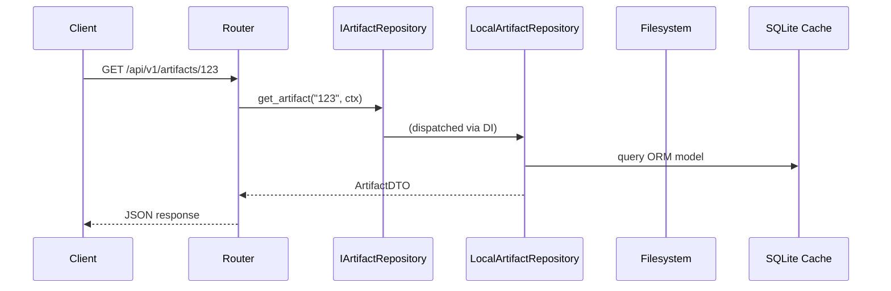

# Feature Brief & Metadata

**Feature Name:**

> Storage Abstraction & Repository Pattern Refactor

**Filepath Name:**

> `repo-pattern-refactor-v1`

**Date:**

> 2026-03-01

**Author:**

> Gemini

**Related Epic(s)/PRD ID(s):**

> Enterprise Scaling Initiative — PRD 1 of 3

**Related Documents:**

> - docs/project_plans/PRDs/features/aaa-rbac-foundation-v1.md (PRD 2: depends on interfaces from this PRD)
> - docs/project_plans/PRDs/refactors/enterprise-db-storage-v1.md (PRD 3: implements interfaces from this PRD)
> - skillmeat/cache/repositories.py (existing partial repository layer)
> - skillmeat/cache/models.py (30+ existing SQLAlchemy ORM models)
> - skillmeat/api/dependencies.py (existing DI container)

---

## 1. Executive Summary

This PRD defines a foundational architectural refactor that introduces the Repository Pattern (Hexagonal Architecture) to SkillMeat, strictly decoupling the API layer and core services from direct filesystem and SQLite cache access. The refactor delivers zero functional changes for end-users but is a critical prerequisite for PRD 2 (AAA & RBAC) and PRD 3 (Enterprise Database Storage). It is the first step in a three-PRD initiative to enable enterprise-grade multi-tenant scaling.

**Priority:** CRITICAL

**Key Outcomes:**
- Outcome 1: All data access isolated behind abstract repository interfaces — routers and services never touch `os`, `pathlib`, or SQL directly.
- Outcome 2: Local filesystem behavior fully preserved through concrete `LocalFileSystemRepository` implementations.
- Outcome 3: FastAPI dependency injection wired for all repositories, enabling seamless backend swaps in PRD 3.

---

## 2. Context & Background

### Current State

SkillMeat is a personal collection manager for Claude Code artifacts with a Next.js 15 + FastAPI web UI. The system currently targets a single local user. The data layer is split across two sources of truth:

- **Filesystem** (`~/.skillmeat/collection/`): CLI's source of truth — TOML manifests, Markdown files, artifact directories.
- **SQLite cache** (`skillmeat/cache/`): Web UI's source of truth — 30+ SQLAlchemy ORM models, 65+ Alembic migrations, query-optimized views.

A write-through pattern governs mutations: write filesystem first, then call `refresh_single_artifact_cache()` to sync the DB cache.

**Router audit results:**
- 36 total API router files registered in `server.py`
- 15 routers directly import `os.path`, `pathlib.Path`, or `sqlite3` for data retrieval
- 9 partial repository implementations exist (`skillmeat/cache/repositories.py`) covering only marketplace and workflow entities
- Core repositories missing: `ArtifactRepository`, `ProjectRepository`, `CollectionRepository`, `DeploymentSetRepository`, `TagRepository`

**Existing DI pattern:** `AppState` singleton holds `ConfigManager`, `CollectionManager`, `ArtifactManager`, etc., with typed aliases (`ConfigManagerDep = Annotated[ConfigManager, Depends(...)]`). No DI exists for data repositories.

### Problem Space

The absence of a repository abstraction layer creates three compounding problems:

1. **Untestable routers**: Tests require a real filesystem and SQLite DB, making them slow and fragile.
2. **Backend lock-in**: Swapping to a cloud database (PRD 3) requires rewriting business logic embedded in routers.
3. **Authorization impossible**: PRD 2's RBAC needs a `RequestContext` to pass through every data access call — impossible when data access is scattered across 15+ routers with no unified interface.

### Current Alternatives / Workarounds

None exist. Developers working on new endpoints copy-paste filesystem access patterns from existing routers. The partial marketplace/workflow repositories demonstrate the intended pattern but are not used by core entities.

### Architectural Context

SkillMeat uses a layered architecture that this refactor enforces:

- **Routers** — HTTP handling and input validation; must return DTOs, never ORM models
- **Services** (`skillmeat/core/`) — Business logic; consume and produce DTOs only
- **Repositories** (`skillmeat/cache/repositories.py`, new `skillmeat/core/interfaces/`) — All data I/O; enforce write-through invariants
- **DB Cache** (`skillmeat/cache/models.py`) — SQLAlchemy ORM models; never exposed above the repository layer

---

## 3. Problem Statement

The core gap is the absence of any abstraction between the HTTP layer and data storage.

**Technical Root Cause:**
- No `IArtifactRepository`, `IProjectRepository`, or `ICollectionRepository` interfaces exist for core entities
- `skillmeat/api/routers/artifacts.py` (9,400+ lines) mixes HTTP handling, path resolution, filesystem I/O, and DB queries in a single layer
- `resolve_project_path()` and `_normalize_artifact_path()` are duplicated across multiple routers with no shared implementation
- `get_db_session()` opens and closes per-operation with no scoped session management
- Routers bypass `ArtifactManager` and `CollectionManager` to call the filesystem directly

**Impact:**
- PRD 2 (RBAC) cannot enforce authorization without a `RequestContext` threaded through every data call
- PRD 3 (Enterprise DB) cannot be implemented without rewriting every affected router
- New contributors introducing filesystem access in routers perpetuates the anti-pattern

---

## 4. Goals & Success Metrics

### Primary Goals

**Goal 1: Interface Completeness**
- Define abstract repository interfaces for every core data entity: `IArtifactRepository`, `IProjectRepository`, `ICollectionRepository`, `IDeploymentRepository`, `ITagRepository`, `ISettingsRepository`
- All interfaces include a `RequestContext` parameter (placeholder for PRD 2 authorization)

**Goal 2: Local Implementation Parity**
- `LocalArtifactRepository`, `LocalProjectRepository`, etc. fully replace inline filesystem and cache logic
- Existing write-through invariants preserved: write FS first, then sync DB cache
- No behavioral regressions — all existing API contracts unchanged

**Goal 3: Enforced Layer Separation**
- Zero direct `os`, `pathlib`, or `sqlite3` imports in `skillmeat/api/routers/`
- Zero direct filesystem calls in `skillmeat/core/` services that bypass repositories
- FastAPI DI wires repositories to routers via typed dependency aliases

### Success Metrics

| Metric | Baseline | Target | Measurement Method |
|--------|----------|--------|-------------------|
| Routers with direct filesystem access | 15 | 0 | Grep `os.path\|pathlib\|sqlite3` in routers/ |
| Core entities with repository interface | 0 | 6 | Count ABCs in `skillmeat/core/interfaces/` |
| Existing test suite pass rate | 100% | 100% | `pytest -v` |
| P95 response latency overhead | 0ms | <5ms | Load test before/after |
| Duplicated path resolution functions | 5+ | 0 | Grep `resolve_project_path\|_normalize_artifact_path` |

---

## 5. User Personas & Journeys

### Personas

**Primary Persona: Solo Developer (Current User)**
- Role: Personal user managing Claude Code artifacts locally
- Needs: Uninterrupted existing workflows; no behavioral changes
- Pain Points: None currently (transparent refactor)

**Secondary Persona: Enterprise Admin (Future User)**
- Role: IT admin deploying SkillMeat for a team against a cloud database
- Needs: Pluggable storage backend; RBAC enforcement per request
- Pain Points: Current architecture is undeployable at team scale

### High-level Flow

```mermaid
graph TD
    subgraph "Before (Current)"
        R1[Router] -->|os.path / pathlib| FS1[Filesystem]
        R1 -->|get_db_session| DB1[SQLite Cache]
    end

    subgraph "After (Target)"
        R2[Router] -->|Depends(get_repo)| DI[DI Container]
        DI -->|Edition: local| LFSR[LocalRepository]
        DI -->|Edition: enterprise| ENT[EnterpriseRepository]
        LFSR --> FS2[Filesystem]
        LFSR --> DB2[SQLite Cache]
        ENT --> CLOUD[Cloud DB]
    end
```

---

## 6. Requirements

### 6.1 Functional Requirements

| ID | Requirement | Priority | Notes |
| :-: | ----------- | :------: | ----- |
| FR-1 | Define abstract base classes (ABCs) for all core data entities: `IArtifactRepository`, `IProjectRepository`, `ICollectionRepository`, `IDeploymentRepository`, `ITagRepository`, `ISettingsRepository` in `skillmeat/core/interfaces/` | Must | Python `abc.ABC` + `@abstractmethod`; async signatures |
| FR-2 | All repository interface methods accept a `RequestContext` parameter (placeholder struct — no auth logic in this PRD) | Must | Enables PRD 2 to add authorization without interface changes |
| FR-3 | Implement `LocalArtifactRepository`, `LocalProjectRepository`, `LocalCollectionRepository`, `LocalDeploymentRepository`, `LocalTagRepository`, `LocalSettingsRepository` preserving all existing filesystem and cache behavior | Must | Move logic from routers and managers into these classes |
| FR-4 | Implement a factory/provider pattern (`get_artifact_repository()`, etc.) that returns the correct implementation based on `config.EDITION` (`"local"` initially; `"enterprise"` reserved for PRD 3) | Must | Pure Python callables usable as FastAPI `Depends` |
| FR-5 | Register all repository providers in `skillmeat/api/dependencies.py` with typed DI aliases (`ArtifactRepoDep = Annotated[IArtifactRepository, Depends(get_artifact_repository)]`) | Must | Match existing `ConfigManagerDep` pattern |
| FR-6 | Migrate all 15 routers with direct filesystem access to consume repositories via DI; no router may import `os`, `pathlib`, or call `get_db_session()` directly | Must | Includes `artifacts.py`, `projects.py`, `user_collections.py`, `deployments.py`, `context_entities.py` |
| FR-7 | Centralize path resolution into a `ProjectPathResolver` utility consumed by local repository implementations; delete all duplicated `resolve_project_path()` and `_normalize_artifact_path()` variants | Must | Single source of truth for filesystem paths |
| FR-8 | Implement scoped session management (Unit of Work or SQLAlchemy scoped sessions) so repositories share a single session per request rather than opening/closing per-operation | Should | Reduces connection overhead; enables atomic multi-repo operations |
| FR-9 | All existing API response schemas, status codes, and pagination formats remain unchanged — zero breaking changes to the HTTP contract | Must | Verified by existing integration test suite |
| FR-10 | CLI commands continue to work via `CollectionManager` and `ArtifactManager`; if managers are refactored to use local repositories internally, CLI behavior must be identical | Must | CLI is not migrated to use DI — managers remain as the CLI interface |

### 6.2 Non-Functional Requirements

**Performance:**
- Repository abstraction layer adds no more than 5ms to P95 request latency (measured via load test before/after on `GET /api/v1/artifacts`)
- No N+1 query regressions: repositories must batch-load related entities where the existing code did so

**Security:**
- `RequestContext` parameter is a placeholder `dataclasses.dataclass` in this PRD — no authentication logic introduced
- Local repositories must not expose filesystem paths outside `~/.skillmeat/` without explicit configuration

**Reliability:**
- Write-through invariant preserved: every mutation writes the filesystem first, then calls `refresh_single_artifact_cache()` before returning
- Repository implementations must be idempotent for read operations (no side effects)

**Maintainability:**
- Each repository implementation file must be under 600 lines
- All repository methods must have docstrings describing parameters, return type, and raised exceptions
- `skillmeat/core/interfaces/` must contain only ABCs and DTOs — no concrete logic

**Observability:**
- All repository method calls emit a structured log entry with `entity_type`, `operation`, `duration_ms`, and `request_id`
- Slow repository operations (>100ms) emit a warning-level log

---

## 7. Scope

### In Scope

- Abstract interface definitions for 6 core data entities
- `RequestContext` placeholder dataclass
- Local filesystem repository implementations for all 6 entities
- Factory/provider functions for all repositories
- FastAPI DI alias registration in `skillmeat/api/dependencies.py`
- Migration of 15 routers with direct filesystem access
- `ProjectPathResolver` centralized utility
- Scoped session management per request
- Test suite updates to use mock/in-memory repositories

### Out of Scope

- Enterprise cloud database implementation (PRD 3)
- Authentication and authorization logic (PRD 2)
- Any UI changes (frontend is unaffected)
- New API endpoints or modified API schemas
- CLI refactoring beyond ensuring backward compatibility
- Marketplace and workflow repositories (already implemented; only verify compatibility)

---

## 8. Dependencies & Assumptions

### External Dependencies

- **SQLAlchemy 2.x**: ORM used by existing cache layer; scoped session implementation depends on this version
- **FastAPI**: DI system used for repository injection — no version changes required
- **Python abc module**: Standard library ABC support

### Internal Dependencies

- **`skillmeat/cache/models.py`**: 30+ ORM models are the data substrate for local repositories — must not be modified in this PRD
- **`skillmeat/cache/repositories.py`**: Existing marketplace/workflow repositories establish the pattern; new repositories follow this structure
- **`skillmeat/api/dependencies.py`**: Existing `AppState` DI container; new repository providers added alongside existing manager aliases
- **`skillmeat/core/`**: `ArtifactManager`, `CollectionManager`, `DeploymentManager` remain as CLI-facing facades; local repositories may delegate to them internally or share logic

### Assumptions

- The existing test suite achieves sufficient coverage of current router behavior to act as a regression safety net
- `config.EDITION` is already a readable config field or can be added with minimal impact
- Python type hints and `abc.ABC` are sufficient — no additional DI framework (e.g., `dependency-injector`) is needed
- Marketplace and workflow repositories in `skillmeat/cache/repositories.py` are compatible with the new interface pattern without modification

### Feature Flags

- None required. Migration is incremental per-router; any router not yet migrated continues to use its current implementation. No runtime flag needed to gate the refactor.

---

## 9. Risks & Mitigations

| Risk | Impact | Likelihood | Mitigation |
| ----- | :----: | :--------: | ---------- |
| Large blast radius — 15+ routers migrated increases regression surface | High | Medium | Migrate one router at a time; run full test suite after each; gate phase 4 on green CI |
| Write-through cache regressions — moving FS+cache logic into repositories breaks sync | High | Medium | Extract write-through logic into a shared `WriteThroughMixin`; add integration test asserting DB state matches FS state after every mutation |
| Performance regression from abstraction overhead | Medium | Low | Benchmark P95 latency before starting Phase 2; re-benchmark after Phase 4; fail phase if >5ms overhead |
| Scoped session management conflicts with existing per-operation sessions | Medium | Medium | Introduce scoped sessions in Phase 3 only after local repos are stable; run extended soak test |
| CLI breakage from manager refactoring | High | Low | CLI integration tests run in isolation before and after Phase 3; managers are not migrated — only local repos delegate to them |
| `artifacts.py` (9,400+ lines) is too large to migrate safely in one pass | Medium | High | Break artifacts router migration into sub-tasks by endpoint group (read, write, deploy); track separately in progress file |

---

## 10. Target State (Post-Implementation)

**Technical Architecture:**

```
skillmeat/
├── core/
│   └── interfaces/           # NEW: ABCs + DTOs
│       ├── __init__.py
│       ├── artifact.py       # IArtifactRepository, ArtifactDTO
│       ├── project.py        # IProjectRepository, ProjectDTO
│       ├── collection.py     # ICollectionRepository, CollectionDTO
│       ├── deployment.py     # IDeploymentRepository, DeploymentDTO
│       ├── tag.py            # ITagRepository, TagDTO
│       ├── settings.py       # ISettingsRepository, SettingsDTO
│       └── context.py        # RequestContext placeholder
├── cache/
│   ├── models.py             # Unchanged ORM models
│   └── repositories/         # REFACTORED
│       ├── base.py           # Existing base + WriteThroughMixin
│       ├── local/            # NEW: LocalXxxRepository implementations
│       │   ├── artifact.py
│       │   ├── project.py
│       │   ├── collection.py
│       │   ├── deployment.py
│       │   ├── tag.py
│       │   └── settings.py
│       └── marketplace.py    # Unchanged (existing)
└── api/
    ├── dependencies.py       # EXTENDED: ArtifactRepoDep, ProjectRepoDep, etc.
    └── routers/              # MIGRATED: no direct filesystem imports
```

**Data Flow (Post-Refactor):**



**Observable Outcomes:**
- `grep -r "import os\|from pathlib\|import sqlite3" skillmeat/api/routers/` returns zero matches
- All 36 router files pass a linting rule prohibiting direct filesystem imports
- Mock repository injected in tests eliminates all temporary filesystem setup/teardown

---

## 11. Overall Acceptance Criteria (Definition of Done)

### Functional Acceptance

- [ ] All 6 abstract repository interfaces defined in `skillmeat/core/interfaces/` with `RequestContext` on every method
- [ ] All 6 `LocalXxxRepository` implementations passing existing functional behavior
- [ ] All 15 previously-flagged routers migrated — zero `os`, `pathlib`, `sqlite3` direct imports remaining in `skillmeat/api/routers/`
- [ ] `ProjectPathResolver` exists; all duplicated path functions removed
- [ ] Factory providers registered in `dependencies.py` with typed aliases

### Technical Acceptance

- [ ] Layered architecture enforced: routers use DI aliases, services use repositories, no ORM models leak above repository layer
- [ ] Write-through invariant verified: integration test confirms FS and DB state match after every mutation type (create, update, delete)
- [ ] Scoped session per request implemented; no per-operation session open/close in migrated routers
- [ ] `config.EDITION == "local"` routes to `LocalXxxRepository`; factory returns correct type
- [ ] `RequestContext` dataclass defined with `user_id: str | None` and `request_id: str` fields (populated but not consumed in this PRD)

### Quality Acceptance

- [ ] Existing `pytest` suite passes with zero new failures
- [ ] P95 latency overhead < 5ms versus pre-refactor baseline on `GET /api/v1/artifacts`
- [ ] CLI smoke test (`skillmeat list`, `skillmeat add`, `skillmeat deploy`) passes unchanged
- [ ] All new repository methods have docstrings

### Documentation Acceptance

- [ ] `skillmeat/core/interfaces/README.md` documents the interface contract and `RequestContext` usage
- [ ] Inline comments in each `LocalXxxRepository` explain write-through behavior

---

## 12. Assumptions & Open Questions

### Assumptions

- PRD 2 and PRD 3 will not begin implementation until this PRD reaches `completed` status
- `skillmeat/cache/repositories.py` marketplace/workflow implementations are compatible with the new interface module with only import changes, not logic changes
- The existing `AppState` singleton pattern is sufficient for repository lifetime management (no need for a separate DI scope)

### Open Questions

- [ ] **Q1**: Should `LocalArtifactRepository` delegate to `ArtifactManager` internally, or should manager logic be extracted directly into the repository?
  - **A**: TBD — decision affects Phase 2 scope. Preference is delegation to managers to avoid duplicating sync logic, but this needs validation against manager method signatures.
- [ ] **Q2**: Is a `UnitOfWork` pattern needed, or are scoped SQLAlchemy sessions sufficient for Phase 3?
  - **A**: TBD — start with scoped sessions; escalate to UnitOfWork if multi-repo atomic operations are required.
- [ ] **Q3**: Should `ProjectPathResolver` live in `skillmeat/core/` or `skillmeat/cache/`?
  - **A**: `skillmeat/core/` — it is domain logic (path conventions) not cache logic.

---

## 13. Appendices & References

### Related Documentation

- **Data Flow Patterns**: `.claude/context/key-context/data-flow-patterns.md` — stale times, write-through invariants, cache invalidation graph
- **Router Patterns**: `.claude/context/key-context/router-patterns.md` — FastAPI router conventions
- **API Contract Source of Truth**: `.claude/context/key-context/api-contract-source-of-truth.md`
- **Enterprise DB PRD (PRD 3)**: `docs/project_plans/PRDs/refactors/enterprise-db-storage-v1.md`
- **AAA & RBAC PRD (PRD 2)**: `docs/project_plans/PRDs/features/aaa-rbac-foundation-v1.md`

### Symbol References

- **Cache Layer Symbols**: Query `ai/symbols-api.json` for `layer == "repository"` to enumerate existing repo implementations
- **Router Symbols**: Query `ai/symbols-api.json` for `layer == "router"` to enumerate all 36 router files

### Prior Art

- Existing marketplace/workflow repositories in `skillmeat/cache/repositories.py` — reference implementation for the local repository pattern
- `AppState` + typed `Depends` aliases in `skillmeat/api/dependencies.py` — reference for DI registration pattern

---

## Implementation

### Phased Approach

**Phase 0: Test Scaffolding & Prerequisites** (2–3 days)
- Tasks:
  - [ ] Create baseline test files for 8 untested routers (deployments, deployment_sets, context_sync, mcp, icon_packs, versions, artifact_history, deployment_profiles expansion)
  - [ ] Add `config.EDITION = "local"` to `APISettings`
  - [ ] Snapshot `openapi.json` as pre-refactor baseline
  - [ ] Record P95 latency baseline on `GET /api/v1/artifacts`
  - [ ] Run full test suite and document pre-existing failures

**Phase 1: Interface Design** (2–3 days)
- Tasks:
  - [ ] Create `skillmeat/core/interfaces/` module with `__init__.py`
  - [ ] Define `RequestContext` dataclass (`user_id: str | None`, `request_id: str`)
  - [ ] Define `ArtifactDTO`, `ProjectDTO`, `CollectionDTO`, `DeploymentDTO`, `TagDTO`, `SettingsDTO`
  - [ ] Define 6 abstract repository interfaces with full method signatures and docstrings
  - [ ] Write unit tests asserting all ABCs raise `NotImplementedError` when not implemented

**Phase 2: Local Repository Implementations** (4–5 days)
- Tasks:
  - [ ] Implement `ProjectPathResolver` in `skillmeat/core/`
  - [ ] Implement `LocalArtifactRepository` (delegate to `ArtifactManager` where possible)
  - [ ] Implement `LocalProjectRepository`, `LocalCollectionRepository`, `LocalDeploymentRepository`, `LocalTagRepository`, `LocalSettingsRepository`
  - [ ] Add `WriteThroughMixin` to `skillmeat/cache/repositories/base.py`
  - [ ] Write integration tests asserting FS+DB state consistency for each mutation type

**Phase 3: DI & Service Layer Wiring** (2 days)
- Tasks:
  - [ ] Add factory providers (`get_artifact_repository()`, etc.) in `skillmeat/api/dependencies.py`
  - [ ] Register typed DI aliases for all 6 repositories
  - [ ] Implement scoped SQLAlchemy session per request
  - [ ] Verify existing marketplace/workflow repos are compatible with new module structure

**Phase 4: Router Migration** (5–7 days)
- Tasks:
  - [ ] Migrate `skillmeat/api/routers/artifacts.py` (split by endpoint group)
  - [ ] Migrate `skillmeat/api/routers/projects.py`
  - [ ] Migrate `skillmeat/api/routers/user_collections.py`
  - [ ] Migrate `skillmeat/api/routers/deployments.py`
  - [ ] Migrate `skillmeat/api/routers/context_entities.py`
  - [ ] Migrate remaining 10 routers with direct filesystem access
  - [ ] Run full `pytest` suite after each router migration

**Phase 5: Test Suite Alignment** (2–3 days)
- Tasks:
  - [ ] Create `MockArtifactRepository`, `MockProjectRepository`, etc. for test injection
  - [ ] Update test fixtures to use mock repositories instead of temporary filesystem
  - [ ] Verify all tests pass with zero filesystem I/O in unit tests

**Phase 6: Validation & Cleanup** (1–2 days)
- Tasks:
  - [ ] Run `grep -r "import os\|from pathlib\|import sqlite3" skillmeat/api/routers/` — must return zero matches
  - [ ] Run load test benchmarking P95 latency vs pre-refactor baseline
  - [ ] Run CLI smoke tests (`skillmeat list`, `skillmeat add`, `skillmeat deploy`)
  - [ ] Delete dead code and unused path resolution helpers
  - [ ] Write `skillmeat/core/interfaces/README.md`

### Epics & User Stories Backlog

| Story ID | Short Name | Description | Acceptance Criteria | Estimate |
|----------|-----------|-------------|-------------------|----------|
| RPR-001 | Interface Module | Create `skillmeat/core/interfaces/` with ABCs, DTOs, `RequestContext` | All 6 ABCs importable; `RequestContext` dataclass defined | 3 pts |
| RPR-002 | Path Resolver | Implement `ProjectPathResolver`; delete duplicated path helpers | Single utility used in all local repos; grep finds zero duplicates | 2 pts |
| RPR-003 | Local Artifact Repo | Implement `LocalArtifactRepository` satisfying `IArtifactRepository` | All methods return `ArtifactDTO`; write-through integration test passes | 5 pts |
| RPR-004 | Local Other Repos | Implement remaining 5 local repositories | All methods return correct DTOs; no direct filesystem in implementations | 5 pts |
| RPR-005 | DI Registration | Register factories and typed aliases in `dependencies.py` | All 6 aliases available; `config.EDITION == "local"` routes correctly | 2 pts |
| RPR-006 | Scoped Sessions | Implement per-request SQLAlchemy scoped session | Single session per request confirmed via log tracing | 2 pts |
| RPR-007 | Router Migration | Migrate 15 routers to use repository DI | Zero `os`/`pathlib`/`sqlite3` imports in `routers/`; all tests green | 8 pts |
| RPR-008 | Mock Repositories | Create mock implementations for test injection | All unit tests run without filesystem I/O | 3 pts |
| RPR-009 | Validation | Load test, smoke test, cleanup, docs | P95 overhead <5ms; CLI passes; zero dead code | 2 pts |

---

**Progress Tracking:**

See progress tracking: `.claude/progress/repo-pattern-refactor/all-phases-progress.md`
