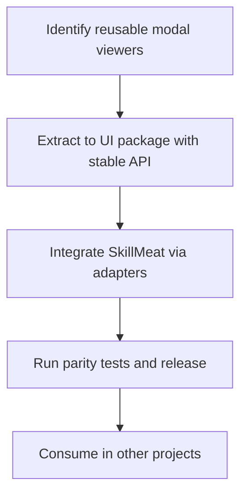

# PRD: SkillMeat UI Package Extraction Program

**Feature Name:** SkillMeat UI Package Extraction Program

**Filepath Name:** `skillmeat-ui-package-extraction-v1`

**Date:** 2026-03-04

**Author:** Codex (GPT-5)

**Version:** 1.0

**Status:** Planned

**Priority:** HIGH

**Scope:** Frontend architecture refactor with zero intended end-user behavior changes.

---

## 1. Executive Summary

SkillMeat's modal and viewer components are currently implemented inside the web app codebase, which blocks straightforward reuse in other projects and encourages copy/paste composition. This initiative establishes a dedicated UI package and extraction strategy so shared components can be consumed both by SkillMeat and external applications without introducing regressions.

**Key Outcomes:**
- A versioned, portable UI package is introduced and integrated into SkillMeat.
- Modal viewer components are extracted in waves, beginning with content viewer panes.
- Existing app behavior, accessibility, and performance remain stable during migration.

---

## 2. Context & Background

### Current State

- Artifact modal UI surfaces live in `skillmeat/web/components/entity/*` and related local hooks/utilities.
- Analysis in `.claude/analysis/CONTENT-VIEWER-README.md` and linked docs identifies high-confidence extraction candidates, especially around content viewer functionality.
- Tiered extraction readiness shows fully generic units (e.g., `FileTree`, `FrontmatterDisplay`, frontmatter utilities) and domain-coupled units that require adapters.

### Problem Space

- Reusing modal viewer surfaces in other projects requires direct code copying from SkillMeat.
- Domain concerns and render concerns are partially intertwined, especially in data-fetch hooks and tab-specific orchestration.
- There is no package-level contract for design tokens, primitives, versioning, and compatibility.

### Current Alternatives / Workarounds

- Copy component files into downstream projects and manually patch imports.
- Reimplement comparable UI from scratch.
- Use ad-hoc wrappers around existing app components.

These options create drift, inconsistent UX, and duplicated maintenance.

### Architectural Context

- Target architecture introduces a reusable package consumed by SkillMeat as first-party dependency.
- View components should be portable and backend-agnostic.
- Domain-specific adapters remain in SkillMeat.

---

## 3. Problem Statement

SkillMeat lacks a reusable UI package boundary for modal viewer components, making cross-project reuse costly and error-prone.

**User Story:**
> As a SkillMeat maintainer building multiple products, when I need artifact viewer UI in another project, I currently duplicate and rewire components instead of consuming a supported package.

**Technical Root Causes:**
- No package/workspace boundary for shared UI assets.
- Viewer components and data acquisition are coupled in key paths.
- No stable public API and versioning policy for extracted components.

---

## 4. Goals & Success Metrics

### Primary Goals

**Goal 1: Establish UI Package Foundation**
- Create a maintainable package structure with clear public exports and semantic versioning.

**Goal 2: Preserve SkillMeat Runtime Behavior**
- Migrate consumption in-app without functional regressions.

**Goal 3: Enable External Reuse**
- Make extracted components usable in non-SkillMeat projects with documented integration patterns.

### Success Metrics

| Metric | Baseline | Target | Measurement Method |
|--------|----------|--------|-------------------|
| Portable component modules in package | 0 | >= 1 production module (content viewer) in v1 | Package export inventory |
| SkillMeat modal regression count after migration | Unknown | 0 P0/P1 regressions | CI + manual QA checklist |
| Extraction of identified Tier-1 content viewer units | 0% | 100% of approved v1 slice | Migration checklist completion |
| External adoption readiness | No docs/examples | One documented consumer path + example usage | README/examples review |

---

## 5. User Personas & Journeys

**Primary Persona: SkillMeat Frontend Engineer**
- Needs: Extract once, consume everywhere, maintain parity in-app.
- Pain Point: Heavy coupling and repetitive migration effort.

**Secondary Persona: Internal Product Team Reusing SkillMeat UI**
- Needs: Drop-in viewer primitives for modal and non-modal contexts.
- Pain Point: No stable package contract to consume.

### High-level Flow

---

## 6. Requirements

### 6.1 Functional Requirements

| ID | Requirement | Priority | Notes |
| :-: | ----------- | :------: | ----- |
| FR-1 | Create a reusable UI package for SkillMeat-owned components | Must | Initial package added to repository and integrated with web app toolchain |
| FR-2 | Expose portable viewer components through stable public exports | Must | No private-path imports from consumers |
| FR-3 | Separate domain-specific logic into SkillMeat adapter layer | Must | Package remains backend/domain agnostic |
| FR-4 | Support both modal and non-modal embedding of extracted viewers | Must | Composition-friendly APIs |
| FR-5 | Migrate SkillMeat modal usage to package consumption incrementally | Must | Wave-based rollout to reduce risk |
| FR-6 | Document migration and consumer integration patterns | Should | Include examples and compatibility notes |
| FR-7 | Define versioning and release policy for package changes | Should | SemVer and changelog discipline |
| FR-8 | Establish parity test harness during migration | Must | Prevent behavior drift |

### 6.2 Non-Functional Requirements

**Performance:**
- Viewer rendering and interaction latency must not regress versus pre-migration baseline.
- Optional heavy editors (e.g., CodeMirror) should support lazy-loading boundaries when needed.

**Accessibility:**
- Existing keyboard navigation and ARIA patterns must be preserved.
- No regressions in tree navigation and collapsible metadata surfaces.

**Reliability:**
- Migration must support safe rollback to local implementations if a regression is detected.

**Maintainability:**
- Public API surface is explicit and type-safe.
- Domain adapters in SkillMeat are isolated and testable.

---

## 7. Scope

### In Scope

- Creating and integrating a reusable UI package structure.
- Initial extraction wave for artifact modal content viewers.
- Follow-on extraction roadmap for additional modal tab viewer surfaces.
- Contract tests and migration safety gates.

### Out of Scope

- Backend API redesign.
- Full modal container extraction in v1.
- Rebranding or broad visual redesign of existing modal UI.

---

## 8. Dependencies & Assumptions

### External Dependencies

- React 19 compatibility across package consumer and SkillMeat web app.
- TanStack Query, Radix primitives, Tailwind-compatible styling approach.

### Internal Dependencies

- Existing modal architecture in `skillmeat/web/components/entity/unified-entity-modal.tsx`.
- Analysis artifacts in `.claude/analysis/CONTENT-VIEWER-README.md` and linked docs.

### Assumptions

- Package lives in the existing repository (monorepo-style layout) for first release.
- SkillMeat remains first consumer during stabilization.
- Initial release targets internal reuse first, external publication second.

---

## 9. Risks & Mitigations

| Risk | Impact | Likelihood | Mitigation |
| ----- | :----: | :--------: | ---------- |
| Behavioral regressions during import migration | High | Medium | Parity tests, phased rollout, rollback switch |
| Styling divergence between package and app | Medium | Medium | Shared token strategy + documented requirements |
| API over-coupling to SkillMeat data model | High | Medium | Adapter contracts and generic component props |
| Maintenance overhead from dual implementations | Medium | Low | Time-box dual-stack period; remove legacy imports per phase gate |

---

## 10. Target State (Post-Implementation)

- `@skillmeat/ui` (or approved final package name) is the source of truth for extracted modal viewer primitives.
- SkillMeat consumes extracted components through package imports and local adapter glue only.
- Additional projects can consume the same components without importing SkillMeat-specific types.
- Changes to shared UI happen once and propagate via package version updates.

---

## 11. Overall Acceptance Criteria (Definition of Done)

- [ ] UI package exists with build/test/lint/typecheck integration.
- [ ] Initial content viewer extraction is complete and consumed in SkillMeat.
- [ ] No critical functional, accessibility, or performance regressions in migrated modal paths.
- [ ] Migration and consumer documentation is complete.
- [ ] Follow-on tab extraction roadmap is published and linked.

---

## 12. Implementation Link

Primary implementation plan:
- `/docs/project_plans/implementation_plans/refactors/skillmeat-ui-package-extraction-v1.md`

Initial slice implementation plan:
- `/docs/project_plans/implementation_plans/refactors/artifact-modal-content-viewer-extraction-v1.md`
