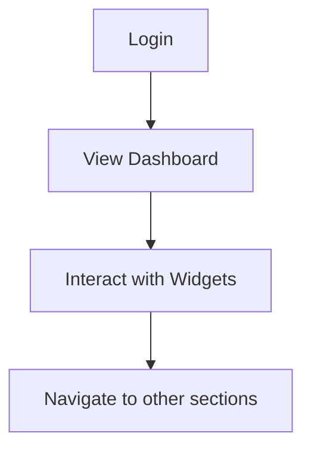

# Feature Brief & Metadata

**Feature Name:**

> UI/UX Refresh and Design System Unification

**Filepath Name:**

> `ui-refresh-v1`

**Date:**

> 2025-12-16

**Author:**

> Gemini CLI Agent

**Related Epic(s)/PRD ID(s):**

> N/A

**Related Documents:**

> N/A

---

## 1. Executive Summary

This document outlines the requirements for a comprehensive UI/UX refresh of the SkillMeat web application. The goal is to create a more modern, visually appealing, and user-friendly experience. This initiative includes a new logo, a new color palette, updated typography, a redesigned dashboard layout, and improved component designs. A key outcome is the establishment of a unified design language that can be shared between the web application and the CLI, creating a more cohesive brand and user experience.

**Priority:** HIGH

**Key Outcomes:**
- A modern and professional UI for the SkillMeat web application.
- An improved user experience that is more intuitive and engaging.
- A unified design language that can be applied to both the web and CLI applications.

---

## 2. Context & Background

### Current State

The SkillMeat web application is a dashboard for managing "Claude Code artifacts." The current UI is functional but lacks a strong visual identity and a modern user experience. The color palette is not well-defined, the typography is generic, and the layout is simple.

### Problem Space

The current UI does not reflect the innovative nature of the SkillMeat product. It can be perceived as dated and may not provide the best user experience. There is no clear design language, which could lead to inconsistencies as the application grows.

### Current Alternatives / Workarounds

There are no alternatives or workarounds, as this is a foundational aspect of the application.

### Architectural Context

The web application is built on a modern stack:
- **Framework**: Next.js (with App Router)
- **Language**: TypeScript
- **Styling**: Tailwind CSS
- **Component Library**: Likely `shadcn/ui`
- **Charting**: `recharts`

---

## 3. Problem Statement

**User Story Format:**
> "As a developer using SkillMeat, when I interact with the web application, I see a dated and inconsistent UI, which makes the experience less enjoyable and professional than I would expect from a modern developer tool."

**Technical Root Cause (if known):**
- Lack of a defined design system.
- Inconsistent use of colors and typography.
- Basic layout and component styling.

---

## 4. Goals & Success Metrics

### Primary Goals

**Goal 1: Modernize the UI**
- Description: Update the visual appearance of the application to be modern and professional.
- Measurable success criteria: The new UI is implemented and receives positive feedback from users.

**Goal 2: Improve User Experience**
- Description: Enhance the usability and intuitiveness of the application.
- Measurable success criteria: User engagement metrics (e.g., time on page, feature adoption) improve.

**Goal 3: Unify Design Language**
- Description: Create a consistent design language for the web and CLI applications.
- Measurable success criteria: A style guide is created and applied to both the web and CLI.

### Success Metrics

| Metric | Baseline | Target | Measurement Method |
|--------|----------|--------|-------------------|
| User Satisfaction | TBD | >80% satisfaction | User surveys |
| Engagement | TBD | +20% | Analytics |

---

## 5. User Personas & Journeys

### Personas

**Primary Persona: Developer**
- Role: A developer who uses SkillMeat to manage their Claude Code artifacts.
- Needs: An efficient, intuitive, and visually pleasing interface to manage their artifacts.
- Pain Points: The current UI is functional but not inspiring or particularly easy on the eyes for long work sessions.

### High-level Flow

The user journey for the UI refresh will not change the core functionality, but will improve the experience at each step.

---

## 6. Requirements

### 6.1 Functional Requirements

| ID | Requirement | Priority | Notes |
| :-: | ----------- | :------: | ----- |
| FR-1 | Create a new SVG logo | Must | The logo should be simple, modern, and reflect the purpose of the application. |
| FR-2 | Define a new color palette | Must | The palette should be modern and professional, with a primary brand color and accent colors for different states. |
| FR-3 | Update typography | Must | Use modern, legible fonts for headings and body text. |
| FR-4 | Redesign the dashboard layout | Must | Implement a sidebar for navigation and a main content area with a header. |
| FR-5 | Redesign dashboard widgets | Must | Improve the visual design of the stats cards and charts. |
| FR-6 | Apply design language to CLI | Should | Use the new color palette in the CLI for a cohesive experience. |

### 6.2 Non-Functional Requirements

**Performance:**
- The new UI should not negatively impact the application's performance. Page load times should remain fast.

**Accessibility:**
- The UI should be accessible, following WCAG 2.1 AA guidelines.

**Reliability:**
- The UI refresh should not introduce any new bugs or regressions.

---

## 7. Scope

### In Scope

- New logo design and implementation.
- New color palette and typography.
- Redesign of the main dashboard page, including layout and widgets.
- Creation of a basic style guide for the CLI.

### Out of Scope

- Major changes to the application's functionality.
- Redesign of pages other than the main dashboard (for now).
- A complete, interactive CLI application (the focus is on the design language).

---

## 8. Dependencies & Assumptions

### External Dependencies

- **next/font**: For loading Google Fonts.

### Internal Dependencies

- The existing Next.js application.

### Assumptions

- The user will approve the proposed design direction.
- The `shadcn/ui` component library is in use and can be extended.

---

## 9. Risks & Mitigations

| Risk | Impact | Likelihood | Mitigation |
| ----- | :----: | :--------: | ---------- |
| User dissatisfaction with the new design | Medium | Low | Gather feedback early and iterate on the design. |
| Performance degradation | Low | Low | Monitor performance metrics before and after the refresh. |

---

## 10. Target State (Post-Implementation)

**User Experience:**
- Users will be greeted with a modern, visually appealing dashboard.
- Navigation will be more intuitive with the new sidebar.
- Data will be easier to consume thanks to redesigned widgets.

**Technical Architecture:**
- The new design will be implemented using the existing Tailwind CSS and Next.js infrastructure.
- A new logo and favicon will be in place.
- The color palette and fonts will be updated globally.

---

## 11. Overall Acceptance Criteria (Definition of Done)

### Functional Acceptance

- [x] New SVG logo is created and implemented.
- [x] New favicon is created and implemented.
- [x] Color palette and typography are updated.
- [x] New dashboard layout with sidebar and header is implemented.
- [ ] Dashboard widgets are redesigned.
- [ ] CLI design language is updated.

---

## 12. Assumptions & Open Questions

### Assumptions

- The user has access to the Google Fonts service.
- The existing `recharts` library is sufficient for the chart redesign.

### Open Questions

- [ ] **Q1**: What are the other pages that need to be redesigned after the dashboard?
  - **A**: TBD

---

## 13. Appendices & References

N/A

---

## Implementation

### Phased Approach

**Phase 1: Design System Foundation (In Progress)**
- Duration: 1 day
- Tasks:
  - [x] Create a new SVG logo.
  - [x] Create a new favicon.
  - [x] Update the color palette and typography.

**Phase 2: Layout and Widget Redesign**
- Duration: 1 day
- Tasks:
  - [x] Implement the new dashboard layout with a sidebar and header.
  - [ ] Redesign the dashboard widgets.

**Phase 3: CLI Integration**
- Duration: 1 day
- Tasks:
  - [ ] Update the CLI to use the new design language.

---
