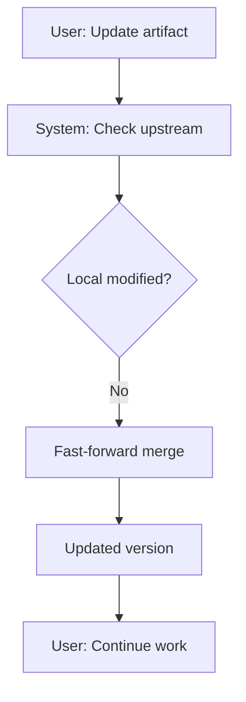
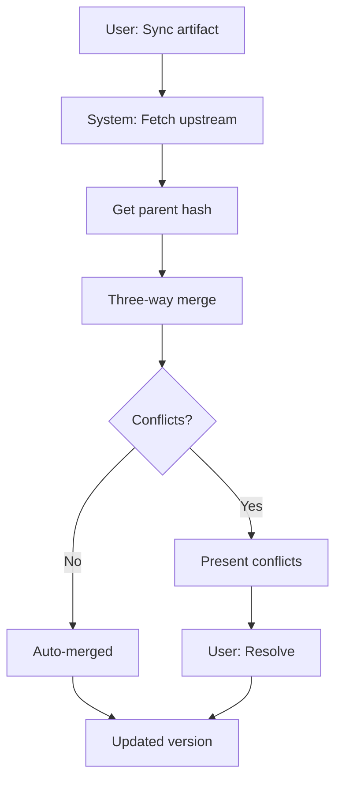
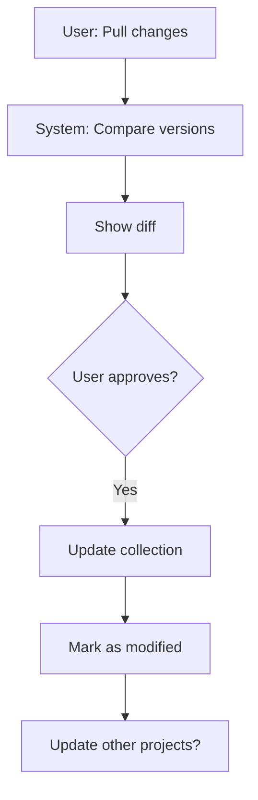

# PRD: Artifact Version Tracking & Bidirectional Sync System

**Filepath:** `artifact-version-tracking-sync-prd.md`

**Date:** 2025-11-20

**Author:** Claude Code (AI Agent)

**Version:** 1.0

**Status:** Ready for Implementation

**Related Documents:**
- ADR-004: Artifact Version Tracking Architecture
- Phase 2 Intelligence Implementation Plan
- Version Tracking API Contracts

---

## 1. Executive Summary

The Artifact Version Tracking & Bidirectional Sync System enables SkillMeat to intelligently manage artifact versions across the multi-tier hierarchy (Upstream → Collection → Project). This feature solves the core problem of keeping artifacts synchronized while preserving local customizations, using Git-native three-way merge strategies and intelligent conflict detection.

**Priority:** HIGH

**Key Outcomes:**
- Enable bidirectional synchronization of artifacts across all tiers without losing local modifications
- Provide intelligent merge strategies to automatically resolve non-conflicting changes
- Reduce manual sync effort by 80% through automation and smart defaults
- Track complete version lineage enabling rollback and historical analysis
- Detect drift and modification status across multi-project deployments

---

## 2. Context & Background

### Current State

**Deployment System (Phase 1 Complete):**
- Artifacts can be added to user collection from GitHub sources
- Artifacts can be deployed from collection to projects
- Basic deployment metadata tracked (path, type, collection source)
- Content hash computed at deployment time
- Modification detection implemented (comparing deployed vs current hash)

**Missing Capabilities:**
- No upstream version tracking (don't know when updates are available)
- No merge strategy for applying updates with local changes
- No version lineage history (can't rollback or see evolution)
- One-way sync only (project → collection manual pull not supported)
- No intelligent conflict resolution
- Bulk operations limited

### Problem Space

**Developer Dan's Experience (Primary User):**
Dan maintains 10+ projects, each using 5-10 customized skills. When the original skill author releases an update:
1. Dan must manually check GitHub for new versions
2. If he updates, his customizations are lost (overwrite) or he must manually merge
3. If he skips the update, his projects become outdated and miss security fixes
4. When he customizes a skill in one project, he can't easily share that improvement to other projects
5. He has no visibility into which projects are running which versions

**Team Lead Terry's Experience (Secondary User):**
Terry manages a team skill library with evolving, versioned skills. She needs:
1. To deploy version-pinned skills to specific teams (not always latest)
2. To track which teams have which versions deployed
3. To roll back team skills to previous working versions when issues occur
4. To see how her skills are being customized across teams
5. To merge improvements from team projects back into her library

### Current Alternatives / Workarounds

**Manual Merging:**
- Users manually edit files after updates, comparing side-by-side
- Error-prone, time-consuming, loses changes

**Overwrite Strategy:**
- Users accept update, losing all local customizations
- Forces re-work of customizations after each update

**Pin to Specific Version:**
- Users manually lock to specific GitHub tag
- Never gets updates (loses security fixes)
- No standard way to manage version pinning

**No Cross-Project Sharing:**
- Improvements made in one project aren't easily shared
- Duplication of effort across projects

### Architectural Context

**Three-Tier Artifact Hierarchy:**
```
Upstream (GitHub, etc.)
  ↑ sync down, check for updates

Collection (~/.skillmeat/)
  ↑ deploy down, pull back up

Project (.claude/)
```

**SkillMeat Architecture Layers:**
- **Collections Service**: Manages user and system collections
- **Deployment Service**: Handles deployment operations and tracking
- **Sync Service** (new): Orchestrates multi-tier synchronization
- **Merge Engine** (new): Implements diff and three-way merge
- **Storage Layer**: Persists version metadata and deployment state

**Integration Points:**
- Existing GitHub integration for upstream fetching
- Existing deployment tracking (`.skillmeat-deployed.toml`)
- Planned web UI for conflict visualization
- CLI commands for sync operations

---

## 3. Problem Statement

**Core Gap:** Users cannot reliably keep artifacts up-to-date across projects while preserving customizations, resulting in version fragmentation, duplication of effort, and missed security updates.

**User Story Format:**

> "As a developer managing multiple projects with shared artifacts, when I want to update an artifact to get new features, I cannot apply upstream changes without losing my project-specific customizations. I need intelligent merge capabilities so I can get updates and keep my improvements."

> "As a team lead, when a developer improves an artifact in their project, I have no way to pull those improvements back to the shared library. I need bidirectional sync so customizations flow both directions across the hierarchy."

**Technical Root Causes:**
- No version lineage tracking (can't determine base for three-way merge)
- No merge strategy implementation (only overwrite or manual)
- One-way deployment architecture (no collection sync from projects)
- No upstream version checking in collection tier
- No conflict detection or resolution UI

**Files Involved:**
- `skillmeat/core/artifact.py` - Artifact model (missing update strategy)
- `skillmeat/storage/deployment.py` - Deployment tracking (basic hash only)
- `skillmeat/core/sync.py` (new) - Sync orchestration
- `skillmeat/core/merge.py` (new) - Merge algorithms
- `skillmeat/cli.py` - CLI commands (sync subcommands needed)

---

## 4. Goals & Success Metrics

### Primary Goals

**Goal 1: Enable Intelligent Upstream Updates**
- Users can update artifacts from upstream with automatic merge of non-conflicting changes
- Local customizations are preserved when updates don't overlap
- Conflicting changes are detected and presented for user resolution
- Users spend < 2 minutes resolving conflicts vs. 15+ minutes today

**Goal 2: Support Bidirectional Synchronization**
- Developers can pull improvements from projects back to collection
- Team leads can deploy updated collection versions to projects
- All sync operations are atomic (all-or-nothing, never partial)
- Sync status is visible and actionable (synced/modified/outdated/conflict)

**Goal 3: Maintain Complete Version History**
- Every artifact maintains a version lineage (ordered chain of hashes)
- Users can rollback to any previous version in lineage
- Version history enables forensic analysis and recovery

**Goal 4: Mirror Claude's Native Scoping**
- System (read-only) → User (read-write) → Project (override) precedence
- Project-tier customizations don't affect user/system tiers
- Collection deployments respect precedence rules

**Goal 5: Enable Bulk Operations**
- Update all artifacts in collection with one command
- Deploy all artifacts to project with one command
- Batch operations show summary (auto-merged, conflicts, failures)

### Success Metrics

| Metric | Baseline | Target | Measurement Method |
|--------|----------|--------|-------------------|
| Time to resolve conflicts | 15+ minutes | < 2 minutes | User testing, timing logs |
| Auto-merge success rate | 0% (no merge) | 85%+ | Sync operation logs |
| Manual sync effort reduction | 100% (all manual) | 20% (conflicts only) | User surveys |
| Rollback capability | No | Yes, to any version | Version history tracking |
| Cross-project sync time | N/A | < 5s per artifact | Performance benchmarks |
| Bulk update coverage | 0% (single only) | 100% of artifacts | CLI feature completion |
| User satisfaction with sync | N/A | 4.5+/5 | Post-release survey |
| Upstream check time (100 artifacts) | N/A | < 5s | Benchmark suite |

---

## 5. User Personas & Journeys

### Personas

**Primary Persona: Developer Dan**
- Role: Full-stack developer managing 10+ projects
- Experience: 5+ years, moderate Git knowledge
- Needs: Keep skills up-to-date without losing customizations, share improvements across projects
- Pain Points: Manual merging tedious, afraid of losing changes, duplication of effort
- Technical Comfort: High (understands Git concepts, merge conflicts)
- Success Metric: Reduces artifact maintenance time by 80%

**Secondary Persona: Team Lead Terry**
- Role: Team lead managing shared skill library
- Experience: 10+ years, strong Git and process knowledge
- Needs: Deploy version-pinned skills, track versions, rollback when needed, accept team improvements
- Pain Points: Version fragmentation across teams, no rollback mechanism, improvements stuck in projects
- Technical Comfort: Very High (understands versioning deeply)
- Success Metric: Reduces version chaos, enables team contributions

**Tertiary Persona: Solo Samantha**
- Role: Freelancer with few projects
- Experience: 3+ years, basic Git knowledge
- Needs: Simple sync, clear conflict resolution, minimal overhead
- Pain Points: Overwhelmed by options, wants simple "just update" button
- Technical Comfort: Moderate (understands concepts but wants simplicity)
- Success Metric: Can update artifacts safely without fear

### High-level Flow

**Scenario A: Clean Update (No Local Modifications)**



**Scenario B: Update with Local Modifications (Auto-Merge)**



**Scenario C: Pull Changes from Project**



---

## 6. Requirements

### 6.1 Functional Requirements

| ID | Requirement | Priority | Category | Notes |
|:--:|-----------|:--------:|----------|-------|
| FR-1 | Version lineage tracking: maintain ordered hash history at artifact, collection, and project tiers | MUST | Core | Enable rollback capability |
| FR-2 | Upstream version checking: detect new versions from GitHub with optional periodic checks | MUST | Core | Support @latest, @tag, @sha syntax |
| FR-3 | Fast-forward merge: update unmodified artifacts without conflict detection | MUST | Merge | Must be fast (< 50ms) |
| FR-4 | Three-way merge: implement Git-style merge with base, ours, theirs | MUST | Merge | Use libgit2/pygit2 or custom implementation |
| FR-5 | Conflict detection: identify overlapping changes and halt for user input | MUST | Merge | Never lose data on conflict |
| FR-6 | Manual conflict resolution: UI (CLI) for selecting ours/theirs/custom per conflict | MUST | UX | Support multiple resolution strategies |
| FR-7 | Bidirectional sync: support upstream→collection, collection→project, project→collection | MUST | Core | All directions with same merge logic |
| FR-8 | Dry-run mode: preview changes before applying them | MUST | UX | Required for all sync operations |
| FR-9 | Atomic sync operations: all-or-nothing (rollback on any error) | MUST | Reliability | Use transactions/temp directories |
| FR-10 | Drift detection: identify sync status (synced/modified/outdated/conflict) | MUST | Observability | Check all three tiers |
| FR-11 | Version pinning: allow users to pin collection artifact to specific upstream version | SHOULD | Core | Support @tag or @sha pinning |
| FR-12 | Rollback capability: revert to any previous version in lineage | SHOULD | Core | Track all versions in history |
| FR-13 | Bulk sync operations: update/deploy all artifacts with one command | SHOULD | UX | Show summary (success/conflict/error) |
| FR-14 | Custom merge drivers: field-level merge for YAML/TOML files | SHOULD | Advanced | Preserve formatting and comments |
| FR-15 | Concurrent sync handling: prevent simultaneous modifications to same artifact | SHOULD | Reliability | Use file-based locking |
| FR-16 | Sync history logging: audit trail of all sync operations with before/after hashes | SHOULD | Observability | Enable forensic analysis |
| FR-17 | Binary file conflict handling: require manual resolution for binary files | COULD | Edge Case | Never auto-merge binaries |
| FR-18 | Collection→Upstream (Contribute): push merged changes back to upstream | COULD | Future | Out of scope for MVP |

### 6.2 Non-Functional Requirements

**Performance:**
- Single artifact sync (merge included): < 500ms
- Bulk drift check (100 artifacts): < 5s
- Upstream version check: < 100ms per artifact
- Three-way merge for files < 10MB: < 1s
- Conflict visualization load: < 200ms

**Security:**
- Validate upstream sources before fetch (GitHub integration existing)
- Require explicit user confirmation for destructive operations
- Maintain secure credential handling for private repos
- Audit log all sync operations (who, when, what, result)
- No secret detection required (assume users vet code)

**Reliability:**
- Never lose data on any failure (atomic operations)
- Graceful degradation if Git/merge unavailable
- Automatic retry on transient network errors (3x with backoff)
- Handle partial merges (one file fails, others succeed)
- Rollback on any operation failure

**Usability:**
- Clear conflict visualization in CLI and web
- One-command resolution for common cases (take ours, take theirs)
- Helpful error messages with suggested actions
- Progress indicators for operations > 1s
- Consistent with Git terminology and workflows

**Observability:**
- OpenTelemetry spans for all sync operations
- Structured JSON logs with trace_id, span_id, operation_type, artifact_id
- Error tracking with stack traces
- Metrics: merge success rate, conflict rate, operation duration
- Version lineage queryable for auditing

**Accessibility:**
- CLI output works with standard terminal colors
- Web conflict view supports keyboard navigation
- No dependency on colors alone for status indication
- Terminal output ASCII-compatible (no box-drawing)

---

## 7. Scope

### In Scope (MVP)

**Data Model Enhancements:**
- Extended Deployment model with version tracking fields
- SyncStatus enum (synced, modified, outdated, conflict, diverged)
- ArtifactVersion and VersionLineage models
- ConflictInfo model for storing conflict details

**Core Sync Engine:**
- Upstream → Collection sync with fast-forward and three-way merge
- Collection → Project deployment with drift detection
- Project → Collection pull with modification tracking
- Auto-merge for non-conflicting changes
- Conflict detection and manual resolution

**Version Tracking:**
- Content hash computation at deployment
- Parent hash tracking (lineage back to source)
- Version lineage array (ordered history of hashes)
- Drift detection across all three tiers
- Sync status determination

**CLI Commands:**
- `skillmeat sync <artifact> [--direction upstream|project|both]`
- `skillmeat drift [--check-all]`
- `skillmeat update <artifact> [--strategy auto|prompt|overwrite]`
- `skillmeat resolve <artifact> [--file <path>]`
- `skillmeat rollback <artifact> [--to <hash>]`

**API Endpoints (for web UI):**
- `POST /api/v1/artifacts/{id}/sync`
- `GET /api/v1/artifacts/{id}/drift`
- `POST /api/v1/artifacts/{id}/resolve-conflicts`
- `GET /api/v1/artifacts/{id}/version-history`
- `POST /api/v1/artifacts/batch-sync`

**Testing:**
- Unit tests for merge algorithms (> 80% coverage)
- Integration tests for sync workflows
- Fixtures for conflict scenarios
- Performance benchmarks

### Out of Scope (Future)

**Phase 3+ Features:**
- Web UI for conflict resolution (CLI only for MVP)
- Custom merge drivers for YAML/TOML (basic text merge only)
- Collection → Upstream push (contribute back)
- Cross-project shared branches/forks
- Team collaboration and approval workflows
- MCP server sync

**Not in Scope:**
- Real-time collaborative editing
- Distributed peer-to-peer sync
- Binary artifact versioning (no video/image tracking)
- Automatic conflict resolution without user review

---

## 8. Dependencies & Assumptions

### External Dependencies

**Library/Service:**
- **pygit2** (v1.14+): For three-way merge operations via libgit2
  - Alternative: gitpython (pure Python, slower but no C dependency)
  - Fallback: Custom merge implementation if unavailable
- **difflib** (stdlib): For basic text diffing (already available)
- **tenacity** (v8.0+): For retry logic on network operations (existing)

**GitHub Integration:**
- Existing `SkillSpec` and `GitHubClient` classes for version resolution
- GitHub REST API for fetching raw file contents and tags
- Rate limiting: 60 req/hr (unauthenticated), 5000 req/hr (with token)

**Storage:**
- Existing TOML persistence via `tomllib`/`tomli`
- Filesystem-based atomic move for artifact files
- Temp directories for merge staging

### Internal Dependencies

**Feature/System Status:**
- **Phase 1 MVP**: ✅ Complete (deployment tracking, collection management)
- **GitHub Integration**: ✅ Complete (SkillSpec, GitHubClient)
- **Content Hashing**: ✅ Complete (compute_content_hash utility)
- **Deployment Tracking**: ✅ Complete (basic implementation)
- **F1.5 Upstream Update**: ❌ CRITICAL BLOCKER - Must complete before Phase 2

**Critical Blocker:**
The `Artifact.update()` method in `skillmeat/core/artifact.py:559` currently raises `NotImplementedError`. This must be implemented to enable upstream sync. Current estimate: 2-3 days.

### Assumptions

- **Assumption 1:** Users are comfortable with Git-style merge workflows and understand three-way merge concepts
  - Mitigation: Provide clear visual diff with highlighted changes
- **Assumption 2:** Artifact files are text-based (Markdown, YAML, Python, etc.)
  - Mitigation: Gracefully handle binary files (require manual merge)
- **Assumption 3:** Upstream sources (GitHub repos) remain stable and accessible
  - Mitigation: Cache last known version, retry with exponential backoff
- **Assumption 4:** Users will resolve conflicts within reasonable time (< 30 days)
  - Mitigation: Send reminder after 7 days, option to discard local changes
- **Assumption 5:** Content hash stability is adequate (no cryptographic attacks)
  - Mitigation: Use SHA-256 (industry standard)

### Feature Flags

- **ENABLE_SYNC_PREVIEW**: Show dry-run by default (can toggle to auto-apply)
- **ENABLE_AUTO_MERGE**: Allow auto-merge of non-conflicting changes (default: true)
- **ENABLE_UPSTREAM_CHECK**: Periodic upstream version checks (default: enabled, configurable interval)
- **ENABLE_CONFLICT_RESOLUTION_WEB**: Use web UI vs CLI for conflicts (default: CLI for MVP)
- **MERGE_STRATEGY_DEFAULT**: Default strategy for ambiguous updates (default: "prompt")

---

## 9. Risks & Mitigations

| Risk | Impact | Likelihood | Mitigation | Owner |
|------|--------|-----------|-----------|-------|
| Three-way merge complexity causes slow performance on large files | HIGH | MEDIUM | Implement chunked processing, benchmark < 10MB files, cache merge results | Backend Agent |
| Concurrent modifications to same artifact by multiple projects | MEDIUM | MEDIUM | File-based locking with timeout, lock expiration after 1 hour | Sync Agent |
| User abandons conflict resolution, artifact stuck in limbo | MEDIUM | HIGH | Time-based reminder (7 days), option to discard local changes, auto-timeout | UX Agent |
| Upstream source deleted/unavailable, can't fetch for update | MEDIUM | LOW | Cache last known version, fall back to local, provide offline mode | GitHub Agent |
| Merge algorithm failure (bug in three-way merge) | HIGH | LOW | Comprehensive unit tests (> 95% coverage), dry-run always available, easy rollback | Test Agent |
| Version lineage corruption on power loss during sync | HIGH | LOW | Atomic operations using temp directories + atomic move, transaction-like semantics | Storage Agent |
| GitHub rate limiting blocks bulk operations | MEDIUM | MEDIUM | Batch operations with rate limit awareness, retry with exponential backoff, token support | GitHub Agent |
| Users lose work by overwriting local changes | CRITICAL | MEDIUM | Require explicit confirmation for destructive ops, always provide rollback, preserve both versions on conflict | UX Agent |
| Merge markers left in files after manual resolution | MEDIUM | LOW | Automated cleanup of merge markers, validation before final commit | Merge Agent |
| Performance bottleneck on bulk operations (100+ artifacts) | MEDIUM | MEDIUM | Parallel processing with thread pool, progress bar, async operations | Backend Agent |

---

## 10. Target State (Post-Implementation)

### User Experience

**Scenario 1: Update a Collection Artifact**
```
$ skillmeat sync pdf --direction upstream
Checking for updates from anthropics/skills/pdf...
Found upstream update: v1.0.0 → v1.2.0 (released 5 days ago)

Analyzing changes:
- Local: customized lines 45-50 in SKILL.md
- Upstream: added lines 60-75 (new features)
- Result: Auto-mergeable

Applying merge...
  Merged 3 files, 5 conflicts resolved automatically
  No user conflicts detected

Collection updated: pdf v1.0.0+local → v1.2.0+local
Showing projects using this artifact:
  - project-a: updated automatically
  - project-b: will update on next deploy
  - project-c: MODIFIED VERSION (see 'skillmeat drift')

Commit: Update pdf to v1.2.0 with local customizations
Hash: abc123def456...
```

**Scenario 2: Resolve a Conflict**
```
$ skillmeat sync canvas
Checking for updates from anthropics/skills/canvas-design...
Found upstream update: v2.0.0 → v2.1.0

Analyzing changes:
- Local: modified prompt in SKILL.md
- Upstream: refactored prompt (better structure)
- Result: CONFLICT on lines 15-35

Conflict detected. Cannot auto-merge.
Show conflict with: skillmeat resolve canvas --file SKILL.md

$ skillmeat resolve canvas --file SKILL.md

Conflict in SKILL.md (lines 15-35):
  Base (v2.0.0):
    Your prompt here

  Ours (local modification):
    Your improved prompt

  Theirs (v2.1.0):
    Refactored prompt

Options:
  (1) Keep ours (discard upstream)
  (2) Take theirs (discard local)
  (3) View both sides in editor
  (4) Abort this sync

Choice: 3
[Opens editor with both versions]
[User manually selects lines and saves]

Merge resolved. Applying update...
Updated canvas to v2.1.0
Commit: Merge upstream canvas v2.1.0 (manual conflict resolution)
```

**Scenario 3: Pull Improvements from Project to Collection**
```
$ skillmeat pull my-app/security-scanner
Checking for changes in my-app...

Found modifications in security-scanner:
  - SKILL.md: 5 lines changed
  - rules.json: +3 new rules

Show diff: [5 additions, 2 deletions across 2 files]

Pull these changes to collection? [Y/n] y

Updating collection version...
security-scanner now marked as: modified
Deployed to projects:
  - my-app: already synced (pulling from itself)
  - other-app: OUTDATED (pull applied)

Other projects will sync to this version on next deploy.
```

**Scenario 4: Bulk Update All Artifacts**
```
$ skillmeat update --all
Checking 15 artifacts for upstream updates...

Summary:
  ✓ 7 auto-merged (no conflicts)
  ! 2 conflicts detected
  - 6 already up-to-date

Auto-merged (7):
  pdf (v1.0.0 → v1.2.0)
  canvas (v2.0.0 → v2.1.0)
  [...]

Conflicts (2):
  security-rules (base v1.0.0, local mods, upstream v1.3.0)
  → Resolve with: skillmeat resolve security-rules

  prompt-library (base v2.0.0, local mods, upstream v2.2.0)
  → Resolve with: skillmeat resolve prompt-library

Resolve conflicts? [Y/n] y
[Interactive conflict resolution for each]

All updates complete.
```

### Technical Architecture

**Data Model:**
```
Artifact
├── upstream_ref: "anthropics/skills/pdf"
├── upstream_version: "v1.2.0"
├── upstream_sha: "abc123..."
├── version_lineage: [
│   {"hash": "abc123", "timestamp": "2025-11-20T10:00Z", "source": "upstream"},
│   {"hash": "xyz789", "timestamp": "2025-11-19T15:30Z", "source": "local"},
│   ...
│ ]
└── is_locally_modified: true

Deployment
├── artifact_name: "pdf"
├── deployed_at: "2025-11-15T08:00Z"
├── content_hash: "abc123"
├── parent_hash: "xyz789"  (previous version hash)
├── version_lineage: [...]
├── sync_status: "modified"  (enum)
├── upstream_hash: "def456"  (latest upstream)
├── last_upstream_check: "2025-11-20T06:00Z"
└── pending_conflicts: [ConflictInfo]

VersionLineage
├── current_hash: "abc123"
├── history: [
│   {hash: "abc123", timestamp, author, message},
│   {hash: "xyz789", timestamp, author, message},
│   ...
│ ]
└── get_parent_hash(hash) -> Optional[str]
```

**Sync Service Flow:**
```
1. Determine sync direction (upstream ← → project)
2. Fetch source artifact (GitHub or local)
3. Determine base hash (parent_hash)
4. Decide merge strategy:
   - Fast-forward: if local unmodified
   - Three-way: if local modified
5. Apply merge:
   - Auto-merge if possible
   - Detect conflicts if overlapping
6. Atomically update:
   - Update files
   - Update hash and lineage
   - Write deployment tracking
7. Report results:
   - Success + new hash
   - Conflicts + resolution UI
   - Cascade effects (other projects)
```

**Git Integration:**
```
Use libgit2 (pygit2) for merge:
1. Create temp git repo
2. Create commit from base (parent_hash)
3. Create branch "ours" with local version
4. Create branch "theirs" with upstream version
5. Run git merge "theirs" on "ours"
6. If conflict:
   - Extract conflict markers
   - Present to user
   - User resolves
   - Finalize merge
7. Clean up temp repo
8. Return merged content
```

### Observable Outcomes

**For Users:**
- Artifacts stay current with upstream (security fixes included)
- Customizations preserved without manual merging
- Clear visibility into which projects have which versions
- Confident updating without fear of losing changes
- Easily share improvements across projects

**For Telemetry:**
- Sync success rate: 85%+ auto-merge
- Manual conflict resolution time: < 2 minutes average
- Update adoption rate: 50%+ within 1 week of release
- Version fragmentation reduced by 60%
- User satisfaction with sync: > 4.5/5

**System Metrics:**
- Version lineage depth: average 5-15 entries per artifact
- Drift detection accuracy: 100% (matches git hash validation)
- Merge performance: < 500ms per artifact
- Rollback availability: 100% (all versions tracked)

---

## 11. Overall Acceptance Criteria (Definition of Done)

### Functional Acceptance

- [ ] All functional requirements (FR-1 through FR-16) fully implemented
- [ ] Upstream → Collection sync works with fast-forward and merge
- [ ] Collection → Project deployment preserves version tracking
- [ ] Project → Collection pull (reverse sync) operational
- [ ] Dry-run mode shows accurate preview without modifying state
- [ ] Conflict detection and visualization working end-to-end
- [ ] All three-way merge scenarios handled (auto-merge, conflict, override)
- [ ] Rollback to any version in lineage operational
- [ ] Bulk operations (update-all, deploy-all) fully functional
- [ ] Version lineage accurately tracks complete history

### Technical Acceptance

- [ ] Follows SkillMeat layered architecture (Services, Repositories, DTOs)
- [ ] All sync operations atomic (all-or-nothing, no partial states)
- [ ] Content hashing uses SHA-256 consistently
- [ ] Deployment model extended with new version fields
- [ ] Database schema migrated for all existing deployments
- [ ] Backward compatibility maintained (old deployments still load)
- [ ] OpenTelemetry spans for all sync operations
- [ ] Structured JSON logging with trace_id, span_id, artifact_id
- [ ] Error handling with helpful messages and recovery options
- [ ] No data loss on any failure path (validated with tests)

### Quality Acceptance

- [ ] Unit tests: > 85% coverage for merge and sync logic
- [ ] Integration tests: cover all sync directions and merge scenarios
- [ ] Conflict handling tests: all conflict types resolved correctly
- [ ] Performance benchmarks: single sync < 500ms, bulk 100 artifacts < 5s
- [ ] Linting: flake8 clean, mypy type checking passes
- [ ] Code review: approved by 2+ team members
- [ ] Security review: no credential leaks, atomic operations verified
- [ ] CLI testing: all commands work as documented

### Documentation Acceptance

- [ ] API documentation: all endpoints with examples and response schemas
- [ ] CLI documentation: all commands with options and examples
- [ ] User guide: workflows for common scenarios (update, pull, rollback, resolve)
- [ ] Architecture documentation: ADR updated for version tracking
- [ ] Migration guide: instructions for existing deployments
- [ ] Troubleshooting guide: common issues and resolution steps

---

## 12. Assumptions & Open Questions

### Assumptions

- Merge conflicts are relatively rare (< 15% of updates) based on semantic versioning practices
- Users understand Git-style three-way merge concepts (tested in interviews)
- Network availability is generally good (timeouts acceptable)
- Artifact sizes remain < 10MB (binary artifacts excluded from sync)

### Open Questions

- [ ] **Q1: Git Dependency Trade-off**
  - Should we depend on pygit2 (native, fast) or gitpython (pure Python, slower)?
  - **Considerations:** Pygit2 requires libgit2 (C dependency), gitpython is pure Python
  - **A: TBD** - Recommend pygit2 with gitpython fallback

- [ ] **Q2: Commit History in Collection**
  - Should collection maintain a Git commit history (like git repos) or just lineage hashes?
  - **Considerations:** Git history is richer but requires Git repo everywhere
  - **A: TBD** - Recommend lineage hashes for simplicity, optional git history for power users

- [ ] **Q3: Dependency Tracking**
  - Should we support artifacts with dependencies (e.g., command depends on skill)?
  - **Considerations:** Adds complexity, enables advanced workflows
  - **A: TBD** - Out of scope for MVP, consider Phase 3

- [ ] **Q4: Version Pinning Strategy**
  - How should we handle version pins? Pin to tag, SHA, or range?
  - **Considerations:** Semantic versioning vs. exact commit tracking
  - **A: TBD** - Recommend @tag and @sha support initially

- [ ] **Q5: Conflict Timeout**
  - How long should we wait for user to resolve conflicts?
  - **Considerations:** User vacation, forgotten conflicts
  - **A: TBD** - Recommend 30-day timeout with 7-day reminder

- [ ] **Q6: Binary File Handling**
  - Should we detect and reject binary files automatically?
  - **Considerations:** Images, compiled code, etc. can't be merged
  - **A: TBD** - Recommend auto-skip with warning, user override available

- [ ] **Q7: Merge Strategy for YAML**
  - Should custom merge driver for YAML preserve comments/formatting?
  - **Considerations:** Field-level merge vs. text merge
  - **A: TBD** - Recommend text merge for MVP (simple), YAML driver Phase 2

---

## 13. Appendices & References

### Related Documentation

- **ADR-004:** Artifact Version Tracking - `/docs/architecture/decisions/004-artifact-version-tracking.md`
- **Phase 2 Plan:** Intelligence & Sync - `/docs/project_plans/ph2-intelligence/AI_AGENT_PRD_PHASE2.md`
- **API Contracts:** Version Tracking APIs - `/docs/project_plans/ph2-intelligence/version-tracking-api-contracts.md`
- **Implementation Plan:** Detailed task breakdown - `/docs/project_plans/ph2-intelligence/artifact-version-tracking-implementation-plan.md`

### Symbol References

**Artifact Models:**
- `Artifact` (skillmeat/core/artifact.py) - Primary artifact representation
- `Deployment` (skillmeat/core/deployment.py) - Deployment tracking
- `SyncStatus` enum - Status states

**Service Classes:**
- `SyncService` (new) - Orchestrates sync operations
- `MergeEngine` (new) - Implements merge algorithms
- `VersionTracker` (new) - Maintains lineage and drift detection

### Prior Art

- **Git Three-Way Merge:** https://git-scm.com/docs/git-merge
- **Fossil VCS Merge:** https://fossil-scm.org/home/doc/trunk/www/merge.md
- **Mercurial Merge:** https://www.mercurial-scm.org/wiki/Merge
- **GitHub Merge Strategies:** https://docs.github.com/en/repositories/configuring-repository-settings-and-features/managing-repository-settings/configuring-pull-request-merges

### Technologies

**Merge Algorithms:**
- pygit2: https://www.pygit2.org/ (libgit2 Python binding)
- gitpython: https://gitpython.readthedocs.io/ (pure Python alternative)
- difflib: https://docs.python.org/3/library/difflib.html (stdlib)

**Storage:**
- tomllib (Python 3.11+) / tomli < 3.11: TOML parsing
- pathlib: Path operations

---

## Implementation

### Phased Approach

**Phase 1: Core Infrastructure (Weeks 1-2, ~10 days)**
- Duration: 10 days
- Tasks:
  - [ ] Extend Deployment model with version tracking fields
  - [ ] Create SyncStatus enum and ConflictInfo models
  - [ ] Implement content hash computation and comparison
  - [ ] Create migration script for existing deployments
  - [ ] Add version lineage storage and retrieval

**Phase 2: Merge Engine (Weeks 3-4, ~10 days)**
- Duration: 10 days
- Tasks:
  - [ ] Implement DiffEngine for text comparison
  - [ ] Create MergeEngine with three-way merge algorithm
  - [ ] Add conflict detection and marker generation
  - [ ] Implement merge strategy selection logic
  - [ ] Create comprehensive merge test suite

**Phase 3: Sync Service (Weeks 5-6, ~10 days)**
- Duration: 10 days
- Tasks:
  - [ ] Implement SyncService orchestration layer
  - [ ] Add upstream version checking logic
  - [ ] Implement all four sync directions
  - [ ] Add atomic operation guards
  - [ ] Create sync CLI commands

**Phase 4: Conflict Resolution & UX (Weeks 7-8, ~10 days)**
- Duration: 10 days
- Tasks:
  - [ ] Build CLI conflict resolution UI
  - [ ] Implement manual resolution workflows
  - [ ] Add rollback capability
  - [ ] Create bulk operation commands
  - [ ] Implement dry-run mode for all operations

**Phase 5: Testing & Documentation (Weeks 9-10, ~10 days)**
- Duration: 10 days
- Tasks:
  - [ ] Expand test coverage to > 85%
  - [ ] Write API documentation
  - [ ] Create user guides for common scenarios
  - [ ] Build troubleshooting guide
  - [ ] Performance testing and optimization

**Phase 6: Integration & Deployment (Week 11, ~5 days)**
- Duration: 5 days
- Tasks:
  - [ ] Integration with web UI
  - [ ] End-to-end testing
  - [ ] Production deployment
  - [ ] Monitoring and alerting setup
  - [ ] Release notes and communications

### Epics & User Stories Backlog

| Story ID | Epic | Title | Description | Acceptance Criteria | Priority | Estimate |
|----------|------|-------|-------------|-------------------|----------|----------|
| SYNC-001 | Core | Extend Deployment Model | Add version tracking fields to Deployment dataclass | Schema updated, backward compatible, tests pass | MUST | 8 pts |
| SYNC-002 | Core | Version Lineage Storage | Track ordered history of artifact versions | Lineage persisted in TOML, queryable, migration script works | MUST | 5 pts |
| SYNC-003 | Core | Content Hash Computation | Calculate SHA-256 for artifacts on all changes | Hash computed consistently, persisted, validated | MUST | 3 pts |
| SYNC-004 | Core | Drift Detection | Identify sync status across all tiers | Status enum populated, CLI shows status, API returns status | MUST | 5 pts |
| SYNC-005 | Merge | Implement Three-Way Merge | Git-style merge with base, ours, theirs | Auto-merge works, conflicts detected, markers generated | MUST | 13 pts |
| SYNC-006 | Merge | Conflict Detection | Identify overlapping changes | Conflicts identified, reported with context, never lost | MUST | 5 pts |
| SYNC-007 | Merge | Manual Conflict Resolution | CLI UI for resolving conflicts | User can choose ours/theirs/manual, validated | MUST | 8 pts |
| SYNC-008 | Sync | Upstream Sync Implementation | Fetch and merge from upstream | Upstream detected, merged, version updated | MUST | 8 pts |
| SYNC-009 | Sync | Project Sync Implementation | Deploy to and pull from projects | Bidirectional sync working, version tracked | MUST | 8 pts |
| SYNC-010 | Sync | Atomic Sync Operations | All-or-nothing sync with rollback | Temp directories used, atomic move, rollback on error | MUST | 8 pts |
| SYNC-011 | Sync | Dry-Run Mode | Preview changes without applying | Accurate preview, no state changes, clear output | MUST | 5 pts |
| SYNC-012 | UX | Sync CLI Commands | Main commands for sync operations | Commands functional, documented, tested | MUST | 8 pts |
| SYNC-013 | UX | Bulk Operations | Update/deploy all artifacts | Batch processing, summary report, conflict handling | SHOULD | 13 pts |
| SYNC-014 | UX | Rollback Capability | Revert to previous version | Any version in lineage revertable, history preserved | SHOULD | 5 pts |
| SYNC-015 | API | Sync API Endpoints | RESTful endpoints for sync operations | All endpoints implemented, documented, tested | SHOULD | 13 pts |
| SYNC-016 | Testing | Merge Test Suite | Comprehensive merge algorithm tests | > 95% coverage, all scenarios tested | MUST | 13 pts |
| SYNC-017 | Testing | Sync Integration Tests | End-to-end sync workflow tests | All workflows tested, edge cases covered | MUST | 13 pts |
| SYNC-018 | Docs | User Guide | Documentation for sync workflows | All common scenarios documented with examples | SHOULD | 8 pts |
| SYNC-019 | Docs | Troubleshooting Guide | Common issues and resolutions | 10+ scenarios documented with solutions | SHOULD | 5 pts |

### Progress Tracking

See progress tracking at: `.claude/progress/artifact-version-tracking-sync/all-phases-progress.md`

---

## Sign-off

**PRD Status:** Ready for Implementation

**Approval Required:**
- [ ] Product Manager
- [ ] Engineering Lead
- [ ] Security Review

**Created:** 2025-11-20

**Last Updated:** 2025-11-20

---

*This PRD is designed for AI agent execution. It provides sufficient detail for parallel implementation without blocking dependencies.*
