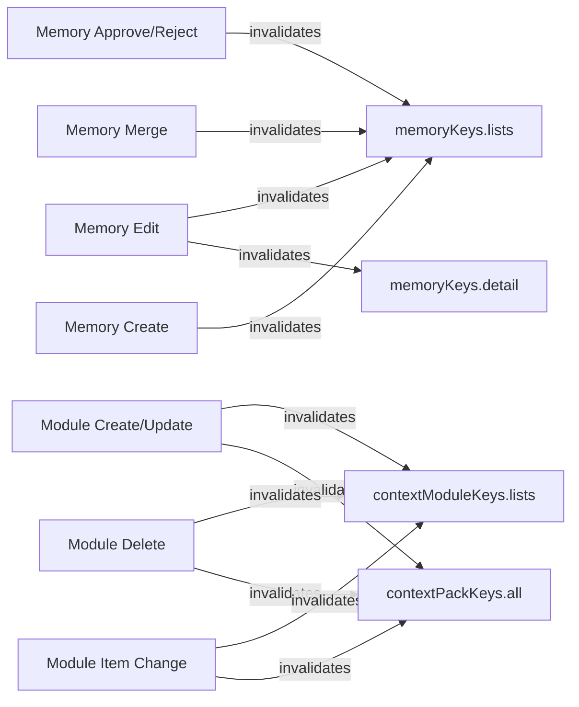
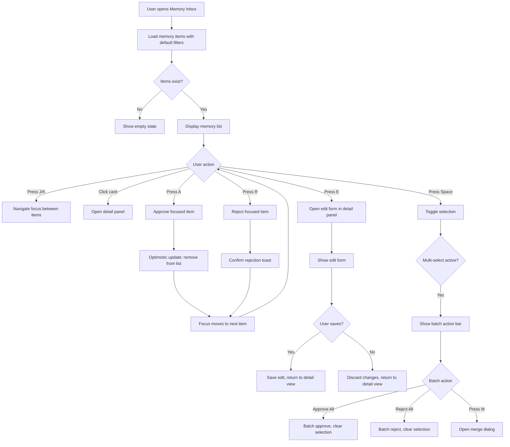
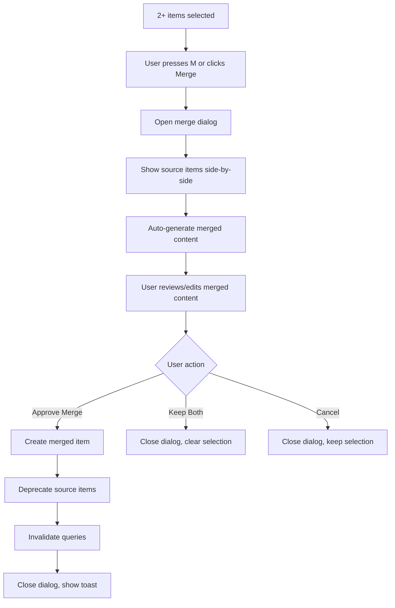
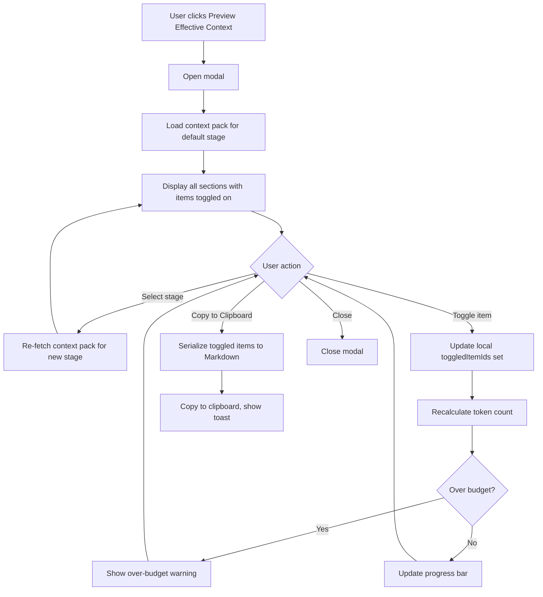

# Design Spec: Memory & Context Intelligence System UI

**PRD Reference:** `memory-context-system-v1`
**Phase Coverage:** Phase 2 (Governance UI)
**Version:** 1.0
**Date:** 2026-02-05

---

## Table of Contents

1. [Design Philosophy](#1-design-philosophy)
2. [Design Tokens](#2-design-tokens)
3. [View 1 -- Memory Inbox](#3-view-1----memory-inbox)
4. [View 2 -- Effective Context Preview Modal](#4-view-2----effective-context-preview-modal)
5. [View 3 -- Context Module Composition](#5-view-3----context-module-composition)
6. [Component Hierarchy](#6-component-hierarchy)
7. [State Management](#7-state-management)
8. [Interaction Flows](#8-interaction-flows)
9. [Accessibility Specification](#9-accessibility-specification)
10. [Responsive Behavior](#10-responsive-behavior)
11. [Animation & Micro-Interactions](#11-animation--micro-interactions)
12. [Dark Mode](#12-dark-mode)
13. [Implementation Priorities](#13-implementation-priorities)

---

## 1. Design Philosophy

The Memory & Context Intelligence System UI follows Linear's triage-oriented design language: dense information, keyboard-first interaction, minimal chrome, and decisive action paths. Every element serves the core workflow of reviewing, approving, and composing context.

**Governing Principles:**

- **Keyboard-first, mouse-enhanced.** The primary triage workflow (navigate, approve, reject, edit) must be fully operable without a mouse.
- **Information density over decoration.** Memory cards show all critical metadata at a glance. No unnecessary whitespace between triage items.
- **Progressive disclosure.** Summary in the list, detail in the side panel, provenance on demand.
- **Decisive actions.** Approve/reject are one-key operations. The system rewards speed.
- **Consistency with existing SkillMeat patterns.** Reuse `EntityList`, `EntityFilters`, `BaseArtifactModal`, and the project manage page layout as structural references.

---

## 2. Design Tokens

All values use the existing SkillMeat/shadcn design token system defined in `tailwind.config.js` with HSL CSS custom properties. New semantic tokens are introduced only for memory-specific concerns.

### 2.1 Confidence Colors

These are semantic colors layered on top of Tailwind utility classes. They are not new CSS custom properties -- they map directly to Tailwind classes.

| Confidence Range | Label    | Background Class                   | Text Class                        | Border Class                       |
| ---------------- | -------- | ---------------------------------- | --------------------------------- | ---------------------------------- |
| >= 85%           | High     | `bg-emerald-500/15 dark:bg-emerald-500/10` | `text-emerald-700 dark:text-emerald-400` | `border-emerald-500/30`           |
| 60% -- 84%       | Medium   | `bg-amber-500/15 dark:bg-amber-500/10`     | `text-amber-700 dark:text-amber-400`     | `border-amber-500/30`             |
| < 60%            | Low      | `bg-red-500/15 dark:bg-red-500/10`         | `text-red-700 dark:text-red-400`         | `border-red-500/30`               |

### 2.2 Memory Type Colors

Each memory type has a badge color to support visual scanning. Use shadcn `Badge` with `variant="outline"` plus custom border/text.

| Type        | Badge Text Class                            | Badge Border Class                 | Icon (Lucide) |
| ----------- | ------------------------------------------- | ---------------------------------- | ------------- |
| Constraint  | `text-violet-700 dark:text-violet-400`      | `border-violet-500/40`             | `ShieldAlert` |
| Decision    | `text-blue-700 dark:text-blue-400`          | `border-blue-500/40`              | `GitBranch`   |
| Fix         | `text-orange-700 dark:text-orange-400`      | `border-orange-500/40`            | `Wrench`      |
| Pattern     | `text-cyan-700 dark:text-cyan-400`          | `border-cyan-500/40`              | `Puzzle`      |
| Learning    | `text-pink-700 dark:text-pink-400`          | `border-pink-500/40`              | `Lightbulb`   |
| Style Rule  | `text-teal-700 dark:text-teal-400`          | `border-teal-500/40`              | `Palette`     |

### 2.3 Status Indicators

| Status      | Dot Color Class                  | Label     |
| ----------- | -------------------------------- | --------- |
| Candidate   | `bg-amber-400`                   | Candidate |
| Active      | `bg-emerald-400`                 | Active    |
| Stable      | `bg-blue-400`                    | Stable    |
| Deprecated  | `bg-zinc-400 dark:bg-zinc-600`   | Deprecated |

### 2.4 Spacing Constants

Adhere to the existing 4px/8px grid. Key measurements for the Memory Inbox:

| Element                   | Value    | Tailwind Class |
| ------------------------- | -------- | -------------- |
| Page horizontal padding   | 24px     | `px-6`         |
| Page vertical padding     | 24px     | `py-6`         |
| Card internal padding     | 12px     | `p-3`          |
| Card gap (list)           | 1px      | `divide-y`     |
| Filter bar height         | 48px     | `h-12`         |
| Detail panel width        | 420px    | `w-[420px]`    |
| Confidence bar width      | 3px      | `w-[3px]`      |
| Batch action bar height   | 56px     | `h-14`         |

---

## 3. View 1 -- Memory Inbox

**Route:** `/projects/[id]/memory`
**Purpose:** Triage view for reviewing AI-extracted candidate memories and managing the lifecycle of approved memories.
**UX Metaphor:** Linear's triage inbox with Gmail-style batch actions.

### 3.1 Page Layout

```
+--------------------------------------------------------------------+
| Breadcrumb: Projects > [Project Name] > Memory                     |
|                                                                    |
| [h1] Memory                          [+ Create Memory] [Settings]  |
+--------------------------------------------------------------------+
| [All] [Constraints] [Decisions] [Fixes] [Patterns] [Learnings]    |
| Status: [All Statuses v]  Sort: [Newest First v]   Search: [____] |
+--------------------------------------------------------------------+
|                                        |                           |
| [ ] Confidence | Type      | Content   |  DETAIL PANEL             |
|     bar        |           |           |  (420px, right sidebar)   |
| +--------------------------------------+                           |
| | [] ||| [Constraint] Don't use defau  |  Title                   |
| |    |||  lt exports in components...   |  Full content            |
| |    |||  87% | 2h ago | Used 3x | ... |  Provenance              |
| +--------------------------------------+  Related memories        |
| | [] ||| [Fix] API requires list_id    |  Actions                 |
| |    |||  in URL path, not body...      |                           |
| |    |||  92% | 1d ago | Used 7x | ... |                           |
| +--------------------------------------+                           |
| | [] ||| [Decision] Use TanStack Que   |                           |
| |    |||  ry for all server state...    |                           |
| |    |||  74% | 3d ago | Used 1x | ... |                           |
| +--------------------------------------+                           |
|                                        |                           |
+--------------------------------------------------------------------+
| [3 items selected]  [Approve All] [Reject All] [Clear Selection]   |
+--------------------------------------------------------------------+
```

### 3.2 Page Header

The header follows the same pattern as the existing project manage page (`ProjectManagePageContent`).

```tsx
<div className="border-b px-6 pb-4 pt-6">
  {/* Breadcrumb */}
  <nav aria-label="Breadcrumb" className="mb-3">
    <ol className="flex items-center gap-1.5 text-sm text-muted-foreground">
      <li><Link href="/projects">Projects</Link></li>
      <li><ChevronRight className="h-3.5 w-3.5" /></li>
      <li><Link href={`/projects/${projectId}`}>{projectName}</Link></li>
      <li><ChevronRight className="h-3.5 w-3.5" /></li>
      <li className="text-foreground font-medium">Memory</li>
    </ol>
  </nav>

  {/* Title row */}
  <div className="flex items-center justify-between">
    <div>
      <h1 className="text-2xl font-semibold tracking-tight">Memory</h1>
      <p className="mt-1 text-sm text-muted-foreground">
        Review and manage extracted knowledge for this project
      </p>
    </div>
    <div className="flex items-center gap-2">
      <Button variant="outline" size="sm">
        <Settings className="mr-2 h-4 w-4" />
        Settings
      </Button>
      <Button size="sm">
        <Plus className="mr-2 h-4 w-4" />
        Create Memory
      </Button>
    </div>
  </div>
</div>
```

**Props and State:**

- `projectId` -- from URL params
- `projectName` -- from `useProject(projectId)` query

### 3.3 Filter Bar

The filter bar sits directly below the header, separated by the border-b of the header. It contains three rows of controls.

**Row 1: Type Tabs**

Horizontal tab bar using shadcn `Tabs` (Radix). Each tab shows a count badge.

```tsx
<Tabs value={typeFilter} onValueChange={setTypeFilter}>
  <TabsList className="h-9 bg-transparent p-0">
    <TabsTrigger value="all" className="data-[state=active]:bg-muted">
      All <Badge variant="secondary" className="ml-1.5">{totalCount}</Badge>
    </TabsTrigger>
    <TabsTrigger value="constraint">
      Constraints <Badge variant="secondary" className="ml-1.5">{constraintCount}</Badge>
    </TabsTrigger>
    {/* ...repeat for each type */}
  </TabsList>
</Tabs>
```

**Row 2: Controls Row**

A flex row containing the status dropdown, sort control, and search input.

```tsx
<div className="flex items-center gap-3 border-b px-6 py-2">
  {/* Status filter */}
  <DropdownMenu>
    <DropdownMenuTrigger asChild>
      <Button variant="outline" size="sm" className="h-8">
        <Filter className="mr-2 h-3.5 w-3.5" />
        {statusLabel}
        <ChevronDown className="ml-2 h-3.5 w-3.5" />
      </Button>
    </DropdownMenuTrigger>
    <DropdownMenuContent>
      <DropdownMenuRadioGroup value={statusFilter} onValueChange={setStatusFilter}>
        <DropdownMenuRadioItem value="all">All Statuses</DropdownMenuRadioItem>
        <DropdownMenuRadioItem value="candidate">Candidate</DropdownMenuRadioItem>
        <DropdownMenuRadioItem value="active">Active</DropdownMenuRadioItem>
        <DropdownMenuRadioItem value="stable">Stable</DropdownMenuRadioItem>
        <DropdownMenuRadioItem value="deprecated">Deprecated</DropdownMenuRadioItem>
      </DropdownMenuRadioGroup>
    </DropdownMenuContent>
  </DropdownMenu>

  {/* Sort control */}
  <DropdownMenu>
    <DropdownMenuTrigger asChild>
      <Button variant="outline" size="sm" className="h-8">
        <ArrowUpDown className="mr-2 h-3.5 w-3.5" />
        {sortLabel}
      </Button>
    </DropdownMenuTrigger>
    <DropdownMenuContent>
      <DropdownMenuRadioGroup value={sortBy} onValueChange={setSortBy}>
        <DropdownMenuRadioItem value="newest">Newest First</DropdownMenuRadioItem>
        <DropdownMenuRadioItem value="oldest">Oldest First</DropdownMenuRadioItem>
        <DropdownMenuRadioItem value="confidence-desc">Highest Confidence</DropdownMenuRadioItem>
        <DropdownMenuRadioItem value="confidence-asc">Lowest Confidence</DropdownMenuRadioItem>
        <DropdownMenuRadioItem value="most-used">Most Used</DropdownMenuRadioItem>
      </DropdownMenuRadioGroup>
    </DropdownMenuContent>
  </DropdownMenu>

  {/* Spacer */}
  <div className="flex-1" />

  {/* Search */}
  <div className="relative w-64">
    <Search className="absolute left-2.5 top-2 h-3.5 w-3.5 text-muted-foreground" />
    <Input
      placeholder="Search memories..."
      value={searchQuery}
      onChange={(e) => setSearchQuery(e.target.value)}
      className="h-8 pl-8 text-sm"
    />
  </div>
</div>
```

### 3.4 Memory Card Component

Each card is a single row in a `divide-y` list. Dense layout optimized for scanning.

**Visual Structure:**

```
+---+---+--------------------------------------------------+--------+
| [ | C | [Type Badge]  Content preview text that can       | [Hover |
|   | o |  wrap to a second line if needed...               |  icons]|
| ] | n | 87% | 2 hours ago | Used 3x | session-abc123    |        |
+---+---+--------------------------------------------------+--------+
  ^   ^       ^                                                ^
  |   |       |                                                |
  CB  Bar   Main content area                            Action buttons
```

- **CB**: Checkbox (16x16, Radix `Checkbox`)
- **Bar**: Confidence bar (3px wide, full height, rounded-full, color per tier)
- **Main**: Content preview + metadata
- **Actions**: Ghost icon buttons, visible on hover/focus-within

```tsx
interface MemoryCardProps {
  memory: MemoryItem;
  selected: boolean;
  focused: boolean;
  onToggleSelect: (id: string) => void;
  onApprove: (id: string) => void;
  onReject: (id: string) => void;
  onEdit: (id: string) => void;
  onMerge: (id: string) => void;
  onClick: (id: string) => void;
}

function MemoryCard({
  memory,
  selected,
  focused,
  onToggleSelect,
  onApprove,
  onReject,
  onEdit,
  onClick,
}: MemoryCardProps) {
  const confidenceTier = getConfidenceTier(memory.confidence);

  return (
    <div
      role="row"
      tabIndex={0}
      aria-selected={selected}
      aria-label={`Memory item: ${memory.type}, ${Math.round(memory.confidence * 100)}% confidence, ${memory.status}`}
      className={cn(
        'group flex items-stretch gap-3 px-6 py-3 cursor-pointer',
        'transition-colors duration-75',
        'hover:bg-accent/50',
        focused && 'bg-accent/70 ring-1 ring-ring ring-inset',
        selected && 'bg-primary/5'
      )}
      onClick={() => onClick(memory.id)}
      onKeyDown={(e) => {
        if (e.key === 'Enter') onClick(memory.id);
        if (e.key === ' ') { e.preventDefault(); onToggleSelect(memory.id); }
      }}
    >
      {/* Checkbox */}
      <div className="flex items-center" onClick={(e) => e.stopPropagation()}>
        <Checkbox
          checked={selected}
          onCheckedChange={() => onToggleSelect(memory.id)}
          aria-label={`Select memory: ${memory.content.slice(0, 40)}`}
        />
      </div>

      {/* Confidence bar */}
      <div
        className={cn(
          'w-[3px] self-stretch rounded-full flex-shrink-0',
          confidenceTier === 'high' && 'bg-emerald-500',
          confidenceTier === 'medium' && 'bg-amber-500',
          confidenceTier === 'low' && 'bg-red-500'
        )}
        aria-hidden="true"
      />

      {/* Content area */}
      <div className="flex-1 min-w-0">
        {/* First row: type badge + content */}
        <div className="flex items-start gap-2">
          <MemoryTypeBadge type={memory.type} />
          <p className="text-sm leading-snug line-clamp-2 text-foreground">
            {memory.content}
          </p>
        </div>

        {/* Second row: metadata */}
        <div className="mt-1.5 flex items-center gap-3 text-xs text-muted-foreground">
          <span className={cn(
            'font-medium',
            confidenceTier === 'high' && 'text-emerald-700 dark:text-emerald-400',
            confidenceTier === 'medium' && 'text-amber-700 dark:text-amber-400',
            confidenceTier === 'low' && 'text-red-700 dark:text-red-400'
          )}>
            {Math.round(memory.confidence * 100)}%
          </span>
          <span>{formatRelativeTime(memory.created_at)}</span>
          <span>Used {memory.access_count}x</span>
          {memory.provenance_source && (
            <button
              className="hover:text-foreground underline decoration-dotted"
              onClick={(e) => { e.stopPropagation(); openProvenance(memory.id); }}
            >
              {memory.provenance_source}
            </button>
          )}
          {/* Status dot */}
          <span className="flex items-center gap-1">
            <span className={cn(
              'h-1.5 w-1.5 rounded-full',
              memory.status === 'candidate' && 'bg-amber-400',
              memory.status === 'active' && 'bg-emerald-400',
              memory.status === 'stable' && 'bg-blue-400',
              memory.status === 'deprecated' && 'bg-zinc-400'
            )} />
            {memory.status}
          </span>
        </div>
      </div>

      {/* Action buttons (visible on hover/focus) */}
      <div className={cn(
        'flex items-center gap-1 opacity-0 transition-opacity',
        'group-hover:opacity-100 group-focus-within:opacity-100'
      )}>
        <Button
          variant="ghost" size="icon" className="h-7 w-7"
          onClick={(e) => { e.stopPropagation(); onApprove(memory.id); }}
          aria-label="Approve memory"
        >
          <Check className="h-3.5 w-3.5 text-emerald-600" />
        </Button>
        <Button
          variant="ghost" size="icon" className="h-7 w-7"
          onClick={(e) => { e.stopPropagation(); onEdit(memory.id); }}
          aria-label="Edit memory"
        >
          <Pencil className="h-3.5 w-3.5" />
        </Button>
        <Button
          variant="ghost" size="icon" className="h-7 w-7"
          onClick={(e) => { e.stopPropagation(); onReject(memory.id); }}
          aria-label="Reject memory"
        >
          <X className="h-3.5 w-3.5 text-red-500" />
        </Button>
      </div>
    </div>
  );
}
```

### 3.5 Memory Type Badge

A small pill component using shadcn `Badge` with type-specific styling.

```tsx
function MemoryTypeBadge({ type }: { type: MemoryType }) {
  const config = MEMORY_TYPE_CONFIG[type];
  const Icon = config.icon;

  return (
    <Badge
      variant="outline"
      className={cn(
        'flex-shrink-0 gap-1 px-1.5 py-0 text-[10px] font-medium uppercase tracking-wider',
        config.textClass,
        config.borderClass
      )}
    >
      <Icon className="h-2.5 w-2.5" />
      {config.label}
    </Badge>
  );
}

const MEMORY_TYPE_CONFIG: Record<MemoryType, {
  label: string;
  icon: LucideIcon;
  textClass: string;
  borderClass: string;
}> = {
  constraint:  { label: 'Constraint', icon: ShieldAlert, textClass: 'text-violet-700 dark:text-violet-400', borderClass: 'border-violet-500/40' },
  decision:    { label: 'Decision',   icon: GitBranch,   textClass: 'text-blue-700 dark:text-blue-400',     borderClass: 'border-blue-500/40' },
  fix:         { label: 'Fix',        icon: Wrench,      textClass: 'text-orange-700 dark:text-orange-400', borderClass: 'border-orange-500/40' },
  pattern:     { label: 'Pattern',    icon: Puzzle,       textClass: 'text-cyan-700 dark:text-cyan-400',     borderClass: 'border-cyan-500/40' },
  learning:    { label: 'Learning',   icon: Lightbulb,   textClass: 'text-pink-700 dark:text-pink-400',     borderClass: 'border-pink-500/40' },
  style_rule:  { label: 'Style Rule', icon: Palette,     textClass: 'text-teal-700 dark:text-teal-400',     borderClass: 'border-teal-500/40' },
};
```

### 3.6 Memory List

The list is a scrollable `div` that renders `MemoryCard` components. It tracks the currently focused index for keyboard navigation.

```tsx
<div
  role="grid"
  aria-label="Memory items"
  aria-rowcount={memories.length}
  className="flex-1 overflow-y-auto divide-y"
>
  {memories.map((memory, index) => (
    <MemoryCard
      key={memory.id}
      memory={memory}
      selected={selectedIds.has(memory.id)}
      focused={focusedIndex === index}
      onToggleSelect={toggleSelect}
      onApprove={handleApprove}
      onReject={handleReject}
      onEdit={handleEdit}
      onMerge={handleMerge}
      onClick={handleCardClick}
    />
  ))}
</div>
```

### 3.7 States

#### Default (Browsing)

The standard list view with no items selected and no detail panel open. Action buttons appear on hover.

#### Selected (Single Item)

Clicking a card opens the detail panel on the right. The clicked card receives `bg-accent/70` highlighting. The URL updates with `?memory=<id>` for deep linking.

#### Multi-Select Mode

When one or more checkboxes are checked (or Space is pressed):
- All checkboxes become persistently visible (not just on hover)
- The batch action bar slides up from the bottom
- The count badge updates in real-time

#### Empty State

```tsx
<div className="flex flex-col items-center justify-center py-16 text-center">
  <div className="rounded-full bg-muted p-4 mb-4">
    <Brain className="h-8 w-8 text-muted-foreground" />
  </div>
  <h3 className="text-lg font-semibold">No memories yet</h3>
  <p className="mt-2 max-w-sm text-sm text-muted-foreground">
    Memories are automatically extracted from agent sessions, or you can
    create them manually.
  </p>
  <Button className="mt-4" size="sm">
    <Plus className="mr-2 h-4 w-4" />
    Create First Memory
  </Button>
</div>
```

#### Loading / Skeleton

Show 6 skeleton rows. Each row mirrors the card layout with pulsing `bg-muted` blocks.

```tsx
<div className="divide-y">
  {Array.from({ length: 6 }).map((_, i) => (
    <div key={i} className="flex items-stretch gap-3 px-6 py-3 animate-pulse">
      <div className="h-4 w-4 rounded bg-muted mt-1" />
      <div className="w-[3px] self-stretch rounded-full bg-muted" />
      <div className="flex-1 space-y-2">
        <div className="flex items-center gap-2">
          <div className="h-4 w-16 rounded bg-muted" />
          <div className="h-4 w-3/4 rounded bg-muted" />
        </div>
        <div className="flex gap-3">
          <div className="h-3 w-8 rounded bg-muted" />
          <div className="h-3 w-16 rounded bg-muted" />
          <div className="h-3 w-12 rounded bg-muted" />
        </div>
      </div>
    </div>
  ))}
</div>
```

#### Error State

```tsx
<div className="flex flex-col items-center justify-center py-16 text-center">
  <div className="rounded-full bg-destructive/10 p-4 mb-4">
    <AlertTriangle className="h-8 w-8 text-destructive" />
  </div>
  <h3 className="text-lg font-semibold">Failed to load memories</h3>
  <p className="mt-2 max-w-sm text-sm text-muted-foreground">
    {error.message}
  </p>
  <Button variant="outline" className="mt-4" size="sm" onClick={refetch}>
    <RefreshCw className="mr-2 h-4 w-4" />
    Retry
  </Button>
</div>
```

### 3.8 Keyboard Shortcuts

Implement via a `useKeyboardShortcuts` hook that listens on the memory list container. All shortcuts are disabled when a modal, dialog, or text input has focus.

| Key       | Action                                      | Context                        |
| --------- | ------------------------------------------- | ------------------------------ |
| `j`       | Move focus to next memory item              | List focused                   |
| `k`       | Move focus to previous memory item          | List focused                   |
| `a`       | Approve focused/selected item(s)            | List focused                   |
| `e`       | Open edit panel for focused item            | Single item focused            |
| `r`       | Reject focused/selected item(s)             | List focused                   |
| `m`       | Open merge dialog                           | 2+ items selected              |
| `Space`   | Toggle selection of focused item            | List focused                   |
| `Enter`   | Open detail panel for focused item          | Single item focused            |
| `Escape`  | Close detail panel or clear selection       | Panel open / items selected    |
| `Cmd+A`   | Select all visible items                    | List focused                   |
| `?`       | Show keyboard shortcuts help overlay        | Any context                    |

**Implementation note:** The `j`/`k` navigation maintains a `focusedIndex` state. When navigating past the visible viewport, the list scrolls the focused item into view using `scrollIntoView({ block: 'nearest' })`.

### 3.9 Batch Action Bar

Slides in from the bottom of the viewport when `selectedIds.size > 0`. Uses `position: sticky` at the bottom of the scrollable area, or `fixed` at the bottom of the viewport.

```tsx
<div
  className={cn(
    'fixed bottom-0 left-0 right-0 z-40',
    'border-t bg-background/95 backdrop-blur-sm',
    'flex items-center justify-between px-6 h-14',
    'transform transition-transform duration-200 ease-out',
    selectedIds.size > 0 ? 'translate-y-0' : 'translate-y-full'
  )}
  role="toolbar"
  aria-label="Batch actions"
>
  <span className="text-sm font-medium">
    {selectedIds.size} {selectedIds.size === 1 ? 'item' : 'items'} selected
  </span>

  <div className="flex items-center gap-2">
    <Button
      size="sm"
      variant="outline"
      onClick={clearSelection}
    >
      Clear
    </Button>
    <Button
      size="sm"
      variant="outline"
      className="text-red-600 hover:text-red-700 hover:bg-red-50 dark:text-red-400 dark:hover:bg-red-950"
      onClick={handleBatchReject}
    >
      <X className="mr-2 h-3.5 w-3.5" />
      Reject
    </Button>
    <Button
      size="sm"
      onClick={handleBatchApprove}
    >
      <Check className="mr-2 h-3.5 w-3.5" />
      Approve
    </Button>
  </div>
</div>
```

**Accessibility:** The bar is announced via `aria-live="polite"` region that states "N items selected. Use Approve or Reject to batch-process."

### 3.10 Detail Panel (Right Sidebar)

Opens when a single memory card is clicked. 420px wide. Slides in from the right with a 200ms ease-out animation.

**Layout:**

```
+-------------------------------------------+
| [<-] Memory Detail              [X] Close  |
+-------------------------------------------+
| [Constraint] [Active]                      |
|                                            |
| Content                                    |
| ------------------------------------------ |
| Full text of the memory item, rendered     |
| as markdown. Can span multiple paragraphs. |
|                                            |
| Confidence: 87% [=========>--]             |
|                                            |
+-------------------------------------------+
| Provenance                                 |
| ------------------------------------------ |
| Source: session-abc123                      |
| Extracted: 2026-02-04 14:32                |
| Files: skillmeat/api/routers/memory.py     |
|        skillmeat/cache/models.py           |
| Commit: a1b2c3d                            |
+-------------------------------------------+
| Related Memories (3)                       |
| ------------------------------------------ |
| [Fix] API requires list_id...    92%       |
| [Pattern] Use write-through...   78%       |
| [Decision] DB cache is source... 85%       |
+-------------------------------------------+
| [Edit]  [Approve]  [Reject]  [...More]     |
+-------------------------------------------+
```

```tsx
<aside
  className={cn(
    'fixed top-0 right-0 bottom-0 z-30',
    'w-[420px] border-l bg-background',
    'flex flex-col',
    'transform transition-transform duration-200 ease-out',
    isOpen ? 'translate-x-0' : 'translate-x-full'
  )}
  role="complementary"
  aria-label="Memory detail panel"
>
  {/* Header */}
  <div className="flex items-center justify-between border-b px-4 py-3">
    <h2 className="text-sm font-semibold">Memory Detail</h2>
    <Button variant="ghost" size="icon" className="h-7 w-7" onClick={onClose}>
      <X className="h-4 w-4" />
      <span className="sr-only">Close detail panel</span>
    </Button>
  </div>

  {/* Scrollable content */}
  <div className="flex-1 overflow-y-auto">
    {/* Type + Status badges */}
    <div className="flex items-center gap-2 px-4 pt-4">
      <MemoryTypeBadge type={memory.type} />
      <StatusBadge status={memory.status} />
    </div>

    {/* Content */}
    <div className="px-4 py-4">
      <div className="prose prose-sm dark:prose-invert max-w-none">
        {memory.content}
      </div>
    </div>

    {/* Confidence */}
    <div className="px-4 pb-4">
      <ConfidenceDisplay confidence={memory.confidence} />
    </div>

    {/* Provenance section */}
    <Collapsible defaultOpen>
      <CollapsibleTrigger className="flex w-full items-center justify-between border-t px-4 py-3">
        <h3 className="text-xs font-semibold uppercase tracking-wider text-muted-foreground">
          Provenance
        </h3>
        <ChevronDown className="h-4 w-4" />
      </CollapsibleTrigger>
      <CollapsibleContent className="px-4 pb-4">
        <ProvenanceSection provenance={memory.provenance} />
      </CollapsibleContent>
    </Collapsible>

    {/* Related memories */}
    <Collapsible defaultOpen>
      <CollapsibleTrigger className="flex w-full items-center justify-between border-t px-4 py-3">
        <h3 className="text-xs font-semibold uppercase tracking-wider text-muted-foreground">
          Related Memories ({relatedMemories.length})
        </h3>
        <ChevronDown className="h-4 w-4" />
      </CollapsibleTrigger>
      <CollapsibleContent className="px-4 pb-4 space-y-2">
        {relatedMemories.map((rm) => (
          <RelatedMemoryRow key={rm.id} memory={rm} onClick={handleRelatedClick} />
        ))}
      </CollapsibleContent>
    </Collapsible>
  </div>

  {/* Footer actions */}
  <div className="border-t px-4 py-3 flex items-center gap-2">
    <Button variant="outline" size="sm" onClick={() => onEdit(memory.id)}>
      <Pencil className="mr-2 h-3.5 w-3.5" />
      Edit
    </Button>
    <Button size="sm" onClick={() => onApprove(memory.id)}>
      <Check className="mr-2 h-3.5 w-3.5" />
      Approve
    </Button>
    <Button
      variant="outline" size="sm"
      className="text-destructive"
      onClick={() => onReject(memory.id)}
    >
      Reject
    </Button>
    <DropdownMenu>
      <DropdownMenuTrigger asChild>
        <Button variant="ghost" size="icon" className="ml-auto h-8 w-8">
          <MoreHorizontal className="h-4 w-4" />
        </Button>
      </DropdownMenuTrigger>
      <DropdownMenuContent align="end">
        <DropdownMenuItem onClick={() => onMerge(memory.id)}>
          <Combine className="mr-2 h-4 w-4" />
          Merge with another
        </DropdownMenuItem>
        <DropdownMenuItem onClick={() => onDeprecate(memory.id)}>
          <Archive className="mr-2 h-4 w-4" />
          Deprecate
        </DropdownMenuItem>
      </DropdownMenuContent>
    </DropdownMenu>
  </div>
</aside>
```

### 3.11 Edit Flow

Clicking "Edit" on a memory (via card action or detail panel) opens the edit view inside the detail panel. This replaces the detail panel content rather than opening a separate modal, maintaining spatial context.

**Layout:**

```
+-------------------------------------------+
| [<-] Editing Memory               [X]     |
+-------------------------------------------+
| Original (read-only)                       |
| ------------------------------------------ |
| Don't use default exports in components.   |
| Named exports support tree-shaking and     |
| prevent import naming inconsistencies.     |
+-------------------------------------------+
| Your Edit                                  |
| ------------------------------------------ |
| [textarea with original content pre-       |
|  filled, editable by user]                 |
|                                            |
+-------------------------------------------+
| Changes                                    |
| ------------------------------------------ |
| Inline diff highlighting showing what      |
| was added/removed/changed                  |
+-------------------------------------------+
| Rationale (optional)                       |
| [textarea: "Why did you make this change?"]|
+-------------------------------------------+
| [Cancel]                        [Save]     |
+-------------------------------------------+
```

**Implementation Notes:**

- The diff is computed client-side using a lightweight diff library (e.g., `diff-match-patch` or `jsdiff`).
- Changes are highlighted inline: additions in `bg-emerald-500/15`, removals in `bg-red-500/15`.
- The "Rationale" textarea is optional. If provided, it is stored in the memory's audit trail.
- On Save, call `useMutateMemory().edit(id, { content, rationale })`.
- On Cancel, revert to the read-only detail panel view.
- Autosave draft to `sessionStorage` every 5 seconds to prevent data loss.

```tsx
interface EditFormProps {
  memory: MemoryItem;
  onSave: (content: string, rationale?: string) => void;
  onCancel: () => void;
}

function MemoryEditForm({ memory, onSave, onCancel }: EditFormProps) {
  const [editedContent, setEditedContent] = useState(memory.content);
  const [rationale, setRationale] = useState('');
  const hasChanges = editedContent !== memory.content;

  return (
    <div className="flex flex-col h-full">
      {/* Original */}
      <div className="border-b px-4 py-3">
        <h3 className="text-xs font-semibold uppercase tracking-wider text-muted-foreground mb-2">
          Original
        </h3>
        <p className="text-sm text-muted-foreground">{memory.content}</p>
      </div>

      {/* Editor */}
      <div className="flex-1 px-4 py-3">
        <h3 className="text-xs font-semibold uppercase tracking-wider text-muted-foreground mb-2">
          Your Edit
        </h3>
        <Textarea
          value={editedContent}
          onChange={(e) => setEditedContent(e.target.value)}
          className="min-h-[120px] resize-y"
          aria-label="Edit memory content"
        />
      </div>

      {/* Diff preview (shown only when changes exist) */}
      {hasChanges && (
        <div className="border-t px-4 py-3">
          <h3 className="text-xs font-semibold uppercase tracking-wider text-muted-foreground mb-2">
            Changes
          </h3>
          <InlineDiff original={memory.content} modified={editedContent} />
        </div>
      )}

      {/* Rationale */}
      <div className="border-t px-4 py-3">
        <h3 className="text-xs font-semibold uppercase tracking-wider text-muted-foreground mb-2">
          Rationale
          <span className="ml-1 font-normal normal-case tracking-normal">(optional)</span>
        </h3>
        <Textarea
          value={rationale}
          onChange={(e) => setRationale(e.target.value)}
          placeholder="Why did you make this change?"
          className="min-h-[60px] resize-y"
          aria-label="Edit rationale"
        />
      </div>

      {/* Actions */}
      <div className="border-t px-4 py-3 flex items-center justify-end gap-2">
        <Button variant="outline" size="sm" onClick={onCancel}>Cancel</Button>
        <Button size="sm" disabled={!hasChanges} onClick={() => onSave(editedContent, rationale)}>
          Save Changes
        </Button>
      </div>
    </div>
  );
}
```

### 3.12 Merge Flow

Triggered when 2+ items are selected and the user presses `m` or clicks "Merge" in the batch bar. Opens a centered modal dialog.

**Layout:**

```
+---------------------------------------------------------------+
| Merge Memories                                          [X]   |
+---------------------------------------------------------------+
| Similarity: 84%                                               |
|                                                               |
| Source Items                                                  |
| +---------------------------+  +---------------------------+  |
| | [Constraint]              |  | [Constraint]              |  |
| | Don't use default exports |  | Always use named exports  |  |
| | in components. Named      |  | for React components to   |  |
| | exports support tree-     |  | enable tree-shaking and   |  |
| | shaking...                |  | consistent imports.       |  |
| | 87% | 2h ago             |  | 74% | 3d ago             |  |
| +---------------------------+  +---------------------------+  |
|                                                               |
| Merged Result                                                 |
| +-----------------------------------------------------------+ |
| | [editable textarea pre-filled with AI-merged content]     | |
| |                                                           | |
| | Use named exports (not default exports) for all React     | |
| | components. Named exports enable tree-shaking, prevent    | |
| | import naming inconsistencies, and are the standard       | |
| | pattern across the codebase.                              | |
| +-----------------------------------------------------------+ |
|                                                               |
| Merged confidence: 91% (combined)                             |
| Type: [Constraint v]                                          |
|                                                               |
| [Cancel]  [Keep Both]                     [Approve Merge]     |
+---------------------------------------------------------------+
```

```tsx
interface MergeDialogProps {
  memories: MemoryItem[];
  open: boolean;
  onOpenChange: (open: boolean) => void;
  onMerge: (mergedContent: string, type: MemoryType) => void;
  onKeepBoth: () => void;
}

function MergeDialog({ memories, open, onOpenChange, onMerge, onKeepBoth }: MergeDialogProps) {
  const [mergedContent, setMergedContent] = useState('');
  const [mergedType, setMergedType] = useState<MemoryType>(memories[0]?.type ?? 'constraint');
  const similarity = useMemo(() => computeSimilarity(memories), [memories]);
  const mergedConfidence = useMemo(() => computeMergedConfidence(memories), [memories]);

  // Auto-generate merged content on open
  useEffect(() => {
    if (open && memories.length >= 2) {
      generateMergedContent(memories).then(setMergedContent);
    }
  }, [open, memories]);

  return (
    <Dialog open={open} onOpenChange={onOpenChange}>
      <DialogContent className="max-w-3xl max-h-[85vh] overflow-y-auto">
        <DialogHeader>
          <DialogTitle>Merge Memories</DialogTitle>
          <DialogDescription>
            Combine {memories.length} related memories into a single, refined item.
          </DialogDescription>
        </DialogHeader>

        {/* Similarity score */}
        <div className="flex items-center gap-2 text-sm">
          <span className="text-muted-foreground">Similarity:</span>
          <Badge variant="outline">{Math.round(similarity * 100)}%</Badge>
        </div>

        {/* Source items side-by-side */}
        <div className="grid grid-cols-2 gap-3">
          {memories.map((memory) => (
            <div key={memory.id} className="rounded-lg border p-3 space-y-2">
              <MemoryTypeBadge type={memory.type} />
              <p className="text-sm">{memory.content}</p>
              <div className="text-xs text-muted-foreground">
                {Math.round(memory.confidence * 100)}% | {formatRelativeTime(memory.created_at)}
              </div>
            </div>
          ))}
        </div>

        {/* Merged result */}
        <div className="space-y-2">
          <label className="text-sm font-medium">Merged Result</label>
          <Textarea
            value={mergedContent}
            onChange={(e) => setMergedContent(e.target.value)}
            className="min-h-[100px]"
            aria-label="Merged memory content"
          />
        </div>

        {/* Merged metadata */}
        <div className="flex items-center gap-4">
          <div className="flex items-center gap-2 text-sm">
            <span className="text-muted-foreground">Confidence:</span>
            <span className="font-medium">{Math.round(mergedConfidence * 100)}%</span>
          </div>
          <div className="flex items-center gap-2 text-sm">
            <span className="text-muted-foreground">Type:</span>
            <Select value={mergedType} onValueChange={(v) => setMergedType(v as MemoryType)}>
              <SelectTrigger className="h-8 w-32">
                <SelectValue />
              </SelectTrigger>
              <SelectContent>
                {Object.entries(MEMORY_TYPE_CONFIG).map(([key, config]) => (
                  <SelectItem key={key} value={key}>{config.label}</SelectItem>
                ))}
              </SelectContent>
            </Select>
          </div>
        </div>

        {/* Actions */}
        <DialogFooter className="gap-2 sm:gap-0">
          <Button variant="outline" onClick={() => onOpenChange(false)}>
            Cancel
          </Button>
          <Button variant="outline" onClick={onKeepBoth}>
            Keep Both
          </Button>
          <Button onClick={() => onMerge(mergedContent, mergedType)}>
            Approve Merge
          </Button>
        </DialogFooter>
      </DialogContent>
    </Dialog>
  );
}
```

### 3.13 Provenance Panel

Shown as a collapsible section in the detail panel. Also accessible by clicking the provenance link on a memory card, which opens the detail panel with the provenance section expanded.

```tsx
function ProvenanceSection({ provenance }: { provenance: MemoryProvenance }) {
  return (
    <div className="space-y-3 text-sm">
      {/* Source breadcrumb */}
      <div>
        <span className="text-muted-foreground">Source: </span>
        <span className="font-mono text-xs">{provenance.session_id}</span>
      </div>

      {/* Extraction timestamp */}
      <div>
        <span className="text-muted-foreground">Extracted: </span>
        <span>{formatDateTime(provenance.extracted_at)}</span>
      </div>

      {/* File anchors */}
      {provenance.files && provenance.files.length > 0 && (
        <div>
          <span className="text-muted-foreground">Files: </span>
          <ul className="mt-1 space-y-0.5">
            {provenance.files.map((file, i) => (
              <li key={i} className="font-mono text-xs text-muted-foreground hover:text-foreground">
                {file.path}
                {file.lines && <span className="text-muted-foreground/60">:{file.lines}</span>}
              </li>
            ))}
          </ul>
        </div>
      )}

      {/* Commit reference */}
      {provenance.commit_sha && (
        <div>
          <span className="text-muted-foreground">Commit: </span>
          <code className="text-xs">{provenance.commit_sha.slice(0, 7)}</code>
        </div>
      )}

      {/* Usage history */}
      {provenance.usage_refs && provenance.usage_refs.length > 0 && (
        <div>
          <span className="text-muted-foreground">Used in: </span>
          <ul className="mt-1 space-y-0.5">
            {provenance.usage_refs.map((ref, i) => (
              <li key={i} className="text-xs text-muted-foreground">
                {ref.context} ({formatRelativeTime(ref.used_at)})
              </li>
            ))}
          </ul>
        </div>
      )}
    </div>
  );
}
```

### 3.14 Create Memory Dialog

Triggered by the "Create Memory" button in the header. Opens a centered dialog.

```
+---------------------------------------------------------------+
| Create Memory                                           [X]   |
+---------------------------------------------------------------+
|                                                               |
| Type                                                          |
| [Constraint v]                                                |
|                                                               |
| Content *                                                     |
| [textarea]                                                    |
|                                                               |
| Confidence                                                    |
| [slider: 0% ----[====]-------- 100%]  [75%]                  |
|                                                               |
| Source (optional)                                              |
| [text input: e.g., "manual observation" or session ID]        |
|                                                               |
| File Anchors (optional)                                       |
| [text input: comma-separated file paths]                      |
|                                                               |
| Status                                                        |
| ( ) Candidate  (*) Active  ( ) Stable                         |
|                                                               |
| [Cancel]                                    [Create Memory]   |
+---------------------------------------------------------------+
```

---

## 4. View 2 -- Effective Context Preview Modal

**Trigger:** "Preview Effective Context" button in `/projects/[id]/manage`
**Purpose:** Read-only preview showing exactly what context text will be injected for a given project + workflow stage.
**Size:** Large modal, approximately 80% viewport (`max-w-6xl`, `max-h-[85vh]`)

### 4.1 Modal Layout

```
+-----------------------------------------------------------------------+
| Effective Context Preview                                       [X]   |
+-----------------------------------------------------------------------+
|          |                                                            |
| Stages   |  Context for: Research Stage                               |
| ------   |  --------------------------------------------------------- |
| [*Research]                                                           |
| [ Implement]  ## Context Modules                              [v]     |
| [ Review  ]  +----------------------------------------------------+  |
| [ Deploy  ]  | [on] project-rules (Priority: 1)     ~320 tokens  |  |
|          |  | [on] coding-standards (Priority: 2)  ~450 tokens  |  |
|          |  | [off] release-checklist (Priority: 5) ~280 tokens |  |
|          |  +----------------------------------------------------+  |
|          |                                                            |
|          |  ## Memory Items (Active)                          [v]     |
|          |  +----------------------------------------------------+  |
|          |  | [on] [Constraint] Don't use default... ~45 tokens  |  |
|          |  | [on] [Fix] API requires list_id...     ~38 tokens  |  |
|          |  | [on] [Decision] Use TanStack Query...  ~52 tokens  |  |
|          |  +----------------------------------------------------+  |
|          |                                                            |
|          |  ## Rules                                          [v]     |
|          |  +----------------------------------------------------+  |
|          |  | [on] debugging.md                      ~120 tokens |  |
|          |  | [on] components.md                     ~95 tokens  |  |
|          |  +----------------------------------------------------+  |
|          |                                                            |
|          |  ## Specs                                          [v]     |
|          |  +----------------------------------------------------+  |
|          |  | [on] doc-policy-spec.md                ~200 tokens |  |
|          |  +----------------------------------------------------+  |
|          |                                                            |
+-----------------------------------------------------------------------+
| ~2,450 tokens / 4,000 budget  [=======>------]   [Copy to Clipboard] |
+-----------------------------------------------------------------------+
```

### 4.2 Stage Selector (Left Sidebar)

A vertical list of workflow stages. Each stage is a button-like element. The active stage has `bg-accent` highlighting.

```tsx
<nav className="w-40 flex-shrink-0 border-r p-2 space-y-1" aria-label="Workflow stages">
  {stages.map((stage) => (
    <button
      key={stage.id}
      className={cn(
        'w-full rounded-md px-3 py-2 text-left text-sm font-medium',
        'transition-colors hover:bg-accent',
        activeStage === stage.id && 'bg-accent text-accent-foreground'
      )}
      onClick={() => setActiveStage(stage.id)}
      aria-pressed={activeStage === stage.id}
    >
      <stage.icon className="mr-2 inline-block h-4 w-4" />
      {stage.label}
    </button>
  ))}
</nav>
```

**Stage definitions:**

| Stage          | Icon (Lucide)   | Description                                 |
| -------------- | --------------- | ------------------------------------------- |
| Research       | `Search`        | Exploration and discovery context            |
| Implementation | `Code`          | Coding-focused context with patterns + fixes |
| Review         | `Eye`           | Review checklist and quality standards       |
| Deploy         | `Rocket`        | Release and deployment context               |

### 4.3 Context Section

Each section (Context Modules, Memory Items, Rules, Specs) is a collapsible group using Radix `Collapsible`.

```tsx
function ContextSection({
  title,
  items,
  toggledItems,
  onToggle,
}: ContextSectionProps) {
  const sectionTokens = items
    .filter((item) => toggledItems.has(item.id))
    .reduce((sum, item) => sum + item.tokenCount, 0);

  return (
    <Collapsible defaultOpen className="border rounded-lg">
      <CollapsibleTrigger className="flex w-full items-center justify-between px-4 py-3 hover:bg-accent/50">
        <h3 className="text-sm font-semibold">{title}</h3>
        <div className="flex items-center gap-2">
          <span className="text-xs text-muted-foreground">~{sectionTokens} tokens</span>
          <ChevronDown className="h-4 w-4 transition-transform data-[state=open]:rotate-180" />
        </div>
      </CollapsibleTrigger>
      <CollapsibleContent>
        <div className="divide-y">
          {items.map((item) => (
            <div key={item.id} className="flex items-center gap-3 px-4 py-2.5">
              <Switch
                checked={toggledItems.has(item.id)}
                onCheckedChange={() => onToggle(item.id)}
                aria-label={`Include ${item.name} in context`}
              />
              <div className="flex-1 min-w-0">
                <div className="flex items-center gap-2">
                  {item.typeBadge && <MemoryTypeBadge type={item.typeBadge} />}
                  <span className="text-sm truncate">{item.name}</span>
                </div>
                {item.description && (
                  <p className="text-xs text-muted-foreground truncate mt-0.5">
                    {item.description}
                  </p>
                )}
              </div>
              <span className="text-xs text-muted-foreground flex-shrink-0">
                ~{item.tokenCount} tokens
              </span>
            </div>
          ))}
        </div>
      </CollapsibleContent>
    </Collapsible>
  );
}
```

### 4.4 Token Budget Footer

A sticky footer at the bottom of the modal showing current token usage against the configured budget.

```tsx
<div className="border-t bg-background px-6 py-3 flex items-center justify-between">
  <div className="flex items-center gap-3">
    <span className="text-sm font-medium">
      ~{totalTokens.toLocaleString()} tokens
    </span>
    <span className="text-sm text-muted-foreground">
      / {budget.toLocaleString()} budget
    </span>
    {/* Progress bar */}
    <div className="w-48 h-2 rounded-full bg-muted overflow-hidden">
      <div
        className={cn(
          'h-full rounded-full transition-all duration-300',
          percentage <= 75 && 'bg-emerald-500',
          percentage > 75 && percentage <= 90 && 'bg-amber-500',
          percentage > 90 && 'bg-red-500'
        )}
        style={{ width: `${Math.min(percentage, 100)}%` }}
      />
    </div>
    {percentage > 100 && (
      <Badge variant="destructive" className="text-xs">Over budget</Badge>
    )}
  </div>
  <Button variant="outline" size="sm" onClick={handleCopyToClipboard}>
    <Copy className="mr-2 h-3.5 w-3.5" />
    Copy to Clipboard
  </Button>
</div>
```

### 4.5 Interaction

- Selecting a stage re-fetches context via `useContextPack(projectId, stage)`.
- Toggling items updates a local `Set<string>` of included item IDs.
- Token count recalculates in real-time from the toggled set.
- Items within each section are sorted by priority (configurable via drag-and-drop in the Module Composition view).
- "Copy to Clipboard" serializes all toggled items into a formatted Markdown string.

### 4.6 States

| State    | Behavior                                                      |
| -------- | ------------------------------------------------------------- |
| Loading  | Each section shows a skeleton with 3 pulsing rows             |
| Loaded   | Full content visible, all items toggled on by default         |
| Empty    | "No context configured for this stage" message                |
| Error    | Error message with retry button                               |
| Over budget | Token bar turns red, "Over budget" badge appears          |

---

## 5. View 3 -- Context Module Composition

**Location:** New tab within `/projects/[id]/manage` -- "Context Modules"
**Purpose:** Group related memory items and context entities into reusable, composable modules.

### 5.1 Integration with Existing Manage Page

The existing manage page uses `EntityTabs` for type-based tab navigation. Context Modules is added as a new tab at the end of the tab bar, distinct from artifact types.

```tsx
// In EntityTabs, add after existing artifact type tabs:
<TabsTrigger value="context-modules" className="gap-1.5">
  <Layers className="h-3.5 w-3.5" />
  Context Modules
  <Badge variant="secondary" className="ml-1">{moduleCount}</Badge>
</TabsTrigger>
```

### 5.2 Module List

When the "Context Modules" tab is active, the main content area displays a list of existing modules with an "Add Module" button.

```
+--------------------------------------------------------------------+
| Context Modules                                [+ Create Module]    |
+--------------------------------------------------------------------+
| Name              | Description         | Items | Priority | Stage  |
| ------------------|---------------------|-------|----------|--------|
| > project-rules   | Core project rules  |   12  |    1     | All    |
|   coding-standards| Code style & patt.. |    8  |    2     | Impl   |
|   release-checks  | Release checklist   |    5  |    5     | Deploy |
|   research-context| Discovery helpers   |    3  |    3     | Research|
+--------------------------------------------------------------------+
```

Each row is expandable (accordion) to show contained items.

```tsx
function ModuleList({ modules, onEdit, onDelete, onCreate }: ModuleListProps) {
  return (
    <div className="space-y-4 p-4">
      <div className="flex items-center justify-between">
        <div>
          <h2 className="text-lg font-semibold">Context Modules</h2>
          <p className="text-sm text-muted-foreground">
            Group related memories and context entities into composable modules
          </p>
        </div>
        <Button size="sm" onClick={onCreate}>
          <Plus className="mr-2 h-4 w-4" />
          Create Module
        </Button>
      </div>

      <Accordion type="single" collapsible className="space-y-2">
        {modules.map((module) => (
          <AccordionItem
            key={module.id}
            value={module.id}
            className="rounded-lg border bg-card"
          >
            <AccordionTrigger className="px-4 py-3 hover:no-underline">
              <div className="flex items-center gap-4 text-left">
                <span className="font-medium">{module.name}</span>
                <span className="text-sm text-muted-foreground truncate max-w-xs">
                  {module.description}
                </span>
                <div className="flex items-center gap-2 ml-auto mr-4">
                  <Badge variant="secondary">{module.item_count} items</Badge>
                  <Badge variant="outline">P{module.priority}</Badge>
                  <StageBadges stages={module.stages} />
                </div>
              </div>
            </AccordionTrigger>
            <AccordionContent className="px-4 pb-4">
              <ModuleItemList items={module.items} />
              <div className="mt-3 flex gap-2">
                <Button variant="outline" size="sm" onClick={() => onEdit(module)}>
                  <Pencil className="mr-2 h-3.5 w-3.5" />
                  Edit Module
                </Button>
                <Button
                  variant="outline" size="sm"
                  className="text-destructive"
                  onClick={() => onDelete(module)}
                >
                  <Trash2 className="mr-2 h-3.5 w-3.5" />
                  Delete
                </Button>
              </div>
            </AccordionContent>
          </AccordionItem>
        ))}
      </Accordion>
    </div>
  );
}
```

### 5.3 Module Editor

Opens as a full-width panel (pushes content down) or as a sheet from the right, depending on screen width. Uses a multi-section form layout.

```
+-----------------------------------------------------------------------+
| [<-] Edit Module: coding-standards                            [Save]  |
+-----------------------------------------------------------------------+
|                                                                       |
| Name *                                                                |
| [coding-standards                               ]                     |
|                                                                       |
| Description                                                           |
| [Code style patterns and constraints for the SkillMeat codebase   ]  |
|                                                                       |
| Priority                                                              |
| [2    ]  (Lower numbers = higher priority)                            |
|                                                                       |
+-----------------------------------------------------------------------+
| SELECTORS                                                             |
+-----------------------------------------------------------------------+
|                                                                       |
| Memory Types                                                          |
| [x] Constraints  [x] Patterns  [ ] Decisions                         |
| [ ] Fixes        [ ] Learnings [ ] Style Rules                        |
|                                                                       |
| Workflow Stages                                                       |
| [x] Implementation  [ ] Research  [ ] Review  [ ] Deploy             |
|                                                                       |
| File Patterns (glob)                                                  |
| [skillmeat/web/**/*.tsx, skillmeat/web/**/*.ts                    ]   |
|                                                                       |
| Minimum Confidence                                                    |
| [0%  ----------[=====]--------  100%]  60%                            |
|                                                                       |
+-----------------------------------------------------------------------+
| MANUAL ITEMS                                                          |
+-----------------------------------------------------------------------+
|                                                                       |
| Search: [________________]                                            |
|                                                                       |
| Included (5)                        | Available (23)                  |
| +-------------------------------+   | +---------------------------+   |
| | [Constraint] Don't use def.. | < | | [Fix] API list_id path... |   |
| | [Pattern] Use cn() for co.. |   | | [Learning] Parallel ag..  |   |
| | [Pattern] Named exports..   |   | | [Decision] YAGNI until..  |   |
| | [Constraint] Never edit..   |   | | ...                       |   |
| | [Constraint] Server comp..  |   | | ...                       |   |
| +-------------------------------+   | +---------------------------+   |
|                                                                       |
+-----------------------------------------------------------------------+
| [Delete Module]                                   [Cancel]  [Save]    |
+-----------------------------------------------------------------------+
```

```tsx
interface ModuleEditorProps {
  module?: ContextModule;  // undefined for create mode
  onSave: (module: ContextModuleInput) => void;
  onDelete?: (id: string) => void;
  onCancel: () => void;
}

function ModuleEditor({ module, onSave, onDelete, onCancel }: ModuleEditorProps) {
  const [name, setName] = useState(module?.name ?? '');
  const [description, setDescription] = useState(module?.description ?? '');
  const [priority, setPriority] = useState(module?.priority ?? 5);
  const [selectedTypes, setSelectedTypes] = useState<Set<MemoryType>>(
    new Set(module?.selectors?.types ?? [])
  );
  const [selectedStages, setSelectedStages] = useState<Set<WorkflowStage>>(
    new Set(module?.selectors?.stages ?? [])
  );
  const [filePatterns, setFilePatterns] = useState(
    module?.selectors?.file_patterns?.join(', ') ?? ''
  );
  const [minConfidence, setMinConfidence] = useState(
    module?.selectors?.min_confidence ?? 0.6
  );
  const [includedItemIds, setIncludedItemIds] = useState<Set<string>>(
    new Set(module?.manual_item_ids ?? [])
  );

  // Fetch available memory items for manual selection
  const { data: availableItems } = useMemoryItems(projectId, { status: 'active' });

  return (
    <div className="space-y-6 p-6">
      {/* Basic info */}
      <section className="space-y-4">
        <div className="space-y-2">
          <Label htmlFor="module-name">Name</Label>
          <Input
            id="module-name"
            value={name}
            onChange={(e) => setName(e.target.value)}
            placeholder="e.g., coding-standards"
          />
        </div>
        <div className="space-y-2">
          <Label htmlFor="module-desc">Description</Label>
          <Input
            id="module-desc"
            value={description}
            onChange={(e) => setDescription(e.target.value)}
            placeholder="Brief description of this module's purpose"
          />
        </div>
        <div className="space-y-2">
          <Label htmlFor="module-priority">Priority</Label>
          <div className="flex items-center gap-2">
            <Input
              id="module-priority"
              type="number"
              min={1}
              max={99}
              value={priority}
              onChange={(e) => setPriority(Number(e.target.value))}
              className="w-20"
            />
            <span className="text-sm text-muted-foreground">
              Lower numbers = higher priority
            </span>
          </div>
        </div>
      </section>

      {/* Selectors */}
      <section className="space-y-4 border-t pt-6">
        <h3 className="text-sm font-semibold uppercase tracking-wider text-muted-foreground">
          Selectors
        </h3>

        {/* Memory types */}
        <div className="space-y-2">
          <Label>Memory Types</Label>
          <div className="flex flex-wrap gap-3">
            {Object.entries(MEMORY_TYPE_CONFIG).map(([key, config]) => (
              <label key={key} className="flex items-center gap-2 text-sm">
                <Checkbox
                  checked={selectedTypes.has(key as MemoryType)}
                  onCheckedChange={(checked) => {
                    const next = new Set(selectedTypes);
                    checked ? next.add(key as MemoryType) : next.delete(key as MemoryType);
                    setSelectedTypes(next);
                  }}
                />
                {config.label}
              </label>
            ))}
          </div>
        </div>

        {/* Workflow stages */}
        <div className="space-y-2">
          <Label>Workflow Stages</Label>
          <div className="flex flex-wrap gap-3">
            {WORKFLOW_STAGES.map((stage) => (
              <label key={stage.id} className="flex items-center gap-2 text-sm">
                <Checkbox
                  checked={selectedStages.has(stage.id)}
                  onCheckedChange={(checked) => {
                    const next = new Set(selectedStages);
                    checked ? next.add(stage.id) : next.delete(stage.id);
                    setSelectedStages(next);
                  }}
                />
                {stage.label}
              </label>
            ))}
          </div>
        </div>

        {/* File patterns */}
        <div className="space-y-2">
          <Label htmlFor="file-patterns">File Patterns (glob, comma-separated)</Label>
          <Input
            id="file-patterns"
            value={filePatterns}
            onChange={(e) => setFilePatterns(e.target.value)}
            placeholder="skillmeat/web/**/*.tsx, skillmeat/api/**/*.py"
          />
        </div>

        {/* Min confidence slider */}
        <div className="space-y-2">
          <Label>Minimum Confidence: {Math.round(minConfidence * 100)}%</Label>
          <Slider
            value={[minConfidence]}
            onValueChange={([v]) => setMinConfidence(v)}
            min={0}
            max={1}
            step={0.05}
            className="w-64"
            aria-label="Minimum confidence threshold"
          />
        </div>
      </section>

      {/* Manual items */}
      <section className="space-y-4 border-t pt-6">
        <h3 className="text-sm font-semibold uppercase tracking-wider text-muted-foreground">
          Manual Items
        </h3>
        <DualListSelector
          includedIds={includedItemIds}
          availableItems={availableItems ?? []}
          onInclude={(id) => setIncludedItemIds((prev) => new Set([...prev, id]))}
          onExclude={(id) => {
            setIncludedItemIds((prev) => {
              const next = new Set(prev);
              next.delete(id);
              return next;
            });
          }}
        />
      </section>

      {/* Actions */}
      <div className="flex items-center justify-between border-t pt-6">
        {module && onDelete && (
          <Button
            variant="outline"
            className="text-destructive"
            onClick={() => onDelete(module.id)}
          >
            <Trash2 className="mr-2 h-4 w-4" />
            Delete Module
          </Button>
        )}
        <div className="ml-auto flex items-center gap-2">
          <Button variant="outline" onClick={onCancel}>Cancel</Button>
          <Button onClick={handleSave} disabled={!name.trim()}>
            {module ? 'Save Changes' : 'Create Module'}
          </Button>
        </div>
      </div>
    </div>
  );
}
```

### 5.4 Dual List Selector

A two-pane component for manually selecting items to include in a module. Left pane = included, right pane = available. Items transfer between panes on click.

```tsx
function DualListSelector({
  includedIds,
  availableItems,
  onInclude,
  onExclude,
}: DualListSelectorProps) {
  const [search, setSearch] = useState('');

  const included = availableItems.filter((item) => includedIds.has(item.id));
  const available = availableItems
    .filter((item) => !includedIds.has(item.id))
    .filter((item) =>
      search ? item.content.toLowerCase().includes(search.toLowerCase()) : true
    );

  return (
    <div className="space-y-3">
      <Input
        placeholder="Search memory items..."
        value={search}
        onChange={(e) => setSearch(e.target.value)}
        className="h-8"
      />
      <div className="grid grid-cols-2 gap-3">
        {/* Included pane */}
        <div className="rounded-lg border">
          <div className="border-b px-3 py-2 text-xs font-semibold text-muted-foreground">
            Included ({included.length})
          </div>
          <div className="max-h-48 overflow-y-auto divide-y">
            {included.map((item) => (
              <button
                key={item.id}
                className="flex w-full items-center gap-2 px-3 py-2 text-left text-sm hover:bg-accent"
                onClick={() => onExclude(item.id)}
                aria-label={`Remove ${item.content.slice(0, 30)} from module`}
              >
                <MemoryTypeBadge type={item.type} />
                <span className="truncate">{item.content}</span>
                <ChevronRight className="h-3 w-3 ml-auto flex-shrink-0 rotate-180 text-muted-foreground" />
              </button>
            ))}
            {included.length === 0 && (
              <p className="px-3 py-4 text-xs text-muted-foreground text-center">
                No items included. Click items on the right to add them.
              </p>
            )}
          </div>
        </div>

        {/* Available pane */}
        <div className="rounded-lg border">
          <div className="border-b px-3 py-2 text-xs font-semibold text-muted-foreground">
            Available ({available.length})
          </div>
          <div className="max-h-48 overflow-y-auto divide-y">
            {available.map((item) => (
              <button
                key={item.id}
                className="flex w-full items-center gap-2 px-3 py-2 text-left text-sm hover:bg-accent"
                onClick={() => onInclude(item.id)}
                aria-label={`Add ${item.content.slice(0, 30)} to module`}
              >
                <ChevronRight className="h-3 w-3 flex-shrink-0 text-muted-foreground" />
                <MemoryTypeBadge type={item.type} />
                <span className="truncate">{item.content}</span>
              </button>
            ))}
          </div>
        </div>
      </div>
    </div>
  );
}
```

---

## 6. Component Hierarchy

```
MemoryPage (route: /projects/[id]/memory)
|-- PageHeader
|   |-- Breadcrumb (Projects > [name] > Memory)
|   |-- Title ("Memory")
|   +-- ActionButtons (Create Memory, Settings)
|
|-- FilterBar
|   |-- TypeTabs (All, Constraints, Decisions, Fixes, Patterns, Learnings)
|   |-- StatusFilter (DropdownMenu)
|   |-- SortControl (DropdownMenu)
|   +-- SearchInput
|
|-- MemoryListContainer (split layout)
|   |-- MemoryList (scrollable, left side)
|   |   |-- MemoryCard (repeating)
|   |   |   |-- Checkbox
|   |   |   |-- ConfidenceBar
|   |   |   |-- MemoryTypeBadge
|   |   |   |-- ContentPreview
|   |   |   |-- MetadataRow
|   |   |   +-- ActionButtons (hover)
|   |   |-- EmptyState (conditional)
|   |   |-- SkeletonLoader (conditional)
|   |   +-- ErrorState (conditional)
|   |
|   +-- DetailPanel (conditional, right sidebar)
|       |-- PanelHeader (title + close)
|       |-- TypeBadge + StatusBadge
|       |-- FullContent (prose)
|       |-- ConfidenceDisplay (bar + percentage)
|       |-- ProvenanceSection (collapsible)
|       |   |-- SourceInfo
|       |   |-- FileAnchors
|       |   |-- CommitRef
|       |   +-- UsageRefs
|       |-- RelatedMemories (collapsible)
|       |   +-- RelatedMemoryRow (repeating)
|       |-- ActionFooter (Edit, Approve, Reject, More)
|       +-- MemoryEditForm (conditional, replaces content)
|           |-- OriginalContent (read-only)
|           |-- EditTextarea
|           |-- InlineDiff
|           |-- RationaleTextarea
|           +-- SaveCancel
|
|-- BatchActionBar (conditional, fixed bottom)
|   |-- SelectionCount
|   |-- ClearButton
|   |-- BatchRejectButton
|   +-- BatchApproveButton
|
|-- MergeDialog (modal, conditional)
|   |-- SimilarityScore
|   |-- SourceItemCards (grid)
|   |-- MergedResultTextarea
|   |-- MergedMetadata (confidence, type)
|   +-- MergeActions (Cancel, Keep Both, Approve Merge)
|
|-- CreateMemoryDialog (modal, conditional)
|   |-- TypeSelect
|   |-- ContentTextarea
|   |-- ConfidenceSlider
|   |-- SourceInput
|   |-- FileAnchorsInput
|   |-- StatusRadio
|   +-- CreateCancel
|
+-- KeyboardShortcutsOverlay (modal, conditional)

EffectiveContextModal (triggered from /projects/[id]/manage)
|-- DialogHeader
|-- SplitLayout
|   |-- StageSelector (left nav)
|   +-- ContextPreview (right main)
|       |-- ContextSection: Modules (collapsible)
|       |   +-- ContextItem (toggle + name + tokens)
|       |-- ContextSection: Memory Items (collapsible)
|       |-- ContextSection: Rules (collapsible)
|       +-- ContextSection: Specs (collapsible)
+-- TokenBudgetFooter
    |-- TokenCount + Budget
    |-- ProgressBar
    +-- CopyButton

ContextModulesTab (within /projects/[id]/manage)
|-- ModuleList
|   |-- ModuleAccordion (repeating)
|   |   |-- ModuleSummaryRow (name, desc, count, priority, stages)
|   |   +-- ModuleItemList (expanded)
|   +-- CreateButton
+-- ModuleEditor (conditional panel/sheet)
    |-- BasicInfoForm (name, desc, priority)
    |-- SelectorsForm
    |   |-- MemoryTypeCheckboxes
    |   |-- StageCheckboxes
    |   |-- FilePatternsInput
    |   +-- ConfidenceSlider
    |-- ManualItemsSection
    |   +-- DualListSelector
    |       |-- IncludedPane
    |       +-- AvailablePane
    +-- EditorActions (Delete, Cancel, Save)
```

---

## 7. State Management

### 7.1 Hook Signatures

All hooks follow the established TanStack Query pattern from `@/hooks/index.ts`.

```typescript
// ============================================================================
// MEMORY ITEMS
// ============================================================================

// Query key factory
export const memoryKeys = {
  all: ['memory-items'] as const,
  lists: () => [...memoryKeys.all, 'list'] as const,
  list: (projectId: string, filters: MemoryFilters) =>
    [...memoryKeys.lists(), projectId, filters] as const,
  details: () => [...memoryKeys.all, 'detail'] as const,
  detail: (id: string) => [...memoryKeys.details(), id] as const,
  related: (id: string) => [...memoryKeys.all, 'related', id] as const,
};

// List hook with filters
export function useMemoryItems(
  projectId: string,
  filters: MemoryFilters
): UseQueryResult<MemoryItemsResponse> {
  return useQuery({
    queryKey: memoryKeys.list(projectId, filters),
    queryFn: () => fetchMemoryItems(projectId, filters),
    staleTime: 30_000,  // 30sec - interactive/monitoring tier
  });
}

// Single item detail
export function useMemoryItem(id: string): UseQueryResult<MemoryItem> {
  return useQuery({
    queryKey: memoryKeys.detail(id),
    queryFn: () => fetchMemoryItem(id),
    staleTime: 5 * 60_000,  // 5min - standard browsing tier
  });
}

// Related memories
export function useRelatedMemories(id: string): UseQueryResult<MemoryItem[]> {
  return useQuery({
    queryKey: memoryKeys.related(id),
    queryFn: () => fetchRelatedMemories(id),
    staleTime: 5 * 60_000,
    enabled: !!id,
  });
}

// Mutation hook (approve, reject, edit, merge)
export function useMutateMemory() {
  const queryClient = useQueryClient();

  const approve = useMutation({
    mutationFn: (ids: string[]) => approveMemories(ids),
    onSuccess: () => {
      queryClient.invalidateQueries({ queryKey: memoryKeys.lists() });
    },
  });

  const reject = useMutation({
    mutationFn: (ids: string[]) => rejectMemories(ids),
    onSuccess: () => {
      queryClient.invalidateQueries({ queryKey: memoryKeys.lists() });
    },
  });

  const edit = useMutation({
    mutationFn: ({ id, content, rationale }: EditMemoryInput) =>
      editMemory(id, content, rationale),
    onSuccess: (_, { id }) => {
      queryClient.invalidateQueries({ queryKey: memoryKeys.detail(id) });
      queryClient.invalidateQueries({ queryKey: memoryKeys.lists() });
    },
  });

  const merge = useMutation({
    mutationFn: ({ sourceIds, content, type }: MergeMemoryInput) =>
      mergeMemories(sourceIds, content, type),
    onSuccess: () => {
      queryClient.invalidateQueries({ queryKey: memoryKeys.lists() });
    },
  });

  const create = useMutation({
    mutationFn: (input: CreateMemoryInput) => createMemory(input),
    onSuccess: () => {
      queryClient.invalidateQueries({ queryKey: memoryKeys.lists() });
    },
  });

  return { approve, reject, edit, merge, create };
}

// ============================================================================
// CONTEXT MODULES
// ============================================================================

export const contextModuleKeys = {
  all: ['context-modules'] as const,
  lists: () => [...contextModuleKeys.all, 'list'] as const,
  list: (projectId: string) => [...contextModuleKeys.lists(), projectId] as const,
  detail: (id: string) => [...contextModuleKeys.all, 'detail', id] as const,
};

export function useContextModules(
  projectId: string
): UseQueryResult<ContextModule[]> {
  return useQuery({
    queryKey: contextModuleKeys.list(projectId),
    queryFn: () => fetchContextModules(projectId),
    staleTime: 5 * 60_000,  // 5min - standard browsing tier
  });
}

export function useMutateContextModule() {
  const queryClient = useQueryClient();

  const create = useMutation({
    mutationFn: (input: ContextModuleInput) => createContextModule(input),
    onSuccess: () => {
      queryClient.invalidateQueries({ queryKey: contextModuleKeys.lists() });
      queryClient.invalidateQueries({ queryKey: contextPackKeys.all });
    },
  });

  const update = useMutation({
    mutationFn: ({ id, ...input }: ContextModuleInput & { id: string }) =>
      updateContextModule(id, input),
    onSuccess: (_, { id }) => {
      queryClient.invalidateQueries({ queryKey: contextModuleKeys.detail(id) });
      queryClient.invalidateQueries({ queryKey: contextModuleKeys.lists() });
      queryClient.invalidateQueries({ queryKey: contextPackKeys.all });
    },
  });

  const remove = useMutation({
    mutationFn: (id: string) => deleteContextModule(id),
    onSuccess: () => {
      queryClient.invalidateQueries({ queryKey: contextModuleKeys.lists() });
      queryClient.invalidateQueries({ queryKey: contextPackKeys.all });
    },
  });

  return { create, update, remove };
}

// ============================================================================
// CONTEXT PACK (Effective Context Preview)
// ============================================================================

export const contextPackKeys = {
  all: ['context-pack'] as const,
  pack: (projectId: string, stage: WorkflowStage) =>
    [...contextPackKeys.all, projectId, stage] as const,
};

export function useContextPack(
  projectId: string,
  stage: WorkflowStage
): UseQueryResult<ContextPack> {
  return useQuery({
    queryKey: contextPackKeys.pack(projectId, stage),
    queryFn: () => fetchContextPack(projectId, stage),
    staleTime: 30_000,  // 30sec - interactive tier (user is actively configuring)
  });
}
```

### 7.2 Cache Invalidation Graph



### 7.3 Local State

| State Variable         | Type              | Scope           | Purpose                          |
| ---------------------- | ----------------- | --------------- | -------------------------------- |
| `focusedIndex`         | `number`          | MemoryPage      | Keyboard navigation cursor       |
| `selectedIds`          | `Set<string>`     | MemoryPage      | Multi-select tracking            |
| `detailPanelOpen`      | `boolean`         | MemoryPage      | Detail panel visibility          |
| `detailMemoryId`       | `string \| null`  | MemoryPage      | Currently viewed memory          |
| `editMode`             | `boolean`         | DetailPanel     | Edit form active                 |
| `mergeDialogOpen`      | `boolean`         | MemoryPage      | Merge dialog visibility          |
| `createDialogOpen`     | `boolean`         | MemoryPage      | Create dialog visibility         |
| `typeFilter`           | `string`          | FilterBar       | Active type tab                  |
| `statusFilter`         | `string`          | FilterBar       | Selected status                  |
| `sortBy`               | `string`          | FilterBar       | Active sort key                  |
| `searchQuery`          | `string`          | FilterBar       | Search input value               |
| `activeStage`          | `WorkflowStage`   | ContextModal    | Selected preview stage           |
| `toggledItemIds`       | `Set<string>`     | ContextModal    | Items included in context        |
| `moduleEditorOpen`     | `boolean`         | ModulesTab      | Editor panel visibility          |
| `editingModule`        | `ContextModule?`  | ModulesTab      | Module being edited              |

### 7.4 URL State

Persist filter state in URL search params for deep linking and browser history.

| Param      | Values                          | Default    |
| ---------- | ------------------------------- | ---------- |
| `type`     | `all`, `constraint`, `decision`, `fix`, `pattern`, `learning`, `style_rule` | `all` |
| `status`   | `all`, `candidate`, `active`, `stable`, `deprecated` | `all` |
| `sort`     | `newest`, `oldest`, `confidence-desc`, `confidence-asc`, `most-used` | `newest` |
| `q`        | search string                   | (empty)    |
| `memory`   | memory item ID                  | (empty)    |

---

## 8. Interaction Flows

### 8.1 Triage Flow (Primary)



### 8.2 Merge Flow



### 8.3 Context Preview Flow



---

## 9. Accessibility Specification

### 9.1 WCAG 2.1 AA Compliance Checklist

| Criterion | Implementation | Component |
| --------- | -------------- | --------- |
| **1.1.1 Non-text Content** | All icons have `aria-label` or `sr-only` text. Confidence bar is `aria-hidden` with textual confidence shown. | MemoryCard, ActionButtons |
| **1.3.1 Info and Relationships** | Memory list uses `role="grid"` with `role="row"` per card. Type/status communicated via text, not color alone. | MemoryList, MemoryCard |
| **1.4.1 Use of Color** | Confidence colors supplemented with percentage text. Status dots accompanied by label text. | ConfidenceBar, StatusBadge |
| **1.4.3 Contrast (Minimum)** | All text meets 4.5:1 ratio against background. Badge text uses 700/400 shades verified for both themes. | All components |
| **1.4.11 Non-text Contrast** | Focus rings (2px, ring-ring color) on all interactive elements. Confidence bar has sufficient contrast. | All interactive |
| **2.1.1 Keyboard** | Full keyboard navigation via J/K/A/E/R/M/Space/Enter. Tab order follows visual order. | MemoryPage |
| **2.1.2 No Keyboard Trap** | Escape closes panels/modals. Tab exits list into filter bar. | DetailPanel, MergeDialog |
| **2.4.1 Bypass Blocks** | Skip link: "Skip to first unreviewed memory" at top of list. | MemoryPage |
| **2.4.3 Focus Order** | Top-to-bottom, left-to-right. After approve, focus advances to next item. | MemoryList |
| **2.4.7 Focus Visible** | All focusable elements show `ring-2 ring-ring` on focus. | Global |
| **3.2.2 On Input** | Filter changes update list without submitting. No unexpected context changes. | FilterBar |
| **4.1.2 Name, Role, Value** | All custom controls have ARIA roles (grid, row, switch, complementary). | All components |

### 9.2 ARIA Labels

```tsx
// Memory card
aria-label={`Memory item: ${type}, ${confidence}% confidence, ${status}`}

// Confidence bar (decorative, text provided elsewhere)
aria-hidden="true"

// Detail panel
role="complementary"
aria-label="Memory detail panel"

// Batch action bar
role="toolbar"
aria-label="Batch actions"

// Memory list
role="grid"
aria-label="Memory items"
aria-rowcount={totalCount}

// Toggle in context preview
aria-label={`Include ${itemName} in context`}

// Stage selector button
aria-pressed={isActive}
```

### 9.3 Focus Management

| Event | Focus Behavior |
| ----- | -------------- |
| Approve/Reject item | Focus moves to next item in list (or previous if last) |
| Open detail panel | Focus moves to panel close button |
| Close detail panel | Focus returns to the card that opened it |
| Open merge dialog | Focus moves to first focusable element in dialog |
| Close merge dialog | Focus returns to first selected item |
| Batch action completes | Focus moves to next unprocessed item, or empty state |

### 9.4 Screen Reader Announcements

Use `aria-live="polite"` regions for dynamic updates.

| Event | Announcement |
| ----- | ------------ |
| Item approved | "Memory approved. {count} items remaining." |
| Item rejected | "Memory rejected. {count} items remaining." |
| Batch action | "{n} memories approved." or "{n} memories rejected." |
| Selection change | "{n} items selected." |
| Merge complete | "Memories merged successfully." |
| Context toggled | "Token count updated: {n} of {budget}." |
| Over budget | "Warning: context exceeds token budget by {n} tokens." |

---

## 10. Responsive Behavior

### 10.1 Breakpoint Strategy

| Breakpoint | Width Range | Layout Changes |
| ---------- | ----------- | -------------- |
| Desktop    | >= 1024px   | Full layout with persistent detail panel sidebar (420px). Memory list takes remaining width. |
| Tablet     | 768-1023px  | Detail panel becomes an overlay sheet sliding from right. Full-width memory list. |
| Mobile     | < 768px     | Stack layout. Detail panel is a full-screen modal. Type tabs become a horizontal scroll. Filter dropdowns collapse into a single "Filter" button opening a sheet. Batch action bar fills full width. |

### 10.2 Desktop Layout (>= 1024px)

```tsx
<div className="flex h-[calc(100vh-theme(spacing.16))]">
  {/* Memory list: flexible width */}
  <div className={cn(
    'flex-1 overflow-y-auto',
    detailPanelOpen && 'mr-[420px]'  // Account for panel width
  )}>
    <MemoryList ... />
  </div>

  {/* Detail panel: fixed right sidebar */}
  <DetailPanel className="fixed top-16 right-0 bottom-0 w-[420px]" />
</div>
```

### 10.3 Tablet Layout (768-1023px)

The detail panel uses shadcn `Sheet` (Radix Dialog with side variant) instead of a persistent sidebar.

```tsx
<Sheet open={detailPanelOpen} onOpenChange={setDetailPanelOpen}>
  <SheetContent side="right" className="w-[400px] sm:w-[420px]">
    <DetailPanelContent memory={selectedMemory} />
  </SheetContent>
</Sheet>
```

### 10.4 Mobile Layout (< 768px)

```tsx
{/* Type tabs: horizontal scroll */}
<div className="overflow-x-auto scrollbar-hide">
  <TabsList className="w-max">
    {/* Same tabs, but scrollable */}
  </TabsList>
</div>

{/* Condensed filter: single button */}
<div className="flex items-center gap-2 px-4 py-2 border-b md:hidden">
  <Button variant="outline" size="sm" onClick={() => setFilterSheetOpen(true)}>
    <SlidersHorizontal className="mr-2 h-3.5 w-3.5" />
    Filters
    {activeFilterCount > 0 && (
      <Badge variant="secondary" className="ml-1">{activeFilterCount}</Badge>
    )}
  </Button>
  <Input placeholder="Search..." className="h-8 flex-1" />
</div>

{/* Detail panel: full-screen dialog */}
<Dialog open={detailPanelOpen} onOpenChange={setDetailPanelOpen}>
  <DialogContent className="h-full max-h-full w-full max-w-full rounded-none">
    <DetailPanelContent memory={selectedMemory} />
  </DialogContent>
</Dialog>
```

### 10.5 Effective Context Modal Responsive

| Breakpoint | Layout |
| ---------- | ------ |
| Desktop    | Side-by-side: 160px left nav + flexible right content |
| Tablet     | Same layout, slightly narrower |
| Mobile     | Stage selector becomes horizontal tab bar at top. Content below. |

---

## 11. Animation & Micro-Interactions

All animations use the existing `tailwindcss-animate` plugin and are kept under 300ms for snappy feel. Respect `prefers-reduced-motion` by wrapping motion-dependent classes.

### 11.1 Transitions

| Element | Animation | Duration | Easing | Tailwind |
| ------- | --------- | -------- | ------ | -------- |
| Detail panel slide | `translateX(100%) -> translateX(0)` | 200ms | `ease-out` | `transition-transform duration-200 ease-out` |
| Batch bar slide | `translateY(100%) -> translateY(0)` | 200ms | `ease-out` | `transition-transform duration-200 ease-out` |
| Card hover | Background color change | 75ms | `linear` | `transition-colors duration-75` |
| Action button fade | `opacity: 0 -> 1` | 150ms | `ease-in` | `transition-opacity duration-150` |
| Collapsible expand | Height auto | 200ms | `ease-out` | Radix collapsible built-in |
| Token progress bar | Width change | 300ms | `ease-out` | `transition-all duration-300` |
| Confidence bar | None (static) | -- | -- | -- |

### 11.2 Optimistic Updates

When a memory is approved or rejected:

1. The card immediately fades out (`opacity-0 transition-opacity duration-150`).
2. After 150ms, the card height collapses (`max-height: 0, overflow: hidden, transition: 200ms`).
3. The mutation fires in the background.
4. On error, the card re-appears with a toast notification.

```tsx
// Pseudocode for optimistic card removal
const [removingIds, setRemovingIds] = useState<Set<string>>(new Set());

function handleApprove(id: string) {
  setRemovingIds((prev) => new Set([...prev, id]));

  // Move focus to next item before removal animation
  advanceFocus();

  // Delay mutation to allow animation
  setTimeout(() => {
    approveMutation.mutate([id], {
      onError: () => {
        setRemovingIds((prev) => {
          const next = new Set(prev);
          next.delete(id);
          return next;
        });
        toast.error('Failed to approve memory');
      },
    });
  }, 350);
}
```

### 11.3 Reduced Motion

```tsx
<div
  className={cn(
    'transform',
    'motion-safe:transition-transform motion-safe:duration-200',
    'motion-reduce:transition-none',
    isOpen ? 'translate-x-0' : 'translate-x-full'
  )}
>
```

---

## 12. Dark Mode

The design uses the existing shadcn/Tailwind dark mode system (`darkMode: ['class']`). All custom colors defined in this spec include explicit `dark:` variants.

### 12.1 Key Dark Mode Adaptations

| Element | Light | Dark |
| ------- | ----- | ---- |
| Page background | `bg-background` (white) | `bg-background` (near-black) |
| Card hover | `bg-accent/50` | `bg-accent/50` (auto via token) |
| Focused card | `bg-accent/70` | `bg-accent/70` |
| Confidence text (high) | `text-emerald-700` | `text-emerald-400` |
| Confidence text (medium) | `text-amber-700` | `text-amber-400` |
| Confidence text (low) | `text-red-700` | `text-red-400` |
| Confidence bg (high) | `bg-emerald-500/15` | `bg-emerald-500/10` |
| Type badge border | `border-{color}-500/40` | Same (works in both) |
| Muted text | `text-muted-foreground` | Auto via token |
| Borders | `border` | Auto via token |

### 12.2 Dark Mode Testing Checklist

- [ ] All confidence bars visible against dark backgrounds
- [ ] Type badge text legible in both modes
- [ ] Focus rings visible (ring-ring token handles this)
- [ ] Skeleton loading states contrast properly
- [ ] Diff highlighting readable (additions/removals)
- [ ] Token progress bar visible
- [ ] Provenance section text legible

---

## 13. Implementation Priorities

### 13.1 MVP (Phase 2a -- Core Triage)

Build the minimum viable triage experience. Estimated effort: 3-5 days.

| Component | Priority | Notes |
| --------- | -------- | ----- |
| MemoryPage route + layout | P0 | Route setup, header, basic page structure |
| MemoryCard | P0 | Core card component with all visual elements |
| MemoryList | P0 | Scrollable list with divide-y layout |
| FilterBar (type tabs only) | P0 | Type tab filtering |
| useMemoryItems hook | P0 | Basic list query |
| useMutateMemory (approve/reject) | P0 | Core mutations |
| EmptyState | P0 | Required for first-run experience |
| SkeletonLoader | P0 | Required for loading state |
| J/K keyboard navigation | P1 | Keyboard-first principle |
| A/R keyboard shortcuts | P1 | Speed triage |

### 13.2 Phase 2b -- Detail & Edit

Add the detail panel and editing capability. Estimated effort: 2-3 days.

| Component | Priority | Notes |
| --------- | -------- | ----- |
| DetailPanel (sidebar) | P0 | Full detail view |
| ProvenanceSection | P1 | Provenance display |
| MemoryEditForm | P0 | Edit workflow |
| InlineDiff | P1 | Change highlighting |
| StatusFilter + SortControl | P1 | Enhanced filtering |
| SearchInput | P1 | Text search |
| ErrorState | P1 | Error handling |

### 13.3 Phase 2c -- Batch & Merge

Add multi-select and merge capabilities. Estimated effort: 2-3 days.

| Component | Priority | Notes |
| --------- | -------- | ----- |
| Multi-select (checkboxes) | P0 | Selection tracking |
| BatchActionBar | P0 | Batch approve/reject |
| MergeDialog | P1 | Merge workflow |
| CreateMemoryDialog | P1 | Manual creation |
| KeyboardShortcutsOverlay | P2 | Help overlay |

### 13.4 Phase 2d -- Context Composition

Add context preview and module composition. Estimated effort: 3-4 days.

| Component | Priority | Notes |
| --------- | -------- | ----- |
| EffectiveContextModal | P0 | Preview modal |
| StageSelector | P0 | Stage navigation |
| ContextSection | P0 | Section with toggles |
| TokenBudgetFooter | P0 | Token counting |
| useContextPack hook | P0 | Context fetch |
| ContextModulesTab | P1 | Module list in manage page |
| ModuleEditor | P1 | Module CRUD |
| DualListSelector | P2 | Manual item selection |
| useContextModules hook | P1 | Module queries |

### 13.5 shadcn Components Required

The following shadcn/ui primitives must be installed if not already present.

| Component | Used By | Install Command |
| --------- | ------- | --------------- |
| `checkbox` | MemoryCard, ModuleEditor | `pnpm dlx shadcn@latest add checkbox` |
| `tabs` | FilterBar, StageSelector | Already installed |
| `dialog` | MergeDialog, CreateDialog, ContextModal | Already installed |
| `dropdown-menu` | StatusFilter, SortControl | Already installed |
| `collapsible` | DetailPanel sections, ContextSections | Already installed |
| `badge` | TypeBadge, StatusBadge, counts | Already installed |
| `slider` | ConfidenceSlider in ModuleEditor | `pnpm dlx shadcn@latest add slider` |
| `switch` | ContextSection item toggles | `pnpm dlx shadcn@latest add switch` |
| `select` | MergeDialog type selector | Already installed |
| `sheet` | Tablet detail panel, mobile filters | `pnpm dlx shadcn@latest add sheet` |
| `accordion` | ModuleList | `pnpm dlx shadcn@latest add accordion` |
| `textarea` | EditForm, CreateForm | Already installed |
| `input` | SearchInput, FilePatterns | Already installed |

### 13.6 New Files to Create

```
skillmeat/web/
├── app/projects/[id]/memory/
│   └── page.tsx                      # MemoryPage route
├── components/memory/
│   ├── memory-card.tsx               # MemoryCard component
│   ├── memory-list.tsx               # MemoryList container
│   ├── memory-type-badge.tsx         # MemoryTypeBadge
│   ├── memory-detail-panel.tsx       # DetailPanel sidebar
│   ├── memory-edit-form.tsx          # Edit form within detail panel
│   ├── memory-filter-bar.tsx         # FilterBar with tabs/dropdowns
│   ├── batch-action-bar.tsx          # BatchActionBar
│   ├── merge-dialog.tsx              # MergeDialog
│   ├── create-memory-dialog.tsx      # CreateMemoryDialog
│   ├── provenance-section.tsx        # ProvenanceSection
│   ├── confidence-display.tsx        # ConfidenceDisplay (bar + text)
│   ├── inline-diff.tsx               # InlineDiff for edit preview
│   └── keyboard-shortcuts-overlay.tsx # Shortcuts help modal
├── components/context/
│   ├── effective-context-modal.tsx    # EffectiveContextModal
│   ├── context-section.tsx           # ContextSection with toggles
│   ├── stage-selector.tsx            # StageSelector nav
│   ├── token-budget-footer.tsx       # TokenBudgetFooter
│   ├── context-modules-tab.tsx       # Module list tab in manage
│   ├── module-editor.tsx             # ModuleEditor form
│   └── dual-list-selector.tsx        # DualListSelector
├── hooks/
│   ├── use-memory-items.ts           # Memory query + mutation hooks
│   ├── use-context-modules.ts        # Context module hooks
│   └── use-context-pack.ts           # Context pack preview hook
├── lib/api/
│   └── memory.ts                     # API client functions for memory
├── types/
│   └── memory.ts                     # MemoryItem, ContextModule, etc.
```

---

## Appendix A: TypeScript Types

```typescript
// types/memory.ts

export type MemoryType =
  | 'constraint'
  | 'decision'
  | 'fix'
  | 'pattern'
  | 'learning'
  | 'style_rule';

export type MemoryStatus = 'candidate' | 'active' | 'stable' | 'deprecated';

export type WorkflowStage = 'research' | 'implementation' | 'review' | 'deploy';

export interface MemoryItem {
  id: string;
  project_id: string;
  type: MemoryType;
  content: string;
  confidence: number;             // 0.0 - 1.0
  status: MemoryStatus;
  access_count: number;
  provenance: MemoryProvenance;
  anchors: MemoryAnchor[];
  created_at: string;             // ISO 8601
  updated_at: string;
  provenance_source?: string;     // Short display label for card
}

export interface MemoryProvenance {
  session_id?: string;
  extracted_at: string;
  files?: Array<{ path: string; lines?: string }>;
  commit_sha?: string;
  usage_refs?: Array<{ context: string; used_at: string }>;
}

export interface MemoryAnchor {
  file_path: string;
  commit_sha?: string;
}

export interface MemoryFilters {
  type?: MemoryType | 'all';
  status?: MemoryStatus | 'all';
  sort?: 'newest' | 'oldest' | 'confidence-desc' | 'confidence-asc' | 'most-used';
  search?: string;
}

export interface MemoryItemsResponse {
  items: MemoryItem[];
  total: number;
  counts_by_type: Record<MemoryType, number>;
  counts_by_status: Record<MemoryStatus, number>;
}

export interface CreateMemoryInput {
  project_id: string;
  type: MemoryType;
  content: string;
  confidence: number;
  status?: MemoryStatus;
  source?: string;
  file_anchors?: string[];
}

export interface EditMemoryInput {
  id: string;
  content: string;
  rationale?: string;
}

export interface MergeMemoryInput {
  sourceIds: string[];
  content: string;
  type: MemoryType;
}

export interface ContextModule {
  id: string;
  project_id: string;
  name: string;
  description?: string;
  priority: number;
  item_count: number;
  items: ContextModuleItem[];
  selectors: ContextModuleSelectors;
  manual_item_ids: string[];
  stages: WorkflowStage[];
  content_hash: string;
}

export interface ContextModuleSelectors {
  types?: MemoryType[];
  stages?: WorkflowStage[];
  file_patterns?: string[];
  min_confidence?: number;
}

export interface ContextModuleItem {
  id: string;
  name: string;
  type?: MemoryType;
  token_count: number;
}

export interface ContextModuleInput {
  project_id: string;
  name: string;
  description?: string;
  priority: number;
  selectors: ContextModuleSelectors;
  manual_item_ids: string[];
}

export interface ContextPack {
  stage: WorkflowStage;
  total_tokens: number;
  budget: number;
  sections: ContextPackSection[];
}

export interface ContextPackSection {
  title: string;                    // "Context Modules", "Memory Items", etc.
  items: ContextPackItem[];
}

export interface ContextPackItem {
  id: string;
  name: string;
  description?: string;
  type_badge?: MemoryType;          // Only for memory items
  token_count: number;
  priority: number;
  enabled: boolean;                 // Default: true
}
```

---

## Appendix B: Confidence Tier Helper

```typescript
// lib/memory-utils.ts

export type ConfidenceTier = 'high' | 'medium' | 'low';

export function getConfidenceTier(confidence: number): ConfidenceTier {
  if (confidence >= 0.85) return 'high';
  if (confidence >= 0.60) return 'medium';
  return 'low';
}

export function getConfidenceClasses(tier: ConfidenceTier) {
  return {
    high: {
      bg: 'bg-emerald-500/15 dark:bg-emerald-500/10',
      text: 'text-emerald-700 dark:text-emerald-400',
      border: 'border-emerald-500/30',
      bar: 'bg-emerald-500',
    },
    medium: {
      bg: 'bg-amber-500/15 dark:bg-amber-500/10',
      text: 'text-amber-700 dark:text-amber-400',
      border: 'border-amber-500/30',
      bar: 'bg-amber-500',
    },
    low: {
      bg: 'bg-red-500/15 dark:bg-red-500/10',
      text: 'text-red-700 dark:text-red-400',
      border: 'border-red-500/30',
      bar: 'bg-red-500',
    },
  }[tier];
}
```

---

## Appendix C: API Endpoints Required

These endpoints must exist before the frontend can be built. Coordinate with the backend engineer.

| Method | Path | Purpose | Response |
| ------ | ---- | ------- | -------- |
| `GET` | `/api/v1/projects/{id}/memory` | List memory items with filters | `MemoryItemsResponse` |
| `POST` | `/api/v1/projects/{id}/memory` | Create memory item | `MemoryItem` |
| `GET` | `/api/v1/memory/{id}` | Get single memory item | `MemoryItem` |
| `PATCH` | `/api/v1/memory/{id}` | Edit memory content | `MemoryItem` |
| `POST` | `/api/v1/memory/approve` | Batch approve | `{ approved: number }` |
| `POST` | `/api/v1/memory/reject` | Batch reject | `{ rejected: number }` |
| `POST` | `/api/v1/memory/merge` | Merge memories | `MemoryItem` |
| `GET` | `/api/v1/memory/{id}/related` | Get related memories | `MemoryItem[]` |
| `GET` | `/api/v1/projects/{id}/context-modules` | List context modules | `ContextModule[]` |
| `POST` | `/api/v1/projects/{id}/context-modules` | Create module | `ContextModule` |
| `PATCH` | `/api/v1/context-modules/{id}` | Update module | `ContextModule` |
| `DELETE` | `/api/v1/context-modules/{id}` | Delete module | `204` |
| `GET` | `/api/v1/projects/{id}/context-pack/{stage}` | Get effective context | `ContextPack` |
